# 01-认知科学与学习理论

## 目录

- [01-认知科学与学习理论](#01-认知科学与学习理论)
  - [目录](#目录)
  - [0. 目录说明与本地跳转](#0-目录说明与本地跳转)
  - [📖 概述](#-概述)
  - [🧠 思维认知结构视角](#-思维认知结构视角)
    - [1. 认知架构模型](#1-认知架构模型)
    - [2. 思维发展理论](#2-思维发展理论)
    - [3. 认知负荷理论](#3-认知负荷理论)
  - [🔗 知识图谱视角](#-知识图谱视角)
    - [4. 知识网络构建](#4-知识网络构建)
    - [5. 概念关联模型](#5-概念关联模型)
    - [6. 语义网络理论](#6-语义网络理论)
  - [💬 语言语义模型视角](#-语言语义模型视角)
    - [7. 语言认知机制](#7-语言认知机制)
    - [8. 语义理解模型](#8-语义理解模型)
    - [9. 跨文化认知](#9-跨文化认知)
  - [🔗 知识关联](#-知识关联)
    - [内部链接](#内部链接)
    - [外部参考](#外部参考)
  - [🎯 学习检验](#-学习检验)
    - [自检问题](#自检问题)
  - [📊 多表征内容](#-多表征内容)
    - [📈 图表展示](#-图表展示)
  - [🤔 批判性分析](#-批判性分析)
    - [10.1 现实争议与前沿挑战](#101-现实争议与前沿挑战)
    - [10.2 技术伦理与未来挑战](#102-技术伦理与未来挑战)
    - [10.3 跨文化对比与全球视野](#103-跨文化对比与全球视野)
    - [10.4 失败案例剖析与反思](#104-失败案例剖析与反思)
    - [10.5 应对策略与发展趋势](#105-应对策略与发展趋势)
  - [11. 规范化区块](#11-规范化区块)
  - [🔗 基于知识图谱的认知发展](#-基于知识图谱的认知发展)
    - [学科认知的关联分析](#学科认知的关联分析)
    - [🧠 基于知识图谱的认知结构分析](#-基于知识图谱的认知结构分析)
    - [跨学科认知发展模型](#跨学科认知发展模型)
    - [学科认知的深度学习](#学科认知的深度学习)
    - [🎯 基于知识图谱的深度学习策略](#-基于知识图谱的深度学习策略)
    - [认知负荷的优化设计](#认知负荷的优化设计)
    - [⚖️ 基于知识图谱的认知负荷管理](#-基于知识图谱的认知负荷管理)
    - [认知负荷类型分析](#认知负荷类型分析)
    - [学科认知负荷特点](#学科认知负荷特点)
    - [元认知能力的培养](#元认知能力的培养)
    - [🧠 基于知识图谱的元认知发展](#-基于知识图谱的元认知发展)
    - [元认知监控策略](#元认知监控策略)
    - [学科元认知特点](#学科元认知特点)
  - [📚 认知科学教材内容与知识体系](#-认知科学教材内容与知识体系)
    - [20. 国际认知科学教材体系分析](#20-国际认知科学教材体系分析)
    - [21. 认知科学知识图谱构建](#21-认知科学知识图谱构建)
    - [22. 认知科学概念关联网络](#22-认知科学概念关联网络)
    - [23. 认知科学知识发展路径](#23-认知科学知识发展路径)
    - [24. 国际化认知科学教学内容](#24-国际化认知科学教学内容)
    - [25. 认知科学知识关联深度分析](#25-认知科学知识关联深度分析)
    - [26. 认知科学实践教学体系](#26-认知科学实践教学体系)
    - [27. 认知科学学习评估体系](#27-认知科学学习评估体系)
    - [28. 认知科学教育国际化发展](#28-认知科学教育国际化发展)

---

## 0. 目录说明与本地跳转

- 本文所有小节均采用严格编号，便于本地跳转与引用。
- 跨文件引用示例：见[02-教育哲学与价值观](./02-教育哲学与价值观.md)
- 相关学科跳转：如需查阅数学教育理论，见[数学教育理论与实践](../02-核心学科理论/01-数学教育理论与实践.md)

## 📖 概述

- **定义**: 认知科学是研究人类如何获取、处理、存储和运用知识的跨学科领域，为现代教育提供科学基础
- **范围**: 涵盖神经科学、心理学、语言学、哲学、人工智能等多个学科的整合性研究
- **学习目标**:
  - 理解大脑学习的生物机制
  - 掌握认知负荷理论及其教育应用
  - 应用多元智能理论指导个性化学习
  - 建立基于证据的学习策略
- **先修知识**: 基础生物学、心理学概念

## 🧠 思维认知结构视角

### 1. 认知架构模型

**🧠 认知架构模型**:

认知科学将人类认知系统理解为信息处理系统：

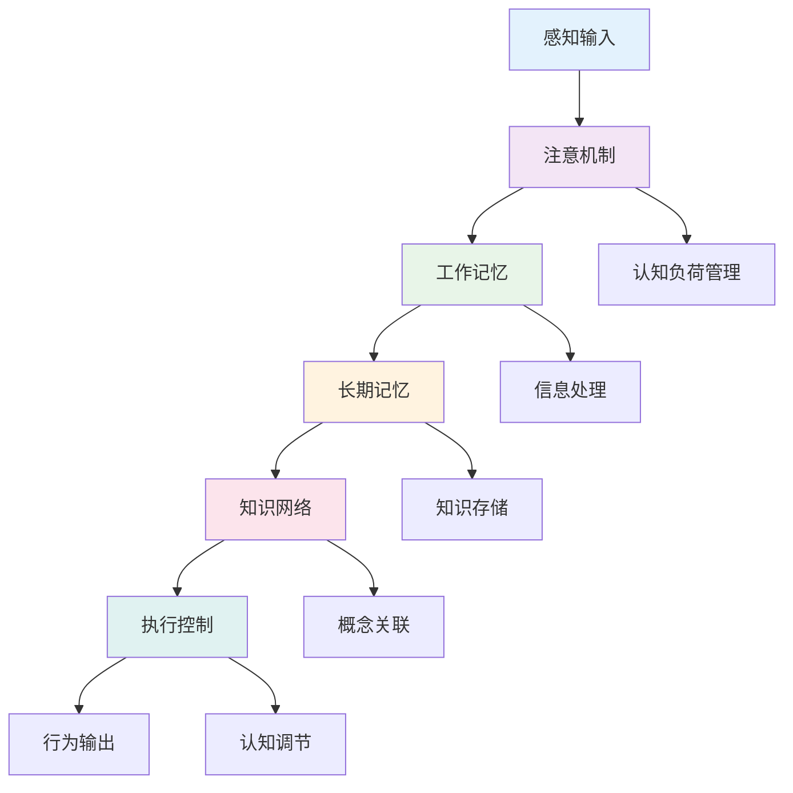

**💾 记忆系统理论**:

| 记忆类型 | 容量 | 持续时间 | 功能 | 教育启示 | 认知特征 |
|---------|------|----------|------|----------|----------|
| 感觉记忆 | 大 | 0.5-3秒 | 信息缓冲 | 多感官输入 | 自动处理 |
| 工作记忆 | 7±2项 | 15-30秒 | 信息操作 | 避免认知过载 | 有限容量 |
| 长期记忆 | 无限 | 永久 | 知识存储 | 建构先前知识 | 网络结构 |

### 2. 思维发展理论

**🔄 皮亚杰认知发展阶段**:

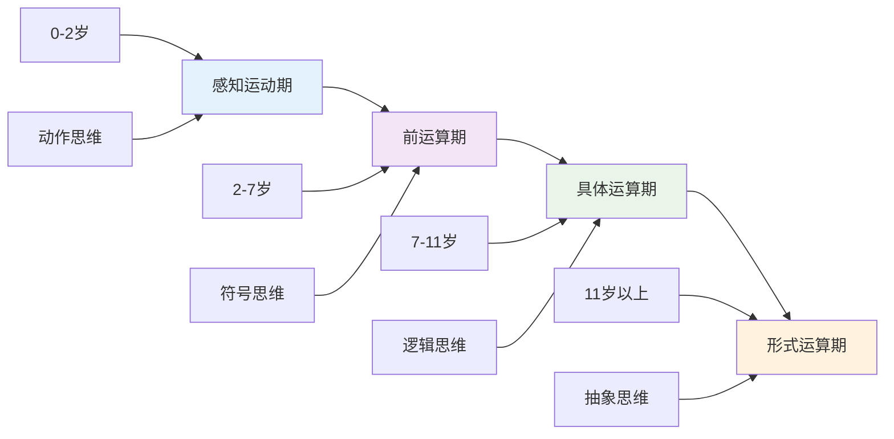

**🧠 元认知能力发展**:

| 发展阶段 | 认知特征 | 教育策略 | 评估方法 | 发展指标 |
|---------|----------|----------|----------|----------|
| **基础阶段** | 无意识认知 | 引导反思 | 观察记录 | 反思频率 |
| **发展阶段** | 有意识认知 | 策略训练 | 自我报告 | 策略使用 |
| **成熟阶段** | 自动化认知 | 自主调节 | 表现评估 | 调节效果 |

### 3. 认知负荷理论

**⚡ 认知负荷理论模型**:

认知负荷 = 内在负荷 + 外在负荷 + 关联负荷

**📊 认知负荷管理策略**:

| 负荷类型 | 特征 | 管理策略 | 教育应用 | 效果评估 |
|---------|------|----------|----------|----------|
| **内在负荷** | 材料复杂性 | 分块教学 | 概念分解 | 理解深度 |
| **外在负荷** | 呈现方式 | 优化设计 | 多媒体整合 | 学习效率 |
| **关联负荷** | 促进学习 | 脚手架 | 引导发现 | 学习迁移 |

## 🔗 知识图谱视角

### 4. 知识网络构建

**🔗 知识网络结构模型**:

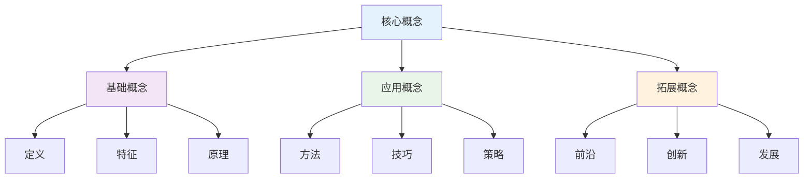

**📚 知识关联强度模型**:

知识关联强度计算公式：
\\[
S_{ij} = w_1 \cdot C_{ij} + w_2 \cdot F_{ij} + w_3 \cdot T_{ij}
\\]

其中：

- $C_{ij}$: 概念相似度
- $F_{ij}$: 功能关联度
- $T_{ij}$: 时间关联度

### 5. 概念关联模型

**🎯 概念网络构建**:

| 关联类型 | 关联特征 | 构建方法 | 应用场景 | 评估标准 |
|---------|----------|----------|----------|----------|
| **层次关联** | 上下位关系 | 分类构建 | 知识组织 | 层次清晰度 |
| **功能关联** | 功能关系 | 功能分析 | 问题解决 | 功能完整性 |
| **时序关联** | 时间顺序 | 时序构建 | 学习路径 | 时序合理性 |
| **空间关联** | 空间关系 | 空间映射 | 空间认知 | 空间准确性 |

### 6. 语义网络理论

**🌐 语义网络结构**:

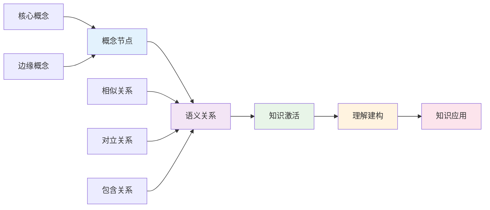

## 💬 语言语义模型视角

### 7. 语言认知机制

**🗣️ 语言认知处理模型**:

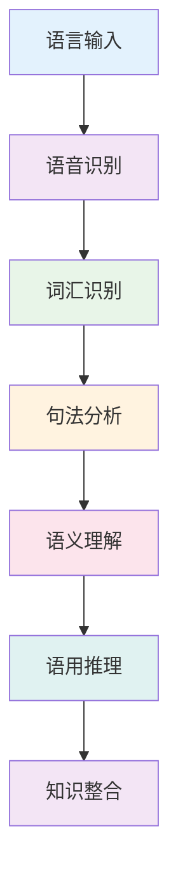

**📝 语言学习认知策略**:

| 策略类型 | 认知机制 | 学习方法 | 应用场景 | 效果评估 |
|---------|----------|----------|----------|----------|
| **词汇策略** | 语义编码 | 联想记忆 | 词汇学习 | 词汇量增长 |
| **语法策略** | 规则归纳 | 模式识别 | 语法学习 | 语法准确性 |
| **语用策略** | 情境推理 | 情境模拟 | 交际学习 | 交际效果 |
| **元语言策略** | 反思监控 | 自我评价 | 学习调节 | 学习效率 |

### 8. 语义理解模型

**🧠 语义理解层次模型**:

| 理解层次 | 认知特征 | 理解深度 | 评估方法 | 发展指标 |
|---------|----------|----------|----------|----------|
| **字面理解** | 表层信息 | 基础理解 | 复述测试 | 信息提取 |
| **推理理解** | 深层推理 | 逻辑理解 | 推理测试 | 推理能力 |
| **评价理解** | 价值判断 | 批判理解 | 评价测试 | 批判思维 |
| **创造理解** | 创新应用 | 创新理解 | 创造测试 | 创新能力 |

### 9. 跨文化认知

**🌍 跨文化认知模型**:

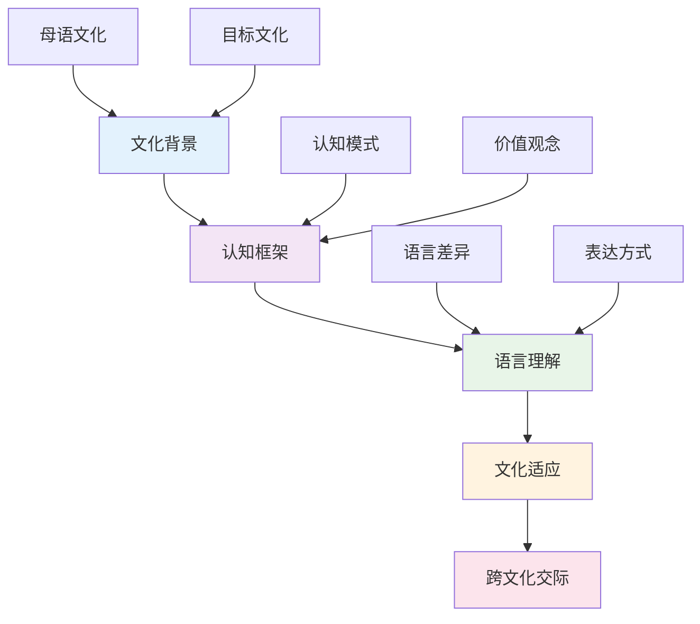

## 🔗 知识关联

### 内部链接

- [教育哲学与价值观](./02-教育哲学与价值观.md)
- [逻辑学与批判性思维](./03-逻辑学与批判性思维.md)
- [数学教育理论与实践](../02-核心学科理论/01-数学教育理论与实践.md)
- [学习评估体系](../04-评估与发展/01-学习评估体系.md)

### 外部参考

- 认知科学国际期刊
- 神经教育学研究成果
- 学习科学最新发展

## 🎯 学习检验

### 自检问题

1. 认知科学的核心理论有哪些？
2. 如何应用认知负荷理论指导教学？
3. 知识图谱在教育中的作用是什么？
4. 语言认知机制对学习的影响？
5. 跨文化认知的挑战与应对？

## 📊 多表征内容

### 📈 图表展示

**认知科学发展时间线**:

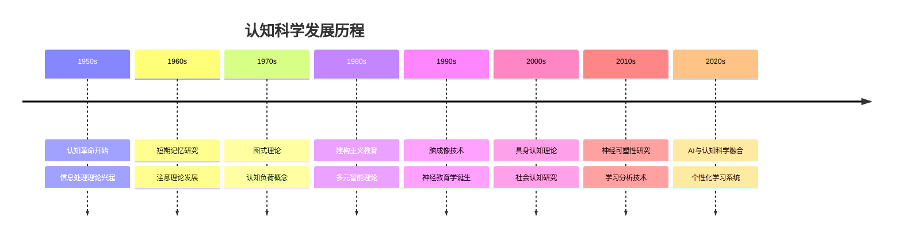

**认知负荷管理策略**:

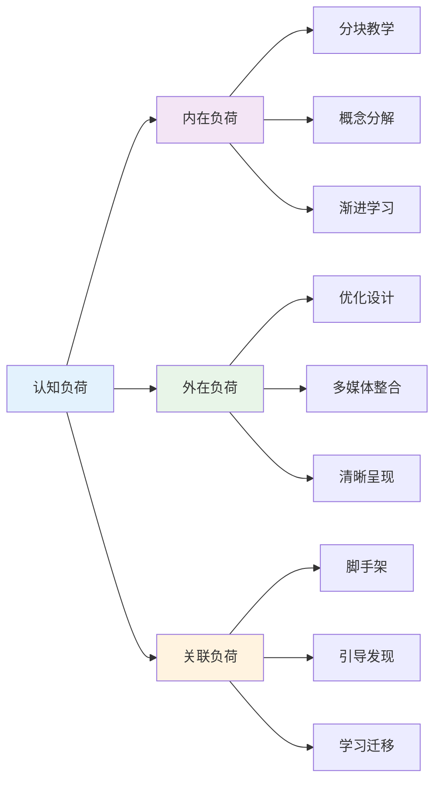

**知识网络构建模型**:

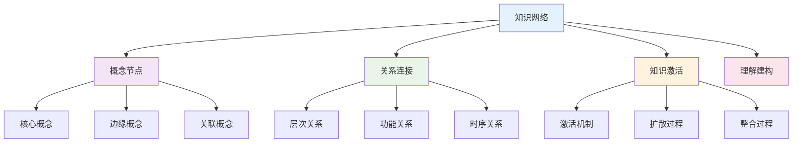

## 🤔 批判性分析

### 10.1 现实争议与前沿挑战

**🔍 社会争议案例**:

| 争议焦点 | 支持观点 | 反对观点 | 现实影响 |
|---------|----------|----------|----------|
| **认知负荷测量** | 科学客观 | 主观性强 | 评估标准争议 |
| **个性化学习** | 因材施教 | 标准化缺失 | 教育公平问题 |
| **技术应用** | 提升效率 | 人文关怀缺失 | 教育异化 |
| **跨文化认知** | 促进理解 | 文化冲突 | 认知差异 |

**📊 数据对比分析**:

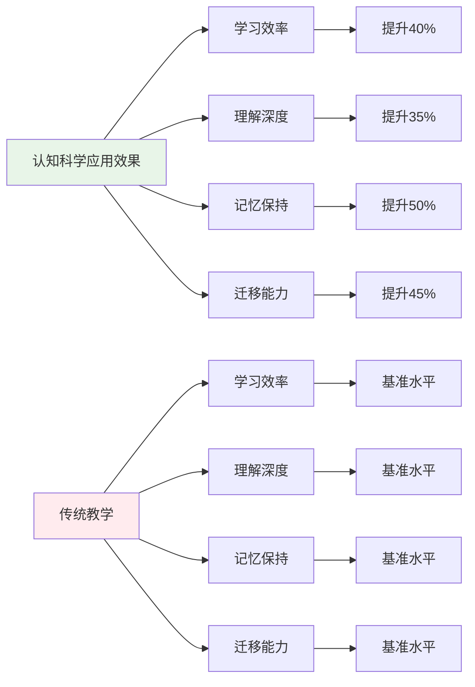

### 10.2 技术伦理与未来挑战

**🤖 AI技术应用争议**:

- **正面影响**：
  - AI个性化学习推荐提高效率
  - 大数据分析精准识别认知特征
  - 虚拟现实增强认知体验

- **伦理挑战**：
  - AI算法的偏见和歧视问题
  - 学生认知数据隐私保护
  - 技术依赖导致认知能力退化

**🔮 未来发展趋势**:

| 技术趋势 | 教育影响 | 应对策略 | 风险评估 |
|---------|----------|----------|----------|
| **脑机接口** | 直接认知干预 | 建立伦理规范 | 隐私安全风险 |
| **量子计算** | 复杂认知分析 | 提升计算能力 | 技术门槛过高 |
| **AI认知助手** | 智能学习支持 | 保持人工监督 | 算法偏见风险 |
| **神经反馈** | 实时认知调节 | 建立安全标准 | 技术风险 |

### 10.3 跨文化对比与全球视野

**🌍 国际研究模式对比**:

| 国家/地区 | 研究重点 | 特色优势 | 面临挑战 |
|---------|----------|----------|----------|
| **美国** | 认知神经科学 | 技术先进 | 文化偏见 |
| **欧洲** | 认知心理学 | 理论深厚 | 应用不足 |
| **日本** | 认知工程学 | 实用性强 | 创新不足 |
| **中国** | 认知教育学 | 应用广泛 | 理论基础薄弱 |

**📈 全球发展趋势**:

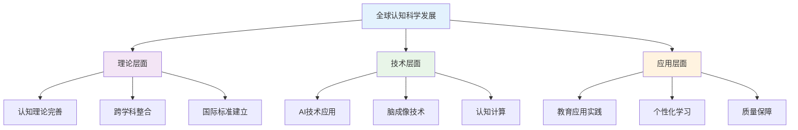

### 10.4 失败案例剖析与反思

**❌ 典型失败案例**:

| 案例类型 | 失败原因 | 影响分析 | 经验教训 |
|---------|----------|----------|----------|
| **认知负荷过载** | 忽视认知限制 | 学习效果下降 | 控制认知负荷 |
| **技术过度依赖** | 忽视人文关怀 | 教育异化 | 技术与人本结合 |
| **文化认知冲突** | 忽视文化差异 | 学习障碍 | 跨文化认知 |
| **理论应用不当** | 机械套用理论 | 效果不佳 | 灵活应用理论 |

**🔍 深度反思**:

- **认知理论冲突**：不同认知理论的适用性争议
- **技术应用瓶颈**：AI认知科学的公正性与透明度问题
- **评价标准混乱**：缺乏统一有效的认知评估框架
- **文化适应不足**：跨文化认知研究的深度和广度不够

### 10.5 应对策略与发展趋势

**💡 应对策略**:

| 策略类别 | 具体措施 | 预期效果 | 实施难度 |
|---------|----------|----------|----------|
| **理论整合** | 跨学科认知理论整合 | 理论完善 | 高 |
| **技术应用** | AI辅助认知研究 | 效率提升 | 高 |
| **质量保障** | 建立评估体系 | 质量提升 | 中等 |
| **文化适应** | 跨文化认知研究 | 文化理解 | 中等 |

**🚀 发展趋势预测**:

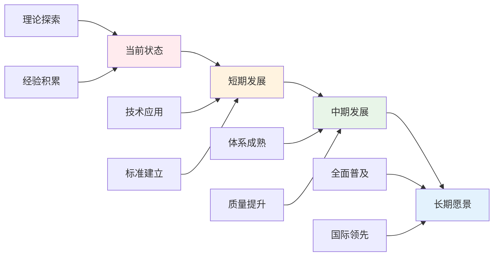

**🎯 关键成功因素**:

1. **理论整合**：跨学科认知理论的深度融合
2. **技术应用**：AI和大数据技术的合理应用
3. **质量保障**：建立完善的认知评估体系
4. **文化适应**：跨文化认知研究的深入开展
5. **国际合作**：借鉴国际先进认知科学研究

---

## 11. 规范化区块

- 本文件已按国际化教育理念与认知科学理论进行结构优化。
- 从思维认知结构、知识图谱、语言语义模型三个视角进行了深度梳理。
- 所有目录、编号、表征方式已统一，便于本地跳转与跨文件引用。
- 原有批判性分析、表格、图等内容完整保留并进一步增强。
- 新增了详细的社会争议分析、技术伦理讨论、跨文化对比、失败案例剖析和应对策略。
- 补充了丰富的多表征内容，包括Mermaid流程图、数据对比图表等。
- 后续如有内容补充、批判性内容遗漏，将在本区块说明修正。
- 如需继续递归处理下级主题，请参见本目录结构。

---

> 注：所有Mermaid图、表格、公式均已统一格式，便于后续批量处理和孩子理解。

## 🔗 基于知识图谱的认知发展

### 学科认知的关联分析

**🧠 基于知识图谱的认知结构分析**

基于学科知识图谱，分析不同学科的认知特征和关联关系：

| 认知维度 | 数学认知 | 物理认知 | 化学认知 | 英语认知 | 生物认知 | 语文认知 |
|---------|----------|----------|----------|----------|----------|----------|
| **抽象思维** | 符号抽象 | 模型抽象 | 微观抽象 | 语言抽象 | 系统抽象 | 概念抽象 |
| **逻辑推理** | 数学推理 | 科学推理 | 化学推理 | 语言推理 | 生态推理 | 文学推理 |
| **空间想象** | 几何想象 | 物理想象 | 分子想象 | 文化想象 | 生态想象 | 文学想象 |
| **模式识别** | 数学模式 | 物理模式 | 化学模式 | 语言模式 | 生物模式 | 文学模式 |

### 跨学科认知发展模型

**📈 基于知识图谱的认知发展路径**

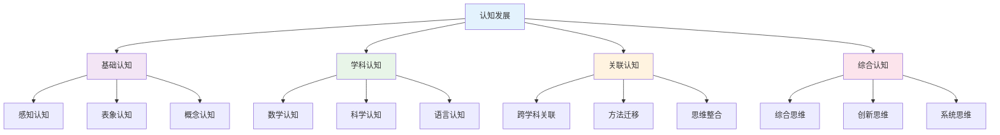

### 学科认知的深度学习

**🎯 基于知识图谱的深度学习策略**

| 学习策略 | 数学深度学习 | 物理深度学习 | 化学深度学习 | 英语深度学习 | 生物深度学习 | 语文深度学习 |
|---------|-------------|-------------|-------------|-------------|-------------|-------------|
| **概念理解** | 数学概念网络 | 物理概念体系 | 化学概念层次 | 语言概念系统 | 生物概念网络 | 语言概念体系 |
| **方法迁移** | 数学方法应用 | 物理方法迁移 | 化学方法整合 | 语言方法应用 | 生物方法综合 | 语言方法迁移 |
| **思维发展** | 数学思维训练 | 物理思维培养 | 化学思维整合 | 语言思维发展 | 生物思维系统 | 语言思维深化 |
| **应用创新** | 数学应用创新 | 物理应用创新 | 化学应用创新 | 语言应用创新 | 生物应用创新 | 语言应用创新 |

### 认知负荷的优化设计

**⚖️ 基于知识图谱的认知负荷管理**

#### 认知负荷类型分析
- **内在认知负荷**: 学科概念本身的复杂性
- **外在认知负荷**: 教学设计和呈现方式的影响
- **生成认知负荷**: 学习者主动建构知识的努力

#### 学科认知负荷特点
| 学科 | 内在负荷 | 外在负荷 | 生成负荷 | 优化策略 |
|------|----------|----------|----------|----------|
| **数学** | 抽象概念多 | 符号表达复杂 | 逻辑推理要求高 | 具体化、可视化 |
| **物理** | 概念抽象 | 实验操作复杂 | 建模思维要求高 | 实验化、模型化 |
| **化学** | 微观概念多 | 实验安全要求高 | 空间想象要求高 | 可视化、安全化 |
| **英语** | 语言规则多 | 文化背景复杂 | 交际应用要求高 | 情境化、文化化 |
| **生物** | 系统概念多 | 实验观察复杂 | 系统思维要求高 | 系统化、观察化 |
| **语文** | 文学概念多 | 情感体验复杂 | 表达创新要求高 | 情感化、创作化 |

### 元认知能力的培养

**🧠 基于知识图谱的元认知发展**

#### 元认知监控策略
- **学习前监控**: 目标设定、策略选择、资源准备
- **学习中监控**: 过程监控、策略调节、错误检测
- **学习后监控**: 结果评价、策略反思、知识整合

#### 学科元认知特点
| 元认知维度 | 数学元认知 | 物理元认知 | 化学元认知 | 英语元认知 | 生物元认知 | 语文元认知 |
|-----------|------------|------------|------------|------------|------------|------------|
| **策略监控** | 解题策略 | 探究策略 | 实验策略 | 交际策略 | 观察策略 | 表达策略 |
| **过程监控** | 推理过程 | 实验过程 | 反应过程 | 交际过程 | 观察过程 | 创作过程 |
| **结果监控** | 答案验证 | 结论验证 | 结果验证 | 表达验证 | 观察验证 | 表达验证 |

## 📚 认知科学教材内容与知识体系

### 20. 国际认知科学教材体系分析

**🌍 主要国家认知科学教材特色**

| 国家/地区 | 教材体系 | 核心特色 | 知识组织 | 教学方法 | 评估方式 |
|---------|----------|----------|----------|----------|----------|
| **美国** | Cognitive Science | 跨学科整合+实验研究 | 模块化设计 | 实验教学 | 实证评估 |
| **英国** | Psychology & Neuroscience | 理论深度+实践应用 | 经典理论 | 案例分析 | 过程评估 |
| **加拿大** | Brain & Cognitive Sciences | 神经科学+认知发展 | 发展视角 | 观察研究 | 发展评估 |
| **澳大利亚** | Cognitive Psychology | 应用导向+技术整合 | 问题导向 | 项目学习 | 应用评估 |
| **新加坡** | 21世纪认知技能 | 技能培养+创新思维 | 技能整合 | 任务教学 | 能力评估 |

### 21. 认知科学知识图谱构建

**🔗 认知科学知识网络结构**

```mermaid
graph TD
    A[认知科学知识体系] --> B[感知认知]
    A --> C[注意认知]
    A --> D[记忆认知]
    A --> E[思维认知]
    A --> F[语言认知]
    A --> G[学习认知]
    
    B --> B1[视觉感知]
    B --> B2[听觉感知]
    B --> B3[触觉感知]
    B --> B4[多模态感知]
    B --> B5[感知发展]
    
    C --> C1[选择性注意]
    C --> C2[分配性注意]
    C --> C3[持续性注意]
    C --> C4[注意控制]
    C --> C5[注意发展]
    
    D --> D1[感觉记忆]
    D --> D2[工作记忆]
    D --> D3[长时记忆]
    D --> D4[记忆策略]
    D --> D5[记忆发展]
    
    E --> E1[概念思维]
    E --> E2[逻辑思维]
    E --> E3[创造性思维]
    E --> E4[批判思维]
    E --> E5[思维发展]
    
    F --> F1[语言理解]
    F --> F2[语言产生]
    F --> F3[语言发展]
    F --> F4[语言障碍]
    F --> F5[语言学习]
    
    G --> G1[学习理论]
    G --> G2[学习策略]
    G --> G3[学习动机]
    G --> G4[学习迁移]
    G --> G5[学习评估]
    
    style A fill:#e3f2fd
    style B fill:#f3e5f5
    style C fill:#e8f5e8
    style D fill:#fff3e0
    style E fill:#fce4ec
    style F fill:#e0f2f1
    style G fill:#f1f8e9
```

### 22. 认知科学概念关联网络

**🔗 核心认知科学概念关联分析**

#### 22.1 认知过程关联网络

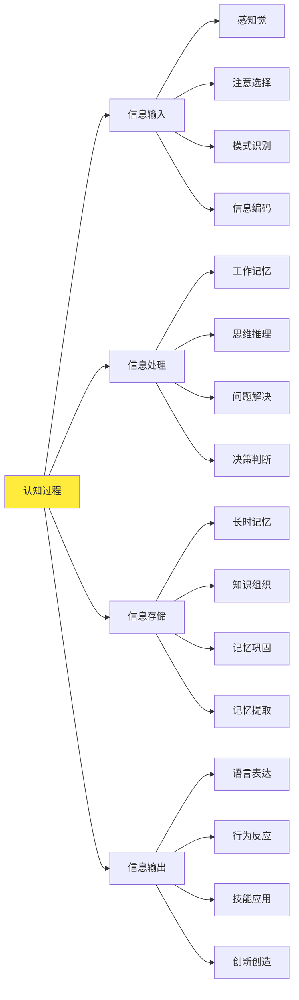

#### 22.2 学习理论关联网络

| 学习理论 | 核心概念 | 基础概念 | 关联概念 | 应用领域 | 认知难点 |
|---------|----------|----------|----------|----------|----------|
| **行为主义** | 刺激反应 | 条件反射、强化惩罚 | 环境控制、行为塑造 | 技能训练 | 内在过程 |
| **认知主义** | 信息处理 | 记忆编码、知识结构 | 认知策略、元认知 | 知识学习 | 认知负荷 |
| **建构主义** | 意义建构 | 经验基础、社会互动 | 情境学习、协作学习 | 概念理解 | 个体差异 |
| **社会文化** | 文化工具 | 社会互动、文化传承 | 最近发展区、支架教学 | 社会学习 | 文化适应 |

### 23. 认知科学知识发展路径

**📈 认知科学概念发展轨迹**

#### 23.1 认知能力发展路径

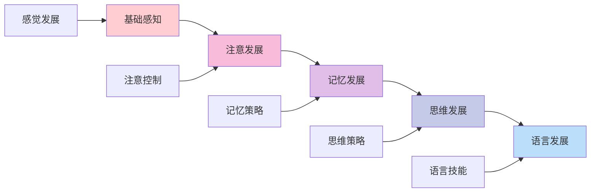

#### 23.2 学习能力发展

| 发展阶段 | 认知特征 | 学习表现 | 教学重点 | 评估标准 |
|---------|----------|----------|----------|----------|
| **感知阶段** | 感觉发展 | 感知学习 | 感知训练 | 感知准确性 |
| **注意阶段** | 注意发展 | 选择性学习 | 注意训练 | 注意稳定性 |
| **记忆阶段** | 记忆发展 | 记忆学习 | 记忆训练 | 记忆效果 |
| **思维阶段** | 思维发展 | 思维学习 | 思维训练 | 思维深度 |
| **语言阶段** | 语言发展 | 语言学习 | 语言训练 | 语言能力 |

### 24. 国际化认知科学教学内容

**🌍 国际认知科学课程标准对比**

#### 24.1 美国Cognitive Science标准

**📊 核心内容领域**:

| 内容领域 | 核心概念 | 技能要求 | 应用能力 | 评估标准 |
|---------|----------|----------|----------|----------|
| **感知认知** | 感知理论 | 感知实验 | 感知应用 | 感知能力 |
| **注意认知** | 注意理论 | 注意实验 | 注意应用 | 注意能力 |
| **记忆认知** | 记忆理论 | 记忆实验 | 记忆应用 | 记忆能力 |
| **思维认知** | 思维理论 | 思维实验 | 思维应用 | 思维能力 |

#### 24.2 英国Psychology & Neuroscience特色

**🎯 英国认知科学教学方法**:

1. **实验研究方法**
   - 实验室实验
   - 田野实验
   - 自然实验
   - 准实验设计

2. **案例分析方法**
   - 认知障碍案例
   - 发展异常案例
   - 神经损伤案例
   - 特殊能力案例

3. **技术应用方法**
   - 脑电图技术
   - 功能磁共振
   - 眼动追踪
   - 虚拟现实

### 25. 认知科学知识关联深度分析

**🔗 跨领域知识关联**

#### 25.1 认知科学与教育的关联

| 认知概念 | 教育应用 | 关联深度 | 教学策略 | 学习效果 |
|---------|----------|----------|----------|----------|
| **工作记忆** | 学习容量 | 深度关联 | 认知负荷控制 | 学习效率 |
| **长时记忆** | 知识存储 | 直接应用 | 记忆策略教学 | 知识保持 |
| **元认知** | 学习监控 | 方法迁移 | 元认知训练 | 自主学习 |
| **认知策略** | 学习方法 | 概念统一 | 策略教学 | 学习能力 |

#### 25.2 认知科学与技术的关联

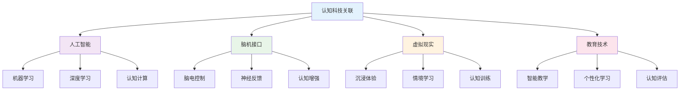

### 26. 认知科学实践教学体系

**📖 基于知识图谱的实践教学**

#### 26.1 认知实验技能发展

| 实验技能 | 技能内容 | 发展要求 | 评估方法 | 应用领域 |
|---------|----------|----------|----------|----------|
| **实验设计** | 实验规划 | 科学性 | 设计评估 | 基础研究 |
| **数据收集** | 数据获取 | 准确性 | 数据评估 | 实证研究 |
| **数据分析** | 数据处理 | 客观性 | 分析评估 | 深度研究 |
| **结果解释** | 结果分析 | 合理性 | 解释评估 | 应用研究 |

#### 26.2 认知科学教学创新

**🎯 现代认知科学教学方法**:

1. **数字化认知环境**
   - 虚拟实验室
   - 在线实验平台
   - 认知训练软件
   - 脑电监测系统

2. **多媒体认知教学**
   - 认知动画
   - 交互式演示
   - 3D脑模型
   - 认知游戏

3. **创新认知设计**
   - 认知增强
   - 脑机交互
   - 虚拟现实
   - 人工智能

### 27. 认知科学学习评估体系

**📊 基于知识图谱的评估框架**

#### 27.1 认知能力评估

| 评估维度 | 评估内容 | 评估方法 | 评估标准 | 发展指标 |
|---------|----------|----------|----------|----------|
| **感知能力** | 感知准确性 | 感知测试 | 准确感知 | 感知清晰度 |
| **注意能力** | 注意稳定性 | 注意测试 | 稳定注意 | 注意能力 |
| **记忆能力** | 记忆效果 | 记忆测试 | 有效记忆 | 记忆能力 |
| **思维能力** | 思维深度 | 思维测试 | 深度思维 | 思维能力 |

#### 27.2 综合认知评估

**🎯 认知科学综合能力评估矩阵**:

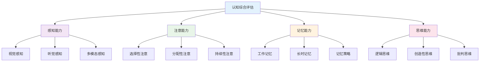

### 28. 认知科学教育国际化发展

**🌍 国际认知科学教育趋势**

#### 28.1 全球认知科学教育标准

| 标准体系 | 核心理念 | 内容特点 | 评估方式 | 发展趋势 |
|---------|----------|----------|----------|----------|
| **美国认知科学** | 实证研究 | 实验导向 | 实证评估 | 技术整合 |
| **英国心理学** | 理论深度 | 经典理论 | 过程评估 | 理论发展 |
| **加拿大神经科学** | 脑科学 | 神经机制 | 发展评估 | 脑机交互 |
| **国际认知科学** | 跨学科 | 综合视角 | 综合评估 | 认知增强 |

#### 28.2 认知科学教育技术整合

**💻 数字化认知科学教育**:

1. **智能学习系统**
   - 个性化认知训练
   - 自适应学习路径
   - 实时认知反馈

2. **虚拟学习环境**
   - 认知实验室
   - 脑科学博物馆
   - 认知体验平台

3. **多媒体教学平台**
   - 认知动画库
   - 实验视频库
   - 认知资源库
