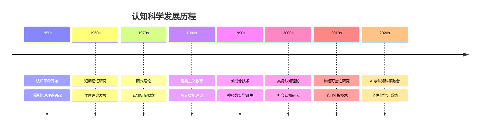
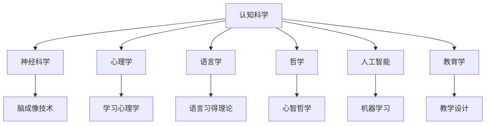
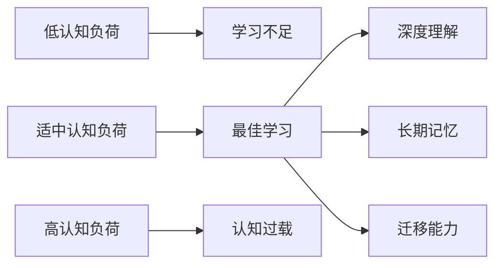
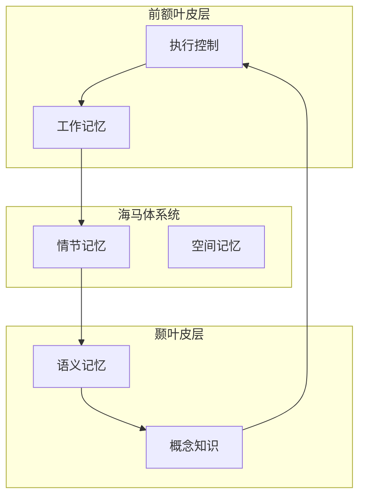

# 01 认知科学与学习理论

## 📖 概述

- **定义**: 认知科学是研究人类如何获取、处理、存储和运用知识的跨学科领域，为现代教育提供科学基础
- **范围**: 涵盖神经科学、心理学、语言学、哲学、人工智能等多个学科的整合性研究
- **学习目标**:
  - 理解大脑学习的生物机制
  - 掌握认知负荷理论及其教育应用
  - 应用多元智能理论指导个性化学习
  - 建立基于证据的学习策略
- **先修知识**: 基础生物学、心理学概念

## 🏗️ 知识架构

### 1. 理论基础

#### 1.1 核心概念

**🧠 认知架构模型**

认知科学将人类认知系统理解为信息处理系统：

```
输入(感知) → 工作记忆 → 长期记忆 → 输出(行为/认知)
     ↓         ↑           ↓
   注意机制  ←→ 执行控制 ←→ 知识网络
```

**💾 记忆系统理论**

| 记忆类型 | 容量 | 持续时间 | 功能 | 教育启示 |
|---------|------|----------|------|----------|
| 感觉记忆 | 大 | 0.5-3秒 | 信息缓冲 | 多感官输入 |
| 工作记忆 | 7±2项 | 15-30秒 | 信息操作 | 避免认知过载 |
| 长期记忆 | 无限 | 永久 | 知识存储 | 建构先前知识 |

#### 1.2 基本原理

**🔄 建构主义学习原理**

学习是主动建构知识的过程，而非被动接受：

\[
\text{新知识} = f(\text{先前知识}, \text{新信息}, \text{认知操作})
\]

**⚡ 认知负荷理论**

认知负荷 = 内在负荷 + 外在负荷 + 关联负荷

- **内在负荷**: 材料本身的复杂性
- **外在负荷**: 呈现方式造成的额外负担
- **关联负荷**: 促进学习的认知处理

#### 1.3 发展历程

**🕰️ 认知科学发展时间线**



### 2. 实践应用

#### 2.1 应用场景

**🎯 认知负荷管理策略**

1. **分块教学法** (Chunking)
   - 将复杂信息分解为小块
   - 例：数学公式 $E = mc^2$ 分解为 $E$（能量）、$m$（质量）、$c^2$（光速平方）

2. **脚手架支持** (Scaffolding)
   - 提供临时性支持框架
   - 逐步转移学习责任给学生

3. **多模态呈现**
   - 视觉 + 听觉 + 动觉结合
   - 激活不同感官通道

#### 2.2 方法技巧

**📚 间隔重复学习**

基于遗忘曲线的科学复习策略：

| 复习间隔 | 记忆保持率 | 最佳时机 |
|---------|------------|----------|
| 1天后 | 58% | 初学后24小时 |
| 1周后 | 44% | 第7天 |
| 1月后 | 36% | 第30天 |
| 6月后 | 28% | 第180天 |

**🎨 双重编码理论应用**

文字信息 + 视觉信息 = 更强记忆效果

```
抽象概念 → 具体意象 → 多重编码 → 深度理解
```

#### 2.3 案例分析

**📊 案例：数学概念的认知科学教学**

**传统方法 vs 认知科学方法**

| 维度 | 传统方法 | 认知科学方法 |
|------|----------|--------------|
| 概念引入 | 直接给出公式 | 从具体问题出发 |
| 练习设计 | 重复计算 | 变式练习 |
| 错误处理 | 纠正答案 | 分析思维过程 |
| 评估方式 | 结果导向 | 过程导向 |

### 3. 深入拓展

#### 3.1 前沿发展

**🧬 神经教育学前沿**

1. **神经可塑性与学习**
   - 大脑终生可塑性证据
   - 学习改变大脑结构和功能

2. **执行功能训练**
   - 工作记忆训练
   - 注意控制能力培养
   - 认知灵活性提升

3. **情绪与认知交互**
   - 情绪调节对学习的影响
   - 积极情绪促进创造性思维

#### 3.2 跨学科联系

**🔗 与其他领域的关联**



#### 3.3 批判性思考

**🤔 认知科学理论的局限性**

1. **个体差异问题**
   - 理论多基于平均效应
   - 需要考虑个体认知风格

2. **文化背景影响**
   - 认知模式的文化特异性
   - 东西方思维差异

3. **技术应用伦理**
   - 神经技术的教育应用边界
   - 隐私保护与学习监测

## 📊 多表征内容

### 📈 图表展示

**认知负荷与学习效果关系图**



### 🔢 数学表达

**学习效率公式**

\[
L_e = \frac{K_a \times M_q}{C_l + D_f}
\]

其中：

- $L_e$ = 学习效率
- $K_a$ = 知识获得量
- $M_q$ = 记忆质量
- $C_l$ = 认知负荷
- $D_f$ = 干扰因子

### 🎨 可视化元素

**大脑学习网络示意图**



## 🔗 知识关联

### 内部链接

- [02-教育哲学与价值观](./02-教育哲学与价值观.md) - 理论基础的哲学支撑
- [03-逻辑学与批判性思维](./03-逻辑学与批判性思维.md) - 认知技能的逻辑基础
- [数学教育理论与实践](../02-核心学科理论/01-数学教育理论与实践.md) - 认知理论的具体应用

### 外部参考

- Sweller, J. (2011). Cognitive Load Theory. *Psychology of Learning and Motivation*, 55, 37-76.
- Clark, R. C., & Mayer, R. E. (2016). *E-learning and the Science of Instruction*. Wiley.
- Bransford, J. D., et al. (2000). *How People Learn: Brain, Mind, Experience, and School*. National Academy Press.

## 🎯 学习检验

### 自检问题

1. **概念理解**: 认知负荷理论如何指导教学设计？
2. **原理应用**: 如何运用双重编码理论提高学习效果？
3. **批判思维**: 认知科学理论在教育实践中面临哪些挑战？

### 实践练习

- **基础练习**: 设计一个符合认知负荷理论的微课程
- **应用练习**: 分析一个学科概念的认知加工过程
- **拓展练习**: 比较不同文化背景下的认知模式差异

## 📚 参考资源

- [1] 《认知科学导论》- Thagard, P.
- [2] 《学习的科学》- 美国国家研究委员会
- [3] 《神经教育学》- Howard-Jones, P.
- [4] International Mind, Brain, and Education Society (IMBES)
- [5] Journal of Cognitive Science in Education

---
*符合认知发展规律 | 多表征学习 | 循序渐进设计*
