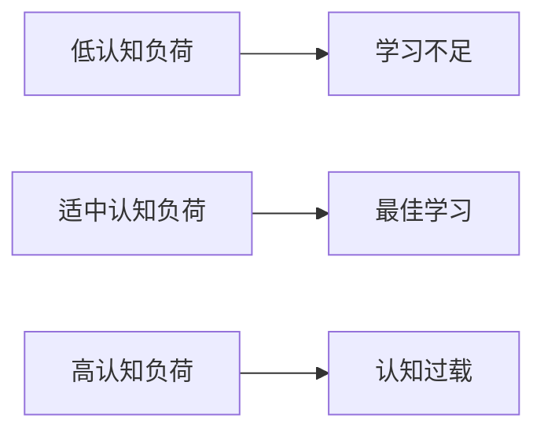

# 01-认知科学与学习理论

## 目录

- [01-认知科学与学习理论](#01-认知科学与学习理论)
  - [目录](#目录)
  - [1. 概述](#1-概述)
  - [2. 理论基础](#2-理论基础)
    - [2.1 核心概念](#21-核心概念)
    - [2.2 基本原理](#22-基本原理)
    - [2.3 发展历程](#23-发展历程)
  - [3. 实践应用](#3-实践应用)
    - [3.1 应用场景](#31-应用场景)
    - [3.2 方法技巧](#32-方法技巧)
    - [3.3 案例分析](#33-案例分析)
  - [4. 深入拓展](#4-深入拓展)
    - [4.1 前沿发展](#41-前沿发展)
    - [4.2 跨学科联系](#42-跨学科联系)
    - [4.3 批判性思考](#43-批判性思考)
  - [5. 多表征内容](#5-多表征内容)
    - [5.1 图表展示](#51-图表展示)

---

## 1. 概述

- **定义**: 认知科学是研究人类如何获取、处理、存储和运用知识的跨学科领域，为现代教育提供科学基础
- **范围**: 涵盖神经科学、心理学、语言学、哲学、人工智能等多个学科的整合性研究
- **学习目标**:
  - 理解大脑学习的生物机制
  - 掌握认知负荷理论及其教育应用
  - 应用多元智能理论指导个性化学习
  - 建立基于证据的学习策略
- **先修知识**: 基础生物学、心理学概念

## 2. 理论基础

### 2.1 核心概念

**🧠 认知架构模型**

认知科学将人类认知系统理解为信息处理系统：

```
输入(感知) → 工作记忆 → 长期记忆 → 输出(行为/认知)
     ↓         ↑           ↓
   注意机制  ←→ 执行控制 ←→ 知识网络
```

**💾 记忆系统理论**

| 记忆类型 | 容量 | 持续时间 | 功能 | 教育启示 |
|---------|------|----------|------|----------|
| 感觉记忆 | 大 | 0.5-3秒 | 信息缓冲 | 多感官输入 |
| 工作记忆 | 7±2项 | 15-30秒 | 信息操作 | 避免认知过载 |
| 长期记忆 | 无限 | 永久 | 知识存储 | 建构先前知识 |

> 建议补充：脑区结构图、经典实验流程图等视觉化内容

### 2.2 基本原理

**🔄 建构主义学习原理**

学习是主动建构知识的过程，而非被动接受：

\[
\text{新知识} = f(\text{先前知识}, \text{新信息}, \text{认知操作})
\]

**⚡ 认知负荷理论**

认知负荷 = 内在负荷 + 外在负荷 + 关联负荷

- **内在负荷**: 材料本身的复杂性
- **外在负荷**: 呈现方式造成的额外负担
- **关联负荷**: 促进学习的认知处理

### 2.3 发展历程

**🕰️ 认知科学发展时间线**


> 建议补充：国际最新研究动态的表格或时间线

## 3. 实践应用

### 3.1 应用场景

**🎯 认知负荷管理策略**

1. **分块教学法** (Chunking)
   - 将复杂信息分解为小块
   - 例：数学公式 $E = mc^2$ 分解为 $E$（能量）、$m$（质量）、$c^2$（光速平方）

2. **脚手架支持** (Scaffolding)
   - 提供临时性支持框架
   - 逐步转移学习责任给学生

3. **多模态呈现**
   - 视觉 + 听觉 + 动觉结合
   - 激活不同感官通道

### 3.2 方法技巧

**📚 间隔重复学习**

基于遗忘曲线的科学复习策略：

| 复习间隔 | 记忆保持率 | 最佳时机 |
|---------|------------|----------|
| 1天后 | 58% | 初学后24小时 |
| 1周后 | 44% | 第7天 |
| 1月后 | 36% | 第30天 |
| 6月后 | 28% | 第180天 |

**🎨 双重编码理论应用**

文字信息 + 视觉信息 = 更强记忆效果

```
抽象概念 → 具体意象 → 多重编码 → 深度理解
```

> 建议补充：实际课堂案例流程图

### 3.3 案例分析

**📊 案例：数学概念的认知科学教学**

**传统方法 vs 认知科学方法**

| 维度 | 传统方法 | 认知科学方法 |
|------|----------|--------------|
| 概念引入 | 直接给出公式 | 从具体问题出发 |
| 练习设计 | 重复计算 | 变式练习 |
| 错误处理 | 纠正答案 | 分析思维过程 |
| 评估方式 | 结果导向 | 过程导向 |

## 4. 深入拓展

### 4.1 前沿发展

**🧬 神经教育学前沿**

1. **神经可塑性与学习**
   - 大脑终生可塑性证据
   - 学习改变大脑结构和功能

2. **执行功能训练**
   - 工作记忆训练
   - 注意控制能力培养
   - 认知灵活性提升

3. **情绪与认知交互**
   - 情绪调节对学习的影响
   - 积极情绪促进创造性思维

> 建议补充：国际前沿动态、脑成像示意图

### 4.2 跨学科联系

**🔗 与其他领域的关联**


### 4.3 批判性思考

**🤔 认知科学理论的局限性**

1. **个体差异问题**
   - 理论多基于平均效应
   - 需要考虑个体认知风格

2. **文化背景影响**
   - 认知模式的文化特异性
   - 东西方思维差异

3. **技术应用伦理**
   - 神经技术的教育应用边界
   - 隐私保护与学习监测

## 5. 多表征内容

### 5.1 图表展示

**认知负荷与学习效果关系图**



---

> 本文档已按规范化结构整理，后续可持续补充多表征内容与国际前沿案例。
