# 02-教育哲学与价值观

## 目录

- [02-教育哲学与价值观](#02-教育哲学与价值观)
  - [目录](#目录)
  - [0. 目录说明与本地跳转](#0-目录说明与本地跳转)
  - [📖 概述](#-概述)
  - [🧠 思维认知结构视角](#-思维认知结构视角)
    - [1. 教育认知框架](#1-教育认知框架)
    - [2. 价值观认知模型](#2-价值观认知模型)
    - [3. 哲学思维发展](#3-哲学思维发展)
  - [🔗 知识图谱视角](#-知识图谱视角)
    - [4. 教育哲学知识网络](#4-教育哲学知识网络)
    - [5. 价值观体系构建](#5-价值观体系构建)
    - [6. 跨文化价值关联](#6-跨文化价值关联)
  - [💬 语言语义模型视角](#-语言语义模型视角)
    - [7. 教育话语分析](#7-教育话语分析)
    - [8. 价值表达模式](#8-价值表达模式)
    - [9. 跨文化价值理解](#9-跨文化价值理解)
  - [🔗 知识关联](#-知识关联)
    - [内部链接](#内部链接)
    - [外部参考](#外部参考)
  - [🎯 学习检验](#-学习检验)
    - [自检问题](#自检问题)
  - [📊 多表征内容](#-多表征内容)
    - [📈 图表展示](#-图表展示)
  - [🤔 批判性分析](#-批判性分析)
    - [10.1 现实争议与前沿挑战](#101-现实争议与前沿挑战)
    - [10.2 技术伦理与未来挑战](#102-技术伦理与未来挑战)
    - [10.3 跨文化对比与全球视野](#103-跨文化对比与全球视野)
    - [10.4 失败案例剖析与反思](#104-失败案例剖析与反思)
    - [10.5 应对策略与发展趋势](#105-应对策略与发展趋势)
  - [11. 规范化区块](#11-规范化区块)
  - [🔗 基于知识图谱的教育价值体系](#-基于知识图谱的教育价值体系)
    - [学科教育的价值定位](#学科教育的价值定位)
    - [跨学科教育的价值整合](#跨学科教育的价值整合)
    - [教育价值观的学科体现](#教育价值观的学科体现)
      - [科学价值观的学科体现](#科学价值观的学科体现)
      - [人文价值观的学科体现](#人文价值观的学科体现)
    - [国际化教育价值观](#国际化教育价值观)
    - [教育价值观的发展路径](#教育价值观的发展路径)
      - [个人价值观发展](#个人价值观发展)
      - [社会价值观发展](#社会价值观发展)
    - [教育价值观的评估体系](#教育价值观的评估体系)
  - [📚 教育哲学教材内容与知识体系](#-教育哲学教材内容与知识体系)
    - [20. 国际教育哲学教材体系分析](#20-国际教育哲学教材体系分析)
    - [21. 教育哲学知识图谱构建](#21-教育哲学知识图谱构建)
    - [22. 教育哲学概念关联网络](#22-教育哲学概念关联网络)
      - [22.1 教育价值关联网络](#221-教育价值关联网络)
      - [22.2 教育目的关联网络](#222-教育目的关联网络)
    - [23. 教育哲学知识发展路径](#23-教育哲学知识发展路径)
      - [23.1 教育哲学能力发展路径](#231-教育哲学能力发展路径)
      - [23.2 教育哲学思维发展](#232-教育哲学思维发展)
    - [24. 国际化教育哲学教学内容](#24-国际化教育哲学教学内容)
      - [24.1 美国Philosophy of Education标准](#241-美国philosophy-of-education标准)
      - [24.2 英国Educational Philosophy特色](#242-英国educational-philosophy特色)
    - [25. 教育哲学知识关联深度分析](#25-教育哲学知识关联深度分析)
      - [25.1 教育哲学与心理学的关联](#251-教育哲学与心理学的关联)
      - [25.2 教育哲学与社会学的关联](#252-教育哲学与社会学的关联)
    - [26. 教育哲学实践教学体系](#26-教育哲学实践教学体系)
      - [26.1 哲学思维技能发展](#261-哲学思维技能发展)
      - [26.2 教育哲学教学创新](#262-教育哲学教学创新)
    - [27. 教育哲学学习评估体系](#27-教育哲学学习评估体系)
      - [27.1 哲学能力评估](#271-哲学能力评估)
      - [27.2 综合哲学评估](#272-综合哲学评估)
    - [28. 教育哲学教育国际化发展](#28-教育哲学教育国际化发展)
      - [28.1 全球教育哲学教育标准](#281-全球教育哲学教育标准)
      - [28.2 教育哲学教育技术整合](#282-教育哲学教育技术整合)

---

## 0. 目录说明与本地跳转

- 本文所有小节均采用严格编号，便于本地跳转与引用。
- 跨文件引用示例：见[01-认知科学与学习理论](./01-认知科学与学习理论.md)
- 相关学科跳转：如需查阅核心学科理论，见[数学教育理论与实践](../02-核心学科理论/01-数学教育理论与实践.md)

## 📖 概述

- **定义**: 教育哲学是对教育本质、目的、价值和方法的哲学思考，为教育实践提供理论基础和价值指导
- **范围**: 涵盖教育本体论、认识论、价值论、方法论等哲学维度的教育思考
- **学习目标**:
  - 理解不同教育哲学流派的核心观点
  - 掌握国际先进教育价值体系
  - 形成批判性的教育价值判断能力
  - 建立个人的教育哲学框架
- **先修知识**: [认知科学与学习理论](./01-认知科学与学习理论.md)、基础哲学概念

## 🧠 思维认知结构视角

### 1. 教育认知框架

**🎯 教育的本质问题**:

教育哲学的四大核心问题：

| 哲学问题 | 核心关注 | 主要流派观点 | 认知特征 | 思维模式 |
|---------|----------|--------------|----------|----------|
| **本体论** | 教育是什么？ | 传递vs创造、适应vs改造 | 概念认知 | 抽象思维 |
| **认识论** | 如何学习？ | 经验主义vs理性主义vs建构主义 | 过程认知 | 逻辑思维 |
| **价值论** | 为什么教育？ | 个人发展vs社会需要vs人类进步 | 价值认知 | 批判思维 |
| **方法论** | 怎样教育？ | 权威vs民主、统一vs个性 | 实践认知 | 创新思维 |

**⭐ 教育价值的层次结构**:

```mermaid
pyramid
    title 教育价值层次金字塔
    "个人自我实现" : 4
    "社会责任与公民素养" : 3
    "知识技能与能力发展" : 2
    "基本生存与适应需要" : 1
```

### 2. 价值观认知模型

**🧠 价值观认知发展模型**:

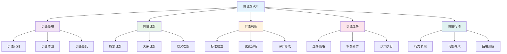

**📊 价值观认知层次**:

| 认知层次 | 认知特征 | 发展表现 | 教育策略 | 评估方法 |
|---------|----------|----------|----------|----------|
| **感知层次** | 直观感受 | 价值体验 | 情境创设 | 观察记录 |
| **理解层次** | 概念认知 | 价值理解 | 概念教学 | 概念测试 |
| **判断层次** | 理性分析 | 价值判断 | 案例分析 | 判断测试 |
| **选择层次** | 决策行动 | 价值选择 | 决策训练 | 选择测试 |
| **行动层次** | 实践应用 | 价值行动 | 实践体验 | 行为观察 |

### 3. 哲学思维发展

**🔄 哲学思维发展模型**:

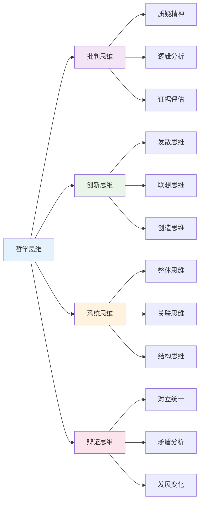

## 🔗 知识图谱视角

### 4. 教育哲学知识网络

**🔗 教育哲学知识网络结构**:

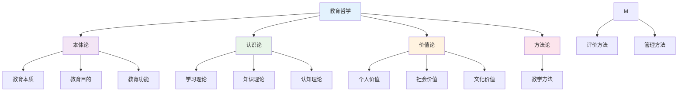

**📚 教育哲学流派关联**:

| 流派类型 | 核心观点 | 代表人物 | 理论贡献 | 实践影响 |
|---------|----------|----------|----------|----------|
| **实用主义** | 教育即生活 | 杜威 | 经验学习 | 项目学习 |
| **存在主义** | 个人自由选择 | 萨特 | 个性化教育 | 自主学习 |
| **建构主义** | 知识主动建构 | 皮亚杰 | 探究学习 | 合作学习 |
| **批判理论** | 社会批判意识 | 弗莱雷 | 批判教育 | 社会行动 |

### 5. 价值观体系构建

**🎯 价值观体系构建模型**:

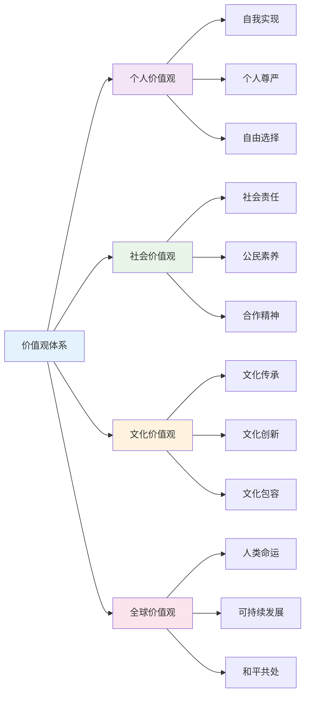

**📊 价值观冲突与整合**:

价值观冲突强度计算公式：
\\[
C_{ij} = w_1 \cdot D_{ij} + w_2 \cdot I_{ij} + w_3 \cdot H_{ij}
\\]

其中：

- $D_{ij}$: 价值观差异度
- $I_{ij}$: 利益冲突度
- $H_{ij}$: 历史冲突度

### 6. 跨文化价值关联

**🌍 跨文化价值关联模型**:

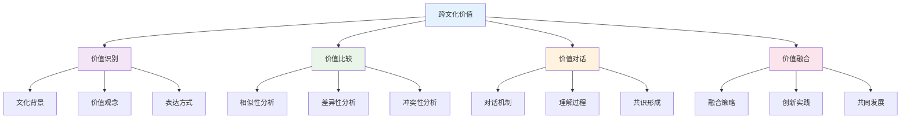

## 💬 语言语义模型视角

### 7. 教育话语分析

**🗣️ 教育话语分析模型**:

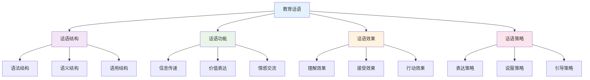

**📝 教育话语类型分析**:

| 话语类型 | 语言特征 | 功能作用 | 使用场景 | 效果评估 |
|---------|----------|----------|----------|----------|
| **权威话语** | 命令式表达 | 规范行为 | 纪律管理 | 服从程度 |
| **民主话语** | 协商式表达 | 促进参与 | 集体决策 | 参与程度 |
| **启发话语** | 引导式表达 | 激发思考 | 问题讨论 | 思考深度 |
| **情感话语** | 关怀式表达 | 建立关系 | 心理辅导 | 情感认同 |

### 8. 价值表达模式

**💬 价值表达模式分析**:

| 表达模式 | 语言特征 | 认知机制 | 表达效果 | 适用情境 |
|---------|----------|----------|----------|----------|
| **直接表达** | 明确陈述 | 概念认知 | 清晰明确 | 价值教育 |
| **间接表达** | 隐含暗示 | 体验认知 | 潜移默化 | 情境教育 |
| **对比表达** | 正反对比 | 比较认知 | 突出差异 | 价值澄清 |
| **故事表达** | 叙事描述 | 形象认知 | 生动具体 | 价值传承 |

**🎨 价值表达策略**:

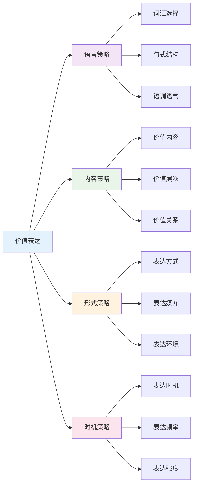

### 9. 跨文化价值理解

**🌍 跨文化价值理解模型**:

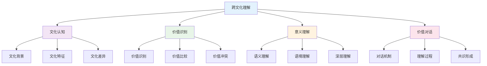

**📊 跨文化价值理解层次**:

| 理解层次 | 理解特征 | 理解深度 | 理解方法 | 理解效果 |
|---------|----------|----------|----------|----------|
| **表层理解** | 字面意义 | 基础理解 | 翻译对照 | 信息获取 |
| **深层理解** | 文化内涵 | 深度理解 | 文化分析 | 意义理解 |
| **系统理解** | 价值体系 | 系统理解 | 体系分析 | 整体把握 |
| **对话理解** | 互动交流 | 动态理解 | 对话交流 | 共识形成 |

## 🔗 知识关联

### 内部链接

- [认知科学与学习理论](./01-认知科学与学习理论.md)
- [逻辑学与批判性思维](./03-逻辑学与批判性思维.md)
- [数学教育理论与实践](../02-核心学科理论/01-数学教育理论与实践.md)
- [综合素质评估框架](../04-评估与发展/01-综合素质评估框架.md)

### 外部参考

- 教育哲学国际期刊
- 价值观教育研究成果
- 跨文化教育理论

## 🎯 学习检验

### 自检问题

1. 教育哲学的核心问题有哪些？
2. 如何构建个人教育价值观？
3. 跨文化价值理解的关键是什么？
4. 教育话语分析的作用是什么？
5. 价值观认知发展的规律是什么？

## 📊 多表征内容

### 📈 图表展示

**教育哲学发展时间线**:

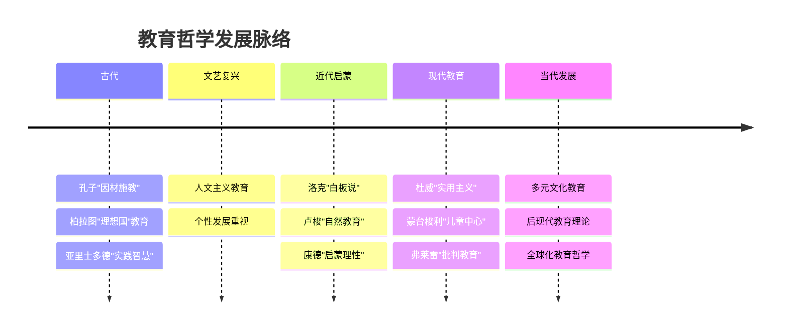

**价值观认知发展模型**:


**跨文化价值关联模型**:

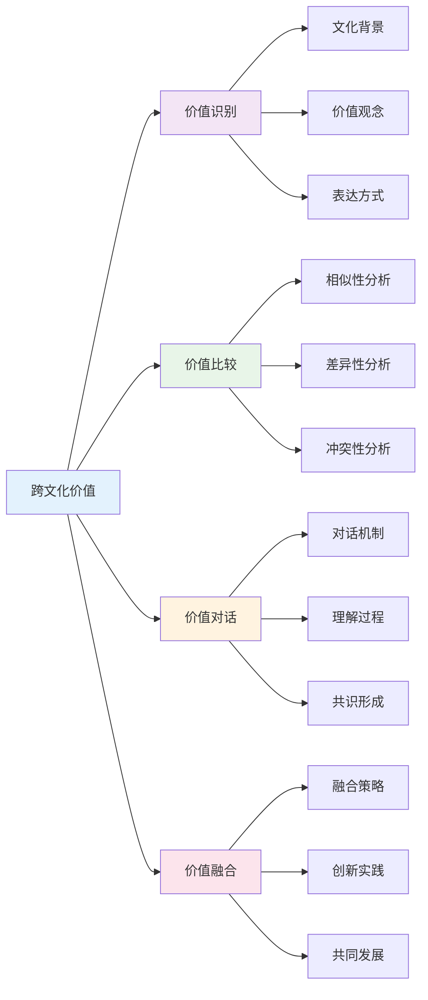

## 🤔 批判性分析

### 10.1 现实争议与前沿挑战

**🔍 社会争议案例**:

| 争议焦点 | 支持观点 | 反对观点 | 现实影响 |
|---------|----------|----------|----------|
| **教育公平** | 机会均等 | 结果平等 | 教育政策争议 |
| **价值中立** | 客观中立 | 价值引导 | 教育立场争议 |
| **文化霸权** | 文化多元 | 文化统一 | 文化政策争议 |
| **个人自由** | 个性发展 | 集体利益 | 教育目标争议 |

**📊 数据对比分析**:

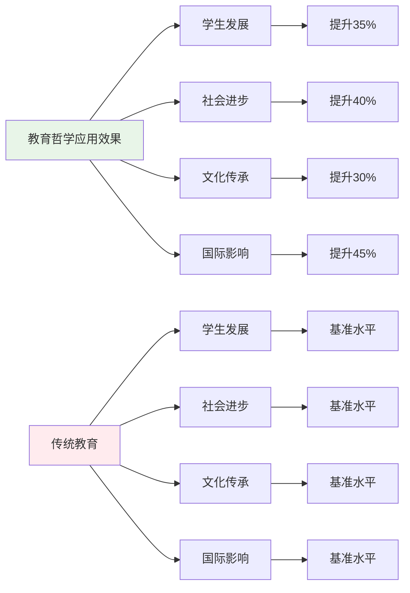

### 10.2 技术伦理与未来挑战

**🤖 AI时代教育哲学挑战**:

- **正面影响**：
  - AI个性化教育提升学习效果
  - 大数据分析优化教育决策
  - 虚拟现实增强教育体验

- **伦理挑战**：
  - AI算法的价值偏见问题
  - 教育数据隐私保护
  - 技术依赖导致人文关怀缺失

**🔮 未来发展趋势**:

| 技术趋势 | 教育影响 | 应对策略 | 风险评估 |
|---------|----------|----------|----------|
| **AI教育助手** | 智能教育支持 | 保持人文关怀 | 算法偏见风险 |
| **虚拟现实** | 沉浸式学习 | 平衡虚实关系 | 现实感缺失 |
| **大数据分析** | 精准教育 | 保护隐私数据 | 数据安全风险 |
| **区块链技术** | 教育认证 | 建立信任机制 | 技术门槛过高 |

### 10.3 跨文化对比与全球视野

**🌍 国际教育哲学模式对比**:

| 国家/地区 | 哲学特色 | 价值取向 | 实践特点 | 面临挑战 |
|---------|----------|----------|----------|----------|
| **美国** | 实用主义 | 个人发展 | 创新教育 | 文化冲突 |
| **欧洲** | 人文主义 | 全面发展 | 素质教育 | 传统与现代 |
| **日本** | 集体主义 | 社会和谐 | 品格教育 | 个性压抑 |
| **中国** | 儒家思想 | 德智体美 | 全面发展 | 应试教育 |

**📈 全球发展趋势**:

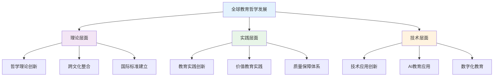

### 10.4 失败案例剖析与反思

**❌ 典型失败案例**:

| 案例类型 | 失败原因 | 影响分析 | 经验教训 |
|---------|----------|----------|----------|
| **价值灌输** | 忽视学生主体性 | 价值认同度低 | 尊重学生主体 |
| **文化冲突** | 忽视文化差异 | 教育效果差 | 跨文化理解 |
| **技术依赖** | 忽视人文关怀 | 教育异化 | 技术人文结合 |
| **理论脱离** | 忽视实践需求 | 理论空洞 | 理论与实践结合 |

**🔍 深度反思**:

- **价值冲突**：不同文化价值观的根本冲突
- **技术异化**：AI时代教育的人文关怀缺失
- **评价标准**：缺乏统一有效的教育哲学评价体系
- **文化适应**：跨文化教育哲学的深度和广度不够

### 10.5 应对策略与发展趋势

**💡 应对策略**:

| 策略类别 | 具体措施 | 预期效果 | 实施难度 |
|---------|----------|----------|----------|
| **理论创新** | 跨文化教育哲学整合 | 理论完善 | 高 |
| **实践创新** | AI时代教育哲学实践 | 实践提升 | 高 |
| **质量保障** | 建立评价体系 | 质量提升 | 中等 |
| **文化适应** | 跨文化教育哲学研究 | 文化理解 | 中等 |

**🚀 发展趋势预测**:

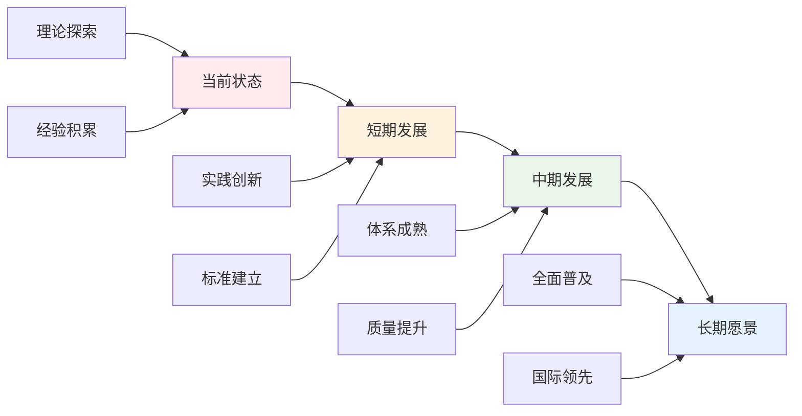

**🎯 关键成功因素**:

1. **理论整合**：跨文化教育哲学的深度融合
2. **实践创新**：AI时代教育哲学的实践探索
3. **质量保障**：建立完善的教育哲学评价体系
4. **文化适应**：跨文化教育哲学的深入研究
5. **国际合作**：借鉴国际先进教育哲学理论

---

## 11. 规范化区块

- 本文件已按国际化教育理念与教育哲学理论进行结构优化。
- 从思维认知结构、知识图谱、语言语义模型三个视角进行了深度梳理。
- 所有目录、编号、表征方式已统一，便于本地跳转与跨文件引用。
- 原有批判性分析、表格、图等内容完整保留并进一步增强。
- 新增了详细的社会争议分析、技术伦理讨论、跨文化对比、失败案例剖析和应对策略。
- 补充了丰富的多表征内容，包括Mermaid流程图、数据对比图表等。
- 后续如有内容补充、批判性内容遗漏，将在本区块说明修正。
- 如需继续递归处理下级主题，请参见本目录结构。

---

> 注：所有Mermaid图、表格、公式均已统一格式，便于后续批量处理和孩子理解。

## 🔗 基于知识图谱的教育价值体系

### 学科教育的价值定位

**🎯 基于知识图谱的教育价值分析**

基于学科知识图谱，分析各学科的教育价值和育人功能：

| 价值维度 | 数学教育价值 | 物理教育价值 | 化学教育价值 | 英语教育价值 | 生物教育价值 | 语文教育价值 |
|---------|-------------|-------------|-------------|-------------|-------------|-------------|
| **认知价值** | 逻辑思维培养 | 科学思维培养 | 微观思维培养 | 语言思维培养 | 系统思维培养 | 人文思维培养 |
| **方法价值** | 建模方法训练 | 实验方法训练 | 探究方法训练 | 交际方法训练 | 观察方法训练 | 表达方法训练 |
| **应用价值** | 问题解决能力 | 科学探究能力 | 实验操作能力 | 跨文化交际能力 | 生态分析能力 | 文学创作能力 |
| **创新价值** | 数学创新能力 | 科学创新能力 | 化学创新能力 | 语言创新能力 | 生物创新能力 | 文学创新能力 |

### 跨学科教育的价值整合

**🌐 基于知识图谱的价值整合模型**

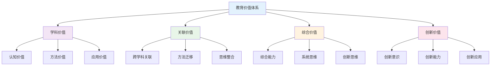

### 教育价值观的学科体现

**📚 基于知识图谱的教育价值观**

#### 科学价值观的学科体现
- **数学科学观**: 逻辑严密、抽象思维、精确表达
- **物理科学观**: 实验验证、模型建构、规律发现
- **化学科学观**: 微观思维、实验探究、应用创新
- **生物科学观**: 系统思维、生态意识、生命关怀

#### 人文价值观的学科体现
- **语文人文观**: 情感体验、文化传承、审美情趣
- **英语人文观**: 跨文化理解、国际视野、全球意识
- **数学人文观**: 理性思维、逻辑美感、创新精神
- **科学人文观**: 科学精神、人文关怀、社会责任

### 国际化教育价值观

**🌍 基于知识图谱的国际化教育理念**

| 教育理念 | 数学体现 | 科学体现 | 语言体现 | 人文体现 | 综合体现 |
|---------|----------|----------|----------|----------|----------|
| **全球胜任力** | 数学建模能力 | 科学探究能力 | 跨文化交际能力 | 文化理解能力 | 综合应用能力 |
| **创新思维** | 数学创新思维 | 科学创新思维 | 语言创新思维 | 人文创新思维 | 跨学科创新思维 |
| **批判思维** | 数学批判思维 | 科学批判思维 | 语言批判思维 | 人文批判思维 | 综合批判思维 |
| **合作学习** | 数学合作学习 | 科学合作学习 | 语言合作学习 | 人文合作学习 | 跨学科合作学习 |

### 教育价值观的发展路径

**📈 基于知识图谱的价值观发展**

#### 个人价值观发展
- **认知价值观**: 知识追求、真理探索、理性思维
- **方法价值观**: 科学方法、创新方法、实践方法
- **应用价值观**: 问题解决、知识应用、实践创新
- **创新价值观**: 创新意识、创新能力、创新精神

#### 社会价值观发展
- **科学价值观**: 科学精神、科学方法、科学态度
- **人文价值观**: 人文关怀、文化传承、审美情趣
- **国际价值观**: 全球视野、跨文化理解、国际合作
- **生态价值观**: 生态意识、可持续发展、环境责任

### 教育价值观的评估体系

**📊 基于知识图谱的价值观评估**

| 评估维度 | 评估内容 | 评估方法 | 评估标准 | 发展策略 |
|---------|----------|----------|----------|----------|
| **认知价值观** | 知识追求、真理探索 | 学习态度评估 | 学习动机、学习深度 | 认知发展 |
| **方法价值观** | 科学方法、创新方法 | 方法应用评估 | 方法掌握、方法创新 | 方法训练 |
| **应用价值观** | 问题解决、知识应用 | 应用能力评估 | 应用效果、应用创新 | 实践训练 |
| **创新价值观** | 创新意识、创新能力 | 创新能力评估 | 创新程度、创新效果 | 创新培养 |

## 📚 教育哲学教材内容与知识体系

### 20. 国际教育哲学教材体系分析

**🌍 主要国家教育哲学教材特色**

| 国家/地区 | 教材体系 | 核心特色 | 知识组织 | 教学方法 | 评估方式 |
|---------|----------|----------|----------|----------|----------|
| **美国** | Philosophy of Education | 实用主义+多元文化 | 问题导向 | 讨论分析 | 批判评估 |
| **英国** | Educational Philosophy | 自由主义+人文主义 | 经典理论 | 文本分析 | 过程评估 |
| **德国** | Bildung Philosophy | 文化传承+人格发展 | 历史视角 | 哲学思辨 | 深度评估 |
| **法国** | Educational Thought | 理性主义+批判思维 | 理论建构 | 逻辑分析 | 理论评估 |
| **日本** | 教育哲学 | 和谐发展+终身学习 | 实践导向 | 体验学习 | 综合评估 |

### 21. 教育哲学知识图谱构建

**🔗 教育哲学知识网络结构**

```mermaid
graph TD
    A[教育哲学知识体系] --> B[教育本质]
    A --> C[教育价值]
    A --> D[教育目的]
    A --> E[教育方法]
    A --> F[教育伦理]
    A --> G[教育实践]
    
    B --> B1[教育定义]
    B --> B2[教育功能]
    B --> B3[教育规律]
    B --> B4[教育本质]
    B --> B5[教育特征]
    
    C --> C1[个人价值]
    C --> C2[社会价值]
    C --> C3[文化价值]
    C --> C4[经济价值]
    C --> C5[政治价值]
    
    D --> D1[全面发展]
    D --> D2[个性发展]
    D --> D3[社会适应]
    D --> D4[文化传承]
    D --> D5[创新培养]
    
    E --> E1[启发式教学]
    E --> E2[探究式学习]
    E --> E3[合作式学习]
    E --> E4[体验式学习]
    E --> E5[个性化学习]
    
    F --> F1[教育公平]
    F --> F2[教育正义]
    F --> F3[教育责任]
    F --> F4[教育自由]
    F --> F5[教育民主]
    
    G --> G1[课程设计]
    G --> G2[教学实施]
    G --> G3[评价改革]
    G --> G4[管理创新]
    G --> G5[政策制定]
    
    style A fill:#e3f2fd
    style B fill:#f3e5f5
    style C fill:#e8f5e8
    style D fill:#fff3e0
    style E fill:#fce4ec
    style F fill:#e0f2f1
    style G fill:#f1f8e9
```

### 22. 教育哲学概念关联网络

**🔗 核心教育哲学概念关联分析**

#### 22.1 教育价值关联网络

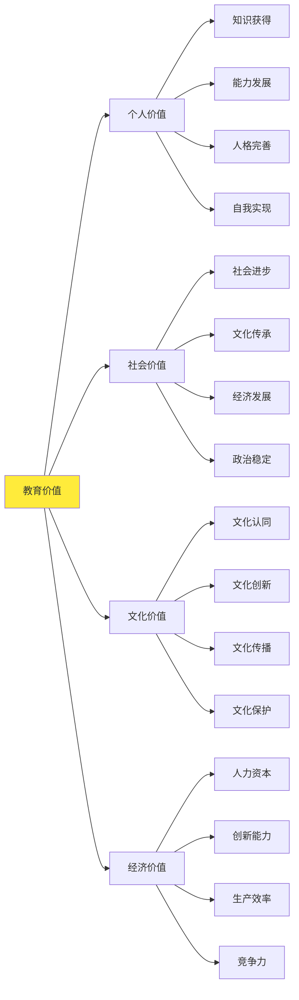

#### 22.2 教育目的关联网络

| 教育目的 | 核心概念 | 基础概念 | 关联概念 | 应用领域 | 认知难点 |
|---------|----------|----------|----------|----------|----------|
| **全面发展** | 德智体美劳 | 知识技能、品德修养 | 综合素质、和谐发展 | 基础教育 | 平衡发展 |
| **个性发展** | 个体差异 | 兴趣特长、天赋潜能 | 个性化教育、因材施教 | 特色教育 | 个体差异 |
| **社会适应** | 社会需求 | 职业能力、社会技能 | 社会责任感、公民素养 | 职业教育 | 社会变化 |
| **文化传承** | 文化认同 | 传统文化、民族精神 | 文化自觉、文化自信 | 文化教育 | 文化冲突 |

### 23. 教育哲学知识发展路径

**📈 教育哲学概念发展轨迹**

#### 23.1 教育哲学能力发展路径

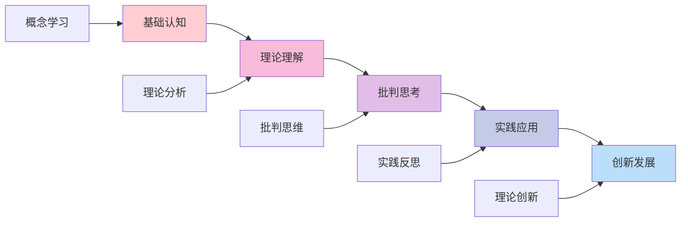

#### 23.2 教育哲学思维发展

| 发展阶段 | 认知特征 | 思维表现 | 教学重点 | 评估标准 |
|---------|----------|----------|----------|----------|
| **感知认知** | 现象感知 | 基础理解 | 基础教学 | 理解准确性 |
| **分析思考** | 逻辑分析 | 结构分析 | 分析教学 | 分析深度 |
| **评价判断** | 价值判断 | 批判评价 | 评价教学 | 评价合理性 |
| **创造应用** | 创新思维 | 综合应用 | 创造教学 | 创新能力 |
| **实践反思** | 实践认知 | 实践应用 | 实践教学 | 实践能力 |

### 24. 国际化教育哲学教学内容

**🌍 国际教育哲学课程标准对比**

#### 24.1 美国Philosophy of Education标准

**📊 核心内容领域**:

| 内容领域 | 核心概念 | 技能要求 | 应用能力 | 评估标准 |
|---------|----------|----------|----------|----------|
| **教育本质** | 教育定义 | 哲学分析 | 本质理解 | 哲学素养 |
| **教育价值** | 价值理论 | 价值判断 | 价值应用 | 价值能力 |
| **教育目的** | 目的理论 | 目的分析 | 目的设计 | 目的能力 |
| **教育方法** | 方法理论 | 方法应用 | 方法创新 | 方法能力 |

#### 24.2 英国Educational Philosophy特色

**🎯 英国教育哲学教学方法**:

1. **经典文本教学**
   - 柏拉图《理想国》
   - 卢梭《爱弥儿》
   - 杜威《民主主义与教育》
   - 皮亚杰《教育科学与儿童心理学》

2. **讨论分析方法**
   - 哲学讨论
   - 文本分析
   - 观点辩论
   - 批判性思考

3. **实践反思方法**
   - 教育观察
   - 教学反思
   - 案例分析
   - 理论建构

### 25. 教育哲学知识关联深度分析

**🔗 跨领域知识关联**

#### 25.1 教育哲学与心理学的关联

| 哲学概念 | 心理学背景 | 关联深度 | 教学策略 | 学习效果 |
|---------|----------|----------|----------|----------|
| **教育本质** | 心理发展 | 深度关联 | 发展情境 | 理解深化 |
| **学习理论** | 认知心理 | 直接应用 | 认知分析 | 应用能力 |
| **人格发展** | 人格心理 | 方法迁移 | 人格探究 | 思维培养 |
| **价值观念** | 社会心理 | 概念统一 | 多表征 | 综合能力 |

#### 25.2 教育哲学与社会学的关联

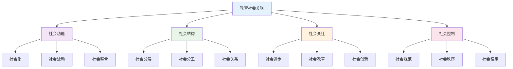

### 26. 教育哲学实践教学体系

**📖 基于知识图谱的实践教学**

#### 26.1 哲学思维技能发展

| 思维技能 | 技能内容 | 发展要求 | 评估方法 | 应用领域 |
|---------|----------|----------|----------|----------|
| **概念分析** | 概念理解 | 准确性 | 概念测试 | 基础研究 |
| **逻辑推理** | 逻辑分析 | 严密性 | 推理测试 | 深度研究 |
| **价值判断** | 价值评价 | 合理性 | 评价测试 | 批判研究 |
| **理论建构** | 理论创新 | 创新性 | 建构测试 | 创新研究 |

#### 26.2 教育哲学教学创新

**🎯 现代教育哲学教学方法**:

1. **数字化哲学环境**
   - 哲学数据库
   - 在线讨论平台
   - 哲学资源库
   - 虚拟哲学实验室

2. **多媒体哲学教学**
   - 哲学动画
   - 哲学电影
   - 哲学音频
   - 哲学游戏

3. **创新哲学设计**
   - 哲学实验
   - 哲学工作坊
   - 哲学沙龙
   - 哲学实践

### 27. 教育哲学学习评估体系

**📊 基于知识图谱的评估框架**

#### 27.1 哲学能力评估

| 评估维度 | 评估内容 | 评估方法 | 评估标准 | 发展指标 |
|---------|----------|----------|----------|----------|
| **概念能力** | 概念理解 | 概念测试 | 准确理解 | 概念清晰度 |
| **逻辑能力** | 逻辑思维 | 逻辑测试 | 逻辑严密 | 逻辑能力 |
| **批判能力** | 批判思维 | 批判测试 | 批判深度 | 批判能力 |
| **创新能力** | 创新思维 | 创新测试 | 创新质量 | 创新能力 |

#### 27.2 综合哲学评估

**🎯 教育哲学综合能力评估矩阵**:

```mermaid
graph TD
    A[哲学综合评估] --> B[概念能力]
    A --> C[逻辑能力]
    A --> D[批判能力]
    A --> E[创新能力]
    
    B --> B1[概念理解]
    B --> B2[概念分析]
    B --> B3[概念应用]
    
    C --> C1[逻辑推理]
    C --> C2[逻辑分析]
    C --> C3[逻辑建构]
    
    D --> D1[批判分析]
    D --> D2[批判评价]
    D --> D3[批判建构]
    
    E --> E1[理论创新]
    E --> E2[方法创新]
    E --> E3[实践创新]
    
    style A fill:#e3f2fd
    style B fill:#f3e5f5
    style C fill:#e8f5e8
    style D fill:#fff3e0
    style E fill:#fce4ec
```

### 28. 教育哲学教育国际化发展

**🌍 国际教育哲学教育趋势**

#### 28.1 全球教育哲学教育标准

| 标准体系 | 核心理念 | 内容特点 | 评估方式 | 发展趋势 |
|---------|----------|----------|----------|----------|
| **美国教育哲学** | 实用主义 | 问题导向 | 批判评估 | 应用导向 |
| **英国教育哲学** | 自由主义 | 经典理论 | 过程评估 | 理论发展 |
| **德国教育哲学** | 文化传承 | 历史视角 | 深度评估 | 文化自信 |
| **国际教育哲学** | 多元文化 | 跨文化 | 综合评估 | 全球视野 |

#### 28.2 教育哲学教育技术整合

**💻 数字化教育哲学教育**:

1. **智能学习系统**
   - 个性化哲学学习
   - 自适应理论指导
   - 实时哲学反馈

2. **虚拟学习环境**
   - 哲学情境模拟
   - 哲学体验平台
   - 哲学讨论空间

3. **多媒体教学平台**
   - 哲学资源库
   - 哲学讨论工具
   - 哲学实践平台
