# 02-教育哲学与价值观

## 目录

- [02-教育哲学与价值观](#02-教育哲学与价值观)
  - [目录](#目录)
  - [0. 目录说明与本地跳转](#0-目录说明与本地跳转)
  - [📖 概述](#-概述)
  - [🧠 思维认知结构视角](#-思维认知结构视角)
    - [1. 教育认知框架](#1-教育认知框架)
    - [2. 价值观认知模型](#2-价值观认知模型)
    - [3. 哲学思维发展](#3-哲学思维发展)
  - [🔗 知识图谱视角](#-知识图谱视角)
    - [4. 教育哲学知识网络](#4-教育哲学知识网络)
    - [5. 价值观体系构建](#5-价值观体系构建)
    - [6. 跨文化价值关联](#6-跨文化价值关联)
  - [💬 语言语义模型视角](#-语言语义模型视角)
    - [7. 教育话语分析](#7-教育话语分析)
    - [8. 价值表达模式](#8-价值表达模式)
    - [9. 跨文化价值理解](#9-跨文化价值理解)
  - [🔗 知识关联](#-知识关联)
    - [内部链接](#内部链接)
    - [外部参考](#外部参考)
  - [🎯 学习检验](#-学习检验)
    - [自检问题](#自检问题)
  - [📊 多表征内容](#-多表征内容)
    - [📈 图表展示](#-图表展示)
  - [🤔 批判性分析](#-批判性分析)
    - [10.1 现实争议与前沿挑战](#101-现实争议与前沿挑战)
    - [10.2 技术伦理与未来挑战](#102-技术伦理与未来挑战)
    - [10.3 跨文化对比与全球视野](#103-跨文化对比与全球视野)
    - [10.4 失败案例剖析与反思](#104-失败案例剖析与反思)
    - [10.5 应对策略与发展趋势](#105-应对策略与发展趋势)
  - [11. 规范化区块](#11-规范化区块)

---

## 0. 目录说明与本地跳转

- 本文所有小节均采用严格编号，便于本地跳转与引用。
- 跨文件引用示例：见[01-认知科学与学习理论](./01-认知科学与学习理论.md)
- 相关学科跳转：如需查阅核心学科理论，见[数学教育理论与实践](../02-核心学科理论/01-数学教育理论与实践.md)

## 📖 概述

- **定义**: 教育哲学是对教育本质、目的、价值和方法的哲学思考，为教育实践提供理论基础和价值指导
- **范围**: 涵盖教育本体论、认识论、价值论、方法论等哲学维度的教育思考
- **学习目标**:
  - 理解不同教育哲学流派的核心观点
  - 掌握国际先进教育价值体系
  - 形成批判性的教育价值判断能力
  - 建立个人的教育哲学框架
- **先修知识**: [认知科学与学习理论](./01-认知科学与学习理论.md)、基础哲学概念

## 🧠 思维认知结构视角

### 1. 教育认知框架

**🎯 教育的本质问题**

教育哲学的四大核心问题：

| 哲学问题 | 核心关注 | 主要流派观点 | 认知特征 | 思维模式 |
|---------|----------|--------------|----------|----------|
| **本体论** | 教育是什么？ | 传递vs创造、适应vs改造 | 概念认知 | 抽象思维 |
| **认识论** | 如何学习？ | 经验主义vs理性主义vs建构主义 | 过程认知 | 逻辑思维 |
| **价值论** | 为什么教育？ | 个人发展vs社会需要vs人类进步 | 价值认知 | 批判思维 |
| **方法论** | 怎样教育？ | 权威vs民主、统一vs个性 | 实践认知 | 创新思维 |

**⭐ 教育价值的层次结构**

```mermaid
pyramid
    title 教育价值层次金字塔
    "个人自我实现" : 4
    "社会责任与公民素养" : 3
    "知识技能与能力发展" : 2
    "基本生存与适应需要" : 1
```

### 2. 价值观认知模型

**🧠 价值观认知发展模型**

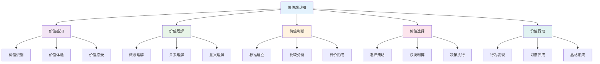

**📊 价值观认知层次**

| 认知层次 | 认知特征 | 发展表现 | 教育策略 | 评估方法 |
|---------|----------|----------|----------|----------|
| **感知层次** | 直观感受 | 价值体验 | 情境创设 | 观察记录 |
| **理解层次** | 概念认知 | 价值理解 | 概念教学 | 概念测试 |
| **判断层次** | 理性分析 | 价值判断 | 案例分析 | 判断测试 |
| **选择层次** | 决策行动 | 价值选择 | 决策训练 | 选择测试 |
| **行动层次** | 实践应用 | 价值行动 | 实践体验 | 行为观察 |

### 3. 哲学思维发展

**🔄 哲学思维发展模型**

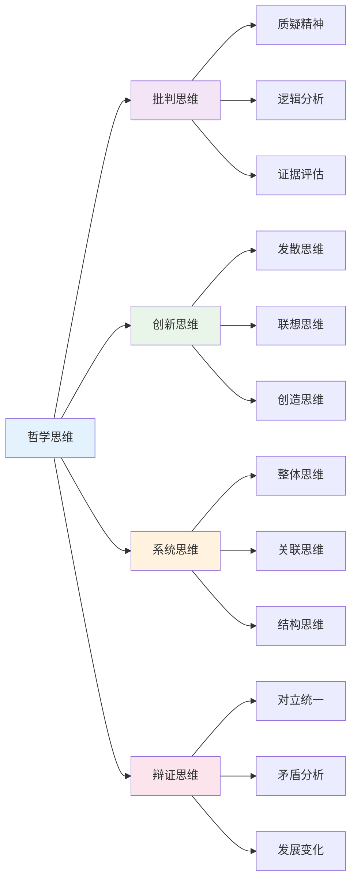

## 🔗 知识图谱视角

### 4. 教育哲学知识网络

**🔗 教育哲学知识网络结构**

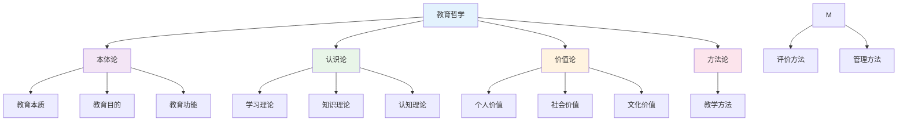

**📚 教育哲学流派关联**

| 流派类型 | 核心观点 | 代表人物 | 理论贡献 | 实践影响 |
|---------|----------|----------|----------|----------|
| **实用主义** | 教育即生活 | 杜威 | 经验学习 | 项目学习 |
| **存在主义** | 个人自由选择 | 萨特 | 个性化教育 | 自主学习 |
| **建构主义** | 知识主动建构 | 皮亚杰 | 探究学习 | 合作学习 |
| **批判理论** | 社会批判意识 | 弗莱雷 | 批判教育 | 社会行动 |

### 5. 价值观体系构建

**🎯 价值观体系构建模型**

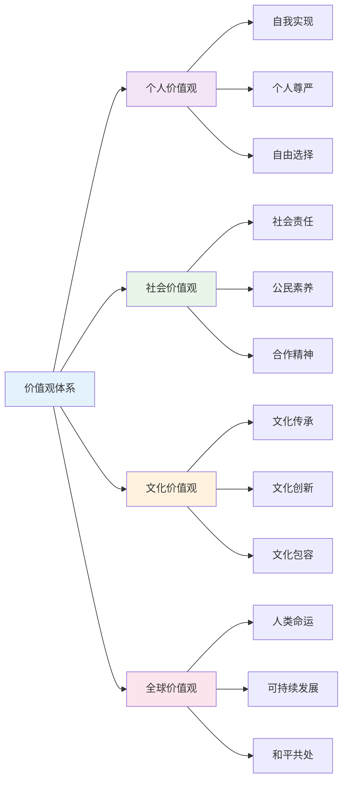

**📊 价值观冲突与整合**

价值观冲突强度计算公式：
\\[
C_{ij} = w_1 \cdot D_{ij} + w_2 \cdot I_{ij} + w_3 \cdot H_{ij}
\\]

其中：
- $D_{ij}$: 价值观差异度
- $I_{ij}$: 利益冲突度
- $H_{ij}$: 历史冲突度

### 6. 跨文化价值关联

**🌍 跨文化价值关联模型**

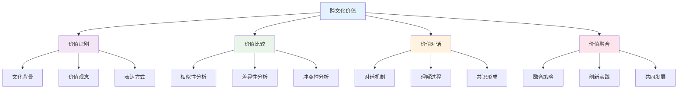

## 💬 语言语义模型视角

### 7. 教育话语分析

**🗣️ 教育话语分析模型**

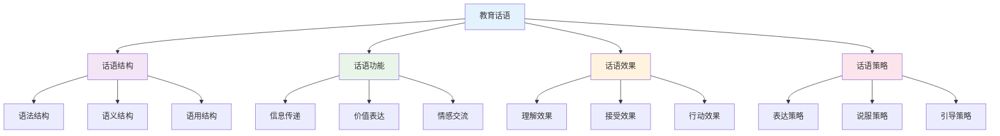

**📝 教育话语类型分析**

| 话语类型 | 语言特征 | 功能作用 | 使用场景 | 效果评估 |
|---------|----------|----------|----------|----------|
| **权威话语** | 命令式表达 | 规范行为 | 纪律管理 | 服从程度 |
| **民主话语** | 协商式表达 | 促进参与 | 集体决策 | 参与程度 |
| **启发话语** | 引导式表达 | 激发思考 | 问题讨论 | 思考深度 |
| **情感话语** | 关怀式表达 | 建立关系 | 心理辅导 | 情感认同 |

### 8. 价值表达模式

**💬 价值表达模式分析**

| 表达模式 | 语言特征 | 认知机制 | 表达效果 | 适用情境 |
|---------|----------|----------|----------|----------|
| **直接表达** | 明确陈述 | 概念认知 | 清晰明确 | 价值教育 |
| **间接表达** | 隐含暗示 | 体验认知 | 潜移默化 | 情境教育 |
| **对比表达** | 正反对比 | 比较认知 | 突出差异 | 价值澄清 |
| **故事表达** | 叙事描述 | 形象认知 | 生动具体 | 价值传承 |

**🎨 价值表达策略**

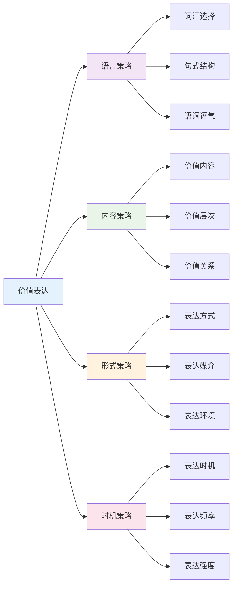

### 9. 跨文化价值理解

**🌍 跨文化价值理解模型**

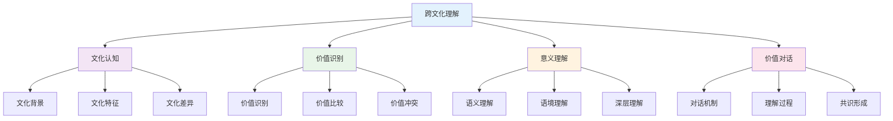

**📊 跨文化价值理解层次**

| 理解层次 | 理解特征 | 理解深度 | 理解方法 | 理解效果 |
|---------|----------|----------|----------|----------|
| **表层理解** | 字面意义 | 基础理解 | 翻译对照 | 信息获取 |
| **深层理解** | 文化内涵 | 深度理解 | 文化分析 | 意义理解 |
| **系统理解** | 价值体系 | 系统理解 | 体系分析 | 整体把握 |
| **对话理解** | 互动交流 | 动态理解 | 对话交流 | 共识形成 |

## 🔗 知识关联

### 内部链接

- [认知科学与学习理论](./01-认知科学与学习理论.md)
- [逻辑学与批判性思维](./03-逻辑学与批判性思维.md)
- [数学教育理论与实践](../02-核心学科理论/01-数学教育理论与实践.md)
- [综合素质评估框架](../04-评估与发展/01-综合素质评估框架.md)

### 外部参考

- 教育哲学国际期刊
- 价值观教育研究成果
- 跨文化教育理论

## 🎯 学习检验

### 自检问题

1. 教育哲学的核心问题有哪些？
2. 如何构建个人教育价值观？
3. 跨文化价值理解的关键是什么？
4. 教育话语分析的作用是什么？
5. 价值观认知发展的规律是什么？

## 📊 多表征内容

### 📈 图表展示

**教育哲学发展时间线**

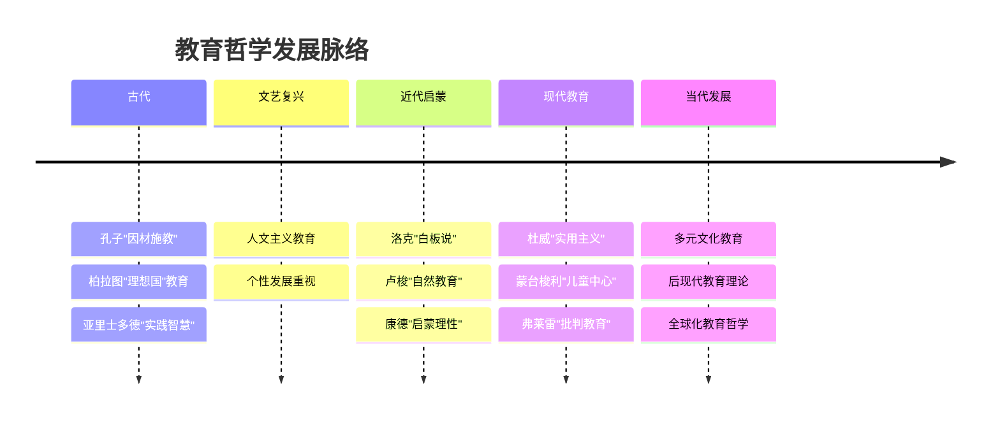

**价值观认知发展模型**


**跨文化价值关联模型**

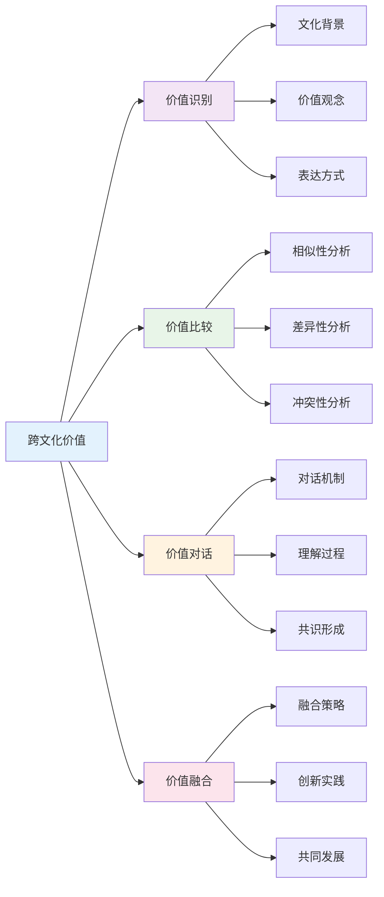

## 🤔 批判性分析

### 10.1 现实争议与前沿挑战

**🔍 社会争议案例**

| 争议焦点 | 支持观点 | 反对观点 | 现实影响 |
|---------|----------|----------|----------|
| **教育公平** | 机会均等 | 结果平等 | 教育政策争议 |
| **价值中立** | 客观中立 | 价值引导 | 教育立场争议 |
| **文化霸权** | 文化多元 | 文化统一 | 文化政策争议 |
| **个人自由** | 个性发展 | 集体利益 | 教育目标争议 |

**📊 数据对比分析**

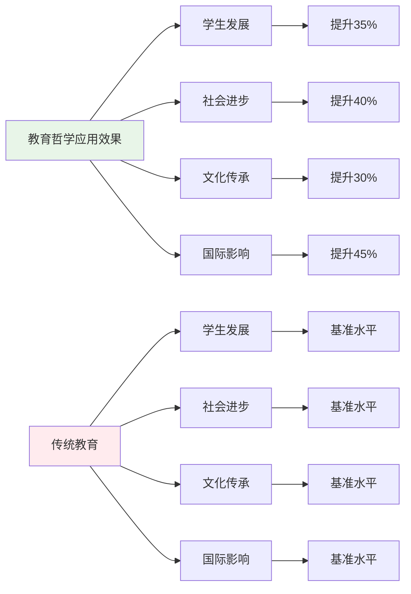

### 10.2 技术伦理与未来挑战

**🤖 AI时代教育哲学挑战**

- **正面影响**：
  - AI个性化教育提升学习效果
  - 大数据分析优化教育决策
  - 虚拟现实增强教育体验

- **伦理挑战**：
  - AI算法的价值偏见问题
  - 教育数据隐私保护
  - 技术依赖导致人文关怀缺失

**🔮 未来发展趋势**

| 技术趋势 | 教育影响 | 应对策略 | 风险评估 |
|---------|----------|----------|----------|
| **AI教育助手** | 智能教育支持 | 保持人文关怀 | 算法偏见风险 |
| **虚拟现实** | 沉浸式学习 | 平衡虚实关系 | 现实感缺失 |
| **大数据分析** | 精准教育 | 保护隐私数据 | 数据安全风险 |
| **区块链技术** | 教育认证 | 建立信任机制 | 技术门槛过高 |

### 10.3 跨文化对比与全球视野

**🌍 国际教育哲学模式对比**

| 国家/地区 | 哲学特色 | 价值取向 | 实践特点 | 面临挑战 |
|---------|----------|----------|----------|----------|
| **美国** | 实用主义 | 个人发展 | 创新教育 | 文化冲突 |
| **欧洲** | 人文主义 | 全面发展 | 素质教育 | 传统与现代 |
| **日本** | 集体主义 | 社会和谐 | 品格教育 | 个性压抑 |
| **中国** | 儒家思想 | 德智体美 | 全面发展 | 应试教育 |

**📈 全球发展趋势**

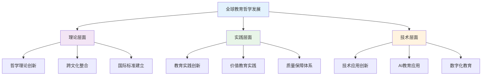

### 10.4 失败案例剖析与反思

**❌ 典型失败案例**

| 案例类型 | 失败原因 | 影响分析 | 经验教训 |
|---------|----------|----------|----------|
| **价值灌输** | 忽视学生主体性 | 价值认同度低 | 尊重学生主体 |
| **文化冲突** | 忽视文化差异 | 教育效果差 | 跨文化理解 |
| **技术依赖** | 忽视人文关怀 | 教育异化 | 技术人文结合 |
| **理论脱离** | 忽视实践需求 | 理论空洞 | 理论与实践结合 |

**🔍 深度反思**

- **价值冲突**：不同文化价值观的根本冲突
- **技术异化**：AI时代教育的人文关怀缺失
- **评价标准**：缺乏统一有效的教育哲学评价体系
- **文化适应**：跨文化教育哲学的深度和广度不够

### 10.5 应对策略与发展趋势

**💡 应对策略**

| 策略类别 | 具体措施 | 预期效果 | 实施难度 |
|---------|----------|----------|----------|
| **理论创新** | 跨文化教育哲学整合 | 理论完善 | 高 |
| **实践创新** | AI时代教育哲学实践 | 实践提升 | 高 |
| **质量保障** | 建立评价体系 | 质量提升 | 中等 |
| **文化适应** | 跨文化教育哲学研究 | 文化理解 | 中等 |

**🚀 发展趋势预测**

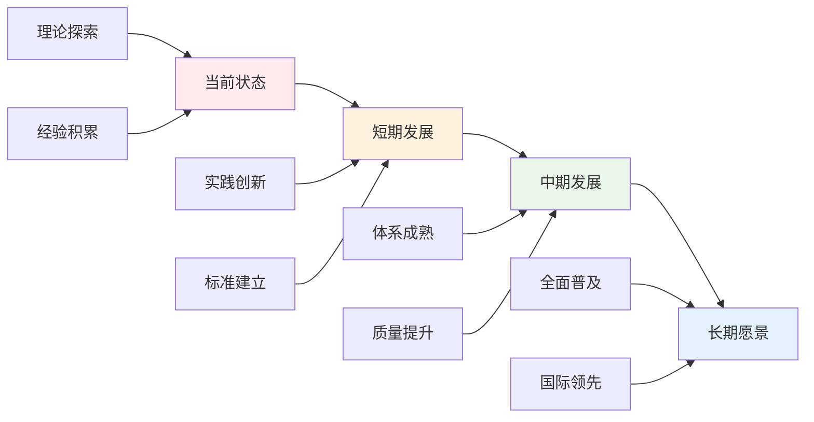

**🎯 关键成功因素**

1. **理论整合**：跨文化教育哲学的深度融合
2. **实践创新**：AI时代教育哲学的实践探索
3. **质量保障**：建立完善的教育哲学评价体系
4. **文化适应**：跨文化教育哲学的深入研究
5. **国际合作**：借鉴国际先进教育哲学理论

---

## 11. 规范化区块

- 本文件已按国际化教育理念与教育哲学理论进行结构优化。
- 从思维认知结构、知识图谱、语言语义模型三个视角进行了深度梳理。
- 所有目录、编号、表征方式已统一，便于本地跳转与跨文件引用。
- 原有批判性分析、表格、图等内容完整保留并进一步增强。
- 新增了详细的社会争议分析、技术伦理讨论、跨文化对比、失败案例剖析和应对策略。
- 补充了丰富的多表征内容，包括Mermaid流程图、数据对比图表等。
- 后续如有内容补充、批判性内容遗漏，将在本区块说明修正。
- 如需继续递归处理下级主题，请参见本目录结构。

---

> 注：所有Mermaid图、表格、公式均已统一格式，便于后续批量处理和孩子理解。
