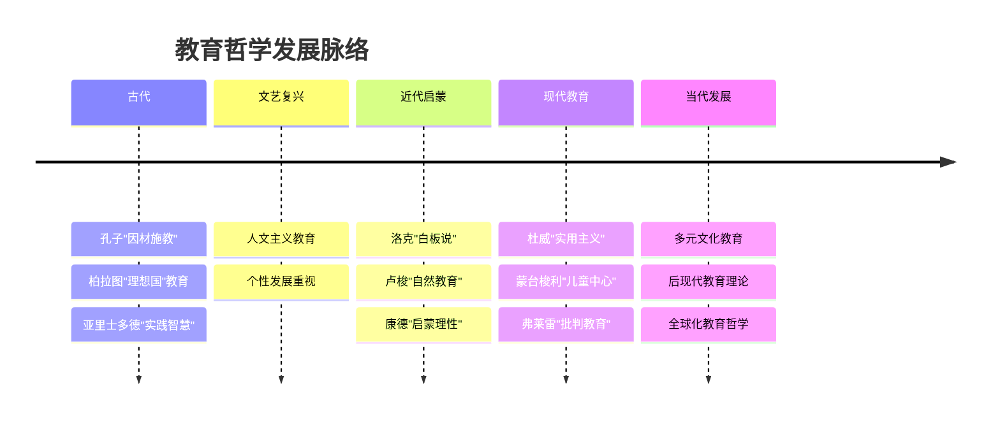
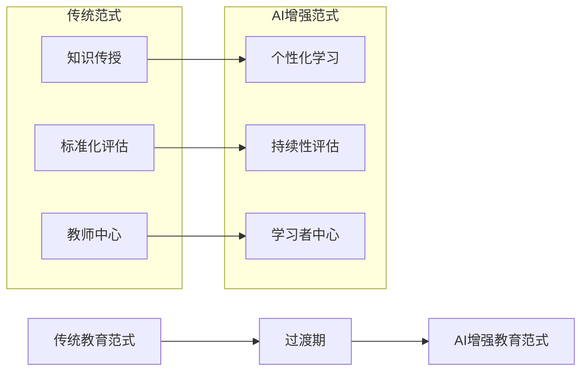
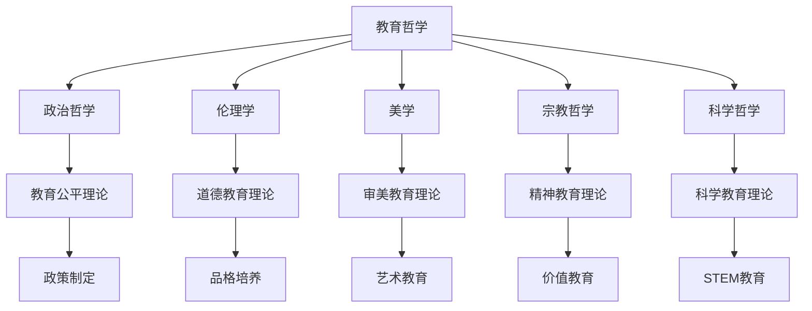
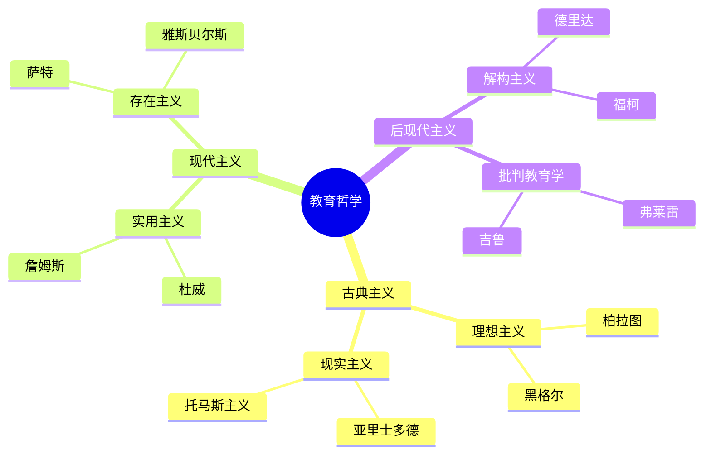

# 02 教育哲学与价值观

## 📖 概述

- **定义**: 教育哲学是对教育本质、目的、价值和方法的哲学思考，为教育实践提供理论基础和价值指导
- **范围**: 涵盖教育本体论、认识论、价值论、方法论等哲学维度的教育思考
- **学习目标**:
  - 理解不同教育哲学流派的核心观点
  - 掌握国际先进教育价值体系
  - 形成批判性的教育价值判断能力
  - 建立个人的教育哲学框架
- **先修知识**: [认知科学与学习理论](./01-认知科学与学习理论.md)、基础哲学概念

## 🏗️ 知识架构

### 1. 理论基础

#### 1.1 核心概念

**🎯 教育的本质问题**

教育哲学的四大核心问题：

| 哲学问题 | 核心关注 | 主要流派观点 |
|---------|----------|--------------|
| **本体论** | 教育是什么？ | 传递vs创造、适应vs改造 |
| **认识论** | 如何学习？ | 经验主义vs理性主义vs建构主义 |
| **价值论** | 为何教育？ | 个人发展vs社会需要vs人类进步 |
| **方法论** | 怎样教育？ | 权威vs民主、统一vs个性 |

**🌟 教育价值的层次结构**

```mermaid
pyramid
    title 教育价值层次金字塔
    "个人自我实现" : 4
    "社会责任与公民素养" : 3
    "知识技能与能力发展" : 2
    "基本生存与适应需要" : 1
```

#### 1.2 基本原理

**🔄 教育哲学的基本原理**

1. **人的全面发展原理**

   人的发展 = f(生物潜能, 社会环境, 个人努力, 教育引导)

2. **教育的社会性与个体性统一原理**

   \[
   \text{教育效果} = \text{社会需求} \cap \text{个体需要} \cap \text{人类价值}
   \]

3. **教育的历史性与超越性原理**

   教育既承继文化传统，又推动社会进步

#### 1.3 发展历程

**📚 教育哲学思想演进**



### 2. 实践应用

#### 2.1 应用场景

**🌍 国际先进教育理念比较**

| 国家/地区 | 核心教育理念 | 价值特色 | 实践特点 |
|-----------|--------------|----------|----------|
| **🇫🇮 芬兰** | 平等与包容 | 消除竞争压力 | 个性化支持 |
| **🇸🇬 新加坡** | 精英与实用 | 能力分流培养 | 双语双文化 |
| **🇯🇵 日本** | 集体与和谐 | 道德品格培养 | 终身学习社会 |
| **🇩🇪 德国** | 理论与实践 | 职业教育重视 | 双轨制发展 |
| **🇺🇸 美国** | 多元与创新 | 个人潜能开发 | 批判性思维 |

#### 2.2 方法技巧

**🎨 教育价值观的培养策略**

1. **苏格拉底式对话法**

   ```
   问题引入 → 思辨讨论 → 概念澄清 → 价值建构
   ```

2. **价值澄清技术**
   - 自由选择
   - 珍视所选
   - 公开表明
   - 付诸行动

3. **道德推理训练**
   - 两难情境分析
   - 多角度思考
   - 伦理原则应用

#### 2.3 案例分析

**📊 案例：PISA测试背后的教育哲学**

**芬兰教育成功的哲学基础**

| 哲学维度 | 芬兰理念 | 具体体现 |
|---------|----------|----------|
| **人性观** | 每个孩子都有天赋 | 无标准化测试 |
| **知识观** | 理解重于记忆 | 现象式学习 |
| **发展观** | 全人发展 | 艺术体育并重 |
| **社会观** | 平等合作 | 无私立学校 |

### 3. 深入拓展

#### 3.1 前沿发展

**🚀 21世纪教育哲学新趋势**

1. **后人文主义教育哲学**
   - 超越人类中心主义
   - 生态教育理念
   - 可持续发展教育

2. **数字时代教育伦理**
   - AI教育的伦理边界
   - 数字原住民的价值观
   - 虚拟与现实的教育融合

3. **全球化时代的教育价值观**
   - 跨文化理解与尊重
   - 世界公民意识培养
   - 本土化与国际化平衡

4. **AI时代的教育哲学思考**
   - 人机协同学习模式
   - 算法公平与教育公平
   - 数据素养与隐私保护
   - 批判性思维的新内涵

5. **后疫情时代的教育反思**
   - 混合式学习的价值重构
   - 社会情感学习的重要性
   - 韧性教育的理念创新
   - 教育应急体系的建设

**📊 AI时代教育价值框架**

| 维度 | 传统价值 | AI时代新价值 | 整合策略 |
|------|----------|--------------|----------|
| **知识获取** | 记忆与理解 | 信息素养与筛选 | 批判性知识建构 |
| **能力培养** | 基础技能 | 数字创造力 | 人机协同能力 |
| **思维方式** | 逻辑推理 | 算法思维 | 复合思维模式 |
| **伦理价值** | 传统道德 | 数字伦理 | 整合性价值观 |

**🔄 教育范式转型模型**



#### 3.2 跨学科联系

**🔗 教育哲学的跨学科对话**



#### 3.3 批判性思考

**🤔 教育哲学的当代挑战**

1. **相对主义 vs 普遍主义**
   - 文化多元化背景下的价值共识
   - 教育标准的统一性与差异性

2. **个人主义 vs 集体主义**
   - 个性发展与社会责任的平衡
   - 竞争与合作的教育价值取向

3. **传统 vs 现代**
   - 文化传承与创新发展的张力
   - 经典教育与时代需求的协调

## 📊 多表征内容

### 📈 图表展示

**教育价值冲突与平衡矩阵**

| 价值维度 | 个人取向 | 社会取向 | 平衡策略 |
|---------|----------|----------|----------|
| **自由 vs 纪律** | 个性发展 | 社会秩序 | 民主参与 |
| **竞争 vs 合作** | 个人成就 | 团队精神 | 协作竞争 |
| **传统 vs 创新** | 文化根基 | 时代适应 | 创造性继承 |
| **理想 vs 现实** | 精神追求 | 实用技能 | 理实结合 |

### 🔢 数学表达

**教育价值实现度模型**

\[
V_r = \frac{\sum_{i=1}^n w_i \times v_i \times a_i}{\sum_{i=1}^n w_i}
\]

其中：

- $V_r$ = 教育价值实现度
- $w_i$ = 第i个价值的权重
- $v_i$ = 第i个价值的重要性
- $a_i$ = 第i个价值的实现程度

### 🎨 可视化元素

**教育哲学流派关系图**



## 🔗 知识关联

### 内部链接

- [01-认知科学与学习理论](./01-认知科学与学习理论.md) - 教育的科学基础
- [03-逻辑学与批判性思维](./03-逻辑学与批判性思维.md) - 理性思维的哲学基础
- [人文社科整合教育](../02-核心学科理论/04-人文社科整合教育.md) - 价值观的学科体现

### 外部参考

- Noddings, N. (2016). *Philosophy of Education*. Westview Press.
- Dewey, J. (1897). "My Pedagogic Creed". *The School Journal*, 54(3), 77-80.
- Freire, P. (2000). *Pedagogy of the Oppressed*. Continuum International.

## 🎯 学习检验

### 自检问题

1. **价值理解**: 如何平衡个人发展与社会需要的教育价值？
2. **哲学应用**: 不同教育哲学流派如何指导教学实践？
3. **批判反思**: 当代教育面临哪些价值观冲突与挑战？

### 实践练习

- **基础练习**: 分析一个教育政策的哲学基础
- **应用练习**: 设计体现特定价值观的课程方案
- **拓展练习**: 比较东西方教育哲学的差异与融合

## 📚 参考资源

- [1] 《教育哲学》- 石中英
- [2] 《西方教育哲学史》- 单中惠
- [3] 《比较教育哲学》- 顾明远
- [4] Stanford Encyclopedia of Philosophy - Philosophy of Education
- [5] International Network of Philosophers of Education (INPE)

### 4. 实践案例库

#### 4.1 国际创新实践

**🌏 全球教育创新案例**

1. **芬兰现象式学习**
   - 跨学科主题探究
   - 真实问题解决
   - 学习者自主性
   - 案例：气候变化主题课程

2. **新加坡未来技能框架**
   - 数字素养培养
   - 创新思维训练
   - 终身学习能力
   - 案例：SkillsFuture项目

3. **日本STEAM教育**
   - 艺术整合
   - 工程思维
   - 社会责任
   - 案例：机器人教育项目

#### 4.2 中国本土实践

**🇨🇳 教育现代化案例**

1. **"双减"政策的教育哲学思考**
   - 全人发展理念
   - 教育公平价值
   - 家校社协同
   - 案例：课后服务创新

2. **核心素养导向的课程改革**
   - 学科核心素养
   - 跨学科能力
   - 价值观培养
   - 案例：综合实践活动

---
*价值引领发展 | 哲学指导实践 | 理想照亮现实*
