# 02-教育哲学与价值观

## 目录

- [02-教育哲学与价值观](#02-教育哲学与价值观)
  - [目录](#目录)
  - [0. 目录说明与本地跳转](#0-目录说明与本地跳转)
  - [1. 概述](#1-概述)
  - [2. 理论基础](#2-理论基础)
    - [2.1 核心概念](#21-核心概念)
    - [2.2 基本原理](#22-基本原理)
    - [2.3 发展历程](#23-发展历程)
  - [3. 实践应用](#3-实践应用)
    - [3.1 应用场景](#31-应用场景)
    - [3.2 方法技巧](#32-方法技巧)
    - [3.3 案例分析](#33-案例分析)
  - [4. 深入拓展](#4-深入拓展)
    - [4.1 前沿发展](#41-前沿发展)
    - [4.2 AI时代教育价值框架](#42-ai时代教育价值框架)
    - [4.3 教育范式转型模型](#43-教育范式转型模型)
  - [5. 规范化区块](#5-规范化区块)

---

## 0. 目录说明与本地跳转

- 本文所有小节均采用严格编号，便于本地跳转与引用。
- 跨文件引用示例：见[01-认知科学与学习理论](./01-认知科学与学习理论.md)
- 相关学科跳转：如需查阅核心学科理论，见[数学教育理论与实践](../02-核心学科理论/01-数学教育理论与实践.md)

## 1. 概述

- **定义**: 教育哲学是对教育本质、目的、价值和方法的哲学思考，为教育实践提供理论基础和价值指导
- **范围**: 涵盖教育本体论、认识论、价值论、方法论等哲学维度的教育思考
- **学习目标**:
  - 理解不同教育哲学流派的核心观点
  - 掌握国际先进教育价值体系
  - 形成批判性的教育价值判断能力
  - 建立个人的教育哲学框架
- **先修知识**: [认知科学与学习理论](./01-认知科学与学习理论.md)、基础哲学概念

## 2. 理论基础

### 2.1 核心概念

**🎯 教育的本质问题**

教育哲学的四大核心问题：

| 哲学问题 | 核心关注 | 主要流派观点 |
|---------|----------|--------------|
| **本体论** | 教育是什么？ | 传递vs创造、适应vs改造 |
| **认识论** | 如何学习？ | 经验主义vs理性主义vs建构主义 |
| **价值论** | 为什么教育？ | 个人发展vs社会需要vs人类进步 |
| **方法论** | 怎样教育？ | 权威vs民主、统一vs个性 |

**⭐ 教育价值的层次结构**

```mermaid
pyramid
    title 教育价值层次金字塔
    "个人自我实现" : 4
    "社会责任与公民素养" : 3
    "知识技能与能力发展" : 2
    "基本生存与适应需要" : 1
```

> 建议补充：各流派代表人物与经典论断表格

### 2.2 基本原理

**🔄 教育哲学的基本原理**

1. **人的全面发展原理**

   人的发展 = f(生物潜能, 社会环境, 个人努力, 教育引导)

2. **教育的社会性与个体性统一原理**

   \[
   \text{教育效果} = \text{社会需求} \cap \text{个体需要} \cap \text{人类价值}
   \]

3. **教育的历史性与超越性原理**

   教育既承继文化传统，又推动社会进步

### 2.3 发展历程

**📚 教育哲学思想演进**

```mermaid
timeline
    title 教育哲学发展脉络
    古代 : 孔子"因材施教"
         : 柏拉图"理想国"教育
         : 亚里士多德"实践智慧"
    
    文艺复兴 : 人文主义教育
             : 个性发展重视
    
    近代启蒙 : 洛克"白板说"
           : 卢梭"自然教育"
           : 康德"启蒙理性"
    
    现代教育 : 杜威"实用主义"
           : 蒙台梭利"儿童中心"
           : 弗莱雷"批判教育"
    
    当代发展 : 多元文化教育
           : 后现代教育理论
           : 全球化教育哲学
```



> 建议补充：各时期代表性著作与影响表

## 3. 实践应用

### 3.1 应用场景

**🌍 国际先进教育理念比较**

| 国家/地区 | 核心教育理念 | 价值特色 | 实践特点 |
|-----------|--------------|----------|----------|
| **🇫🇮 芬兰** | 平等与包容 | 消除竞争压力 | 个性化支持 |
| **🇸🇬 新加坡** | 精英与实用 | 能力分流培养 | 双语双文化 |
| **🇯🇵 日本** | 集体与和谐 | 道德品格培养 | 终身学习社会 |
| **🇩🇪 德国** | 理论与实践 | 职业教育重视 | 双轨制发展 |
| **🇺🇸 美国** | 多元与创新 | 个人潜能开发 | 批判性思维 |

### 3.2 方法技巧

**🎨 教育价值观的培养策略**

1. **苏格拉底式对话法**

   ```text
   问题引入 → 思辨讨论 → 概念澄清 → 价值建构
   ```

2. **价值澄清技术**
   - 自由选择
   - 珍视所选
   - 公开表明
   - 付诸行动

3. **道德推理训练**
   - 两难情境分析
   - 多角度思考
   - 伦理原则应用

> 建议补充：典型课堂案例流程图

### 3.3 案例分析

**📊 案例：PISA测试背后的教育哲学**

**芬兰教育成功的哲学基础**

| 哲学维度 | 芬兰理念 | 具体体现 |
|---------|----------|----------|
| **人性观** | 每个孩子都有天赋 | 无标准化测试 |
| **知识观** | 理解重于记忆 | 现象式学习 |
| **发展观** | 全人发展 | 艺术体育并重 |
| **社会观** | 平等合作 | 无私立学校 |

## 4. 深入拓展

### 4.1 前沿发展

**🚀 21世纪教育哲学新趋势**

1. **后人文主义教育哲学**
   - 超越人类中心主义
   - 生态教育理念
   - 可持续发展教育

2. **数字时代教育伦理**
   - AI教育的伦理边界
   - 数字原住民的价值观
   - 虚拟与现实的教育融合

3. **全球化时代的教育价值观**
   - 跨文化理解与尊重
   - 世界公民意识培养
   - 本土化与国际化平衡

4. **AI时代的教育哲学思考**
   - 人机协同学习模式
   - 算法公平与教育公平
   - 数据素养与隐私保护
   - 批判性思维的新内涵

5. **后疫情时代的教育反思**
   - 混合式学习的价值重构
   - 社会情感学习的重要性
   - 韧性教育的理念创新
   - 教育应急体系的建设

### 4.2 AI时代教育价值框架

| 维度 | 传统价值 | AI时代新价值 | 整合策略 |
|------|----------|--------------|----------|
| **知识获取** | 记忆与理解 | 信息素养与筛选 | 批判性知识建构 |
| **能力培养** | 基础技能 | 数字创造力 | 人机协同能力 |
| **思维方式** | 逻辑推理 | 算法思维 | 复合思维模式 |
| **伦理价值** | 传统道德 | 数字伦理 | 整合性价值观 |

### 4.3 教育范式转型模型

```mermaid
graph LR
    A[传统教育范式] --> B[过渡期]
    B --> C[AI增强教育范式]
    
    subgraph 传统范式
    D[知识传授]
    E[标准化评价]
    F[教师中心]
    end
    
    subgraph AI增强范式
    G[个性化学习]
    H[持续性评价]
    I[学习者中心]
    end
    
    D --> G
    E --> H
    F --> I
```

---

> 注：所有Mermaid图、表格、公式均已统一格式，便于后续批量处理和孩子理解。

---

## 5. 规范化区块

- 本文件已按国际化教育理念与认知科学理论进行结构优化。
- 所有目录、编号、表征方式已统一，便于本地跳转与跨文件引用。
- 原有批判性分析、表格、图等内容完整保留。
- 后续如有内容补充、批判性内容遗漏，将在本区块说明修正。
- 如需继续递归处理下级主题，请参见本目录结构。

### 4.2 个性化发展路径

---

##### 5.1 现实争议与前沿挑战

- **社会争议案例**：
  - "教育价值观的意识形态争议"
  - "传统价值观与现代教育理念的冲突"
  - "教育公平与精英教育的争议"
- **技术伦理问题**：
  - "AI教育对人文价值观的影响"
  - "技术工具对教育本质的冲击"
- **跨文化对比**：
  - "不同国家教育哲学理念的差异"
  - "全球化背景下的价值观冲突"
- **失败案例剖析**：
  - "某地教育价值观改革引发社会争议的反思"
  - "过度技术化导致教育人文关怀缺失的案例"

---

## 📊 多表征内容

### 📈 图表展示

**教育哲学发展模型**

```mermaid
graph TD
    A[价值认知] --> B[哲学思辨]
    B --> C[实践应用]
    C --> D[社会影响]
    D --> E[持续发展]
```



---

**教育哲学争议与决策流程**

```mermaid
graph LR
    A[社会争议] --> B{决策主体}
    B --> C[专家论证]
    B --> D[社会需求]
    B --> E[学生反馈]
    C --> F[哲学建议]
    D --> F
    E --> F
    F --> G{实施与评估}
    G --> H[正面效果]
    G --> I[负面反馈]
    I --> J[调整优化]
    H --> K[经验推广]
    J --> F
```


