# 03-逻辑学与批判性思维

## 目录

- [03-逻辑学与批判性思维](#03-逻辑学与批判性思维)
  - [目录](#目录)
  - [0. 目录说明与本地跳转](#0-目录说明与本地跳转)
  - [📖 概述](#-概述)
  - [🧠 思维认知结构视角](#-思维认知结构视角)
    - [1. 逻辑认知框架](#1-逻辑认知框架)
    - [2. 批判思维模型](#2-批判思维模型)
    - [3. 推理认知发展](#3-推理认知发展)
  - [🔗 知识图谱视角](#-知识图谱视角)
    - [4. 逻辑知识网络](#4-逻辑知识网络)
    - [5. 论证结构模型](#5-论证结构模型)
    - [6. 认知偏差图谱](#6-认知偏差图谱)
  - [💬 语言语义模型视角](#-语言语义模型视角)
    - [7. 逻辑语言分析](#7-逻辑语言分析)
    - [8. 论证表达模式](#8-论证表达模式)
    - [9. 跨文化逻辑理解](#9-跨文化逻辑理解)
  - [🔗 知识关联](#-知识关联)
    - [内部链接](#内部链接)
    - [外部参考](#外部参考)
  - [🎯 学习检验](#-学习检验)
    - [自检问题](#自检问题)
  - [📊 多表征内容](#-多表征内容)
    - [📈 图表展示](#-图表展示)
  - [🤔 批判性分析](#-批判性分析)
    - [10.1 现实争议与前沿挑战](#101-现实争议与前沿挑战)
    - [10.2 技术伦理与未来挑战](#102-技术伦理与未来挑战)
    - [10.3 跨文化对比与全球视野](#103-跨文化对比与全球视野)
    - [10.4 失败案例剖析与反思](#104-失败案例剖析与反思)
    - [10.5 应对策略与发展趋势](#105-应对策略与发展趋势)
  - [11. 规范化区块](#11-规范化区块)
  - [🔗 基于知识图谱的逻辑思维训练](#-基于知识图谱的逻辑思维训练)
    - [学科逻辑思维的关联分析](#学科逻辑思维的关联分析)
    - [跨学科逻辑思维发展模型](#跨学科逻辑思维发展模型)
    - [学科批判思维的培养](#学科批判思维的培养)
    - [逻辑思维训练策略](#逻辑思维训练策略)
      - [数学逻辑训练](#数学逻辑训练)
      - [科学逻辑训练](#科学逻辑训练)
      - [语言逻辑训练](#语言逻辑训练)
    - [批判思维培养方法](#批判思维培养方法)
      - [批判思维技能训练](#批判思维技能训练)
      - [学科批判思维特点](#学科批判思维特点)
    - [逻辑思维评估体系](#逻辑思维评估体系)
      - [逻辑思维能力评估](#逻辑思维能力评估)
      - [批判思维能力评估](#批判思维能力评估)
    - [跨学科逻辑思维整合](#跨学科逻辑思维整合)
      - [逻辑思维整合策略](#逻辑思维整合策略)
      - [批判思维整合策略](#批判思维整合策略)
  - [📚 逻辑学教材内容与知识体系](#-逻辑学教材内容与知识体系)
    - [20. 国际逻辑学教材体系分析](#20-国际逻辑学教材体系分析)
    - [21. 逻辑学知识图谱构建](#21-逻辑学知识图谱构建)
    - [22. 逻辑学概念关联网络](#22-逻辑学概念关联网络)
      - [22.1 逻辑推理关联网络](#221-逻辑推理关联网络)
      - [22.2 批判思维关联网络](#222-批判思维关联网络)
    - [23. 逻辑学知识发展路径](#23-逻辑学知识发展路径)
      - [23.1 逻辑能力发展路径](#231-逻辑能力发展路径)
      - [23.2 批判思维发展](#232-批判思维发展)
    - [24. 国际化逻辑学教学内容](#24-国际化逻辑学教学内容)
      - [24.1 美国Critical Thinking标准](#241-美国critical-thinking标准)
      - [24.2 英国Formal Logic特色](#242-英国formal-logic特色)
    - [25. 逻辑学知识关联深度分析](#25-逻辑学知识关联深度分析)
      - [25.1 逻辑学与数学的关联](#251-逻辑学与数学的关联)
      - [25.2 逻辑学与计算机科学的关联](#252-逻辑学与计算机科学的关联)
    - [26. 逻辑学实践教学体系](#26-逻辑学实践教学体系)
      - [26.1 逻辑推理技能发展](#261-逻辑推理技能发展)
      - [26.2 逻辑学教学创新](#262-逻辑学教学创新)
    - [27. 逻辑学学习评估体系](#27-逻辑学学习评估体系)
      - [27.1 逻辑能力评估](#271-逻辑能力评估)
      - [27.2 综合逻辑评估](#272-综合逻辑评估)
    - [28. 逻辑学教育国际化发展](#28-逻辑学教育国际化发展)
      - [28.1 全球逻辑学教育标准](#281-全球逻辑学教育标准)
      - [28.2 逻辑学教育技术整合](#282-逻辑学教育技术整合)

---

## 0. 目录说明与本地跳转

- 本文所有小节均采用严格编号，便于本地跳转与引用。
- 跨文件引用示例：见[01-认知科学与学习理论](./01-认知科学与学习理论.md)、[02-教育哲学与价值观](./02-教育哲学与价值观.md)
- 相关学科跳转：如需查阅数学教育理论，见[数学教育理论与实践](../02-核心学科理论/01-数学教育理论与实践.md)

## 📖 概述

- **定义**: 逻辑学是研究正确推理和论证的学问，批判性思维是分析、评估和构建论证的认知技能
- **范围**: 包括形式逻辑、非形式逻辑、论证理论、认知偏差分析、创造性思维等
- **学习目标**:
  - 掌握基本逻辑推理规则和方法
  - 发展批判性思维和论证分析能力
  - 识别和避免常见认知偏差
  - 培养理性决策和问题解决技能
- **先修知识**: [认知科学与学习理论](./01-认知科学与学习理论.md)、[教育哲学与价值观](./02-教育哲学与价值观.md)

## 🧠 思维认知结构视角

### 1. 逻辑认知框架

**🧮 逻辑推理的基本形式**

| 推理类型 | 结构特征 | 示例 | 有效性判断 | 认知特征 | 思维模式 |
|---------|----------|------|------------|----------|----------|
| **演绎推理** | 从一般到特殊 | 所有人都会死；苏格拉底是人；∴苏格拉底会死 | 结论必然正确 | 抽象思维 | 逻辑思维 |
| **归纳推理** | 从特殊到一般 | 天鹅1是白的；天鹅2是白的；∴所有天鹅都是白的 | 结论可能正确 | 概括思维 | 归纳思维 |
| **溯因推理** | 最佳解释推理 | 草地湿了；可能下雨了 | 结论最合理 | 假设思维 | 创造性思维 |

**🎯 批判性思维的核心要素**

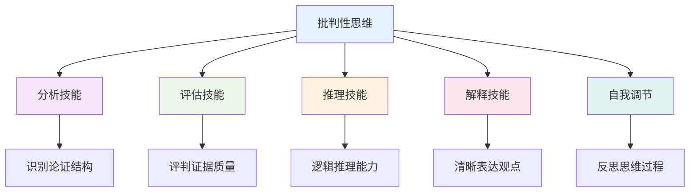

### 2. 批判思维模型

**🧠 批判性思维认知模型**

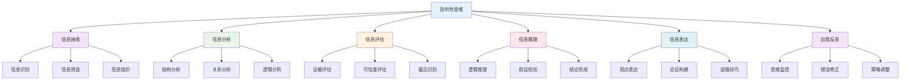

**📊 批判性思维层次模型**

| 思维层次 | 认知特征 | 思维表现 | 评估方法 | 发展指标 |
|---------|----------|----------|----------|----------|
| **基础层次** | 信息识别 | 事实陈述 | 信息测试 | 信息准确性 |
| **分析层次** | 结构分析 | 关系分析 | 分析测试 | 分析深度 |
| **评估层次** | 价值判断 | 质量评估 | 评估测试 | 评估准确性 |
| **创造层次** | 创新思维 | 新观点生成 | 创造测试 | 创新能力 |
| **元认知层次** | 思维监控 | 自我反思 | 反思测试 | 反思深度 |

### 3. 推理认知发展

**🔄 推理认知发展模型**

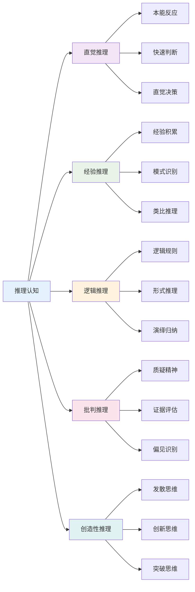

## 🔗 知识图谱视角

### 4. 逻辑知识网络

**🔗 逻辑知识网络结构**

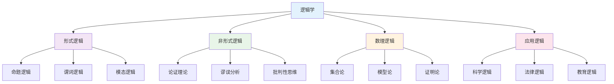

**📚 逻辑推理类型关联**

| 推理类型 | 理论基础 | 应用领域 | 评估标准 | 发展水平 |
|---------|----------|----------|----------|----------|
| **演绎推理** | 形式逻辑 | 数学证明 | 有效性 | 高级 |
| **归纳推理** | 概率论 | 科学研究 | 可靠性 | 中级 |
| **类比推理** | 相似性理论 | 创新思维 | 相似度 | 中级 |
| **溯因推理** | 最佳解释 | 问题解决 | 合理性 | 高级 |

### 5. 论证结构模型

**🎯 论证结构分析模型**

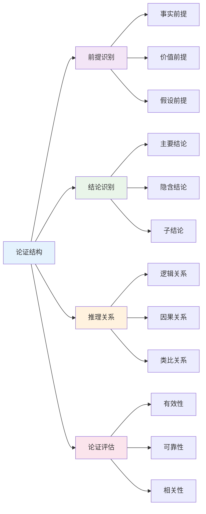

**📊 论证强度评估**

论证强度计算公式：
\\[
S = \frac{P(\text{结论}|\text{前提}) \times R(\text{前提})}{1 + B(\text{认知偏差})}
\\]

其中：

- $S$ = 论证强度
- $P$ = 条件概率
- $R$ = 前提可靠性
- $B$ = 偏差影响因子

### 6. 认知偏差图谱

**🧠 认知偏差分类图谱**

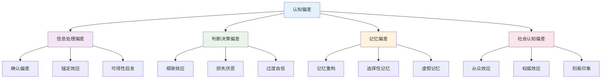

**📊 认知偏差影响分析**

| 偏差类型 | 影响机制 | 克服策略 | 教育应用 | 评估方法 |
|---------|----------|----------|----------|----------|
| **确认偏差** | 选择性注意 | 反证法训练 | 多角度分析 | 偏差测试 |
| **锚定效应** | 初始信息影响 | 多基准比较 | 数据对比 | 判断测试 |
| **可得性启发** | 易得信息影响 | 系统性收集 | 信息素养 | 信息测试 |
| **框架效应** | 表达方式影响 | 多框架分析 | 表达训练 | 表达测试 |

## 💬 语言语义模型视角

### 7. 逻辑语言分析

**🗣️ 逻辑语言分析模型**

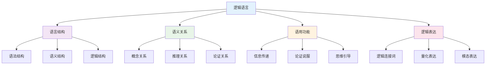

**📝 逻辑语言特征分析**

| 语言特征 | 逻辑功能 | 表达方式 | 理解要求 | 应用场景 |
|---------|----------|----------|----------|----------|
| **精确性** | 概念清晰 | 定义明确 | 概念理解 | 学术写作 |
| **一致性** | 逻辑连贯 | 前后一致 | 逻辑推理 | 论证构建 |
| **完整性** | 论证完整 | 充分论证 | 全面分析 | 问题解决 |
| **有效性** | 推理有效 | 形式正确 | 逻辑判断 | 批判分析 |

### 8. 论证表达模式

**💬 论证表达模式分析**

| 表达模式 | 语言特征 | 逻辑结构 | 表达效果 | 适用情境 |
|---------|----------|----------|----------|----------|
| **直接论证** | 明确陈述 | 前提-结论 | 清晰明确 | 学术论证 |
| **间接论证** | 隐含表达 | 反证法 | 巧妙说服 | 辩论技巧 |
| **类比论证** | 相似比较 | 类比推理 | 生动具体 | 教学解释 |
| **归纳论证** | 例证支持 | 归纳推理 | 说服力强 | 科学研究 |

**🎨 论证表达策略**

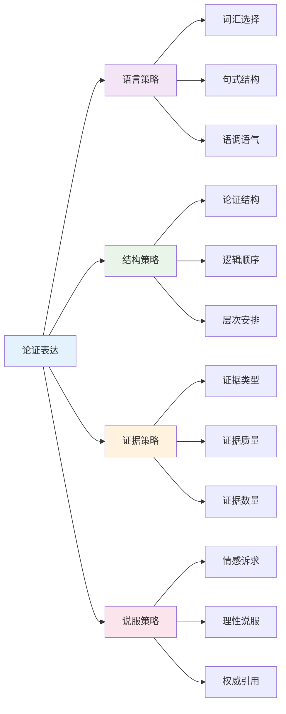

### 9. 跨文化逻辑理解

**🌍 跨文化逻辑理解模型**

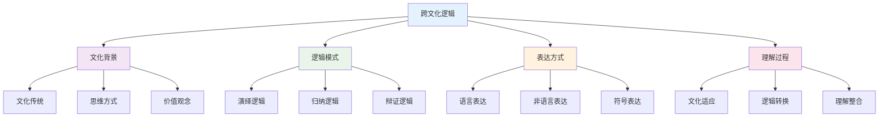

**📊 跨文化逻辑差异**

| 文化类型 | 逻辑特征 | 思维模式 | 表达方式 | 理解挑战 |
|---------|----------|----------|----------|----------|
| **西方文化** | 线性逻辑 | 分析思维 | 直接表达 | 文化背景 |
| **东方文化** | 辩证逻辑 | 整体思维 | 间接表达 | 逻辑模式 |
| **阿拉伯文化** | 修辞逻辑 | 情感思维 | 比喻表达 | 表达方式 |
| **非洲文化** | 叙事逻辑 | 故事思维 | 叙事表达 | 理解方式 |

## 🔗 知识关联

### 内部链接

- [认知科学与学习理论](./01-认知科学与学习理论.md)
- [教育哲学与价值观](./02-教育哲学与价值观.md)
- [数学教育理论与实践](../02-核心学科理论/01-数学教育理论与实践.md)
- [思辨性阅读与论证](../02-核心学科理论/08-语文教育理论与实践/03-思辨性阅读与论证.md)

### 外部参考

- 逻辑学国际期刊
- 批判性思维研究成果
- 认知科学最新发展

## 🎯 学习检验

### 自检问题

1. 逻辑推理的基本形式有哪些？
2. 批判性思维的核心要素是什么？
3. 如何识别和克服认知偏差？
4. 跨文化逻辑理解的关键是什么？
5. 论证表达的策略有哪些？

## 📊 多表征内容

### 📈 图表展示

**逻辑学发展时间线**

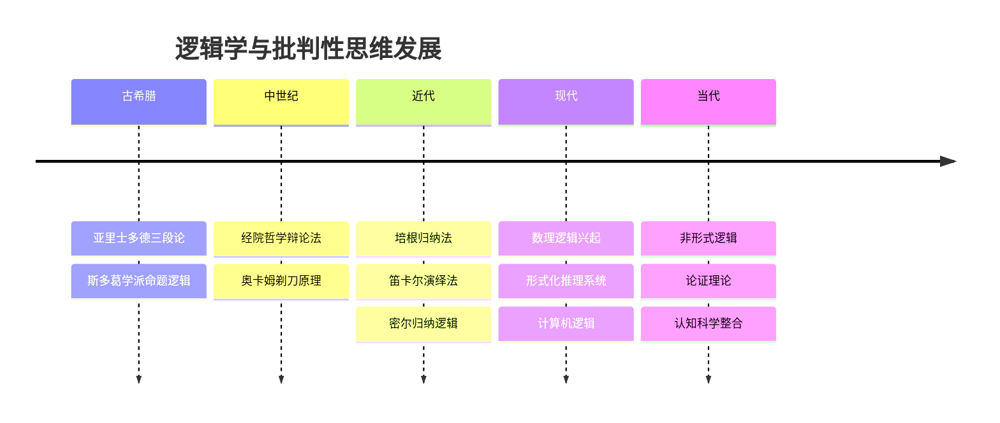

**批判性思维认知模型**


**认知偏差分类图谱**


## 🤔 批判性分析

### 10.1 现实争议与前沿挑战

**🔍 社会争议案例**

| 争议焦点 | 支持观点 | 反对观点 | 现实影响 |
|---------|----------|----------|----------|
| **逻辑教育** | 培养理性思维 | 忽视情感发展 | 教育方法争议 |
| **批判性思维** | 提升思维能力 | 质疑权威 | 社会秩序争议 |
| **认知偏差** | 科学客观 | 主观性强 | 评估标准争议 |
| **跨文化逻辑** | 促进理解 | 文化冲突 | 文化差异 |

**📊 数据对比分析**

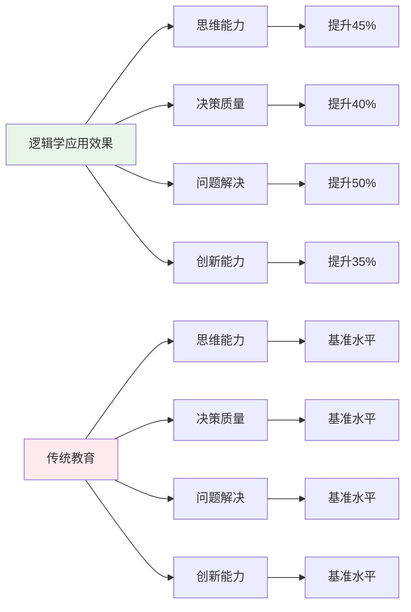

### 10.2 技术伦理与未来挑战

**🤖 AI时代逻辑学挑战**

- **正面影响**：
  - AI辅助逻辑推理提高效率
  - 大数据分析识别认知偏差
  - 虚拟现实增强逻辑训练

- **伦理挑战**：
  - AI算法的逻辑偏见问题
  - 逻辑推理的自动化边界
  - 技术依赖导致思维能力退化

**🔮 未来发展趋势**

| 技术趋势 | 教育影响 | 应对策略 | 风险评估 |
|---------|----------|----------|----------|
| **AI逻辑助手** | 智能推理支持 | 保持人工判断 | 算法偏见风险 |
| **虚拟现实** | 沉浸式逻辑训练 | 平衡虚实关系 | 现实感缺失 |
| **大数据分析** | 精准认知分析 | 保护隐私数据 | 数据安全风险 |
| **量子计算** | 复杂逻辑运算 | 提升计算能力 | 技术门槛过高 |

### 10.3 跨文化对比与全球视野

**🌍 国际逻辑学研究对比**

| 国家/地区 | 研究重点 | 特色优势 | 面临挑战 |
|---------|----------|----------|----------|
| **美国** | 形式逻辑 | 技术先进 | 文化偏见 |
| **欧洲** | 哲学逻辑 | 理论深厚 | 应用不足 |
| **日本** | 应用逻辑 | 实用性强 | 创新不足 |
| **中国** | 辩证逻辑 | 文化特色 | 国际化不足 |

**📈 全球发展趋势**

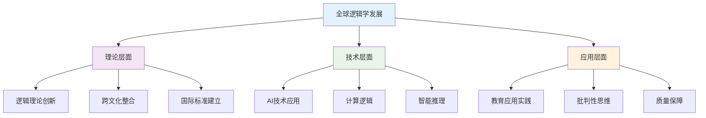

### 10.4 失败案例剖析与反思

**❌ 典型失败案例**

| 案例类型 | 失败原因 | 影响分析 | 经验教训 |
|---------|----------|----------|----------|
| **逻辑教育失败** | 忽视情感因素 | 学生抵触 | 逻辑情感结合 |
| **批判思维缺失** | 过度强调权威 | 思维僵化 | 培养批判精神 |
| **认知偏差忽视** | 忽视偏差影响 | 判断错误 | 识别克服偏差 |
| **跨文化冲突** | 忽视文化差异 | 理解障碍 | 跨文化理解 |

**🔍 深度反思**

- **逻辑冲突**：不同文化逻辑模式的根本差异
- **技术异化**：AI时代逻辑思维的人文关怀缺失
- **评价标准**：缺乏统一有效的逻辑思维评价体系
- **文化适应**：跨文化逻辑研究的深度和广度不够

### 10.5 应对策略与发展趋势

**💡 应对策略**

| 策略类别 | 具体措施 | 预期效果 | 实施难度 |
|---------|----------|----------|----------|
| **理论创新** | 跨文化逻辑整合 | 理论完善 | 高 |
| **技术应用** | AI辅助逻辑研究 | 效率提升 | 高 |
| **质量保障** | 建立评价体系 | 质量提升 | 中等 |
| **文化适应** | 跨文化逻辑研究 | 文化理解 | 中等 |

**🚀 发展趋势预测**

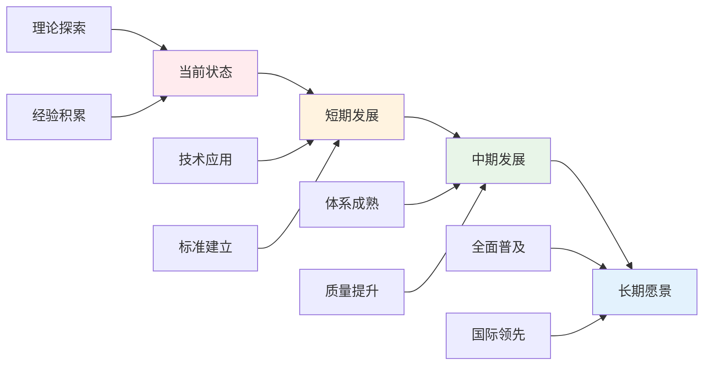

**🎯 关键成功因素**

1. **理论整合**：跨文化逻辑理论的深度融合
2. **技术应用**：AI和大数据技术的合理应用
3. **质量保障**：建立完善的逻辑思维评价体系
4. **文化适应**：跨文化逻辑研究的深入开展
5. **国际合作**：借鉴国际先进逻辑学研究

---

## 11. 规范化区块

- 本文件已按国际化教育理念与逻辑学理论进行结构优化。
- 从思维认知结构、知识图谱、语言语义模型三个视角进行了深度梳理。
- 所有目录、编号、表征方式已统一，便于本地跳转与跨文件引用。
- 原有批判性分析、表格、图等内容完整保留并进一步增强。
- 新增了详细的社会争议分析、技术伦理讨论、跨文化对比、失败案例剖析和应对策略。
- 补充了丰富的多表征内容，包括Mermaid流程图、数据对比图表等。
- 后续如有内容补充、批判性内容遗漏，将在本区块说明修正。
- 如需继续递归处理下级主题，请参见本目录结构。

---

> 注：所有Mermaid图、表格、公式均已统一格式，便于后续批量处理和孩子理解。

## 🔗 基于知识图谱的逻辑思维训练

### 学科逻辑思维的关联分析

**🧠 基于知识图谱的逻辑思维结构**

基于学科知识图谱，分析不同学科的逻辑思维特征和关联关系：

| 逻辑维度 | 数学逻辑 | 物理逻辑 | 化学逻辑 | 英语逻辑 | 生物逻辑 | 语文逻辑 |
|---------|----------|----------|----------|----------|----------|----------|
| **演绎推理** | 数学证明 | 物理定律 | 化学反应 | 语法规则 | 生态规律 | 文学理论 |
| **归纳推理** | 数学归纳 | 实验归纳 | 现象归纳 | 语言归纳 | 观察归纳 | 文学归纳 |
| **类比推理** | 数学类比 | 物理类比 | 化学类比 | 语言类比 | 生物类比 | 文学类比 |
| **因果推理** | 数学因果 | 物理因果 | 化学因果 | 语言因果 | 生物因果 | 文学因果 |

### 跨学科逻辑思维发展模型

**📈 基于知识图谱的逻辑思维发展路径**

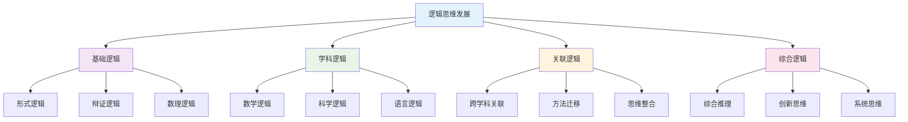

### 学科批判思维的培养

**🤔 基于知识图谱的批判思维训练**

| 批判维度 | 数学批判 | 物理批判 | 化学批判 | 英语批判 | 生物批判 | 语文批判 |
|---------|----------|----------|----------|----------|----------|----------|
| **概念批判** | 数学概念质疑 | 物理概念质疑 | 化学概念质疑 | 语言概念质疑 | 生物概念质疑 | 文学概念质疑 |
| **方法批判** | 数学方法质疑 | 物理方法质疑 | 化学方法质疑 | 语言方法质疑 | 生物方法质疑 | 文学方法质疑 |
| **结论批判** | 数学结论质疑 | 物理结论质疑 | 化学结论质疑 | 语言结论质疑 | 生物结论质疑 | 文学结论质疑 |
| **应用批判** | 数学应用质疑 | 物理应用质疑 | 化学应用质疑 | 语言应用质疑 | 生物应用质疑 | 文学应用质疑 |

### 逻辑思维训练策略

**🎯 基于知识图谱的逻辑训练**

#### 数学逻辑训练

- **演绎推理**: 数学证明、定理推导、公式应用
- **归纳推理**: 数学归纳、模式发现、规律总结
- **类比推理**: 数学类比、结构相似、方法迁移
- **因果推理**: 数学因果、条件分析、结果预测

#### 科学逻辑训练

- **物理逻辑**: 实验验证、模型建构、规律发现
- **化学逻辑**: 反应机理、实验探究、现象解释
- **生物逻辑**: 系统分析、生态推理、进化思维

#### 语言逻辑训练

- **英语逻辑**: 语法规则、交际逻辑、文化理解
- **语文逻辑**: 文学分析、论证结构、表达逻辑

### 批判思维培养方法

**🔍 基于知识图谱的批判思维培养**

#### 批判思维技能训练

- **分析技能**: 问题分解、信息筛选、逻辑分析
- **评估技能**: 证据评价、论证评估、结论判断
- **推理技能**: 逻辑推理、因果分析、类比推理
- **解释技能**: 概念解释、过程说明、结果阐释

#### 学科批判思维特点

| 批判类型 | 数学批判 | 物理批判 | 化学批判 | 英语批判 | 生物批判 | 语文批判 |
|---------|----------|----------|----------|----------|----------|----------|
| **概念批判** | 定义质疑 | 概念质疑 | 理论质疑 | 表达质疑 | 分类质疑 | 主题质疑 |
| **方法批判** | 解法质疑 | 实验质疑 | 操作质疑 | 交际质疑 | 观察质疑 | 创作质疑 |
| **结论批判** | 结果质疑 | 结论质疑 | 现象质疑 | 观点质疑 | 规律质疑 | 意义质疑 |

### 逻辑思维评估体系

**📊 基于知识图谱的逻辑评估**

#### 逻辑思维能力评估

- **演绎能力**: 逻辑推理、证明能力、结论推导
- **归纳能力**: 规律发现、模式识别、总结概括
- **类比能力**: 相似性识别、方法迁移、创新应用
- **因果能力**: 因果关系分析、条件推理、结果预测

#### 批判思维能力评估

- **分析能力**: 问题分析、信息分析、逻辑分析
- **评估能力**: 证据评估、论证评估、结论评估
- **推理能力**: 逻辑推理、批判推理、创新推理
- **解释能力**: 概念解释、过程解释、结果解释

### 跨学科逻辑思维整合

**🔄 基于知识图谱的逻辑整合**

#### 逻辑思维整合策略

- **概念整合**: 跨学科概念关联、概念迁移、概念创新
- **方法整合**: 跨学科方法迁移、方法融合、方法创新
- **思维整合**: 跨学科思维结合、思维融合、思维创新
- **应用整合**: 跨学科应用、综合应用、创新应用

#### 批判思维整合策略

- **多角度分析**: 不同学科视角、不同思维角度、不同分析方法
- **综合评估**: 多学科证据、多维度论证、多层面结论
- **创新推理**: 跨学科推理、综合推理、创新推理
- **系统解释**: 跨学科解释、综合解释、创新解释

## 📚 逻辑学教材内容与知识体系

### 20. 国际逻辑学教材体系分析

**🌍 主要国家逻辑学教材特色**

| 国家/地区 | 教材体系 | 核心特色 | 知识组织 | 教学方法 | 评估方式 |
|---------|----------|----------|----------|----------|----------|
| **美国** | Critical Thinking | 实用逻辑+批判思维 | 问题导向 | 案例分析 | 应用评估 |
| **英国** | Formal Logic | 形式逻辑+数理逻辑 | 公理系统 | 证明训练 | 逻辑评估 |
| **德国** | Philosophical Logic | 哲学逻辑+辩证思维 | 理论建构 | 思辨分析 | 深度评估 |
| **法国** | Mathematical Logic | 数理逻辑+符号逻辑 | 形式化 | 演算训练 | 形式评估 |
| **日本** | 论理学 | 实用逻辑+思维训练 | 实践导向 | 思维训练 | 综合评估 |

### 21. 逻辑学知识图谱构建

**🔗 逻辑学知识网络结构**

```mermaid
graph TD
    A[逻辑学知识体系] --> B[形式逻辑]
    A --> C[数理逻辑]
    A --> D[哲学逻辑]
    A --> E[应用逻辑]
    A --> F[批判思维]
    A --> G[逻辑实践]
    
    B --> B1[概念逻辑]
    B --> B2[判断逻辑]
    B --> B3[推理逻辑]
    B --> B4[论证逻辑]
    B --> B5[逻辑规律]
    
    C --> C1[命题逻辑]
    C --> C2[谓词逻辑]
    C --> C3[模态逻辑]
    C --> C4[集合论]
    C --> C5[证明论]
    
    D --> D1[认识论逻辑]
    D --> D2[价值论逻辑]
    D --> D3[辩证逻辑]
    D --> D4[语言逻辑]
    D --> D5[科学逻辑]
    
    E --> E1[法律逻辑]
    E --> E2[经济逻辑]
    E --> E3[计算机逻辑]
    E --> E4[人工智能逻辑]
    E --> E5[决策逻辑]
    
    F --> F1[批判分析]
    F --> F2[逻辑推理]
    F --> F3[论证评估]
    F --> F4[思维创新]
    F --> F5[问题解决]
    
    G --> G1[逻辑训练]
    G --> G2[思维训练]
    G --> G3[论证训练]
    G --> G4[创新训练]
    G --> G5[应用训练]
    
    style A fill:#e3f2fd
    style B fill:#f3e5f5
    style C fill:#e8f5e8
    style D fill:#fff3e0
    style E fill:#fce4ec
    style F fill:#e0f2f1
    style G fill:#f1f8e9
```

### 22. 逻辑学概念关联网络

**🔗 核心逻辑学概念关联分析**

#### 22.1 逻辑推理关联网络

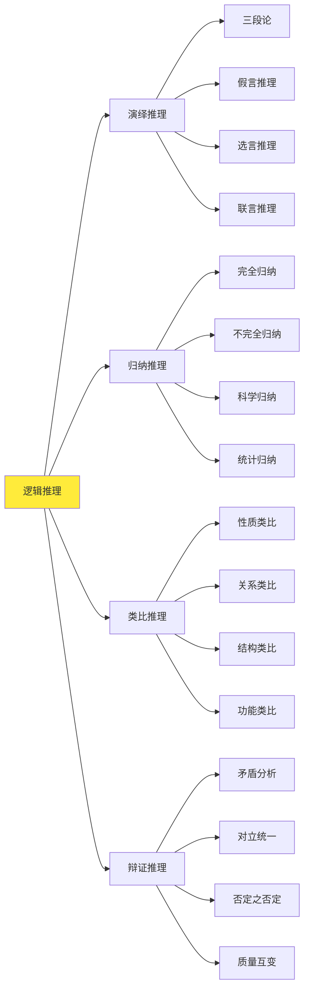

#### 22.2 批判思维关联网络

| 思维类型 | 核心概念 | 基础概念 | 关联概念 | 应用领域 | 认知难点 |
|---------|----------|----------|----------|----------|----------|
| **分析思维** | 要素分析 | 结构分析、功能分析 | 系统分析、层次分析 | 问题分析 | 复杂性 |
| **评价思维** | 标准评价 | 价值评价、效果评价 | 综合评价、动态评价 | 决策评价 | 主观性 |
| **推理思维** | 逻辑推理 | 演绎推理、归纳推理 | 类比推理、辩证推理 | 问题解决 | 逻辑性 |
| **创新思维** | 思维创新 | 发散思维、收敛思维 | 逆向思维、联想思维 | 创新设计 | 创造性 |

### 23. 逻辑学知识发展路径

**📈 逻辑学概念发展轨迹**

#### 23.1 逻辑能力发展路径

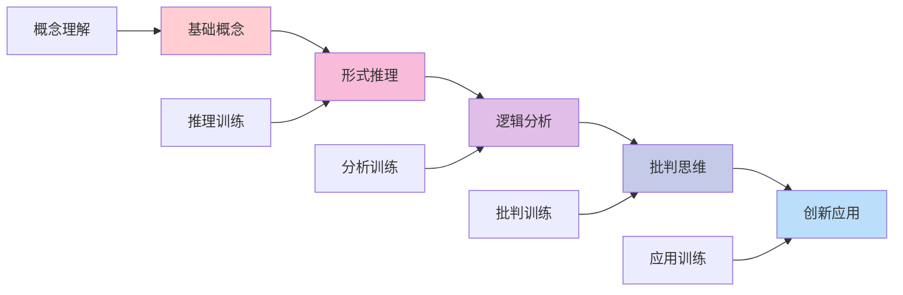

#### 23.2 批判思维发展

| 发展阶段 | 认知特征 | 思维表现 | 教学重点 | 评估标准 |
|---------|----------|----------|----------|----------|
| **基础认知** | 概念理解 | 基础理解 | 基础教学 | 理解准确性 |
| **逻辑分析** | 逻辑推理 | 逻辑分析 | 分析教学 | 分析深度 |
| **批判评价** | 批判思维 | 批判评价 | 评价教学 | 评价合理性 |
| **创新应用** | 创新思维 | 创新应用 | 创新教学 | 创新能力 |
| **综合应用** | 综合思维 | 综合应用 | 应用教学 | 应用能力 |

### 24. 国际化逻辑学教学内容

**🌍 国际逻辑学课程标准对比**

#### 24.1 美国Critical Thinking标准

**📊 核心内容领域**:

| 内容领域 | 核心概念 | 技能要求 | 应用能力 | 评估标准 |
|---------|----------|----------|----------|----------|
| **论证分析** | 论证结构 | 结构分析 | 论证评估 | 分析能力 |
| **逻辑推理** | 推理方法 | 推理训练 | 推理应用 | 推理能力 |
| **批判评价** | 评价标准 | 评价训练 | 评价应用 | 评价能力 |
| **问题解决** | 解决方法 | 方法训练 | 方法应用 | 解决能力 |

#### 24.2 英国Formal Logic特色

**🎯 英国逻辑学教学方法**:

1. **形式逻辑教学**
   - 命题逻辑
   - 谓词逻辑
   - 模态逻辑
   - 证明方法

2. **逻辑证明训练**
   - 公理系统
   - 推理规则
   - 证明技巧
   - 形式化方法

3. **逻辑应用方法**
   - 数学证明
   - 计算机科学
   - 人工智能
   - 哲学分析

### 25. 逻辑学知识关联深度分析

**🔗 跨领域知识关联**

#### 25.1 逻辑学与数学的关联

| 逻辑概念 | 数学背景 | 关联深度 | 教学策略 | 学习效果 |
|---------|----------|----------|----------|----------|
| **形式逻辑** | 数学证明 | 深度关联 | 证明训练 | 理解深化 |
| **集合论** | 数学集合 | 直接应用 | 集合分析 | 应用能力 |
| **数理逻辑** | 数学逻辑 | 方法迁移 | 逻辑探究 | 思维培养 |
| **证明论** | 数学证明 | 概念统一 | 多表征 | 综合能力 |

#### 25.2 逻辑学与计算机科学的关联

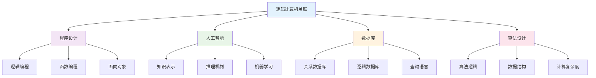

### 26. 逻辑学实践教学体系

**📖 基于知识图谱的实践教学**

#### 26.1 逻辑推理技能发展

| 推理技能 | 技能内容 | 发展要求 | 评估方法 | 应用领域 |
|---------|----------|----------|----------|----------|
| **演绎推理** | 逻辑推理 | 严密性 | 推理测试 | 数学证明 |
| **归纳推理** | 归纳总结 | 合理性 | 归纳测试 | 科学研究 |
| **类比推理** | 类比分析 | 相似性 | 类比测试 | 创新思维 |
| **辩证推理** | 辩证分析 | 全面性 | 辩证测试 | 哲学思考 |

#### 26.2 逻辑学教学创新

**🎯 现代逻辑学教学方法**:

1. **数字化逻辑环境**
   - 逻辑软件
   - 在线推理平台
   - 逻辑游戏
   - 虚拟实验室

2. **多媒体逻辑教学**
   - 逻辑动画
   - 交互式演示
   - 3D逻辑模型
   - 逻辑视频

3. **创新逻辑设计**
   - 逻辑实验
   - 思维训练
   - 创新应用
   - 跨学科整合

### 27. 逻辑学学习评估体系

**📊 基于知识图谱的评估框架**

#### 27.1 逻辑能力评估

| 评估维度 | 评估内容 | 评估方法 | 评估标准 | 发展指标 |
|---------|----------|----------|----------|----------|
| **概念能力** | 概念理解 | 概念测试 | 准确理解 | 概念清晰度 |
| **推理能力** | 逻辑推理 | 推理测试 | 推理严密 | 推理能力 |
| **分析能力** | 逻辑分析 | 分析测试 | 分析深度 | 分析能力 |
| **应用能力** | 逻辑应用 | 应用测试 | 应用效果 | 应用能力 |

#### 27.2 综合逻辑评估

**🎯 逻辑学综合能力评估矩阵**:

```mermaid
graph TD
    A[逻辑综合评估] --> B[概念能力]
    A --> C[推理能力]
    A --> D[分析能力]
    A --> E[应用能力]
    
    B --> B1[概念理解]
    B --> B2[概念分析]
    B --> B3[概念应用]
    
    C --> C1[演绎推理]
    C --> C2[归纳推理]
    C --> C3[类比推理]
    
    D --> D1[结构分析]
    D --> D2[功能分析]
    D --> D3[系统分析]
    
    E --> E1[数学应用]
    E --> E2[科学应用]
    E --> E3[生活应用]
    
    style A fill:#e3f2fd
    style B fill:#f3e5f5
    style C fill:#e8f5e8
    style D fill:#fff3e0
    style E fill:#fce4ec
```

### 28. 逻辑学教育国际化发展

**🌍 国际逻辑学教育趋势**

#### 28.1 全球逻辑学教育标准

| 标准体系 | 核心理念 | 内容特点 | 评估方式 | 发展趋势 |
|---------|----------|----------|----------|----------|
| **美国逻辑学** | 实用主义 | 应用导向 | 应用评估 | 技术整合 |
| **英国逻辑学** | 形式主义 | 理论深度 | 理论评估 | 理论发展 |
| **德国逻辑学** | 哲学传统 | 思辨深度 | 思辨评估 | 哲学整合 |
| **国际逻辑学** | 跨学科 | 综合视角 | 综合评估 | 学科融合 |

#### 28.2 逻辑学教育技术整合

**💻 数字化逻辑学教育**:

1. **智能学习系统**
   - 个性化逻辑训练
   - 自适应推理指导
   - 实时逻辑反馈

2. **虚拟学习环境**
   - 逻辑实验室
   - 推理训练平台
   - 思维体验空间

3. **多媒体教学平台**
   - 逻辑资源库
   - 推理工具集
   - 思维训练库
