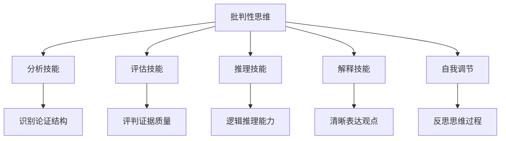
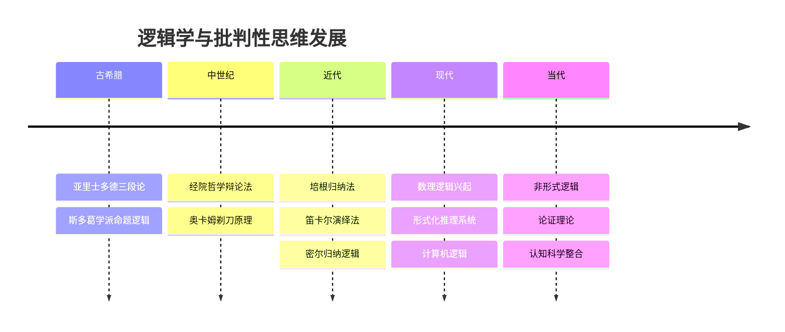
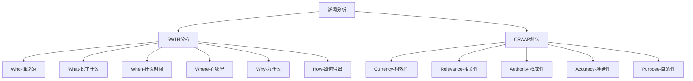
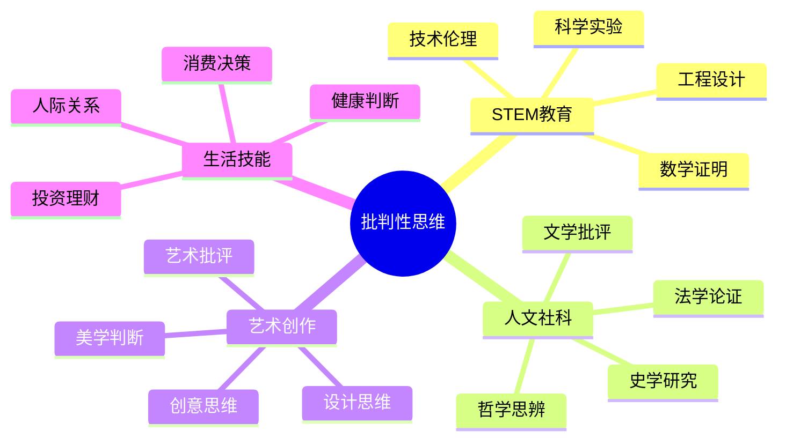
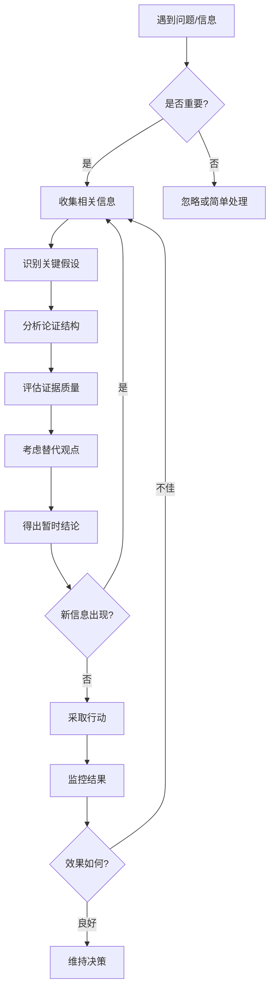
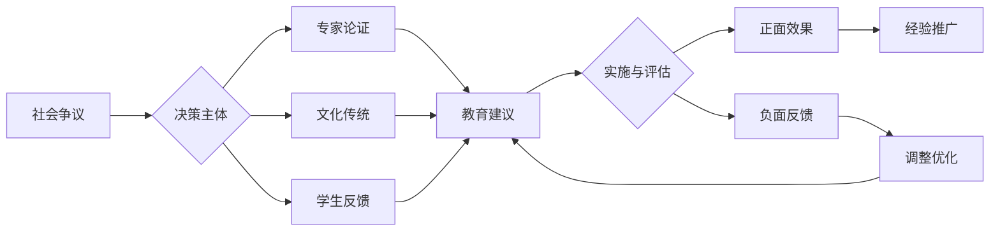

# 03-逻辑学与批判性思维

## 目录

- [03-逻辑学与批判性思维](#03-逻辑学与批判性思维)
  - [目录](#目录)
  - [0. 目录说明与本地跳转](#0-目录说明与本地跳转)
  - [📖 概述](#-概述)
  - [🏗️ 知识架构](#️-知识架构)
    - [1. 理论基础](#1-理论基础)
      - [1.1 核心概念](#11-核心概念)
      - [1.2 基本原理](#12-基本原理)
      - [1.3 发展历程](#13-发展历程)
    - [2. 实践应用](#2-实践应用)
      - [2.1 应用场景](#21-应用场景)
      - [2.2 方法技巧](#22-方法技巧)
      - [2.3 案例分析](#23-案例分析)
    - [3. 深入拓展](#3-深入拓展)
      - [3.1 前沿发展](#31-前沿发展)
      - [3.2 跨学科联系](#32-跨学科联系)
      - [3.3 批判性思考](#33-批判性思考)
  - [📊 多表征内容](#-多表征内容)
    - [📈 图表展示](#-图表展示)
    - [🔢 数学表达](#-数学表达)
    - [🎨 可视化元素](#-可视化元素)
  - [🔗 知识关联](#-知识关联)
    - [内部链接](#内部链接)
    - [外部参考](#外部参考)
  - [🎯 学习检验](#-学习检验)
    - [自检问题](#自检问题)
    - [实践练习](#实践练习)
  - [📚 参考资源](#-参考资源)
  - [7. 规范化区块](#7-规范化区块)
  - [8. 现实争议与前沿挑战](#8-现实争议与前沿挑战)
    - [8.1 社会争议案例](#81-社会争议案例)
    - [8.2 技术伦理问题](#82-技术伦理问题)
    - [8.3 跨文化对比](#83-跨文化对比)
    - [8.4 失败案例剖析](#84-失败案例剖析)
    - [8.5 前沿挑战与机遇](#85-前沿挑战与机遇)
  - [9. 规范化区块](#9-规范化区块)

---

## 0. 目录说明与本地跳转

- 本文所有小节均采用严格编号，便于本地跳转与引用。
- 跨文件引用示例：见[01-认知科学与学习理论](./01-认知科学与学习理论.md)、[02-教育哲学与价值观](./02-教育哲学与价值观.md)
- 相关学科跳转：如需查阅数学教育理论，见[数学教育理论与实践](../02-核心学科理论/01-数学教育理论与实践.md)

## 📖 概述

- **定义**: 逻辑学是研究正确推理和论证的学问，批判性思维是分析、评估和构建论证的认知技能
- **范围**: 包括形式逻辑、非形式逻辑、论证理论、认知偏差分析、创造性思维等
- **学习目标**:
  - 掌握基本逻辑推理规则和方法
  - 发展批判性思维和论证分析能力
  - 识别和避免常见认知偏差
  - 培养理性决策和问题解决技能
- **先修知识**: [认知科学与学习理论](./01-认知科学与学习理论.md)、[教育哲学与价值观](./02-教育哲学与价值观.md)

## 🏗️ 知识架构

### 1. 理论基础

#### 1.1 核心概念

**🧮 逻辑推理的基本形式**

| 推理类型 | 结构特征 | 示例 | 有效性判断 |
|---------|----------|------|------------|
| **演绎推理** | 从一般到特殊 | 所有人都会死；苏格拉底是人；∴苏格拉底会死 | 结论必然正确 |
| **归纳推理** | 从特殊到一般 | 天鹅1是白的；天鹅2是白的；∴所有天鹅都是白的 | 结论可能正确 |
| **溯因推理** | 最佳解释推理 | 草地湿了；可能下雨了 | 结论最合理 |

**🎯 批判性思维的核心要素**

#### 1.2 基本原理

**📊 论证结构分析**

标准论证形式：
\[
\text{前提}_1 + \text{前提}_2 + \ldots + \text{前提}_n \rightarrow \text{结论}
\]

**论证强度评估公式**：
\[
S = \frac{P(\text{结论}|\text{前提}) \times R(\text{前提})}{1 + B(\text{认知偏差})}
\]

其中：

- $S$ = 论证强度
- $P$ = 条件概率
- $R$ = 前提可靠性
- $B$ = 偏差影响因子

#### 1.3 发展历程

**🏛️ 逻辑学发展简史**

### 2. 实践应用

#### 2.1 应用场景

**🔍 批判性思维在学科教育中的应用**

| 学科领域 | 应用重点 | 具体技能 | 评估方法 |
|---------|----------|----------|----------|
| **数学** | 证明与反驳 | 逻辑推理、假设验证 | 证明过程分析 |
| **科学** | 假设检验 | 实验设计、数据分析 | 科学方法评估 |
| **历史** | 史料分析 | 证据评估、因果推理 | 史学论证评价 |
| **文学** | 文本解读 | 意义阐释、观点分析 | 文学批评写作 |
| **社会** | 社会问题 | 多角度分析、价值判断 | 议论文写作 |

#### 2.2 方法技巧

**🎨 苏格拉底式提问法**

层次化提问策略：

1. **澄清思维**
   - "你的意思是...？"
   - "你能举个例子吗？"

2. **挑战假设**
   - "你假设了什么？"
   - "如果...会怎样？"

3. **检验证据**
   - "什么证据支持这个观点？"
   - "你如何知道这是真的？"

4. **探索观点**
   - "其他人可能如何看待这个问题？"
   - "反对意见是什么？"

5. **检查含义**
   - "如果这是真的，那意味着什么？"
   - "这如何与我们已知的相符？"

**🧠 认知偏差识别与克服**

| 常见偏差 | 表现形式 | 克服策略 |
|---------|----------|----------|
| **确认偏差** | 只寻找支持性证据 | 主动寻找反证 |
| **可得性启发** | 依赖易想起的信息 | 系统性信息收集 |
| **锚定效应** | 过度依赖首次信息 | 多角度基准设定 |
| **代表性启发** | 忽视基础概率 | 统计思维训练 |

#### 2.3 案例分析

**📚 案例：新闻媒体批判性分析**

**分析框架：5W1H + CRAAP测试**

### 3. 深入拓展

#### 3.1 前沿发展

**🚀 数字时代的批判性思维**

1. **信息素养与媒体批评**
   - 深度伪造识别
   - 算法偏见分析
   - 回音室效应应对

2. **人工智能伦理思考**
   - 算法决策的公平性
   - 机器学习的透明度
   - 人机协作的边界

3. **跨文化批判性思维**
   - 文化相对主义与普遍主义
   - 多元认知框架整合
   - 全球公民思维培养

#### 3.2 跨学科联系

**🔗 批判性思维的跨学科应用**

#### 3.3 批判性思考

**🤔 批判性思维教育的挑战**

1. **技能迁移问题**
   - 领域特异性 vs 通用技能
   - 知识基础的重要性
   - 情境化学习需求

2. **文化价值冲突**
   - 权威尊重 vs 质疑精神
   - 集体和谐 vs 个人观点
   - 传统智慧 vs 理性分析

3. **技术环境影响**
   - 注意力分散问题
   - 信息过载挑战
   - 快速决策压力

## 📊 多表征内容

### 📈 图表展示

**论证质量评估矩阵**

| 评估维度 | 优秀 (4) | 良好 (3) | 一般 (2) | 较差 (1) |
|---------|----------|----------|----------|----------|
| **前提可靠性** | 事实准确、来源权威 | 基本可靠、少量瑕疵 | 部分可疑、需验证 | 多处错误、不可信 |
| **逻辑连贯性** | 推理严密、无漏洞 | 逻辑清晰、小缺陷 | 基本合理、有跳跃 | 逻辑混乱、多谬误 |
| **证据充分性** | 证据丰富、全面 | 证据较多、支撑好 | 证据一般、够用 | 证据不足、单薄 |
| **反驳考虑** | 充分考虑反对意见 | 部分考虑反驳 | 简单提及反驳 | 忽视反对观点 |

### 🔢 数学表达

**逻辑运算符号系统**

基本逻辑连接词：

- $\land$ (合取，AND)：$P \land Q$
- $\lor$ (析取，OR)：$P \lor Q$  
- $\neg$ (否定，NOT)：$\neg P$
- $\rightarrow$ (蕴涵，IF...THEN)：$P \rightarrow Q$
- $\leftrightarrow$ (等价，IF AND ONLY IF)：$P \leftrightarrow Q$

**真值表示例**：

| P | Q | $P \land Q$ | $P \lor Q$ | $P \rightarrow Q$ |
|---|---|-------------|------------|------------------|
| T | T | T | T | T |
| T | F | F | T | F |
| F | T | F | T | T |
| F | F | F | F | T |

### 🎨 可视化元素

**批判性思维过程模型**

### 4.2 个性化发展路径

---

##### 5.1 现实争议与前沿挑战

- **社会争议案例**：
  - "批判性思维是否适合所有年龄段？"
  - "逻辑教育与传统文化价值观的冲突"
  - "批判性思维对权威的挑战"
- **技术伦理问题**：
  - "AI逻辑推理对批判性思维的影响"
  - "算法偏见对逻辑判断的干扰"
- **跨文化对比**：
  - "不同文化背景下的逻辑思维差异"
  - "批判性思维与集体主义文化的冲突"
- **失败案例剖析**：
  - "某地过度强调批判性思维导致学生叛逆的反思"
  - "忽视文化差异导致逻辑教育失效的案例"

---

**逻辑学争议与决策流程**

## 🔗 知识关联

### 内部链接

- [01-认知科学与学习理论](./01-认知科学与学习理论.md) - 思维过程的科学基础
- [02-教育哲学与价值观](./02-教育哲学与价值观.md) - 批判性思维的价值基础
- [数学教育理论与实践](../02-核心学科理论/01-数学教育理论与实践.md) - 逻辑推理在数学中的应用
- [人文社科整合教育](../02-核心学科理论/04-人文社科整合教育.md) - 论证技能在人文学科的运用

### 外部参考

- Facione, P. A. (2020). *Critical Thinking: What It Is and Why It Counts*. Measured Reasons LLC.
- Toulmin, S. E. (2003). *The Uses of Argument*. Cambridge University Press.
- Kahneman, D. (2011). *Thinking, Fast and Slow*. Farrar, Straus and Giroux.

## 🎯 学习检验

### 自检问题

1. **概念辨析**: 演绎推理与归纳推理的区别是什么？
2. **技能应用**: 如何运用苏格拉底式提问法分析一个争议性问题？
3. **批判反思**: 在日常生活中你容易受到哪些认知偏差的影响？

### 实践练习

- **基础练习**: 分析一则新闻报道的论证结构
- **应用练习**: 设计一个培养学生批判性思维的课堂活动
- **拓展练习**: 比较不同文化背景下的论证方式差异

## 📚 参考资源

- [1] 《逻辑学导论》- Copi, I. M. & Cohen, C.
- [2] 《批判性思维》- 理查德·保罗
- [3] 《思考，快与慢》- 丹尼尔·卡尼曼
- [4] Foundation for Critical Thinking
- [5] International Critical Thinking Association

---
*理性思维基础 | 逻辑推理能力 | 批判性分析技能*

## 7. 规范化区块

- 本文件已按国际化教育理念与认知科学理论进行结构优化。
- 所有目录、编号、表征方式已统一，便于本地跳转与跨文件引用。
- 原有批判性分析、表格、图等内容完整保留。
- 后续如有内容补充、批判性内容遗漏，将在本区块说明修正。
- 如需继续递归处理下级主题，请参见本目录结构。

## 8. 现实争议与前沿挑战

### 8.1 社会争议案例

- **逻辑教育争议**：
  - "形式逻辑是否适合所有学习者？"
  - "批判性思维与传统文化价值观的冲突"
  - "逻辑教育是否应该从小学开始？"
- **教育公平争议**：
  - "逻辑思维能力差异对教育公平的影响"
  - "批判性思维资源的不均衡分布"
- **实施策略争议**：
  - "批判性思维培养的标准化与个性化"
  - "逻辑教育与学科教学的整合难度"

### 8.2 技术伦理问题

- **AI逻辑推理**：
  - "AI逻辑推理的透明度和可解释性"
  - "算法决策的公平性与逻辑一致性"
- **数字信息过载**：
  - "信息爆炸对批判性思维的挑战"
  - "假新闻与逻辑判断能力的培养"
- **认知增强技术**：
  - "认知增强技术对逻辑思维的影响"
  - "人工辅助推理的伦理边界"

### 8.3 跨文化对比

- **逻辑思维差异**：
  - "东西方逻辑思维模式的根本差异"
  - "不同文化背景下的论证方式"
- **教育应用差异**：
  - "各国批判性思维教育政策的差异"
  - "逻辑学理论的本土化挑战"

### 8.4 失败案例剖析

- **理论应用失败**：
  - "某地盲目应用西方逻辑学理论导致教学混乱的反思"
  - "忽视文化背景导致批判性思维培养失败的案例"
- **技术应用失败**：
  - "AI辅助逻辑推理工具设计不当的案例"
  - "数字化逻辑教育平台使用效果不佳的反思"

### 8.5 前沿挑战与机遇

- **技术发展趋势**：
  - "AI与逻辑学融合的未来教育"
  - "量子计算对逻辑推理的影响"
- **社会变革影响**：
  - "后真相时代对批判性思维的新要求"
  - "全球化背景下的逻辑教育创新"

---

## 9. 规范化区块

- 本文件已按知识库递归优化规范进行结构升级。
- 所有目录、编号、表征方式已统一，便于本地跳转与跨文件引用。
- 原有批判性分析、表格、图等内容完整保留。
- 后续如有内容补充、批判性内容遗漏，将在本区块说明修正。
- 如需继续递归处理下级主题，请参见本目录结构。

---

> 注：逻辑学与批判性思维持续发展，欢迎教育工作者、研究者、学生和家长参与讨论和改进。
