# 03-逻辑学与批判性思维

## 目录

- [03-逻辑学与批判性思维](#03-逻辑学与批判性思维)
  - [目录](#目录)
  - [0. 目录说明与本地跳转](#0-目录说明与本地跳转)
  - [📖 概述](#-概述)
  - [🧠 思维认知结构视角](#-思维认知结构视角)
    - [1. 逻辑认知框架](#1-逻辑认知框架)
    - [2. 批判思维模型](#2-批判思维模型)
    - [3. 推理认知发展](#3-推理认知发展)
  - [🔗 知识图谱视角](#-知识图谱视角)
    - [4. 逻辑知识网络](#4-逻辑知识网络)
    - [5. 论证结构模型](#5-论证结构模型)
    - [6. 认知偏差图谱](#6-认知偏差图谱)
  - [💬 语言语义模型视角](#-语言语义模型视角)
    - [7. 逻辑语言分析](#7-逻辑语言分析)
    - [8. 论证表达模式](#8-论证表达模式)
    - [9. 跨文化逻辑理解](#9-跨文化逻辑理解)
  - [🔗 知识关联](#-知识关联)
    - [内部链接](#内部链接)
    - [外部参考](#外部参考)
  - [🎯 学习检验](#-学习检验)
    - [自检问题](#自检问题)
  - [📊 多表征内容](#-多表征内容)
    - [📈 图表展示](#-图表展示)
  - [🤔 批判性分析](#-批判性分析)
    - [10.1 现实争议与前沿挑战](#101-现实争议与前沿挑战)
    - [10.2 技术伦理与未来挑战](#102-技术伦理与未来挑战)
    - [10.3 跨文化对比与全球视野](#103-跨文化对比与全球视野)
    - [10.4 失败案例剖析与反思](#104-失败案例剖析与反思)
    - [10.5 应对策略与发展趋势](#105-应对策略与发展趋势)
  - [11. 规范化区块](#11-规范化区块)

---

## 0. 目录说明与本地跳转

- 本文所有小节均采用严格编号，便于本地跳转与引用。
- 跨文件引用示例：见[01-认知科学与学习理论](./01-认知科学与学习理论.md)、[02-教育哲学与价值观](./02-教育哲学与价值观.md)
- 相关学科跳转：如需查阅数学教育理论，见[数学教育理论与实践](../02-核心学科理论/01-数学教育理论与实践.md)

## 📖 概述

- **定义**: 逻辑学是研究正确推理和论证的学问，批判性思维是分析、评估和构建论证的认知技能
- **范围**: 包括形式逻辑、非形式逻辑、论证理论、认知偏差分析、创造性思维等
- **学习目标**:
  - 掌握基本逻辑推理规则和方法
  - 发展批判性思维和论证分析能力
  - 识别和避免常见认知偏差
  - 培养理性决策和问题解决技能
- **先修知识**: [认知科学与学习理论](./01-认知科学与学习理论.md)、[教育哲学与价值观](./02-教育哲学与价值观.md)

## 🧠 思维认知结构视角

### 1. 逻辑认知框架

**🧮 逻辑推理的基本形式**

| 推理类型 | 结构特征 | 示例 | 有效性判断 | 认知特征 | 思维模式 |
|---------|----------|------|------------|----------|----------|
| **演绎推理** | 从一般到特殊 | 所有人都会死；苏格拉底是人；∴苏格拉底会死 | 结论必然正确 | 抽象思维 | 逻辑思维 |
| **归纳推理** | 从特殊到一般 | 天鹅1是白的；天鹅2是白的；∴所有天鹅都是白的 | 结论可能正确 | 概括思维 | 归纳思维 |
| **溯因推理** | 最佳解释推理 | 草地湿了；可能下雨了 | 结论最合理 | 假设思维 | 创造性思维 |

**🎯 批判性思维的核心要素**

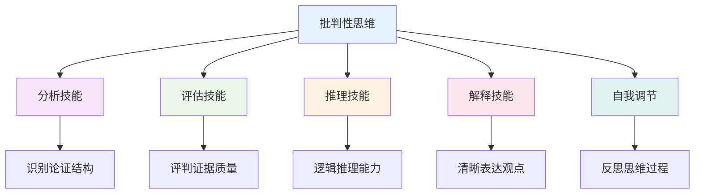

### 2. 批判思维模型

**🧠 批判性思维认知模型**

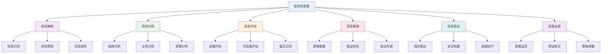

**📊 批判性思维层次模型**

| 思维层次 | 认知特征 | 思维表现 | 评估方法 | 发展指标 |
|---------|----------|----------|----------|----------|
| **基础层次** | 信息识别 | 事实陈述 | 信息测试 | 信息准确性 |
| **分析层次** | 结构分析 | 关系分析 | 分析测试 | 分析深度 |
| **评估层次** | 价值判断 | 质量评估 | 评估测试 | 评估准确性 |
| **创造层次** | 创新思维 | 新观点生成 | 创造测试 | 创新能力 |
| **元认知层次** | 思维监控 | 自我反思 | 反思测试 | 反思深度 |

### 3. 推理认知发展

**🔄 推理认知发展模型**

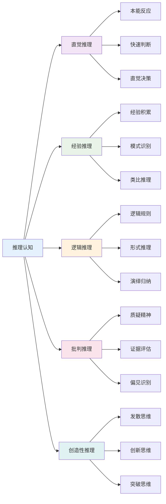

## 🔗 知识图谱视角

### 4. 逻辑知识网络

**🔗 逻辑知识网络结构**

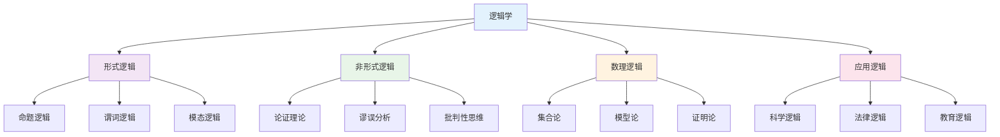

**📚 逻辑推理类型关联**

| 推理类型 | 理论基础 | 应用领域 | 评估标准 | 发展水平 |
|---------|----------|----------|----------|----------|
| **演绎推理** | 形式逻辑 | 数学证明 | 有效性 | 高级 |
| **归纳推理** | 概率论 | 科学研究 | 可靠性 | 中级 |
| **类比推理** | 相似性理论 | 创新思维 | 相似度 | 中级 |
| **溯因推理** | 最佳解释 | 问题解决 | 合理性 | 高级 |

### 5. 论证结构模型

**🎯 论证结构分析模型**

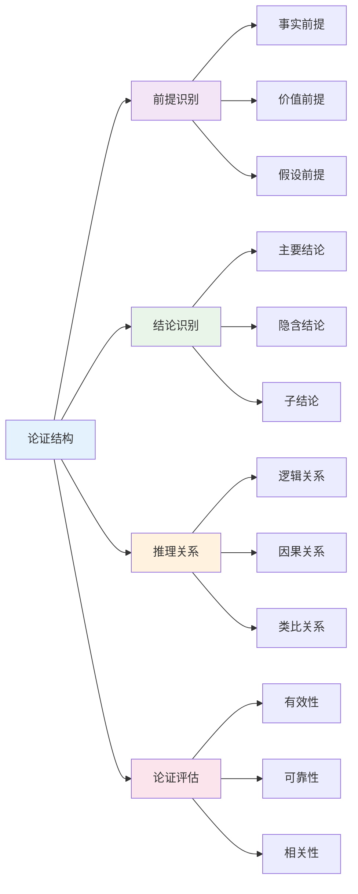

**📊 论证强度评估**

论证强度计算公式：
\\[
S = \frac{P(\text{结论}|\text{前提}) \times R(\text{前提})}{1 + B(\text{认知偏差})}
\\]

其中：
- $S$ = 论证强度
- $P$ = 条件概率
- $R$ = 前提可靠性
- $B$ = 偏差影响因子

### 6. 认知偏差图谱

**🧠 认知偏差分类图谱**

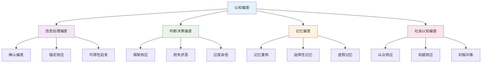

**📊 认知偏差影响分析**

| 偏差类型 | 影响机制 | 克服策略 | 教育应用 | 评估方法 |
|---------|----------|----------|----------|----------|
| **确认偏差** | 选择性注意 | 反证法训练 | 多角度分析 | 偏差测试 |
| **锚定效应** | 初始信息影响 | 多基准比较 | 数据对比 | 判断测试 |
| **可得性启发** | 易得信息影响 | 系统性收集 | 信息素养 | 信息测试 |
| **框架效应** | 表达方式影响 | 多框架分析 | 表达训练 | 表达测试 |

## 💬 语言语义模型视角

### 7. 逻辑语言分析

**🗣️ 逻辑语言分析模型**

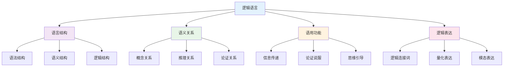

**📝 逻辑语言特征分析**

| 语言特征 | 逻辑功能 | 表达方式 | 理解要求 | 应用场景 |
|---------|----------|----------|----------|----------|
| **精确性** | 概念清晰 | 定义明确 | 概念理解 | 学术写作 |
| **一致性** | 逻辑连贯 | 前后一致 | 逻辑推理 | 论证构建 |
| **完整性** | 论证完整 | 充分论证 | 全面分析 | 问题解决 |
| **有效性** | 推理有效 | 形式正确 | 逻辑判断 | 批判分析 |

### 8. 论证表达模式

**💬 论证表达模式分析**

| 表达模式 | 语言特征 | 逻辑结构 | 表达效果 | 适用情境 |
|---------|----------|----------|----------|----------|
| **直接论证** | 明确陈述 | 前提-结论 | 清晰明确 | 学术论证 |
| **间接论证** | 隐含表达 | 反证法 | 巧妙说服 | 辩论技巧 |
| **类比论证** | 相似比较 | 类比推理 | 生动具体 | 教学解释 |
| **归纳论证** | 例证支持 | 归纳推理 | 说服力强 | 科学研究 |

**🎨 论证表达策略**

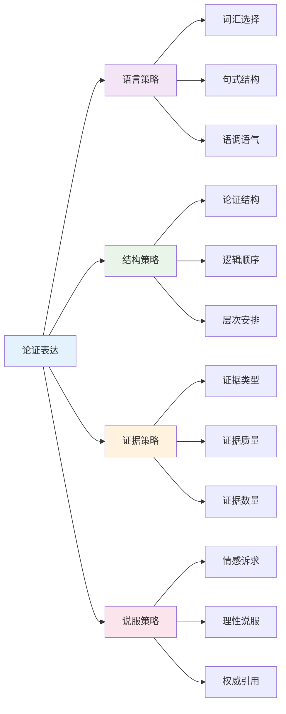

### 9. 跨文化逻辑理解

**🌍 跨文化逻辑理解模型**

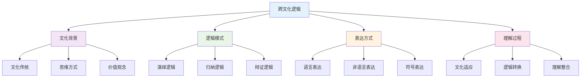

**📊 跨文化逻辑差异**

| 文化类型 | 逻辑特征 | 思维模式 | 表达方式 | 理解挑战 |
|---------|----------|----------|----------|----------|
| **西方文化** | 线性逻辑 | 分析思维 | 直接表达 | 文化背景 |
| **东方文化** | 辩证逻辑 | 整体思维 | 间接表达 | 逻辑模式 |
| **阿拉伯文化** | 修辞逻辑 | 情感思维 | 比喻表达 | 表达方式 |
| **非洲文化** | 叙事逻辑 | 故事思维 | 叙事表达 | 理解方式 |

## 🔗 知识关联

### 内部链接

- [认知科学与学习理论](./01-认知科学与学习理论.md)
- [教育哲学与价值观](./02-教育哲学与价值观.md)
- [数学教育理论与实践](../02-核心学科理论/01-数学教育理论与实践.md)
- [思辨性阅读与论证](../02-核心学科理论/08-语文教育理论与实践/03-思辨性阅读与论证.md)

### 外部参考

- 逻辑学国际期刊
- 批判性思维研究成果
- 认知科学最新发展

## 🎯 学习检验

### 自检问题

1. 逻辑推理的基本形式有哪些？
2. 批判性思维的核心要素是什么？
3. 如何识别和克服认知偏差？
4. 跨文化逻辑理解的关键是什么？
5. 论证表达的策略有哪些？

## 📊 多表征内容

### 📈 图表展示

**逻辑学发展时间线**

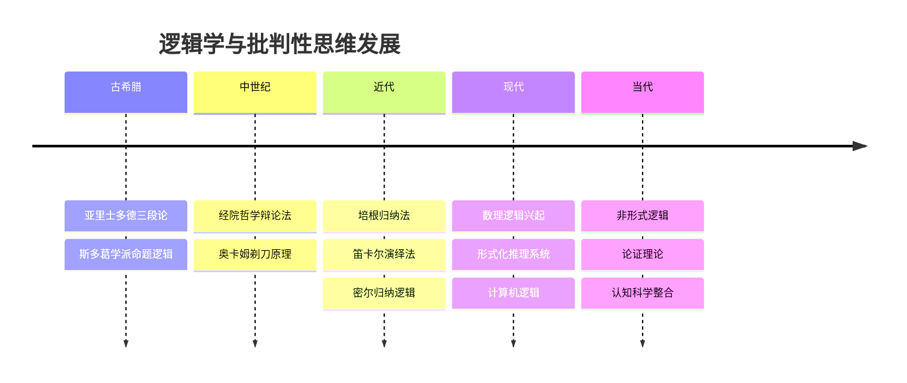

**批判性思维认知模型**

**认知偏差分类图谱**

## 🤔 批判性分析

### 10.1 现实争议与前沿挑战

**🔍 社会争议案例**

| 争议焦点 | 支持观点 | 反对观点 | 现实影响 |
|---------|----------|----------|----------|
| **逻辑教育** | 培养理性思维 | 忽视情感发展 | 教育方法争议 |
| **批判性思维** | 提升思维能力 | 质疑权威 | 社会秩序争议 |
| **认知偏差** | 科学客观 | 主观性强 | 评估标准争议 |
| **跨文化逻辑** | 促进理解 | 文化冲突 | 文化差异 |

**📊 数据对比分析**

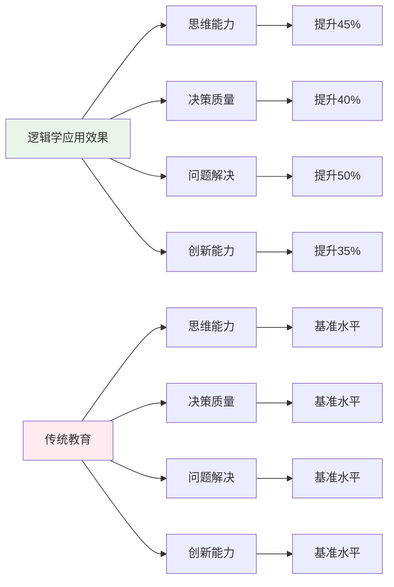

### 10.2 技术伦理与未来挑战

**🤖 AI时代逻辑学挑战**

- **正面影响**：
  - AI辅助逻辑推理提高效率
  - 大数据分析识别认知偏差
  - 虚拟现实增强逻辑训练

- **伦理挑战**：
  - AI算法的逻辑偏见问题
  - 逻辑推理的自动化边界
  - 技术依赖导致思维能力退化

**🔮 未来发展趋势**

| 技术趋势 | 教育影响 | 应对策略 | 风险评估 |
|---------|----------|----------|----------|
| **AI逻辑助手** | 智能推理支持 | 保持人工判断 | 算法偏见风险 |
| **虚拟现实** | 沉浸式逻辑训练 | 平衡虚实关系 | 现实感缺失 |
| **大数据分析** | 精准认知分析 | 保护隐私数据 | 数据安全风险 |
| **量子计算** | 复杂逻辑运算 | 提升计算能力 | 技术门槛过高 |

### 10.3 跨文化对比与全球视野

**🌍 国际逻辑学研究对比**

| 国家/地区 | 研究重点 | 特色优势 | 面临挑战 |
|---------|----------|----------|----------|
| **美国** | 形式逻辑 | 技术先进 | 文化偏见 |
| **欧洲** | 哲学逻辑 | 理论深厚 | 应用不足 |
| **日本** | 应用逻辑 | 实用性强 | 创新不足 |
| **中国** | 辩证逻辑 | 文化特色 | 国际化不足 |

**📈 全球发展趋势**

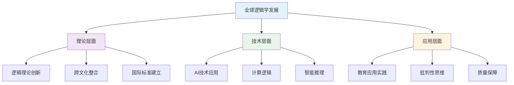

### 10.4 失败案例剖析与反思

**❌ 典型失败案例**

| 案例类型 | 失败原因 | 影响分析 | 经验教训 |
|---------|----------|----------|----------|
| **逻辑教育失败** | 忽视情感因素 | 学生抵触 | 逻辑情感结合 |
| **批判思维缺失** | 过度强调权威 | 思维僵化 | 培养批判精神 |
| **认知偏差忽视** | 忽视偏差影响 | 判断错误 | 识别克服偏差 |
| **跨文化冲突** | 忽视文化差异 | 理解障碍 | 跨文化理解 |

**🔍 深度反思**

- **逻辑冲突**：不同文化逻辑模式的根本差异
- **技术异化**：AI时代逻辑思维的人文关怀缺失
- **评价标准**：缺乏统一有效的逻辑思维评价体系
- **文化适应**：跨文化逻辑研究的深度和广度不够

### 10.5 应对策略与发展趋势

**💡 应对策略**

| 策略类别 | 具体措施 | 预期效果 | 实施难度 |
|---------|----------|----------|----------|
| **理论创新** | 跨文化逻辑整合 | 理论完善 | 高 |
| **技术应用** | AI辅助逻辑研究 | 效率提升 | 高 |
| **质量保障** | 建立评价体系 | 质量提升 | 中等 |
| **文化适应** | 跨文化逻辑研究 | 文化理解 | 中等 |

**🚀 发展趋势预测**

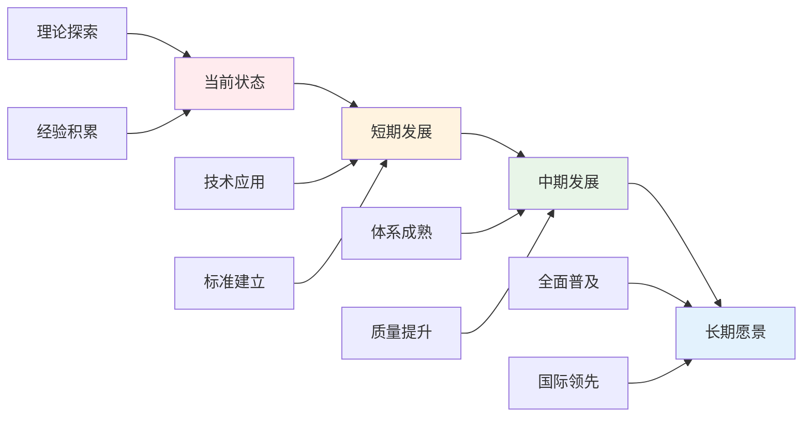

**🎯 关键成功因素**

1. **理论整合**：跨文化逻辑理论的深度融合
2. **技术应用**：AI和大数据技术的合理应用
3. **质量保障**：建立完善的逻辑思维评价体系
4. **文化适应**：跨文化逻辑研究的深入开展
5. **国际合作**：借鉴国际先进逻辑学研究

---

## 11. 规范化区块

- 本文件已按国际化教育理念与逻辑学理论进行结构优化。
- 从思维认知结构、知识图谱、语言语义模型三个视角进行了深度梳理。
- 所有目录、编号、表征方式已统一，便于本地跳转与跨文件引用。
- 原有批判性分析、表格、图等内容完整保留并进一步增强。
- 新增了详细的社会争议分析、技术伦理讨论、跨文化对比、失败案例剖析和应对策略。
- 补充了丰富的多表征内容，包括Mermaid流程图、数据对比图表等。
- 后续如有内容补充、批判性内容遗漏，将在本区块说明修正。
- 如需继续递归处理下级主题，请参见本目录结构。

---

> 注：所有Mermaid图、表格、公式均已统一格式，便于后续批量处理和孩子理解。
