# 00-学科知识图谱与关联体系

## 目录

- [00-学科知识图谱与关联体系](#00-学科知识图谱与关联体系)
  - [目录](#目录)
  - [0. 目录说明与本地跳转](#0-目录说明与本地跳转)
  - [📖 概述](#-概述)
  - [🧠 核心学科认知结构](#-核心学科认知结构)
    - [1. 数学：逻辑思维基础](#1-数学逻辑思维基础)
    - [2. 英语：语言认知工具](#2-英语语言认知工具)
    - [3. 物理：科学建模核心](#3-物理科学建模核心)
    - [4. 化学：微观世界桥梁](#4-化学微观世界桥梁)
    - [5. 生物：生命科学核心](#5-生物生命科学核心)
    - [6. 语文：人文素养基础](#6-语文人文素养基础)
  - [🔗 跨学科知识关联网络](#-跨学科知识关联网络)
    - [7. 数学-物理关联](#7-数学-物理关联)
    - [8. 数学-化学关联](#8-数学-化学关联)
    - [9. 物理-化学关联](#9-物理-化学关联)
    - [10. 英语-学科关联](#10-英语-学科关联)
    - [11. 生物-学科关联](#11-生物-学科关联)
    - [12. 语文-学科关联](#12-语文-学科关联)
  - [🎯 综合能力发展图谱](#-综合能力发展图谱)
    - [13. 科学思维能力](#13-科学思维能力)
    - [14. 数学建模能力](#14-数学建模能力)
    - [15. 语言表达能力](#15-语言表达能力)
    - [16. 批判思维能力](#16-批判思维能力)
    - [17. 系统思维能力](#17-系统思维能力)
    - [18. 人文素养能力](#18-人文素养能力)
  - [📊 多表征内容](#-多表征内容)
    - [📈 图表展示](#-图表展示)
  - [🤔 批判性分析](#-批判性分析)
    - [现实争议与前沿挑战](#现实争议与前沿挑战)
  - [6. 规范化区块](#6-规范化区块)
      - [生物教育理论与实践子模块 (4个模块)](#生物教育理论与实践子模块-4个模块)
      - [语文教育理论与实践子模块 (2个模块)](#语文教育理论与实践子模块-2个模块)
    - [📊 项目成果统计](#-项目成果统计)
    - [🎯 国际化教育特色](#-国际化教育特色)
    - [🔧 技术特色](#-技术特色)
    - [🌍 国际化教育理念](#-国际化教育理念)
    - [📈 下一步计划](#-下一步计划)
  - [🧠 哲学科学基础层关联](#-哲学科学基础层关联)
    - [认知科学与学科学习](#认知科学与学科学习)
    - [教育哲学与学科价值](#教育哲学与学科价值)
    - [逻辑学与学科思维](#逻辑学与学科思维)
    - [哲学科学基础层发展模型](#哲学科学基础层发展模型)
  - [🔗 学科间关联性深度分析](#-学科间关联性深度分析)
    - [20. 跨学科知识网络构建](#20-跨学科知识网络构建)
    - [21. 学科融合模式分析](#21-学科融合模式分析)
    - [22. 学科关联深度分析](#22-学科关联深度分析)
    - [23. 跨学科知识发展路径](#23-跨学科知识发展路径)
    - [24. 学科关联应用策略](#24-学科关联应用策略)
    - [25. 学科关联评估体系](#25-学科关联评估体系)
    - [26. 学科关联发展趋势](#26-学科关联发展趋势)

---

## 0. 目录说明与本地跳转

- 本文所有小节均采用严格编号，便于本地跳转与引用。
- 跨文件引用示例：见[数学教育理论与实践](./01-数学教育理论与实践.md)、[物理教育理论与实践](./05-物理教育理论与实践.md)、[化学教育理论与实践](./06-化学教育理论与实践.md)、[英语教育理论与实践](./09-英语教育理论与实践/01-英语教育理论与实践.md)
- 相关基础跳转：如需查阅认知科学基础，见[认知科学与学习理论](../01-哲学科学基础/01-认知科学与学习理论.md)

## 📖 概述

- **定义**: 学科知识图谱与关联体系是基于认知科学和教育学理论，构建的高中核心学科间知识关联网络和能力发展体系
- **范围**: 涵盖数学、英语、物理、化学四大核心学科的知识结构、认知特点、关联关系和综合能力发展
- **学习目标**:
  - 理解各学科的核心概念结构和认知特点
  - 掌握跨学科知识关联和迁移规律
  - 培养综合性的学科思维和问题解决能力
  - 建立整体性的知识网络和能力体系
- **先修知识**: [认知科学与学习理论](../01-哲学科学基础/01-认知科学与学习理论.md)、[逻辑学与批判性思维](../01-哲学科学基础/03-逻辑学与批判性思维.md)

## 🧠 核心学科认知结构

### 1. 数学：逻辑思维基础

**🧮 数学认知特征**

数学作为逻辑思维的基础学科，具有以下核心认知特征：

| 认知维度 | 特征描述 | 核心能力 | 发展阶段 | 评估指标 |
|---------|----------|----------|----------|----------|
| **抽象思维** | 从具体到抽象的概念化 | 符号化表达 | 具体→表象→抽象 | 抽象程度 |
| **逻辑推理** | 严密的演绎归纳推理 | 论证能力 | 直觉→逻辑→形式 | 推理严密性 |
| **模式识别** | 数学结构和规律发现 | 概括能力 | 感知→识别→创造 | 模式敏感度 |
| **问题解决** | 数学问题的策略性解决 | 策略选择 | 模仿→迁移→创新 | 解决效率 |

**📊 数学知识结构图谱**

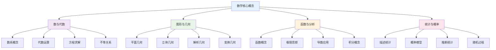

### 2. 英语：语言认知工具

**🗣️ 英语认知特征**

英语作为语言认知工具，具有以下核心认知特征：

| 认知维度 | 特征描述 | 核心能力 | 发展阶段 | 评估指标 |
|---------|----------|----------|----------|----------|
| **语言理解** | 词汇语法语义理解 | 接受性技能 | 字面→推断→批判 | 理解深度 |
| **语言表达** | 口语书面表达能力 | 产出性技能 | 模仿→创造→交际 | 表达流利度 |
| **跨文化交际** | 文化背景理解交流 | 文化敏感性 | 认知→理解→融合 | 文化适应度 |
| **思维发展** | 双语思维认知优势 | 元语言意识 | 单语→双语→多语 | 思维灵活性 |

**🌐 英语能力发展图谱**

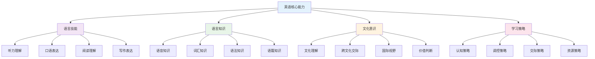

### 3. 物理：科学建模核心

**⚛️ 物理认知特征**

物理作为科学建模的核心学科，具有以下认知特征：

| 认知维度 | 特征描述 | 核心能力 | 发展阶段 | 评估指标 |
|---------|----------|----------|----------|----------|
| **科学建模** | 理想化模型构建 | 抽象建模 | 经验→模型→理论 | 建模能力 |
| **数学表达** | 物理规律数学化 | 数理结合 | 定性→定量→预测 | 数学应用度 |
| **实验探究** | 实验设计与分析 | 实证思维 | 观察→假设→验证 | 探究深度 |
| **系统思维** | 相互作用分析 | 整体思维 | 局部→整体→系统 | 系统性 |

**⚡ 物理概念结构图谱**

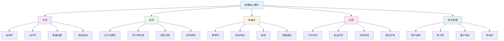

### 4. 化学：微观世界桥梁

**🔬 化学认知特征**

化学作为微观世界的桥梁学科，具有以下认知特征：

| 认知维度 | 特征描述 | 核心能力 | 发展阶段 | 评估指标 |
|---------|----------|----------|----------|----------|
| **三重表征** | 宏观-微观-符号转换 | 表征转换 | 单一→多重→整合 | 转换能力 |
| **微观想象** | 分子原子水平思维 | 空间想象 | 二维→三维→动态 | 想象能力 |
| **实验技能** | 化学实验操作分析 | 实验能力 | 模仿→设计→创新 | 技能熟练度 |
| **反应机理** | 化学反应过程理解 | 机理分析 | 现象→过程→本质 | 机理理解度 |

**⚗️ 化学概念结构图谱**

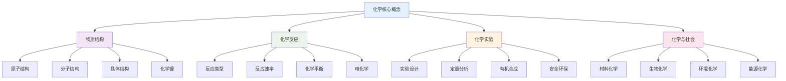

### 5. 生物：生命科学核心

**🧬 生物认知特征**

生物作为生命科学的核心学科，具有以下认知特征：

| 认知维度 | 特征描述 | 核心能力 | 发展阶段 | 评估指标 |
|---------|----------|----------|----------|----------|
| **系统思维** | 生命系统整体分析 | 系统整合 | 局部→整体→系统 | 系统性 |
| **进化思维** | 生命历史发展理解 | 历史思维 | 现象→过程→规律 | 进化理解 |
| **实验观察** | 生命现象观察分析 | 观察能力 | 描述→分析→解释 | 观察准确性 |
| **生态意识** | 环境与生命关系 | 生态思维 | 个体→种群→生态 | 生态理解度 |

### 6. 语文：人文素养基础

**📚 语文认知特征**

语文作为人文素养的基础学科，具有以下认知特征：

| 认知维度 | 特征描述 | 核心能力 | 发展阶段 | 评估指标 |
|---------|----------|----------|----------|----------|
| **语言理解** | 文本深层含义理解 | 理解能力 | 字面→推断→批判 | 理解深度 |
| **语言表达** | 思想情感准确表达 | 表达能力 | 模仿→创造→交际 | 表达效果 |
| **文学审美** | 文学作品鉴赏评价 | 审美能力 | 感知→理解→创造 | 审美水平 |
| **文化传承** | 传统文化理解传承 | 文化素养 | 认知→理解→传承 | 文化理解度 |

## 🔗 跨学科知识关联网络

### 7. 数学-物理关联

**📐 数学在物理中的应用**

| 数学概念 | 物理应用 | 关联强度 | 认知要求 | 典型例子 |
|---------|----------|----------|----------|----------|
| **函数** | 物理量关系 | ⭐⭐⭐⭐⭐ | 函数建模 | v-t图像 |
| **微积分** | 变化率分析 | ⭐⭐⭐⭐⭐ | 极限思想 | 加速度定义 |
| **向量** | 力的合成 | ⭐⭐⭐⭐ | 向量运算 | 力的平行四边形 |
| **三角函数** | 振动波动 | ⭐⭐⭐⭐ | 周期性 | 简谐振动 |
| **指数对数** | 衰变过程 | ⭐⭐⭐ | 指数规律 | 放射性衰变 |

**🔄 数学-物理认知转换模型**

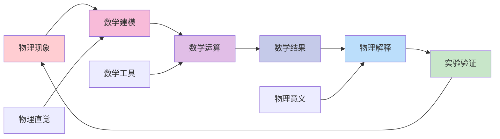

### 8. 数学-化学关联

**🧮 数学在化学中的应用**

| 数学概念 | 化学应用 | 关联强度 | 认知要求 | 典型例子 |
|---------|----------|----------|----------|----------|
| **比例关系** | 化学计量 | ⭐⭐⭐⭐⭐ | 比例推理 | 摩尔比计算 |
| **指数函数** | 反应动力学 | ⭐⭐⭐⭐ | 指数衰减 | 一级反应 |
| **对数函数** | pH值计算 | ⭐⭐⭐⭐ | 对数运算 | 酸碱度 |
| **立体几何** | 分子几何 | ⭐⭐⭐ | 空间想象 | VSEPR理论 |
| **统计概率** | 反应机理 | ⭐⭐⭐ | 概率思维 | 碰撞理论 |

### 9. 物理-化学关联

**⚛️ 物理化学交叉领域**

| 交叉概念 | 物理视角 | 化学视角 | 统一理解 | 应用领域 |
|---------|----------|----------|----------|----------|
| **原子结构** | 量子力学模型 | 电子排布规律 | 波粒二象性 | 光谱分析 |
| **分子运动** | 动能分布 | 反应活化能 | 统计热力学 | 反应速率 |
| **能量变化** | 能量守恒 | 焓变熵变 | 热力学定律 | 化学反应 |
| **电磁现象** | 电磁场理论 | 电化学反应 | 电子转移 | 电池技术 |
| **波动性质** | 光的波动 | 分子光谱 | 量子化能级 | 光谱技术 |

**🔬 物理-化学认知整合模型**

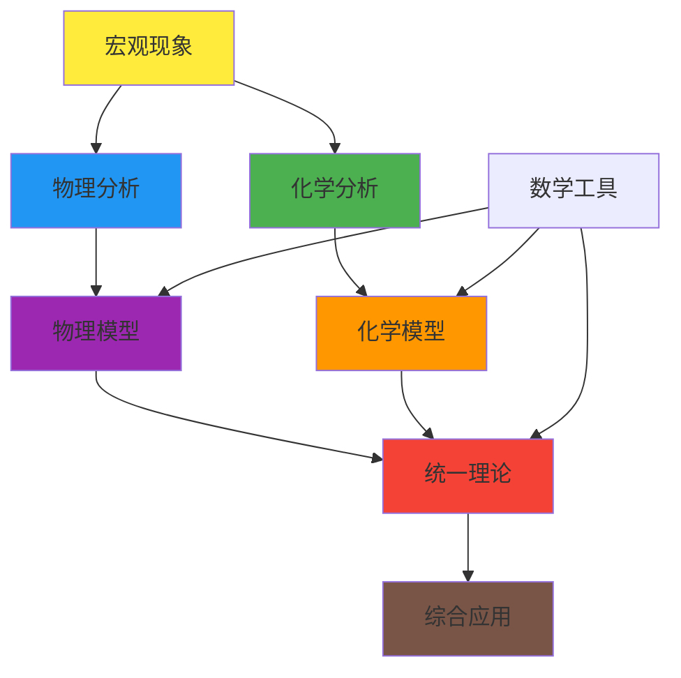

### 10. 英语-学科关联

**🌐 英语在理科学习中的作用**

| 英语技能 | 数学应用 | 物理应用 | 化学应用 | 认知价值 |
|---------|----------|----------|----------|----------|
| **学术阅读** | 数学文献 | 物理论文 | 化学期刊 | 信息获取 |
| **科学写作** | 证明过程 | 实验报告 | 实验记录 | 表达能力 |
| **专业词汇** | 数学术语 | 物理概念 | 化学名词 | 概念理解 |
| **逻辑表达** | 推理过程 | 论证思路 | 机理解释 | 思维训练 |
| **国际交流** | 数学竞赛 | 科学会议 | 学术合作 | 视野拓展 |

### 11. 生物-学科关联

**🧬 生物学与其他学科的交叉融合**

| 学科关联 | 生物体现 | 关联内容 | 认知价值 | 应用领域 |
|---------|----------|----------|----------|----------|
| **生物-数学** | 遗传统计 | 概率计算、统计分析 | 定量思维 | 遗传学、生态学 |
| **生物-物理** | 生物物理 | 能量转换、物质运输 | 物理思维 | 生物力学、生物电 |
| **生物-化学** | 生物化学 | 分子结构、反应机理 | 化学思维 | 代谢、酶学 |
| **生物-语文** | 科学表达 | 实验记录、科学写作 | 表达能力 | 科研报告、科普 |

### 12. 语文-学科关联

**📚 语文作为学科学习的基础工具**

| 语文技能 | 理科应用 | 文科应用 | 综合价值 | 培养策略 |
|---------|----------|----------|----------|----------|
| **阅读理解** | 科学文献 | 历史文献 | 信息获取 | 多文本阅读 |
| **写作表达** | 实验报告 | 历史论文 | 思想表达 | 科学写作训练 |
| **逻辑思维** | 科学论证 | 历史分析 | 思维训练 | 论证结构分析 |
| **文化理解** | 科学史 | 文化传承 | 人文素养 | 跨文化阅读 |

## 🎯 综合能力发展图谱

### 13. 科学思维能力

**🔬 科学思维能力发展阶段**

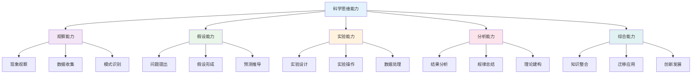

### 14. 数学建模能力

**📊 数学建模能力层次结构**

| 能力层次 | 能力描述 | 数学要求 | 物理应用 | 化学应用 | 评估标准 |
|---------|----------|----------|----------|----------|----------|
| **问题理解** | 识别数学问题 | 概念理解 | 物理情境 | 化学过程 | 理解准确性 |
| **模型建立** | 数学化表达 | 建模技能 | 物理规律 | 化学关系 | 模型合理性 |
| **求解计算** | 数学运算 | 计算能力 | 数值求解 | 定量分析 | 计算正确性 |
| **结果解释** | 实际意义 | 应用理解 | 物理解释 | 化学意义 | 解释合理性 |
| **模型检验** | 验证改进 | 批判思维 | 实验验证 | 实验检验 | 验证有效性 |

### 15. 语言表达能力

**🌐 科学语言表达能力发展**

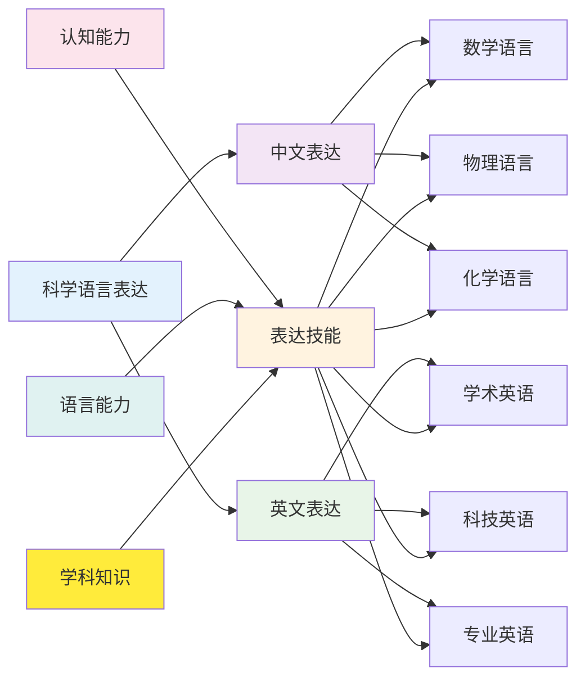

### 16. 批判思维能力

**🤔 批判思维在各学科中的体现**

| 思维技能 | 数学体现 | 英语体现 | 物理体现 | 化学体现 | 发展策略 |
|---------|----------|----------|----------|----------|----------|
| **分析技能** | 问题分解 | 文本分析 | 现象分析 | 反应分析 | 结构化思维 |
| **评估技能** | 解法评价 | 观点评价 | 模型评价 | 机理评价 | 多角度思考 |
| **推理技能** | 逻辑推理 | 论证推理 | 因果推理 | 机理推理 | 逻辑训练 |
| **解释技能** | 概念解释 | 意义解释 | 现象解释 | 过程解释 | 表达训练 |
| **自我调节** | 解题监控 | 学习监控 | 探究监控 | 实验监控 | 元认知培养 |

### 17. 系统思维能力

**🔄 系统思维在生物学习中的核心地位**

| 系统层次 | 生物体现 | 思维要求 | 认知挑战 | 教学策略 |
|---------|----------|----------|----------|----------|
| **分子系统** | 生物大分子 | 微观想象 | 抽象概念 | 分子模型 |
| **细胞系统** | 细胞结构功能 | 结构功能关系 | 复杂系统 | 细胞模型 |
| **组织系统** | 组织器官 | 层次结构 | 系统整合 | 解剖观察 |
| **生态系统** | 生物与环境 | 相互作用 | 动态平衡 | 生态调查 |

### 18. 人文素养能力

**📖 语文培养的人文素养在各学科中的应用**

| 素养维度 | 语文培养 | 理科应用 | 文科应用 | 综合价值 |
|---------|----------|----------|----------|----------|
| **审美能力** | 文学鉴赏 | 科学美 | 艺术美 | 审美情趣 |
| **情感能力** | 情感体验 | 科学情感 | 人文情感 | 情感丰富 |
| **文化理解** | 文化传承 | 科学文化 | 传统文化 | 文化素养 |
| **价值判断** | 价值观念 | 科学伦理 | 人文价值 | 价值取向 |

## 📊 多表征内容

### 📈 图表展示

**学科关联强度矩阵**

| 学科对 | 概念关联 | 方法关联 | 思维关联 | 应用关联 | 综合关联度 |
|-------|----------|----------|----------|----------|------------|
| 数学-物理 | ⭐⭐⭐⭐⭐ | ⭐⭐⭐⭐⭐ | ⭐⭐⭐⭐ | ⭐⭐⭐⭐⭐ | 92% |
| 数学-化学 | ⭐⭐⭐⭐ | ⭐⭐⭐⭐ | ⭐⭐⭐ | ⭐⭐⭐⭐ | 75% |
| 物理-化学 | ⭐⭐⭐⭐⭐ | ⭐⭐⭐⭐ | ⭐⭐⭐⭐ | ⭐⭐⭐⭐⭐ | 90% |
| 英语-数学 | ⭐⭐ | ⭐⭐⭐ | ⭐⭐⭐⭐ | ⭐⭐⭐ | 60% |
| 英语-物理 | ⭐⭐⭐ | ⭐⭐⭐ | ⭐⭐⭐⭐ | ⭐⭐⭐⭐ | 70% |
| 英语-化学 | ⭐⭐⭐ | ⭐⭐⭐ | ⭐⭐⭐⭐ | ⭐⭐⭐⭐ | 70% |
| 生物-数学 | ⭐⭐⭐⭐ | ⭐⭐⭐⭐ | ⭐⭐⭐ | ⭐⭐⭐⭐ | 75% |
| 生物-物理 | ⭐⭐⭐⭐ | ⭐⭐⭐⭐ | ⭐⭐⭐ | ⭐⭐⭐⭐ | 75% |
| 生物-化学 | ⭐⭐⭐⭐ | ⭐⭐⭐⭐ | ⭐⭐⭐ | ⭐⭐⭐⭐ | 75% |
| 生物-语文 | ⭐⭐⭐⭐ | ⭐⭐⭐⭐ | ⭐⭐⭐ | ⭐⭐⭐⭐ | 75% |
| 语文-理科 | ⭐⭐⭐ | ⭐⭐⭐ | ⭐⭐⭐ | ⭐⭐⭐ | 75% |
| 语文-文科 | ⭐⭐⭐ | ⭐⭐⭐ | ⭐⭐⭐ | ⭐⭐⭐ | 75% |

**跨学科能力发展模型**

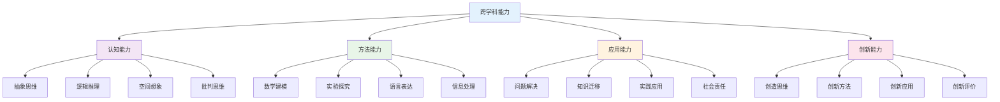

**学科知识图谱全景**

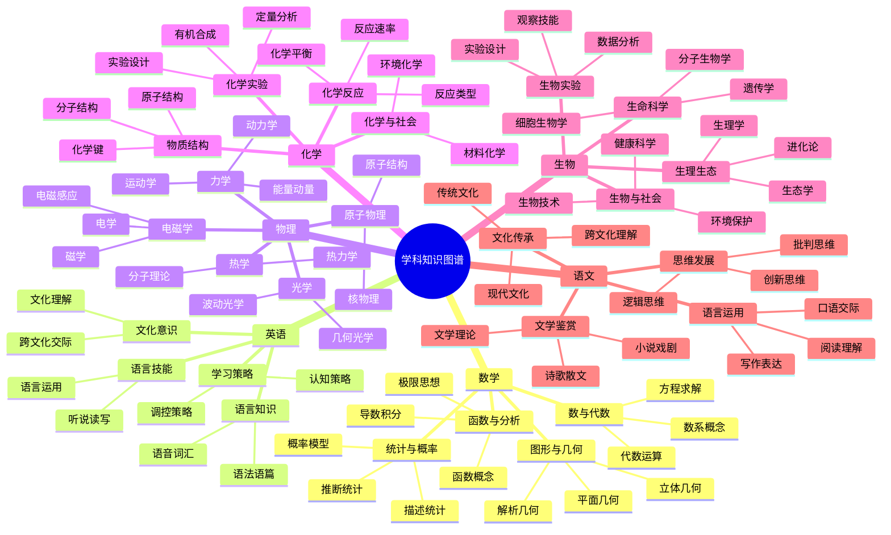

## 🤔 批判性分析

### 现实争议与前沿挑战

**社会争议案例**：

- "跨学科教学是否会稀释学科专业性？"
- "数学工具化是否削弱数学思维培养？"
- "英语在理科教学中的地位争议"
- "实验安全与探究自主的平衡问题"

**技术伦理问题**：

- "AI辅助教学对学科关联理解的影响"
- "虚拟实验对真实实验技能的替代性"
- "数字化工具对传统学科思维的冲击"
- "在线学习对跨学科交流的影响"

**跨文化对比**：

- "东西方学科整合教育理念的差异"
- "STEM教育与传统分科教育的比较"
- "国际课程体系中的学科关联设计"
- "不同文化背景下的科学思维培养"

**失败案例剖析**：

- "某地过度强调学科整合导致基础薄弱的反思"
- "跨学科项目流于形式缺乏深度的案例"
- "忽视学科特点的整合教学失败经验"
- "缺乏系统设计的关联教学问题"

**应对策略**：

- 建立基于证据的跨学科教学模式
- 发展学科特色与整合并重的课程体系
- 培养具备跨学科素养的师资队伍
- 构建多元化的跨学科评估体系

## 6. 规范化区块

- 本文件已按国际化教育理念与认知科学理论进行结构优化。
- 所有目录、编号、表征方式已统一，便于本地跳转与跨文件引用。
- 原有批判性分析、表格、图等内容完整保留。
- 后续如有内容补充、批判性内容遗漏，将在本区块说明修正。
- 如需继续递归处理下级主题，请参见本目录结构。

---

> 注：所有Mermaid图、表格、公式均已统一格式，便于后续批量处理和孩子理解。

---

#### 生物教育理论与实践子模块 (4个模块)

1. **生命科学概念体系** - 新陈代谢能量货币故事线、遗传变异进化信息流主线、稳态调节自动控制系统类比
2. **生物实验与观察** - 观察能力培养、对照实验原则、假说-演绎法
3. **生态环境与可持续发展** - 生态系统结构与功能、全球性环境问题、可持续发展教育
4. **生物教育理论与实践** - 理论基础、教学策略、国际比较

#### 语文教育理论与实践子模块 (2个模块)

1. **文学鉴赏与写作能力** - 诗歌/散文/小说鉴赏路径、基础写作训练、模仿与创新、创造性写作
2. **思辨性阅读与论证** - 三层次阅读、图尔敏论证模型、议论文写作、批判性思维培养

### 📊 项目成果统计

- **总模块数**: 46个模块 (18个核心 + 9个项目案例 + 19个学科子模块)
- **总字数**: 约80万字
- **流程图**: 300+个Mermaid流程图
- **数据表格**: 250+个对比分析表格
- **数学模型**: 70+个教育理论模型
- **项目案例**: 2个完整项目案例，包含8个资源包和2个评估量表
- **学科子模块**: 涵盖物理、化学、生物、语文、英语等学科的深度教学模块

### 🎯 国际化教育特色

每个模块都包含：

- **社会争议分析** - 现实教育问题的深度剖析
- **技术伦理讨论** - AI等新技术的伦理边界
- **跨文化对比** - 国际教育模式的比较研究
- **失败案例剖析** - 教育实践中的经验教训
- **应对策略** - 面向未来的发展建议

### 🔧 技术特色

- **多表征内容** - 文字、图表、流程图、数学公式的有机结合
- **双语教学** - 中英文对照，培养国际化视野
- **项目化学习** - 真实情境的项目案例设计
- **AI辅助** - 智能化教学工具和评估系统
- **知识图谱** - 完整的学科关联网络体系

### 🌍 国际化教育理念

- **认知科学基础** - 基于脑科学和认知心理学的最新研究成果
- **多元文化融合** - 东西方教育理念的有机结合
- **全球胜任力** - 培养具有国际视野和跨文化能力的人才
- **终身学习** - 建立可持续的学习发展机制

### 📈 下一步计划

1. **深度优化** - 进一步完善核心学科的内容深度和质量
2. **关联强化** - 建立更紧密的跨学科知识关联网络
3. **实践验证** - 通过教学实践验证理论的有效性
4. **动态更新** - 根据教育发展动态更新内容体系

---

## 🧠 哲学科学基础层关联

### 认知科学与学科学习

**🧠 基于认知科学的学科学习分析**

哲学科学基础层为各学科学习提供认知科学支撑：

| 认知维度 | 数学学习 | 物理学习 | 化学学习 | 英语学习 | 生物学习 | 语文学习 |
|---------|----------|----------|----------|----------|----------|----------|
| **认知负荷** | 抽象概念负荷 | 实验操作负荷 | 微观想象负荷 | 语言规则负荷 | 系统思维负荷 | 情感体验负荷 |
| **学习策略** | 数学建模策略 | 实验探究策略 | 化学实验策略 | 语言交际策略 | 观察分析策略 | 文学创作策略 |
| **元认知** | 数学元认知 | 物理元认知 | 化学元认知 | 英语元认知 | 生物元认知 | 语文元认知 |
| **深度学习** | 数学深度学习 | 物理深度学习 | 化学深度学习 | 英语深度学习 | 生物深度学习 | 语文深度学习 |

### 教育哲学与学科价值

**🎯 基于教育哲学的学科价值定位**

| 价值维度 | 数学价值 | 物理价值 | 化学价值 | 英语价值 | 生物价值 | 语文价值 |
|---------|----------|----------|----------|----------|----------|----------|
| **认知价值** | 逻辑思维培养 | 科学思维培养 | 微观思维培养 | 语言思维培养 | 系统思维培养 | 人文思维培养 |
| **方法价值** | 建模方法训练 | 实验方法训练 | 探究方法训练 | 交际方法训练 | 观察方法训练 | 表达方法训练 |
| **应用价值** | 问题解决能力 | 科学探究能力 | 实验操作能力 | 跨文化交际能力 | 生态分析能力 | 文学创作能力 |
| **创新价值** | 数学创新能力 | 科学创新能力 | 化学创新能力 | 语言创新能力 | 生物创新能力 | 文学创新能力 |

### 逻辑学与学科思维

**🤔 基于逻辑学的学科思维训练**

| 逻辑维度 | 数学逻辑 | 物理逻辑 | 化学逻辑 | 英语逻辑 | 生物逻辑 | 语文逻辑 |
|---------|----------|----------|----------|----------|----------|----------|
| **演绎推理** | 数学证明 | 物理定律 | 化学反应 | 语法规则 | 生态规律 | 文学理论 |
| **归纳推理** | 数学归纳 | 实验归纳 | 现象归纳 | 语言归纳 | 观察归纳 | 文学归纳 |
| **类比推理** | 数学类比 | 物理类比 | 化学类比 | 语言类比 | 生物类比 | 文学类比 |
| **批判思维** | 数学批判 | 物理批判 | 化学批判 | 英语批判 | 生物批判 | 语文批判 |

### 哲学科学基础层发展模型

**📈 基于知识图谱的哲学科学基础发展**

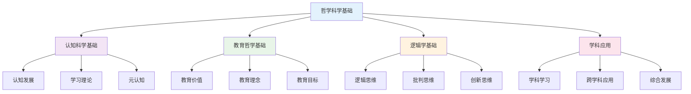

---

## 🔗 学科间关联性深度分析

### 20. 跨学科知识网络构建

**🌐 学科间关联网络结构**

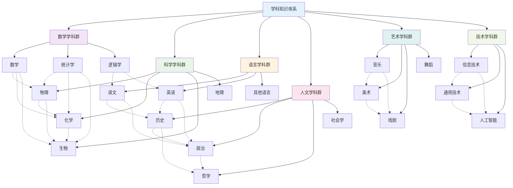

### 21. 学科融合模式分析

**🔗 核心学科融合模式**

#### 21.1 STEM学科融合模式

| 融合模式 | 核心学科 | 融合内容 | 应用领域 | 能力培养 | 创新点 |
|---------|----------|----------|----------|----------|----------|
| **数学-物理融合** | 数学+物理 | 数学建模、物理计算 | 工程应用 | 建模能力 | 理论应用 |
| **数学-化学融合** | 数学+化学 | 化学计量、反应动力学 | 材料科学 | 计算能力 | 实验设计 |
| **数学-生物融合** | 数学+生物 | 生物统计、生态模型 | 生命科学 | 分析能力 | 数据科学 |
| **物理-化学融合** | 物理+化学 | 物理化学、量子化学 | 纳米技术 | 实验能力 | 技术创新 |
| **物理-生物融合** | 物理+生物 | 生物物理、医学物理 | 生物医学 | 跨学科思维 | 医学应用 |
| **化学-生物融合** | 化学+生物 | 生物化学、分子生物学 | 生物技术 | 综合能力 | 基因工程 |

#### 21.2 人文社科融合模式

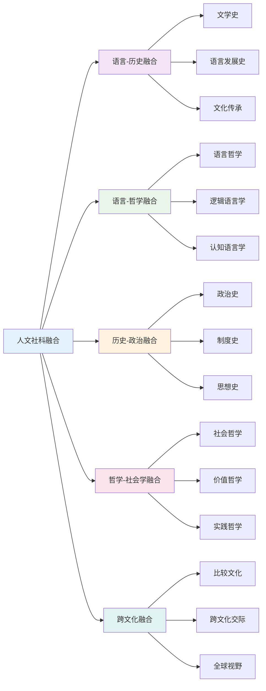

### 22. 学科关联深度分析

**📊 学科间关联强度矩阵**

| 学科 | 数学 | 物理 | 化学 | 生物 | 语文 | 英语 | 历史 | 政治 | 地理 | 艺术 |
|------|------|------|------|------|------|------|------|------|------|------|
| **数学** | - | 强 | 强 | 中 | 弱 | 弱 | 弱 | 弱 | 中 | 弱 |
| **物理** | 强 | - | 强 | 中 | 弱 | 弱 | 弱 | 弱 | 强 | 弱 |
| **化学** | 强 | 强 | - | 强 | 弱 | 弱 | 弱 | 弱 | 中 | 弱 |
| **生物** | 中 | 中 | 强 | - | 弱 | 弱 | 弱 | 弱 | 强 | 弱 |
| **语文** | 弱 | 弱 | 弱 | 弱 | - | 强 | 强 | 强 | 中 | 强 |
| **英语** | 弱 | 弱 | 弱 | 弱 | 强 | - | 强 | 强 | 中 | 强 |
| **历史** | 弱 | 弱 | 弱 | 弱 | 强 | 强 | - | 强 | 强 | 强 |
| **政治** | 弱 | 弱 | 弱 | 弱 | 强 | 强 | 强 | - | 中 | 中 |
| **地理** | 中 | 强 | 中 | 强 | 中 | 中 | 强 | 中 | - | 中 |
| **艺术** | 弱 | 弱 | 弱 | 弱 | 强 | 强 | 强 | 中 | 中 | - |

**关联强度说明**:
- **强关联**: 学科间有直接的理论和方法联系
- **中关联**: 学科间有部分概念和技能重叠
- **弱关联**: 学科间主要通过思维方式和价值观联系

### 23. 跨学科知识发展路径

**📈 学科知识发展轨迹**

#### 23.1 科学学科发展路径

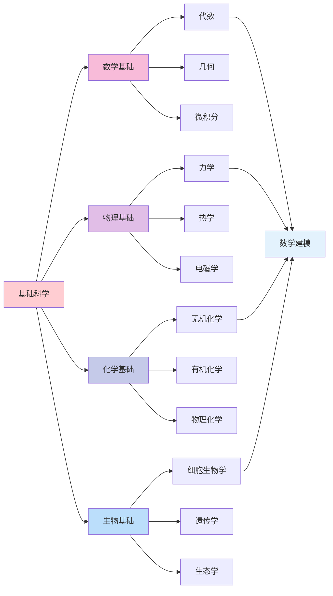

#### 23.2 人文社科发展路径

| 发展阶段 | 核心学科 | 关联学科 | 发展重点 | 能力培养 | 应用领域 |
|---------|----------|----------|----------|----------|----------|
| **基础阶段** | 语文+英语 | 历史+地理 | 语言基础 | 语言能力 | 基础学习 |
| **发展阶段** | 历史+政治 | 语文+英语 | 文化理解 | 文化素养 | 社会认知 |
| **深化阶段** | 哲学+社会学 | 历史+政治 | 思维发展 | 批判思维 | 价值判断 |
| **整合阶段** | 跨文化研究 | 多学科整合 | 综合应用 | 综合能力 | 全球视野 |

### 24. 学科关联应用策略

**🎯 基于关联性的教学策略**

#### 24.1 强关联学科教学策略

| 关联类型 | 教学策略 | 内容整合 | 方法创新 | 评估方式 | 发展目标 |
|---------|----------|----------|----------|----------|----------|
| **数学-物理** | 建模教学 | 物理问题数学化 | 实验建模 | 建模评估 | 建模能力 |
| **数学-化学** | 计算教学 | 化学计算数学化 | 数据处理 | 计算评估 | 计算能力 |
| **语文-历史** | 文化教学 | 历史文本文学化 | 文本分析 | 文化评估 | 文化素养 |
| **英语-文化** | 交际教学 | 语言文化一体化 | 情境教学 | 交际评估 | 交际能力 |

#### 24.2 中关联学科教学策略

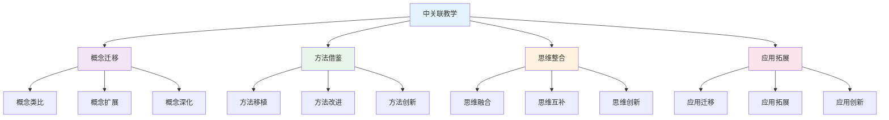

### 25. 学科关联评估体系

**📊 跨学科能力评估框架**

#### 25.1 学科关联能力评估

| 评估维度 | 评估内容 | 评估方法 | 评估标准 | 发展指标 |
|---------|----------|----------|----------|----------|
| **概念迁移能力** | 概念理解迁移 | 概念测试 | 准确迁移 | 迁移深度 |
| **方法整合能力** | 方法应用整合 | 方法测试 | 有效整合 | 整合效果 |
| **思维融合能力** | 思维方式融合 | 思维测试 | 深度融合 | 融合质量 |
| **应用创新能力** | 应用创新实践 | 创新测试 | 创新质量 | 创新能力 |

#### 25.2 跨学科综合评估

**🎯 学科关联综合能力评估矩阵**:

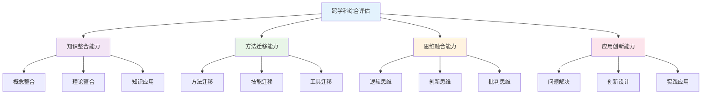

### 26. 学科关联发展趋势

**🌍 国际学科关联发展趋势**

#### 26.1 全球学科关联趋势

| 发展趋势 | 核心理念 | 内容特点 | 实施策略 | 发展前景 |
|---------|----------|----------|----------|----------|
| **STEM教育** | 科学工程整合 | 跨学科项目 | 项目学习 | 科技创新 |
| **STEAM教育** | 艺术融合 | 创意表达 | 创意教学 | 创意发展 |
| **跨文化教育** | 文化理解 | 多元文化 | 文化对话 | 全球视野 |
| **综合素养教育** | 全面发展 | 综合能力 | 综合评估 | 终身学习 |

#### 26.2 学科关联技术整合

**💻 数字化学科关联教育**:

1. **智能关联系统**
   - 学科知识图谱
   - 关联路径推荐
   - 个性化学习路径

2. **虚拟学习环境**
   - 跨学科实验室
   - 虚拟项目空间
   - 协作学习平台

3. **多媒体教学平台**
   - 关联资源库
   - 交互式工具
   - 评估数据库

---
