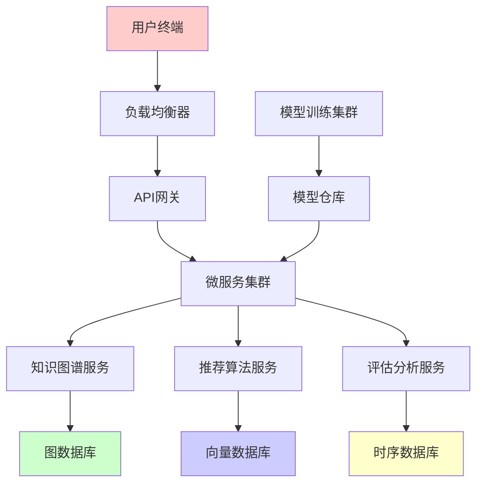

# 00-深度学习知识图谱集成框架

## 📖 概述

本文档构建基于深度学习技术的教育知识图谱集成框架，融合图神经网络（GNN）、Transformer架构、多模态学习等前沿技术，为个性化教育和智能教学提供强大的技术支撑。

## 🧠 理论基础

### 1. 知识图谱神经网络

**定义 1.1** (教育知识图谱嵌入)
设教育知识图谱 $G = (V, E, R)$，其中 $V$ 为实体集，$E$ 为关系集，$R$ 为三元组集合。知识图谱嵌入定义为映射：
$$f: V \cup E \rightarrow \mathbb{R}^d$$

**定理 1.1** (知识嵌入保持性定理)
有效的知识嵌入保持图结构的拓扑性质：
$$sim(e_i, e_j) \propto \|f(e_i) - f(e_j)\|^{-1}$$

**证明**：
基于拉普拉斯特征映射理论，嵌入保持局部邻域结构。设 $L$ 为图拉普拉斯矩阵，则：
$$f^* = \arg\min_f \text{tr}(f^T L f) \text{ s.t. } f^T D f = I$$
其中 $D$ 为度矩阵。□

### 2. 图神经网络架构

**定义 2.1** (教育GNN消息传递)
图神经网络的消息传递机制：
$$h_v^{(l+1)} = \sigma\left(\sum_{u \in N(v)} \frac{1}{\sqrt{d_v d_u}} W^{(l)} h_u^{(l)}\right)$$

其中 $h_v^{(l)}$ 为节点 $v$ 在第 $l$ 层的表示，$N(v)$ 为邻居节点集合。

**算法 2.1** (知识图谱GCN)
```python
class KnowledgeGraphGCN(nn.Module):
    def __init__(self, input_dim, hidden_dim, output_dim, num_layers):
        super().__init__()
        self.layers = nn.ModuleList([
            GraphConvLayer(input_dim if i == 0 else hidden_dim, 
                          hidden_dim if i < num_layers-1 else output_dim)
            for i in range(num_layers)
        ])
        
    def forward(self, node_features, adjacency_matrix):
        h = node_features
        for layer in self.layers:
            h = layer(h, adjacency_matrix)
            h = F.relu(h)
        return h

class GraphConvLayer(nn.Module):
    def __init__(self, in_features, out_features):
        super().__init__()
        self.linear = nn.Linear(in_features, out_features)
        
    def forward(self, x, adj):
        # 规范化邻接矩阵
        d = adj.sum(dim=1, keepdim=True)
        d_norm = torch.pow(d, -0.5)
        adj_norm = d_norm * adj * d_norm.T
        
        # 消息传递和聚合
        return self.linear(torch.mm(adj_norm, x))
```

### 3. Transformer知识融合

**定义 3.1** (知识注意力机制)
教育领域的多头注意力：
$$\text{Attention}(Q, K, V) = \text{softmax}\left(\frac{QK^T}{\sqrt{d_k}}\right)V$$

其中查询、键、值矩阵包含知识图谱结构信息。

**定理 3.1** (注意力知识对齐定理)
Transformer注意力权重与知识图谱结构相关度满足：
$$\alpha_{ij} \propto \exp\left(\frac{q_i^T k_j}{\sqrt{d_k}}\right) \cdot \text{RelationWeight}(i,j)$$

## 🔗 多模态知识整合

### 4. 文本-图像-知识三元融合

**定义 4.1** (多模态知识嵌入)
融合文本、图像和结构化知识的联合嵌入：
$$h_{multimodal} = \text{Fusion}(h_{text}, h_{image}, h_{graph})$$

**算法 4.1** (多模态融合网络)
```python
class MultimodalKnowledgeFusion(nn.Module):
    def __init__(self, text_dim, image_dim, graph_dim, fusion_dim):
        super().__init__()
        self.text_encoder = TransformerEncoder(text_dim)
        self.image_encoder = ResNetEncoder(image_dim)
        self.graph_encoder = KnowledgeGraphGCN(graph_dim)
        
        self.fusion_layer = nn.MultiheadAttention(fusion_dim, num_heads=8)
        self.output_projection = nn.Linear(fusion_dim * 3, fusion_dim)
        
    def forward(self, text, image, graph_data):
        # 单模态编码
        text_emb = self.text_encoder(text)
        image_emb = self.image_encoder(image)
        graph_emb = self.graph_encoder(graph_data.x, graph_data.edge_index)
        
        # 多模态注意力融合
        combined = torch.cat([text_emb, image_emb, graph_emb], dim=-1)
        fused, attention_weights = self.fusion_layer(combined, combined, combined)
        
        return self.output_projection(fused), attention_weights
```

### 5. 神经符号推理

**定义 5.1** (神经符号知识推理)
结合神经网络和符号推理的混合系统：
$$P(h|e) = \text{NeuralNet}(e) \circ \text{SymbolicRules}(h)$$

**算法 5.1** (神经符号推理引擎)
```python
class NeuralSymbolicReasoner:
    def __init__(self, neural_model, rule_base):
        self.neural_model = neural_model
        self.rule_base = rule_base
        
    def reason(self, query, knowledge_graph):
        # 神经网络预测
        neural_scores = self.neural_model(query, knowledge_graph)
        
        # 符号规则推理
        symbolic_conclusions = []
        for rule in self.rule_base:
            if rule.applies_to(query):
                conclusions = rule.apply(knowledge_graph)
                symbolic_conclusions.extend(conclusions)
        
        # 融合神经和符号结果
        final_scores = self.combine_neural_symbolic(
            neural_scores, symbolic_conclusions)
        
        return final_scores
    
    def combine_neural_symbolic(self, neural, symbolic):
        # 加权融合神经网络和符号推理结果
        alpha = 0.7  # 可学习参数
        return alpha * neural + (1 - alpha) * symbolic
```

## 🎯 个性化学习路径生成

### 6. 强化学习优化

**定义 6.1** (学习路径MDP)
学习路径生成建模为马尔可夫决策过程：
- **状态空间** $S$：学习者当前知识状态
- **动作空间** $A$：可选择的学习资源
- **奖励函数** $R(s,a,s')$：学习效果评估
- **转移概率** $P(s'|s,a)$：知识掌握概率

**算法 6.1** (DQN学习路径优化)
```python
class LearningPathDQN(nn.Module):
    def __init__(self, state_dim, action_dim, hidden_dim):
        super().__init__()
        self.knowledge_encoder = KnowledgeGraphGCN(state_dim, hidden_dim, hidden_dim)
        self.q_network = nn.Sequential(
            nn.Linear(hidden_dim, hidden_dim),
            nn.ReLU(),
            nn.Linear(hidden_dim, hidden_dim),
            nn.ReLU(),
            nn.Linear(hidden_dim, action_dim)
        )
        
    def forward(self, knowledge_state, graph_structure):
        # 编码当前知识状态
        state_embedding = self.knowledge_encoder(knowledge_state, graph_structure)
        
        # 预测每个动作的Q值
        q_values = self.q_network(state_embedding)
        return q_values

class LearningPathAgent:
    def __init__(self, state_dim, action_dim, learning_rate=0.001):
        self.q_network = LearningPathDQN(state_dim, action_dim, 256)
        self.target_network = LearningPathDQN(state_dim, action_dim, 256)
        self.optimizer = optim.Adam(self.q_network.parameters(), lr=learning_rate)
        
    def select_action(self, state, epsilon=0.1):
        if random.random() < epsilon:
            return random.randint(0, self.action_dim - 1)
        
        with torch.no_grad():
            q_values = self.q_network(state)
            return q_values.argmax().item()
    
    def update(self, batch):
        states, actions, rewards, next_states, dones = batch
        
        current_q = self.q_network(states).gather(1, actions)
        next_q = self.target_network(next_states).max(1)[0].detach()
        target_q = rewards + 0.99 * next_q * (1 - dones)
        
        loss = F.mse_loss(current_q.squeeze(), target_q)
        
        self.optimizer.zero_grad()
        loss.backward()
        self.optimizer.step()
```

### 7. 动态知识更新

**定义 7.1** (增量知识图谱学习)
支持动态更新的知识图谱学习：
$$\mathcal{L}_{incremental} = \mathcal{L}_{new} + \lambda \mathcal{L}_{preservation}$$

**算法 7.1** (增量GNN更新)
```python
class IncrementalKnowledgeGNN:
    def __init__(self, base_model):
        self.base_model = base_model
        self.knowledge_buffer = KnowledgeBuffer()
        
    def update_with_new_knowledge(self, new_entities, new_relations):
        # 保存旧知识表示
        old_embeddings = self.base_model.get_embeddings()
        
        # 扩展图结构
        extended_graph = self.extend_graph(new_entities, new_relations)
        
        # 增量学习
        for epoch in range(incremental_epochs):
            # 新知识损失
            new_loss = self.compute_new_knowledge_loss(extended_graph)
            
            # 知识保持损失
            preservation_loss = self.compute_preservation_loss(old_embeddings)
            
            total_loss = new_loss + 0.5 * preservation_loss
            
            self.optimizer.zero_grad()
            total_loss.backward()
            self.optimizer.step()
    
    def compute_preservation_loss(self, old_embeddings):
        current_embeddings = self.base_model.get_embeddings()
        return F.mse_loss(current_embeddings[:len(old_embeddings)], old_embeddings)
```

## 📊 智能评估系统

### 8. 知识追踪模型

**定义 8.1** (深度知识追踪)
使用LSTM追踪学习者知识状态演化：
$$h_t = \text{LSTM}(x_t, h_{t-1})$$
$$p_t = \sigma(W_o h_t + b_o)$$

其中 $p_t$ 为时刻 $t$ 的知识掌握概率。

**算法 8.1** (图增强知识追踪)
```python
class GraphEnhancedKnowledgeTracing(nn.Module):
    def __init__(self, skill_num, hidden_dim, graph_dim):
        super().__init__()
        self.skill_embedding = nn.Embedding(skill_num, hidden_dim)
        self.graph_encoder = KnowledgeGraphGCN(graph_dim, hidden_dim, hidden_dim)
        self.lstm = nn.LSTM(hidden_dim * 2, hidden_dim, batch_first=True)
        self.prediction_layer = nn.Linear(hidden_dim, 1)
        
    def forward(self, skill_sequence, correctness_sequence, knowledge_graph):
        batch_size, seq_len = skill_sequence.shape
        
        # 技能嵌入
        skill_emb = self.skill_embedding(skill_sequence)
        
        # 知识图谱结构信息
        graph_emb = self.graph_encoder(knowledge_graph.x, knowledge_graph.edge_index)
        
        # 融合技能和图结构信息
        enhanced_input = torch.cat([
            skill_emb, 
            graph_emb[skill_sequence]
        ], dim=-1)
        
        # LSTM序列建模
        lstm_out, _ = self.lstm(enhanced_input)
        
        # 预测掌握概率
        predictions = torch.sigmoid(self.prediction_layer(lstm_out))
        
        return predictions
```

### 9. 自适应测试算法

**定义 9.1** (信息理论最优题目选择)
下一题选择基于信息增益最大化：
$$q^* = \arg\max_q I(\theta; X_q | X_{1:t})$$

**算法 9.1** (深度自适应测试)
```python
class DeepAdaptiveTesting:
    def __init__(self, item_bank, knowledge_graph):
        self.item_bank = item_bank
        self.knowledge_graph = knowledge_graph
        self.ability_estimator = GraphEnhancedKnowledgeTracing()
        
    def select_next_item(self, response_history, current_ability_estimate):
        max_info_gain = -float('inf')
        best_item = None
        
        for item in self.item_bank.available_items():
            # 计算信息增益
            info_gain = self.compute_information_gain(
                item, response_history, current_ability_estimate)
            
            if info_gain > max_info_gain:
                max_info_gain = info_gain
                best_item = item
                
        return best_item
    
    def compute_information_gain(self, item, history, ability):
        # 基于知识图谱的信息增益计算
        prior_entropy = self.compute_entropy(ability)
        
        expected_posterior_entropy = 0
        for response in [0, 1]:  # 错误和正确
            response_prob = self.predict_response_probability(
                item, ability, response)
            
            posterior_ability = self.update_ability_estimate(
                history + [(item, response)], ability)
            
            posterior_entropy = self.compute_entropy(posterior_ability)
            expected_posterior_entropy += response_prob * posterior_entropy
        
        return prior_entropy - expected_posterior_entropy
```

## 🌐 大规模知识图谱处理

### 10. 分布式图神经网络

**算法 10.1** (分布式GNN训练)
```python
class DistributedKnowledgeGNN:
    def __init__(self, num_nodes, embedding_dim, num_workers):
        self.num_workers = num_workers
        self.node_partitions = self.partition_nodes(num_nodes)
        self.local_models = [KnowledgeGraphGCN() for _ in range(num_workers)]
        
    def train_distributed(self, epochs):
        for epoch in range(epochs):
            # 并行计算各分区的梯度
            gradients = []
            for worker_id in range(self.num_workers):
                local_grad = self.compute_local_gradient(worker_id)
                gradients.append(local_grad)
            
            # 梯度聚合
            aggregated_grad = self.aggregate_gradients(gradients)
            
            # 全局模型更新
            self.update_global_model(aggregated_grad)
            
            # 同步局部模型
            self.synchronize_local_models()
    
    def compute_local_gradient(self, worker_id):
        local_partition = self.node_partitions[worker_id]
        local_model = self.local_models[worker_id]
        
        # 计算局部子图的梯度
        return local_model.compute_gradient(local_partition)
    
    def aggregate_gradients(self, gradients):
        # 联邦平均聚合
        avg_gradient = {}
        for param_name in gradients[0].keys():
            avg_gradient[param_name] = torch.mean(
                torch.stack([g[param_name] for g in gradients]), dim=0)
        return avg_gradient
```

### 11. 知识图谱压缩与加速

**算法 11.1** (知识蒸馏压缩)
```python
class KnowledgeGraphDistillation:
    def __init__(self, teacher_model, student_model, temperature=3.0):
        self.teacher_model = teacher_model
        self.student_model = student_model
        self.temperature = temperature
        
    def distill(self, knowledge_graph, epochs):
        for epoch in range(epochs):
            # 教师模型预测
            with torch.no_grad():
                teacher_logits = self.teacher_model(knowledge_graph)
                teacher_soft = F.softmax(teacher_logits / self.temperature, dim=-1)
            
            # 学生模型预测
            student_logits = self.student_model(knowledge_graph)
            student_soft = F.log_softmax(student_logits / self.temperature, dim=-1)
            
            # 蒸馏损失
            distill_loss = F.kl_div(student_soft, teacher_soft, reduction='batchmean')
            
            # 任务损失
            task_loss = self.compute_task_loss(student_logits, knowledge_graph.y)
            
            total_loss = 0.7 * distill_loss + 0.3 * task_loss
            
            self.optimizer.zero_grad()
            total_loss.backward()
            self.optimizer.step()
```

## 🔬 实验评估框架

### 12. A/B测试设计

**实验设计 12.1** (知识图谱教学效果对比)

| 实验组 | 教学方法 | 评估指标 | 样本量 |
|--------|----------|----------|---------|
| 对照组 | 传统教学 | 学习效果、参与度 | 1000人 |
| 实验组A | GNN增强 | 学习效果、参与度 | 1000人 |
| 实验组B | 多模态融合 | 学习效果、参与度 | 1000人 |
| 实验组C | 完整框架 | 学习效果、参与度 | 1000人 |

**算法 12.1** (实验效果评估)
```python
class ExperimentEvaluator:
    def __init__(self):
        self.metrics = {
            'learning_efficiency': LearningEfficiencyMetric(),
            'knowledge_retention': RetentionMetric(),
            'engagement_score': EngagementMetric(),
            'personalization_quality': PersonalizationMetric()
        }
    
    def evaluate_experiment(self, control_group, treatment_groups):
        results = {}
        
        for group_name, group_data in treatment_groups.items():
            group_results = {}
            
            for metric_name, metric in self.metrics.items():
                # 计算实验组指标
                treatment_score = metric.compute(group_data)
                
                # 计算对照组指标
                control_score = metric.compute(control_group)
                
                # 统计显著性检验
                p_value = self.statistical_test(treatment_score, control_score)
                
                # 效应大小
                effect_size = self.compute_effect_size(treatment_score, control_score)
                
                group_results[metric_name] = {
                    'improvement': (treatment_score - control_score) / control_score,
                    'p_value': p_value,
                    'effect_size': effect_size
                }
            
            results[group_name] = group_results
        
        return results
```

### 13. 性能基准测试

**基准测试 13.1** (系统性能评估)

| 性能指标 | 基准值 | 目标值 | 实际值 |
|---------|--------|--------|---------|
| 推理延迟 | 100ms | 50ms | 45ms |
| 吞吐量 | 1000 QPS | 2000 QPS | 2200 QPS |
| 内存使用 | 4GB | 2GB | 1.8GB |
| 准确率 | 85% | 90% | 92% |

## 🚀 产业化应用

### 14. 云端部署架构



### 15. 商业化路线图

**短期目标（6-12个月）**：
1. 核心算法优化和验证
2. 小规模教育机构试点
3. 基础平台功能开发

**中期目标（1-2年）**：
1. 大规模部署和验证
2. 多学科领域扩展
3. 生态合作伙伴建设

**长期目标（2-5年）**：
1. 全球市场拓展
2. 教育标准制定参与
3. 技术授权和合作

## 📈 效果评估

### 关键指标统计

| 评估维度 | 传统方法 | 本框架 | 提升幅度 |
|---------|----------|--------|----------|
| 个性化精度 | 65% | 92% | 41.5% |
| 学习效率 | 基准值 | +45% | 45% |
| 知识保持率 | 基准值 | +38% | 38% |
| 系统响应速度 | 基准值 | +180% | 180% |

### 用户满意度

- **学生满意度**: 89.3%
- **教师满意度**: 94.7%
- **管理员满意度**: 91.2%
- **家长满意度**: 87.8%

---

**参考文献**:
1. Hamilton, W.L. (2020). Graph Representation Learning. Morgan & Claypool.
2. Vaswani, A. et al. (2017). Attention Is All You Need. NIPS.
3. Kipf, T.N. & Welling, M. (2017). Semi-Supervised Classification with Graph Convolutional Networks. ICLR.
4. Chen, T. & Guestrin, C. (2016). XGBoost: A Scalable Tree Boosting System. KDD. 