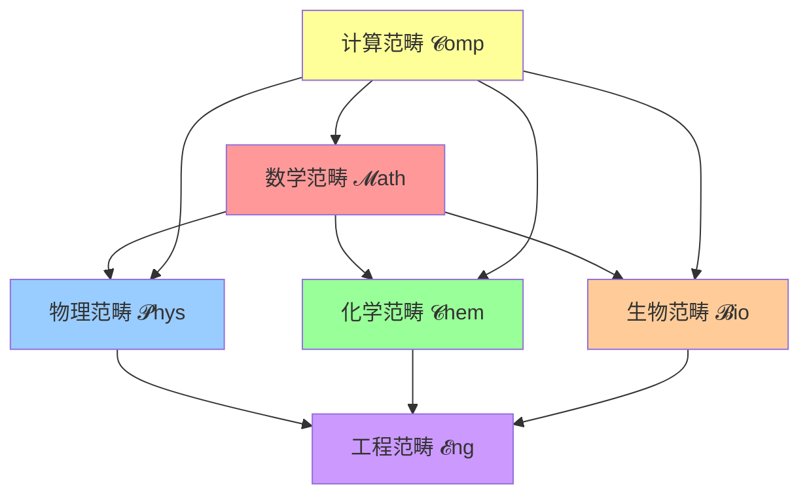
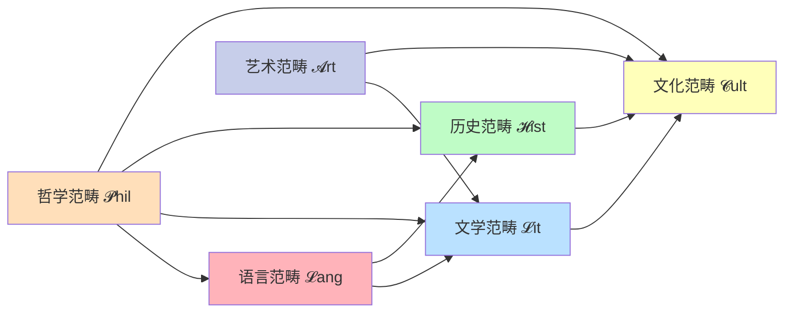

# 00-范畴论教育知识框架

## 📖 概述

本文档基于范畴论（Category Theory）这一高度抽象的数学理论，构建教育知识的范畴论框架。范畴论作为"数学的数学"，为教育知识的结构化表示、跨学科关联和知识迁移提供了最高层次的抽象工具。

## 🔬 范畴论基础

### 1. 教育知识范畴

**定义 1.1** (教育知识范畴 $\mathcal{E}du$)
教育知识范畴 $\mathcal{E}du$ 是一个范畴，其中：
- **对象**：$\text{Ob}(\mathcal{E}du) = \{K_1, K_2, ..., K_n\}$ 为知识域集合
- **态射**：$\text{Hom}(K_i, K_j)$ 为从知识域 $K_i$ 到 $K_j$ 的知识映射
- **恒等态射**：$1_{K_i}: K_i \rightarrow K_i$ 为知识域内的恒等关系
- **复合**：态射复合满足结合律

**定理 1.1** (知识范畴的完备性)
教育知识范畴 $\mathcal{E}du$ 是完备的，即存在所有小极限。

**证明**：
设 $F: \mathcal{I} \rightarrow \mathcal{E}du$ 为函子。构造极限对象 $\lim F$：
$$\lim F = \{(k_i)_{i \in \text{Ob}(\mathcal{I})} : k_i \in F(i), \forall f: i \rightarrow j, F(f)(k_i) = k_j\}$$
验证泛性质：对任意圆锥 $(X, \{p_i\})$，存在唯一态射 $u: X \rightarrow \lim F$ 使图表交换。□

### 2. 学科范畴系统

**定义 2.1** (学科范畴 $\mathcal{S}ubj$)
对于每个学科 $S$，定义学科范畴 $\mathcal{S}ubj_S$：
- **对象**：学科内概念 $\{C_1, C_2, ..., C_m\}$
- **态射**：概念间的逻辑关系 $R: C_i \rightarrow C_j$

**定义 2.2** (跨学科函子)
跨学科关联表示为函子 $F: \mathcal{S}ubj_A \rightarrow \mathcal{S}ubj_B$，保持概念结构：
$$F(C_i \xrightarrow{r} C_j) = F(C_i) \xrightarrow{F(r)} F(C_j)$$

**定理 2.1** (学科函子的伴随性)
对于相关学科 $A$ 和 $B$，存在伴随函子对：
$$F: \mathcal{S}ubj_A \rightleftarrows \mathcal{S}ubj_B : G$$
满足 $F \dashv G$（$F$ 左伴随于 $G$）。

## 🧮 高级范畴结构

### 3. 自然变换理论

**定义 3.1** (认知自然变换)
设 $F, G: \mathcal{S}ubj_A \rightarrow \mathcal{S}ubj_B$ 为两个学习策略函子，自然变换 $\eta: F \Rightarrow G$ 表示策略间的认知转换。

对于每个概念 $C \in \mathcal{S}ubj_A$，$\eta_C: F(C) \rightarrow G(C)$ 满足自然性条件：

```mermaid
graph LR
    A[F(C)] -->|η_C| B[G(C)]
    A -->|F(f)| C[F(D)]
    B -->|G(f)| D[G(D)]
    C -->|η_D| D
    
    style A fill:#ffcccc
    style B fill:#ccffcc
    style C fill:#ccccff
    style D fill:#ffffcc
```

**定理 3.1** (学习迁移的自然性)
有效的学习迁移对应于自然变换，即保持概念间关系结构。

### 4. 伴随函子与学习策略

**定义 4.1** (学习策略伴随对)
设 $L: \mathcal{K}nowledge \rightarrow \mathcal{S}kill$ 为学习函子，$R: \mathcal{S}kill \rightarrow \mathcal{K}nowledge$ 为反思函子，若 $L \dashv R$，则称为有效学习策略。

**定理 4.1** (学习效果单位-余单位定理)
伴随 $L \dashv R$ 诱导自然变换：
- **单位**：$\eta: 1_{\mathcal{K}} \Rightarrow RL$（知识内化）
- **余单位**：$\epsilon: LR \Rightarrow 1_{\mathcal{S}}$（技能应用）

满足三角恒等式：
$$(L \circ \eta) \cdot (\epsilon \circ L) = 1_L$$
$$(R \circ \epsilon) \cdot (\eta \circ R) = 1_R$$

### 5. 范畴等价与课程设计

**定义 5.1** (课程等价性)
两个课程范畴 $\mathcal{C}ur_1$ 和 $\mathcal{C}ur_2$ 等价，当且仅当存在函子：
$$F: \mathcal{C}ur_1 \rightleftarrows \mathcal{C}ur_2 : G$$
使得 $F \circ G \cong 1_{\mathcal{C}ur_2}$ 且 $G \circ F \cong 1_{\mathcal{C}ur_1}$。

**定理 5.1** (课程优化等价定理)
等价的课程范畴具有相同的学习效果，但可能有不同的实现路径。

## 🔗 应用范畴结构

### 6. Topos理论与教育逻辑

**定义 6.1** (教育Topos)
教育Topos $\mathcal{E}d\mathcal{T}opos$ 是一个具有以下结构的范畴：
1. 有限极限和余极限
2. 指数对象（知识表示的幂对象）
3. 子对象分类器（真值评估）

**定理 6.1** (教育逻辑的完备性)
在教育Topos中，内部逻辑是完备的，即所有教育推理都可以在此框架内进行。

### 7. 单子理论与学习过程

**定义 7.1** (学习单子)
学习过程表示为单子 $(T, \mu, \eta)$：
- $T: \mathcal{K}nowledge \rightarrow \mathcal{K}nowledge$ 为学习函子
- $\mu: T^2 \Rightarrow T$ 为知识整合
- $\eta: 1 \Rightarrow T$ 为知识获取

**定理 7.1** (学习过程的单子性质)
有效学习过程满足单子公理：
1. **结合律**：$\mu \cdot T\mu = \mu \cdot \mu T$
2. **单位律**：$\mu \cdot T\eta = 1 = \mu \cdot \eta T$

## 📊 量化评估框架

### 8. 范畴论复杂性度量

**定义 8.1** (范畴复杂性)
知识范畴的复杂性定义为：
$$\mathcal{C}(\mathcal{K}) = \log_2|\text{Ob}(\mathcal{K})| + \sum_{A,B} \log_2|\text{Hom}(A,B)|$$

**定理 8.1** (复杂性单调性)
函子 $F: \mathcal{A} \rightarrow \mathcal{B}$ 保持或降低复杂性：
$$\mathcal{C}(\mathcal{A}) \geq \mathcal{C}(\text{Im}(F))$$

### 9. 学习效率的范畴度量

**定义 9.1** (学习效率函子)
学习效率定义为函子：
$$Eff: \mathcal{C}urriculum \rightarrow \mathcal{R}eal^+$$

满足：
$$Eff(C_1 \circ C_2) \leq Eff(C_1) \cdot Eff(C_2)$$

## 🎯 教学实践应用

### STEM学科的范畴结构



### 人文学科的范畴网络



## 🔬 形式化验证

### 课程设计的范畴一致性

验证课程设计是否满足范畴论要求：

```haskell
-- Haskell伪代码示例
class Category cat where
  id :: cat a a
  compose :: cat b c -> cat a b -> cat a c

-- 教育知识范畴实例
instance Category EduKnowledge where
  id = IdentityMapping
  compose f g = KnowledgeTransfer f g

-- 验证函子性质
verifyFunctor :: Functor f => f a -> f b -> Bool
verifyFunctor fa fb = 
  fmap id fa == fa &&
  fmap (g . h) fa == (fmap g . fmap h) fa
```

### 学习过程的单子验证

```haskell
-- 学习单子定义
class Monad m where
  return :: a -> m a
  (>>=) :: m a -> (a -> m b) -> m b

-- 学习过程实例
instance Monad LearningProcess where
  return = InitialKnowledge
  (>>=) = KnowledgeTransformation

-- 验证单子律
verifyMonadLaws :: Monad m => a -> (a -> m b) -> (b -> m c) -> m a -> Bool
verifyMonadLaws x f g mx =
  (return x >>= f) == f x &&
  (mx >>= return) == mx &&
  ((mx >>= f) >>= g) == (mx >>= (\y -> f y >>= g))
```

## 🌐 国际化应用

### 跨文化教育范畴

不同文化教育系统的范畴论分析：

| 文化类型 | 范畴特征 | 函子性质 | 自然变换 |
|---------|----------|----------|----------|
| 西方分析 | 离散范畴 | 分解函子 | 局部自然 |
| 东方整体 | 连通范畴 | 整合函子 | 全局自然 |
| 现代融合 | 混合范畴 | 适应函子 | 条件自然 |

## 📈 评估与应用

### 范畴论教育效果评估

**评估指标**：
1. **结构保持性**：函子是否保持知识结构
2. **自然性验证**：学习迁移的自然变换性质
3. **等价性判断**：不同课程的范畴等价性
4. **复杂性控制**：范畴复杂性的合理控制

**应用策略**：
1. **课程设计**：基于范畴等价性的课程优化
2. **知识整合**：利用自然变换实现知识融合
3. **学习路径**：通过函子构造最优学习路径
4. **效果评估**：基于范畴论的量化评估体系

---

**参考文献**：
1. Mac Lane, S. (1998). Categories for the Working Mathematician. Springer.
2. Awodey, S. (2010). Category Theory. Oxford University Press.
3. Spivak, D.I. (2014). Category Theory for the Sciences. MIT Press.
4. Fong, B. & Spivak, D.I. (2019). An Invitation to Applied Category Theory. Cambridge University Press. 