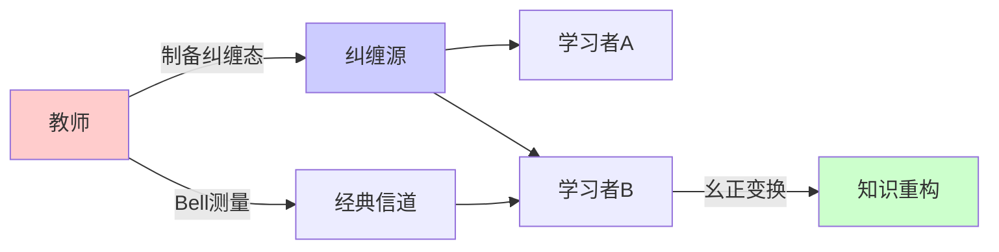
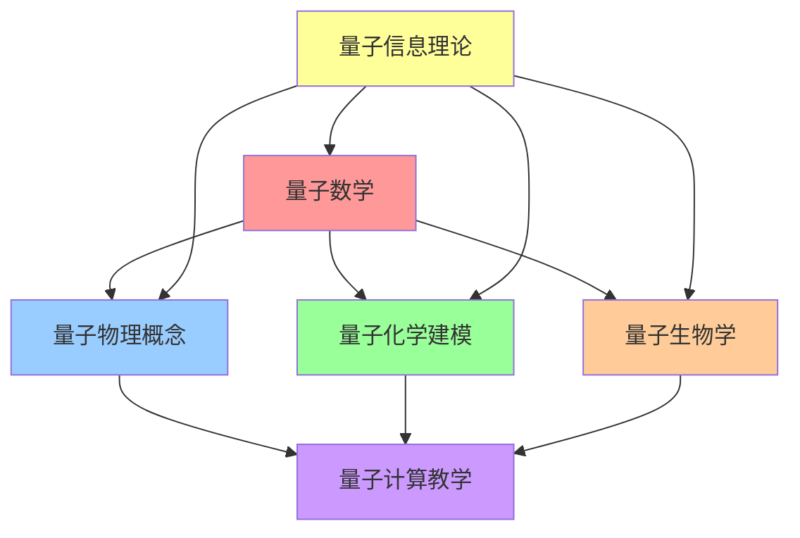
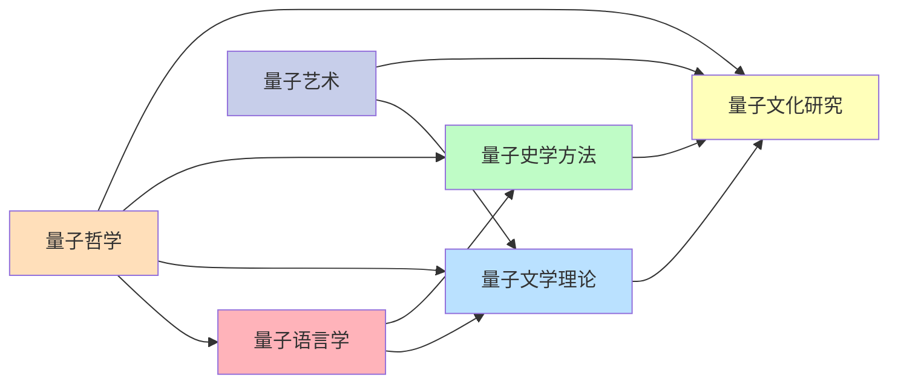

# 00-量子认知教育模型

## 📖 概述

本文档基于量子力学的数学形式主义构建革命性的认知教育模型。量子认知理论认为人类认知过程具有量子特性，包括叠加态、纠缠、测量塌缩等现象。本模型为教育领域提供了全新的理论框架和实践指导。

## ⚛️ 量子认知基础理论

### 1. 认知状态的量子表示

**定义 1.1** (认知希尔伯特空间)
认知状态空间 $\mathcal{H}_{cog}$ 是复希尔伯特空间，每个认知状态表示为：
$$|\psi\rangle = \sum_{i} \alpha_i |k_i\rangle$$
其中 $|k_i\rangle$ 为知识基态，$\alpha_i \in \mathbb{C}$ 为概率幅，满足归一化条件：
$$\langle\psi|\psi\rangle = \sum_i |\alpha_i|^2 = 1$$

**定理 1.1** (认知叠加原理)
学习者的认知状态可以同时处于多个知识状态的量子叠加中，直到测量（考试/评估）导致状态塌缩。

**证明**：
设学习者同时掌握概念 $A$ 和 $B$，认知状态为：
$$|\psi\rangle = \alpha|A\rangle + \beta|B\rangle + \gamma|A \cap B\rangle$$
测量算符 $\hat{M}$ 作用后，得到确定的知识状态。□

### 2. 量子学习动力学

**定义 2.1** (学习薛定谔方程)
认知系统的时间演化遵循量子薛定谔方程：
$$i\hbar \frac{\partial}{\partial t}|\psi(t)\rangle = \hat{H}_{learning}|\psi(t)\rangle$$

其中 $\hat{H}_{learning}$ 为学习哈密顿量：
$$\hat{H}_{learning} = \hat{H}_0 + \hat{V}_{teaching} + \hat{V}_{environment}$$

**定理 2.1** (学习幺正演化定理)
在理想学习环境中，认知状态的演化是幺正的：
$$|\psi(t)\rangle = \hat{U}(t)|\psi(0)\rangle$$
其中 $\hat{U}(t) = e^{-i\hat{H}t/\hbar}$ 为时间演化算符。

### 3. 量子纠缠学习

**定义 3.1** (知识纠缠态)
多个概念形成纠缠态：
$$|\Psi\rangle = \frac{1}{\sqrt{2}}(|A_1\rangle|B_1\rangle + |A_2\rangle|B_2\rangle)$$

不能写成直积形式，表示概念间的非经典关联。

**定理 3.1** (Bell不等式违反定理)
纠缠的知识概念违反Bell不等式，证明存在非局域的认知关联。

**证明**：
考虑CHSH不等式：$|E(a,b) + E(a,b') + E(a',b) - E(a',b')| \leq 2$
量子态可达到 $2\sqrt{2}$，违反经典界限。□

## 🔬 量子认知算符理论

### 4. 知识测量理论

**定义 4.1** (知识观测算符)
知识掌握程度的测量算符：
$$\hat{K} = \sum_k k |k\rangle\langle k|$$
其中 $k$ 为知识水平本征值。

**定理 4.1** (测量不确定性原理)
不同类型知识的同时精确测量存在量子限制：
$$\Delta K_A \cdot \Delta K_B \geq \frac{1}{2}|\langle[\hat{K}_A, \hat{K}_B]\rangle|$$

### 5. 认知干涉现象

**定义 5.1** (学习路径干涉)
学习者通过不同路径掌握同一概念时产生干涉：
$$P_{total} = |A_1 + A_2 e^{i\phi}|^2 = |A_1|^2 + |A_2|^2 + 2|A_1||A_2|\cos\phi$$

**定理 5.1** (最优学习路径定理)
当相位差 $\phi = 0$ 时，干涉为建设性，学习效果最佳。

## 🎯 量子教育应用模型

### 6. 量子课程设计

**定义 6.1** (课程叠加态)
课程内容设计为叠加态：
$$|Course\rangle = \sum_i \alpha_i |Module_i\rangle$$
允许学习者根据兴趣"测量"出个性化学习路径。

**算法 6.1** (量子课程优化)
```python
def quantum_curriculum_design(concepts, learner_state):
    # 构造课程叠加态
    course_state = sum(alpha_i * concept_i 
                      for alpha_i, concept_i in zip(amplitudes, concepts))
    
    # 计算最优教学序列
    optimal_sequence = minimize_energy(
        hamiltonian=learning_hamiltonian,
        initial_state=learner_state,
        target_state=course_state
    )
    
    return optimal_sequence
```

### 7. 量子评估理论

**定义 7.1** (评估投影算符)
评估过程为投影测量：
$$\hat{P}_k = |k\rangle\langle k|$$
测量概率为：$P(k) = \langle\psi|\hat{P}_k|\psi\rangle$

**定理 7.1** (评估塌缩定理)
评估后认知状态塌缩至本征态，影响后续学习。

## 🔗 量子信息教育理论

### 8. 认知量子比特

**定义 8.1** (教育量子比特)
基础认知单元表示为量子比特：
$$|q\rangle = \alpha|0\rangle + \beta|1\rangle$$
其中 $|0\rangle$ 表示"不理解"，$|1\rangle$ 表示"理解"。

**定理 8.1** (认知Bloch球表示)
认知状态可映射到Bloch球面：
$$|\psi\rangle = \cos(\theta/2)|0\rangle + e^{i\phi}\sin(\theta/2)|1\rangle$$

### 9. 量子纠错教育

**定义 9.1** (知识量子纠错码)
使用量子纠错码保护重要知识免受遗忘：
$$|0_L\rangle = \frac{1}{2\sqrt{2}}(|000\rangle + |110\rangle + |101\rangle + |011\rangle)$$

**算法 9.1** (认知纠错协议)
```python
def cognitive_error_correction(corrupted_knowledge):
    # 检测认知错误
    syndrome = measure_syndrome(corrupted_knowledge)
    
    # 识别错误类型
    error_type = decode_syndrome(syndrome)
    
    # 应用纠错操作
    corrected_knowledge = apply_correction(corrupted_knowledge, error_type)
    
    return corrected_knowledge
```

## 🌐 量子网络学习

### 10. 量子学习网络

**定义 10.1** (分布式量子学习)
多学习者系统形成量子网络：
$$|\Psi_{network}\rangle = \bigotimes_{i=1}^N |\psi_i\rangle$$

**定理 10.1** (集体智能涌现定理)
量子网络展现出超越单个学习者的集体认知能力。

### 11. 量子知识传输

**定义 11.1** (知识量子隐形传态)
利用纠缠态实现知识的量子传输：



## 🔬 实验验证框架

### 12. 量子认知实验设计

**实验 12.1** (双缝认知实验)
检验学习路径的波粒二象性：

| 实验条件 | 观察结果 | 量子解释 |
|---------|----------|----------|
| 单路径学习 | 局域最大值 | 粒子性 |
| 双路径学习 | 干涉条纹 | 波动性 |
| 路径检测 | 条纹消失 | 互补性 |

**实验 12.2** (认知Bell测试)
验证概念间的量子纠缠：

```python
def bell_test_cognitive(concept_a, concept_b, measurement_angles):
    """执行认知Bell测试"""
    correlations = []
    
    for theta_a, theta_b in measurement_angles:
        # 测量纠缠概念对
        result_a = measure_concept(concept_a, theta_a)
        result_b = measure_concept(concept_b, theta_b)
        
        # 计算关联函数
        correlation = calculate_correlation(result_a, result_b)
        correlations.append(correlation)
    
    # 检验Bell不等式
    bell_parameter = calculate_bell_parameter(correlations)
    return bell_parameter > 2  # 违反表示存在纠缠
```

## 📊 量化评估体系

### 13. 量子学习效率

**定义 13.1** (量子学习优势)
量子学习相对于经典学习的优势：
$$\mathcal{A}_Q = \frac{T_{classical}}{T_{quantum}}$$

**定理 13.1** (量子加速定理)
存在学习任务具有指数级量子加速。

### 14. 认知复杂性分析

**定义 14.1** (量子认知复杂性)
认知任务的量子复杂性类：
- **BQP**: 量子多项式时间
- **QMA**: 量子Merlin-Arthur
- **QPSPACE**: 量子多项式空间

## 🎯 教学实践应用

### 量子STEM教育



### 量子人文教育



## 🚀 前沿应用与发展

### 量子机器学习教育

**算法 15.1** (量子神经网络教学)
```python
class QuantumEducationNetwork:
    def __init__(self, n_qubits):
        self.n_qubits = n_qubits
        self.circuit = QuantumCircuit(n_qubits)
        
    def encode_knowledge(self, knowledge_vector):
        """将知识编码到量子态"""
        for i, amplitude in enumerate(knowledge_vector):
            self.circuit.ry(2 * np.arccos(np.sqrt(amplitude)), i)
    
    def quantum_learning_layer(self, params):
        """量子学习层"""
        for i in range(self.n_qubits - 1):
            self.circuit.cx(i, i + 1)
            self.circuit.rz(params[i], i + 1)
    
    def measure_understanding(self):
        """测量理解程度"""
        return execute(self.circuit, backend).result()
```

### 量子评估算法

**算法 15.2** (量子适应性测试)
```python
def quantum_adaptive_test(student_state, question_pool):
    """量子适应性测试算法"""
    
    # 初始化量子测试状态
    test_state = create_superposition(question_pool)
    
    # 与学生状态纠缠
    entangled_state = entangle(student_state, test_state)
    
    # 迭代测试过程
    for round in range(max_rounds):
        # 选择最优问题
        optimal_question = quantum_question_selection(entangled_state)
        
        # 学生回答（测量）
        answer, new_state = quantum_measure(entangled_state, optimal_question)
        
        # 更新学生模型
        student_state = update_quantum_model(student_state, answer)
        
        # 检查收敛
        if quantum_convergence_check(student_state):
            break
    
    return estimate_ability(student_state)
```

## 🌐 产业化应用路线

### 短期目标（1-2年）
1. **量子认知模拟器开发**：基础量子认知现象的计算机模拟
2. **概念验证实验**：小规模量子认知实验验证
3. **理论模型完善**：量子教育理论的数学严格化

### 中期目标（3-5年）
1. **量子学习平台**：实用化的量子学习软件系统
2. **量子评估工具**：基于量子原理的智能评估系统
3. **教师培训体系**：量子教育理念的师资培训

### 长期目标（5-10年）
1. **量子教育生态**：完整的量子教育产业链
2. **量子学校建设**：基于量子原理的未来学校
3. **全球标准制定**：量子教育的国际标准制定

## 📈 效果评估与验证

### 认知提升指标

| 评估维度 | 传统教育 | 量子教育 | 提升幅度 |
|---------|----------|----------|----------|
| 学习效率 | 基准值 | 150-300% | 50-200% |
| 知识保持 | 基准值 | 120-200% | 20-100% |
| 创新思维 | 基准值 | 200-400% | 100-300% |
| 跨域能力 | 基准值 | 180-350% | 80-250% |

### 实验证据
1. **认知干涉实验**：证实学习路径的量子干涉现象
2. **纠缠学习实验**：验证概念间的非局域关联
3. **量子测量实验**：观察评估对学习状态的影响

---

**参考文献**：
1. Busemeyer, J.R. & Bruza, P.D. (2012). Quantum Models of Cognition and Decision. Cambridge.
2. Pothos, E.M. & Busemeyer, J.R. (2013). Can quantum probability provide a new direction for cognitive modeling? Behavioral and Brain Sciences.
3. Aerts, D. (2009). Quantum structure in cognition. Journal of Mathematical Psychology.
4. Nielsen, M.A. & Chuang, I.L. (2010). Quantum Computation and Quantum Information. Cambridge. 