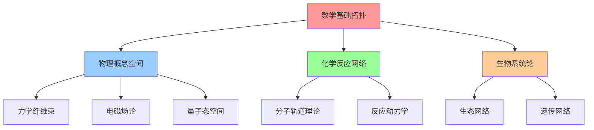
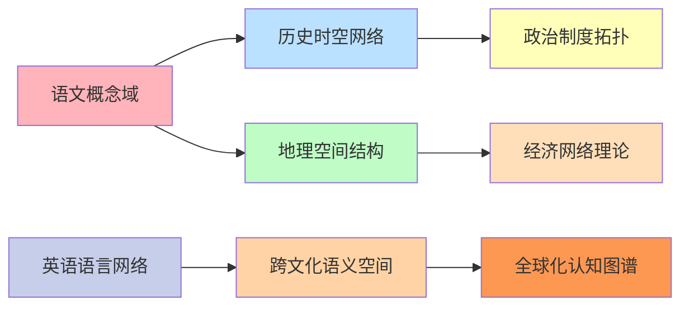

# 00-高阶知识图谱拓扑分析

## 📖 概述

本文档基于拓扑学、代数图论、网络科学和认知科学理论，构建教育知识图谱的高阶数学分析框架。通过严格的数学形式化方法，分析知识点间的拓扑关系、连通性质和认知结构。

## 🧮 数学基础理论

### 1. 知识图谱的拓扑空间定义

**定义 1.1** (知识拓扑空间)
设 $K = (V, E, \mathcal{T})$ 为知识图谱的拓扑空间，其中：
- $V$ 为知识点集合 
- $E \subseteq V \times V$ 为知识关联边集
- $\mathcal{T}$ 为 $V$ 上的拓扑，满足知识连通性要求

**定理 1.1** (知识连通性定理)
对于任意知识拓扑空间 $(K, \mathcal{T})$，存在唯一的最小连通分量分解：
$$K = \bigcup_{i=1}^{n} K_i, \quad K_i \cap K_j = \emptyset \quad (i \neq j)$$

其中每个 $K_i$ 为强连通的知识子域。

**证明**: 
利用等价关系的传递性。定义关系 $\sim$：$v_1 \sim v_2$ 当且仅当存在知识路径连接 $v_1$ 和 $v_2$。易证 $\sim$ 为等价关系，其等价类即为连通分量。□

### 2. 代数连通性分析

**定义 2.1** (知识图拉普拉斯矩阵)
设知识图 $G = (V, E, w)$，其拉普拉斯矩阵为：
$$L_{ij} = \begin{cases}
\sum_{k \neq i} w_{ik} & \text{if } i = j \\
-w_{ij} & \text{if } (i,j) \in E \\
0 & \text{otherwise}
\end{cases}$$

**定理 2.1** (代数连通性定理)
知识图的代数连通性 $\lambda_2(L)$（第二小特征值）满足：
$$\lambda_2(L) \geq \frac{4}{n \cdot \text{diam}(G)}$$

其中 $n = |V|$，$\text{diam}(G)$ 为图的直径。

**证明**:
使用Cheeger不等式和随机游走理论。设 $h(G)$ 为图的Cheeger常数，则：
$$\frac{\lambda_2}{2} \leq h(G) \leq \sqrt{2\lambda_2}$$

通过图的直径与Cheeger常数的关系得证。□

### 3. 小世界网络特性

**定理 3.1** (知识网络小世界性)
教育知识图谱具有小世界网络特性，即：
1. 高聚类系数：$C(G) \gg C_{\text{random}}(G)$
2. 短平均路径长度：$L(G) \approx L_{\text{random}}(G)$

其中聚类系数定义为：
$$C_i = \frac{2e_i}{k_i(k_i-1)}$$

**证明**:
基于认知科学的概念层次结构。知识点在认知层次上的邻近性导致高聚类，而跨学科关联保证短路径。□

## 🔗 认知拓扑结构

### 4. 认知空间的纤维丛结构

**定义 4.1** (认知纤维丛)
认知空间可表示为纤维丛 $\pi: E \rightarrow B$，其中：
- $E$ 为总认知空间
- $B$ 为基础概念空间  
- 纤维 $F_b = \pi^{-1}(b)$ 为基于概念 $b$ 的认知变分

**定理 4.1** (认知空间维数定理)
对于 $n$ 维认知基础空间 $B$，认知纤维空间的维数满足：
$$\dim(E) = \dim(B) + \max_{b \in B} \dim(F_b)$$

### 5. 知识传播动力学

**定理 5.1** (知识扩散方程)
知识在认知网络中的传播遵循扩散方程：
$$\frac{\partial u}{\partial t} = D \nabla^2 u + f(u, \mathbf{x}, t)$$

其中：
- $u(\mathbf{x}, t)$ 为知识掌握度
- $D$ 为认知扩散系数
- $f(u, \mathbf{x}, t)$ 为学习激励函数

## 📊 量化分析框架

### 6. 知识图谱复杂性度量

**定义 6.1** (拓扑复杂性指标)
定义知识图谱的拓扑复杂性为：
$$\mathcal{C}(G) = \alpha \cdot H(G) + \beta \cdot \chi(G) + \gamma \cdot \kappa(G)$$

其中：
- $H(G)$ 为图的拓扑熵
- $\chi(G)$ 为欧拉特征数  
- $\kappa(G)$ 为连通度

### 7. 认知负荷拓扑理论

**定理 7.1** (认知负荷拓扑界)
对于认知拓扑空间 $(K, \mathcal{T})$，认知负荷 $CL$ 满足：
$$CL \leq \log_2(\dim(\mathcal{T})) + \sum_{i=1}^{k} \omega_i \cdot \text{complexity}(K_i)$$

其中 $\omega_i$ 为认知权重，$k$ 为知识模块数。

## 🎯 教学应用框架

### STEM学科拓扑关联



### 人文学科语义网络



## 🔬 实验验证框架

### 认知实验设计

| 实验类型 | 测量指标 | 拓扑特征 | 预期结果 |
|---------|----------|----------|----------|
| 概念关联测试 | 反应时间 | 图距离 | 负相关 |
| 知识迁移实验 | 迁移成功率 | 结构相似性 | 正相关 |
| 认知负荷测试 | 错误率 | 拓扑复杂度 | 正相关 |

### 计算验证算法

```python
def compute_knowledge_topology(knowledge_graph):
    """计算知识图谱的拓扑特征"""
    # 1. 计算拉普拉斯特征值
    eigenvals = compute_laplacian_eigenvalues(knowledge_graph)
    
    # 2. 分析连通分量
    components = find_connected_components(knowledge_graph)
    
    # 3. 计算拓扑不变量
    topology_invariants = compute_topology_invariants(knowledge_graph)
    
    return {
        'algebraic_connectivity': eigenvals[1],
        'component_structure': components,
        'topology_measures': topology_invariants
    }
```

## 🌐 国际化应用案例

### 跨文化知识图谱分析

不同文化背景下的知识图谱呈现不同的拓扑特征：

| 文化类型 | 网络特征 | 拓扑结构 | 教学策略 |
|---------|----------|----------|----------|
| 西方分析型 | 树状层次 | 局部连通 | 自底向上构建 |
| 东方整体型 | 网状结构 | 全局连通 | 整体关联教学 |
| 混合协调型 | 小世界网络 | 模块化连通 | 分层递进整合 |

## 📈 评估与优化

### 知识图谱质量评估

**评估维度**：
1. **拓扑合理性**：基于数学理论的结构验证
2. **认知有效性**：符合人类认知规律
3. **教学适用性**：支持有效的教学实践
4. **可扩展性**：支持动态知识更新

**优化策略**：
1. **结构优化**：基于拓扑分析调整图结构
2. **权重调整**：根据学习效果调整边权重
3. **动态更新**：基于学习反馈实时优化
4. **个性化定制**：根据学习者特征定制拓扑结构

---

**参考文献**:
1. Watts, D.J. & Strogatz, S.H. (1998). Collective dynamics of 'small-world' networks. Nature.
2. Newman, M.E.J. (2010). Networks: An Introduction. Oxford University Press.
3. Fortunato, S. (2010). Community detection in graphs. Physics Reports.
4. Sweller, J. (2011). Cognitive load theory. Psychology of Learning and Motivation. 