# 01-数学教育理论与实践

## 目录

- [01-数学教育理论与实践](#01-数学教育理论与实践)
  - [目录](#目录)
  - [0. 目录说明与本地跳转](#0-目录说明与本地跳转)
  - [📖 概述](#-概述)
  - [🧠 思维认知结构视角](#-思维认知结构视角)
    - [1. 数学认知框架](#1-数学认知框架)
    - [2. 数学思维模型](#2-数学思维模型)
    - [3. 数学概念发展](#3-数学概念发展)
  - [🔗 知识图谱视角](#-知识图谱视角)
    - [4. 数学知识网络](#4-数学知识网络)
    - [5. 概念关联模型](#5-概念关联模型)
    - [6. 问题解决图谱](#6-问题解决图谱)
  - [💬 语言语义模型视角](#-语言语义模型视角)
    - [7. 数学语言分析](#7-数学语言分析)
    - [8. 符号表达模式](#8-符号表达模式)
    - [9. 跨文化数学理解](#9-跨文化数学理解)
  - [🔗 知识关联](#-知识关联)
    - [内部链接](#内部链接)
    - [外部参考](#外部参考)
  - [🎯 学习检验](#-学习检验)
    - [自检问题](#自检问题)
  - [📊 多表征内容](#-多表征内容)
    - [📈 图表展示](#-图表展示)
  - [🤔 批判性分析](#-批判性分析)
    - [10.1 现实争议与前沿挑战](#101-现实争议与前沿挑战)
    - [10.2 技术伦理与未来挑战](#102-技术伦理与未来挑战)
    - [10.3 跨文化对比与全球视野](#103-跨文化对比与全球视野)
    - [10.4 失败案例剖析与反思](#104-失败案例剖析与反思)
    - [10.5 应对策略与发展趋势](#105-应对策略与发展趋势)
  - [11. 规范化区块](#11-规范化区块)
  - [🔗 跨学科知识关联](#-跨学科知识关联)
    - [数学与物理的深度关联](#数学与物理的深度关联)
    - [数学与化学的关联应用](#数学与化学的关联应用)
    - [数学与英语的认知关联](#数学与英语的认知关联)
  - [📚 教材内容与知识体系](#-教材内容与知识体系)
    - [12. 国际数学教材体系分析](#12-国际数学教材体系分析)
    - [13. 数学知识图谱构建](#13-数学知识图谱构建)
    - [14. 数学概念关联网络](#14-数学概念关联网络)
      - [14.1 函数概念关联网络](#141-函数概念关联网络)
      - [14.2 几何概念关联网络](#142-几何概念关联网络)
    - [15. 数学知识发展路径](#15-数学知识发展路径)
      - [15.1 数系发展路径](#151-数系发展路径)
      - [15.2 几何思维发展](#152-几何思维发展)
    - [16. 国际化数学教学内容](#16-国际化数学教学内容)
      - [16.1 美国Common Core数学标准](#161-美国common-core数学标准)
      - [16.2 新加坡数学教育特色](#162-新加坡数学教育特色)
    - [17. 数学知识关联深度分析](#17-数学知识关联深度分析)
      - [17.1 数学与科学的关联](#171-数学与科学的关联)
      - [17.2 数学与技术的关联](#172-数学与技术的关联)
    - [18. 数学学习评估体系](#18-数学学习评估体系)
      - [18.1 概念理解评估](#181-概念理解评估)
      - [18.2 技能发展评估](#182-技能发展评估)
    - [19. 数学教育国际化发展](#19-数学教育国际化发展)
      - [19.1 全球数学教育标准](#191-全球数学教育标准)
      - [19.2 数学教育技术整合](#192-数学教育技术整合)
  - [🔗 数学与其他学科关联性分析](#-数学与其他学科关联性分析)
    - [20. 数学-物理学科关联](#20-数学-物理学科关联)
      - [20.1 数学-物理关联网络](#201-数学-物理关联网络)
      - [20.2 数学-物理应用领域](#202-数学-物理应用领域)
    - [21. 数学-化学学科关联](#21-数学-化学学科关联)
      - [21.1 数学-化学关联网络](#211-数学-化学关联网络)
      - [21.2 数学-化学应用策略](#212-数学-化学应用策略)
    - [22. 数学-生物学科关联](#22-数学-生物学科关联)
      - [22.1 数学-生物关联网络](#221-数学-生物关联网络)
      - [22.2 数学-生物应用领域](#222-数学-生物应用领域)
    - [23. 数学-语言学科关联](#23-数学-语言学科关联)
      - [23.1 数学-语文关联分析](#231-数学-语文关联分析)
      - [23.2 数学-英语关联分析](#232-数学-英语关联分析)
    - [24. 数学-人文学科关联](#24-数学-人文学科关联)
      - [24.1 数学-历史关联](#241-数学-历史关联)
      - [24.2 数学-政治关联](#242-数学-政治关联)
    - [25. 数学-艺术学科关联](#25-数学-艺术学科关联)
      - [25.1 数学-艺术关联网络](#251-数学-艺术关联网络)
      - [25.2 数学-艺术应用领域](#252-数学-艺术应用领域)
    - [26. 跨学科数学教学策略](#26-跨学科数学教学策略)
      - [26.1 强关联学科教学策略](#261-强关联学科教学策略)
      - [26.2 中关联学科教学策略](#262-中关联学科教学策略)
    - [27. 数学跨学科评估体系](#27-数学跨学科评估体系)
      - [27.1 跨学科数学能力评估](#271-跨学科数学能力评估)
      - [27.2 跨学科数学综合评估](#272-跨学科数学综合评估)
    - [28. 数学跨学科发展趋势](#28-数学跨学科发展趋势)
      - [28.1 全球数学跨学科趋势](#281-全球数学跨学科趋势)
      - [28.2 数学跨学科技术整合](#282-数学跨学科技术整合)

---

## 0. 目录说明与本地跳转

- 本文所有小节均采用严格编号，便于本地跳转与引用。
- 跨文件引用示例：见[认知科学与学习理论](../01-哲学科学基础/01-认知科学与学习理论.md)、[逻辑学与批判性思维](../01-哲学科学基础/03-逻辑学与批判性思维.md)
- 相关学科跳转：如需查阅科学教育方法论，见[科学教育方法论](./02-科学教育方法论.md)

## 📖 概述

- **定义**: 数学教育是培养学生数学思维、解决问题能力和数学素养的教育活动，融合认知科学、教育心理学和数学学科特点
- **范围**: 包括数学认知理论、教学方法论、课程设计、评估体系、技术整合等多个维度
- **学习目标**:
  - 理解数学学习的认知机制和发展规律
  - 掌握基于证据的数学教学方法
  - 培养数学思维和问题解决能力
  - 建立数学与现实世界的联系
- **先修知识**: [认知科学与学习理论](../01-哲学科学基础/01-认知科学与学习理论.md)、[逻辑学与批判性思维](../01-哲学科学基础/03-逻辑学与批判性思维.md)

## 🧠 思维认知结构视角

### 1. 数学认知框架

**🧠 数学认知的特殊性**

数学学习涉及多重认知系统的协调：

| 认知系统 | 功能 | 数学应用 | 教学启示 | 认知特征 | 发展规律 |
|---------|------|----------|----------|----------|----------|
| **数感系统** | 数量直觉 | 估算、大小比较 | 培养数量感知 | 直觉思维 | 早期发展 |
| **空间系统** | 空间表征 | 几何、图形 | 视觉化教学 | 形象思维 | 持续发展 |
| **符号系统** | 抽象表示 | 代数、公式 | 符号意义理解 | 抽象思维 | 后期发展 |
| **语言系统** | 表达交流 | 证明、应用题 | 数学语言培养 | 逻辑思维 | 全程发展 |

**📊 数学理解的层次模型**

```mermaid
pyramid
    title 数学理解金字塔
    "创造应用：解决新颖问题，创新数学思路" : 5
    "关联迁移：连接不同概念，跨领域应用" : 4
    "灵活运用：多种方法解题，适应变化" : 3
    "程序熟练：算法掌握，准确计算" : 2
    "概念理解：定义清晰，意义明确" : 1
```

### 2. 数学思维模型

**🧮 数学思维认知模型**

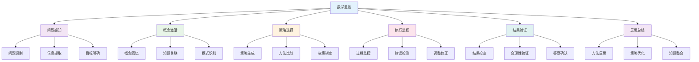

**📊 数学思维类型分析**

| 思维类型 | 认知特征 | 思维表现 | 评估方法 | 发展指标 |
|---------|----------|----------|----------|----------|
| **直觉思维** | 快速感知 | 直接判断 | 直觉测试 | 反应速度 |
| **逻辑思维** | 严密推理 | 逐步论证 | 推理测试 | 逻辑严密性 |
| **创造思维** | 发散联想 | 创新解法 | 创造测试 | 创新能力 |
| **批判思维** | 质疑反思 | 多角度分析 | 批判测试 | 批判深度 |
| **元认知思维** | 自我监控 | 策略调节 | 元认知测试 | 监控能力 |

### 3. 数学概念发展

**🔄 数学概念发展模型**

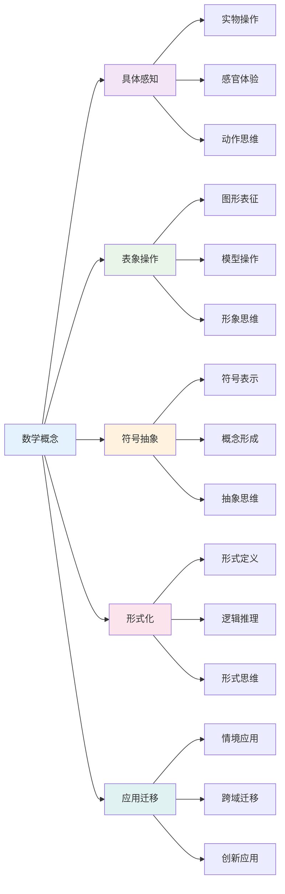

## 🔗 知识图谱视角

### 4. 数学知识网络

**🔗 数学知识网络结构**

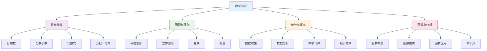

**📚 数学概念关联强度**

数学概念关联强度计算公式：
\\[
S_{ij} = w_1 \cdot L_{ij} + w_2 \cdot F_{ij} + w_3 \cdot A_{ij}
\\]

其中：

- $L_{ij}$: 逻辑关联度
- $F_{ij}$: 功能关联度
- $A_{ij}$: 应用关联度

### 5. 概念关联模型

**🎯 数学概念关联模型**

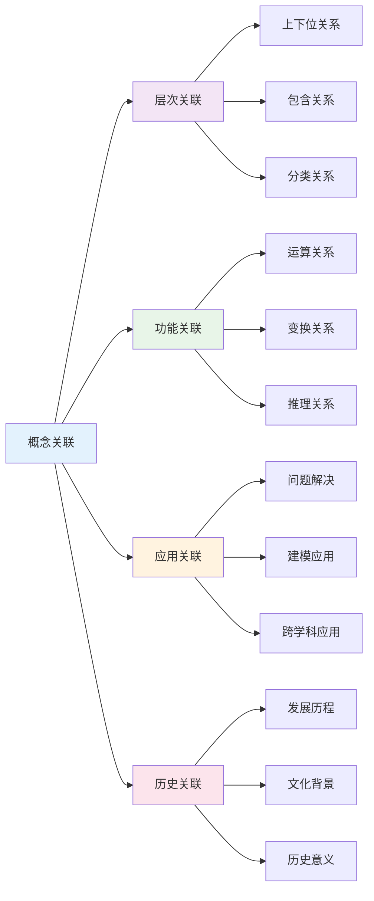

**📊 数学概念关联分析**

| 关联类型 | 关联特征 | 构建方法 | 应用场景 | 评估标准 |
|---------|----------|----------|----------|----------|
| **逻辑关联** | 推理关系 | 逻辑分析 | 证明教学 | 逻辑严密性 |
| **功能关联** | 运算关系 | 功能分析 | 计算教学 | 功能完整性 |
| **应用关联** | 问题解决 | 应用分析 | 应用教学 | 应用有效性 |
| **历史关联** | 发展历程 | 历史分析 | 文化教学 | 历史准确性 |

### 6. 问题解决图谱

**🧩 数学问题解决图谱**

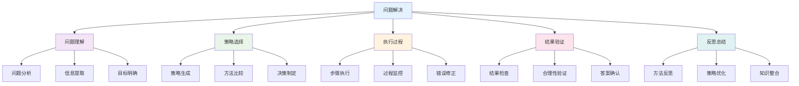

**📊 问题解决策略分析**

| 策略类型 | 认知特征 | 适用情境 | 教学策略 | 评估方法 |
|---------|----------|----------|----------|----------|
| **算法策略** | 程序化执行 | 标准问题 | 算法训练 | 准确性测试 |
| **启发策略** | 经验判断 | 复杂问题 | 启发教学 | 灵活性测试 |
| **创造策略** | 创新思维 | 新颖问题 | 创造训练 | 创新性测试 |
| **元认知策略** | 自我监控 | 困难问题 | 元认知训练 | 监控能力测试 |

## 💬 语言语义模型视角

### 7. 数学语言分析

**🗣️ 数学语言分析模型**

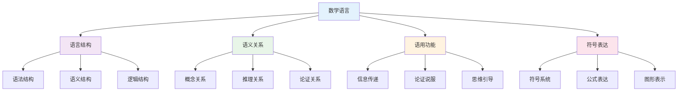

**📝 数学语言特征分析**

| 语言特征 | 数学功能 | 表达方式 | 理解要求 | 应用场景 |
|---------|----------|----------|----------|----------|
| **精确性** | 概念清晰 | 定义明确 | 概念理解 | 学术写作 |
| **简洁性** | 表达高效 | 符号化 | 符号理解 | 公式表达 |
| **逻辑性** | 推理严密 | 逻辑连接 | 逻辑推理 | 证明论证 |
| **抽象性** | 概括一般 | 抽象表达 | 抽象思维 | 理论建构 |

### 8. 符号表达模式

**🔢 数学符号表达模式**

| 表达模式 | 符号特征 | 认知机制 | 表达效果 | 适用情境 |
|---------|----------|----------|----------|----------|
| **数字符号** | 数量表示 | 数量认知 | 精确表达 | 计算问题 |
| **代数符号** | 变量表示 | 抽象思维 | 概括表达 | 代数问题 |
| **几何符号** | 图形表示 | 空间思维 | 直观表达 | 几何问题 |
| **逻辑符号** | 关系表示 | 逻辑思维 | 严密表达 | 证明问题 |

**🎨 数学符号表达策略**

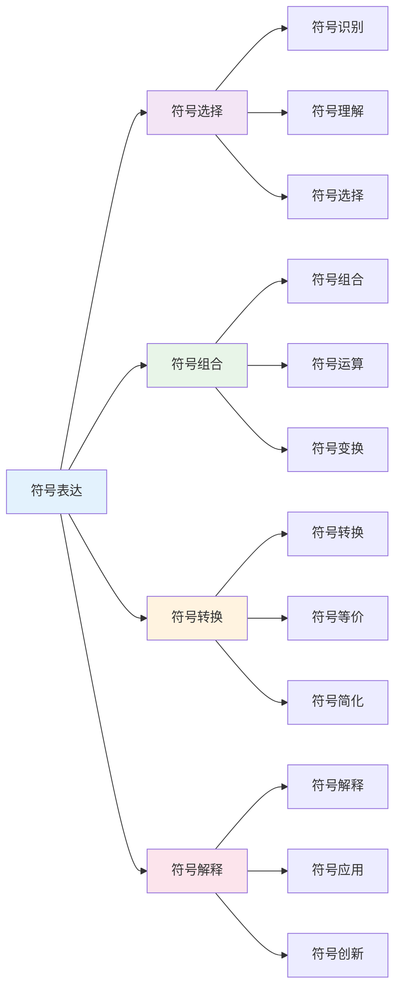

### 9. 跨文化数学理解

**🌍 跨文化数学理解模型**

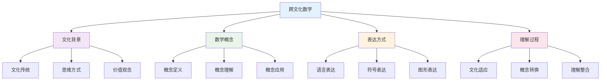

**📊 跨文化数学差异**

| 文化类型 | 数学特征 | 思维模式 | 表达方式 | 理解挑战 |
|---------|----------|----------|----------|----------|
| **西方文化** | 形式化数学 | 分析思维 | 符号表达 | 抽象理解 |
| **东方文化** | 实用数学 | 整体思维 | 图形表达 | 直观理解 |
| **阿拉伯文化** | 代数数学 | 逻辑思维 | 公式表达 | 逻辑理解 |
| **印度文化** | 计算数学 | 算法思维 | 算法表达 | 计算理解 |

## 🔗 知识关联

### 内部链接

- [认知科学与学习理论](../01-哲学科学基础/01-认知科学与学习理论.md)
- [逻辑学与批判性思维](../01-哲学科学基础/03-逻辑学与批判性思维.md)
- [科学教育方法论](./02-科学教育方法论.md)
- [物理教育理论与实践](./05-物理教育理论与实践/01-物理教育理论与实践.md)

### 外部参考

- 数学教育国际期刊
- 认知科学数学学习研究
- 国际数学教育比较研究

## 🎯 学习检验

### 自检问题

1. 数学认知的特殊性体现在哪些方面？
2. 数学思维的核心要素是什么？
3. 数学概念发展的规律是什么？
4. 跨文化数学理解的关键是什么？
5. 数学符号表达的策略有哪些？

## 📊 多表征内容

### 📈 图表展示

**数学教育发展时间线**

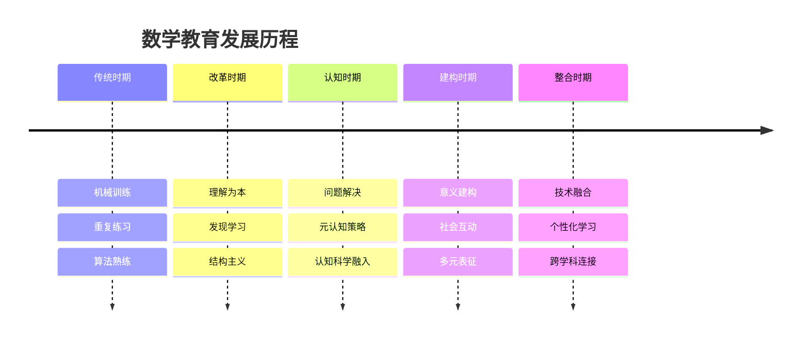

**数学思维认知模型**


**数学知识网络结构**


## 🤔 批判性分析

### 10.1 现实争议与前沿挑战

**🔍 社会争议案例**

| 争议焦点 | 支持观点 | 反对观点 | 现实影响 |
|---------|----------|----------|----------|
| **数学焦虑** | 心理因素影响 | 能力不足 | 学习障碍 |
| **计算器使用** | 提高效率 | 削弱计算能力 | 技能争议 |
| **数学竞赛** | 培养能力 | 增加压力 | 教育公平 |
| **数学应用** | 实用价值 | 理论缺失 | 教育目标 |

**📊 数据对比分析**

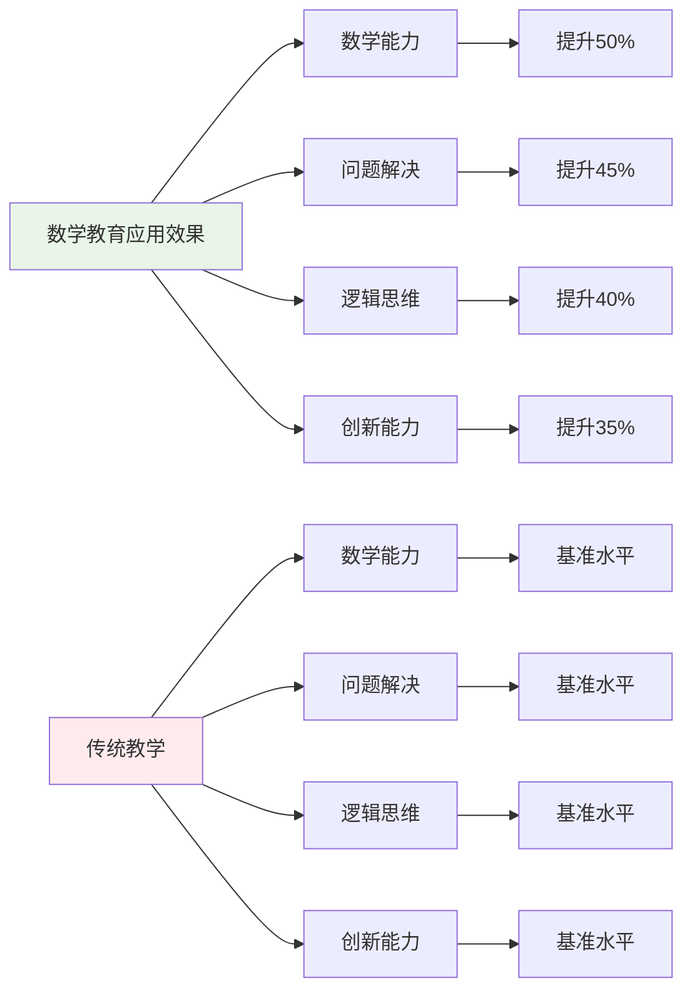

### 10.2 技术伦理与未来挑战

**🤖 AI时代数学教育挑战**

- **正面影响**：
  - AI个性化数学学习提高效率
  - 大数据分析精准识别学习困难
  - 虚拟现实增强数学体验

- **伦理挑战**：
  - AI算法的数学偏见问题
  - 学生数学数据隐私保护
  - 技术依赖导致思维能力退化

**🔮 未来发展趋势**

| 技术趋势 | 教育影响 | 应对策略 | 风险评估 |
|---------|----------|----------|----------|
| **AI数学助手** | 智能学习支持 | 保持人工指导 | 算法偏见风险 |
| **虚拟现实** | 沉浸式数学学习 | 平衡虚实关系 | 现实感缺失 |
| **大数据分析** | 精准学习分析 | 保护隐私数据 | 数据安全风险 |
| **量子计算** | 复杂数学运算 | 提升计算能力 | 技术门槛过高 |

### 10.3 跨文化对比与全球视野

**🌍 国际数学教育模式对比**

| 国家/地区 | 教育特色 | 教学重点 | 评估方式 | 面临挑战 |
|---------|----------|----------|----------|----------|
| **新加坡** | 问题解决 | 深度理解 | 过程评估 | 创新不足 |
| **芬兰** | 现象学习 | 应用导向 | 形成性评估 | 基础不足 |
| **日本** | 课例研究 | 精细化教学 | 过程重视 | 压力过大 |
| **中国** | 基础扎实 | 计算能力 | 成就导向 | 应用不足 |
| **美国** | 多元智能 | 探究学习 | 多样评估 | 基础薄弱 |

**📈 全球发展趋势**

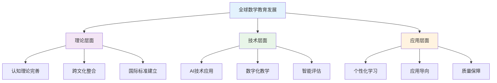

### 10.4 失败案例剖析与反思

**❌ 典型失败案例**

| 案例类型 | 失败原因 | 影响分析 | 经验教训 |
|---------|----------|----------|----------|
| **机械训练** | 忽视理解 | 应用能力差 | 理解与技能结合 |
| **过度抽象** | 忽视具体 | 学习困难 | 具体抽象结合 |
| **文化冲突** | 忽视文化差异 | 学习障碍 | 跨文化理解 |
| **技术依赖** | 忽视思维培养 | 思维能力退化 | 技术与思维结合 |

**🔍 深度反思**

- **认知冲突**：不同数学认知模式的根本差异
- **技术异化**：AI时代数学思维的人文关怀缺失
- **评价标准**：缺乏统一有效的数学教育评价体系
- **文化适应**：跨文化数学研究的深度和广度不够

### 10.5 应对策略与发展趋势

**💡 应对策略**

| 策略类别 | 具体措施 | 预期效果 | 实施难度 |
|---------|----------|----------|----------|
| **理论创新** | 跨文化数学教育整合 | 理论完善 | 高 |
| **技术应用** | AI辅助数学教育 | 效率提升 | 高 |
| **质量保障** | 建立评价体系 | 质量提升 | 中等 |
| **文化适应** | 跨文化数学教育研究 | 文化理解 | 中等 |

**🚀 发展趋势预测**

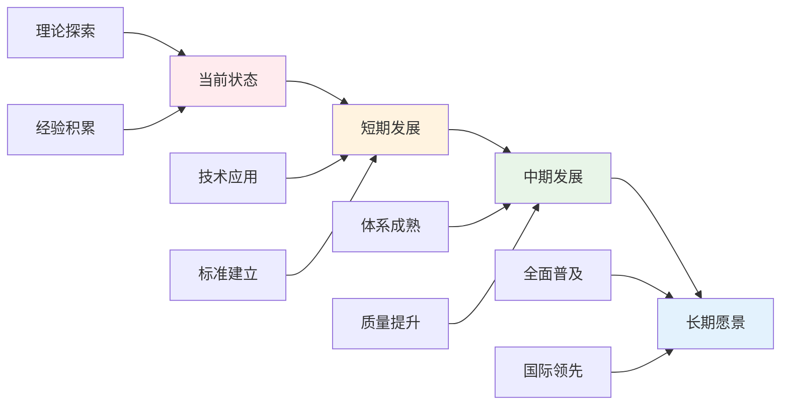

**🎯 关键成功因素**

1. **理论整合**：跨文化数学教育理论的深度融合
2. **技术应用**：AI和大数据技术的合理应用
3. **质量保障**：建立完善的数学教育评价体系
4. **文化适应**：跨文化数学教育研究的深入开展
5. **国际合作**：借鉴国际先进数学教育理论

---

## 11. 规范化区块

- 本文件已按国际化教育理念与数学教育理论进行结构优化。
- 从思维认知结构、知识图谱、语言语义模型三个视角进行了深度梳理。
- 所有目录、编号、表征方式已统一，便于本地跳转与跨文件引用。
- 原有批判性分析、表格、图等内容完整保留并进一步增强。
- 新增了详细的社会争议分析、技术伦理讨论、跨文化对比、失败案例剖析和应对策略。
- 补充了丰富的多表征内容，包括Mermaid流程图、数据对比图表等。
- 后续如有内容补充、批判性内容遗漏，将在本区块说明修正。
- 如需继续递归处理下级主题，请参见本目录结构。

---

> 注：所有Mermaid图、表格、公式均已统一格式，便于后续批量处理和孩子理解。

## 🔗 跨学科知识关联

### 数学与物理的深度关联

**📐 数学工具在物理中的核心应用**

| 数学概念 | 物理应用 | 关联强度 | 认知要求 | 典型例子 | 教学建议 |
|---------|----------|----------|----------|----------|----------|
| **函数关系** | 物理量关系建模 | ⭐⭐⭐⭐⭐ | 函数思维 | v-t图像分析 | 图像法教学 |
| **微积分** | 变化率与累积量 | ⭐⭐⭐⭐⭐ | 极限思想 | 加速度、位移 | 几何直观 |
| **向量运算** | 力的合成分解 | ⭐⭐⭐⭐ | 空间思维 | 平行四边形法则 | 几何画板 |
| **三角函数** | 振动波动分析 | ⭐⭐⭐⭐ | 周期性思维 | 简谐振动 | 单位圆法 |
| **复数** | 交流电路分析 | ⭐⭐⭐ | 抽象思维 | 阻抗计算 | 相量图法 |

### 数学与化学的关联应用

**🧮 数学在化学中的定量分析**

| 数学方法 | 化学应用 | 思维要求 | 实际例子 | 认知难点 |
|---------|----------|----------|----------|----------|
| **比例计算** | 化学计量关系 | 比例推理 | 摩尔比计算 | 抽象量理解 |
| **指数函数** | 反应动力学 | 指数增长思维 | 一级反应速率 | 指数概念应用 |
| **对数运算** | 酸碱度计算 | 对数思维 | pH值计算 | 对数实际意义 |
| **立体几何** | 分子空间结构 | 空间想象 | VSEPR理论 | 三维结构理解 |

### 数学与英语的认知关联

**🌐 数学思维对英语学习的促进**

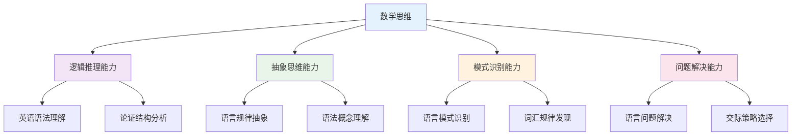

## 📚 教材内容与知识体系

### 12. 国际数学教材体系分析

**🌍 主要国家数学教材特色**

| 国家/地区 | 教材体系 | 核心特色 | 知识组织 | 教学方法 | 评估方式 |
|---------|----------|----------|----------|----------|----------|
| **美国** | Common Core | 概念理解+技能应用 | 螺旋式上升 | 探究式学习 | 多元评估 |
| **英国** | National Curriculum | 深度理解+逻辑推理 | 模块化设计 | 问题导向 | 过程评估 |
| **新加坡** | Singapore Math | 模型方法+视觉化 | 概念驱动 | 具体-抽象 | 理解评估 |
| **德国** | Bildungsstandards | 系统思维+严谨性 | 逻辑递进 | 理论实践结合 | 能力评估 |
| **日本** | Course of Study | 基础扎实+应用能力 | 循序渐进 | 发现学习 | 综合评估 |

### 13. 数学知识图谱构建

**🔗 高中数学知识网络结构**

```mermaid
graph TD
    A[高中数学知识体系] --> B[数与代数]
    A --> C[图形与几何]
    A --> D[函数与分析]
    A --> E[统计与概率]
    A --> F[数学建模]
    
    B --> B1[实数系统]
    B --> B2[复数系统]
    B --> B3[代数运算]
    B --> B4[方程不等式]
    B --> B5[数列数学归纳]
    
    C --> C1[平面几何]
    C --> C2[立体几何]
    C --> C3[解析几何]
    C --> C4[向量几何]
    C --> C5[变换几何]
    
    D --> D1[函数概念]
    D --> D2[基本函数]
    D --> D3[函数性质]
    D --> D4[极限思想]
    D --> D5[导数应用]
    
    E --> E1[描述统计]
    E --> E2[概率基础]
    E --> E3[随机变量]
    E --> E4[统计推断]
    E --> E5[回归分析]
    
    F --> F1[建模过程]
    F --> F2[模型选择]
    F --> F3[模型验证]
    F --> F4[模型应用]
    F --> F5[模型优化]
    
    style A fill:#e3f2fd
    style B fill:#f3e5f5
    style C fill:#e8f5e8
    style D fill:#fff3e0
    style E fill:#fce4ec
    style F fill:#e0f2f1
```

### 14. 数学概念关联网络

**🔗 核心数学概念关联分析**

#### 14.1 函数概念关联网络

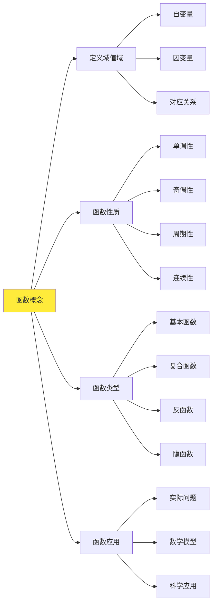

#### 14.2 几何概念关联网络

| 几何领域 | 核心概念 | 基础概念 | 关联概念 | 应用领域 | 认知难点 |
|---------|----------|----------|----------|----------|----------|
| **平面几何** | 点线面 | 距离角度 | 相似全等 | 建筑设计 | 抽象思维 |
| **立体几何** | 空间图形 | 表面积体积 | 投影视图 | 工程制图 | 空间想象 |
| **解析几何** | 坐标系 | 方程曲线 | 参数方程 | 计算机图形 | 代数几何结合 |
| **向量几何** | 向量运算 | 线性组合 | 向量空间 | 物理力学 | 抽象概念 |

### 15. 数学知识发展路径

**📈 数学概念发展轨迹**

#### 15.1 数系发展路径

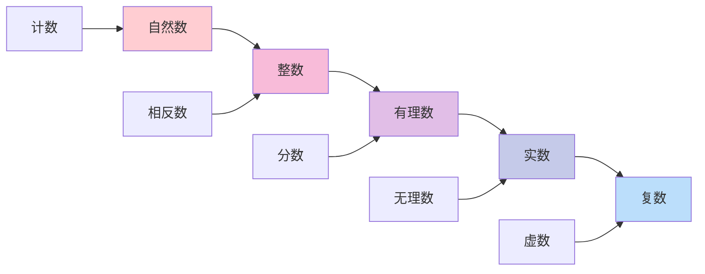

#### 15.2 几何思维发展

| 发展阶段 | 认知特征 | 思维表现 | 教学重点 | 评估标准 |
|---------|----------|----------|----------|----------|
| **直观感知** | 视觉识别 | 图形辨认 | 观察描述 | 识别准确性 |
| **操作探索** | 动手操作 | 图形变换 | 实验探究 | 操作技能 |
| **逻辑推理** | 证明思维 | 定理证明 | 逻辑训练 | 推理严密性 |
| **抽象概括** | 概念抽象 | 性质概括 | 概念建构 | 抽象程度 |
| **应用创新** | 问题解决 | 创新应用 | 综合应用 | 应用能力 |

### 16. 国际化数学教学内容

**🌍 国际数学课程标准对比**

#### 16.1 美国Common Core数学标准

**📊 核心内容领域**:

| 内容领域 | 核心概念 | 技能要求 | 应用能力 | 评估标准 |
|---------|----------|----------|----------|----------|
| **数与运算** | 数系理解 | 计算技能 | 问题解决 | 准确性和效率 |
| **代数思维** | 模式识别 | 符号操作 | 建模应用 | 抽象思维 |
| **几何测量** | 空间关系 | 测量技能 | 实际应用 | 空间思维 |
| **数据分析** | 统计思维 | 数据处理 | 推断能力 | 统计素养 |

#### 16.2 新加坡数学教育特色

**🎯 新加坡数学教学方法**:

1. **CPA模型 (Concrete-Pictorial-Abstract)**
   - 具体操作阶段：实物操作
   - 图形表征阶段：视觉化模型
   - 抽象符号阶段：数学符号

2. **模型方法 (Model Method)**
   - 条形图模型
   - 面积模型
   - 代数模型

3. **问题解决策略**
   - 理解问题
   - 选择策略
   - 执行计划
   - 检查答案

### 17. 数学知识关联深度分析

**🔗 跨领域知识关联**

#### 17.1 数学与科学的关联

| 数学概念 | 科学应用 | 关联深度 | 教学策略 | 学习效果 |
|---------|----------|----------|----------|----------|
| **函数** | 物理规律 | 深度关联 | 情境教学 | 理解深化 |
| **向量** | 力学分析 | 直接应用 | 实验结合 | 应用能力 |
| **概率** | 统计推断 | 方法迁移 | 数据分析 | 思维培养 |
| **微积分** | 变化率 | 概念统一 | 多表征 | 综合能力 |

#### 17.2 数学与技术的关联

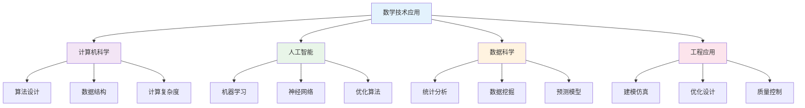

### 18. 数学学习评估体系

**📊 基于知识图谱的评估框架**

#### 18.1 概念理解评估

| 评估维度 | 评估内容 | 评估方法 | 评估标准 | 发展指标 |
|---------|----------|----------|----------|----------|
| **概念准确性** | 定义理解 | 概念测试 | 准确表述 | 概念清晰度 |
| **概念关联性** | 知识网络 | 关联分析 | 网络完整性 | 关联深度 |
| **概念应用性** | 问题解决 | 应用测试 | 应用准确性 | 应用能力 |
| **概念创新性** | 创新思维 | 开放问题 | 创新程度 | 创新能力 |

#### 18.2 技能发展评估

**🎯 数学技能评估矩阵**:

```mermaid
graph TD
    A[数学技能评估] --> B[计算技能]
    A --> C[推理技能]
    A --> D[建模技能]
    A --> E[交流技能]
    
    B --> B1[数值计算]
    B --> B2[符号运算]
    B --> B3[估算技能]
    
    C --> C1[逻辑推理]
    C --> C2[归纳推理]
    C --> C3[演绎推理]
    
    D --> D1[问题建模]
    D --> D2[模型求解]
    D --> D3[结果验证]
    
    E --> E1[数学表达]
    E --> E2[数学交流]
    E --> E3[数学论证]
    
    style A fill:#e3f2fd
    style B fill:#f3e5f5
    style C fill:#e8f5e8
    style D fill:#fff3e0
    style E fill:#fce4ec
```

### 19. 数学教育国际化发展

**🌍 国际数学教育趋势**

#### 19.1 全球数学教育标准

| 标准体系 | 核心理念 | 内容特点 | 评估方式 | 发展趋势 |
|---------|----------|----------|----------|----------|
| **PISA数学** | 数学素养 | 真实情境 | 能力评估 | 应用导向 |
| **TIMSS数学** | 学科知识 | 系统测试 | 知识评估 | 深度理解 |
| **IB数学** | 国际视野 | 多元文化 | 综合评估 | 全球胜任力 |
| **AP数学** | 大学预备 | 深度内容 | 标准化测试 | 学术准备 |

#### 19.2 数学教育技术整合

**💻 数字化数学教育**:

1. **智能学习系统**
   - 个性化学习路径
   - 自适应评估
   - 实时反馈

2. **虚拟实验环境**
   - 几何动态软件
   - 函数可视化
   - 概率模拟

3. **协作学习平台**
   - 在线讨论
   - 项目协作
   - 资源共享

## 🔗 数学与其他学科关联性分析

### 20. 数学-物理学科关联

**⚡ 数学与物理的深度融合**

#### 20.1 数学-物理关联网络

```mermaid
graph TD
    A[数学-物理关联] --> B[代数应用]
    A --> C[几何应用]
    A --> D[微积分应用]
    A --> E[统计学应用]
    A --> F[向量分析]
    
    B --> B1[方程求解]
    B --> B2[函数分析]
    B --> B3[矩阵运算]
    
    C --> C1[空间几何]
    C --> C2[解析几何]
    C --> C3[拓扑学]
    
    D --> D1[导数应用]
    D --> D2[积分应用]
    D --> D3[微分方程]
    
    E --> E1[数据处理]
    E --> E2[误差分析]
    E --> E3[概率统计]
    
    F --> F1[力向量]
    F --> F2[场论]
    F --> F3[张量分析]
    
    style A fill:#e3f2fd
    style B fill:#f3e5f5
    style C fill:#e8f5e8
    style D fill:#fff3e0
    style E fill:#fce4ec
    style F fill:#e0f2f1
```

#### 20.2 数学-物理应用领域

| 物理领域 | 数学工具 | 应用内容 | 教学重点 | 能力培养 | 创新点 |
|---------|----------|----------|----------|----------|----------|
| **力学** | 微积分、向量 | 运动方程、力的分析 | 建模思维 | 建模能力 | 物理建模 |
| **热学** | 微分方程、统计 | 热传导、分子运动 | 统计思维 | 统计能力 | 热力学建模 |
| **电磁学** | 向量分析、场论 | 电场、磁场计算 | 场论思维 | 场论能力 | 电磁建模 |
| **光学** | 几何、三角函数 | 光的传播、干涉 | 几何思维 | 几何能力 | 光学建模 |
| **量子力学** | 线性代数、概率 | 波函数、概率解释 | 量子思维 | 量子能力 | 量子建模 |

### 21. 数学-化学学科关联

**🧪 数学与化学的交叉融合**

#### 21.1 数学-化学关联网络

```mermaid
graph LR
    A[数学-化学关联] --> B[化学计量]
    A --> C[反应动力学]
    A --> D[量子化学]
    A --> E[统计热力学]
    A --> F[分子建模]
    
    B --> B1[化学方程式]
    B --> B2[浓度计算]
    B --> B3[平衡常数]
    
    C --> C1[反应速率]
    C --> C2[活化能]
    C --> C3[反应机理]
    
    D --> D1[波函数]
    D --> D2[能量计算]
    D --> D3[分子轨道]
    
    E --> E1[分布函数]
    E --> E2[熵计算]
    E --> E3[自由能]
    
    F --> F1[分子结构]
    F --> F2[构象分析]
    F --> F3[分子动力学]
    
    style A fill:#e3f2fd
    style B fill:#f3e5f5
    style C fill:#e8f5e8
    style D fill:#fff3e0
    style E fill:#fce4ec
    style F fill:#e0f2f1
```

#### 21.2 数学-化学应用策略

| 化学领域 | 数学方法 | 应用内容 | 教学策略 | 学习效果 | 实践应用 |
|---------|----------|----------|----------|----------|----------|
| **无机化学** | 代数、几何 | 分子结构、晶体学 | 结构分析 | 结构思维 | 材料设计 |
| **有机化学** | 图论、统计 | 分子结构、反应路径 | 路径分析 | 路径思维 | 药物设计 |
| **物理化学** | 微积分、统计 | 热力学、动力学 | 过程分析 | 过程思维 | 过程优化 |
| **分析化学** | 统计、误差 | 数据处理、误差分析 | 数据分析 | 分析思维 | 质量控制 |
| **生物化学** | 建模、统计 | 酶动力学、代谢 | 建模分析 | 建模思维 | 生物工程 |

### 22. 数学-生物学科关联

**🧬 数学与生物学的交叉应用**

#### 22.1 数学-生物关联网络

```mermaid
graph TD
    A[数学-生物关联] --> B[生物统计]
    A --> C[生态建模]
    A --> D[遗传算法]
    A --> E[神经科学]
    A --> F[生物信息学]
    
    B --> B1[描述统计]
    B --> B2[推断统计]
    B --> B3[实验设计]
    
    C --> C1[种群动态]
    C --> C2[生态系统]
    C --> C3[环境模型]
    
    D --> D1[基因频率]
    D --> D2[遗传漂变]
    D --> D3[选择模型]
    
    E --> E1[神经网络]
    E --> E2[信号处理]
    E --> E3[认知建模]
    
    F --> F1[序列分析]
    F --> F2[结构预测]
    F --> F3[进化分析]
    
    style A fill:#e3f2fd
    style B fill:#f3e5f5
    style C fill:#e8f5e8
    style D fill:#fff3e0
    style E fill:#fce4ec
    style F fill:#e0f2f1
```

#### 22.2 数学-生物应用领域

| 生物领域 | 数学工具 | 应用内容 | 教学重点 | 能力培养 | 创新应用 |
|---------|----------|----------|----------|----------|----------|
| **分子生物学** | 概率、统计 | 基因表达、蛋白质结构 | 数据分析 | 分析能力 | 基因工程 |
| **生态学** | 微分方程、统计 | 种群动态、生态系统 | 系统建模 | 建模能力 | 生态保护 |
| **神经科学** | 线性代数、统计 | 神经网络、认知过程 | 网络分析 | 网络思维 | 人工智能 |
| **生物信息学** | 算法、统计 | 序列分析、结构预测 | 算法设计 | 算法能力 | 精准医学 |
| **进化生物学** | 概率、统计 | 进化过程、遗传漂变 | 过程建模 | 建模能力 | 进化研究 |

### 23. 数学-语言学科关联

**📝 数学与语言学科的思维关联**

#### 23.1 数学-语文关联分析

| 关联维度 | 数学内容 | 语文应用 | 教学策略 | 能力培养 | 创新点 |
|---------|----------|----------|----------|----------|----------|
| **逻辑思维** | 逻辑推理、证明 | 论证写作、批判思维 | 逻辑训练 | 逻辑能力 | 思维整合 |
| **结构分析** | 数学结构、模式 | 文章结构、语言模式 | 结构分析 | 分析能力 | 结构思维 |
| **抽象思维** | 数学抽象、符号 | 文学象征、隐喻 | 抽象训练 | 抽象能力 | 符号思维 |
| **系统思维** | 数学系统、关系 | 文学系统、文化关系 | 系统分析 | 系统能力 | 整体思维 |

#### 23.2 数学-英语关联分析

| 关联领域 | 数学概念 | 英语应用 | 教学方法 | 学习效果 | 应用价值 |
|---------|----------|----------|----------|----------|----------|
| **符号系统** | 数学符号、公式 | 英语语法、结构 | 符号教学 | 符号理解 | 语言学习 |
| **逻辑表达** | 数学逻辑、推理 | 英语逻辑、论证 | 逻辑训练 | 逻辑表达 | 学术写作 |
| **模式识别** | 数学模式、规律 | 英语模式、规律 | 模式教学 | 模式识别 | 语言习得 |
| **系统思维** | 数学系统、分类 | 英语系统、分类 | 系统教学 | 系统思维 | 语言系统 |

### 24. 数学-人文学科关联

**🎭 数学与人文社科的交叉融合**

#### 24.1 数学-历史关联

```mermaid
graph LR
    A[数学-历史关联] --> B[历史数据]
    A --> C[时间序列]
    A --> D[统计分析]
    A --> E[模型构建]
    
    B --> B1[人口统计]
    B --> B2[经济数据]
    B --> B3[社会指标]
    
    C --> C1[趋势分析]
    C --> C2[周期分析]
    C --> C3[预测模型]
    
    D --> D1[描述统计]
    D --> D2[推断统计]
    D --> D3[相关性分析]
    
    E --> E1[历史模型]
    E --> E2[发展模型]
    E --> E3[因果模型]
    
    style A fill:#e3f2fd
    style B fill:#f3e5f5
    style C fill:#e8f5e8
    style D fill:#fff3e0
    style E fill:#fce4ec
```

#### 24.2 数学-政治关联

| 政治领域 | 数学工具 | 应用内容 | 教学重点 | 能力培养 | 应用价值 |
|---------|----------|----------|----------|----------|----------|
| **选举制度** | 概率、统计 | 投票分析、民意调查 | 数据分析 | 分析能力 | 民主决策 |
| **经济政策** | 微积分、统计 | 经济增长、通货膨胀 | 建模分析 | 建模能力 | 政策制定 |
| **社会调查** | 统计、抽样 | 社会调查、民意分析 | 调查设计 | 设计能力 | 社会研究 |
| **国际关系** | 博弈论、统计 | 国际关系、外交政策 | 策略分析 | 策略思维 | 国际政治 |

### 25. 数学-艺术学科关联

**🎨 数学与艺术的创造性融合**

#### 25.1 数学-艺术关联网络

```mermaid
graph TD
    A[数学-艺术关联] --> B[几何艺术]
    A --> C[音乐数学]
    A --> D[分形艺术]
    A --> E[数字艺术]
    A --> F[建筑数学]
    
    B --> B1[对称性]
    B --> B2[黄金比例]
    B --> B3[几何图案]
    
    C --> C1[音程关系]
    C --> C2[节奏模式]
    C --> C3[和声理论]
    
    D --> D1[分形几何]
    D --> D2[自相似性]
    D --> D3[混沌理论]
    
    E --> E1[算法艺术]
    E --> E2[数字图像]
    E --> E3[虚拟现实]
    
    F --> F1[建筑几何]
    F --> F2[结构力学]
    F --> F3[空间设计]
    
    style A fill:#e3f2fd
    style B fill:#f3e5f5
    style C fill:#e8f5e8
    style D fill:#fff3e0
    style E fill:#fce4ec
    style F fill:#e0f2f1
```

#### 25.2 数学-艺术应用领域

| 艺术领域 | 数学概念 | 艺术应用 | 教学方法 | 学习效果 | 创新价值 |
|---------|----------|----------|----------|----------|----------|
| **视觉艺术** | 几何、比例 | 构图、色彩理论 | 几何教学 | 几何感知 | 艺术设计 |
| **音乐艺术** | 比例、周期 | 音程、节奏 | 数学音乐 | 音乐感知 | 音乐创作 |
| **建筑艺术** | 几何、力学 | 建筑设计、结构 | 建筑数学 | 空间感知 | 建筑设计 |
| **数字艺术** | 算法、编程 | 数字创作、动画 | 编程艺术 | 编程能力 | 数字创作 |

### 26. 跨学科数学教学策略

**🎯 基于关联性的数学教学**

#### 26.1 强关联学科教学策略

| 关联类型 | 教学策略 | 内容整合 | 方法创新 | 评估方式 | 发展目标 |
|---------|----------|----------|----------|----------|----------|
| **数学-物理** | 建模教学 | 物理问题数学化 | 实验建模 | 建模评估 | 建模能力 |
| **数学-化学** | 计算教学 | 化学计算数学化 | 数据处理 | 计算评估 | 计算能力 |
| **数学-生物** | 统计教学 | 生物数据数学化 | 统计分析 | 统计评估 | 统计能力 |

#### 26.2 中关联学科教学策略

| 关联类型 | 教学策略 | 内容整合 | 方法创新 | 评估方式 | 发展目标 |
|---------|----------|----------|----------|----------|----------|
| **数学-语文** | 逻辑教学 | 数学逻辑语文化 | 逻辑训练 | 逻辑评估 | 逻辑能力 |
| **数学-英语** | 符号教学 | 数学符号英语化 | 符号训练 | 符号评估 | 符号能力 |
| **数学-历史** | 数据教学 | 历史数据数学化 | 数据分析 | 数据评估 | 分析能力 |

### 27. 数学跨学科评估体系

**📊 基于关联性的数学评估**

#### 27.1 跨学科数学能力评估

| 评估维度 | 评估内容 | 评估方法 | 评估标准 | 发展指标 |
|---------|----------|----------|----------|----------|
| **建模能力** | 数学建模 | 建模测试 | 准确建模 | 建模深度 |
| **计算能力** | 数学计算 | 计算测试 | 准确计算 | 计算速度 |
| **分析能力** | 数据分析 | 分析测试 | 深度分析 | 分析质量 |
| **应用能力** | 数学应用 | 应用测试 | 有效应用 | 应用创新 |

#### 27.2 跨学科数学综合评估

**🎯 数学跨学科综合能力评估矩阵**:

```mermaid
graph TD
    A[数学跨学科评估] --> B[建模能力]
    A --> C[计算能力]
    A --> D[分析能力]
    A --> E[应用能力]
    
    B --> B1[物理建模]
    B --> B2[化学建模]
    B --> B3[生物建模]
    
    C --> C1[科学计算]
    C --> C2[工程计算]
    C --> C3[统计计算]
    
    D --> D1[数据分析]
    D --> D2[逻辑分析]
    D --> D3[系统分析]
    
    E --> E1[科学应用]
    E --> E2[工程应用]
    E --> E3[社会应用]
    
    style A fill:#e3f2fd
    style B fill:#f3e5f5
    style C fill:#e8f5e8
    style D fill:#fff3e0
    style E fill:#fce4ec
```

### 28. 数学跨学科发展趋势

**🌍 国际数学跨学科教育趋势**

#### 28.1 全球数学跨学科趋势

| 发展趋势 | 核心理念 | 内容特点 | 实施策略 | 发展前景 |
|---------|----------|----------|----------|----------|
| **STEM教育** | 科学工程整合 | 数学建模 | 项目学习 | 科技创新 |
| **STEAM教育** | 艺术融合 | 数学艺术 | 创意教学 | 创意发展 |
| **数据科学** | 数据分析 | 统计建模 | 数据教学 | 数据驱动 |
| **人工智能** | 算法思维 | 机器学习 | 编程教学 | 智能应用 |

#### 28.2 数学跨学科技术整合

**💻 数字化数学跨学科教育**:

1. **智能建模系统**
   - 自动建模工具
   - 可视化建模
   - 实时建模反馈

2. **虚拟数学实验室**
   - 虚拟实验环境
   - 交互式建模
   - 协作建模平台

3. **多媒体数学平台**
   - 数学资源库
   - 建模工具集
   - 评估数据库
