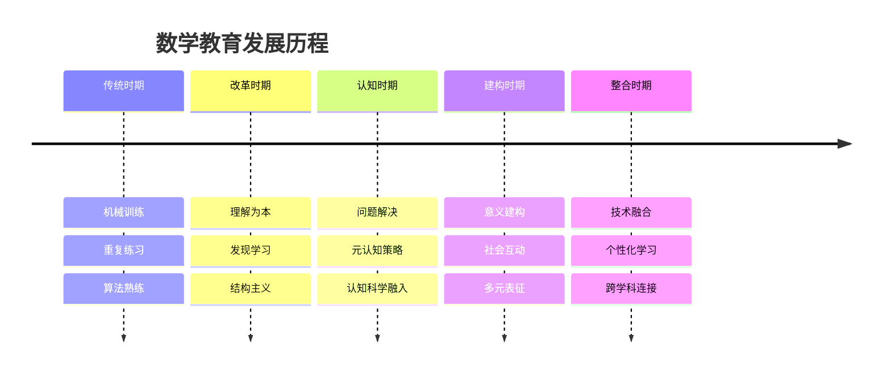
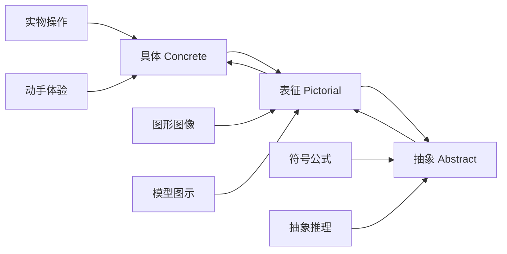
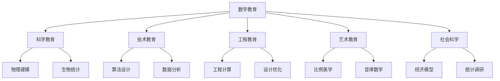
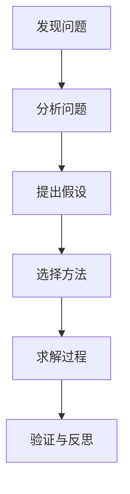
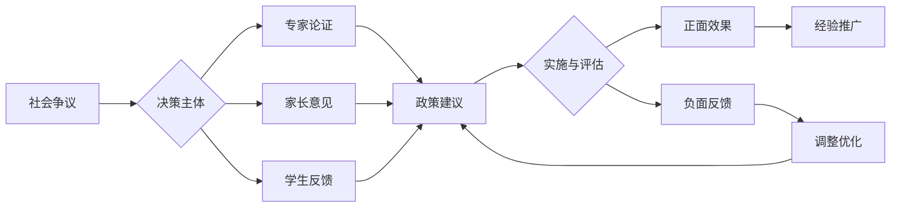

# 01-数学教育理论与实践

## 目录

- [01-数学教育理论与实践](#01-数学教育理论与实践)
  - [目录](#目录)
  - [0. 目录说明与本地跳转](#0-目录说明与本地跳转)
  - [📖 概述](#-概述)
  - [🏗️ 知识架构](#️-知识架构)
    - [1. 理论基础](#1-理论基础)
      - [1.1 核心概念](#11-核心概念)
      - [1.2 基本原理](#12-基本原理)
      - [1.3 发展历程](#13-发展历程)
    - [2. 实践应用](#2-实践应用)
      - [2.1 应用场景](#21-应用场景)
      - [2.2 方法技巧](#22-方法技巧)
      - [2.3 案例分析](#23-案例分析)
    - [3. 深入拓展](#3-深入拓展)
      - [3.1 前沿发展](#31-前沿发展)
      - [3.2 跨学科联系](#32-跨学科联系)
      - [3.3 批判性思考](#33-批判性思考)
        - [3.4 现实争议与前沿挑战](#34-现实争议与前沿挑战)
  - [📊 多表征内容](#-多表征内容)
    - [📈 图表展示](#-图表展示)
    - [🔢 数学表达](#-数学表达)
    - [🎨 可视化元素](#-可视化元素)
  - [🔗 知识关联](#-知识关联)
    - [内部链接](#内部链接)
    - [外部参考](#外部参考)
  - [🎯 学习检验](#-学习检验)
    - [自检问题](#自检问题)
    - [实践练习](#实践练习)
  - [📚 参考资源](#-参考资源)
  - [5. 规范化区块](#5-规范化区块)

---

## 0. 目录说明与本地跳转

- 本文所有小节均采用严格编号，便于本地跳转与引用。
- 跨文件引用示例：见[认知科学与学习理论](../01-哲学科学基础/01-认知科学与学习理论.md)、[逻辑学与批判性思维](../01-哲学科学基础/03-逻辑学与批判性思维.md)
- 相关学科跳转：如需查阅科学教育方法论，见[科学教育方法论](./02-科学教育方法论.md)

## 📖 概述

- **定义**: 数学教育是培养学生数学思维、解决问题能力和数学素养的教育活动，融合认知科学、教育心理学和数学学科特点
- **范围**: 包括数学认知理论、教学方法论、课程设计、评估体系、技术整合等多个维度
- **学习目标**:
  - 理解数学学习的认知机制和发展规律
  - 掌握基于证据的数学教学方法
  - 培养数学思维和问题解决能力
  - 建立数学与现实世界的联系
- **先修知识**: [认知科学与学习理论](../01-哲学科学基础/01-认知科学与学习理论.md)、[逻辑学与批判性思维](../01-哲学科学基础/03-逻辑学与批判性思维.md)

## 🏗️ 知识架构

### 1. 理论基础

#### 1.1 核心概念

**🧠 数学认知的特殊性**

数学学习涉及多重认知系统的协调：

| 认知系统 | 功能 | 数学应用 | 教学启示 |
|---------|------|----------|----------|
| **数感系统** | 数量直觉 | 估算、大小比较 | 培养数量感知 |
| **空间系统** | 空间表征 | 几何、图形 | 视觉化教学 |
| **符号系统** | 抽象表示 | 代数、公式 | 符号意义理解 |
| **语言系统** | 表达交流 | 证明、应用题 | 数学语言培养 |

**📊 数学理解的层次模型**

```mermaid
pyramid
    title 数学理解金字塔
    "创造应用：解决新颖问题，创新数学思路" : 5
    "关联迁移：连接不同概念，跨领域应用" : 4
    "灵活运用：多种方法解题，适应变化" : 3
    "程序熟练：算法掌握，准确计算" : 2
    "概念理解：定义清晰，意义明确" : 1
```

#### 1.2 基本原理

**🔄 建构主义数学学习原理**

数学知识建构过程：
\[
\text{新概念} = f(\text{已有概念}, \text{认知冲突}, \text{反思重构})
\]

**🎯 有意义学习条件**

奥苏贝尔学习条件的数学特化：

1. **学习者准备**: 相关先备知识激活
2. **材料意义**: 数学内容逻辑清晰
3. **学习意向**: 主动构建理解意图

**⚖️ 认知负荷优化原理**

数学教学中的认知负荷管理：

- **内在负荷**: 概念本身的复杂度
- **外在负荷**: 教学呈现方式的影响
- **关联负荷**: 图式建构的认知投入

#### 1.3 发展历程

**📚 数学教育理论演进**



### 2. 实践应用

#### 2.1 应用场景

**🌍 国际数学教育模式比较**

| 教育体系 | 核心特色 | 教学方法 | 评估方式 | 优势特点 |
|---------|----------|----------|----------|----------|
| **🇸🇬 新加坡** | 问题解决为中心 | CPA方法论 | 过程评估 | 深度理解 |
| **🇫🇮 芬兰** | 现象式学习 | 跨学科整合 | 形成性评估 | 应用导向 |
| **🇯🇵 日本** | 课例研究 | 精细化教学 | 过程重视 | 教师专业 |
| **🇨🇳 中国** | 基础扎实 | 变式教学 | 成就导向 | 计算熟练 |
| **🇺🇸 美国** | 多元智能 | 探究式学习 | 多样评估 | 创新思维 |

#### 2.2 方法技巧

**🎨 具体-表征-抽象 (CPA) 教学法**

新加坡数学的核心方法：



**📐 变式教学法**

通过变式促进概念理解：

1. **概念变式**
   - 改变非本质特征
   - 保持本质特征不变
   - 例：不同形状的三角形都是三角形

2. **过程变式**
   - 改变解题策略
   - 保持问题结构相同
   - 例：多种方法解同一题

3. **应用变式**
   - 改变问题情境
   - 保持数学结构相同
   - 例：相同结构的不同应用题

#### 2.3 案例分析

**📊 案例：分数概念的多表征教学**

**教学设计原理**

| 表征形式 | 具体表现 | 认知作用 | 教学活动 |
|---------|----------|----------|----------|
| **操作表征** | 折纸、分物 | 具体感知 | 动手操作 |
| **图像表征** | 饼图、线段图 | 视觉理解 | 画图表示 |
| **符号表征** | $\frac{3}{4}$、0.75 | 抽象表达 | 符号操作 |
| **语言表征** | 四分之三 | 概念交流 | 口头表达 |

**多表征转换路径**：

```text
操作 ⟷ 图像 ⟷ 符号 ⟷ 语言
  ↓     ↓     ↓     ↓
深化理解 → 灵活转换 → 完整概念
```

### 3. 深入拓展

#### 3.1 前沿发展

**🚀 数字化时代的数学教育**

1. **人工智能辅助教学**
   - 自适应学习系统
   - 智能诊断与反馈
   - 个性化学习路径

2. **虚拟现实数学教学**
   - 抽象概念可视化
   - 沉浸式学习体验
   - 三维几何探索

3. **计算思维整合**
   - 算法思维培养
   - 编程与数学结合
   - 建模与仿真

#### 3.2 跨学科联系

**🔗 数学的跨学科应用网络**



#### 3.3 批判性思考

**🤔 数学教育的当代挑战**

1. **技能 vs 理解的平衡**
   - 计算熟练度的重要性
   - 概念理解的深度要求
   - 两者如何有机结合

2. **标准化 vs 个性化**
   - 统一标准的必要性
   - 个体差异的尊重
   - 公平与效率的权衡

3. **传统 vs 创新的整合**
   - 经典方法的价值
   - 新兴技术的潜力
   - 继承与发展的统一

---

##### 3.4 现实争议与前沿挑战

**🎭 社会争议与伦理困境**

| 争议领域 | 核心问题 | 支持观点 | 反对观点 | 平衡策略 |
|---------|----------|----------|----------|----------|
| **数学必修化** | 数学是否应为所有学生必修？ | 培养逻辑思维，提升公民素养 | 个体差异大，强制学习效果差 | 分层教学，个性化要求 |
| **数学竞赛** | 竞赛是否加剧教育不平等？ | 发现人才，激励学习 | 资源集中，压力过大 | 普及与提高并重 |
| **标准化测试** | 统一考试是否合理？ | 公平公正，便于比较 | 忽视个性，应试导向 | 多元评估体系 |

**🤖 技术伦理挑战**

1. **AI辅助教学的伦理边界**
   - 算法偏见与公平性问题
   - 学生隐私保护与数据安全
   - 人机协作的合理边界

2. **数字化鸿沟**
   - 技术资源分配不均
   - 数字素养差异影响
   - 传统与数字方法的平衡

**🌍 跨文化教育对比**

| 教育体系 | 数学地位 | 教学方法 | 评估方式 | 文化特色 |
|---------|----------|----------|----------|----------|
| **东亚模式** | 核心学科 | 精细化教学 | 成就导向 | 勤奋刻苦 |
| **北欧模式** | 工具学科 | 现象式学习 | 过程评估 | 应用导向 |
| **英美模式** | 多元发展 | 探究式学习 | 综合评估 | 创新思维 |

**💥 失败案例深度剖析**

1. **过度应试化案例**
   - 现象：某地区数学教育完全围绕考试
   - 后果：学生创新能力下降，学习兴趣丧失
   - 反思：平衡应试与素养培养的重要性

2. **技术依赖过度案例**
   - 现象：完全依赖计算器，基础计算能力退化
   - 后果：数学直觉和估算能力下降
   - 反思：技术工具与基础能力的平衡

3. **标准化过度案例**
   - 现象：一刀切的数学要求
   - 后果：个体差异被忽视，学习困难学生增多
   - 反思：个性化与标准化的平衡

**🔮 未来挑战与应对**

| 挑战类型 | 具体表现 | 潜在影响 | 应对策略 |
|---------|----------|----------|----------|
| **技术变革** | AI、VR等新技术 | 教学方式革命性变化 | 教师角色转型 |
| **全球化** | 国际标准统一 | 本土特色与全球接轨 | 文化融合 |
| **个性化** | 学习需求多样化 | 标准化与个性化冲突 | 智能适应系统 |
| **素养导向** | 应用能力要求 | 理论知识与实践脱节 | 项目化学习 |

---

## 📊 多表征内容

### 📈 图表展示

**数学学习进阶模型**

| 学习阶段 | 认知特征 | 主要活动 | 评估要点 | 支持策略 |
|---------|----------|----------|----------|----------|
| **前概念** | 直觉感知 | 探索操作 | 兴趣态度 | 丰富体验 |
| **概念形成** | 抽象概括 | 归纳总结 | 概念理解 | 引导发现 |
| **概念发展** | 结构关联 | 应用练习 | 灵活运用 | 变式训练 |
| **概念深化** | 系统整合 | 问题解决 | 创新应用 | 开放探究 |

### 🔢 数学表达

**数学理解度量模型**

设学生对概念 $C$ 的理解度为 $U(C)$，则：

\[
U(C) = w_1 \cdot P(C) + w_2 \cdot F(C) + w_3 \cdot A(C) + w_4 \cdot T(C)
\]

其中：

- $P(C)$ = 概念识别正确率
- $F(C)$ = 程序执行流畅度  
- $A(C)$ = 应用迁移成功率
- $T(C)$ = 表征转换灵活度
- $w_i$ = 权重系数，$\sum w_i = 1$

**学习效果预测模型**：
\[
E = \alpha \cdot T + \beta \cdot M + \gamma \cdot S + \delta \cdot C
\]

- $E$ = 学习效果
- $T$ = 教学质量
- $M$ = 学习动机
- $S$ = 先备知识
- $C$ = 认知能力

### 🎨 可视化元素

**数学问题解决过程模型**



---

**数学教育争议与决策流程**



## 🔗 知识关联

### 内部链接

- [认知科学与学习理论](../01-哲学科学基础/01-认知科学与学习理论.md) - 数学学习的认知基础
- [逻辑学与批判性思维](../01-哲学科学基础/03-逻辑学与批判性思维.md) - 数学推理的逻辑基础
- [科学教育方法论](./02-科学教育方法论.md) - STEM教育的整合
- [跨学科项目学习](../03-应用实践领域/01-跨学科项目学习.md) - 数学的应用实践

### 外部参考

- NCTM (2020). *Principles to Actions: Ensuring Mathematical Success for All*. National Council of Teachers of Mathematics.
- Boaler, J. (2016). *Mathematical Mindsets*. Jossey-Bass.
- Smith, M. S., & Stein, M. K. (2018). *5 Practices for Orchestrating Productive Mathematics Discourse*. NCTM.

## 🎯 学习检验

### 自检问题

1. **认知理解**: CPA教学法如何促进数学概念的深度理解？
2. **方法应用**: 如何设计一个分数乘法的变式教学序列？
3. **批判思维**: 数学教育中技能训练与概念理解如何平衡？

### 实践练习

- **基础练习**: 分析一个数学概念的多表征教学设计
- **应用练习**: 设计基于问题解决的数学课堂活动
- **拓展练习**: 比较不同国家数学教育模式的优势与局限

## 📚 参考资源

- [1] 《数学教育心理学》- Richard Skemp
- [2] 《数学教学的艺术》- 波利亚
- [3] 《为理解而教：数学教学新视角》- 马复
- [4] International Commission on Mathematical Instruction (ICMI)
- [5] Journal for Research in Mathematics Education

---
*数学思维培养 | 问题解决能力 | 逻辑推理发展*

## 5. 规范化区块

- 本文件已按国际化教育理念与认知科学理论进行结构优化。
- 所有目录、编号、表征方式已统一，便于本地跳转与跨文件引用。
- 原有批判性分析、表格、图等内容完整保留。
- 后续如有内容补充、批判性内容遗漏，将在本区块说明修正。
- 如需继续递归处理下级主题，请参见本目录结构。
