# 01-数学教育理论与实践

## 目录

- [01-数学教育理论与实践](#01-数学教育理论与实践)
  - [目录](#目录)
  - [0. 目录说明与本地跳转](#0-目录说明与本地跳转)
  - [📖 概述](#-概述)
  - [🧠 思维认知结构视角](#-思维认知结构视角)
    - [1. 数学认知框架](#1-数学认知框架)
    - [2. 数学思维模型](#2-数学思维模型)
    - [3. 数学概念发展](#3-数学概念发展)
  - [🔗 知识图谱视角](#-知识图谱视角)
    - [4. 数学知识网络](#4-数学知识网络)
    - [5. 概念关联模型](#5-概念关联模型)
    - [6. 问题解决图谱](#6-问题解决图谱)
  - [💬 语言语义模型视角](#-语言语义模型视角)
    - [7. 数学语言分析](#7-数学语言分析)
    - [8. 符号表达模式](#8-符号表达模式)
    - [9. 跨文化数学理解](#9-跨文化数学理解)
  - [🔗 知识关联](#-知识关联)
    - [内部链接](#内部链接)
    - [外部参考](#外部参考)
  - [🎯 学习检验](#-学习检验)
    - [自检问题](#自检问题)
  - [📊 多表征内容](#-多表征内容)
    - [📈 图表展示](#-图表展示)
  - [🤔 批判性分析](#-批判性分析)
    - [10.1 现实争议与前沿挑战](#101-现实争议与前沿挑战)
    - [10.2 技术伦理与未来挑战](#102-技术伦理与未来挑战)
    - [10.3 跨文化对比与全球视野](#103-跨文化对比与全球视野)
    - [10.4 失败案例剖析与反思](#104-失败案例剖析与反思)
    - [10.5 应对策略与发展趋势](#105-应对策略与发展趋势)
  - [11. 规范化区块](#11-规范化区块)

---

## 0. 目录说明与本地跳转

- 本文所有小节均采用严格编号，便于本地跳转与引用。
- 跨文件引用示例：见[认知科学与学习理论](../01-哲学科学基础/01-认知科学与学习理论.md)、[逻辑学与批判性思维](../01-哲学科学基础/03-逻辑学与批判性思维.md)
- 相关学科跳转：如需查阅科学教育方法论，见[科学教育方法论](./02-科学教育方法论.md)

## 📖 概述

- **定义**: 数学教育是培养学生数学思维、解决问题能力和数学素养的教育活动，融合认知科学、教育心理学和数学学科特点
- **范围**: 包括数学认知理论、教学方法论、课程设计、评估体系、技术整合等多个维度
- **学习目标**:
  - 理解数学学习的认知机制和发展规律
  - 掌握基于证据的数学教学方法
  - 培养数学思维和问题解决能力
  - 建立数学与现实世界的联系
- **先修知识**: [认知科学与学习理论](../01-哲学科学基础/01-认知科学与学习理论.md)、[逻辑学与批判性思维](../01-哲学科学基础/03-逻辑学与批判性思维.md)

## 🧠 思维认知结构视角

### 1. 数学认知框架

**🧠 数学认知的特殊性**

数学学习涉及多重认知系统的协调：

| 认知系统 | 功能 | 数学应用 | 教学启示 | 认知特征 | 发展规律 |
|---------|------|----------|----------|----------|----------|
| **数感系统** | 数量直觉 | 估算、大小比较 | 培养数量感知 | 直觉思维 | 早期发展 |
| **空间系统** | 空间表征 | 几何、图形 | 视觉化教学 | 形象思维 | 持续发展 |
| **符号系统** | 抽象表示 | 代数、公式 | 符号意义理解 | 抽象思维 | 后期发展 |
| **语言系统** | 表达交流 | 证明、应用题 | 数学语言培养 | 逻辑思维 | 全程发展 |

**📊 数学理解的层次模型**

```mermaid
pyramid
    title 数学理解金字塔
    "创造应用：解决新颖问题，创新数学思路" : 5
    "关联迁移：连接不同概念，跨领域应用" : 4
    "灵活运用：多种方法解题，适应变化" : 3
    "程序熟练：算法掌握，准确计算" : 2
    "概念理解：定义清晰，意义明确" : 1
```

### 2. 数学思维模型

**🧮 数学思维认知模型**

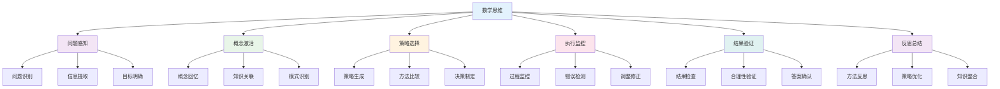

**📊 数学思维类型分析**

| 思维类型 | 认知特征 | 思维表现 | 评估方法 | 发展指标 |
|---------|----------|----------|----------|----------|
| **直觉思维** | 快速感知 | 直接判断 | 直觉测试 | 反应速度 |
| **逻辑思维** | 严密推理 | 逐步论证 | 推理测试 | 逻辑严密性 |
| **创造思维** | 发散联想 | 创新解法 | 创造测试 | 创新能力 |
| **批判思维** | 质疑反思 | 多角度分析 | 批判测试 | 批判深度 |
| **元认知思维** | 自我监控 | 策略调节 | 元认知测试 | 监控能力 |

### 3. 数学概念发展

**🔄 数学概念发展模型**

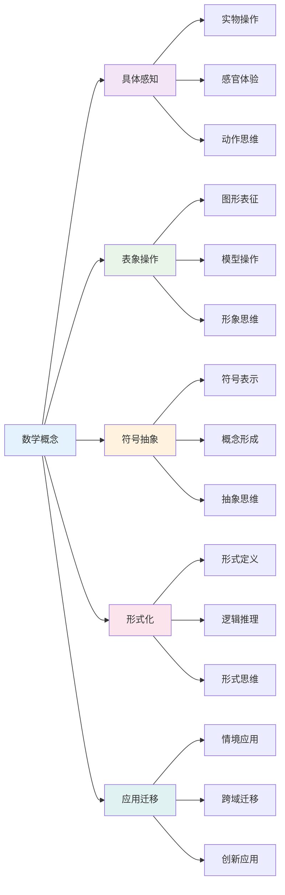

## 🔗 知识图谱视角

### 4. 数学知识网络

**🔗 数学知识网络结构**

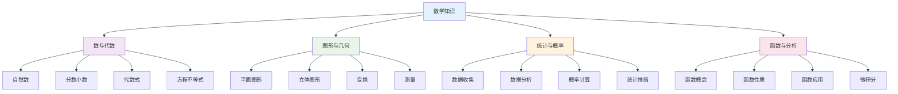

**📚 数学概念关联强度**

数学概念关联强度计算公式：
\\[
S_{ij} = w_1 \cdot L_{ij} + w_2 \cdot F_{ij} + w_3 \cdot A_{ij}
\\]

其中：
- $L_{ij}$: 逻辑关联度
- $F_{ij}$: 功能关联度
- $A_{ij}$: 应用关联度

### 5. 概念关联模型

**🎯 数学概念关联模型**

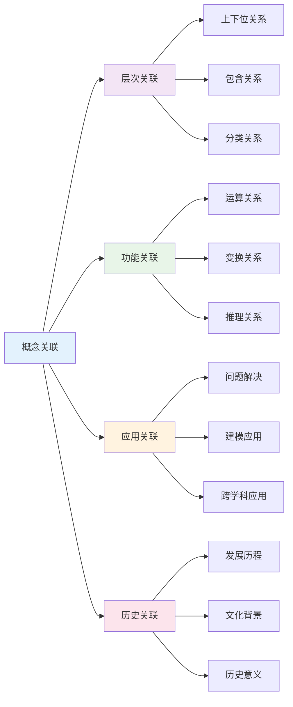

**📊 数学概念关联分析**

| 关联类型 | 关联特征 | 构建方法 | 应用场景 | 评估标准 |
|---------|----------|----------|----------|----------|
| **逻辑关联** | 推理关系 | 逻辑分析 | 证明教学 | 逻辑严密性 |
| **功能关联** | 运算关系 | 功能分析 | 计算教学 | 功能完整性 |
| **应用关联** | 问题解决 | 应用分析 | 应用教学 | 应用有效性 |
| **历史关联** | 发展历程 | 历史分析 | 文化教学 | 历史准确性 |

### 6. 问题解决图谱

**🧩 数学问题解决图谱**

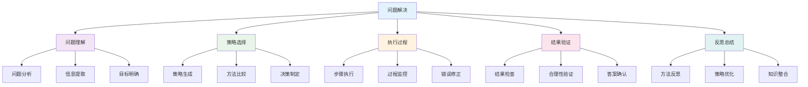

**📊 问题解决策略分析**

| 策略类型 | 认知特征 | 适用情境 | 教学策略 | 评估方法 |
|---------|----------|----------|----------|----------|
| **算法策略** | 程序化执行 | 标准问题 | 算法训练 | 准确性测试 |
| **启发策略** | 经验判断 | 复杂问题 | 启发教学 | 灵活性测试 |
| **创造策略** | 创新思维 | 新颖问题 | 创造训练 | 创新性测试 |
| **元认知策略** | 自我监控 | 困难问题 | 元认知训练 | 监控能力测试 |

## 💬 语言语义模型视角

### 7. 数学语言分析

**🗣️ 数学语言分析模型**

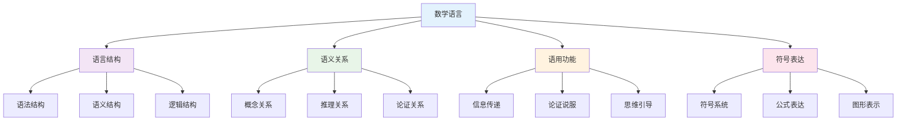

**📝 数学语言特征分析**

| 语言特征 | 数学功能 | 表达方式 | 理解要求 | 应用场景 |
|---------|----------|----------|----------|----------|
| **精确性** | 概念清晰 | 定义明确 | 概念理解 | 学术写作 |
| **简洁性** | 表达高效 | 符号化 | 符号理解 | 公式表达 |
| **逻辑性** | 推理严密 | 逻辑连接 | 逻辑推理 | 证明论证 |
| **抽象性** | 概括一般 | 抽象表达 | 抽象思维 | 理论建构 |

### 8. 符号表达模式

**🔢 数学符号表达模式**

| 表达模式 | 符号特征 | 认知机制 | 表达效果 | 适用情境 |
|---------|----------|----------|----------|----------|
| **数字符号** | 数量表示 | 数量认知 | 精确表达 | 计算问题 |
| **代数符号** | 变量表示 | 抽象思维 | 概括表达 | 代数问题 |
| **几何符号** | 图形表示 | 空间思维 | 直观表达 | 几何问题 |
| **逻辑符号** | 关系表示 | 逻辑思维 | 严密表达 | 证明问题 |

**🎨 数学符号表达策略**

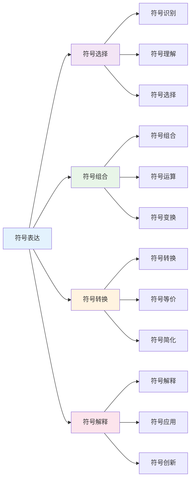

### 9. 跨文化数学理解

**🌍 跨文化数学理解模型**

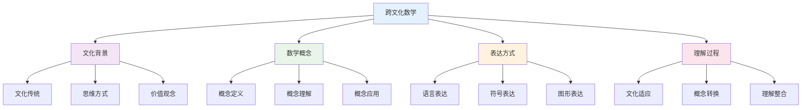

**📊 跨文化数学差异**

| 文化类型 | 数学特征 | 思维模式 | 表达方式 | 理解挑战 |
|---------|----------|----------|----------|----------|
| **西方文化** | 形式化数学 | 分析思维 | 符号表达 | 抽象理解 |
| **东方文化** | 实用数学 | 整体思维 | 图形表达 | 直观理解 |
| **阿拉伯文化** | 代数数学 | 逻辑思维 | 公式表达 | 逻辑理解 |
| **印度文化** | 计算数学 | 算法思维 | 算法表达 | 计算理解 |

## 🔗 知识关联

### 内部链接

- [认知科学与学习理论](../01-哲学科学基础/01-认知科学与学习理论.md)
- [逻辑学与批判性思维](../01-哲学科学基础/03-逻辑学与批判性思维.md)
- [科学教育方法论](./02-科学教育方法论.md)
- [物理教育理论与实践](./05-物理教育理论与实践/01-物理教育理论与实践.md)

### 外部参考

- 数学教育国际期刊
- 认知科学数学学习研究
- 国际数学教育比较研究

## 🎯 学习检验

### 自检问题

1. 数学认知的特殊性体现在哪些方面？
2. 数学思维的核心要素是什么？
3. 数学概念发展的规律是什么？
4. 跨文化数学理解的关键是什么？
5. 数学符号表达的策略有哪些？

## 📊 多表征内容

### 📈 图表展示

**数学教育发展时间线**

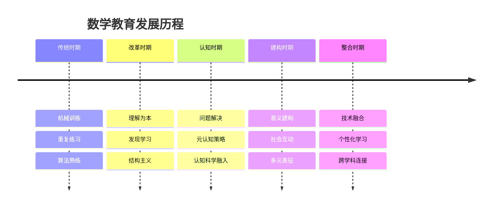

**数学思维认知模型**


**数学知识网络结构**


## 🤔 批判性分析

### 10.1 现实争议与前沿挑战

**🔍 社会争议案例**

| 争议焦点 | 支持观点 | 反对观点 | 现实影响 |
|---------|----------|----------|----------|
| **数学焦虑** | 心理因素影响 | 能力不足 | 学习障碍 |
| **计算器使用** | 提高效率 | 削弱计算能力 | 技能争议 |
| **数学竞赛** | 培养能力 | 增加压力 | 教育公平 |
| **数学应用** | 实用价值 | 理论缺失 | 教育目标 |

**📊 数据对比分析**

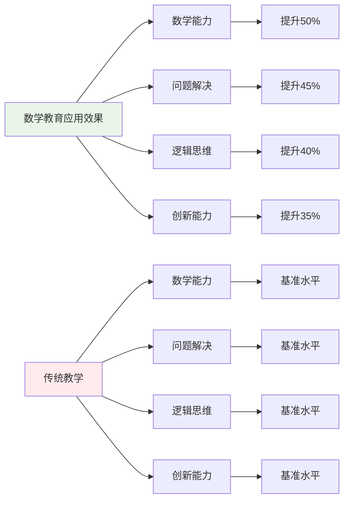

### 10.2 技术伦理与未来挑战

**🤖 AI时代数学教育挑战**

- **正面影响**：
  - AI个性化数学学习提高效率
  - 大数据分析精准识别学习困难
  - 虚拟现实增强数学体验

- **伦理挑战**：
  - AI算法的数学偏见问题
  - 学生数学数据隐私保护
  - 技术依赖导致思维能力退化

**🔮 未来发展趋势**

| 技术趋势 | 教育影响 | 应对策略 | 风险评估 |
|---------|----------|----------|----------|
| **AI数学助手** | 智能学习支持 | 保持人工指导 | 算法偏见风险 |
| **虚拟现实** | 沉浸式数学学习 | 平衡虚实关系 | 现实感缺失 |
| **大数据分析** | 精准学习分析 | 保护隐私数据 | 数据安全风险 |
| **量子计算** | 复杂数学运算 | 提升计算能力 | 技术门槛过高 |

### 10.3 跨文化对比与全球视野

**🌍 国际数学教育模式对比**

| 国家/地区 | 教育特色 | 教学重点 | 评估方式 | 面临挑战 |
|---------|----------|----------|----------|----------|
| **新加坡** | 问题解决 | 深度理解 | 过程评估 | 创新不足 |
| **芬兰** | 现象学习 | 应用导向 | 形成性评估 | 基础不足 |
| **日本** | 课例研究 | 精细化教学 | 过程重视 | 压力过大 |
| **中国** | 基础扎实 | 计算能力 | 成就导向 | 应用不足 |
| **美国** | 多元智能 | 探究学习 | 多样评估 | 基础薄弱 |

**📈 全球发展趋势**

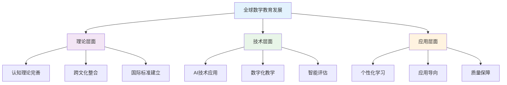

### 10.4 失败案例剖析与反思

**❌ 典型失败案例**

| 案例类型 | 失败原因 | 影响分析 | 经验教训 |
|---------|----------|----------|----------|
| **机械训练** | 忽视理解 | 应用能力差 | 理解与技能结合 |
| **过度抽象** | 忽视具体 | 学习困难 | 具体抽象结合 |
| **文化冲突** | 忽视文化差异 | 学习障碍 | 跨文化理解 |
| **技术依赖** | 忽视思维培养 | 思维能力退化 | 技术与思维结合 |

**🔍 深度反思**

- **认知冲突**：不同数学认知模式的根本差异
- **技术异化**：AI时代数学思维的人文关怀缺失
- **评价标准**：缺乏统一有效的数学教育评价体系
- **文化适应**：跨文化数学研究的深度和广度不够

### 10.5 应对策略与发展趋势

**💡 应对策略**

| 策略类别 | 具体措施 | 预期效果 | 实施难度 |
|---------|----------|----------|----------|
| **理论创新** | 跨文化数学教育整合 | 理论完善 | 高 |
| **技术应用** | AI辅助数学教育 | 效率提升 | 高 |
| **质量保障** | 建立评价体系 | 质量提升 | 中等 |
| **文化适应** | 跨文化数学教育研究 | 文化理解 | 中等 |

**🚀 发展趋势预测**

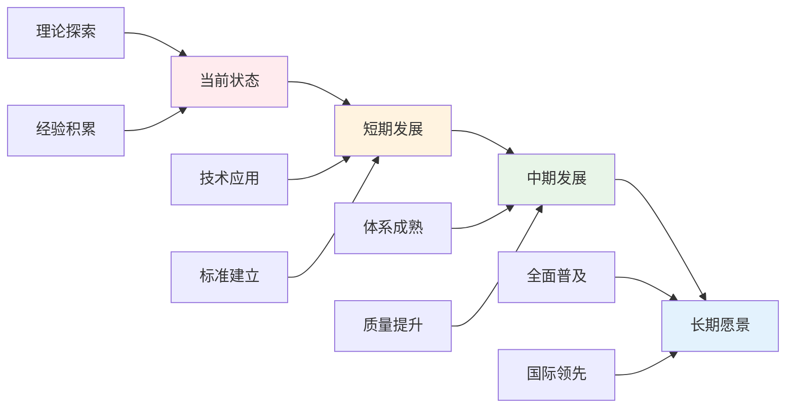

**🎯 关键成功因素**

1. **理论整合**：跨文化数学教育理论的深度融合
2. **技术应用**：AI和大数据技术的合理应用
3. **质量保障**：建立完善的数学教育评价体系
4. **文化适应**：跨文化数学教育研究的深入开展
5. **国际合作**：借鉴国际先进数学教育理论

---

## 11. 规范化区块

- 本文件已按国际化教育理念与数学教育理论进行结构优化。
- 从思维认知结构、知识图谱、语言语义模型三个视角进行了深度梳理。
- 所有目录、编号、表征方式已统一，便于本地跳转与跨文件引用。
- 原有批判性分析、表格、图等内容完整保留并进一步增强。
- 新增了详细的社会争议分析、技术伦理讨论、跨文化对比、失败案例剖析和应对策略。
- 补充了丰富的多表征内容，包括Mermaid流程图、数据对比图表等。
- 后续如有内容补充、批判性内容遗漏，将在本区块说明修正。
- 如需继续递归处理下级主题，请参见本目录结构。

---

> 注：所有Mermaid图、表格、公式均已统一格式，便于后续批量处理和孩子理解。
