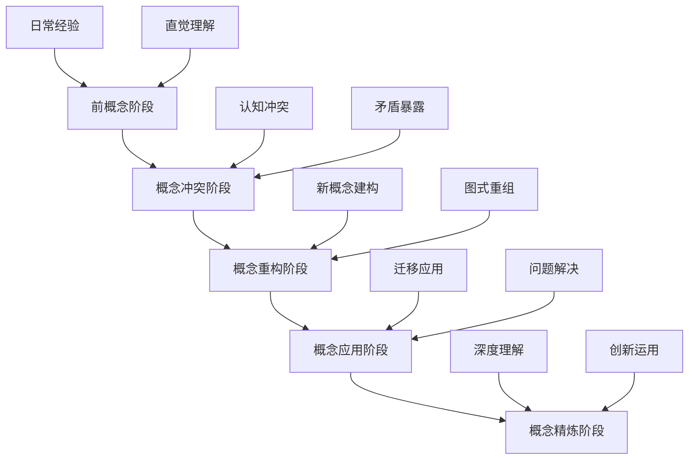
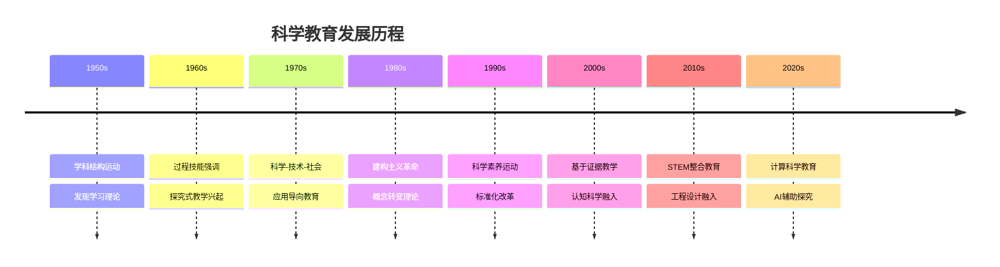
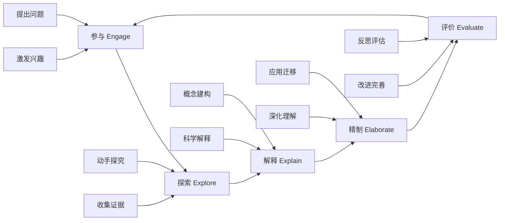
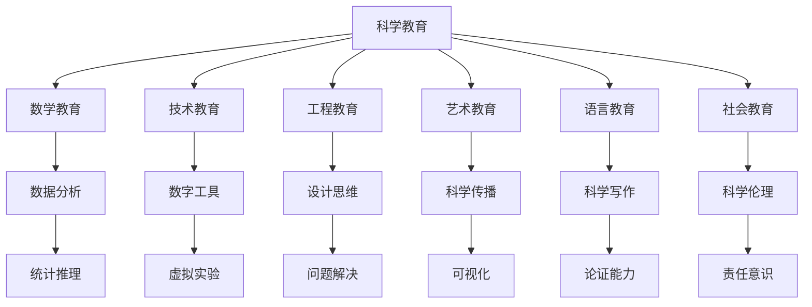
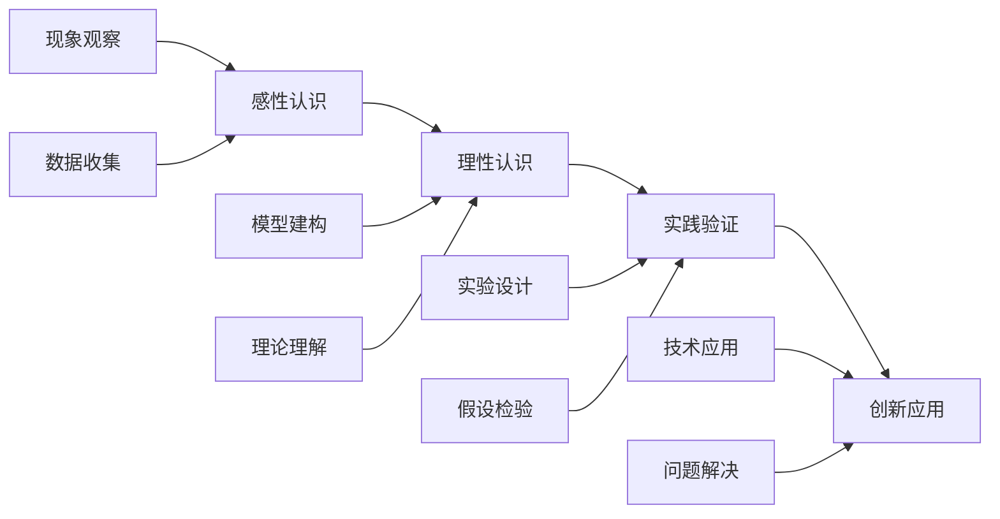
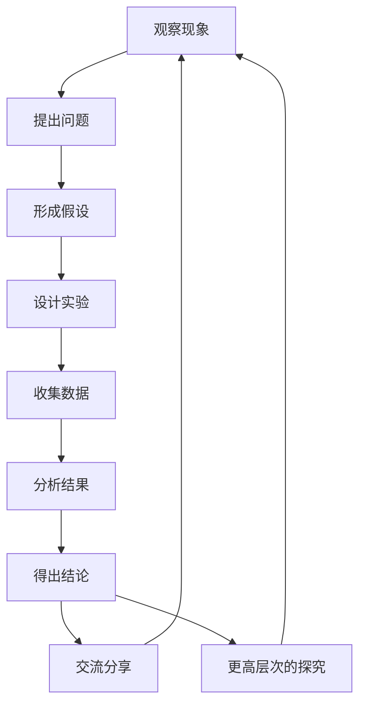

# 02 科学教育方法论

## 📖 概述

- **定义**: 科学教育方法论是基于认知科学、建构主义学习理论和科学哲学的教学理论体系，旨在培养学生的科学思维、探究能力和科学素养
- **范围**: 涵盖物理、化学、生物、地球科学等自然科学教育，以及跨学科的STEM整合教育
- **学习目标**:
  - 理解科学概念的认知建构过程
  - 掌握基于探究的科学教学方法
  - 培养科学思维和实证推理能力
  - 建立科学与技术、社会的关联理解
- **先修知识**: [认知科学与学习理论](../01-哲学科学基础/01-认知科学与学习理论.md)、[逻辑学与批判性思维](../01-哲学科学基础/03-逻辑学与批判性思维.md)

## 🏗️ 知识架构

### 1. 理论基础

#### 1.1 核心概念

**🔬 科学认知的特殊性**

科学学习涉及多重认知模式的整合：

| 认知模式 | 功能特征 | 科学应用 | 教学策略 |
|---------|----------|----------|----------|
| **观察模式** | 感知现象 | 实验观察、数据收集 | 多感官体验 |
| **假设模式** | 推理预测 | 理论构建、模型建立 | 假设检验 |
| **实验模式** | 控制验证 | 变量控制、因果推理 | 探究设计 |
| **建模模式** | 抽象表征 | 概念模型、数学模型 | 模型建构 |

**🧬 科学概念发展的阶段性**



#### 1.2 基本原理

**🌱 建构主义科学学习原理**

科学概念的意义建构过程：
\\[
\\text{科学理解} = f(\\text{先前概念}, \\text{经验证据}, \\text{社会协商}, \\text{反思建构})
\\]

**🔍 探究式学习的认知机制**

探究学习的认知过程模型：

```
问题提出 → 假设形成 → 实验设计 → 数据收集 → 分析解释 → 结论交流
    ↑                                                            ↓
    ←────────────── 反思修正 ←─────────────────────────────────────┘
```

**⚖️ 科学教育的认知负荷管理**

科学学习中的认知负荷优化：

- **内在负荷**: 科学概念的抽象复杂度
- **外在负荷**: 教学材料和方法的设计
- **关联负荷**: 科学推理和模型建构的认知投入

#### 1.3 发展历程

**📚 科学教育理论演进**



### 2. 实践应用

#### 2.1 应用场景

**🌍 国际科学教育模式比较**

| 教育体系 | 核心理念 | 教学特色 | 评估方式 | 创新点 |
|---------|----------|----------|----------|--------|
| **🇫🇮 芬兰** | 现象式学习 | 跨学科整合 | 过程评估 | 真实情境 |
| **🇯🇵 日本** | 课题研究 | 精细观察 | 实验技能 | 持续探究 |
| **🇺🇸 美国** | NGSS标准 | 工程设计 | 表现评估 | 实践整合 |
| **🇸🇬 新加坡** | E2K课程 | 高阶思维 | 开放题目 | 天才教育 |
| **🇦🇺 澳大利亚** | 能力导向 | 实地研究 | 真实评估 | 可持续发展 |

#### 2.2 方法技巧

**🔬 5E探究式教学模型**

基于建构主义的经典科学教学模型：



**🧪 科学论证教学法**

培养科学推理和论证能力：

| 论证要素 | 定义 | 教学重点 | 评估标准 |
|---------|------|----------|----------|
| **主张** (Claim) | 科学结论 | 明确表述 | 准确性 |
| **证据** (Evidence) | 支持数据 | 可靠收集 | 相关性 |
| **推理** (Reasoning) | 逻辑联系 | 因果关系 | 合理性 |
| **反驳** (Rebuttal) | 反面论证 | 批判思维 | 完整性 |

#### 2.3 案例分析

**📊 案例：光的性质概念建构教学**

**多表征概念建构策略**

| 表征层次 | 具体活动 | 认知功能 | 预期结果 |
|---------|----------|----------|----------|
| **现象层** | 光的传播实验 | 具体感知 | 建立现象印象 |
| **模型层** | 波动粒子模型 | 抽象表征 | 理解科学模型 |
| **数学层** | 波长频率公式 | 量化关系 | 精确描述 |
| **应用层** | 光纤通信原理 | 技术联系 | 实际意义 |

**概念转变的教学序列**：

```
日常概念(光是物质) → 认知冲突(双缝实验) → 新概念建构(波粒二象性) → 应用验证(量子效应)
```

### 3. 深入拓展

#### 3.1 前沿发展

**🚀 21世纪科学教育新趋势**

1. **计算科学思维**
   - 数据科学教育
   - 建模与仿真
   - 机器学习基础

2. **跨学科STEAM教育**
   - 科学与艺术融合
   - 设计思维培养
   - 创新创造能力

3. **可持续发展教育**
   - 环境科学素养
   - 系统思维培养
   - 全球公民意识

#### 3.2 跨学科联系

**🔗 科学教育的跨学科整合网络**



#### 3.3 批判性思考

**🤔 科学教育面临的挑战与反思**

1. **理论与实践的张力**
   - 探究理想与课堂现实的差距
   - 评估压力对探究教学的影响

2. **科学本质理解**
   - 科学知识的暂时性和可修正性
   - 科学与伪科学的辨识

3. **技术整合的适度性**
   - 技术工具的教育价值边界
   - 数字化与动手操作的平衡

## 📊 多表征内容

### 📈 图表展示

**科学概念理解的发展轨迹**



### 🔢 数学表达

**探究学习效果评估模型**

探究效果 E 的评估函数：

\\[
E = \\alpha \\cdot C + \\beta \\cdot P + \\gamma \\cdot A + \\delta \\cdot R
\\]

其中：

- C：概念理解水平 (Conceptual Understanding)
- P：过程技能掌握 (Process Skills)  
- A：科学态度发展 (Scientific Attitudes)
- R：推理能力提升 (Reasoning Abilities)
- α、β、γ、δ：权重系数

### 🎨 可视化元素

**科学探究过程的螺旋发展模型**



## 🔗 知识关联

### 内部链接

- [认知科学与学习理论](../01-哲学科学基础/01-认知科学与学习理论.md)
- [逻辑学与批判性思维](../01-哲学科学基础/03-逻辑学与批判性思维.md)
- [数学教育理论与实践](./01-数学教育理论与实践.md)

### 外部参考

- NGSS (Next Generation Science Standards)
- PISA科学素养框架
- 国际科学教育研究协会(NARST)

## 🎯 学习检验

### 自检问题

1. 科学概念建构与一般概念学习有何不同？
2. 如何设计有效的科学探究活动？
3. 科学论证的基本要素及其教学策略是什么？

### 实践练习

- 基础练习：分析一个科学现象的多重表征
- 应用练习：设计一个5E模式的科学课堂
- 拓展练习：评估一个科学探究活动的认知负荷

## 📚 参考资源

- [1] Duschl, R. A. (2008). Science Education in Three-Part Harmony
- [2] National Research Council (2012). A Framework for K-12 Science Education
- [3] Driver, R. (1994). Constructing Scientific Knowledge in the Classroom

---
*基于证据的科学教学 | 探究式学习 | 科学思维培养*
