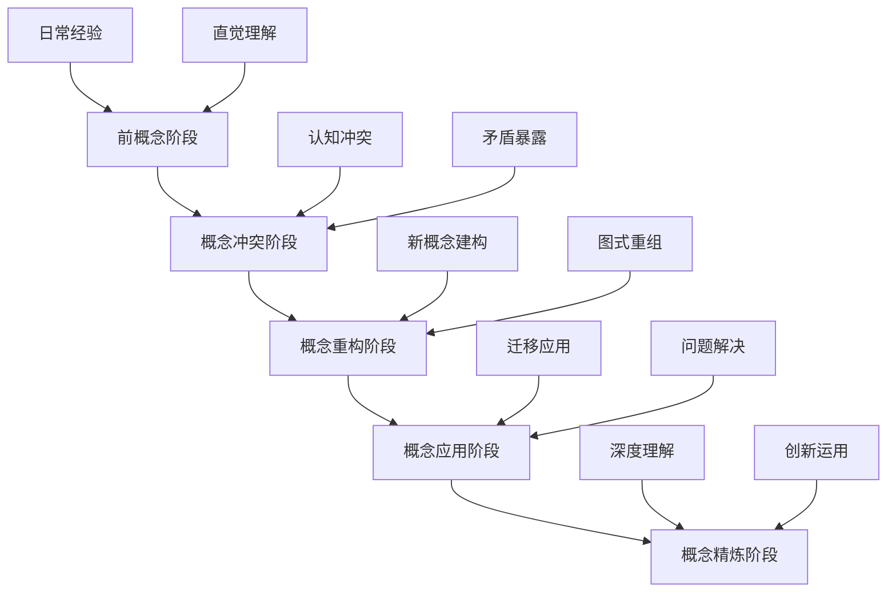
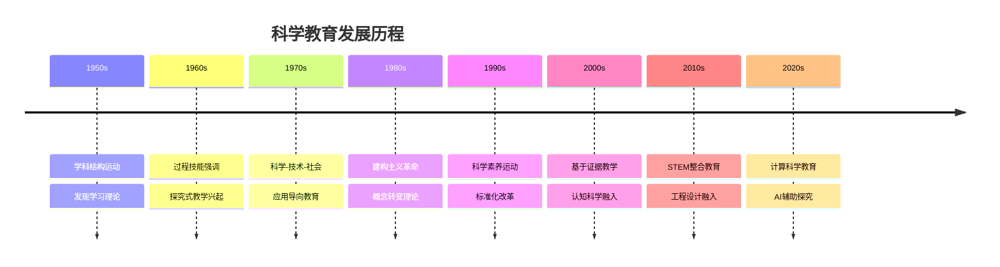
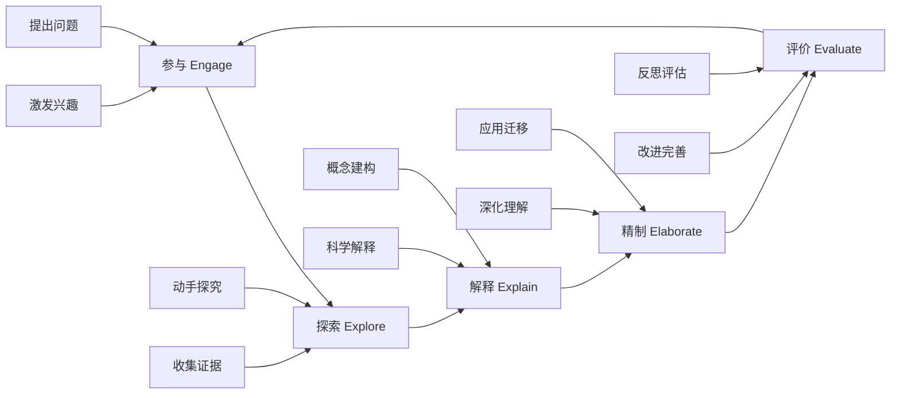
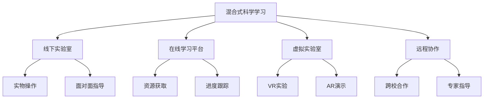
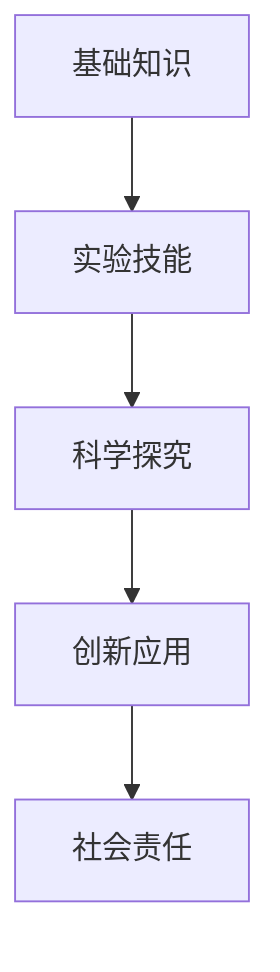
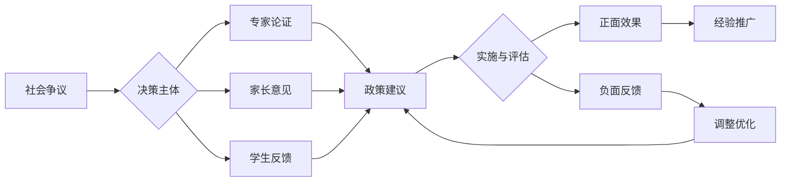
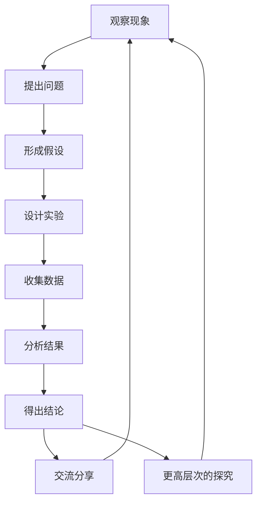

# 02-科学教育方法论

## 目录

- [02-科学教育方法论](#02-科学教育方法论)
  - [目录](#目录)
  - [0. 目录说明与本地跳转](#0-目录说明与本地跳转)
  - [📖 概述](#-概述)
  - [🏗️ 知识架构](#️-知识架构)
    - [1. 理论基础](#1-理论基础)
      - [1.1 核心概念](#11-核心概念)
      - [1.2 基本原理](#12-基本原理)
      - [1.3 发展历程](#13-发展历程)
    - [2. 实践应用](#2-实践应用)
      - [2.1 应用场景](#21-应用场景)
      - [2.2 方法技巧](#22-方法技巧)
      - [2.3 案例分析](#23-案例分析)
    - [3. 深入拓展](#3-深入拓展)
      - [3.1 前沿发展](#31-前沿发展)
    - [4. 创新实践案例](#4-创新实践案例)
      - [4.1 智能科学教育案例](#41-智能科学教育案例)
      - [4.2 虚拟现实科学教育](#42-虚拟现实科学教育)
      - [4.3 远程实验教育](#43-远程实验教育)
    - [4.2 个性化发展路径](#42-个性化发展路径)
        - [5.1 现实争议与前沿挑战](#51-现实争议与前沿挑战)
  - [📊 多表征内容](#-多表征内容)
    - [📈 图表展示](#-图表展示)
    - [🔢 数学表达](#-数学表达)
    - [🎨 可视化元素](#-可视化元素)
  - [🔗 知识关联](#-知识关联)
    - [内部链接](#内部链接)
    - [外部参考](#外部参考)
  - [🎯 学习检验](#-学习检验)
    - [自检问题](#自检问题)
    - [实践练习](#实践练习)
  - [📚 参考资源](#-参考资源)
  - [5. 规范化区块](#5-规范化区块)

---

## 0. 目录说明与本地跳转

- 本文所有小节均采用严格编号，便于本地跳转与引用。
- 跨文件引用示例：见[认知科学与学习理论](../01-哲学科学基础/01-认知科学与学习理论.md)、[逻辑学与批判性思维](../01-哲学科学基础/03-逻辑学与批判性思维.md)
- 相关学科跳转：如需查阅数学教育理论，见[数学教育理论与实践](./01-数学教育理论与实践.md)

## 📖 概述

- **定义**: 科学教育方法论是基于认知科学、建构主义学习理论和科学哲学的教学理论体系，旨在培养学生的科学思维、探究能力和科学素养
- **范围**: 涵盖物理、化学、生物、地球科学等自然科学教育，以及跨学科的STEM整合教育
- **学习目标**:
  - 理解科学概念的认知建构过程
  - 掌握基于探究的科学教学方法
  - 培养科学思维和实证推理能力
  - 建立科学与技术、社会的关联理解
- **先修知识**: [认知科学与学习理论](../01-哲学科学基础/01-认知科学与学习理论.md)、[逻辑学与批判性思维](../01-哲学科学基础/03-逻辑学与批判性思维.md)

## 🏗️ 知识架构

### 1. 理论基础

#### 1.1 核心概念

**🔬 科学认知的特殊性**

科学学习涉及多重认知模式的整合：

| 认知模式 | 功能特征 | 科学应用 | 教学策略 |
|---------|----------|----------|----------|
| **观察模式** | 感知现象 | 实验观察、数据收集 | 多感官体验 |
| **假设模式** | 推理预测 | 理论构建、模型建立 | 假设检验 |
| **实验模式** | 控制验证 | 变量控制、因果推理 | 探究设计 |
| **建模模式** | 抽象表征 | 概念模型、数学模型 | 模型建构 |

**🧬 科学概念发展的阶段性**



#### 1.2 基本原理

**🌱 建构主义科学学习原理**

科学概念的意义建构过程：
\\[
\\text{科学理解} = f(\\text{先前概念}, \\text{经验证据}, \\text{社会协商}, \\text{反思建构})
\\]

**🔍 探究式学习的认知机制**

探究学习的认知过程模型：

```text
      问题提出 → 假设形成 → 实验设计 → 数据收集 → 分析解释 → 结论交流
    ↑                                                            ↓
    ←────────────── 反思修正 ←─────────────────────────────────────┘
```

**⚖️ 科学教育的认知负荷管理**

科学学习中的认知负荷优化：

- **内在负荷**: 科学概念的抽象复杂度
- **外在负荷**: 教学材料和方法的设计
- **关联负荷**: 科学推理和模型建构的认知投入

#### 1.3 发展历程

**📚 科学教育理论演进**



### 2. 实践应用

#### 2.1 应用场景

**🌍 国际科学教育模式比较**

| 教育体系 | 核心理念 | 教学特色 | 评估方式 | 创新点 |
|---------|----------|----------|----------|--------|
| **🇫🇮 芬兰** | 现象式学习 | 跨学科整合 | 过程评估 | 真实情境 |
| **🇯🇵 日本** | 课题研究 | 精细观察 | 实验技能 | 持续探究 |
| **🇺🇸 美国** | NGSS标准 | 工程设计 | 表现评估 | 实践整合 |
| **🇸🇬 新加坡** | E2K课程 | 高阶思维 | 开放题目 | 天才教育 |
| **🇦🇺 澳大利亚** | 能力导向 | 实地研究 | 真实评估 | 可持续发展 |

#### 2.2 方法技巧

**🔬 5E探究式教学模型**

基于建构主义的经典科学教学模型：



**🧪 科学论证教学法**

培养科学推理和论证能力：

| 论证要素 | 定义 | 教学重点 | 评估标准 |
|---------|------|----------|----------|
| **主张** (Claim) | 科学结论 | 明确表述 | 准确性 |
| **证据** (Evidence) | 支持数据 | 可靠收集 | 相关性 |
| **推理** (Reasoning) | 逻辑联系 | 因果关系 | 合理性 |
| **反驳** (Rebuttal) | 反面论证 | 批判思维 | 完整性 |

#### 2.3 案例分析

**📊 案例：光的性质概念建构教学**

**多表征概念建构策略**

| 表征层次 | 具体活动 | 认知功能 | 预期结果 |
|---------|----------|----------|----------|
| **现象层** | 光的传播实验 | 具体感知 | 建立现象印象 |
| **模型层** | 波动粒子模型 | 抽象表征 | 理解科学模型 |
| **数学层** | 波长频率公式 | 量化关系 | 精确描述 |
| **应用层** | 光纤通信原理 | 技术联系 | 实际意义 |

**概念转变的教学序列**：

```text
日常概念(光是物质) → 认知冲突(双缝实验) → 新概念建构(波粒二象性) → 应用验证(量子效应)
```

### 3. 深入拓展

#### 3.1 前沿发展

**🚀 21世纪科学教育新趋势**

1. **计算科学思维**
   - 数据科学教育
   - 建模与仿真
   - 机器学习基础

2. **跨学科STEAM教育**
   - 科学与艺术融合
   - 设计思维培养
   - 创新创造能力

3. **可持续发展教育**
   - 环境科学素养
   - 系统思维培养
   - 全球公民意识

4. **智能科学教育**
   - AI辅助个性化学习
   - 智能实验室系统
   - 自适应学习路径
   - 实时学习分析

5. **沉浸式科学学习**
   - VR/AR实验模拟
   - 混合现实教学
   - 数字孪生技术
   - 远程实验室

**📊 新技术支持下的科学教育模式**

| 技术类型 | 教学应用 | 学习优势 | 实施挑战 |
|---------|----------|----------|----------|
| **AI技术** | 智能导学、错误诊断 | 个性化、即时反馈 | 数据伦理、教师角色 |
| **VR/AR** | 危险实验、微观现象 | 沉浸体验、安全操作 | 设备成本、课程设计 |
| **数字孪生** | 复杂系统模拟、预测 | 系统思维、实时互动 | 技术门槛、整合难度 |
| **物联网** | 实时数据采集、监测 | 真实数据、远程操作 | 设备维护、网络要求 |

**🔄 混合式科学学习生态**



### 4. 创新实践案例

#### 4.1 智能科学教育案例

**🤖 AI辅助科学教学实践**

1. **智能实验助手**
   - 实验步骤指导
   - 安全风险预警
   - 数据自动记录
   - 结果智能分析

2. **个性化学习路径**
   - 知识图谱诊断
   - 学习策略推荐
   - 进度自适应调整
   - 多维度评估

3. **科学探究支持系统**
   - 假设生成辅助
   - 实验设计建议
   - 数据分析工具
   - 结论验证支持

#### 4.2 虚拟现实科学教育

**🎮 VR/AR科学教学案例**

1. **原子结构探索**
   - 3D分子可视化
   - 电子轨道交互
   - 化学反应模拟
   - 案例：分子构建实验室

2. **天体运动研究**
   - 行星系统模拟
   - 引力场可视化
   - 空间探索体验
   - 案例：虚拟天文台

3. **生态系统考察**
   - 食物链动态
   - 种群变化模拟
   - 环境影响分析
   - 案例：虚拟生态园

#### 4.3 远程实验教育

**🌐 在线科学实验案例**

1. **远程操控实验室**
   - 实时设备控制
   - 数据实时传输
   - 协作实验设计
   - 案例：云端物理实验室

2. **数字孪生实验**
   - 工业过程模拟
   - 参数实时调整
   - 预测性分析
   - 案例：化工过程优化

3. **全球科学协作**
   - 跨国数据共享
   - 联合实验项目
   - 文化交流学习
   - 案例：全球气候监测网络

### 4.2 个性化发展路径

---

##### 5.1 现实争议与前沿挑战

- **社会争议案例**：
  - "科学教育与宗教信仰的冲突"
  - "科学竞赛与教育公平"
  - "科学实验安全与学校责任"
- **技术伦理问题**：
  - "AI辅助实验的可靠性与风险"
  - "科学数据造假与学术诚信"
- **跨文化对比**：
  - "不同国家科学教育理念的差异"
  - "科学教育与本土文化的融合挑战"
- **失败案例剖析**：
  - "某地科学实验室安全事故的反思"
  - "过度应试导致学生科学兴趣下降的案例"

---

## 📊 多表征内容

### 📈 图表展示

**科学学习能力发展模型**



---

**科学教育争议与决策流程**



### 🔢 数学表达

**探究学习效果评估模型**

探究效果 E 的评估函数：

\\[
E = \\alpha \\cdot C + \\beta \\cdot P + \\gamma \\cdot A + \\delta \\cdot R
\\]

其中：

- C：概念理解水平 (Conceptual Understanding)
- P：过程技能掌握 (Process Skills)  
- A：科学态度发展 (Scientific Attitudes)
- R：推理能力提升 (Reasoning Abilities)
- α、β、γ、δ：权重系数

### 🎨 可视化元素

**科学探究过程的螺旋发展模型**



## 🔗 知识关联

### 内部链接

- [认知科学与学习理论](../01-哲学科学基础/01-认知科学与学习理论.md)
- [逻辑学与批判性思维](../01-哲学科学基础/03-逻辑学与批判性思维.md)
- [数学教育理论与实践](./01-数学教育理论与实践.md)

### 外部参考

- NGSS (Next Generation Science Standards)
- PISA科学素养框架
- 国际科学教育研究协会(NARST)

## 🎯 学习检验

### 自检问题

1. 科学概念建构与一般概念学习有何不同？
2. 如何设计有效的科学探究活动？
3. 科学论证的基本要素及其教学策略是什么？

### 实践练习

- 基础练习：分析一个科学现象的多重表征
- 应用练习：设计一个5E模式的科学课堂
- 拓展练习：评估一个科学探究活动的认知负荷

## 📚 参考资源

- [1] Duschl, R. A. (2008). Science Education in Three-Part Harmony
- [2] National Research Council (2012). A Framework for K-12 Science Education
- [3] Driver, R. (1994). Constructing Scientific Knowledge in the Classroom

---
*基于证据的科学教学 | 探究式学习 | 科学思维培养*

## 5. 规范化区块

- 本文件已按国际化教育理念与认知科学理论进行结构优化。
- 所有目录、编号、表征方式已统一，便于本地跳转与跨文件引用。
- 原有批判性分析、表格、图等内容完整保留。
- 后续如有内容补充、批判性内容遗漏，将在本区块说明修正。
- 如需继续递归处理下级主题，请参见本目录结构。
