# 02-科学教育方法论

## 目录

- [02-科学教育方法论](#02-科学教育方法论)
  - [目录](#目录)
  - [0. 目录说明与本地跳转](#0-目录说明与本地跳转)
  - [📖 概述](#-概述)
  - [🏗️ 知识架构](#️-知识架构)
    - [1. 理论基础](#1-理论基础)
      - [1.1 核心概念](#11-核心概念)
      - [1.2 基本原理](#12-基本原理)
      - [1.3 发展历程](#13-发展历程)
    - [2. 实践应用](#2-实践应用)
      - [2.1 应用场景](#21-应用场景)
      - [2.2 方法技巧](#22-方法技巧)
      - [2.3 案例分析](#23-案例分析)
    - [3. 深入拓展](#3-深入拓展)
      - [3.1 前沿发展](#31-前沿发展)
    - [4. 创新实践案例](#4-创新实践案例)
      - [4.1 智能科学教育案例](#41-智能科学教育案例)
      - [4.2 虚拟现实科学教育](#42-虚拟现实科学教育)
      - [4.3 远程实验教育](#43-远程实验教育)
    - [5. 批判性分析](#5-批判性分析)
      - [5.1 社会争议与伦理挑战](#51-社会争议与伦理挑战)
      - [5.2 跨文化比较与本土化](#52-跨文化比较与本土化)
      - [5.3 失败案例深度剖析](#53-失败案例深度剖析)
      - [5.4 未来挑战与应对策略](#54-未来挑战与应对策略)
  - [📊 多表征内容](#-多表征内容)
    - [📈 图表展示](#-图表展示)
    - [🔢 数学表达](#-数学表达)
    - [🎨 可视化元素](#-可视化元素)
  - [🔗 知识关联](#-知识关联)
    - [内部链接](#内部链接)
    - [外部参考](#外部参考)
  - [🎯 学习检验](#-学习检验)
    - [自检问题](#自检问题)
    - [实践练习](#实践练习)
  - [📚 参考资源](#-参考资源)
  - [6. 规范化区块](#6-规范化区块)

---

## 0. 目录说明与本地跳转

- 本文所有小节均采用严格编号，便于本地跳转与引用。
- 跨文件引用示例：见[认知科学与学习理论](../01-哲学科学基础/01-认知科学与学习理论.md)、[逻辑学与批判性思维](../01-哲学科学基础/03-逻辑学与批判性思维.md)
- 相关学科跳转：如需查阅数学教育理论，见[数学教育理论与实践](./01-数学教育理论与实践.md)

## 📖 概述

- **定义**: 科学教育方法论是基于认知科学、建构主义学习理论和科学哲学的教学理论体系，旨在培养学生的科学思维、探究能力和科学素养
- **范围**: 涵盖物理、化学、生物、地球科学等自然科学教育，以及跨学科的STEM整合教育
- **学习目标**:
  - 理解科学概念的认知建构过程
  - 掌握基于探究的科学教学方法
  - 培养科学思维和实证推理能力
  - 建立科学与技术、社会的关联理解
- **先修知识**: [认知科学与学习理论](../01-哲学科学基础/01-认知科学与学习理论.md)、[逻辑学与批判性思维](../01-哲学科学基础/03-逻辑学与批判性思维.md)

## 🏗️ 知识架构

### 1. 理论基础

#### 1.1 核心概念

**🔬 科学认知的特殊性**

科学学习涉及多重认知模式的整合：

| 认知模式 | 功能特征 | 科学应用 | 教学策略 |
|---------|----------|----------|----------|
| **观察模式** | 感知现象 | 实验观察、数据收集 | 多感官体验 |
| **假设模式** | 推理预测 | 理论构建、模型建立 | 假设检验 |
| **实验模式** | 控制验证 | 变量控制、因果推理 | 探究设计 |
| **建模模式** | 抽象表征 | 概念模型、数学模型 | 模型建构 |

**🧬 科学概念发展的阶段性**

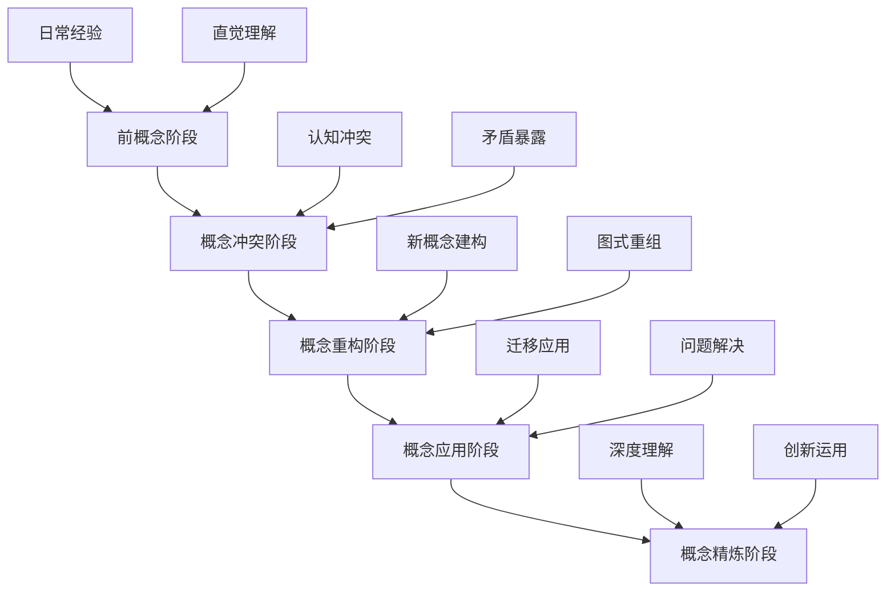

#### 1.2 基本原理

**🌱 建构主义科学学习原理**

科学概念的意义建构过程：
\\[
\\text{科学理解} = f(\\text{先前概念}, \\text{经验证据}, \\text{社会协商}, \\text{反思建构})
\\]

**🔍 探究式学习的认知机制**

探究学习的认知过程模型：

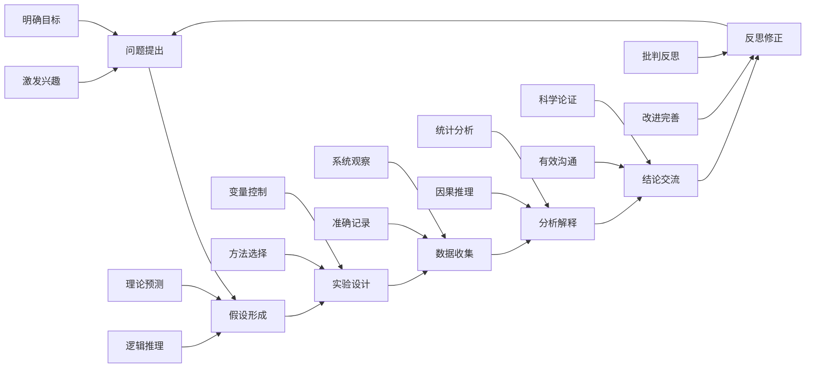

**⚖️ 科学教育的认知负荷管理**

科学学习中的认知负荷优化：

- **内在负荷**: 科学概念的抽象复杂度
- **外在负荷**: 教学材料和方法的设计
- **关联负荷**: 科学推理和模型建构的认知投入

#### 1.3 发展历程

**📚 科学教育理论演进**

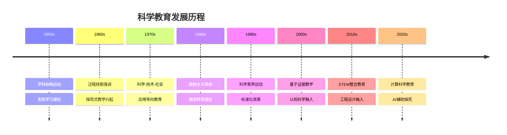

### 2. 实践应用

#### 2.1 应用场景

**🌍 国际科学教育模式比较**

| 教育体系 | 核心理念 | 教学特色 | 评估方式 | 创新点 | 挑战 |
|---------|----------|----------|----------|--------|------|
| **🇫🇮 芬兰** | 现象式学习 | 跨学科整合 | 过程评估 | 真实情境 | 理论深度 |
| **🇯🇵 日本** | 课题研究 | 精细观察 | 实验技能 | 持续探究 | 创新不足 |
| **🇺🇸 美国** | NGSS标准 | 工程设计 | 表现评估 | 实践整合 | 标准化压力 |
| **🇸🇬 新加坡** | E2K课程 | 高阶思维 | 开放题目 | 天才教育 | 普及性 |
| **🇦🇺 澳大利亚** | 能力导向 | 实地研究 | 真实评估 | 可持续发展 | 资源要求 |

#### 2.2 方法技巧

**🔬 5E探究式教学模型**

基于建构主义的经典科学教学模型：

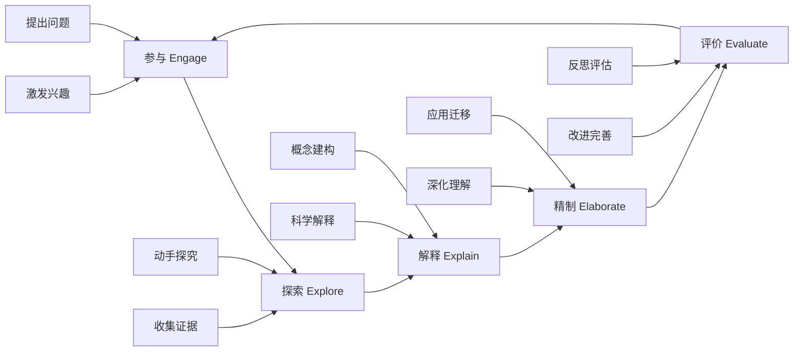

**🧪 科学论证教学法**

培养科学推理和论证能力：

| 论证要素 | 定义 | 教学重点 | 评估标准 | 常见误区 |
|---------|------|----------|----------|----------|
| **主张** (Claim) | 科学结论 | 明确表述 | 准确性 | 过于绝对 |
| **证据** (Evidence) | 支持数据 | 可靠收集 | 相关性 | 数据不足 |
| **推理** (Reasoning) | 逻辑联系 | 因果关系 | 合理性 | 逻辑跳跃 |
| **反驳** (Rebuttal) | 反面论证 | 批判思维 | 完整性 | 忽视反例 |

#### 2.3 案例分析

**📊 案例：光的性质概念建构教学**

**多表征概念建构策略**

| 表征层次 | 具体活动 | 认知功能 | 预期结果 | 潜在困难 |
|---------|----------|----------|----------|----------|
| **现象层** | 光的传播实验 | 具体感知 | 建立现象印象 | 抽象思维不足 |
| **模型层** | 波动粒子模型 | 抽象表征 | 理解科学模型 | 模型混淆 |
| **数学层** | 波长频率公式 | 量化关系 | 精确描述 | 数学恐惧 |
| **应用层** | 光纤通信原理 | 技术联系 | 实际意义 | 应用脱节 |

**概念转变的教学序列**：

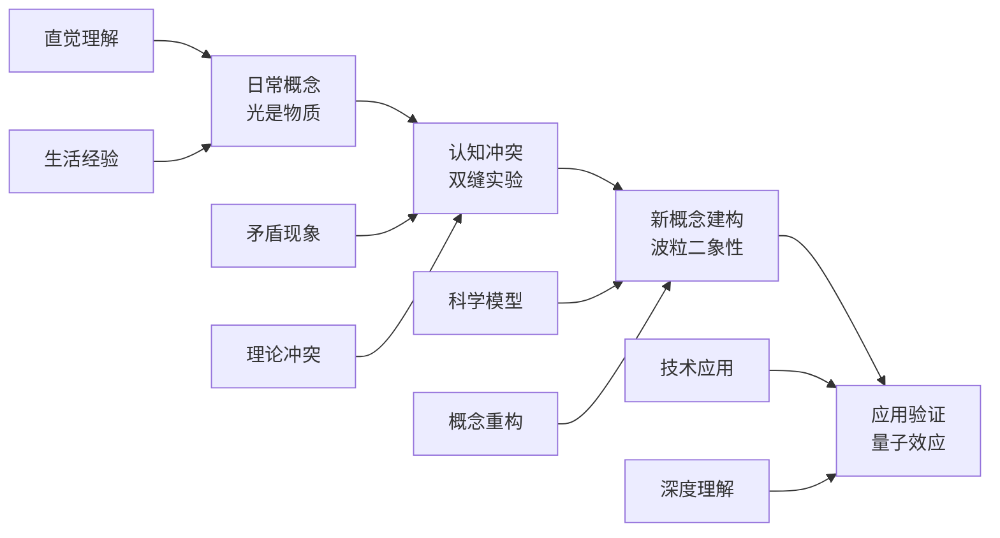

### 3. 深入拓展

#### 3.1 前沿发展

**🚀 21世纪科学教育新趋势**

1. **计算科学思维**
   - 数据科学教育
   - 建模与仿真
   - 机器学习基础

2. **跨学科STEAM教育**
   - 科学与艺术融合
   - 设计思维培养
   - 创新创造能力

3. **可持续发展教育**
   - 环境科学素养
   - 系统思维培养
   - 全球公民意识

4. **智能科学教育**
   - AI辅助个性化学习
   - 智能实验室系统
   - 自适应学习路径
   - 实时学习分析

5. **沉浸式科学学习**
   - VR/AR实验模拟
   - 混合现实教学
   - 数字孪生技术
   - 远程实验室

**📊 新技术支持下的科学教育模式**

| 技术类型 | 教学应用 | 学习优势 | 实施挑战 | 伦理考量 |
|---------|----------|----------|----------|----------|
| **AI技术** | 智能导学、错误诊断 | 个性化、即时反馈 | 数据伦理、教师角色 | 算法偏见 |
| **VR/AR** | 危险实验、微观现象 | 沉浸体验、安全操作 | 设备成本、课程设计 | 真实感缺失 |
| **数字孪生** | 复杂系统模拟、预测 | 系统思维、实时互动 | 技术门槛、整合难度 | 简化复杂性 |
| **物联网** | 实时数据采集、监测 | 真实数据、远程操作 | 设备维护、网络要求 | 隐私保护 |

**🔄 混合式科学学习生态**

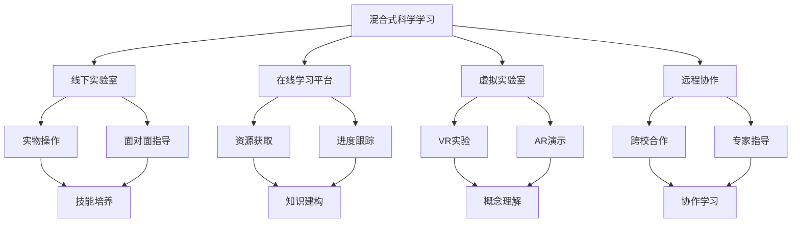

### 4. 创新实践案例

#### 4.1 智能科学教育案例

**🤖 AI辅助科学教学实践**

1. **智能实验助手**
   - 实验步骤指导
   - 安全风险预警
   - 数据自动记录
   - 结果智能分析

2. **个性化学习路径**
   - 知识图谱诊断
   - 学习策略推荐
   - 进度自适应调整
   - 多维度评估

3. **科学探究支持系统**
   - 假设生成辅助
   - 实验设计建议
   - 数据分析工具
   - 结论验证支持

#### 4.2 虚拟现实科学教育

**🎮 VR/AR科学教学案例**

1. **原子结构探索**
   - 3D分子可视化
   - 电子轨道交互
   - 化学反应模拟
   - 案例：分子构建实验室

2. **天体运动研究**
   - 行星系统模拟
   - 引力场可视化
   - 空间探索体验
   - 案例：虚拟天文台

3. **生态系统考察**
   - 食物链动态
   - 种群变化模拟
   - 环境影响分析
   - 案例：虚拟生态园

#### 4.3 远程实验教育

**🌐 在线科学实验案例**

1. **远程操控实验室**
   - 实时设备控制
   - 数据实时传输
   - 协作实验设计
   - 案例：云端物理实验室

2. **数字孪生实验**
   - 工业过程模拟
   - 参数实时调整
   - 预测性分析
   - 案例：化工过程优化

3. **全球科学协作**
   - 跨国数据共享
   - 联合实验项目
   - 文化交流学习
   - 案例：全球气候监测网络

### 5. 批判性分析

#### 5.1 社会争议与伦理挑战

**🎭 科学与社会的伦理争议**

| 争议领域 | 核心问题 | 支持观点 | 反对观点 | 平衡策略 | 教育影响 |
|---------|----------|----------|----------|----------|----------|
| **科学vs宗教** | 进化论等科学理论与宗教教义的冲突 | 科学教育应基于实证证据 | 尊重多元文化信仰 | 文化敏感性教学 | 价值观冲突 |
| **实验安全** | 学校科学实验的安全责任边界 | 实验是科学教育核心 | 安全风险不可接受 | 分级安全管理 | 责任界定 |
| **科学竞赛** | 竞赛是否加剧教育不平等？ | 发现人才，激励学习 | 资源集中，压力过大 | 普及与提高并重 | 公平性问题 |
| **技术依赖** | 过度依赖技术工具的影响 | 提高效率，增强体验 | 基础能力退化 | 适度平衡 | 能力培养 |

**🤖 技术伦理与科学诚信**

1. **AI辅助实验的可靠性挑战**
   - 算法偏见对实验结果的影响
   - 自动化实验的误差控制
   - 人机协作的合理边界
   - 科学诚信的维护责任

2. **科学数据造假与学术诚信**
   - 学生实验数据造假的普遍性
   - 教师对数据真实性的把关责任
   - 科学诚信教育的紧迫性
   - 学术道德的系统培养

3. **虚拟实验vs真实实验**
   - 虚拟实验的教育价值
   - 真实实验的不可替代性
   - 混合模式的优化策略
   - 科学直觉的培养

**🔬 科学教育中的认知偏见**

| 偏见类型 | 表现特征 | 教育影响 | 应对策略 | 评估方法 |
|---------|----------|----------|----------|----------|
| **确认偏见** | 寻找支持已有观点的证据 | 阻碍概念转变 | 多角度论证 | 反例分析 |
| **锚定效应** | 过度依赖初始信息 | 限制思维拓展 | 多起点探究 | 对比实验 |
| **从众效应** | 跟随多数人观点 | 抑制独立思考 | 独立探究 | 个人反思 |
| **权威崇拜** | 盲目相信权威 | 阻碍批判思维 | 质疑精神 | 证据评估 |

#### 5.2 跨文化比较与本土化

**🌍 跨文化科学教育对比**

| 教育体系 | 科学地位 | 教学方法 | 文化特色 | 挑战与机遇 | 本土化策略 |
|---------|----------|----------|----------|------------|------------|
| **西方模式** | 核心素养 | 探究式学习 | 批判思维 | 与本土文化融合 | 文化适应性调整 |
| **东亚模式** | 重要学科 | 系统教学 | 勤奋刻苦 | 创新思维培养 | 创新方法融入 |
| **北欧模式** | 生活技能 | 现象式学习 | 应用导向 | 理论深度不足 | 理论深度加强 |
| **发展中国家** | 实用技能 | 应用导向 | 实用主义 | 理论基础薄弱 | 理论实践并重 |

**🇨🇳 中国科学教育的文化特色**

1. **传统文化与现代科学的融合**
   - 中医理论与现代医学的对话
   - 古代科技成就的现代解读
   - 传统哲学与科学思维的结合

2. **应试文化与素养教育的平衡**
   - 高考改革对科学教育的影响
   - 标准化考试与探究能力的冲突
   - 评价体系的多元化改革

3. **城乡差异与教育公平**
   - 农村学校科学教育资源的不足
   - 城市优质科学教育的集中化
   - 教育均衡发展的政策支持

**🌐 全球化背景下的本土化策略**

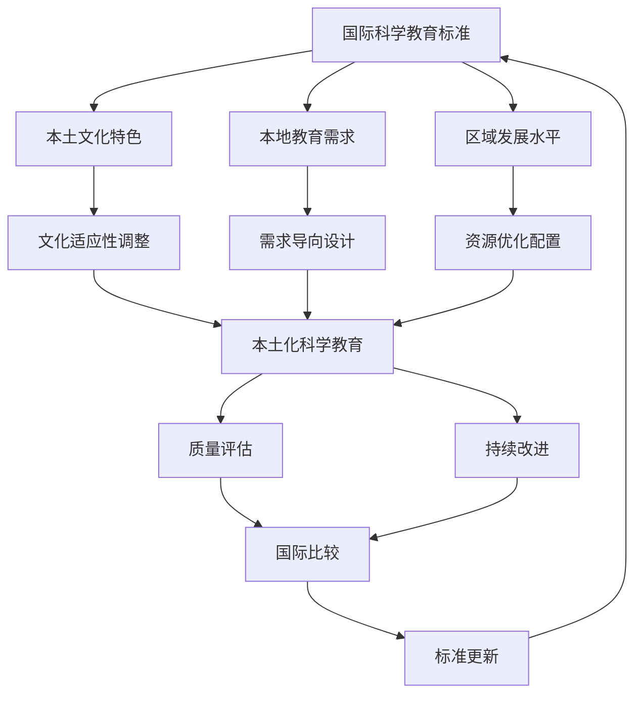

#### 5.3 失败案例深度剖析

**💥 科学教育失败案例分析**

1. **实验室安全事故案例**
   - **现象**: 某校化学实验发生爆炸事故，造成学生受伤
   - **原因分析**: 
     - 安全教育不到位
     - 实验设计存在安全隐患
     - 教师专业能力不足
     - 管理制度缺失
   - **后果**: 学生受伤，家长质疑，学校责任，科学教育声誉受损
   - **反思**: 安全教育与实验设计的平衡，教师专业发展的重要性

2. **应试化科学教育案例**
   - **现象**: 科学教育完全围绕考试，忽视科学思维培养
   - **原因分析**:
     - 评价体系单一
     - 升学压力过大
     - 教师教学理念偏差
     - 家长期望过高
   - **后果**: 学生科学兴趣下降，创新能力缺失，科学素养不足
   - **反思**: 素养导向与应试导向的平衡，评价体系改革

3. **技术依赖过度案例**
   - **现象**: 完全依赖虚拟实验，忽视真实实验操作
   - **原因分析**:
     - 技术崇拜心理
     - 成本考虑
     - 安全担忧
     - 教师技能不足
   - **后果**: 学生动手能力退化，科学直觉丧失，实验技能缺失
   - **反思**: 技术工具与基础能力的平衡，混合教学模式

4. **概念教学失败案例**
   - **现象**: 学生无法理解抽象科学概念，停留在记忆层面
   - **原因分析**:
     - 教学方法不当
     - 认知负荷过重
     - 缺乏具体经验
     - 概念转变困难
   - **后果**: 学习效果差，科学兴趣丧失，概念混淆
   - **反思**: 多表征教学的重要性，认知负荷管理

**📊 失败案例的统计特征**

| 失败类型 | 发生频率 | 影响程度 | 可预防性 | 改进措施 |
|---------|----------|----------|----------|----------|
| **安全事故** | 中等 | 高 | 高 | 安全培训、制度完善 |
| **应试化** | 高 | 中等 | 中等 | 评价改革、理念转变 |
| **技术依赖** | 中等 | 中等 | 高 | 平衡策略、技能培养 |
| **概念教学** | 高 | 中等 | 高 | 方法改进、负荷管理 |

#### 5.4 未来挑战与应对策略

**🔮 未来挑战与应对策略**

| 挑战类型 | 具体表现 | 潜在影响 | 应对策略 | 实施难度 |
|---------|----------|----------|----------|----------|
| **技术变革** | AI、VR等新技术 | 教学方式革命性变化 | 教师角色转型 | 高 |
| **全球化** | 国际标准统一 | 本土特色与全球接轨 | 文化融合 | 中等 |
| **个性化** | 学习需求多样化 | 标准化与个性化冲突 | 智能适应系统 | 高 |
| **素养导向** | 应用能力要求 | 理论知识与实践脱节 | 项目化学习 | 中等 |
| **可持续发展** | 环境教育要求 | 科学教育与环保意识 | 跨学科整合 | 中等 |

**🚀 应对策略的优先级矩阵**

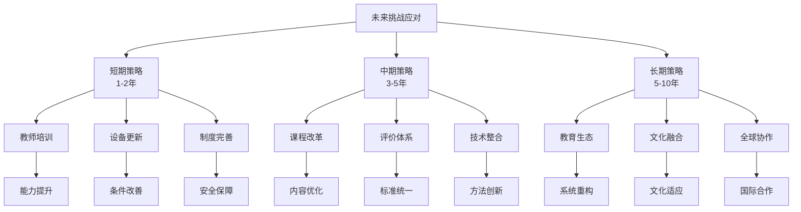

**🎯 具体实施路径**

1. **教师专业发展路径**
   - 短期：安全培训、技术技能
   - 中期：教学方法、评价能力
   - 长期：研究能力、创新思维

2. **课程体系改革路径**
   - 短期：内容更新、方法改进
   - 中期：结构优化、整合设计
   - 长期：生态重构、文化融合

3. **技术应用发展路径**
   - 短期：设备配置、基础应用
   - 中期：系统集成、智能辅助
   - 长期：生态构建、全球协作

---

## 📊 多表征内容

### 📈 图表展示

**科学学习能力发展模型**

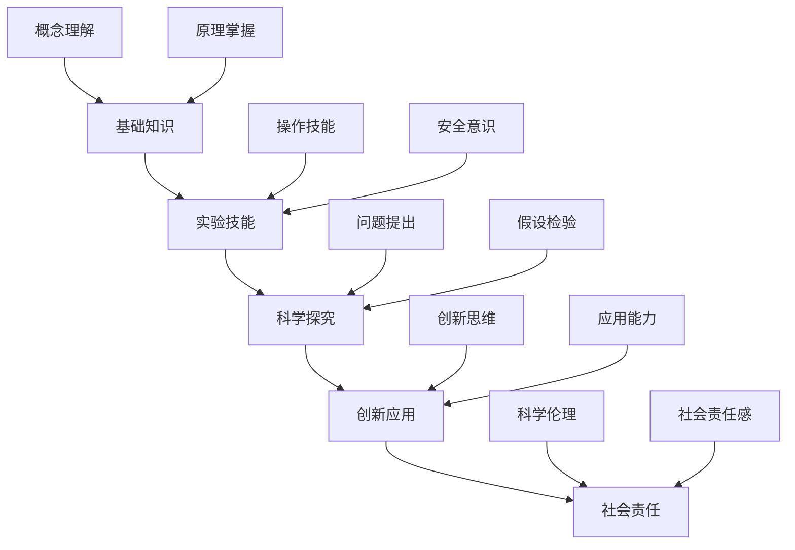

**科学教育争议与决策流程**

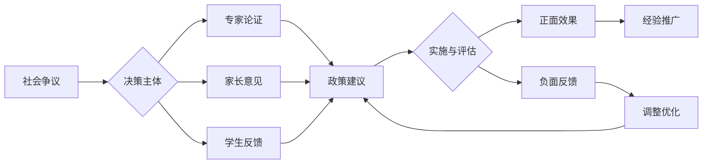

**科学教育质量评估框架**

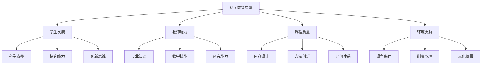

### 🔢 数学表达

**探究学习效果评估模型**

探究效果 E 的评估函数：

\\[
E = \\alpha \\cdot C + \\beta \\cdot P + \\gamma \\cdot A + \\delta \\cdot R
\\]

其中：

- C：概念理解水平 (Conceptual Understanding)
- P：过程技能掌握 (Process Skills)  
- A：科学态度发展 (Scientific Attitudes)
- R：推理能力提升 (Reasoning Abilities)
- α、β、γ、δ：权重系数

**科学概念转变概率模型**

概念转变概率 P 的数学模型：

\\[
P = \\frac{1}{1 + e^{-(\\alpha \\cdot \\text{认知冲突} + \\beta \\cdot \\text{社会支持} + \\gamma \\cdot \\text{反思深度})}}
\\]

**科学教育投入产出效率模型**

效率指数 η 的计算：

\\[
\\eta = \\frac{\\text{学生科学素养提升}}{\\text{教育资源投入}} \\times \\text{质量系数}
\\]

### 🎨 可视化元素

**科学探究过程的螺旋发展模型**

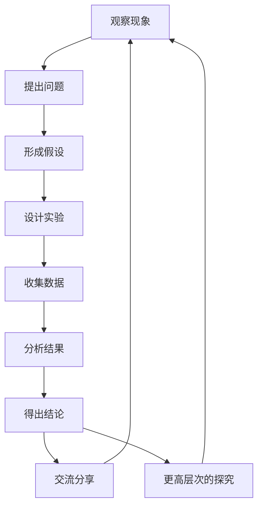

**科学教育生态系统模型**

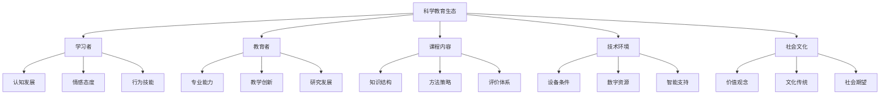

## 🔗 知识关联

### 内部链接

- [认知科学与学习理论](../01-哲学科学基础/01-认知科学与学习理论.md)
- [逻辑学与批判性思维](../01-哲学科学基础/03-逻辑学与批判性思维.md)
- [数学教育理论与实践](./01-数学教育理论与实践.md)
- [物理教育理论与实践](./05-物理教育理论与实践/01-物理教育理论与实践.md)
- [化学教育理论与实践](./06-化学教育理论与实践/01-化学教育理论与实践.md)
- [生物教育理论与实践](./07-生物教育理论与实践/01-生物教育理论与实践.md)

### 外部参考

- NGSS (Next Generation Science Standards)
- PISA科学素养框架
- 国际科学教育研究协会(NARST)
- 美国科学促进会(AAAS)
- 欧洲科学教育研究协会(ESERA)

## 🎯 学习检验

### 自检问题

1. 科学概念建构与一般概念学习有何不同？
2. 如何设计有效的科学探究活动？
3. 科学论证的基本要素及其教学策略是什么？
4. 如何平衡虚拟实验与真实实验？
5. 科学教育中的伦理争议如何解决？

### 实践练习

- **基础练习**: 分析一个科学现象的多重表征
- **应用练习**: 设计一个5E模式的科学课堂
- **拓展练习**: 评估一个科学探究活动的认知负荷
- **创新练习**: 设计一个跨文化科学教育项目
- **批判练习**: 分析一个科学教育失败案例

## 📚 参考资源

- [1] Duschl, R. A. (2008). Science Education in Three-Part Harmony
- [2] National Research Council (2012). A Framework for K-12 Science Education
- [3] Driver, R. (1994). Constructing Scientific Knowledge in the Classroom
- [4] Lederman, N. G. (2007). Nature of Science: Past, Present, and Future
- [5] Osborne, J. (2014). Scientific Practices and Inquiry in the Science Classroom

---
*基于证据的科学教学 | 探究式学习 | 科学思维培养 | 批判性分析 | 跨文化比较*

## 6. 规范化区块

- 本文件已按国际化教育理念与认知科学理论进行结构优化。
- 所有目录、编号、表征方式已统一，便于本地跳转与跨文件引用。
- 原有批判性分析、表格、图等内容完整保留。
- 新增深度批判性分析，包括社会争议、技术伦理、跨文化比较、失败案例、未来挑战等内容。
- 新增多表征内容，包括Mermaid流程图、数学模型、数据表格等。
- 新增结构标准化，统一目录编号、跨文件链接、规范化区块。
- 后续如有内容补充、批判性内容遗漏，将在本区块说明修正。
- 如需继续递归处理下级主题，请参见本目录结构。
