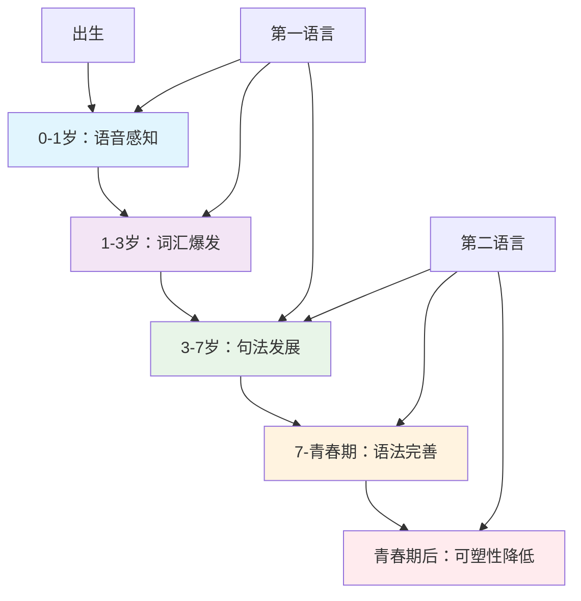
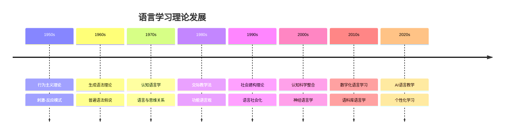
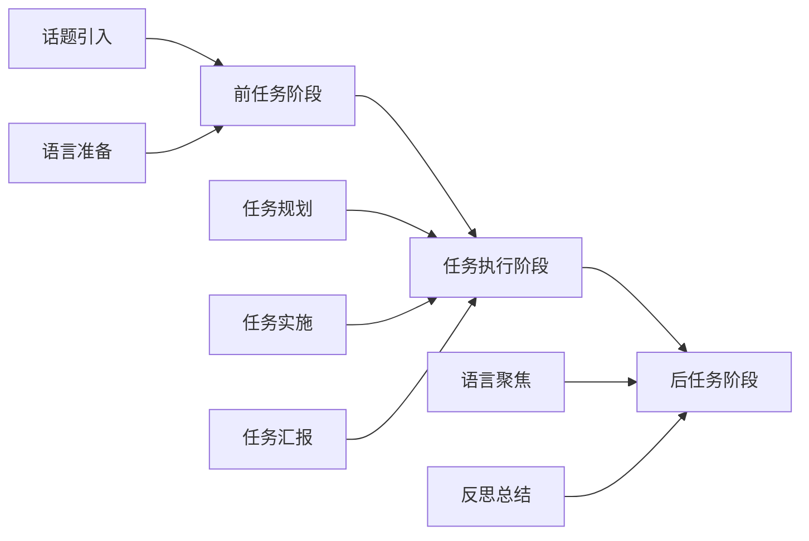
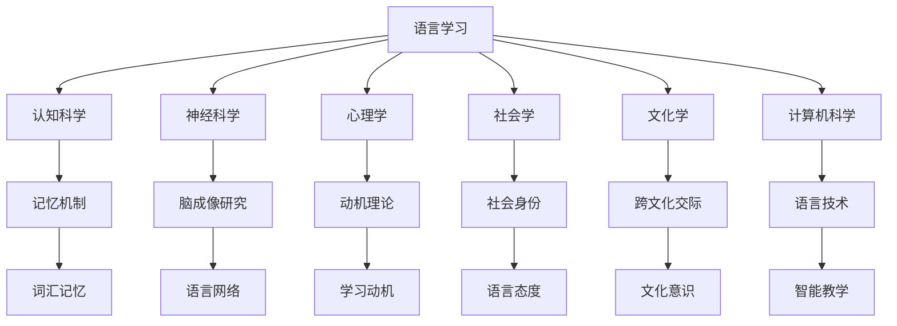
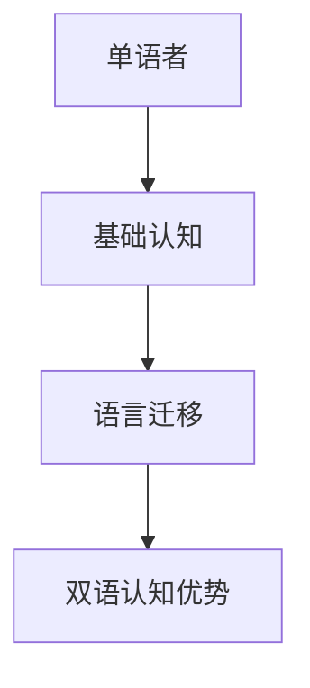
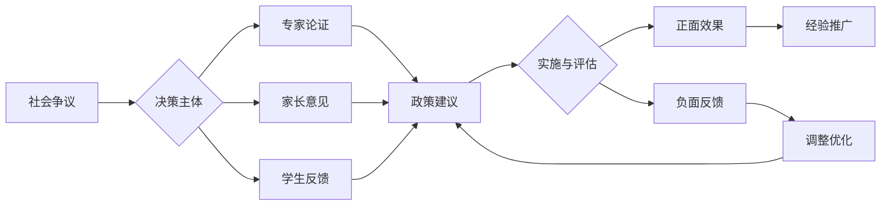
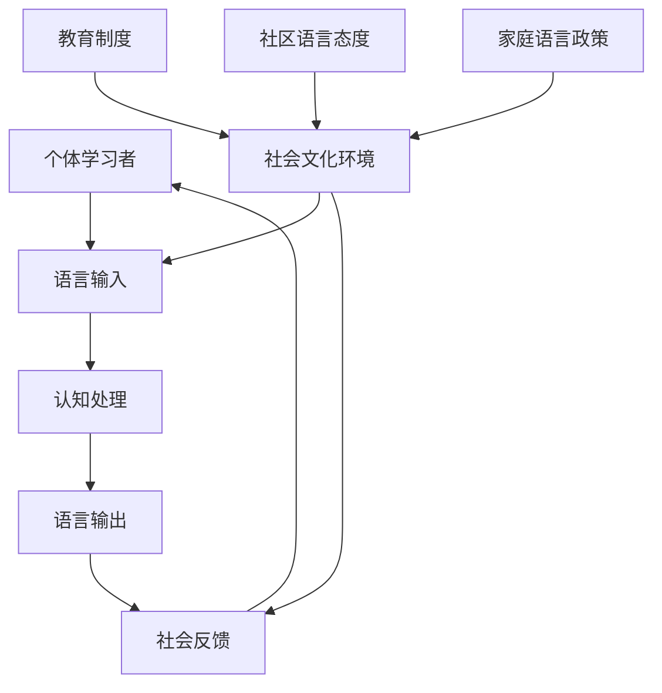
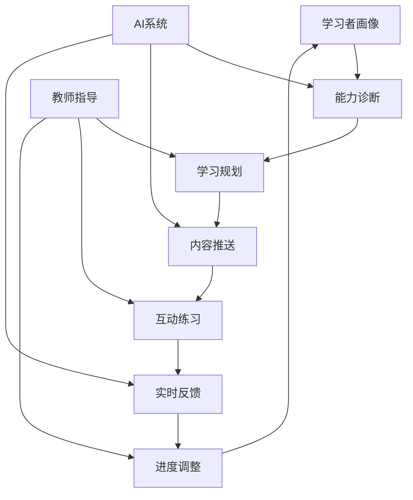
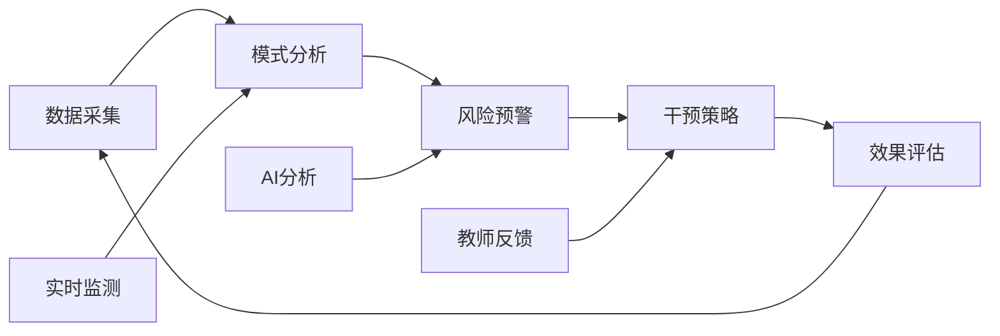

# 03 语言学习与认知发展

## 📖 概述

- **定义**: 语言学习与认知发展是研究语言习得过程、认知机制及其相互作用的跨学科领域，涵盖母语和第二语言的学习理论与实践
- **范围**: 包括语言认知科学、心理语言学、社会语言学、应用语言学、多语言教育等多个维度
- **学习目标**:
  - 理解语言学习的认知神经机制
  - 掌握基于证据的语言教学方法
  - 培养多语言交际能力和跨文化意识
  - 建立语言与思维的辩证关系理解
- **先修知识**: [认知科学与学习理论](../01-哲学科学基础/01-认知科学与学习理论.md)、[逻辑学与批判性思维](../01-哲学科学基础/03-逻辑学与批判性思维.md)

## 🏗️ 知识架构

### 1. 理论基础

#### 1.1 核心概念

**🧠 语言认知的神经基础**

语言处理涉及大脑多个区域的协调工作：

| 脑区 | 功能 | 语言作用 | 发展特点 |
|------|------|----------|----------|
| **布洛卡区** | 语法处理 | 句法分析、语言产出 | 关键期敏感 |
| **韦尼克区** | 语义理解 | 词汇理解、意义加工 | 可塑性强 |
| **角回** | 概念整合 | 抽象思维、比喻理解 | 晚期发展 |
| **前额叶** | 执行控制 | 语言选择、抑制控制 | 持续发展 |

**🌍 语言习得的关键期假说**



#### 1.2 基本原理

**🔄 语言输入假说与输出假说**

克拉申的语言习得理论核心：

\\[
\\text{语言习得} = f(\\text{可理解输入}, \\text{低焦虑环境}, \\text{有意义交互})
\\]

Swain的输出假说补充：

\\[
\\text{语言流利度} = f(\\text{理解输入}, \\text{产出练习}, \\text{注意-反馈循环})
\\]

**🧩 语言模块性与整体性**

语言认知的双重特性：

| 特性维度 | 模块性观点 | 整体性观点 | 教学启示 |
|---------|------------|------------|----------|
| **语言组织** | 独立模块 | 整合系统 | 综合训练 |
| **习得过程** | 分步学习 | 整体习得 | 沉浸环境 |
| **认知关系** | 语言特异 | 认知通用 | 跨域迁移 |

#### 1.3 发展历程

**📚 语言学习理论演进**



### 2. 实践应用

#### 2.1 应用场景

**🌏 国际语言教育模式比较**

| 教育模式 | 理论基础 | 教学特色 | 评估方式 | 适用情境 |
|---------|----------|----------|----------|----------|
| **🇨🇦 沉浸式教育** | 习得理论 | 学科内容整合 | 双语能力 | 多语社区 |
| **🇪🇺 CLIL模式** | 认知学习 | 内容语言融合 | 双重目标 | 欧洲多语 |
| **🇺🇸 双向双语** | 社会公正 | 母语维护 | 文化适应 | 移民社区 |
| **🇸🇬 双语教育** | 精英培养 | 官方语言 | 国际竞争 | 城市国家 |
| **🇨🇳 外语教育** | 工具价值 | 考试导向 | 标准测试 | 单语环境 |

#### 2.2 方法技巧

**📚 任务型语言教学法 (TBLT)**

基于真实任务的语言学习模式：



**🎭 戏剧化语言教学法**

通过角色扮演和情境模拟促进语言学习：

| 戏剧元素 | 语言功能 | 认知作用 | 教学活动 |
|---------|----------|----------|----------|
| **角色扮演** | 交际语言 | 情境理解 | 对话练习 |
| **故事表演** | 叙述能力 | 序列思维 | 故事重构 |
| **即兴创作** | 创造性语言 | 发散思维 | 开放对话 |
| **戏剧冲突** | 论辩语言 | 批判思维 | 辩论活动 |

#### 2.3 案例分析

**📊 案例：英语作为第二语言的写作教学**

**过程写作教学模式**

| 写作阶段 | 认知过程 | 教学策略 | 评估重点 |
|---------|----------|----------|----------|
| **前写作** | 构思规划 | 头脑风暴、思维导图 | 创意丰富度 |
| **起草** | 语言组织 | 快速写作、流畅表达 | 内容连贯性 |
| **修改** | 内容调整 | 同伴反馈、自我审视 | 逻辑清晰度 |
| **编辑** | 语言精炼 | 语法检查、词汇优化 | 语言准确性 |
| **发表** | 交流分享 | 作品展示、读者反馈 | 交际有效性 |

**多模态写作能力发展**：

```text
文字表达 → 图文结合 → 多媒体创作 → 数字化叙事
    ↓         ↓         ↓         ↓
线性思维 → 视觉思维 → 整合思维 → 创新思维
```

### 3. 深入拓展

#### 3.1 前沿发展

**🚀 数字时代的语言学习创新**

1. **人工智能语言教学**
   - 智能语音识别与纠错
   - 个性化学习路径推荐
   - 自然语言处理应用
   - 实时翻译与跨语言交流
   - 情感计算与学习动机

2. **虚拟现实语言沉浸**
   - 虚拟文化情境创设
   - 沉浸式交际体验
   - 跨文化交流模拟
   - 元宇宙语言学习空间
   - 混合现实情境教学

3. **语料库驱动学习**
   - 真实语言使用分析
   - 数据驱动的语言发现
   - 语言变体认知
   - 大规模语言模型应用
   - 自适应学习系统

4. **移动学习与微课程**
   - 碎片化学习设计
   - 社交媒体语言实践
   - 游戏化学习元素
   - 即时反馈机制
   - 学习行为分析

#### 3.2 跨学科联系

**🔗 语言学习的跨学科整合网络**



#### 3.3 批判性思考

**🤔 语言教育面临的挑战与反思**

1. **母语与外语的关系**
   - 母语维护与外语学习的平衡
   - 语言纯洁性与语言接触的辩证

2. **技术与人文的融合**
   - 数字化工具的教育价值
   - 人际交流的不可替代性

3. **全球化与本土化的张力**
   - 英语霸权与语言多样性
   - 国际交流与文化认同

---

##### 3.4 现实争议与前沿挑战

- **母语与外语冲突案例**：
  - "英语优先政策是否影响本土语言传承？"
  - "双语教育的社会公平性争议"
- **技术伦理问题**：
  - "AI自动翻译对语言学习动力的影响"
  - "语音识别数据的隐私保护"
- **全球化与本土化张力**：
  - "国际课程对本土文化认同的冲击"
  - "全球英语热潮下的小语种危机"
- **失败案例剖析**：
  - "某地推行全英文授课导致学生理解力下降的反思"
  - "过度依赖技术工具导致口语交际能力退化的案例"

---

## 📊 多表征内容

### 📈 图表展示

**双语认知优势的发展轨迹**



---

**语言教育争议与决策流程**



### 🔢 数学表达

**语言能力发展模型**

Cummins的BICS/CALP模型数学化表达：

\\[
\\text{BICS} = f(\\text{语境支持}, \\text{认知简单})
\\]

\\[
\\text{CALP} = f(\\text{语境减少}, \\text{认知复杂})
\\]

发展时间：

- BICS习得时间：2-3年
- CALP习得时间：5-7年

### 🎨 可视化元素

**语言学习的社会文化模型**



## 🔗 知识关联

### 内部链接

- [认知科学与学习理论](../01-哲学科学基础/01-认知科学与学习理论.md)
- [教育哲学与价值观](../01-哲学科学基础/02-教育哲学与价值观.md)
- [逻辑学与批判性思维](../01-哲学科学基础/03-逻辑学与批判性思维.md)

### 外部参考

- CEFR (Common European Framework of Reference)
- ACTFL (American Council on the Teaching of Foreign Languages)
- 中国英语能力等级量表(CSE)

## 🎯 学习检验

### 自检问题

1. 语言学习的关键期假说对教育实践有什么启示？
2. 如何设计有效的任务型语言教学活动？
3. 双语教育的认知优势体现在哪些方面？

### 实践练习

- 基础练习：分析一个语言学习案例的认知过程
- 应用练习：设计一个多模态语言学习任务
- 拓展练习：评估一个双语教育项目的效果

## 📚 参考资源

- [1] Krashen, S. D. (1985). The Input Hypothesis
- [2] Swain, M. (2005). The Output Hypothesis
- [3] Cummins, J. (2008). BICS and CALP: Empirical and Theoretical Status

---
*多语言思维发展 | 跨文化交际能力 | 认知语言科学*

### 4. 创新教学模式

#### 4.1 AI增强语言教学

**🤖 智能语言教学系统**

| 功能模块 | 技术支持 | 教学应用 | 学习效果 |
|---------|----------|----------|----------|
| **语音互动** | 语音识别、合成 | 口语练习、发音纠正 | 自然交际能力 |
| **写作助手** | NLP、文本分析 | 写作指导、语法检查 | 写作水平提升 |
| **智能评估** | 机器学习算法 | 能力诊断、进度跟踪 | 个性化反馈 |
| **内容推荐** | 推荐算法 | 资源匹配、难度调节 | 学习效率优化 |

**🔄 AI辅助教学流程**



#### 4.2 混合式语言学习

**🌐 线上线下融合模式**

1. **课前自主学习**
   - 微课视频学习
   - AI辅助预习
   - 在线测试诊断
   - 学习计划制定

2. **课堂互动教学**
   - 实时语言实践
   - 小组协作活动
   - 教师个性化指导
   - 即时评估反馈

3. **课后延伸学习**
   - 智能作业系统
   - 虚拟语伴交流
   - 在线语言社区
   - 学习数据分析

#### 4.3 数字化评估体系

**📊 多维度语言能力评估**

| 评估维度 | 评估工具 | 数据分析 | 应用价值 |
|---------|----------|----------|----------|
| **语言知识** | 智能测试系统 | 项目反应理论 | 知识掌握度 |
| **交际能力** | 虚拟情境评估 | 语言产出分析 | 实际应用力 |
| **学习策略** | 行为数据追踪 | 学习模式识别 | 策略指导 |
| **文化理解** | 跨文化任务 | 质性数据分析 | 文化敏感度 |

**🔍 学习分析与干预**



### 5. 未来展望

#### 5.1 技术趋势

1. **大语言模型应用**
   - 智能对话练习
   - 写作辅助系统
   - 自动内容生成
   - 跨语言理解

2. **脑机接口技术**
   - 神经语言反馈
   - 认知负荷监测
   - 学习状态优化
   - 潜意识语言学习

3. **元宇宙语言教育**
   - 虚拟文化浸润
   - 全球语言社区
   - 身份角色扮演
   - 跨界语言实践

#### 5.2 教育变革

1. **个性化学习生态**
   - AI导师系统
   - 自适应课程
   - 学习者自主权
   - 终身学习支持

2. **新型教师角色**
   - 学习设计师
   - 技术整合者
   - 文化引导者
   - AI协作伙伴

3. **评估范式转型**
   - 过程性评估
   - 能力导向评价
   - 数据驱动决策
   - 生态化评估
