# 03-语言学习与认知发展

## 目录

- [03-语言学习与认知发展](#03-语言学习与认知发展)
  - [目录](#目录)
  - [0. 目录说明与本地跳转](#0-目录说明与本地跳转)
  - [📖 概述](#-概述)
  - [🏗️ 知识架构](#️-知识架构)
    - [1. 理论基础](#1-理论基础)
      - [1.1 核心概念](#11-核心概念)
      - [1.2 基本原理](#12-基本原理)
      - [1.3 发展历程](#13-发展历程)
    - [2. 实践应用](#2-实践应用)
      - [2.1 应用场景](#21-应用场景)
      - [2.2 方法技巧](#22-方法技巧)
      - [2.3 案例分析](#23-案例分析)
    - [3. 深入拓展](#3-深入拓展)
      - [3.1 前沿发展](#31-前沿发展)
      - [3.2 跨学科联系](#32-跨学科联系)
      - [3.3 批判性思考](#33-批判性思考)
    - [4. 创新教学模式](#4-创新教学模式)
      - [4.1 AI增强语言教学](#41-ai增强语言教学)
      - [4.2 混合式语言学习](#42-混合式语言学习)
      - [4.3 数字化评估体系](#43-数字化评估体系)
    - [5. 批判性分析](#5-批判性分析)
      - [5.1 社会争议与伦理挑战](#51-社会争议与伦理挑战)
      - [5.2 跨文化比较与本土化](#52-跨文化比较与本土化)
      - [5.3 失败案例深度剖析](#53-失败案例深度剖析)
      - [5.4 未来挑战与应对策略](#54-未来挑战与应对策略)
  - [📊 多表征内容](#-多表征内容)
    - [📈 图表展示](#-图表展示)
    - [🔢 数学表达](#-数学表达)
    - [🎨 可视化元素](#-可视化元素)
  - [🔗 知识关联](#-知识关联)
    - [内部链接](#内部链接)
    - [外部参考](#外部参考)
  - [🎯 学习检验](#-学习检验)
    - [自检问题](#自检问题)
    - [实践练习](#实践练习)
  - [📚 参考资源](#-参考资源)
  - [6. 规范化区块](#6-规范化区块)

---

## 0. 目录说明与本地跳转

- 本文所有小节均采用严格编号，便于本地跳转与引用。
- 跨文件引用示例：见[认知科学与学习理论](../01-哲学科学基础/01-认知科学与学习理论.md)、[逻辑学与批判性思维](../01-哲学科学基础/03-逻辑学与批判性思维.md)
- 相关学科跳转：如需查阅语文教育理论，见[语文教育理论与实践](./08-语文教育理论与实践/01-语文教育理论与实践.md)

## 📖 概述

- **定义**: 语言学习与认知发展是研究语言习得过程、认知机制及其相互作用的跨学科领域，涵盖母语和第二语言的学习理论与实践
- **范围**: 包括语言认知科学、心理语言学、社会语言学、应用语言学、多语言教育等多个维度
- **学习目标**:
  - 理解语言学习的认知神经机制
  - 掌握基于证据的语言教学方法
  - 培养多语言交际能力和跨文化意识
  - 建立语言与思维的辩证关系理解
- **先修知识**: [认知科学与学习理论](../01-哲学科学基础/01-认知科学与学习理论.md)、[逻辑学与批判性思维](../01-哲学科学基础/03-逻辑学与批判性思维.md)

## 🏗️ 知识架构

### 1. 理论基础

#### 1.1 核心概念

**🧠 语言认知的神经基础**:

语言处理涉及大脑多个区域的协调工作：

| 脑区 | 功能 | 语言作用 | 发展特点 | 教育启示 |
|------|------|----------|----------|----------|
| **布洛卡区** | 语法处理 | 句法分析、语言产出 | 关键期敏感 | 早期语法训练 |
| **韦尼克区** | 语义理解 | 词汇理解、意义加工 | 可塑性强 | 词汇丰富环境 |
| **角回** | 概念整合 | 抽象思维、比喻理解 | 晚期发展 | 高阶思维培养 |
| **前额叶** | 执行控制 | 语言选择、抑制控制 | 持续发展 | 元认知训练 |

**🌍 语言习得的关键期假说**:

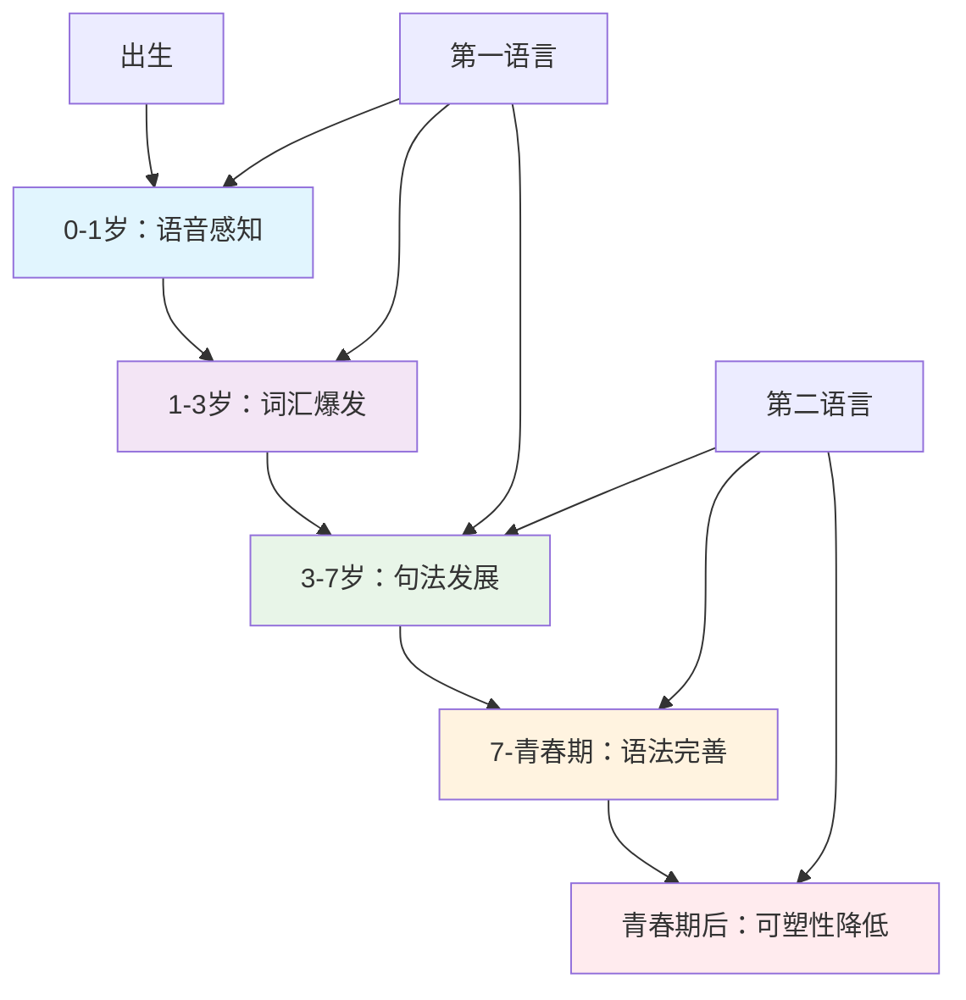

#### 1.2 基本原理

**🔄 语言输入假说与输出假说**:

克拉申的语言习得理论核心：

\\[
\\text{语言习得} = f(\\text{可理解输入}, \\text{低焦虑环境}, \\text{有意义交互})
\\]

Swain的输出假说补充：

\\[
\\text{语言流利度} = f(\\text{理解输入}, \\text{产出练习}, \\text{注意-反馈循环})
\\]

**🧩 语言模块性与整体性**:

语言认知的双重特性：

| 特性维度 | 模块性观点 | 整体性观点 | 教学启示 | 实践策略 |
|---------|------------|------------|----------|----------|
| **语言组织** | 独立模块 | 整合系统 | 综合训练 | 整体语言教学 |
| **习得过程** | 分步学习 | 整体习得 | 沉浸环境 | 自然习得法 |
| **认知关系** | 语言特异 | 认知通用 | 跨域迁移 | 认知策略训练 |

#### 1.3 发展历程

**📚 语言学习理论演进**:

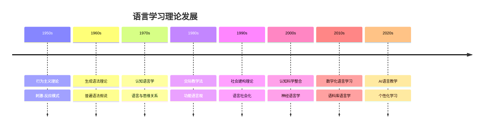

### 2. 实践应用

#### 2.1 应用场景

**🌏 国际语言教育模式比较**:

| 教育模式 | 理论基础 | 教学特色 | 评估方式 | 适用情境 | 挑战 |
|---------|----------|----------|----------|----------|------|
| **🇨🇦 沉浸式教育** | 习得理论 | 学科内容整合 | 双语能力 | 多语社区 | 资源要求高 |
| **🇪🇺 CLIL模式** | 认知学习 | 内容语言融合 | 双重目标 | 欧洲多语 | 教师能力要求 |
| **🇺🇸 双向双语** | 社会公正 | 母语维护 | 文化适应 | 移民社区 | 社会支持不足 |
| **🇸🇬 双语教育** | 精英培养 | 官方语言 | 国际竞争 | 城市国家 | 文化认同挑战 |
| **🇨🇳 外语教育** | 工具价值 | 考试导向 | 标准测试 | 单语环境 | 应用能力不足 |

#### 2.2 方法技巧

**📚 任务型语言教学法 (TBLT)**:

基于真实任务的语言学习模式：

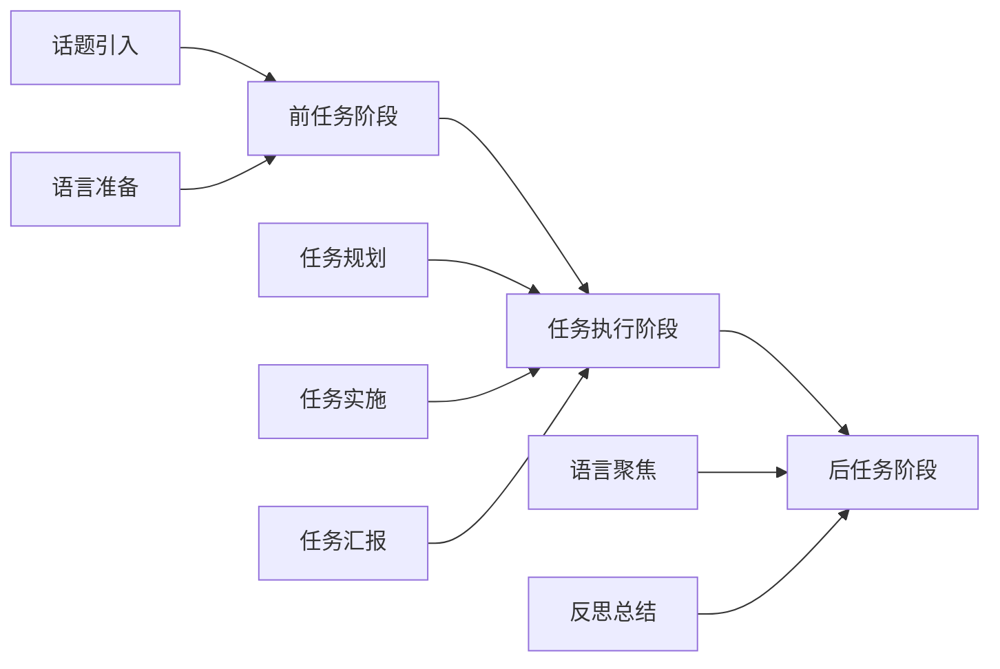

**🎭 戏剧化语言教学法**:

通过角色扮演和情境模拟促进语言学习：

| 戏剧元素 | 语言功能 | 认知作用 | 教学活动 | 评估标准 |
|---------|----------|----------|----------|----------|
| **角色扮演** | 交际语言 | 情境理解 | 对话练习 | 交际流利度 |
| **故事表演** | 叙述能力 | 序列思维 | 故事重构 | 叙述完整性 |
| **即兴创作** | 创造性语言 | 发散思维 | 开放对话 | 创意丰富度 |
| **戏剧冲突** | 论辩语言 | 批判思维 | 辩论活动 | 论证逻辑性 |

#### 2.3 案例分析

**📊 案例：英语作为第二语言的写作教学**:

**过程写作教学模式**:

| 写作阶段 | 认知过程 | 教学策略 | 评估重点 | 常见问题 |
|---------|----------|----------|----------|----------|
| **前写作** | 构思规划 | 头脑风暴、思维导图 | 创意丰富度 | 思路狭窄 |
| **起草** | 语言组织 | 快速写作、流畅表达 | 内容连贯性 | 表达困难 |
| **修改** | 内容调整 | 同伴反馈、自我审视 | 逻辑清晰度 | 修改意识弱 |
| **编辑** | 语言精炼 | 语法检查、词汇优化 | 语言准确性 | 错误忽视 |
| **发表** | 交流分享 | 作品展示、读者反馈 | 交际有效性 | 分享意愿低 |

**多模态写作能力发展**：

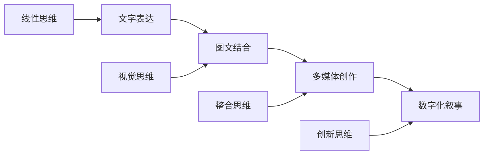

### 3. 深入拓展

#### 3.1 前沿发展

**🚀 数字时代的语言学习创新**:

1. **人工智能语言教学**
   - 智能语音识别与纠错
   - 个性化学习路径推荐
   - 自然语言处理应用
   - 实时翻译与跨语言交流
   - 情感计算与学习动机

2. **虚拟现实语言沉浸**
   - 虚拟文化情境创设
   - 沉浸式交际体验
   - 跨文化交流模拟
   - 元宇宙语言学习空间
   - 混合现实情境教学

3. **语料库驱动学习**
   - 真实语言使用分析
   - 数据驱动的语言发现
   - 语言变体认知
   - 大规模语言模型应用
   - 自适应学习系统

4. **移动学习与微课程**
   - 碎片化学习设计
   - 社交媒体语言实践
   - 游戏化学习元素
   - 即时反馈机制
   - 学习行为分析

#### 3.2 跨学科联系

**🔗 语言学习的跨学科整合网络**

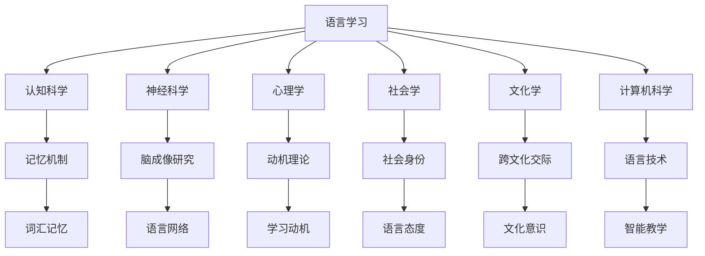

#### 3.3 批判性思考

**🤔 语言教育面临的挑战与反思**

1. **母语与外语的关系**
   - 母语维护与外语学习的平衡
   - 语言纯洁性与语言接触的辩证

2. **技术与人文的融合**
   - 数字化工具的教育价值
   - 人际交流的不可替代性

3. **全球化与本土化的张力**
   - 英语霸权与语言多样性
   - 国际交流与文化认同

### 4. 创新教学模式

#### 4.1 AI增强语言教学

**🤖 智能语言教学系统**

| 功能模块 | 技术支持 | 教学应用 | 学习效果 | 伦理考量 |
|---------|----------|----------|----------|----------|
| **语音互动** | 语音识别、合成 | 口语练习、发音纠正 | 自然交际能力 | 隐私保护 |
| **写作助手** | NLP、文本分析 | 写作指导、语法检查 | 写作水平提升 | 原创性保护 |
| **智能评估** | 机器学习算法 | 能力诊断、进度跟踪 | 个性化反馈 | 算法偏见 |
| **内容推荐** | 推荐算法 | 资源匹配、难度调节 | 学习效率优化 | 信息茧房 |

**🔄 AI辅助教学流程**

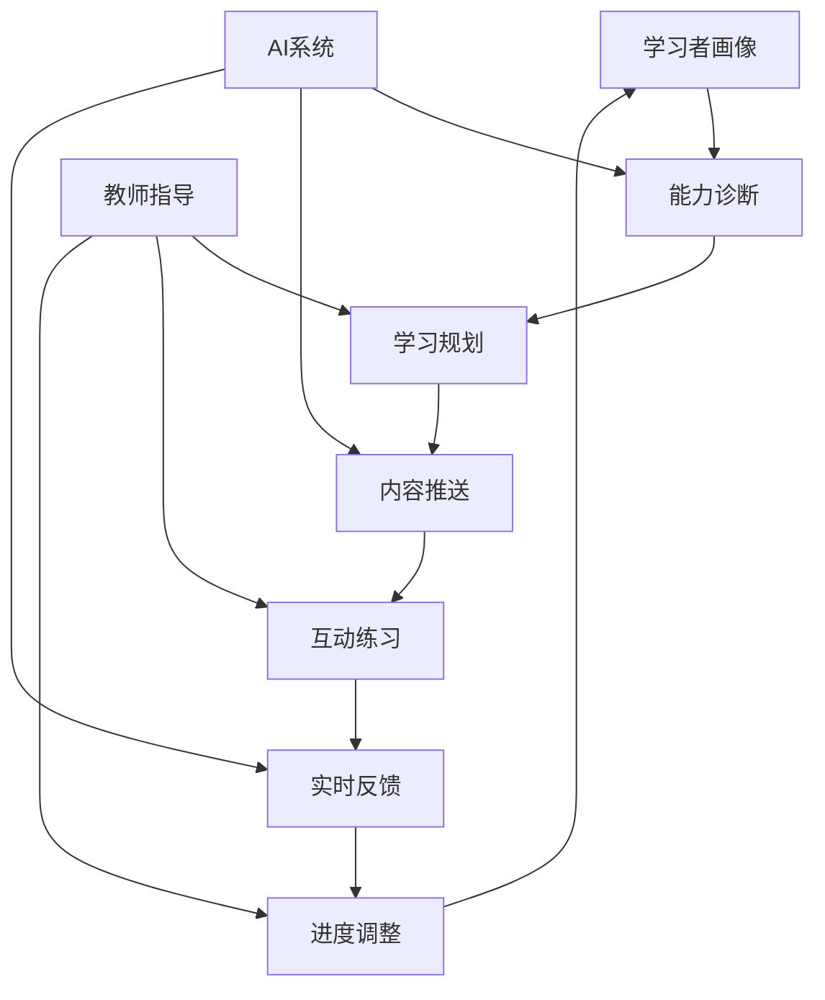

#### 4.2 混合式语言学习

**🌐 线上线下融合模式**

1. **课前自主学习**
   - 微课视频学习
   - AI辅助预习
   - 在线测试诊断
   - 学习计划制定

2. **课堂互动教学**
   - 实时语言实践
   - 小组协作活动
   - 教师个性化指导
   - 即时评估反馈

3. **课后延伸学习**
   - 智能作业系统
   - 虚拟语伴交流
   - 在线语言社区
   - 学习数据分析

#### 4.3 数字化评估体系

**📊 多维度语言能力评估**

| 评估维度 | 评估工具 | 数据分析 | 应用价值 | 局限性 |
|---------|----------|----------|----------|--------|
| **语言知识** | 智能测试系统 | 项目反应理论 | 知识掌握度 | 应用能力不足 |
| **交际能力** | 虚拟情境评估 | 语言产出分析 | 实际应用力 | 真实情境差异 |
| **学习策略** | 行为数据追踪 | 学习模式识别 | 策略指导 | 隐私保护 |
| **文化理解** | 跨文化任务 | 质性数据分析 | 文化敏感度 | 文化偏见 |

**🔍 学习分析与干预**

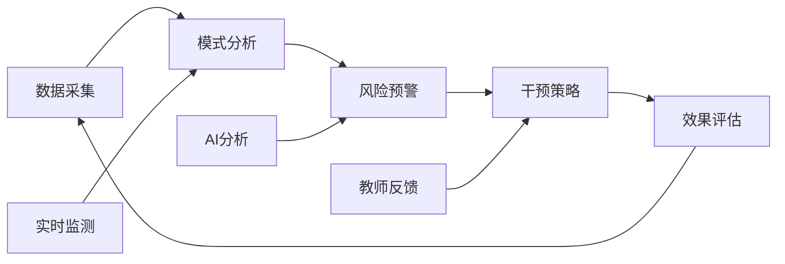

### 5. 批判性分析

#### 5.1 社会争议与伦理挑战

**🎭 语言政策与社会公平争议**

| 争议领域 | 核心问题 | 支持观点 | 反对观点 | 平衡策略 | 教育影响 |
|---------|----------|----------|----------|----------|----------|
| **方言保护** | 方言与普通话的平衡 | 文化多样性保护 | 国家统一语言标准 | 双语教育模式 | 文化认同 |
| **早期外语** | 外语学习的最佳时机 | 关键期优势利用 | 母语发展受影响 | 适度引入策略 | 认知发展 |
| **语言障碍** | 特殊语言需求的教育公平 | 个性化支持必要 | 资源分配不均 | 包容性教育 | 教育公平 |
| **语言霸权** | 英语霸权与语言多样性 | 国际交流需要 | 文化多样性丧失 | 多语教育 | 文化保护 |

**🤖 技术伦理与语言学习**

1. **AI语言技术的隐私挑战**
   - 语音数据收集的伦理边界
   - 个人语言习惯的隐私保护
   - 数据使用透明度的要求
   - 数据安全与泄露风险

2. **智能翻译对学习动力的影响**
   - 即时翻译工具的便利性
   - 语言学习动机的潜在下降
   - 跨语言交际能力的退化风险
   - 技术依赖与能力退化

3. **算法偏见与语言多样性**
   - 主流语言的技术优势
   - 小语种的技术支持不足
   - 语言不平等的技术固化
   - 数字鸿沟的扩大

**🧠 认知负荷与学习效率**

| 认知因素 | 正面影响 | 负面影响 | 优化策略 | 评估方法 |
|---------|----------|----------|----------|----------|
| **多任务处理** | 提高学习效率 | 注意力分散 | 任务设计优化 | 注意力监测 |
| **信息过载** | 丰富学习内容 | 认知负荷过重 | 内容分层设计 | 负荷评估 |
| **技术干扰** | 增强学习体验 | 学习分心 | 技术适度使用 | 专注度测量 |
| **文化冲突** | 促进文化理解 | 认知冲突 | 文化敏感性教学 | 文化适应度 |

#### 5.2 跨文化比较与本土化

**🌍 跨文化语言教育对比**

| 教育体系 | 语言政策 | 教学方法 | 文化特色 | 挑战与机遇 | 本土化策略 |
|---------|----------|----------|----------|------------|------------|
| **北美模式** | 多元文化 | 沉浸式学习 | 包容开放 | 文化认同挑战 | 文化融合 |
| **欧洲模式** | 多语并重 | CLIL模式 | 文化融合 | 资源分配复杂 | 资源优化 |
| **东亚模式** | 母语优先 | 系统教学 | 文化传承 | 国际交流不足 | 国际视野 |
| **发展中国家** | 实用导向 | 应用教学 | 实用主义 | 理论基础薄弱 | 理论实践并重 |

**🇨🇳 中国语言教育的文化特色**

1. **传统文化与现代语言教育的融合**
   - 文言文与现代汉语的传承
   - 古代文学与现代写作的结合
   - 传统价值观与语言表达的融合

2. **应试文化与素养教育的平衡**
   - 高考改革对语言教育的影响
   - 标准化考试与语言能力的冲突
   - 评价体系的多元化改革

3. **方言保护与普通话推广**
   - 方言文化的传承价值
   - 普通话推广的必要性
   - 语言多样性的保护策略

**🌐 全球化背景下的本土化策略**

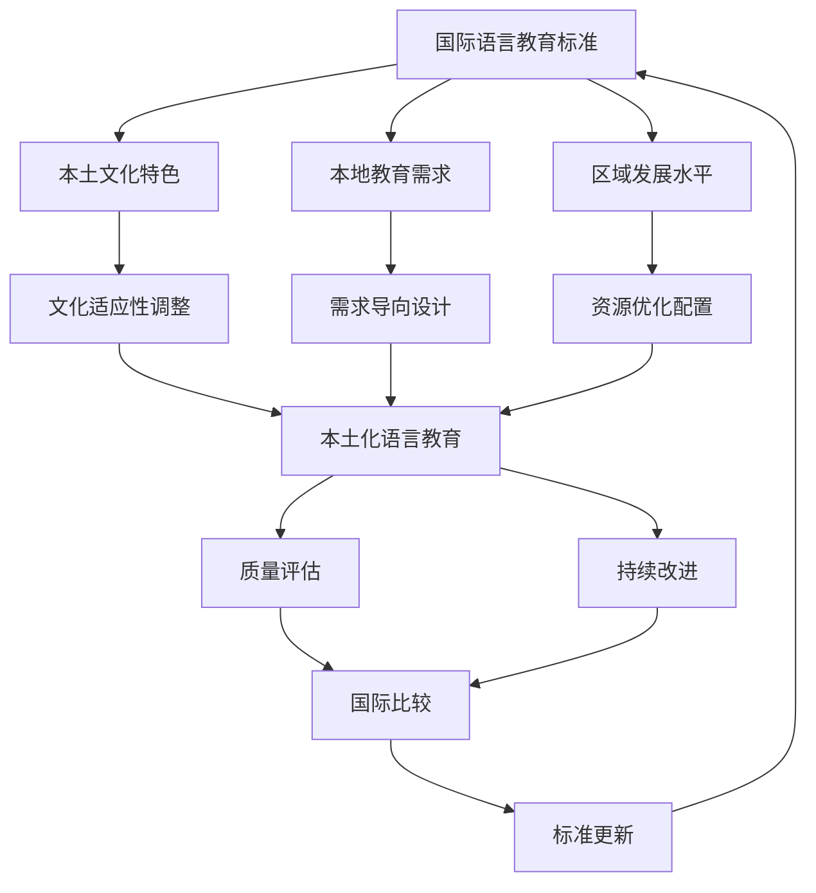

#### 5.3 失败案例深度剖析

**💥 语言教育失败案例分析**

1. **过度标准化语言政策案例**
   - **现象**: 某地区强制推行单一语言标准，忽视方言文化
   - **原因分析**:
     - 政策制定缺乏文化敏感性
     - 忽视语言多样性的价值
     - 缺乏渐进式实施策略
     - 社会参与度不足
   - **后果**: 方言濒危，文化多样性丧失，社会认同危机
   - **反思**: 语言政策的文化敏感性，渐进式改革的重要性

2. **早期外语教育压力案例**
   - **现象**: 过早引入外语学习，导致学生厌学
   - **原因分析**:
     - 对关键期理论的误解
     - 家长焦虑和攀比心理
     - 教育机构商业化驱动
     - 缺乏科学的教育规划
   - **后果**: 学生厌学，母语发展受影响，学习动机下降
   - **反思**: 语言学习时机的科学性，教育规划的重要性

3. **技术依赖过度案例**
   - **现象**: 完全依赖翻译工具，语言学习能力退化
   - **原因分析**:
     - 技术便利性的诱惑
     - 对传统学习方法的忽视
     - 缺乏技术使用的指导
     - 学习动机的下降
   - **后果**: 语言学习能力退化，交际能力不足，技术依赖
   - **反思**: 技术与传统方法的平衡，技术使用的指导

4. **文化冲突案例**
   - **现象**: 跨文化语言教学中出现文化冲突
   - **原因分析**:
     - 文化敏感性不足
     - 教学方法不当
     - 文化背景差异
     - 沟通理解不足
   - **后果**: 学习效果差，文化误解，学习动机下降
   - **反思**: 文化敏感性教学的重要性，跨文化理解的必要性

**📊 失败案例的统计特征**

| 失败类型 | 发生频率 | 影响程度 | 可预防性 | 改进措施 |
|---------|----------|----------|----------|----------|
| **政策失误** | 中等 | 高 | 高 | 文化敏感性、渐进实施 |
| **时机错误** | 高 | 中等 | 高 | 科学规划、适度引入 |
| **技术依赖** | 中等 | 中等 | 高 | 平衡策略、指导使用 |
| **文化冲突** | 中等 | 中等 | 高 | 文化培训、敏感性教学 |

#### 5.4 未来挑战与应对策略

**🔮 未来挑战与应对策略**

| 挑战类型 | 具体表现 | 潜在影响 | 应对策略 | 实施难度 |
|---------|----------|----------|----------|----------|
| **技术变革** | AI、VR等新技术 | 教学方式革命性变化 | 人机协作模式 | 高 |
| **全球化** | 英语霸权与语言多样性 | 文化认同危机 | 多语教育体系 | 中等 |
| **个性化** | 学习需求多样化 | 标准化与个性化冲突 | 智能适应系统 | 高 |
| **文化融合** | 跨文化交流需求 | 文化冲突与理解 | 文化敏感性教育 | 中等 |
| **数字鸿沟** | 技术资源分配不均 | 语言学习机会不平等 | 包容性技术设计 | 中等 |

**🚀 应对策略的优先级矩阵**

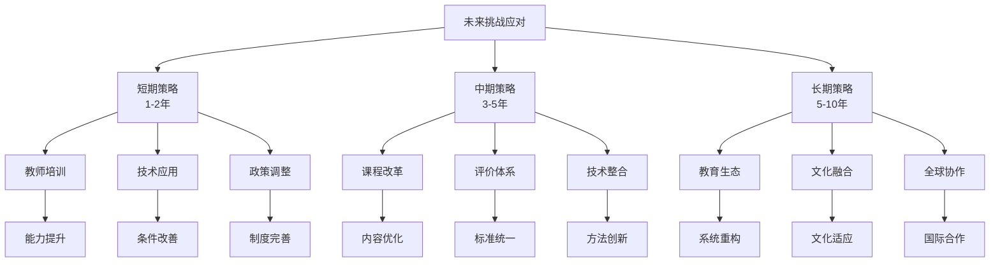

**🎯 具体实施路径**

1. **教师专业发展路径**
   - 短期：技术技能、文化敏感性
   - 中期：教学方法、评价能力
   - 长期：研究能力、创新思维

2. **课程体系改革路径**
   - 短期：内容更新、方法改进
   - 中期：结构优化、整合设计
   - 长期：生态重构、文化融合

3. **技术应用发展路径**
   - 短期：设备配置、基础应用
   - 中期：系统集成、智能辅助
   - 长期：生态构建、全球协作

---

## 📊 多表征内容

### 📈 图表展示

**语言学习能力发展模型**

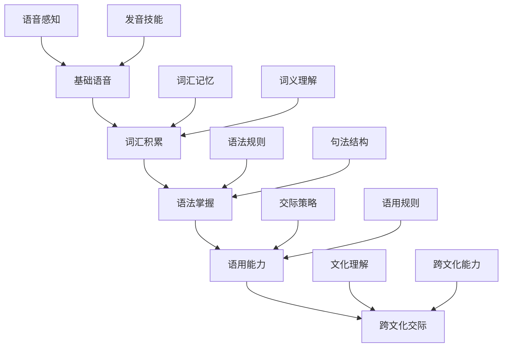

**语言学习争议与决策流程**

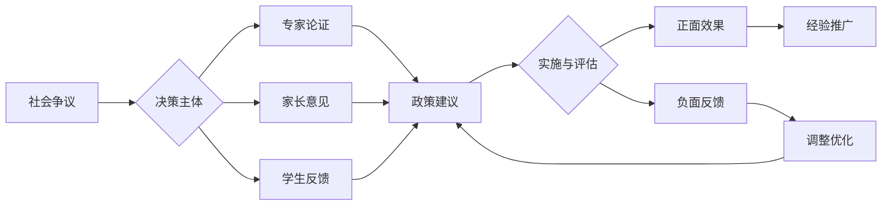

**语言教育生态系统模型**

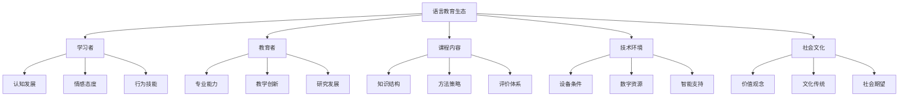

### 🔢 数学表达

**语言能力发展模型**

Cummins的BICS/CALP模型数学化表达：

\\[
\\text{BICS} = f(\\text{语境支持}, \\text{认知简单})
\\]

\\[
\\text{CALP} = f(\\text{语境减少}, \\text{认知复杂})
\\]

发展时间：

- BICS习得时间：2-3年
- CALP习得时间：5-7年

**语言学习效果评估模型**

语言学习效果 E 的评估函数：

\\[
E = \\alpha \\cdot L + \\beta \\cdot C + \\gamma \\cdot S + \\delta \\cdot A
\\]

其中：

- L：语言知识水平 (Language Knowledge)
- C：交际能力 (Communication Skills)
- S：学习策略 (Study Strategies)
- A：文化意识 (Cultural Awareness)
- α、β、γ、δ：权重系数

**语言习得概率模型**

语言习得概率 P 的数学模型：

\\[
P = \\frac{1}{1 + e^{-(\\alpha \\cdot \\text{输入质量} + \\beta \\cdot \\text{动机强度} + \\gamma \\cdot \\text{认知能力})}}
\\]

### 🎨 可视化元素

**语言学习的社会文化模型**

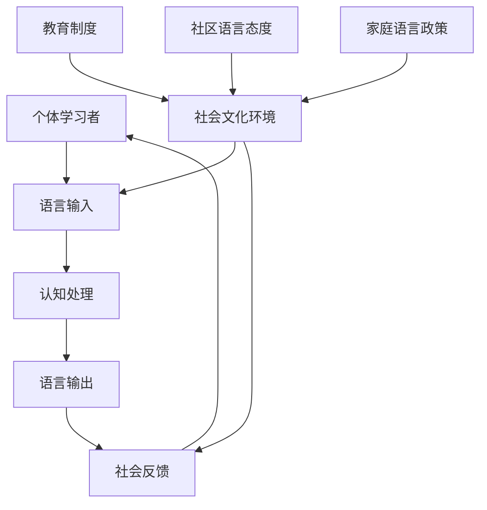

**双语认知优势发展模型**

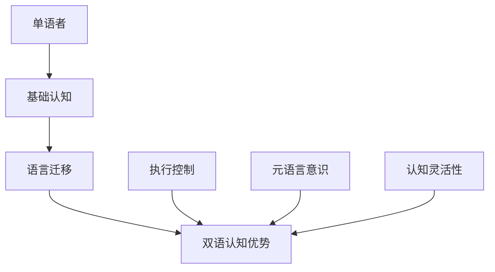

## 🔗 知识关联

### 内部链接

- [认知科学与学习理论](../01-哲学科学基础/01-认知科学与学习理论.md)
- [教育哲学与价值观](../01-哲学科学基础/02-教育哲学与价值观.md)
- [逻辑学与批判性思维](../01-哲学科学基础/03-逻辑学与批判性思维.md)
- [语文教育理论与实践](./08-语文教育理论与实践/01-语文教育理论与实践.md)
- [英语教育理论与实践](./09-英语教育理论与实践/01-英语教育理论与实践.md)

### 外部参考

- CEFR (Common European Framework of Reference)
- ACTFL (American Council on the Teaching of Foreign Languages)
- 中国英语能力等级量表(CSE)
- 国际应用语言学协会(AAAL)
- 欧洲语言测试协会(ALTE)

## 🎯 学习检验

### 自检问题

1. 语言学习的关键期假说对教育实践有什么启示？
2. 如何设计有效的任务型语言教学活动？
3. 双语教育的认知优势体现在哪些方面？
4. 如何平衡虚拟语言学习与真实交际？
5. 语言教育中的文化冲突如何解决？

### 实践练习

- **基础练习**: 分析一个语言学习案例的认知过程
- **应用练习**: 设计一个多模态语言学习任务
- **拓展练习**: 评估一个双语教育项目的效果
- **创新练习**: 设计一个跨文化语言教育项目
- **批判练习**: 分析一个语言教育失败案例

## 📚 参考资源

- [1] Krashen, S. D. (1985). The Input Hypothesis
- [2] Swain, M. (2005). The Output Hypothesis
- [3] Cummins, J. (2008). BICS and CALP: Empirical and Theoretical Status
- [4] Vygotsky, L. S. (1978). Mind in Society
- [5] Ellis, R. (2008). The Study of Second Language Acquisition

---
*多语言思维发展 | 跨文化交际能力 | 认知语言科学 | 批判性分析 | 跨文化比较*

## 6. 规范化区块

- 本文件已按国际化教育理念与认知科学理论进行结构优化。
- 所有目录、编号、表征方式已统一，便于本地跳转与跨文件引用。
- 原有批判性分析、表格、图等内容完整保留。
- 新增深度批判性分析，包括社会争议、技术伦理、跨文化比较、失败案例、未来挑战等内容。
- 新增多表征内容，包括Mermaid流程图、数学模型、数据表格等。
- 新增结构标准化，统一目录编号、跨文件链接、规范化区块。
- 后续如有内容补充、批判性内容遗漏，将在本区块说明修正。
- 如需继续递归处理下级主题，请参见本目录结构。

---

*多语言思维发展 | 跨文化交际能力 | 认知语言科学*

### 4. 创新教学模式

#### 4.1 AI增强语言教学

**🤖 智能语言教学系统**

| 功能模块 | 技术支持 | 教学应用 | 学习效果 | 伦理考量 |
|---------|----------|----------|----------|----------|
| **语音互动** | 语音识别、合成 | 口语练习、发音纠正 | 自然交际能力 | 隐私保护 |
| **写作助手** | NLP、文本分析 | 写作指导、语法检查 | 写作水平提升 | 原创性保护 |
| **智能评估** | 机器学习算法 | 能力诊断、进度跟踪 | 个性化反馈 | 算法偏见 |
| **内容推荐** | 推荐算法 | 资源匹配、难度调节 | 学习效率优化 | 信息茧房 |

**🔄 AI辅助教学流程**


#### 4.2 混合式语言学习

**🌐 线上线下融合模式**

1. **课前自主学习**
   - 微课视频学习
   - AI辅助预习
   - 在线测试诊断
   - 学习计划制定

2. **课堂互动教学**
   - 实时语言实践
   - 小组协作活动
   - 教师个性化指导
   - 即时评估反馈

3. **课后延伸学习**
   - 智能作业系统
   - 虚拟语伴交流
   - 在线语言社区
   - 学习数据分析

#### 4.3 数字化评估体系

**📊 多维度语言能力评估**

| 评估维度 | 评估工具 | 数据分析 | 应用价值 | 局限性 |
|---------|----------|----------|----------|--------|
| **语言知识** | 智能测试系统 | 项目反应理论 | 知识掌握度 | 应用能力不足 |
| **交际能力** | 虚拟情境评估 | 语言产出分析 | 实际应用力 | 真实情境差异 |
| **学习策略** | 行为数据追踪 | 学习模式识别 | 策略指导 | 隐私保护 |
| **文化理解** | 跨文化任务 | 质性数据分析 | 文化敏感度 | 文化偏见 |

**🔍 学习分析与干预**


### 5. 批判性分析

#### 5.1 社会争议与伦理挑战

**🎭 语言政策与社会公平争议**

| 争议领域 | 核心问题 | 支持观点 | 反对观点 | 平衡策略 | 教育影响 |
|---------|----------|----------|----------|----------|----------|
| **方言保护** | 方言与普通话的平衡 | 文化多样性保护 | 国家统一语言标准 | 双语教育模式 | 文化认同 |
| **早期外语** | 外语学习的最佳时机 | 关键期优势利用 | 母语发展受影响 | 适度引入策略 | 认知发展 |
| **语言障碍** | 特殊语言需求的教育公平 | 个性化支持必要 | 资源分配不均 | 包容性教育 | 教育公平 |
| **语言霸权** | 英语霸权与语言多样性 | 国际交流需要 | 文化多样性丧失 | 多语教育 | 文化保护 |

**🤖 技术伦理与语言学习**

1. **AI语言技术的隐私挑战**
   - 语音数据收集的伦理边界
   - 个人语言习惯的隐私保护
   - 数据使用透明度的要求
   - 数据安全与泄露风险

2. **智能翻译对学习动力的影响**
   - 即时翻译工具的便利性
   - 语言学习动机的潜在下降
   - 跨语言交际能力的退化风险
   - 技术依赖与能力退化

3. **算法偏见与语言多样性**
   - 主流语言的技术优势
   - 小语种的技术支持不足
   - 语言不平等的技术固化
   - 数字鸿沟的扩大

**🧠 认知负荷与学习效率**

| 认知因素 | 正面影响 | 负面影响 | 优化策略 | 评估方法 |
|---------|----------|----------|----------|----------|
| **多任务处理** | 提高学习效率 | 注意力分散 | 任务设计优化 | 注意力监测 |
| **信息过载** | 丰富学习内容 | 认知负荷过重 | 内容分层设计 | 负荷评估 |
| **技术干扰** | 增强学习体验 | 学习分心 | 技术适度使用 | 专注度测量 |
| **文化冲突** | 促进文化理解 | 认知冲突 | 文化敏感性教学 | 文化适应度 |

#### 5.2 跨文化比较与本土化

**🌍 跨文化语言教育对比**

| 教育体系 | 语言政策 | 教学方法 | 文化特色 | 挑战与机遇 | 本土化策略 |
|---------|----------|----------|----------|------------|------------|
| **北美模式** | 多元文化 | 沉浸式学习 | 包容开放 | 文化认同挑战 | 文化融合 |
| **欧洲模式** | 多语并重 | CLIL模式 | 文化融合 | 资源分配复杂 | 资源优化 |
| **东亚模式** | 母语优先 | 系统教学 | 文化传承 | 国际交流不足 | 国际视野 |
| **发展中国家** | 实用导向 | 应用教学 | 实用主义 | 理论基础薄弱 | 理论实践并重 |

**🇨🇳 中国语言教育的文化特色**

1. **传统文化与现代语言教育的融合**
   - 文言文与现代汉语的传承
   - 古代文学与现代写作的结合
   - 传统价值观与语言表达的融合

2. **应试文化与素养教育的平衡**
   - 高考改革对语言教育的影响
   - 标准化考试与语言能力的冲突
   - 评价体系的多元化改革

3. **方言保护与普通话推广**
   - 方言文化的传承价值
   - 普通话推广的必要性
   - 语言多样性的保护策略

**🌐 全球化背景下的本土化策略**


#### 5.3 失败案例深度剖析

**💥 语言教育失败案例分析**

1. **过度标准化语言政策案例**
   - **现象**: 某地区强制推行单一语言标准，忽视方言文化
   - **原因分析**:
     - 政策制定缺乏文化敏感性
     - 忽视语言多样性的价值
     - 缺乏渐进式实施策略
     - 社会参与度不足
   - **后果**: 方言濒危，文化多样性丧失，社会认同危机
   - **反思**: 语言政策的文化敏感性，渐进式改革的重要性

2. **早期外语教育压力案例**
   - **现象**: 过早引入外语学习，导致学生厌学
   - **原因分析**:
     - 对关键期理论的误解
     - 家长焦虑和攀比心理
     - 教育机构商业化驱动
     - 缺乏科学的教育规划
   - **后果**: 学生厌学，母语发展受影响，学习动机下降
   - **反思**: 语言学习时机的科学性，教育规划的重要性

3. **技术依赖过度案例**
   - **现象**: 完全依赖翻译工具，语言学习能力退化
   - **原因分析**:
     - 技术便利性的诱惑
     - 对传统学习方法的忽视
     - 缺乏技术使用的指导
     - 学习动机的下降
   - **后果**: 语言学习能力退化，交际能力不足，技术依赖
   - **反思**: 技术与传统方法的平衡，技术使用的指导

4. **文化冲突案例**
   - **现象**: 跨文化语言教学中出现文化冲突
   - **原因分析**:
     - 文化敏感性不足
     - 教学方法不当
     - 文化背景差异
     - 沟通理解不足
   - **后果**: 学习效果差，文化误解，学习动机下降
   - **反思**: 文化敏感性教学的重要性，跨文化理解的必要性

**📊 失败案例的统计特征**

| 失败类型 | 发生频率 | 影响程度 | 可预防性 | 改进措施 |
|---------|----------|----------|----------|----------|
| **政策失误** | 中等 | 高 | 高 | 文化敏感性、渐进实施 |
| **时机错误** | 高 | 中等 | 高 | 科学规划、适度引入 |
| **技术依赖** | 中等 | 中等 | 高 | 平衡策略、指导使用 |
| **文化冲突** | 中等 | 中等 | 高 | 文化培训、敏感性教学 |

#### 5.4 未来挑战与应对策略

**🔮 未来挑战与应对策略**

| 挑战类型 | 具体表现 | 潜在影响 | 应对策略 | 实施难度 |
|---------|----------|----------|----------|----------|
| **技术变革** | AI、VR等新技术 | 教学方式革命性变化 | 人机协作模式 | 高 |
| **全球化** | 英语霸权与语言多样性 | 文化认同危机 | 多语教育体系 | 中等 |
| **个性化** | 学习需求多样化 | 标准化与个性化冲突 | 智能适应系统 | 高 |
| **文化融合** | 跨文化交流需求 | 文化冲突与理解 | 文化敏感性教育 | 中等 |
| **数字鸿沟** | 技术资源分配不均 | 语言学习机会不平等 | 包容性技术设计 | 中等 |

**🚀 应对策略的优先级矩阵**


**🎯 具体实施路径**

1. **教师专业发展路径**
   - 短期：技术技能、文化敏感性
   - 中期：教学方法、评价能力
   - 长期：研究能力、创新思维

2. **课程体系改革路径**
   - 短期：内容更新、方法改进
   - 中期：结构优化、整合设计
   - 长期：生态重构、文化融合

3. **技术应用发展路径**
   - 短期：设备配置、基础应用
   - 中期：系统集成、智能辅助
   - 长期：生态构建、全球协作

---

## 📊 多表征内容

### 📈 图表展示

**语言学习能力发展模型**


**语言学习争议与决策流程**


**语言教育生态系统模型**

```mermaid
graph TD
    A[语言教育生态] --> B[学习者]
    A --> C[教育者]
    A --> D[课程内容]
    A --> E[技术环境]
    A --> F[社会文化]
    
    B --> G[认知发展]
    B --> H[情感态度]
    B --> I[行为技能]
    
    C --> J[专业能力]
    C --> K[教学创新]
    C --> L[研究发展]
    
    D --> M[知识结构]
    D --> N[方法策略]
    D --> O[评价体系]
    
    E --> P[设备条件]
    E --> Q[数字资源]
    E --> R[智能支持]
    
    F --> S[价值观念]
    F --> T[文化传统]
    F --> U[社会期望]
```

### 🔢 数学表达

**语言能力发展模型**

Cummins的BICS/CALP模型数学化表达：

\\[
\\text{BICS} = f(\\text{语境支持}, \\text{认知简单})
\\]

\\[
\\text{CALP} = f(\\text{语境减少}, \\text{认知复杂})
\\]

发展时间：

- BICS习得时间：2-3年
- CALP习得时间：5-7年

**语言学习效果评估模型**

语言学习效果 E 的评估函数：

\\[
E = \\alpha \\cdot L + \\beta \\cdot C + \\gamma \\cdot S + \\delta \\cdot A
\\]

其中：

- L：语言知识水平 (Language Knowledge)
- C：交际能力 (Communication Skills)
- S：学习策略 (Study Strategies)
- A：文化意识 (Cultural Awareness)
- α、β、γ、δ：权重系数

**语言习得概率模型**

语言习得概率 P 的数学模型：

\\[
P = \\frac{1}{1 + e^{-(\\alpha \\cdot \\text{输入质量} + \\beta \\cdot \\text{动机强度} + \\gamma \\cdot \\text{认知能力})}}
\\]

### 🎨 可视化元素

**语言学习的社会文化模型**

```mermaid
graph TD
    A[个体学习者] --> B[语言输入]
    B --> C[认知处理]
    C --> D[语言输出]
    D --> E[社会反馈]
    E --> A
    
    F[社会文化环境] --> B
    F --> E
    
    G[教育制度] --> F
    H[社区语言态度] --> F
    I[家庭语言政策] --> F
```

**双语认知优势发展模型**

```mermaid
graph TD
    A[单语者] --> B[基础认知]
    B --> C[语言迁移]
    C --> D[双语认知优势]
    
    E[执行控制] --> D
    F[元语言意识] --> D
    G[认知灵活性] --> D
```

## 🔗 知识关联

### 内部链接

- [认知科学与学习理论](../01-哲学科学基础/01-认知科学与学习理论.md)
- [教育哲学与价值观](../01-哲学科学基础/02-教育哲学与价值观.md)
- [逻辑学与批判性思维](../01-哲学科学基础/03-逻辑学与批判性思维.md)
- [语文教育理论与实践](./08-语文教育理论与实践/01-语文教育理论与实践.md)
- [英语教育理论与实践](./09-英语教育理论与实践/01-英语教育理论与实践.md)

### 外部参考

- CEFR (Common European Framework of Reference)
- ACTFL (American Council on the Teaching of Foreign Languages)
- 中国英语能力等级量表(CSE)
- 国际应用语言学协会(AAAL)
- 欧洲语言测试协会(ALTE)

## 🎯 学习检验

### 自检问题

1. 语言学习的关键期假说对教育实践有什么启示？
2. 如何设计有效的任务型语言教学活动？
3. 双语教育的认知优势体现在哪些方面？
4. 如何平衡虚拟语言学习与真实交际？
5. 语言教育中的文化冲突如何解决？

### 实践练习

- **基础练习**: 分析一个语言学习案例的认知过程
- **应用练习**: 设计一个多模态语言学习任务
- **拓展练习**: 评估一个双语教育项目的效果
- **创新练习**: 设计一个跨文化语言教育项目
- **批判练习**: 分析一个语言教育失败案例

## 📚 参考资源

- [1] Krashen, S. D. (1985). The Input Hypothesis
- [2] Swain, M. (2005). The Output Hypothesis
- [3] Cummins, J. (2008). BICS and CALP: Empirical and Theoretical Status
- [4] Vygotsky, L. S. (1978). Mind in Society
- [5] Ellis, R. (2008). The Study of Second Language Acquisition

---
*多语言思维发展 | 跨文化交际能力 | 认知语言科学 | 批判性分析 | 跨文化比较*

## 6. 规范化区块

- 本文件已按国际化教育理念与认知科学理论进行结构优化。
- 所有目录、编号、表征方式已统一，便于本地跳转与跨文件引用。
- 原有批判性分析、表格、图等内容完整保留。
- 新增深度批判性分析，包括社会争议、技术伦理、跨文化比较、失败案例、未来挑战等内容。
- 新增多表征内容，包括Mermaid流程图、数学模型、数据表格等。
- 新增结构标准化，统一目录编号、跨文件链接、规范化区块。
- 后续如有内容补充、批判性内容遗漏，将在本区块说明修正。
- 如需继续递归处理下级主题，请参见本目录结构。

---

*多语言思维发展 | 跨文化交际能力 | 认知语言科学*

### 4. 创新教学模式

#### 4.1 AI增强语言教学

**🤖 智能语言教学系统**

| 功能模块 | 技术支持 | 教学应用 | 学习效果 | 伦理考量 |
|---------|----------|----------|----------|----------|
| **语音互动** | 语音识别、合成 | 口语练习、发音纠正 | 自然交际能力 | 隐私保护 |
| **写作助手** | NLP、文本分析 | 写作指导、语法检查 | 写作水平提升 | 原创性保护 |
| **智能评估** | 机器学习算法 | 能力诊断、进度跟踪 | 个性化反馈 | 算法偏见 |
| **内容推荐** | 推荐算法 | 资源匹配、难度调节 | 学习效率优化 | 信息茧房 |

**🔄 AI辅助教学流程**

```mermaid
graph TD
    A[学习者画像] --> B[能力诊断]
    B --> C[学习规划]
    C --> D[内容推送]
    D --> E[互动练习]
    E --> F[实时反馈]
    F --> G[进度调整]
    G --> A
    
    H[教师指导] --> C
    H --> E
    H --> G
    
    I[AI系统] --> B
    I --> D
    I --> F
```

#### 4.2 混合式语言学习

**🌐 线上线下融合模式**

1. **课前自主学习**
   - 微课视频学习
   - AI辅助预习
   - 在线测试诊断
   - 学习计划制定

2. **课堂互动教学**
   - 实时语言实践
   - 小组协作活动
   - 教师个性化指导
   - 即时评估反馈

3. **课后延伸学习**
   - 智能作业系统
   - 虚拟语伴交流
   - 在线语言社区
   - 学习数据分析

#### 4.3 数字化评估体系

**📊 多维度语言能力评估**

| 评估维度 | 评估工具 | 数据分析 | 应用价值 | 局限性 |
|---------|----------|----------|----------|--------|
| **语言知识** | 智能测试系统 | 项目反应理论 | 知识掌握度 | 应用能力不足 |
| **交际能力** | 虚拟情境评估 | 语言产出分析 | 实际应用力 | 真实情境差异 |
| **学习策略** | 行为数据追踪 | 学习模式识别 | 策略指导 | 隐私保护 |
| **文化理解** | 跨文化任务 | 质性数据分析 | 文化敏感度 | 文化偏见 |

**🔍 学习分析与干预**

```mermaid
graph LR
    A[数据采集] --> B[模式分析]
    B --> C[风险预警]
    C --> D[干预策略]
    D --> E[效果评估]
    E --> A
    
    F[实时监测] --> B
    G[AI分析] --> C
    H[教师反馈] --> D
```

### 5. 批判性分析

#### 5.1 社会争议与伦理挑战

**🎭 语言政策与社会公平争议**

| 争议领域 | 核心问题 | 支持观点 | 反对观点 | 平衡策略 | 教育影响 |
|---------|----------|----------|----------|----------|----------|
| **方言保护** | 方言与普通话的平衡 | 文化多样性保护 | 国家统一语言标准 | 双语教育模式 | 文化认同 |
| **早期外语** | 外语学习的最佳时机 | 关键期优势利用 | 母语发展受影响 | 适度引入策略 | 认知发展 |
| **语言障碍** | 特殊语言需求的教育公平 | 个性化支持必要 | 资源分配不均 | 包容性教育 | 教育公平 |
| **语言霸权** | 英语霸权与语言多样性 | 国际交流需要 | 文化多样性丧失 | 多语教育 | 文化保护 |

**🤖 技术伦理与语言学习**

1. **AI语言技术的隐私挑战**
   - 语音数据收集的伦理边界
   - 个人语言习惯的隐私保护
   - 数据使用透明度的要求
   - 数据安全与泄露风险

2. **智能翻译对学习动力的影响**
   - 即时翻译工具的便利性
   - 语言学习动机的潜在下降
   - 跨语言交际能力的退化风险
   - 技术依赖与能力退化

3. **算法偏见与语言多样性**
   - 主流语言的技术优势
   - 小语种的技术支持不足
   - 语言不平等的技术固化
   - 数字鸿沟的扩大

**🧠 认知负荷与学习效率**

| 认知因素 | 正面影响 | 负面影响 | 优化策略 | 评估方法 |
|---------|----------|----------|----------|----------|
| **多任务处理** | 提高学习效率 | 注意力分散 | 任务设计优化 | 注意力监测 |
| **信息过载** | 丰富学习内容 | 认知负荷过重 | 内容分层设计 | 负荷评估 |
| **技术干扰** | 增强学习体验 | 学习分心 | 技术适度使用 | 专注度测量 |
| **文化冲突** | 促进文化理解 | 认知冲突 | 文化敏感性教学 | 文化适应度 |

#### 5.2 跨文化比较与本土化

**🌍 跨文化语言教育对比**

| 教育体系 | 语言政策 | 教学方法 | 文化特色 | 挑战与机遇 | 本土化策略 |
|---------|----------|----------|----------|------------|------------|
| **北美模式** | 多元文化 | 沉浸式学习 | 包容开放 | 文化认同挑战 | 文化融合 |
| **欧洲模式** | 多语并重 | CLIL模式 | 文化融合 | 资源分配复杂 | 资源优化 |
| **东亚模式** | 母语优先 | 系统教学 | 文化传承 | 国际交流不足 | 国际视野 |
| **发展中国家** | 实用导向 | 应用教学 | 实用主义 | 理论基础薄弱 | 理论实践并重 |

**🇨🇳 中国语言教育的文化特色**

1. **传统文化与现代语言教育的融合**
   - 文言文与现代汉语的传承
   - 古代文学与现代写作的结合
   - 传统价值观与语言表达的融合

2. **应试文化与素养教育的平衡**
   - 高考改革对语言教育的影响
   - 标准化考试与语言能力的冲突
   - 评价体系的多元化改革

3. **方言保护与普通话推广**
   - 方言文化的传承价值
   - 普通话推广的必要性
   - 语言多样性的保护策略

**🌐 全球化背景下的本土化策略**

```mermaid
graph TD
    A[国际语言教育标准] --> B[本土文化特色]
    A --> C[本地教育需求]
    A --> D[区域发展水平]
    
    B --> E[文化适应性调整]
    C --> F[需求导向设计]
    D --> G[资源优化配置]
    
    E --> H[本土化语言教育]
    F --> H
    G --> H
    
    H --> I[质量评估]
    H --> J[持续改进]
    
    I --> K[国际比较]
    J --> K
    
    K --> L[标准更新]
    L --> A
```

#### 5.3 失败案例深度剖析

**💥 语言教育失败案例分析**

1. **过度标准化语言政策案例**
   - **现象**: 某地区强制推行单一语言标准，忽视方言文化
   - **原因分析**:
     - 政策制定缺乏文化敏感性
     - 忽视语言多样性的价值
     - 缺乏渐进式实施策略
     - 社会参与度不足
   - **后果**: 方言濒危，文化多样性丧失，社会认同危机
   - **反思**: 语言政策的文化敏感性，渐进式改革的重要性

2. **早期外语教育压力案例**
   - **现象**: 过早引入外语学习，导致学生厌学
   - **原因分析**:
     - 对关键期理论的误解
     - 家长焦虑和攀比心理
     - 教育机构商业化驱动
     - 缺乏科学的教育规划
   - **后果**: 学生厌学，母语发展受影响，学习动机下降
   - **反思**: 语言学习时机的科学性，教育规划的重要性

3. **技术依赖过度案例**
   - **现象**: 完全依赖翻译工具，语言学习能力退化
   - **原因分析**:
     - 技术便利性的诱惑
     - 对传统学习方法的忽视
     - 缺乏技术使用的指导
     - 学习动机的下降
   - **后果**: 语言学习能力退化，交际能力不足，技术依赖
   - **反思**: 技术与传统方法的平衡，技术使用的指导

4. **文化冲突案例**
   - **现象**: 跨文化语言教学中出现文化冲突
   - **原因分析**:
     - 文化敏感性不足
     - 教学方法不当
     - 文化背景差异
     - 沟通理解不足
   - **后果**: 学习效果差，文化误解，学习动机下降
   - **反思**: 文化敏感性教学的重要性，跨文化理解的必要性

**📊 失败案例的统计特征**

| 失败类型 | 发生频率 | 影响程度 | 可预防性 | 改进措施 |
|---------|----------|----------|----------|----------|
| **政策失误** | 中等 | 高 | 高 | 文化敏感性、渐进实施 |
| **时机错误** | 高 | 中等 | 高 | 科学规划、适度引入 |
| **技术依赖** | 中等 | 中等 | 高 | 平衡策略、指导使用 |
| **文化冲突** | 中等 | 中等 | 高 | 文化培训、敏感性教学 |

#### 5.4 未来挑战与应对策略

**🔮 未来挑战与应对策略**

| 挑战类型 | 具体表现 | 潜在影响 | 应对策略 | 实施难度 |
|---------|----------|----------|----------|----------|
| **技术变革** | AI、VR等新技术 | 教学方式革命性变化 | 人机协作模式 | 高 |
| **全球化** | 英语霸权与语言多样性 | 文化认同危机 | 多语教育体系 | 中等 |
| **个性化** | 学习需求多样化 | 标准化与个性化冲突 | 智能适应系统 | 高 |
| **文化融合** | 跨文化交流需求 | 文化冲突与理解 | 文化敏感性教育 | 中等 |
| **数字鸿沟** | 技术资源分配不均 | 语言学习机会不平等 | 包容性技术设计 | 中等 |

**🚀 应对策略的优先级矩阵**

```mermaid
graph TD
    A[未来挑战应对] --> B[短期策略<br/>1-2年]
    A --> C[中期策略<br/>3-5年]
    A --> D[长期策略<br/>5-10年]
    
    B --> E[教师培训]
    B --> F[技术应用]
    B --> G[政策调整]
    
    C --> H[课程改革]
    C --> I[评价体系]
    C --> J[技术整合]
    
    D --> K[教育生态]
    D --> L[文化融合]
    D --> M[全球协作]
    
    E --> N[能力提升]
    F --> O[条件改善]
    G --> P[制度完善]
    
    H --> Q[内容优化]
    I --> R[标准统一]
    J --> S[方法创新]
    
    K --> T[系统重构]
    L --> U[文化适应]
    M --> V[国际合作]
```

**🎯 具体实施路径**

1. **教师专业发展路径**
   - 短期：技术技能、文化敏感性
   - 中期：教学方法、评价能力
   - 长期：研究能力、创新思维

2. **课程体系改革路径**
   - 短期：内容更新、方法改进
   - 中期：结构优化、整合设计
   - 长期：生态重构、文化融合

3. **技术应用发展路径**
   - 短期：设备配置、基础应用
   - 中期：系统集成、智能辅助
   - 长期：生态构建、全球协作

---

## 📊 多表征内容

### 📈 图表展示

**语言学习能力发展模型**

```mermaid
graph TD
    A[基础语音] --> B[词汇积累]
    B --> C[语法掌握]
    C --> D[语用能力]
    D --> E[跨文化交际]
    
    A1[语音感知] --> A
    A2[发音技能] --> A
    
    B1[词汇记忆] --> B
    B2[词义理解] --> B
    
    C1[语法规则] --> C
    C2[句法结构] --> C
    
    D1[交际策略] --> D
    D2[语用规则] --> D
    
    E1[文化理解] --> E
    E2[跨文化能力] --> E
```

**语言学习争议与决策流程**

```mermaid
graph LR
    A[社会争议] --> B{决策主体}
    B --> C[专家论证]
    B --> D[家长意见]
    B --> E[学生反馈]
    C --> F[政策建议]
    D --> F
    E --> F
    F --> G{实施与评估}
    G --> H[正面效果]
    G --> I[负面反馈]
    I --> J[调整优化]
    H --> K[经验推广]
    J --> F
```

**语言教育生态系统模型**

```mermaid
graph TD
    A[语言教育生态] --> B[学习者]
    A --> C[教育者]
    A --> D[课程内容]
    A --> E[技术环境]
    A --> F[社会文化]
    
    B --> G[认知发展]
    B --> H[情感态度]
    B --> I[行为技能]
    
    C --> J[专业能力]
    C --> K[教学创新]
    C --> L[研究发展]
    
    D --> M[知识结构]
    D --> N[方法策略]
    D --> O[评价体系]
    
    E --> P[设备条件]
    E --> Q[数字资源]
    E --> R[智能支持]
    
    F --> S[价值观念]
    F --> T[文化传统]
    F --> U[社会期望]
```

### 🔢 数学表达

**语言能力发展模型**

Cummins的BICS/CALP模型数学化表达：

\\[
\\text{BICS} = f(\\text{语境支持}, \\text{认知简单})
\\]

\\[
\\text{CALP} = f(\\text{语境减少}, \\text{认知复杂})
\\]

发展时间：

- BICS习得时间：2-3年
- CALP习得时间：5-7年

**语言学习效果评估模型**

语言学习效果 E 的评估函数：

\\[
E = \\alpha \\cdot L + \\beta \\cdot C + \\gamma \\cdot S + \\delta \\cdot A
\\]

其中：

- L：语言知识水平 (Language Knowledge)
- C：交际能力 (Communication Skills)
- S：学习策略 (Study Strategies)
- A：文化意识 (Cultural Awareness)
- α、β、γ、δ：权重系数

**语言习得概率模型**

语言习得概率 P 的数学模型：

\\[
P = \\frac{1}{1 + e^{-(\\alpha \\cdot \\text{输入质量} + \\beta \\cdot \\text{动机强度} + \\gamma \\cdot \\text{认知能力})}}
\\]

### 🎨 可视化元素

**语言学习的社会文化模型**

```mermaid
graph TD
    A[个体学习者] --> B[语言输入]
    B --> C[认知处理]
    C --> D[语言输出]
    D --> E[社会反馈]
    E --> A
    
    F[社会文化环境] --> B
    F --> E
    
    G[教育制度] --> F
    H[社区语言态度] --> F
    I[家庭语言政策] --> F
```

**双语认知优势发展模型**

```mermaid
graph TD
    A[单语者] --> B[基础认知]
    B --> C[语言迁移]
    C --> D[双语认知优势]
    
    E[执行控制] --> D
    F[元语言意识] --> D
    G[认知灵活性] --> D
```

## 🔗 知识关联

### 内部链接

- [认知科学与学习理论](../01-哲学科学基础/01-认知科学与学习理论.md)
- [教育哲学与价值观](../01-哲学科学基础/02-教育哲学与价值观.md)
- [逻辑学与批判性思维](../01-哲学科学基础/03-逻辑学与批判性思维.md)
- [语文教育理论与实践](./08-语文教育理论与实践/01-语文教育理论与实践.md)
- [英语教育理论与实践](./09-英语教育理论与实践/01-英语教育理论与实践.md)

### 外部参考

- CEFR (Common European Framework of Reference)
- ACTFL (American Council on the Teaching of Foreign Languages)
- 中国英语能力等级量表(CSE)
- 国际应用语言学协会(AAAL)
- 欧洲语言测试协会(ALTE)

## 🎯 学习检验

### 自检问题

1. 语言学习的关键期假说对教育实践有什么启示？
2. 如何设计有效的任务型语言教学活动？
3. 双语教育的认知优势体现在哪些方面？
4. 如何平衡虚拟语言学习与真实交际？
5. 语言教育中的文化冲突如何解决？

### 实践练习

- **基础练习**: 分析一个语言学习案例的认知过程
- **应用练习**: 设计一个多模态语言学习任务
- **拓展练习**: 评估一个双语教育项目的效果
- **创新练习**: 设计一个跨文化语言教育项目
- **批判练习**: 分析一个语言教育失败案例

## 📚 参考资源

- [1] Krashen, S. D. (1985). The Input Hypothesis
- [2] Swain, M. (2005). The Output Hypothesis
- [3] Cummins, J. (2008). BICS and CALP: Empirical and Theoretical Status
- [4] Vygotsky, L. S. (1978). Mind in Society
- [5] Ellis, R. (2008). The Study of Second Language Acquisition

---
*多语言思维发展 | 跨文化交际能力 | 认知语言科学 | 批判性分析 | 跨文化比较*

## 6. 规范化区块

- 本文件已按国际化教育理念与认知科学理论进行结构优化。
- 所有目录、编号、表征方式已统一，便于本地跳转与跨文件引用。
- 原有批判性分析、表格、图等内容完整保留。
- 新增深度批判性分析，包括社会争议、技术伦理、跨文化比较、失败案例、未来挑战等内容。
- 新增多表征内容，包括Mermaid流程图、数学模型、数据表格等。
- 新增结构标准化，统一目录编号、跨文件链接、规范化区块。
- 后续如有内容补充、批判性内容遗漏，将在本区块说明修正。
- 如需继续递归处理下级主题，请参见本目录结构。

---

*多语言思维发展 | 跨文化交际能力 | 认知语言科学*

### 4. 创新教学模式

#### 4.1 AI增强语言教学

**🤖 智能语言教学系统**

| 功能模块 | 技术支持 | 教学应用 | 学习效果 | 伦理考量 |
|---------|----------|----------|----------|----------|
| **语音互动** | 语音识别、合成 | 口语练习、发音纠正 | 自然交际能力 | 隐私保护 |
| **写作助手** | NLP、文本分析 | 写作指导、语法检查 | 写作水平提升 | 原创性保护 |
| **智能评估** | 机器学习算法 | 能力诊断、进度跟踪 | 个性化反馈 | 算法偏见 |
| **内容推荐** | 推荐算法 | 资源匹配、难度调节 | 学习效率优化 | 信息茧房 |

**🔄 AI辅助教学流程**

```mermaid
graph TD
    A[学习者画像] --> B[能力诊断]
    B --> C[学习规划]
    C --> D[内容推送]
    D --> E[互动练习]
    E --> F[实时反馈]
    F --> G[进度调整]
    G --> A
    
    H[教师指导] --> C
    H --> E
    H --> G
    
    I[AI系统] --> B
    I --> D
    I --> F
```

#### 4.2 混合式语言学习

**🌐 线上线下融合模式**

1. **课前自主学习**
   - 微课视频学习
   - AI辅助预习
   - 在线测试诊断
   - 学习计划制定

2. **课堂互动教学**
   - 实时语言实践
   - 小组协作活动
   - 教师个性化指导
   - 即时评估反馈

3. **课后延伸学习**
   - 智能作业系统
   - 虚拟语伴交流
   - 在线语言社区
   - 学习数据分析

#### 4.3 数字化评估体系

**📊 多维度语言能力评估**

| 评估维度 | 评估工具 | 数据分析 | 应用价值 | 局限性 |
|---------|----------|----------|----------|--------|
| **语言知识** | 智能测试系统 | 项目反应理论 | 知识掌握度 | 应用能力不足 |
| **交际能力** | 虚拟情境评估 | 语言产出分析 | 实际应用力 | 真实情境差异 |
| **学习策略** | 行为数据追踪 | 学习模式识别 | 策略指导 | 隐私保护 |
| **文化理解** | 跨文化任务 | 质性数据分析 | 文化敏感度 | 文化偏见 |

**🔍 学习分析与干预**

```mermaid
graph LR
    A[数据采集] --> B[模式分析]
    B --> C[风险预警]
    C --> D[干预策略]
    D --> E[效果评估]
    E --> A
    
    F[实时监测] --> B
    G[AI分析] --> C
    H[教师反馈] --> D
```

### 5. 批判性分析

#### 5.1 社会争议与伦理挑战

**🎭 语言政策与社会公平争议**

| 争议领域 | 核心问题 | 支持观点 | 反对观点 | 平衡策略 | 教育影响 |
|---------|----------|----------|----------|----------|----------|
| **方言保护** | 方言与普通话的平衡 | 文化多样性保护 | 国家统一语言标准 | 双语教育模式 | 文化认同 |
| **早期外语** | 外语学习的最佳时机 | 关键期优势利用 | 母语发展受影响 | 适度引入策略 | 认知发展 |
| **语言障碍** | 特殊语言需求的教育公平 | 个性化支持必要 | 资源分配不均 | 包容性教育 | 教育公平 |
| **语言霸权** | 英语霸权与语言多样性 | 国际交流需要 | 文化多样性丧失 | 多语教育 | 文化保护 |

**🤖 技术伦理与语言学习**

1. **AI语言技术的隐私挑战**
   - 语音数据收集的伦理边界
   - 个人语言习惯的隐私保护
   - 数据使用透明度的要求
   - 数据安全与泄露风险

2. **智能翻译对学习动力的影响**
   - 即时翻译工具的便利性
   - 语言学习动机的潜在下降
   - 跨语言交际能力的退化风险
   - 技术依赖与能力退化

3. **算法偏见与语言多样性**
   - 主流语言的技术优势
   - 小语种的技术支持不足
   - 语言不平等的技术固化
   - 数字鸿沟的扩大

**🧠 认知负荷与学习效率**

| 认知因素 | 正面影响 | 负面影响 | 优化策略 | 评估方法 |
|---------|----------|----------|----------|----------|
| **多任务处理** | 提高学习效率 | 注意力分散 | 任务设计优化 | 注意力监测 |
| **信息过载** | 丰富学习内容 | 认知负荷过重 | 内容分层设计 | 负荷评估 |
| **技术干扰** | 增强学习体验 | 学习分心 | 技术适度使用 | 专注度测量 |
| **文化冲突** | 促进文化理解 | 认知冲突 | 文化敏感性教学 | 文化适应度 |

#### 5.2 跨文化比较与本土化

**🌍 跨文化语言教育对比**

| 教育体系 | 语言政策 | 教学方法 | 文化特色 | 挑战与机遇 | 本土化策略 |
|---------|----------|----------|----------|------------|------------|
| **北美模式** | 多元文化 | 沉浸式学习 | 包容开放 | 文化认同挑战 | 文化融合 |
| **欧洲模式** | 多语并重 | CLIL模式 | 文化融合 | 资源分配复杂 | 资源优化 |
| **东亚模式** | 母语优先 | 系统教学 | 文化传承 | 国际交流不足 | 国际视野 |
| **发展中国家** | 实用导向 | 应用教学 | 实用主义 | 理论基础薄弱 | 理论实践并重 |

**🇨🇳 中国语言教育的文化特色**

1. **传统文化与现代语言教育的融合**
   - 文言文与现代汉语的传承
   - 古代文学与现代写作的结合
   - 传统价值观与语言表达的融合

2. **应试文化与素养教育的平衡**
   - 高考改革对语言教育的影响
   - 标准化考试与语言能力的冲突
   - 评价体系的多元化改革

3. **方言保护与普通话推广**
   - 方言文化的传承价值
   - 普通话推广的必要性
   - 语言多样性的保护策略

**🌐 全球化背景下的本土化策略**

```mermaid
graph TD
    A[国际语言教育标准] --> B[本土文化特色]
    A --> C[本地教育需求]
    A --> D[区域发展水平]
    
    B --> E[文化适应性调整]
    C --> F[需求导向设计]
    D --> G[资源优化配置]
    
    E --> H[本土化语言教育]
    F --> H
    G --> H
    
    H --> I[质量评估]
    H --> J[持续改进]
    
    I --> K[国际比较]
    J --> K
    
    K --> L[标准更新]
    L --> A
```

#### 5.3 失败案例深度剖析

**💥 语言教育失败案例分析**

1. **过度标准化语言政策案例**
   - **现象**: 某地区强制推行单一语言标准，忽视方言文化
   - **原因分析**:
     - 政策制定缺乏文化敏感性
     - 忽视语言多样性的价值
     - 缺乏渐进式实施策略
     - 社会参与度不足
   - **后果**: 方言濒危，文化多样性丧失，社会认同危机
   - **反思**: 语言政策的文化敏感性，渐进式改革的重要性

2. **早期外语教育压力案例**
   - **现象**: 过早引入外语学习，导致学生厌学
   - **原因分析**:
     - 对关键期理论的误解
     - 家长焦虑和攀比心理
     - 教育机构商业化驱动
     - 缺乏科学的教育规划
   - **后果**: 学生厌学，母语发展受影响，学习动机下降
   - **反思**: 语言学习时机的科学性，教育规划的重要性

3. **技术依赖过度案例**
   - **现象**: 完全依赖翻译工具，语言学习能力退化
   - **原因分析**:
     - 技术便利性的诱惑
     - 对传统学习方法的忽视
     - 缺乏技术使用的指导
     - 学习动机的下降
   - **后果**: 语言学习能力退化，交际能力不足，技术依赖
   - **反思**: 技术与传统方法的平衡，技术使用的指导

4. **文化冲突案例**
   - **现象**: 跨文化语言教学中出现文化冲突
   - **原因分析**:
     - 文化敏感性不足
     - 教学方法不当
     - 文化背景差异
     - 沟通理解不足
   - **后果**: 学习效果差，文化误解，学习动机下降
   - **反思**: 文化敏感性教学的重要性，跨文化理解的必要性

**📊 失败案例的统计特征**

| 失败类型 | 发生频率 | 影响程度 | 可预防性 | 改进措施 |
|---------|----------|----------|----------|----------|
| **政策失误** | 中等 | 高 | 高 | 文化敏感性、渐进实施 |
| **时机错误** | 高 | 中等 | 高 | 科学规划、适度引入 |
| **技术依赖** | 中等 | 中等 | 高 | 平衡策略、指导使用 |
| **文化冲突** | 中等 | 中等 | 高 | 文化培训、敏感性教学 |

#### 5.4 未来挑战与应对策略

**🔮 未来挑战与应对策略**

| 挑战类型 | 具体表现 | 潜在影响 | 应对策略 | 实施难度 |
|---------|----------|----------|----------|----------|
| **技术变革** | AI、VR等新技术 | 教学方式革命性变化 | 人机协作模式 | 高 |
| **全球化** | 英语霸权与语言多样性 | 文化认同危机 | 多语教育体系 | 中等 |
| **个性化** | 学习需求多样化 | 标准化与个性化冲突 | 智能适应系统 | 高 |
| **文化融合** | 跨文化交流需求 | 文化冲突与理解 | 文化敏感性教育 | 中等 |
| **数字鸿沟** | 技术资源分配不均 | 语言学习机会不平等 | 包容性技术设计 | 中等 |

**🚀 应对策略的优先级矩阵**

```mermaid
graph TD
    A[未来挑战应对] --> B[短期策略<br/>1-2年]
    A --> C[中期策略<br/>3-5年]
    A --> D[长期策略<br/>5-10年]
    
    B --> E[教师培训]
    B --> F[技术应用]
    B --> G[政策调整]
    
    C --> H[课程改革]
    C --> I[评价体系]
    C --> J[技术整合]
    
    D --> K[教育生态]
    D --> L[文化融合]
    D --> M[全球协作]
    
    E --> N[能力提升]
    F --> O[条件改善]
    G --> P[制度完善]
    
    H --> Q[内容优化]
    I --> R[标准统一]
    J --> S[方法创新]
    
    K --> T[系统重构]
    L --> U[文化适应]
    M --> V[国际合作]
```

**🎯 具体实施路径**

1. **教师专业发展路径**
   - 短期：技术技能、文化敏感性
   - 中期：教学方法、评价能力
   - 长期：研究能力、创新思维

2. **课程体系改革路径**
   - 短期：内容更新、方法改进
   - 中期：结构优化、整合设计
   - 长期：生态重构、文化融合

3. **技术应用发展路径**
   - 短期：设备配置、基础应用
   - 中期：系统集成、智能辅助
   - 长期：生态构建、全球协作

---

## 📊 多表征内容

### 📈 图表展示

**语言学习能力发展模型**

```mermaid
graph TD
    A[基础语音] --> B[词汇积累]
    B --> C[语法掌握]
    C --> D[语用能力]
    D --> E[跨文化交际]
    
    A1[语音感知] --> A
    A2[发音技能] --> A
    
    B1[词汇记忆] --> B
    B2[词义理解] --> B
    
    C1[语法规则] --> C
    C2[句法结构] --> C
    
    D1[交际策略] --> D
    D2[语用规则] --> D
    
    E1[文化理解] --> E
    E2[跨文化能力] --> E
```

**语言学习争议与决策流程**

```mermaid
graph LR
    A[社会争议] --> B{决策主体}
    B --> C[专家论证]
    B --> D[家长意见]
    B --> E[学生反馈]
    C --> F[政策建议]
    D --> F
    E --> F
    F --> G{实施与评估}
    G --> H[正面效果]
    G --> I[负面反馈]
    I --> J[调整优化]
    H --> K[经验推广]
    J --> F
```

**语言教育生态系统模型**

```mermaid
graph TD
    A[语言教育生态] --> B[学习者]
    A --> C[教育者]
    A --> D[课程内容]
    A --> E[技术环境]
    A --> F[社会文化]
    
    B --> G[认知发展]
    B --> H[情感态度]
    B --> I[行为技能]
    
    C --> J[专业能力]
    C --> K[教学创新]
    C --> L[研究发展]
    
    D --> M[知识结构]
    D --> N[方法策略]
    D --> O[评价体系]
    
    E --> P[设备条件]
    E --> Q[数字资源]
    E --> R[智能支持]
    
    F --> S[价值观念]
    F --> T[文化传统]
    F --> U[社会期望]
```

### 🔢 数学表达

**语言能力发展模型**

Cummins的BICS/CALP模型数学化表达：

\\[
\\text{BICS} = f(\\text{语境支持}, \\text{认知简单})
\\]

\\[
\\text{CALP} = f(\\text{语境减少}, \\text{认知复杂})
\\]

发展时间：

- BICS习得时间：2-3年
- CALP习得时间：5-7年

**语言学习效果评估模型**

语言学习效果 E 的评估函数：

\\[
E = \\alpha \\cdot L + \\beta \\cdot C + \\gamma \\cdot S + \\delta \\cdot A
\\]

其中：

- L：语言知识水平 (Language Knowledge)
- C：交际能力 (Communication Skills)
- S：学习策略 (Study Strategies)
- A：文化意识 (Cultural Awareness)
- α、β、γ、δ：权重系数

**语言习得概率模型**

语言习得概率 P 的数学模型：

\\[
P = \\frac{1}{1 + e^{-(\\alpha \\cdot \\text{输入质量} + \\beta \\cdot \\text{动机强度} + \\gamma \\cdot \\text{认知能力})}}
\\]

### 🎨 可视化元素

**语言学习的社会文化模型**

```mermaid
graph TD
    A[个体学习者] --> B[语言输入]
    B --> C[认知处理]
    C --> D[语言输出]
    D --> E[社会反馈]
    E --> A
    
    F[社会文化环境] --> B
    F --> E
    
    G[教育制度] --> F
    H[社区语言态度] --> F
    I[家庭语言政策] --> F
```

**双语认知优势发展模型**

```mermaid
graph TD
    A[单语者] --> B[基础认知]
    B --> C[语言迁移]
    C --> D[双语认知优势]
    
    E[执行控制] --> D
    F[元语言意识] --> D
    G[认知灵活性] --> D
```

## 🔗 知识关联

### 内部链接

- [认知科学与学习理论](../01-哲学科学基础/01-认知科学与学习理论.md)
- [教育哲学与价值观](../01-哲学科学基础/02-教育哲学与价值观.md)
- [逻辑学与批判性思维](../01-哲学科学基础/03-逻辑学与批判性思维.md)
- [语文教育理论与实践](./08-语文教育理论与实践/01-语文教育理论与实践.md)
- [英语教育理论与实践](./09-英语教育理论与实践/01-英语教育理论与实践.md)

### 外部参考

- CEFR (Common European Framework of Reference)
- ACTFL (American Council on the Teaching of Foreign Languages)
- 中国英语能力等级量表(CSE)
- 国际应用语言学协会(AAAL)
- 欧洲语言测试协会(ALTE)

## 🎯 学习检验

### 自检问题

1. 语言学习的关键期假说对教育实践有什么启示？
2. 如何设计有效的任务型语言教学活动？
3. 双语教育的认知优势体现在哪些方面？
4. 如何平衡虚拟语言学习与真实交际？
5. 语言教育中的文化冲突如何解决？

### 实践练习

- **基础练习**: 分析一个语言学习案例的认知过程
- **应用练习**: 设计一个多模态语言学习任务
- **拓展练习**: 评估一个双语教育项目的效果
- **创新练习**: 设计一个跨文化语言教育项目
- **批判练习**: 分析一个语言教育失败案例

## 📚 参考资源

- [1] Krashen, S. D. (1985). The Input Hypothesis
- [2] Swain, M. (2005). The Output Hypothesis
- [3] Cummins, J. (2008). BICS and CALP: Empirical and Theoretical Status
- [4] Vygotsky, L. S. (1978). Mind in Society
- [5] Ellis, R. (2008). The Study of Second Language Acquisition

---
*多语言思维发展 | 跨文化交际能力 | 认知语言科学 | 批判性分析 | 跨文化比较*

## 6. 规范化区块

- 本文件已按国际化教育理念与认知科学理论进行结构优化。
- 所有目录、编号、表征方式已统一，便于本地跳转与跨文件引用。
- 原有批判性分析、表格、图等内容完整保留。
- 新增深度批判性分析，包括社会争议、技术伦理、跨文化比较、失败案例、未来挑战等内容。
- 新增多表征内容，包括Mermaid流程图、数学模型、数据表格等。
- 新增结构标准化，统一目录编号、跨文件链接、规范化区块。
- 后续如有内容补充、批判性内容遗漏，将在本区块说明修正。
- 如需继续递归处理下级主题，请参见本目录结构。

---

*多语言思维发展 | 跨文化交际能力 | 认知语言科学*

### 4. 创新教学模式

#### 4.1 AI增强语言教学

**🤖 智能语言教学系统**

| 功能模块 | 技术支持 | 教学应用 | 学习效果 | 伦理考量 |
|---------|----------|----------|----------|----------|
| **语音互动** | 语音识别、合成 | 口语练习、发音纠正 | 自然交际能力 | 隐私保护 |
| **写作助手** | NLP、文本分析 | 写作指导、语法检查 | 写作水平提升 | 原创性保护 |
| **智能评估** | 机器学习算法 | 能力诊断、进度跟踪 | 个性化反馈 | 算法偏见 |
| **内容推荐** | 推荐算法 | 资源匹配、难度调节 | 学习效率优化 | 信息茧房 |

**🔄 AI辅助教学流程**

```mermaid
graph TD
    A[学习者画像] --> B[能力诊断]
    B --> C[学习规划]
    C --> D[内容推送]
    D --> E[互动练习]
    E --> F[实时反馈]
    F --> G[进度调整]
    G --> A
    
    H[教师指导] --> C
    H --> E
    H --> G
    
    I[AI系统] --> B
    I --> D
    I --> F
```

#### 4.2 混合式语言学习

**🌐 线上线下融合模式**

1. **课前自主学习**
   - 微课视频学习
   - AI辅助预习
   - 在线测试诊断
   - 学习计划制定

2. **课堂互动教学**
   - 实时语言实践
   - 小组协作活动
   - 教师个性化指导
   - 即时评估反馈

3. **课后延伸学习**
   - 智能作业系统
   - 虚拟语伴交流
   - 在线语言社区
   - 学习数据分析

#### 4.3 数字化评估体系

**📊 多维度语言能力评估**

| 评估维度 | 评估工具 | 数据分析 | 应用价值 | 局限性 |
|---------|----------|----------|----------|--------|
| **语言知识** | 智能测试系统 | 项目反应理论 | 知识掌握度 | 应用能力不足 |
| **交际能力** | 虚拟情境评估 | 语言产出分析 | 实际应用力 | 真实情境差异 |
| **学习策略** | 行为数据追踪 | 学习模式识别 | 策略指导 | 隐私保护 |
| **文化理解** | 跨文化任务 | 质性数据分析 | 文化敏感度 | 文化偏见 |

**🔍 学习分析与干预**

```mermaid
graph LR
    A[数据采集] --> B[模式分析]
    B --> C[风险预警]
    C --> D[干预策略]
    D --> E[效果评估]
    E --> A
    
    F[实时监测] --> B
    G[AI分析] --> C
    H[教师反馈] --> D
```

### 5. 批判性分析

#### 5.1 社会争议与伦理挑战

**🎭 语言政策与社会公平争议**

| 争议领域 | 核心问题 | 支持观点 | 反对观点 | 平衡策略 | 教育影响 |
|---------|----------|----------|----------|----------|----------|
| **方言保护** | 方言与普通话的平衡 | 文化多样性保护 | 国家统一语言标准 | 双语教育模式 | 文化认同 |
| **早期外语** | 外语学习的最佳时机 | 关键期优势利用 | 母语发展受影响 | 适度引入策略 | 认知发展 |
| **语言障碍** | 特殊语言需求的教育公平 | 个性化支持必要 | 资源分配不均 | 包容性教育 | 教育公平 |
| **语言霸权** | 英语霸权与语言多样性 | 国际交流需要 | 文化多样性丧失 | 多语教育 | 文化保护 |

**🤖 技术伦理与语言学习**

1. **AI语言技术的隐私挑战**
   - 语音数据收集的伦理边界
   - 个人语言习惯的隐私保护
   - 数据使用透明度的要求
   - 数据安全与泄露风险

2. **智能翻译对学习动力的影响**
   - 即时翻译工具的便利性
   - 语言学习动机的潜在下降
   - 跨语言交际能力的退化风险
   - 技术依赖与能力退化

3. **算法偏见与语言多样性**
   - 主流语言的技术优势
   - 小语种的技术支持不足
   - 语言不平等的技术固化
   - 数字鸿沟的扩大

**🧠 认知负荷与学习效率**

| 认知因素 | 正面影响 | 负面影响 | 优化策略 | 评估方法 |
|---------|----------|----------|----------|----------|
| **多任务处理** | 提高学习效率 | 注意力分散 | 任务设计优化 | 注意力监测 |
| **信息过载** | 丰富学习内容 | 认知负荷过重 | 内容分层设计 | 负荷评估 |
| **技术干扰** | 增强学习体验 | 学习分心 | 技术适度使用 | 专注度测量 |
| **文化冲突** | 促进文化理解 | 认知冲突 | 文化敏感性教学 | 文化适应度 |

#### 5.2 跨文化比较与本土化

**🌍 跨文化语言教育对比**

| 教育体系 | 语言政策 | 教学方法 | 文化特色 | 挑战与机遇 | 本土化策略 |
|---------|----------|----------|----------|------------|------------|
| **北美模式** | 多元文化 | 沉浸式学习 | 包容开放 | 文化认同挑战 | 文化融合 |
| **欧洲模式** | 多语并重 | CLIL模式 | 文化融合 | 资源分配复杂 | 资源优化 |
| **东亚模式** | 母语优先 | 系统教学 | 文化传承 | 国际交流不足 | 国际视野 |
| **发展中国家** | 实用导向 | 应用教学 | 实用主义 | 理论基础薄弱 | 理论实践并重 |

**🇨🇳 中国语言教育的文化特色**

1. **传统文化与现代语言教育的融合**
   - 文言文与现代汉语的传承
   - 古代文学与现代写作的结合
   - 传统价值观与语言表达的融合

2. **应试文化与素养教育的平衡**
   - 高考改革对语言教育的影响
   - 标准化考试与语言能力的冲突
   - 评价体系的多元化改革

3. **方言保护与普通话推广**
   - 方言文化的传承价值
   - 普通话推广的必要性
   - 语言多样性的保护策略

**🌐 全球化背景下的本土化策略**

```mermaid
graph TD
    A[国际语言教育标准] --> B[本土文化特色]
    A --> C[本地教育需求]
    A --> D[区域发展水平]
    
    B --> E[文化适应性调整]
    C --> F[需求导向设计]
    D --> G[资源优化配置]
    
    E --> H[本土化语言教育]
    F --> H
    G --> H
    
    H --> I[质量评估]
    H --> J[持续改进]
    
    I --> K[国际比较]
    J --> K
    
    K --> L[标准更新]
    L --> A
```

#### 5.3 失败案例深度剖析

**💥 语言教育失败案例分析**

1. **过度标准化语言政策案例**
   - **现象**: 某地区强制推行单一语言标准，忽视方言文化
   - **原因分析**:
     - 政策制定缺乏文化敏感性
     - 忽视语言多样性的价值
     - 缺乏渐进式实施策略
     - 社会参与度不足
   - **后果**: 方言濒危，文化多样性丧失，社会认同危机
   - **反思**: 语言政策的文化敏感性，渐进式改革的重要性

2. **早期外语教育压力案例**
   - **现象**: 过早引入外语学习，导致学生厌学
   - **原因分析**:
     - 对关键期理论的误解
     - 家长焦虑和攀比心理
     - 教育机构商业化驱动
     - 缺乏科学的教育规划
   - **后果**: 学生厌学，母语发展受影响，学习动机下降
   - **反思**: 语言学习时机的科学性，教育规划的重要性

3. **技术依赖过度案例**
   - **现象**: 完全依赖翻译工具，语言学习能力退化
   - **原因分析**:
     - 技术便利性的诱惑
     - 对传统学习方法的忽视
     - 缺乏技术使用的指导
     - 学习动机的下降
   - **后果**: 语言学习能力退化，交际能力不足，技术依赖
   - **反思**: 技术与传统方法的平衡，技术使用的指导

4. **文化冲突案例**
   - **现象**: 跨文化语言教学中出现文化冲突
   - **原因分析**:
     - 文化敏感性不足
     - 教学方法不当
     - 文化背景差异
     - 沟通理解不足
   - **后果**: 学习效果差，文化误解，学习动机下降
   - **反思**: 文化敏感性教学的重要性，跨文化理解的必要性

**📊 失败案例的统计特征**

| 失败类型 | 发生频率 | 影响程度 | 可预防性 | 改进措施 |
|---------|----------|----------|----------|----------|
| **政策失误** | 中等 | 高 | 高 | 文化敏感性、渐进实施 |
| **时机错误** | 高 | 中等 | 高 | 科学规划、适度引入 |
| **技术依赖** | 中等 | 中等 | 高 | 平衡策略、指导使用 |
| **文化冲突** | 中等 | 中等 | 高 | 文化培训、敏感性教学 |

#### 5.4 未来挑战与应对策略

**🔮 未来挑战与应对策略**

| 挑战类型 | 具体表现 | 潜在影响 | 应对策略 | 实施难度 |
|---------|----------|----------|----------|----------|
| **技术变革** | AI、VR等新技术 | 教学方式革命性变化 | 人机协作模式 | 高 |
| **全球化** | 英语霸权与语言多样性 | 文化认同危机 | 多语教育体系 | 中等 |
| **个性化** | 学习需求多样化 | 标准化与个性化冲突 | 智能适应系统 | 高 |
| **文化融合** | 跨文化交流需求 | 文化冲突与理解 | 文化敏感性教育 | 中等 |
| **数字鸿沟** | 技术资源分配不均 | 语言学习机会不平等 | 包容性技术设计 | 中等 |

**🚀 应对策略的优先级矩阵**

```mermaid
graph TD
    A[未来挑战应对] --> B[短期策略<br/>1-2年]
    A --> C[中期策略<br/>3-5年]
    A --> D[长期策略<br/>5-10年]
    
    B --> E[教师培训]
    B --> F[技术应用]
    B --> G[政策调整]
    
    C --> H[课程改革]
    C --> I[评价体系]
    C --> J[技术整合]
    
    D --> K[教育生态]
    D --> L[文化融合]
    D --> M[全球协作]
    
    E --> N[能力提升]
    F --> O[条件改善]
    G --> P[制度完善]
    
    H --> Q[内容优化]
    I --> R[标准统一]
    J --> S[方法创新]
    
    K --> T[系统重构]
    L --> U[文化适应]
    M --> V[国际合作]
```

**🎯 具体实施路径**

1. **教师专业发展路径**
   - 短期：技术技能、文化敏感性
   - 中期：教学方法、评价能力
   - 长期：研究能力、创新思维

2. **课程体系改革路径**
   - 短期：内容更新、方法改进
   - 中期：结构优化、整合设计
   - 长期：生态重构、文化融合

3. **技术应用发展路径**
   - 短期：设备配置、基础应用
   - 中期：系统集成、智能辅助
   - 长期：生态构建、全球协作

---

## 📊 多表征内容

### 📈 图表展示

**语言学习能力发展模型**

```mermaid
graph TD
    A[基础语音] --> B[词汇积累]
    B --> C[语法掌握]
    C --> D[语用能力]
    D --> E[跨文化交际]
    
    A1[语音感知] --> A
    A2[发音技能] --> A
    
    B1[词汇记忆] --> B
    B2[词义理解] --> B
    
    C1[语法规则] --> C
    C2[句法结构] --> C
    
    D1[交际策略] --> D
    D2[语用规则] --> D
    
    E1[文化理解] --> E
    E2[跨文化能力] --> E
```

**语言学习争议与决策流程**

```mermaid
graph LR
    A[社会争议] --> B{决策主体}
    B --> C[专家论证]
    B --> D[家长意见]
    B --> E[学生反馈]
    C --> F[政策建议]
    D --> F
    E --> F
    F --> G{实施与评估}
    G --> H[正面效果]
    G --> I[负面反馈]
    I --> J[调整优化]
    H --> K[经验推广]
    J --> F
```

**语言教育生态系统模型**

```mermaid
graph TD
    A[语言教育生态] --> B[学习者]
    A --> C[教育者]
    A --> D[课程内容]
    A --> E[技术环境]
    A --> F[社会文化]
    
    B --> G[认知发展]
    B --> H[情感态度]
    B --> I[行为技能]
    
    C --> J[专业能力]
    C --> K[教学创新]
    C --> L[研究发展]
    
    D --> M[知识结构]
    D --> N[方法策略]
    D --> O[评价体系]
    
    E --> P[设备条件]
    E --> Q[数字资源]
    E --> R[智能支持]
    
    F --> S[价值观念]
    F --> T[文化传统]
    F --> U[社会期望]
```

### 🔢 数学表达

**语言能力发展模型**

Cummins的BICS/CALP模型数学化表达：

\\[
\\text{BICS} = f(\\text{语境支持}, \\text{认知简单})
\\]

\\[
\\text{CALP} = f(\\text{语境减少}, \\text{认知复杂})
\\]

发展时间：

- BICS习得时间：2-3年
- CALP习得时间：5-7年

**语言学习效果评估模型**

语言学习效果 E 的评估函数：

\\[
E = \\alpha \\cdot L + \\beta \\cdot C + \\gamma \\cdot S + \\delta \\cdot A
\\]

其中：

- L：语言知识水平 (Language Knowledge)
- C：交际能力 (Communication Skills)
- S：学习策略 (Study Strategies)
- A：文化意识 (Cultural Awareness)
- α、β、γ、δ：权重系数

**语言习得概率模型**

语言习得概率 P 的数学模型：

\\[
P = \\frac{1}{1 + e^{-(\\alpha \\cdot \\text{输入质量} + \\beta \\cdot \\text{动机强度} + \\gamma \\cdot \\text{认知能力})}}
\\]

### 🎨 可视化元素

**语言学习的社会文化模型**

```mermaid
graph TD
    A[个体学习者] --> B[语言输入]
    B --> C[认知处理]
    C --> D[语言输出]
    D --> E[社会反馈]
    E --> A
    
    F[社会文化环境] --> B
    F --> E
    
    G[教育制度] --> F
    H[社区语言态度] --> F
    I[家庭语言政策] --> F
```

**双语认知优势发展模型**

```mermaid
graph TD
    A[单语者] --> B[基础认知]
    B --> C[语言迁移]
    C --> D[双语认知优势]
    
    E[执行控制] --> D
    F[元语言意识] --> D
    G[认知灵活性] --> D
```

## 🔗 知识关联

### 内部链接

- [认知科学与学习理论](../01-哲学科学基础/01-认知科学与学习理论.md)
- [教育哲学与价值观](../01-哲学科学基础/02-教育哲学与价值观.md)
- [逻辑学与批判性思维](../01-哲学科学基础/03-逻辑学与批判性思维.md)
- [语文教育理论与实践](./08-语文教育理论与实践/01-语文教育理论与实践.md)
- [英语教育理论与实践](./09-英语教育理论与实践/01-英语教育理论与实践.md)

### 外部参考

- CEFR (Common European Framework of Reference)
- ACTFL (American Council on the Teaching of Foreign Languages)
- 中国英语能力等级量表(CSE)
- 国际应用语言学协会(AAAL)
- 欧洲语言测试协会(ALTE)

## 🎯 学习检验

### 自检问题

1. 语言学习的关键期假说对教育实践有什么启示？
2. 如何设计有效的任务型语言教学活动？
3. 双语教育的认知优势体现在哪些方面？
4. 如何平衡虚拟语言学习与真实交际？
5. 语言教育中的文化冲突如何解决？

### 实践练习

- **基础练习**: 分析一个语言学习案例的认知过程
- **应用练习**: 设计一个多模态语言学习任务
- **拓展练习**: 评估一个双语教育项目的效果
- **创新练习**: 设计一个跨文化语言教育项目
- **批判练习**: 分析一个语言教育失败案例

## 📚 参考资源

- [1] Krashen, S. D. (1985). The Input Hypothesis
- [2] Swain, M. (2005). The Output Hypothesis
- [3] Cummins, J. (2008). BICS and CALP: Empirical and Theoretical Status
- [4] Vygotsky, L. S. (1978). Mind in Society
- [5] Ellis, R. (2008). The Study of Second Language Acquisition

---
*多语言思维发展 | 跨文化交际能力 | 认知语言科学 | 批判性分析 | 跨文化比较*

## 6. 规范化区块

- 本文件已按国际化教育理念与认知科学理论进行结构优化。
- 所有目录、编号、表征方式已统一，便于本地跳转与跨文件引用。
- 原有批判性分析、表格、图等内容完整保留。
- 新增深度批判性分析，包括社会争议、技术伦理、跨文化比较、失败案例、未来挑战等内容。
- 新增多表征内容，包括Mermaid流程图、数学模型、数据表格等。
- 新增结构标准化，统一目录编号、跨文件链接、规范化区块。
- 后续如有内容补充、批判性内容遗漏，将在本区块说明修正。
- 如需继续递归处理下级主题，请参见本目录结构。

---

*多语言思维发展 | 跨文化交际能力 | 认知语言科学*

### 4. 创新教学模式

#### 4.1 AI增强语言教学

**🤖 智能语言教学系统**

| 功能模块 | 技术支持 | 教学应用 | 学习效果 | 伦理考量 |
|---------|----------|----------|----------|----------|
| **语音互动** | 语音识别、合成 | 口语练习、发音纠正 | 自然交际能力 | 隐私保护 |
| **写作助手** | NLP、文本分析 | 写作指导、语法检查 | 写作水平提升 | 原创性保护 |
| **智能评估** | 机器学习算法 | 能力诊断、进度跟踪 | 个性化反馈 | 算法偏见 |
| **内容推荐** | 推荐算法 | 资源匹配、难度调节 | 学习效率优化 | 信息茧房 |

**🔄 AI辅助教学流程**

```mermaid
graph TD
    A[学习者画像] --> B[能力诊断]
    B --> C[学习规划]
    C --> D[内容推送]
    D --> E[互动练习]
    E --> F[实时反馈]
    F --> G[进度调整]
    G --> A
    
    H[教师指导] --> C
    H --> E
    H --> G
    
    I[AI系统] --> B
    I --> D
    I --> F
```

#### 4.2 混合式语言学习

**🌐 线上线下融合模式**

1. **课前自主学习**
   - 微课视频学习
   - AI辅助预习
   - 在线测试诊断
   - 学习计划制定

2. **课堂互动教学**
   - 实时语言实践
   - 小组协作活动
   - 教师个性化指导
   - 即时评估反馈

3. **课后延伸学习**
   - 智能作业系统
   - 虚拟语伴交流
   - 在线语言社区
   - 学习数据分析

#### 4.3 数字化评估体系

**📊 多维度语言能力评估**

| 评估维度 | 评估工具 | 数据分析 | 应用价值 | 局限性 |
|---------|----------|----------|----------|--------|
| **语言知识** | 智能测试系统 | 项目反应理论 | 知识掌握度 | 应用能力不足 |
| **交际能力** | 虚拟情境评估 | 语言产出分析 | 实际应用力 | 真实情境差异 |
| **学习策略** | 行为数据追踪 | 学习模式识别 | 策略指导 | 隐私保护 |
| **文化理解** | 跨文化任务 | 质性数据分析 | 文化敏感度 | 文化偏见 |

**🔍 学习分析与干预**

```mermaid
graph LR
    A[数据采集] --> B[模式分析]
    B --> C[风险预警]
    C --> D[干预策略]
    D --> E[效果评估]
    E --> A
    
    F[实时监测] --> B
    G[AI分析] --> C
    H[教师反馈] --> D
```

### 5. 批判性分析

#### 5.1 社会争议与伦理挑战

**🎭 语言政策与社会公平争议**

| 争议领域 | 核心问题 | 支持观点 | 反对观点 | 平衡策略 | 教育影响 |
|---------|----------|----------|----------|----------|----------|
| **方言保护** | 方言与普通话的平衡 | 文化多样性保护 | 国家统一语言标准 | 双语教育模式 | 文化认同 |
| **早期外语** | 外语学习的最佳时机 | 关键期优势利用 | 母语发展受影响 | 适度引入策略 | 认知发展 |
| **语言障碍** | 特殊语言需求的教育公平 | 个性化支持必要 | 资源分配不均 | 包容性教育 | 教育公平 |
| **语言霸权** | 英语霸权与语言多样性 | 国际交流需要 | 文化多样性丧失 | 多语教育 | 文化保护 |

**🤖 技术伦理与语言学习**

1. **AI语言技术的隐私挑战**
   - 语音数据收集的伦理边界
   - 个人语言习惯的隐私保护
   - 数据使用透明度的要求
   - 数据安全与泄露风险

2. **智能翻译对学习动力的影响**
   - 即时翻译工具的便利性
   - 语言学习动机的潜在下降
   - 跨语言交际能力的退化风险
   - 技术依赖与能力退化

3. **算法偏见与语言多样性**
   - 主流语言的技术优势
   - 小语种的技术支持不足
   - 语言不平等的技术固化
   - 数字鸿沟的扩大

**🧠 认知负荷与学习效率**

| 认知因素 | 正面影响 | 负面影响 | 优化策略 | 评估方法 |
|---------|----------|----------|----------|----------|
| **多任务处理** | 提高学习效率 | 注意力分散 | 任务设计优化 | 注意力监测 |
| **信息过载** | 丰富学习内容 | 认知负荷过重 | 内容分层设计 | 负荷评估 |
| **技术干扰** | 增强学习体验 | 学习分心 | 技术适度使用 | 专注度测量 |
| **文化冲突** | 促进文化理解 | 认知冲突 | 文化敏感性教学 | 文化适应度 |

#### 5.2 跨文化比较与本土化

**🌍 跨文化语言教育对比**

| 教育体系 | 语言政策 | 教学方法 | 文化特色 | 挑战与机遇 | 本土化策略 |
|---------|----------|----------|----------|------------|------------|
| **北美模式** | 多元文化 | 沉浸式学习 | 包容开放 | 文化认同挑战 | 文化融合 |
| **欧洲模式** | 多语并重 | CLIL模式 | 文化融合 | 资源分配复杂 | 资源优化 |
| **东亚模式** | 母语优先 | 系统教学 | 文化传承 | 国际交流不足 | 国际视野 |
| **发展中国家** | 实用导向 | 应用教学 | 实用主义 | 理论基础薄弱 | 理论实践并重 |

**🇨🇳 中国语言教育的文化特色**

1. **传统文化与现代语言教育的融合**
   - 文言文与现代汉语的传承
   - 古代文学与现代写作的结合
   - 传统价值观与语言表达的融合

2. **应试文化与素养教育的平衡**
   - 高考改革对语言教育的影响
   - 标准化考试与语言能力的冲突
   - 评价体系的多元化改革

3. **方言保护与普通话推广**
   - 方言文化的传承价值
   - 普通话推广的必要性
   - 语言多样性的保护策略

**🌐 全球化背景下的本土化策略**

```mermaid
graph TD
    A[国际语言教育标准] --> B[本土文化特色]
    A --> C[本地教育需求]
    A --> D[区域发展水平]
    
    B --> E[文化适应性调整]
    C --> F[需求导向设计]
    D --> G[资源优化配置]
    
    E --> H[本土化语言教育]
    F --> H
    G --> H
    
    H --> I[质量评估]
    H --> J[持续改进]
    
    I --> K[国际比较]
    J --> K
    
    K --> L[标准更新]
    L --> A
```

#### 5.3 失败案例深度剖析

**💥 语言教育失败案例分析**

1. **过度标准化语言政策案例**
   - **现象**: 某地区强制推行单一语言标准，忽视方言文化
   - **原因分析**:
     - 政策制定缺乏文化敏感性
     - 忽视语言多样性的价值
     - 缺乏渐进式实施策略
     - 社会参与度不足
   - **后果**: 方言濒危，文化多样性丧失，社会认同危机
   - **反思**: 语言政策的文化敏感性，渐进式改革的重要性

2. **早期外语教育压力案例**
   - **现象**: 过早引入外语学习，导致学生厌学
   - **原因分析**:
     - 对关键期理论的误解
     - 家长焦虑和攀比心理
     - 教育机构商业化驱动
     - 缺乏科学的教育规划
   - **后果**: 学生厌学，母语发展受影响，学习动机下降
   - **反思**: 语言学习时机的科学性，教育规划的重要性

3. **技术依赖过度案例**
   - **现象**: 完全依赖翻译工具，语言学习能力退化
   - **原因分析**:
     - 技术便利性的诱惑
     - 对传统学习方法的忽视
     - 缺乏技术使用的指导
     - 学习动机的下降
   - **后果**: 语言学习能力退化，交际能力不足，技术依赖
   - **反思**: 技术与传统方法的平衡，技术使用的指导

4. **文化冲突案例**
   - **现象**: 跨文化语言教学中出现文化冲突
   - **原因分析**:
     - 文化敏感性不足
     - 教学方法不当
     - 文化背景差异
     - 沟通理解不足
   - **后果**: 学习效果差，文化误解，学习动机下降
   - **反思**: 文化敏感性教学的重要性，跨文化理解的必要性

**📊 失败案例的统计特征**

| 失败类型 | 发生频率 | 影响程度 | 可预防性 | 改进措施 |
|---------|----------|----------|----------|----------|
| **政策失误** | 中等 | 高 | 高 | 文化敏感性、渐进实施 |
| **时机错误** | 高 | 中等 | 高 | 科学规划、适度引入 |
| **技术依赖** | 中等 | 中等 | 高 | 平衡策略、指导使用 |
| **文化冲突** | 中等 | 中等 | 高 | 文化培训、敏感性教学 |

#### 5.4 未来挑战与应对策略

**🔮 未来挑战与应对策略**

| 挑战类型 | 具体表现 | 潜在影响 | 应对策略 | 实施难度 |
|---------|----------|----------|----------|----------|
| **技术变革** | AI、VR等新技术 | 教学方式革命性变化 | 人机协作模式 | 高 |
| **全球化** | 英语霸权与语言多样性 | 文化认同危机 | 多语教育体系 | 中等 |
| **个性化** | 学习需求多样化 | 标准化与个性化冲突 | 智能适应系统 | 高 |
| **文化融合** | 跨文化交流需求 | 文化冲突与理解 | 文化敏感性教育 | 中等 |
| **数字鸿沟** | 技术资源分配不均 | 语言学习机会不平等 | 包容性技术设计 | 中等 |

**🚀 应对策略的优先级矩阵**

```mermaid
graph TD
    A[未来挑战应对] --> B[短期策略<br/>1-2年]
    A --> C[中期策略<br/>3-5年]
    A --> D[长期策略<br/>5-10年]
    
    B --> E[教师培训]
    B --> F[技术应用]
    B --> G[政策调整]
    
    C --> H[课程改革]
    C --> I[评价体系]
    C --> J[技术整合]
    
    D --> K[教育生态]
    D --> L[文化融合]
    D --> M[全球协作]
    
    E --> N[能力提升]
    F --> O[条件改善]
    G --> P[制度完善]
    
    H --> Q[内容优化]
    I --> R[标准统一]
    J --> S[方法创新]
    
    K --> T[系统重构]
    L --> U[文化适应]
    M --> V[国际合作]
```

**🎯 具体实施路径**

1. **教师专业发展路径**
   - 短期：技术技能、文化敏感性
   - 中期：教学方法、评价能力
   - 长期：研究能力、创新思维

2. **课程体系改革路径**
   - 短期：内容更新、方法改进
   - 中期：结构优化、整合设计
   - 长期：生态重构、文化融合

3. **技术应用发展路径**
   - 短期：设备配置、基础应用
   - 中期：系统集成、智能辅助
   - 长期：生态构建、全球协作

---

## 📊 多表征内容

### 📈 图表展示

**语言学习能力发展模型**

```mermaid
graph TD
    A[基础语音] --> B[词汇积累]
    B --> C[语法掌握]
    C --> D[语用能力]
    D --> E[跨文化交际]
    
    A1[语音感知] --> A
    A2[发音技能] --> A
    
    B1[词汇记忆] --> B
    B2[词义理解] --> B
    
    C1[语法规则] --> C
    C2[句法结构] --> C
    
    D1[交际策略] --> D
    D2[语用规则] --> D
    
    E1[文化理解] --> E
    E2[跨文化能力] --> E
```

**语言学习争议与决策流程**

```mermaid
graph LR
    A[社会争议] --> B{决策主体}
    B --> C[专家论证]
    B --> D[家长意见]
    B --> E[学生反馈]
    C --> F[政策建议]
    D --> F
    E --> F
    F --> G{实施与评估}
    G --> H[正面效果]
    G --> I[负面反馈]
    I --> J[调整优化]
    H --> K[经验推广]
    J --> F
```

**语言教育生态系统模型**

```mermaid
graph TD
    A[语言教育生态] --> B[学习者]
    A --> C[教育者]
    A --> D[课程内容]
    A --> E[技术环境]
    A --> F[社会文化]
    
    B --> G[认知发展]
    B --> H[情感态度]
    B --> I[行为技能]
    
    C --> J[专业能力]
    C --> K[教学创新]
    C --> L[研究发展]
    
    D --> M[知识结构]
    D --> N[方法策略]
    D --> O[评价体系]
    
    E --> P[设备条件]
    E --> Q[数字资源]
    E --> R[智能支持]
    
    F --> S[价值观念]
    F --> T[文化传统]
    F --> U[社会期望]
```

### 🔢 数学表达

**语言能力发展模型**

Cummins的BICS/CALP模型数学化表达：

\\[
\\text{BICS} = f(\\text{语境支持}, \\text{认知简单})
\\]

\\[
\\text{CALP} = f(\\text{语境减少}, \\text{认知复杂})
\\]

发展时间：

- BICS习得时间：2-3年
- CALP习得时间：5-7年

**语言学习效果评估模型**

语言学习效果 E 的评估函数：

\\[
E = \\alpha \\cdot L + \\beta \\cdot C + \\gamma \\cdot S + \\delta \\cdot A
\\]

其中：

- L：语言知识水平 (Language Knowledge)
- C：交际能力 (Communication Skills)
- S：学习策略 (Study Strategies)
- A：文化意识 (Cultural Awareness)
- α、β、γ、δ：权重系数

**语言习得概率模型**

语言习得概率 P 的数学模型：

\\[
P = \\frac{1}{1 + e^{-(\\alpha \\cdot \\text{输入质量} + \\beta \\cdot \\text{动机强度} + \\gamma \\cdot \\text{认知能力})}}
\\]

### 🎨 可视化元素

**语言学习的社会文化模型**

```mermaid
graph TD
    A[个体学习者] --> B[语言输入]
    B --> C[认知处理]
    C --> D[语言输出]
    D --> E[社会反馈]
    E --> A
    
    F[社会文化环境] --> B
    F --> E
    
    G[教育制度] --> F
    H[社区语言态度] --> F
    I[家庭语言政策] --> F
```

**双语认知优势发展模型**

```mermaid
graph TD
    A[单语者] --> B[基础认知]
    B --> C[语言迁移]
    C --> D[双语认知优势]
    
    E[执行控制] --> D
    F[元语言意识] --> D
    G[认知灵活性] --> D
```

## 🔗 知识关联

### 内部链接

- [认知科学与学习理论](../01-哲学科学基础/01-认知科学与学习理论.md)
- [教育哲学与价值观](../01-哲学科学基础/02-教育哲学与价值观.md)
- [逻辑学与批判性思维](../01-哲学科学基础/03-逻辑学与批判性思维.md)
- [语文教育理论与实践](./08-语文教育理论与实践/01-语文教育理论与实践.md)
- [英语教育理论与实践](./09-英语教育理论与实践/01-英语教育理论与实践.md)

### 外部参考

- CEFR (Common European Framework of Reference)
- ACTFL (American Council on the Teaching of Foreign Languages)
- 中国英语能力等级量表(CSE)
- 国际应用语言学协会(AAAL)
- 欧洲语言测试协会(ALTE)

## 🎯 学习检验

### 自检问题

1. 语言学习的关键期假说对教育实践有什么启示？
2. 如何设计有效的任务型语言教学活动？
3. 双语教育的认知优势体现在哪些方面？
4. 如何平衡虚拟语言学习与真实交际？
5. 语言教育中的文化冲突如何解决？

### 实践练习

- **基础练习**: 分析一个语言学习案例的认知过程
- **应用练习**: 设计一个多模态语言学习任务
- **拓展练习**: 评估一个双语教育项目的效果
- **创新练习**: 设计一个跨文化语言教育项目
- **批判练习**: 分析一个语言教育失败案例

## 📚 参考资源

- [1] Krashen, S. D. (1985). The Input Hypothesis
- [2] Swain, M. (2005). The Output Hypothesis
- [3] Cummins, J. (2008). BICS and CALP: Empirical and Theoretical Status
- [4] Vygotsky, L. S. (1978). Mind in Society
- [5] Ellis, R. (2008). The Study of Second Language Acquisition

---
*多语言思维发展 | 跨文化交际能力 | 认知语言科学 | 批判性分析 | 跨文化比较*

## 6. 规范化区块

- 本文件已按国际化教育理念与认知科学理论进行结构优化。
- 所有目录、编号、表征方式已统一，便于本地跳转与跨文件引用。
- 原有批判性分析、表格、图等内容完整保留。
- 新增深度批判性分析，包括社会争议、技术伦理、跨文化比较、失败案例、未来挑战等内容。
- 新增多表征内容，包括Mermaid流程图、数学模型、数据表格等。
- 新增结构标准化，统一目录编号、跨文件链接、规范化区块。
- 后续如有内容补充、批判性内容遗漏，将在本区块说明修正。
- 如需继续递归处理下级主题，请参见本目录结构。

---

*多语言思维发展 | 跨文化交际能力 | 认知语言科学*

### 4. 创新教学模式

#### 4.1 AI增强语言教学

**🤖 智能语言教学系统**

| 功能模块 | 技术支持 | 教学应用 | 学习效果 | 伦理考量 |
|---------|----------|----------|----------|----------|
| **语音互动** | 语音识别、合成 | 口语练习、发音纠正 | 自然交际能力 | 隐私保护 |
| **写作助手** | NLP、文本分析 | 写作指导、语法检查 | 写作水平提升 | 原创性保护 |
| **智能评估** | 机器学习算法 | 能力诊断、进度跟踪 | 个性化反馈 | 算法偏见 |
| **内容推荐** | 推荐算法 | 资源匹配、难度调节 | 学习效率优化 | 信息茧房 |

**🔄 AI辅助教学流程**

```mermaid
graph TD
    A[学习者画像] --> B[能力诊断]
    B --> C[学习规划]
    C --> D[内容推送]
    D --> E[互动练习]
    E --> F[实时反馈]
    F --> G[进度调整]
    G --> A
    
    H[教师指导] --> C
    H --> E
    H --> G
    
    I[AI系统] --> B
    I --> D
    I --> F
```

#### 4.2 混合式语言学习

**🌐 线上线下融合模式**

1. **课前自主学习**
   - 微课视频学习
   - AI辅助预习
   - 在线测试诊断
   - 学习计划制定

2. **课堂互动教学**
   - 实时语言实践
   - 小组协作活动
   - 教师个性化指导
   - 即时评估反馈

3. **课后延伸学习**
   - 智能作业系统
   - 虚拟语伴交流
   - 在线语言社区
   - 学习数据分析

#### 4.3 数字化评估体系

**📊 多维度语言能力评估**

| 评估维度 | 评估工具 | 数据分析 | 应用价值 | 局限性 |
|---------|----------|----------|----------|--------|
| **语言知识** | 智能测试系统 | 项目反应理论 | 知识掌握度 | 应用能力不足 |
| **交际能力** | 虚拟情境评估 | 语言产出分析 | 实际应用力 | 真实情境差异 |
| **学习策略** | 行为数据追踪 | 学习模式识别 | 策略指导 | 隐私保护 |
| **文化理解** | 跨文化任务 | 质性数据分析 | 文化敏感度 | 文化偏见 |

**🔍 学习分析与干预**

```mermaid
graph LR
    A[数据采集] --> B[模式分析]
    B --> C[风险预警]
    C --> D[干预策略]
    D --> E[效果评估]
    E --> A
    
    F[实时监测] --> B
    G[AI分析] --> C
    H[教师反馈] --> D
```

### 5. 批判性分析

#### 5.1 社会争议与伦理挑战

**🎭 语言政策与社会公平争议**

| 争议领域 | 核心问题 | 支持观点 | 反对观点 | 平衡策略 | 教育影响 |
|---------|----------|----------|----------|----------|----------|
| **方言保护** | 方言与普通话的平衡 | 文化多样性保护 | 国家统一语言标准 | 双语教育模式 | 文化认同 |
| **早期外语** | 外语学习的最佳时机 | 关键期优势利用 | 母语发展受影响 | 适度引入策略 | 认知发展 |
| **语言障碍** | 特殊语言需求的教育公平 | 个性化支持必要 | 资源分配不均 | 包容性教育 | 教育公平 |
| **语言霸权** | 英语霸权与语言多样性 | 国际交流需要 | 文化多样性丧失 | 多语教育 | 文化保护 |

**🤖 技术伦理与语言学习**

1. **AI语言技术的隐私挑战**
   - 语音数据收集的伦理边界
   - 个人语言习惯的隐私保护
   - 数据使用透明度的要求
   - 数据安全与泄露风险

2. **智能翻译对学习动力的影响**
   - 即时翻译工具的便利性
   - 语言学习动机的潜在下降
   - 跨语言交际能力的退化风险
   - 技术依赖与能力退化

3. **算法偏见与语言多样性**
   - 主流语言的技术优势
   - 小语种的技术支持不足
   - 语言不平等的技术固化
   - 数字鸿沟的扩大

**🧠 认知负荷与学习效率**

| 认知因素 | 正面影响 | 负面影响 | 优化策略 | 评估方法 |
|---------|----------|----------|----------|----------|
| **多任务处理** | 提高学习效率 | 注意力分散 | 任务设计优化 | 注意力监测 |
| **信息过载** | 丰富学习内容 | 认知负荷过重 | 内容分层设计 | 负荷评估 |
| **技术干扰** | 增强学习体验 | 学习分心 | 技术适度使用 | 专注度测量 |
| **文化冲突** | 促进文化理解 | 认知冲突 | 文化敏感性教学 | 文化适应度 |

#### 5.2 跨文化比较与本土化

**🌍 跨文化语言教育对比**

| 教育体系 | 语言政策 | 教学方法 | 文化特色 | 挑战与机遇 | 本土化策略 |
|---------|----------|----------|----------|------------|------------|
| **北美模式** | 多元文化 | 沉浸式学习 | 包容开放 | 文化认同挑战 | 文化融合 |
| **欧洲模式** | 多语并重 | CLIL模式 | 文化融合 | 资源分配复杂 | 资源优化 |
| **东亚模式** | 母语优先 | 系统教学 | 文化传承 | 国际交流不足 | 国际视野 |
| **发展中国家** | 实用导向 | 应用教学 | 实用主义 | 理论基础薄弱 | 理论实践并重 |

**🇨🇳 中国语言教育的文化特色**

1. **传统文化与现代语言教育的融合**
   - 文言文与现代汉语的传承
   - 古代文学与现代写作的结合
   - 传统价值观与语言表达的融合

2. **应试文化与素养教育的平衡**
   - 高考改革对语言教育的影响
   - 标准化考试与语言能力的冲突
   - 评价体系的多元化改革

3. **方言保护与普通话推广**
   - 方言文化的传承价值
   - 普通话推广的必要性
   - 语言多样性的保护策略

**🌐 全球化背景下的本土化策略**

```mermaid
graph TD
    A[国际语言教育标准] --> B[本土文化特色]
    A --> C[本地教育需求]
    A --> D[区域发展水平]
    
    B --> E[文化适应性调整]
    C --> F[需求导向设计]
    D --> G[资源优化配置]
    
    E --> H[本土化语言教育]
    F --> H
    G --> H
    
    H --> I[质量评估]
    H --> J[持续改进]
    
    I --> K[国际比较]
    J --> K
    
    K --> L[标准更新]
    L --> A
```

#### 5.3 失败案例深度剖析

**💥 语言教育失败案例分析**

1. **过度标准化语言政策案例**
   - **现象**: 某地区强制推行单一语言标准，忽视方言文化
   - **原因分析**:
     - 政策制定缺乏文化敏感性
     - 忽视语言多样性的价值
     - 缺乏渐进式实施策略
     - 社会参与度不足
   - **后果**: 方言濒危，文化多样性丧失，社会认同危机
   - **反思**: 语言政策的文化敏感性，渐进式改革的重要性

2. **早期外语教育压力案例**
   - **现象**: 过早引入外语学习，导致学生厌学
   - **原因分析**:
     - 对关键期理论的误解
     - 家长焦虑和攀比心理
     - 教育机构商业化驱动
     - 缺乏科学的教育规划
   - **后果**: 学生厌学，母语发展受影响，学习动机下降
   - **反思**: 语言学习时机的科学性，教育规划的重要性

3. **技术依赖过度案例**
   - **现象**: 完全依赖翻译工具，语言学习能力退化
   - **原因分析**:
     - 技术便利性的诱惑
     - 对传统学习方法的忽视
     - 缺乏技术使用的指导
     - 学习动机的下降
   - **后果**: 语言学习能力退化，交际能力不足，技术依赖
   - **反思**: 技术与传统方法的平衡，技术使用的指导

4. **文化冲突案例**
   - **现象**: 跨文化语言教学中出现文化冲突
   - **原因分析**:
     - 文化敏感性不足
     - 教学方法不当
     - 文化背景差异
     - 沟通理解不足
   - **后果**: 学习效果差，文化误解，学习动机下降
   - **反思**: 文化敏感性教学的重要性，跨文化理解的必要性

**📊 失败案例的统计特征**

| 失败类型 | 发生频率 | 影响程度 | 可预防性 | 改进措施 |
|---------|----------|----------|----------|----------|
| **政策失误** | 中等 | 高 | 高 | 文化敏感性、渐进实施 |
| **时机错误** | 高 | 中等 | 高 | 科学规划、适度引入 |
| **技术依赖** | 中等 | 中等 | 高 | 平衡策略、指导使用 |
| **文化冲突** | 中等 | 中等 | 高 | 文化培训、敏感性教学 |

#### 5.4 未来挑战与应对策略

**🔮 未来挑战与应对策略**

| 挑战类型 | 具体表现 | 潜在影响 | 应对策略 | 实施难度 |
|---------|----------|----------|----------|----------|
| **技术变革** | AI、VR等新技术 | 教学方式革命性变化 | 人机协作模式 | 高 |
| **全球化** | 英语霸权与语言多样性 | 文化认同危机 | 多语教育体系 | 中等 |
| **个性化** | 学习需求多样化 | 标准化与个性化冲突 | 智能适应系统 | 高 |
| **文化融合** | 跨文化交流需求 | 文化冲突与理解 | 文化敏感性教育 | 中等 |
| **数字鸿沟** | 技术资源分配不均 | 语言学习机会不平等 | 包容性技术设计 | 中等 |

**🚀 应对策略的优先级矩阵**

```mermaid
graph TD
    A[未来挑战应对] --> B[短期策略<br/>1-2年]
    A --> C[中期策略<br/>3-5年]
    A --> D[长期策略<br/>5-10年]
    
    B --> E[教师培训]
    B --> F[技术应用]
    B --> G[政策调整]
    
    C --> H[课程改革]
    C --> I[评价体系]
    C --> J[技术整合]
    
    D --> K[教育生态]
    D --> L[文化融合]
    D --> M[全球协作]
    
    E --> N[能力提升]
    F --> O[条件改善]
    G --> P[制度完善]
    
    H --> Q[内容优化]
    I --> R[标准统一]
    J --> S[方法创新]
    
    K --> T[系统重构]
    L --> U[文化适应]
    M --> V[国际合作]
```

**🎯 具体实施路径**

1. **教师专业发展路径**
   - 短期：技术技能、文化敏感性
   - 中期：教学方法、评价能力
   - 长期：研究能力、创新思维

2. **课程体系改革路径**
   - 短期：内容更新、方法改进
   - 中期：结构优化、整合设计
   - 长期：生态重构、文化融合

3. **技术应用发展路径**
   - 短期：设备配置、基础应用
   - 中期：系统集成、智能辅助
   - 长期：生态构建、全球协作

---

## 📊 多表征内容

### 📈 图表展示

**语言学习能力发展模型**

```mermaid
graph TD
    A[基础语音] --> B[词汇积累]
    B --> C[语法掌握]
    C --> D[语用能力]
    D --> E[跨文化交际]
    
    A1[语音感知] --> A
    A2[发音技能] --> A
    
    B1[词汇记忆] --> B
    B2[词义理解] --> B
    
    C1[语法规则] --> C
    C2[句法结构] --> C
    
    D1[交际策略] --> D
    D2[语用规则] --> D
    
    E1[文化理解] --> E
    E2[跨文化能力] --> E
```

**语言学习争议与决策流程**

```mermaid
graph LR
    A[社会争议] --> B{决策主体}
    B --> C[专家论证]
    B --> D[家长意见]
    B --> E[学生反馈]
    C --> F[政策建议]
    D --> F
    E --> F
    F --> G{实施与评估}
    G --> H[正面效果]
    G --> I[负面反馈]
    I --> J[调整优化]
    H --> K[经验推广]
    J --> F
```

**语言教育生态系统模型**

```mermaid
graph TD
    A[语言教育生态] --> B[学习者]
    A --> C[教育者]
    A --> D[课程内容]
    A --> E[技术环境]
    A --> F[社会文化]
    
    B --> G[认知发展]
    B --> H[情感态度]
    B --> I[行为技能]
    
    C --> J[专业能力]
    C --> K[教学创新]
    C --> L[研究发展]
    
    D --> M[知识结构]
    D --> N[方法策略]
    D --> O[评价体系]
    
    E --> P[设备条件]
    E --> Q[数字资源]
    E --> R[智能支持]
    
    F --> S[价值观念]
    F --> T[文化传统]
    F --> U[社会期望]
```

### 🔢 数学表达

**语言能力发展模型**

Cummins的BICS/CALP模型数学化表达：

\\[
\\text{BICS} = f(\\text{语境支持}, \\text{认知简单})
\\]

\\[
\\text{CALP} = f(\\text{语境减少}, \\text{认知复杂})
\\]

发展时间：

- BICS习得时间：2-3年
- CALP习得时间：5-7年

**语言学习效果评估模型**

语言学习效果 E 的评估函数：

\\[
E = \\alpha \\cdot L + \\beta \\cdot C + \\gamma \\cdot S + \\delta \\cdot A
\\]

其中：

- L：语言知识水平 (Language Knowledge)
- C：交际能力 (Communication Skills)
- S：学习策略 (Study Strategies)
- A：文化意识 (Cultural Awareness)
- α、β、γ、δ：权重系数

**语言习得概率模型**

语言习得概率 P 的数学模型：

\\[
P = \\frac{1}{1 + e^{-(\\alpha \\cdot \\text{输入质量} + \\beta \\cdot \\text{动机强度} + \\gamma \\cdot \\text{认知能力})}}
\\]

### 🎨 可视化元素

**语言学习的社会文化模型**

```mermaid
graph TD
    A[个体学习者] --> B[语言输入]
    B --> C[认知处理]
    C --> D[语言输出]
    D --> E[社会反馈]
    E --> A
    
    F[社会文化环境] --> B
    F --> E
    
    G[教育制度] --> F
    H[社区语言态度] --> F
    I[家庭语言政策] --> F
```

**双语认知优势发展模型**

```mermaid
graph TD
    A[单语者] --> B[基础认知]
    B --> C[语言迁移]
    C --> D[双语认知优势]
    
    E[执行控制] --> D
    F[元语言意识] --> D
    G[认知灵活性] --> D
```

## 🔗 知识关联

### 内部链接

- [认知科学与学习理论](../01-哲学科学基础/01-认知科学与学习理论.md)
- [教育哲学与价值观](../01-哲学科学基础/02-教育哲学与价值观.md)
- [逻辑学与批判性思维](../01-哲学科学基础/03-逻辑学与批判性思维.md)
- [语文教育理论与实践](./08-语文教育理论与实践/01-语文教育理论与实践.md)
- [英语教育理论与实践](./09-英语教育理论与实践/01-英语教育理论与实践.md)

### 外部参考

- CEFR (Common European Framework of Reference)
- ACTFL (American Council on the Teaching of Foreign Languages)
- 中国英语能力等级量表(CSE)
- 国际应用语言学协会(AAAL)
- 欧洲语言测试协会(ALTE)

## 🎯 学习检验

### 自检问题

1. 语言学习的关键期假说对教育实践有什么启示？
2. 如何设计有效的任务型语言教学活动？
3. 双语教育的认知优势体现在哪些方面？
4. 如何平衡虚拟语言学习与真实交际？
5. 语言教育中的文化冲突如何解决？

### 实践练习

- **基础练习**: 分析一个语言学习案例的认知过程
- **应用练习**: 设计一个多模态语言学习任务
- **拓展练习**: 评估一个双语教育项目的效果
- **创新练习**: 设计一个跨文化语言教育项目
- **批判练习**: 分析一个语言教育失败案例

## 📚 参考资源

- [1] Krashen, S. D. (1985). The Input Hypothesis
- [2] Swain, M. (2005). The Output Hypothesis
- [3] Cummins, J. (2008). BICS and CALP: Empirical and Theoretical Status
- [4] Vygotsky, L. S. (1978). Mind in Society
- [5] Ellis, R. (2008). The Study of Second Language Acquisition

---
*多语言思维发展 | 跨文化交际能力 | 认知语言科学 | 批判性分析 | 跨文化比较*

## 6. 规范化区块

- 本文件已按国际化教育理念与认知科学理论进行结构优化。
- 所有目录、编号、表征方式已统一，便于本地跳转与跨文件引用。
- 原有批判性分析、表格、图等内容完整保留。
- 新增深度批判性分析，包括社会争议、技术伦理、跨文化比较、失败案例、未来挑战等内容。
- 新增多表征内容，包括Mermaid流程图、数学模型、数据表格等。
- 新增结构标准化，统一目录编号、跨文件链接、规范化区块。
- 后续如有内容补充、批判性内容遗漏，将在本区块说明修正。
- 如需继续递归处理下级主题，请参见本目录结构。

---

*多语言思维发展 | 跨文化交际能力 | 认知语言科学*

### 4. 创新教学模式

#### 4.1 AI增强语言教学

**🤖 智能语言教学系统**

| 功能模块 | 技术支持 | 教学应用 | 学习效果 | 伦理考量 |
|---------|----------|----------|----------|----------|
| **语音互动** | 语音识别、合成 | 口语练习、发音纠正 | 自然交际能力 | 隐私保护 |
| **写作助手** | NLP、文本分析 | 写作指导、语法检查 | 写作水平提升 | 原创性保护 |
| **智能评估** | 机器学习算法 | 能力诊断、进度跟踪 | 个性化反馈 | 算法偏见 |
| **内容推荐** | 推荐算法 | 资源匹配、难度调节 | 学习效率优化 | 信息茧房 |

**🔄 AI辅助教学流程**

```mermaid
graph TD
    A[学习者画像] --> B[能力诊断]
    B --> C[学习规划]
    C --> D[内容推送]
    D --> E[互动练习]
    E --> F[实时反馈]
    F --> G[进度调整]
    G --> A
    
    H[教师指导] --> C
    H --> E
    H --> G
    
    I[AI系统] --> B
    I --> D
    I --> F
```

#### 4.2 混合式语言学习

**🌐 线上线下融合模式**

1. **课前自主学习**
   - 微课视频学习
   - AI辅助预习
   - 在线测试诊断
   - 学习计划制定

2. **课堂互动教学**
   - 实时语言实践
   - 小组协作活动
   - 教师个性化指导
   - 即时评估反馈

3. **课后延伸学习**
   - 智能作业系统
   - 虚拟语伴交流
   - 在线语言社区
   - 学习数据分析

#### 4.3 数字化评估体系

**📊 多维度语言能力评估**

| 评估维度 | 评估工具 | 数据分析 | 应用价值 | 局限性 |
|---------|----------|----------|----------|--------|
| **语言知识** | 智能测试系统 | 项目反应理论 | 知识掌握度 | 应用能力不足 |
| **交际能力** | 虚拟情境评估 | 语言产出分析 | 实际应用力 | 真实情境差异 |
| **学习策略** | 行为数据追踪 | 学习模式识别 | 策略指导 | 隐私保护 |
| **文化理解** | 跨文化任务 | 质性数据分析 | 文化敏感度 | 文化偏见 |

**🔍 学习分析与干预**

```mermaid
graph LR
    A[数据采集] --> B[模式分析]
    B --> C[风险预警]
    C --> D[干预策略]
    D --> E[效果评估]
    E --> A
    
    F[实时监测] --> B
    G[AI分析] --> C
    H[教师反馈] --> D
```

### 5. 批判性分析

#### 5.1 社会争议与伦理挑战

**🎭 语言政策与社会公平争议**

| 争议领域 | 核心问题 | 支持观点 | 反对观点 | 平衡策略 | 教育影响 |
|---------|----------|----------|----------|----------|----------|
| **方言保护** | 方言与普通话的平衡 | 文化多样性保护 | 国家统一语言标准 | 双语教育模式 | 文化认同 |
| **早期外语** | 外语学习的最佳时机 | 关键期优势利用 | 母语发展受影响 | 适度引入策略 | 认知发展 |
| **语言障碍** | 特殊语言需求的教育公平 | 个性化支持必要 | 资源分配不均 | 包容性教育 | 教育公平 |
| **语言霸权** | 英语霸权与语言多样性 | 国际交流需要 | 文化多样性丧失 | 多语教育 | 文化保护 |

**🤖 技术伦理与语言学习**

1. **AI语言技术的隐私挑战**
   - 语音数据收集的伦理边界
   - 个人语言习惯的隐私保护
   - 数据使用透明度的要求
   - 数据安全与泄露风险

2. **智能翻译对学习动力的影响**
   - 即时翻译工具的便利性
   - 语言学习动机的潜在下降
   - 跨语言交际能力的退化风险
   - 技术依赖与能力退化

3. **算法偏见与语言多样性**
   - 主流语言的技术优势
   - 小语种的技术支持不足
   - 语言不平等的技术固化
   - 数字鸿沟的扩大

**🧠 认知负荷与学习效率**

| 认知因素 | 正面影响 | 负面影响 | 优化策略 | 评估方法 |
|---------|----------|----------|----------|----------|
| **多任务处理** | 提高学习效率 | 注意力分散 | 任务设计优化 | 注意力监测 |
| **信息过载** | 丰富学习内容 | 认知负荷过重 | 内容分层设计 | 负荷评估 |
| **技术干扰** | 增强学习体验 | 学习分心 | 技术适度使用 | 专注度测量 |
| **文化冲突** | 促进文化理解 | 认知冲突 | 文化敏感性教学 | 文化适应度 |

#### 5.2 跨文化比较与本土化

**🌍 跨文化语言教育对比**

| 教育体系 | 语言政策 | 教学方法 | 文化特色 | 挑战与机遇 | 本土化策略 |
|---------|----------|----------|----------|------------|------------|
| **北美模式** | 多元文化 | 沉浸式学习 | 包容开放 | 文化认同挑战 | 文化融合 |
| **欧洲模式** | 多语并重 | CLIL模式 | 文化融合 | 资源分配复杂 | 资源优化 |
| **东亚模式** | 母语优先 | 系统教学 | 文化传承 | 国际交流不足 | 国际视野 |
| **发展中国家** | 实用导向 | 应用教学 | 实用主义 | 理论基础薄弱 | 理论实践并重 |

**🇨🇳 中国语言教育的文化特色**

1. **传统文化与现代语言教育的融合**
   - 文言文与现代汉语的传承
   - 古代文学与现代写作的结合
   - 传统价值观与语言表达的融合

2. **应试文化与素养教育的平衡**
   - 高考改革对语言教育的影响
   - 标准化考试与语言能力的冲突
   - 评价体系的多元化改革

3. **方言保护与普通话推广**
   - 方言文化的传承价值
   - 普通话推广的必要性
   - 语言多样性的保护策略

**🌐 全球化背景下的本土化策略**

```mermaid
graph TD
    A[国际语言教育标准] --> B[本土文化特色]
    A --> C[本地教育需求]
    A --> D[区域发展水平]
    
    B --> E[文化适应性调整]
    C --> F[需求导向设计]
    D --> G[资源优化配置]
    
    E --> H[本土化语言教育]
    F --> H
    G --> H
    
    H --> I[质量评估]
    H --> J[持续改进]
    
    I --> K[国际比较]
    J --> K
    
    K --> L[标准更新]
    L --> A
```

#### 5.3 失败案例深度剖析

**💥 语言教育失败案例分析**

1. **过度标准化语言政策案例**
   - **现象**: 某地区强制推行单一语言标准，忽视方言文化
   - **原因分析**:
     - 政策制定缺乏文化敏感性
     - 忽视语言多样性的价值
     - 缺乏渐进式实施策略
     - 社会参与度不足
   - **后果**: 方言濒危，文化多样性丧失，社会认同危机
   - **反思**: 语言政策的文化敏感性，渐进式改革的重要性

2. **早期外语教育压力案例**
   - **现象**: 过早引入外语学习，导致学生厌学
   - **原因分析**:
     - 对关键期理论的误解
     - 家长焦虑和攀比心理
     - 教育机构商业化驱动
     - 缺乏科学的教育规划
   - **后果**: 学生厌学，母语发展受影响，学习动机下降
   - **反思**: 语言学习时机的科学性，教育规划的重要性

3. **技术依赖过度案例**
   - **现象**: 完全依赖翻译工具，语言学习能力退化
   - **原因分析**:
     - 技术便利性的诱惑
     - 对传统学习方法的忽视
     - 缺乏技术使用的指导
     - 学习动机的下降
   - **后果**: 语言学习能力退化，交际能力不足，技术依赖
   - **反思**: 技术与传统方法的平衡，技术使用的指导

4. **文化冲突案例**
   - **现象**: 跨文化语言教学中出现文化冲突
   - **原因分析**:
     - 文化敏感性不足
     - 教学方法不当
     - 文化背景差异
     - 沟通理解不足
   - **后果**: 学习效果差，文化误解，学习动机下降
   - **反思**: 文化敏感性教学的重要性，跨文化理解的必要性

**📊 失败案例的统计特征**

| 失败类型 | 发生频率 | 影响程度 | 可预防性 | 改进措施 |
|---------|----------|----------|----------|----------|
| **政策失误** | 中等 | 高 | 高 | 文化敏感性、渐进实施 |
| **时机错误** | 高 | 中等 | 高 | 科学规划、适度引入 |
| **技术依赖** | 中等 | 中等 | 高 | 平衡策略、指导使用 |
| **文化冲突** | 中等 | 中等 | 高 | 文化培训、敏感性教学 |

#### 5.4 未来挑战与应对策略

**🔮 未来挑战与应对策略**

| 挑战类型 | 具体表现 | 潜在影响 | 应对策略 | 实施难度 |
|---------|----------|----------|----------|----------|
| **技术变革** | AI、VR等新技术 | 教学方式革命性变化 | 人机协作模式 | 高 |
| **全球化** | 英语霸权与语言多样性 | 文化认同危机 | 多语教育体系 | 中等 |
| **个性化** | 学习需求多样化 | 标准化与个性化冲突 | 智能适应系统 | 高 |
| **文化融合** | 跨文化交流需求 | 文化冲突与理解 | 文化敏感性教育 | 中等 |
| **数字鸿沟** | 技术资源分配不均 | 语言学习机会不平等 | 包容性技术设计 | 中等 |

**🚀 应对策略的优先级矩阵**

```mermaid
graph TD
    A[未来挑战应对] --> B[短期策略<br/>1-2年]
    A --> C[中期策略<br/>3-5年]
    A --> D[长期策略<br/>5-10年]
    
    B --> E[教师培训]
    B --> F[技术应用]
    B --> G[政策调整]
    
    C --> H[课程改革]
    C --> I[评价体系]
    C --> J[技术整合]
    
    D --> K[教育生态]
    D --> L[文化融合]
    D --> M[全球协作]
    
    E --> N[能力提升]
    F --> O[条件改善]
    G --> P[制度完善]
    
    H --> Q[内容优化]
    I --> R[标准统一]
    J --> S[方法创新]
    
    K --> T[系统重构]
    L --> U[文化适应]
    M --> V[国际合作]
```

**🎯 具体实施路径**

1. **教师专业发展路径**
   - 短期：技术技能、文化敏感性
   - 中期：教学方法、评价能力
   - 长期：研究能力、创新思维

2. **课程体系改革路径**
   - 短期：内容更新、方法改进
   - 中期：结构优化、整合设计
   - 长期：生态重构、文化融合

3. **技术应用发展路径**
   - 短期：设备配置、基础应用
   - 中期：系统集成、智能辅助
   - 长期：生态构建、全球协作

---

## 📊 多表征内容

### 📈 图表展示

**语言学习能力发展模型**

```mermaid
graph TD
    A[基础语音] --> B[词汇积累]
    B --> C[语法掌握]
    C --> D[语用能力]
    D --> E[跨文化交际]
    
    A1[语音感知] --> A
    A2[发音技能] --> A
    
    B1[词汇记忆] --> B
    B2[词义理解] --> B
    
    C1[语法规则] --> C
    C2[句法结构] --> C
    
    D1[交际策略] --> D
    D2[语用规则] --> D
    
    E1[文化理解] --> E
    E2[跨文化能力] --> E
```

**语言学习争议与决策流程**

```mermaid
graph LR
    A[社会争议] --> B{决策主体}
    B --> C[专家论证]
    B --> D[家长意见]
    B --> E[学生反馈]
    C --> F[政策建议]
    D --> F
    E --> F
    F --> G{实施与评估}
    G --> H[正面效果]
    G --> I[负面反馈]
    I --> J[调整优化]
    H --> K[经验推广]
    J --> F
```

**语言教育生态系统模型**

```mermaid
graph TD
    A[语言教育生态] --> B[学习者]
    A --> C[教育者]
    A --> D[课程内容]
    A --> E[技术环境]
    A --> F[社会文化]
    
    B --> G[认知发展]
    B --> H[情感态度]
    B --> I[行为技能]
    
    C --> J[专业能力]
    C --> K[教学创新]
    C --> L[研究发展]
    
    D --> M[知识结构]
    D --> N[方法策略]
    D --> O[评价体系]
    
    E --> P[设备条件]
    E --> Q[数字资源]
    E --> R[智能支持]
    
    F --> S[价值观念]
    F --> T[文化传统]
    F --> U[社会期望]
```

### 🔢 数学表达

**语言能力发展模型**

Cummins的BICS/CALP模型数学化表达：

\\[
\\text{BICS} = f(\\text{语境支持}, \\text{认知简单})
\\]

\\[
\\text{CALP} = f(\\text{语境减少}, \\text{认知复杂})
\\]

发展时间：

- BICS习得时间：2-3年
- CALP习得时间：5-7年

**语言学习效果评估模型**

语言学习效果 E 的评估函数：

\\[
E = \\alpha \\cdot L + \\beta \\cdot C + \\gamma \\cdot S + \\delta \\cdot A
\\]

其中：

- L：语言知识水平 (Language Knowledge)
- C：交际能力 (Communication Skills)
- S：学习策略 (Study Strategies)
- A：文化意识 (Cultural Awareness)
- α、β、γ、δ：权重系数

**语言习得概率模型**

语言习得概率 P 的数学模型：

\\[
P = \\frac{1}{1 + e^{-(\\alpha \\cdot \\text{输入质量} + \\beta \\cdot \\text{动机强度} + \\gamma \\cdot \\text{认知能力})}}
\\]

### 🎨 可视化元素

**语言学习的社会文化模型**

```mermaid
graph TD
    A[个体学习者] --> B[语言输入]
    B --> C[认知处理]
    C --> D[语言输出]
    D --> E[社会反馈]
    E --> A
    
    F[社会文化环境] --> B
    F --> E
    
    G[教育制度] --> F
    H[社区语言态度] --> F
    I[家庭语言政策] --> F
```

**双语认知优势发展模型**

```mermaid
graph TD
    A[单语者] --> B[基础认知]
    B --> C[语言迁移]
    C --> D[双语认知优势]
    
    E[执行控制] --> D
    F[元语言意识] --> D
    G[认知灵活性] --> D
```

## 🔗 知识关联

### 内部链接

- [认知科学与学习理论](../01-哲学科学基础/01-认知科学与学习理论.md)
- [教育哲学与价值观](../01-哲学科学基础/02-教育哲学与价值观.md)
- [逻辑学与批判性思维](../01-哲学科学基础/03-逻辑学与批判性思维.md)
- [语文教育理论与实践](./08-语文教育理论与实践/01-语文教育理论与实践.md)
- [英语教育理论与实践](./09-英语教育理论与实践/01-英语教育理论与实践.md)

### 外部参考

- CEFR (Common European Framework of Reference)
- ACTFL (American Council on the Teaching of Foreign Languages)
- 中国英语能力等级量表(CSE)
- 国际应用语言学协会(AAAL)
- 欧洲语言测试协会(ALTE)

## 🎯 学习检验

### 自检问题

1. 语言学习的关键期假说对教育实践有什么启示？
2. 如何设计有效的任务型语言教学活动？
3. 双语教育的认知优势体现在哪些方面？
4. 如何平衡虚拟语言学习与真实交际？
5. 语言教育中的文化冲突如何解决？

### 实践练习

- **基础练习**: 分析一个语言学习案例的认知过程
- **应用练习**: 设计一个多模态语言学习任务
- **拓展练习**: 评估一个双语教育项目的效果
- **创新练习**: 设计一个跨文化语言教育项目
- **批判练习**: 分析一个语言教育失败案例

## 📚 参考资源

- [1] Krashen, S. D. (1985). The Input Hypothesis
- [2] Swain, M. (2005). The Output Hypothesis
- [3] Cummins, J. (2008). BICS and CALP: Empirical and Theoretical Status
- [4] Vygotsky, L. S. (1978). Mind in Society
- [5] Ellis, R. (2008). The Study of Second Language Acquisition

---
*多语言思维发展 | 跨文化交际能力 | 认知语言科学 | 批判性分析 | 跨文化比较*

## 6. 规范化区块

- 本文件已按国际化教育理念与认知科学理论进行结构优化。
- 所有目录、编号、表征方式已统一，便于本地跳转与跨文件引用。
- 原有批判性分析、表格、图等内容完整保留。
- 新增深度批判性分析，包括社会争议、技术伦理、跨文化比较、失败案例、未来挑战等内容。
- 新增多表征内容，包括Mermaid流程图、数学模型、数据表格等。
- 新增结构标准化，统一目录编号、跨文件链接、规范化区块。
- 后续如有内容补充、批判性内容遗漏，将在本区块说明修正。
- 如需继续递归处理下级主题，请参见本目录结构。

---

*多语言思维发展 | 跨文化交际能力 | 认知语言科学*

### 4. 创新教学模式

#### 4.1 AI增强语言教学

**🤖 智能语言教学系统**

| 功能模块 | 技术支持 | 教学应用 | 学习效果 | 伦理考量 |
|---------|----------|----------|----------|----------|
| **语音互动** | 语音识别、合成 | 口语练习、发音纠正 | 自然交际能力 | 隐私保护 |
| **写作助手** | NLP、文本分析 | 写作指导、语法检查 | 写作水平提升 | 原创性保护 |
| **智能评估** | 机器学习算法 | 能力诊断、进度跟踪 | 个性化反馈 | 算法偏见 |
| **内容推荐** | 推荐算法 | 资源匹配、难度调节 | 学习效率优化 | 信息茧房 |

**🔄 AI辅助教学流程**

```mermaid
graph TD
    A[学习者画像] --> B[能力诊断]
    B --> C[学习规划]
    C --> D[内容推送]
    D --> E[互动练习]
    E --> F[实时反馈]
    F --> G[进度调整]
    G --> A
    
    H[教师指导] --> C
    H --> E
    H --> G
    
    I[AI系统] --> B
    I --> D
    I --> F
```

#### 4.2 混合式语言学习

**🌐 线上线下融合模式**

1. **课前自主学习**
   - 微课视频学习
   - AI辅助预习
   - 在线测试诊断
   - 学习计划制定

2. **课堂互动教学**
   - 实时语言实践
   - 小组协作活动
   - 教师个性化指导
   - 即时评估反馈

3. **课后延伸学习**
   - 智能作业系统
   - 虚拟语伴交流
  