# 03 语言学习与认知发展

## 📖 概述

- **定义**: 语言学习与认知发展是研究语言习得过程、认知机制及其相互作用的跨学科领域，涵盖母语和第二语言的学习理论与实践
- **范围**: 包括语言认知科学、心理语言学、社会语言学、应用语言学、多语言教育等多个维度
- **学习目标**:
  - 理解语言学习的认知神经机制
  - 掌握基于证据的语言教学方法
  - 培养多语言交际能力和跨文化意识
  - 建立语言与思维的辩证关系理解
- **先修知识**: [认知科学与学习理论](../01-哲学科学基础/01-认知科学与学习理论.md)、[逻辑学与批判性思维](../01-哲学科学基础/03-逻辑学与批判性思维.md)

## 🏗️ 知识架构

### 1. 理论基础

#### 1.1 核心概念

**🧠 语言认知的神经基础**

语言处理涉及大脑多个区域的协调工作：

| 脑区 | 功能 | 语言作用 | 发展特点 |
|------|------|----------|----------|
| **布洛卡区** | 语法处理 | 句法分析、语言产出 | 关键期敏感 |
| **韦尼克区** | 语义理解 | 词汇理解、意义加工 | 可塑性强 |
| **角回** | 概念整合 | 抽象思维、比喻理解 | 晚期发展 |
| **前额叶** | 执行控制 | 语言选择、抑制控制 | 持续发展 |

**🌍 语言习得的关键期假说**

```mermaid
graph TD
    A[出生] --> B[0-1岁：语音感知]
    B --> C[1-3岁：词汇爆发]
    C --> D[3-7岁：句法发展]
    D --> E[7-青春期：语法完善]
    E --> F[青春期后：可塑性降低]
    
    G[第一语言] --> B
    G --> C
    G --> D
    
    H[第二语言] --> D
    H --> E
    H --> F
    
    style B fill:#e1f5fe
    style C fill:#f3e5f5
    style D fill:#e8f5e8
    style E fill:#fff3e0
    style F fill:#ffebee
```



#### 1.2 基本原理

**🔄 语言输入假说与输出假说**

克拉申的语言习得理论核心：

\\[
\\text{语言习得} = f(\\text{可理解输入}, \\text{低焦虑环境}, \\text{有意义交互})
\\]

Swain的输出假说补充：

\\[
\\text{语言流利度} = f(\\text{理解输入}, \\text{产出练习}, \\text{注意-反馈循环})
\\]

**🧩 语言模块性与整体性**

语言认知的双重特性：

| 特性维度 | 模块性观点 | 整体性观点 | 教学启示 |
|---------|------------|------------|----------|
| **语言组织** | 独立模块 | 整合系统 | 综合训练 |
| **习得过程** | 分步学习 | 整体习得 | 沉浸环境 |
| **认知关系** | 语言特异 | 认知通用 | 跨域迁移 |

#### 1.3 发展历程

**📚 语言学习理论演进**

```mermaid
timeline
    title 语言学习理论发展
    
    1950s : 行为主义理论
          : 刺激-反应模式
    
    1960s : 生成语法理论
          : 普遍语法假说
    
    1970s : 认知语言学
          : 语言与思维关系
    
    1980s : 交际教学法
          : 功能语言观
    
    1990s : 社会建构理论
          : 语言社会化
    
    2000s : 认知科学整合
          : 神经语言学
    
    2010s : 数字化语言学习
          : 语料库语言学
    
    2020s : AI语言教学
          : 个性化学习
```



### 2. 实践应用

#### 2.1 应用场景

**🌏 国际语言教育模式比较**

| 教育模式 | 理论基础 | 教学特色 | 评估方式 | 适用情境 |
|---------|----------|----------|----------|----------|
| **🇨🇦 沉浸式教育** | 习得理论 | 学科内容整合 | 双语能力 | 多语社区 |
| **🇪🇺 CLIL模式** | 认知学习 | 内容语言融合 | 双重目标 | 欧洲多语 |
| **🇺🇸 双向双语** | 社会公正 | 母语维护 | 文化适应 | 移民社区 |
| **🇸🇬 双语教育** | 精英培养 | 官方语言 | 国际竞争 | 城市国家 |
| **🇨🇳 外语教育** | 工具价值 | 考试导向 | 标准测试 | 单语环境 |

#### 2.2 方法技巧

**📚 任务型语言教学法 (TBLT)**

基于真实任务的语言学习模式：

```mermaid
graph LR
    A[前任务阶段] --> B[任务执行阶段]
    B --> C[后任务阶段]
    
    A1[话题引入] --> A
    A2[语言准备] --> A
    
    B1[任务规划] --> B
    B2[任务实施] --> B
    B3[任务汇报] --> B
    
    C1[语言聚焦] --> C
    C2[反思总结] --> C
```



**🎭 戏剧化语言教学法**

通过角色扮演和情境模拟促进语言学习：

| 戏剧元素 | 语言功能 | 认知作用 | 教学活动 |
|---------|----------|----------|----------|
| **角色扮演** | 交际语言 | 情境理解 | 对话练习 |
| **故事表演** | 叙述能力 | 序列思维 | 故事重构 |
| **即兴创作** | 创造性语言 | 发散思维 | 开放对话 |
| **戏剧冲突** | 论辩语言 | 批判思维 | 辩论活动 |

#### 2.3 案例分析

**📊 案例：英语作为第二语言的写作教学**

**过程写作教学模式**

| 写作阶段 | 认知过程 | 教学策略 | 评估重点 |
|---------|----------|----------|----------|
| **前写作** | 构思规划 | 头脑风暴、思维导图 | 创意丰富度 |
| **起草** | 语言组织 | 快速写作、流畅表达 | 内容连贯性 |
| **修改** | 内容调整 | 同伴反馈、自我审视 | 逻辑清晰度 |
| **编辑** | 语言精炼 | 语法检查、词汇优化 | 语言准确性 |
| **发表** | 交流分享 | 作品展示、读者反馈 | 交际有效性 |

**多模态写作能力发展**：

```text
文字表达 → 图文结合 → 多媒体创作 → 数字化叙事
    ↓         ↓         ↓         ↓
线性思维 → 视觉思维 → 整合思维 → 创新思维
```

### 3. 深入拓展

#### 3.1 前沿发展

**🚀 数字时代的语言学习创新**

1. **人工智能语言教学**
   - 智能语音识别与纠错
   - 个性化学习路径推荐
   - 自然语言处理应用
   - 实时翻译与跨语言交流
   - 情感计算与学习动机

2. **虚拟现实语言沉浸**
   - 虚拟文化情境创设
   - 沉浸式交际体验
   - 跨文化交流模拟
   - 元宇宙语言学习空间
   - 混合现实情境教学

3. **语料库驱动学习**
   - 真实语言使用分析
   - 数据驱动的语言发现
   - 语言变体认知
   - 大规模语言模型应用
   - 自适应学习系统

4. **移动学习与微课程**
   - 碎片化学习设计
   - 社交媒体语言实践
   - 游戏化学习元素
   - 即时反馈机制
   - 学习行为分析

#### 3.2 跨学科联系

**🔗 语言学习的跨学科整合网络**

```mermaid
graph TD
    A[语言学习] --> B[认知科学]
    A --> C[神经科学]
    A --> D[心理学]
    A --> E[社会学]
    A --> F[文化学]
    A --> G[计算机科学]
    
    B --> H[记忆机制]
    C --> I[脑成像研究]
    D --> J[动机理论]
    E --> K[社会身份]
    F --> L[跨文化交际]
    G --> M[语言技术]
    
    H --> N[词汇记忆]
    I --> O[语言网络]
    J --> P[学习动机]
    K --> Q[语言态度]
    L --> R[文化意识]
    M --> S[智能教学]
```



#### 3.3 批判性思考

**🤔 语言教育面临的挑战与反思**

1. **母语与外语的关系**
   - 母语维护与外语学习的平衡
   - 语言纯洁性与语言接触的辩证

2. **技术与人文的融合**
   - 数字化工具的教育价值
   - 人际交流的不可替代性

3. **全球化与本土化的张力**
   - 英语霸权与语言多样性
   - 国际交流与文化认同

---

##### 3.4 现实争议与前沿挑战

- **母语与外语冲突案例**：
  - "英语优先政策是否影响本土语言传承？"
  - "双语教育的社会公平性争议"
- **技术伦理问题**：
  - "AI自动翻译对语言学习动力的影响"
  - "语音识别数据的隐私保护"
- **全球化与本土化张力**：
  - "国际课程对本土文化认同的冲击"
  - "全球英语热潮下的小语种危机"
- **失败案例剖析**：
  - "某地推行全英文授课导致学生理解力下降的反思"
  - "过度依赖技术工具导致口语交际能力退化的案例"

---

## 📊 多表征内容

### 📈 图表展示

**双语认知优势的发展轨迹**

```mermaid
graph TD
    A[单语者] --> B[基础认知]
    B --> C[语言迁移]
    C --> D[双语认知优势]
```



---

**语言教育争议与决策流程**



### 🔢 数学表达

**语言能力发展模型**

Cummins的BICS/CALP模型数学化表达：

\\[
\\text{BICS} = f(\\text{语境支持}, \\text{认知简单})
\\]

\\[
\\text{CALP} = f(\\text{语境减少}, \\text{认知复杂})
\\]

发展时间：

- BICS习得时间：2-3年
- CALP习得时间：5-7年

### 🎨 可视化元素

**语言学习的社会文化模型**

```mermaid
graph TD
    A[个体学习者] --> B[语言输入]
    B --> C[认知处理]
    C --> D[语言输出]
    D --> E[社会反馈]
    E --> A
    
    F[社会文化环境] --> B
    F --> E
    
    G[教育制度] --> F
    H[社区语言态度] --> F
    I[家庭语言政策] --> F
```



## 🔗 知识关联

### 内部链接

- [认知科学与学习理论](../01-哲学科学基础/01-认知科学与学习理论.md)
- [教育哲学与价值观](../01-哲学科学基础/02-教育哲学与价值观.md)
- [逻辑学与批判性思维](../01-哲学科学基础/03-逻辑学与批判性思维.md)

### 外部参考

- CEFR (Common European Framework of Reference)
- ACTFL (American Council on the Teaching of Foreign Languages)
- 中国英语能力等级量表(CSE)

## 🎯 学习检验

### 自检问题

1. 语言学习的关键期假说对教育实践有什么启示？
2. 如何设计有效的任务型语言教学活动？
3. 双语教育的认知优势体现在哪些方面？

### 实践练习

- 基础练习：分析一个语言学习案例的认知过程
- 应用练习：设计一个多模态语言学习任务
- 拓展练习：评估一个双语教育项目的效果

## 📚 参考资源

- [1] Krashen, S. D. (1985). The Input Hypothesis
- [2] Swain, M. (2005). The Output Hypothesis
- [3] Cummins, J. (2008). BICS and CALP: Empirical and Theoretical Status

---
*多语言思维发展 | 跨文化交际能力 | 认知语言科学*

### 4. 创新教学模式

#### 4.1 AI增强语言教学

**🤖 智能语言教学系统**

| 功能模块 | 技术支持 | 教学应用 | 学习效果 |
|---------|----------|----------|----------|
| **语音互动** | 语音识别、合成 | 口语练习、发音纠正 | 自然交际能力 |
| **写作助手** | NLP、文本分析 | 写作指导、语法检查 | 写作水平提升 |
| **智能评估** | 机器学习算法 | 能力诊断、进度跟踪 | 个性化反馈 |
| **内容推荐** | 推荐算法 | 资源匹配、难度调节 | 学习效率优化 |

**🔄 AI辅助教学流程**

```mermaid
graph TD
    A[学习者画像] --> B[能力诊断]
    B --> C[学习规划]
    C --> D[内容推送]
    D --> E[互动练习]
    E --> F[实时反馈]
    F --> G[进度调整]
    G --> A
    
    H[教师指导] --> C
    H --> E
    H --> G
    
    I[AI系统] --> B
    I --> D
    I --> F
```



#### 4.2 混合式语言学习

**🌐 线上线下融合模式**

1. **课前自主学习**
   - 微课视频学习
   - AI辅助预习
   - 在线测试诊断
   - 学习计划制定

2. **课堂互动教学**
   - 实时语言实践
   - 小组协作活动
   - 教师个性化指导
   - 即时评估反馈

3. **课后延伸学习**
   - 智能作业系统
   - 虚拟语伴交流
   - 在线语言社区
   - 学习数据分析

#### 4.3 数字化评估体系

**📊 多维度语言能力评估**

| 评估维度 | 评估工具 | 数据分析 | 应用价值 |
|---------|----------|----------|----------|
| **语言知识** | 智能测试系统 | 项目反应理论 | 知识掌握度 |
| **交际能力** | 虚拟情境评估 | 语言产出分析 | 实际应用力 |
| **学习策略** | 行为数据追踪 | 学习模式识别 | 策略指导 |
| **文化理解** | 跨文化任务 | 质性数据分析 | 文化敏感度 |

**🔍 学习分析与干预**

```mermaid
graph LR
    A[数据采集] --> B[模式分析]
    B --> C[风险预警]
    C --> D[干预策略]
    D --> E[效果评估]
    E --> A
    
    F[实时监测] --> B
    G[AI分析] --> C
    H[教师反馈] --> D
```



### 5. 未来展望

#### 5.1 技术趋势

1. **大语言模型应用**
   - 智能对话练习
   - 写作辅助系统
   - 自动内容生成
   - 跨语言理解

2. **脑机接口技术**
   - 神经语言反馈
   - 认知负荷监测
   - 学习状态优化
   - 潜意识语言学习

3. **元宇宙语言教育**
   - 虚拟文化浸润
   - 全球语言社区
   - 身份角色扮演
   - 跨界语言实践

#### 5.2 教育变革

1. **个性化学习生态**
   - AI导师系统
   - 自适应课程
   - 学习者自主权
   - 终身学习支持

2. **新型教师角色**
   - 学习设计师
   - 技术整合者
   - 文化引导者
   - AI协作伙伴

3. **评估范式转型**
   - 过程性评估
   - 能力导向评价
   - 数据驱动决策
   - 生态化评估

### 4.2 个性化发展路径

---

##### 5.1 现实争议与前沿挑战

**🎭 语言政策与社会公平争议**

| 争议领域 | 核心问题 | 支持观点 | 反对观点 | 平衡策略 |
|---------|----------|----------|----------|----------|
| **方言保护** | 方言与普通话的平衡 | 文化多样性保护 | 国家统一语言标准 | 双语教育模式 |
| **早期外语** | 外语学习的最佳时机 | 关键期优势利用 | 母语发展受影响 | 适度引入策略 |
| **语言障碍** | 特殊语言需求的教育公平 | 个性化支持必要 | 资源分配不均 | 包容性教育 |

**🤖 技术伦理与语言学习**

1. **AI语言技术的隐私挑战**
   - 语音数据收集的伦理边界
   - 个人语言习惯的隐私保护
   - 数据使用透明度的要求

2. **智能翻译对学习动力的影响**
   - 即时翻译工具的便利性
   - 语言学习动机的潜在下降
   - 跨语言交际能力的退化风险

3. **算法偏见与语言多样性**
   - 主流语言的技术优势
   - 小语种的技术支持不足
   - 语言不平等的技术固化

**🌍 跨文化语言教育对比**

| 教育体系 | 语言政策 | 教学方法 | 文化特色 | 挑战与机遇 |
|---------|----------|----------|----------|------------|
| **北美模式** | 多元文化 | 沉浸式学习 | 包容开放 | 文化认同挑战 |
| **欧洲模式** | 多语并重 | CLIL模式 | 文化融合 | 资源分配复杂 |
| **东亚模式** | 母语优先 | 系统教学 | 文化传承 | 国际交流不足 |

**💥 失败案例深度剖析**

1. **过度标准化语言政策案例**
   - 现象：某地区强制推行单一语言标准
   - 后果：方言濒危，文化多样性丧失
   - 反思：语言政策的文化敏感性

2. **早期外语教育压力案例**
   - 现象：过早引入外语学习
   - 后果：学生厌学，母语发展受影响
   - 反思：语言学习时机的科学性

3. **技术依赖过度案例**
   - 现象：完全依赖翻译工具
   - 后果：语言学习能力退化
   - 反思：技术与传统方法的平衡

**🔮 未来挑战与应对策略**

| 挑战类型 | 具体表现 | 潜在影响 | 应对策略 |
|---------|----------|----------|----------|
| **技术变革** | AI、VR等新技术 | 教学方式革命性变化 | 人机协作模式 |
| **全球化** | 英语霸权与语言多样性 | 文化认同危机 | 多语教育体系 |
| **个性化** | 学习需求多样化 | 标准化与个性化冲突 | 智能适应系统 |
| **文化融合** | 跨文化交流需求 | 文化冲突与理解 | 文化敏感性教育 |
| **数字鸿沟** | 技术资源分配不均 | 语言学习机会不平等 | 包容性技术设计 |

---

## 📊 多表征内容

### 📈 图表展示

**语言学习能力发展模型**

```mermaid
graph TD
    A[基础语音] --> B[词汇积累]
    B --> C[语法掌握]
    C --> D[语用能力]
    D --> E[跨文化交际]
```



---

**语言学习争议与决策流程**

```mermaid
graph LR
    A[社会争议] --> B{决策主体}
    B --> C[专家论证]
    B --> D[家长意见]
    B --> E[学生反馈]
    C --> F[政策建议]
    D --> F
    E --> F
    F --> G{实施与评估}
    G --> H[正面效果]
    G --> I[负面反馈]
    I --> J[调整优化]
    H --> K[经验推广]
    J --> F
```


