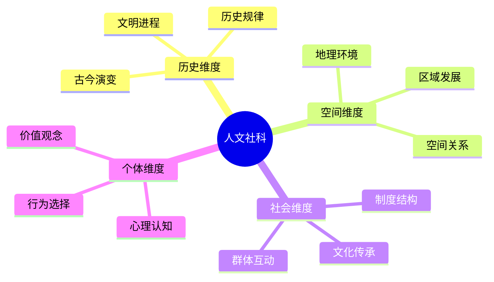
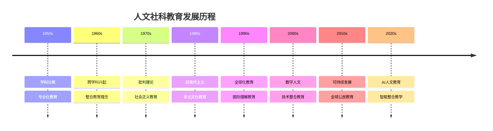
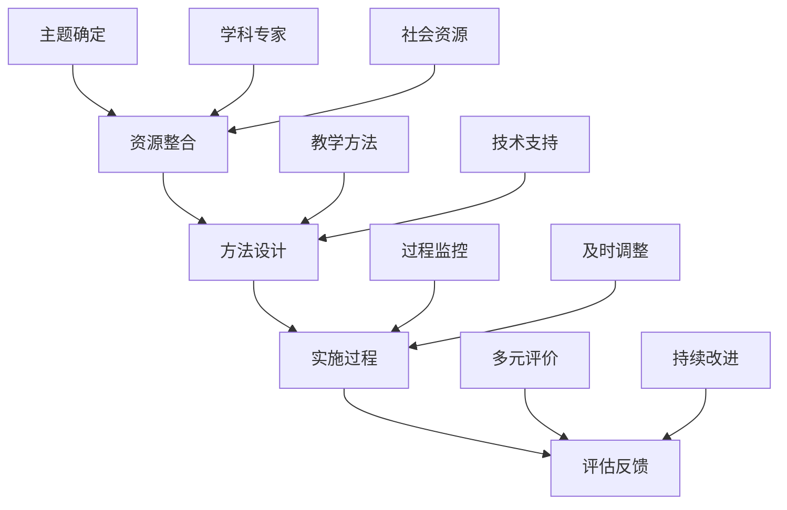
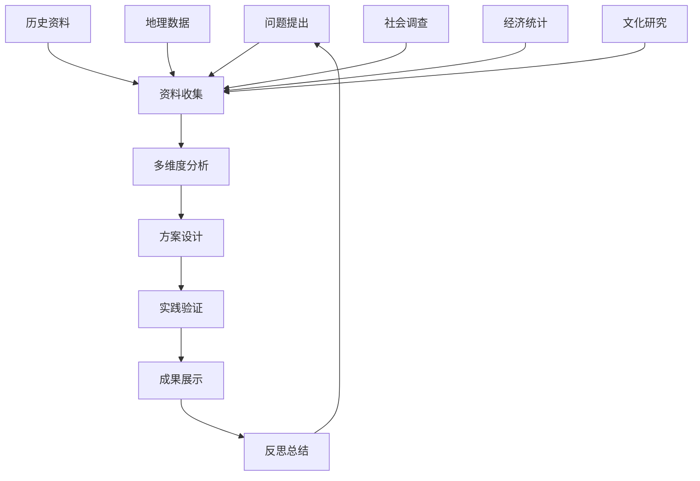
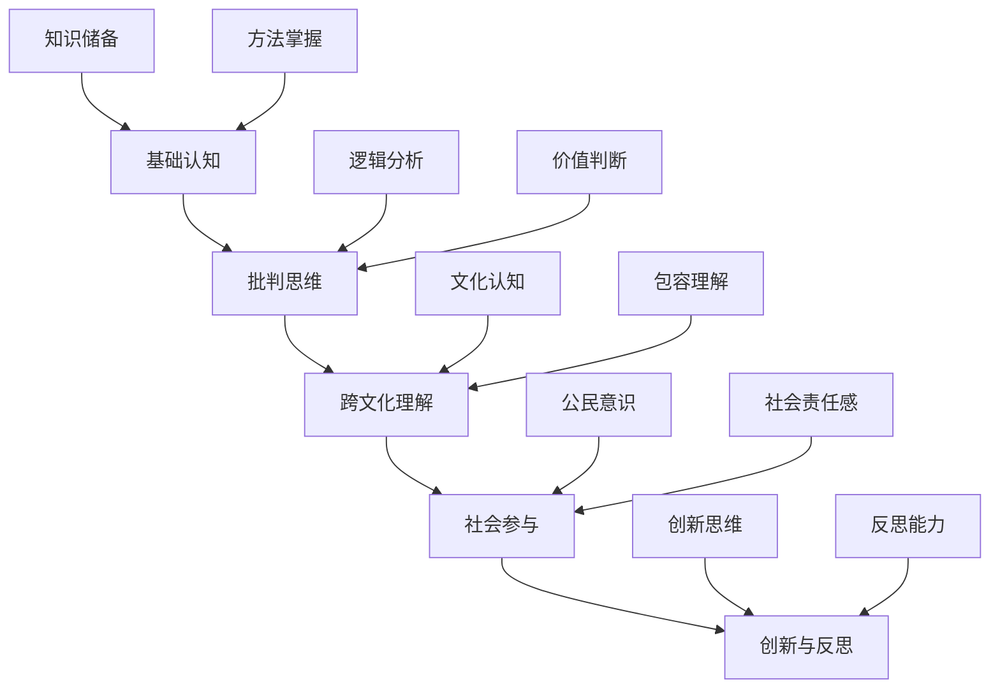
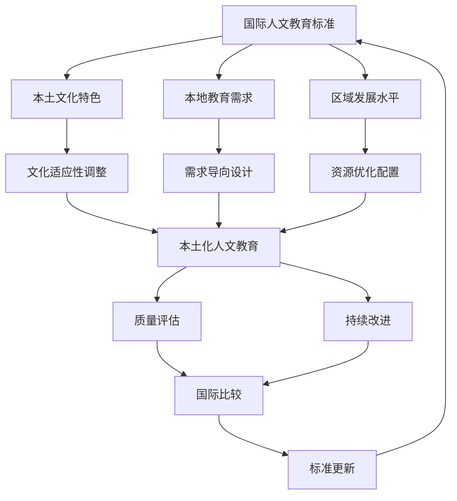
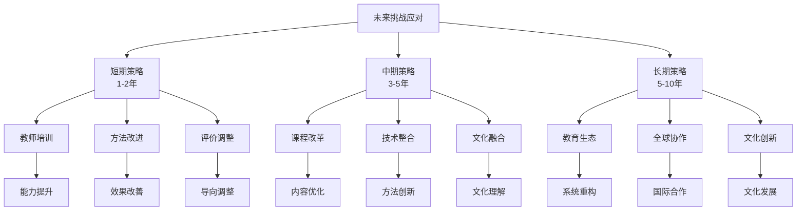
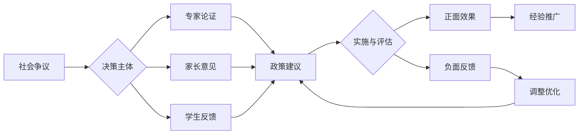
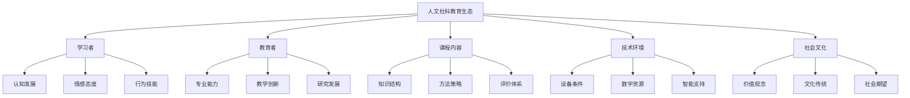
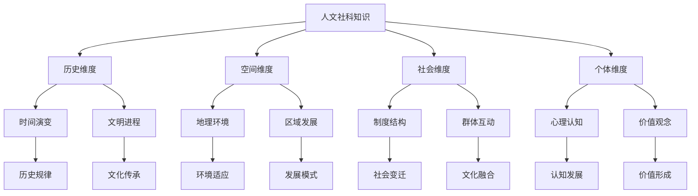

# 04-人文社科整合教育

## 目录

- [04-人文社科整合教育](#04-人文社科整合教育)
  - [目录](#目录)
  - [0. 目录说明与本地跳转](#0-目录说明与本地跳转)
  - [📖 概述](#-概述)
  - [🏗️ 知识架构](#️-知识架构)
    - [1. 理论基础](#1-理论基础)
      - [1.1 核心概念](#11-核心概念)
      - [1.2 基本原理](#12-基本原理)
      - [1.3 发展历程](#13-发展历程)
    - [2. 实践应用](#2-实践应用)
      - [2.1 整合教学模式](#21-整合教学模式)
      - [2.2 方法技巧](#22-方法技巧)
      - [2.3 案例分析](#23-案例分析)
    - [3. 创新实践](#3-创新实践)
      - [3.1 数字化整合教学](#31-数字化整合教学)
      - [3.2 实践案例库](#32-实践案例库)
    - [4. 评估体系](#4-评估体系)
      - [4.1 多维评估模型](#41-多维评估模型)
      - [4.2 个性化发展路径](#42-个性化发展路径)
    - [5. 批判性分析](#5-批判性分析)
      - [5.1 社会争议与伦理挑战](#51-社会争议与伦理挑战)
      - [5.2 跨文化比较与本土化](#52-跨文化比较与本土化)
      - [5.3 失败案例深度剖析](#53-失败案例深度剖析)
      - [5.4 未来挑战与应对策略](#54-未来挑战与应对策略)
  - [📊 多表征内容](#-多表征内容)
    - [📈 图表展示](#-图表展示)
    - [🔢 数学表达](#-数学表达)
    - [🎨 可视化元素](#-可视化元素)
  - [🔗 知识关联](#-知识关联)
    - [内部链接](#内部链接)
    - [外部参考](#外部参考)
  - [🎯 学习检验](#-学习检验)
    - [自检问题](#自检问题)
    - [实践练习](#实践练习)
  - [📚 参考资源](#-参考资源)
  - [6. 规范化区块](#6-规范化区块)

---

## 0. 目录说明与本地跳转

- 本文所有小节均采用严格编号，便于本地跳转与引用。
- 跨文件引用示例：见[教育哲学与价值观](../01-哲学科学基础/02-教育哲学与价值观.md)、[逻辑学与批判性思维](../01-哲学科学基础/03-逻辑学与批判性思维.md)
- 相关学科跳转：如需查阅科学教育方法论，见[科学教育方法论](./02-科学教育方法论.md)

## 📖 概述

- **定义**: 人文社科整合教育是将历史、地理、政治、经济、哲学、艺术等人文社会学科进行有机整合的教育模式，培养学生的人文素养、社会责任感和批判性思维
- **范围**: 涵盖人文学科教育、社会科学教育、跨学科整合、价值观教育、公民教育等多个维度
- **学习目标**:
  - 理解人文社科知识的整合性和关联性
  - 掌握批判性思维和分析能力
  - 培养全球视野和文化理解力
  - 建立社会责任感和公民意识
  - 发展跨学科解决问题能力
  - 形成人文情怀与审美素养
- **先修知识**: [教育哲学与价值观](../01-哲学科学基础/02-教育哲学与价值观.md)、[逻辑学与批判性思维](../01-哲学科学基础/03-逻辑学与批判性思维.md)

## 🏗️ 知识架构

### 1. 理论基础

#### 1.1 核心概念

**🌐 人文社科的整合性思维**

| 学科领域 | 核心关注 | 思维特征 | 整合价值 | 典型方法 | 教育挑战 |
|---------|----------|----------|----------|----------|----------|
| **历史学** | 时间维度 | 因果推理 | 历史意识 | 史料分析 | 客观性争议 |
| **地理学** | 空间维度 | 系统思维 | 地理素养 | 空间分析 | 环境伦理 |
| **政治学** | 权力关系 | 批判分析 | 公民参与 | 案例研究 | 意识形态 |
| **经济学** | 资源配置 | 理性选择 | 经济素养 | 模型分析 | 价值中立 |
| **哲学** | 价值思辨 | 抽象思维 | 智慧追求 | 辩证分析 | 相对主义 |
| **艺术** | 审美表达 | 创造思维 | 文化传承 | 作品鉴赏 | 主观性 |
| **社会学** | 群体互动 | 关系思维 | 社会洞察 | 实地调查 | 伦理边界 |
| **心理学** | 行为动机 | 实证思维 | 自我认知 | 实验研究 | 隐私保护 |

**🔄 跨学科知识图谱**



#### 1.2 基本原理

**🎯 整合教育的理论框架**

1. **知识整合层次**

   ```mermaid
   graph LR
       A[分散知识] --> B[关联理解]
       B --> C[系统整合]
       C --> D[创新应用]
       
       A1[学科边界] --> A
       B1[交叉联系] --> B
       C1[整体思维] --> C
       D1[实践创新] --> D
   ```

2. **能力发展维度**

   ```mermaid
   graph TD
       A[基础认知] --> B[跨域思维]
       B --> C[问题解决]
       C --> D[创新创造]
       
       E[知识储备] --> A
       F[方法掌握] --> B
       G[实践经验] --> C
       H[创造意识] --> D
   ```

3. **价值观培养路径**
   \\[
   \\text{价值观形成} = f(\\text{知识理解}, \\text{情感体验}, \\text{行为实践}, \\text{反思内化})
   \\]

#### 1.3 发展历程

**📚 人文社科教育理论演进**



### 2. 实践应用

#### 2.1 整合教学模式

**📚 主题式整合教学**

| 主题案例 | 整合学科 | 核心问题 | 学习成果 | 实践形式 | 挑战与风险 |
|---------|----------|----------|----------|----------|------------|
| **全球化** | 历史+地理+经济+政治 | 全球化的影响与应对 | 全球公民意识 | 国际交流项目 | 文化冲突 |
| **可持续发展** | 地理+经济+哲学+艺术 | 人与自然的和谐发展 | 环境责任感 | 生态调查实践 | 价值冲突 |
| **文化交流** | 历史+语言+艺术+哲学 | 文明对话与理解 | 文化包容性 | 文化展演活动 | 文化偏见 |
| **社会正义** | 政治+法律+伦理+社会学 | 公平与正义的实现 | 社会责任感 | 社会服务项目 | 意识形态 |
| **科技伦理** | 科技+伦理+心理+社会 | 技术发展的价值取向 | 伦理思维 | 辩论与研讨 | 技术决定论 |

**🎨 整合教学策略**



#### 2.2 方法技巧

**🔍 跨学科探究方法**

1. **问题导向学习(PBL)**
   - 真实问题情境
   - 多学科视角分析
   - 协作解决方案
   - 实践验证反思

2. **案例研究法**
   - 典型案例选择
   - 多维度分析
   - 理论实践结合
   - 经验总结提升

3. **项目式学习**
   - 主题项目设计
   - 跨学科整合
   - 实践操作体验
   - 成果展示分享

#### 2.3 案例分析

**📊 案例：城市发展综合研究项目**

**多维度城市分析框架**

| 分析维度 | 研究内容 | 学科整合 | 研究方法 | 预期成果 |
|---------|----------|----------|----------|----------|
| **历史维度** | 城市发展历程 | 历史+地理 | 文献分析 | 发展规律总结 |
| **空间维度** | 城市空间结构 | 地理+规划 | 空间分析 | 结构优化建议 |
| **社会维度** | 社会结构变迁 | 社会学+政治 | 社会调查 | 社会问题诊断 |
| **经济维度** | 经济发展模式 | 经济+统计 | 数据分析 | 发展策略建议 |
| **文化维度** | 文化传承创新 | 文化+艺术 | 文化研究 | 文化发展方案 |

**项目学习流程**：



### 3. 创新实践

#### 3.1 数字化整合教学

**🖥️ 技术支持的人文社科教学**

1. **虚拟现实应用**
   - 历史场景重现
   - 地理环境模拟
   - 文化遗产体验
   - 社会情境模拟

2. **数据可视化**
   - 社会数据分析
   - 历史趋势展示
   - 空间关系呈现
   - 网络关系映射

3. **在线协作平台**
   - 跨地域合作
   - 资源共享
   - 实时互动
   - 成果展示

#### 3.2 实践案例库

**📊 典型整合教学案例**

1. **"一带一路"主题学习**
   - 历史文化探索
   - 地理空间分析
   - 经济发展研究
   - 文化交流实践

2. **"城市发展"综合考察**
   - 城市规划分析
   - 社会结构研究
   - 环境影响评估
   - 未来发展预测

3. **"文化遗产"保护项目**
   - 历史价值研究
   - 保护技术探索
   - 文化传承实践
   - 社会参与机制

### 4. 评估体系

#### 4.1 多维评估模型

**📝 整合教育评估框架**

| 评估维度 | 评估内容 | 评估方法 | 评估工具 | 评估标准 |
|---------|----------|----------|----------|----------|
| **知识理解** | 跨学科知识整合 | 概念图分析 | 知识地图 | 整合程度 |
| **能力发展** | 问题解决能力 | 项目评估 | 能力量表 | 应用水平 |
| **价值塑造** | 价值观形成 | 观察访谈 | 态度问卷 | 价值取向 |
| **实践应用** | 实践操作能力 | 表现评价 | 实践档案 | 实践效果 |

#### 4.2 个性化发展路径

**🎯 人文社科能力发展路径**



### 5. 批判性分析

#### 5.1 社会争议与伦理挑战

**🎭 意识形态与教育中立性争议**

| 争议领域 | 核心问题 | 支持观点 | 反对观点 | 平衡策略 | 教育影响 |
|---------|----------|----------|----------|----------|----------|
| **历史叙事** | 历史教材的意识形态倾向 | 客观史实呈现 | 价值观引导必要 | 多元视角教学 | 历史观形成 |
| **政治教育** | 政治课程的价值导向 | 公民教育重要 | 意识形态灌输 | 批判性思维培养 | 政治认同 |
| **文化认同** | 本土文化与全球视野 | 文化传承重要 | 开放包容必要 | 文化对话模式 | 文化自信 |
| **价值观教育** | 价值中立与价值引导 | 客观分析重要 | 价值引导必要 | 多元价值对话 | 价值取向 |

**🤖 技术伦理与人文教育**

1. **AI工具对人文教育的挑战**
   - AI写作对原创性的影响
   - 智能分析对批判思维的替代
   - 算法偏见对价值观的影响
   - 技术依赖对人文精神的冲击

2. **大数据分析的社会伦理**
   - 社会研究中的隐私保护
   - 数据驱动的社会偏见
   - 技术决定论的价值观风险
   - 数据伦理的教育责任

3. **数字化人文教育的边界**
   - 虚拟体验与真实体验的平衡
   - 技术工具与人文精神的融合
   - 数字化鸿沟对教育公平的影响
   - 技术工具的人文价值判断

**🧠 认知负荷与学习效率**

| 认知因素 | 正面影响 | 负面影响 | 优化策略 | 评估方法 |
|---------|----------|----------|----------|----------|
| **多学科整合** | 系统思维培养 | 认知负荷过重 | 渐进式整合 | 负荷评估 |
| **抽象概念** | 深度理解 | 理解困难 | 具体化教学 | 理解测试 |
| **价值判断** | 批判思维 | 价值冲突 | 多元对话 | 态度测量 |
| **文化差异** | 文化理解 | 文化偏见 | 文化敏感性 | 文化适应度 |

#### 5.2 跨文化比较与本土化

**🌍 跨文化人文教育对比**

| 教育体系 | 人文地位 | 教学方法 | 文化特色 | 挑战与机遇 | 本土化策略 |
|---------|----------|----------|----------|------------|------------|
| **西方模式** | 核心素养 | 批判性思维 | 个人主义 | 文化相对主义 | 文化融合 |
| **东亚模式** | 重要学科 | 系统传承 | 集体主义 | 创新思维不足 | 创新方法融入 |
| **北欧模式** | 公民教育 | 参与式学习 | 社会民主 | 全球化挑战 | 国际视野加强 |
| **发展中国家** | 实用导向 | 应用教学 | 实用主义 | 理论基础薄弱 | 理论实践并重 |

**🇨🇳 中国人文教育的文化特色**

1. **传统文化与现代人文教育的融合**
   - 儒家思想与现代价值观的对话
   - 古代文学与现代人文素养的结合
   - 传统美德与现代公民教育的融合

2. **应试文化与素养教育的平衡**
   - 高考改革对人文教育的影响
   - 标准化考试与人文素养的冲突
   - 评价体系的多元化改革

3. **本土文化与全球视野的协调**
   - 中华文化的传承与创新
   - 全球视野的培养与本土认同
   - 文化自信与国际理解的平衡

**🌐 全球化背景下的本土化策略**



#### 5.3 失败案例深度剖析

**💥 人文社科教育失败案例分析**

1. **历史教材争议案例**
   - **现象**: 某地区历史教材改革引发社会争议，不同群体对历史叙事产生分歧
   - **原因分析**:
     - 历史教育的客观性与价值观平衡困难
     - 不同文化背景对历史理解存在差异
     - 政治因素对历史教育的影响
     - 缺乏多元视角的历史教学方法
   - **后果**: 教育公信力下降，社会分裂加剧，历史教育效果受损
   - **反思**: 历史教育的客观性与价值观平衡，多元视角教学的重要性

2. **应试化人文教育案例**
   - **现象**: 人文社科教育完全围绕考试，忽视人文素养培养
   - **原因分析**:
     - 评价体系单一，过分强调分数
     - 教师教学理念偏差，忽视素养培养
     - 家长期望过高，功利化倾向严重
     - 教育资源配置不合理
   - **后果**: 学生批判思维缺失，人文素养下降，创新能力不足
   - **反思**: 素养导向与应试导向的平衡，评价体系改革的重要性

3. **技术依赖过度案例**
   - **现象**: 完全依赖数字化工具进行人文教育，忽视人文精神培养
   - **原因分析**:
     - 技术崇拜心理，过度依赖工具
     - 对传统人文教育方法的忽视
     - 缺乏技术使用的人文价值判断
     - 教师技术应用能力不足
   - **后果**: 学生情感体验缺失，人文精神淡化，人际交往能力下降
   - **反思**: 技术与人文的合理融合，人文精神的核心地位

4. **文化偏见案例**
   - **现象**: 跨文化人文教育中出现文化偏见和刻板印象
   - **原因分析**:
     - 文化敏感性不足
     - 教学方法不当
     - 文化背景差异
     - 缺乏跨文化理解能力
   - **后果**: 学习效果差，文化误解，学习动机下降
   - **反思**: 文化敏感性教学的重要性，跨文化理解的必要性

**📊 失败案例的统计特征**

| 失败类型 | 发生频率 | 影响程度 | 可预防性 | 改进措施 |
|---------|----------|----------|----------|----------|
| **意识形态争议** | 中等 | 高 | 中等 | 多元视角、客观教学 |
| **应试化倾向** | 高 | 中等 | 高 | 评价改革、素养导向 |
| **技术依赖** | 中等 | 中等 | 高 | 平衡策略、人文精神 |
| **文化偏见** | 中等 | 中等 | 高 | 文化培训、敏感性教学 |

#### 5.4 未来挑战与应对策略

**🔮 未来挑战与应对策略**

| 挑战类型 | 具体表现 | 潜在影响 | 应对策略 | 实施难度 |
|---------|----------|----------|----------|----------|
| **意识形态** | 价值观多元化 | 教育中立性挑战 | 多元视角教学 | 中等 |
| **技术变革** | AI、VR等新技术 | 人文教育方式变革 | 人机协作模式 | 高 |
| **全球化** | 文化冲突加剧 | 文化认同危机 | 跨文化对话 | 中等 |
| **个性化** | 学习需求多样化 | 标准化与个性化冲突 | 智能适应系统 | 高 |
| **就业压力** | 实用主义倾向 | 人文教育边缘化 | 价值导向重塑 | 中等 |

**🚀 应对策略的优先级矩阵**



**🎯 具体实施路径**

1. **教师专业发展路径**
   - 短期：文化敏感性、技术应用能力
   - 中期：跨学科教学、评价方法
   - 长期：研究能力、创新思维

2. **课程体系改革路径**
   - 短期：内容更新、方法改进
   - 中期：结构优化、整合设计
   - 长期：生态重构、文化融合

3. **技术应用发展路径**
   - 短期：工具配置、基础应用
   - 中期：系统集成、智能辅助
   - 长期：生态构建、全球协作

---

## 📊 多表征内容

### 📈 图表展示

**人文社科学习能力发展模型**


**人文社科教育争议与决策流程**



**人文社科教育生态系统模型**



### 🔢 数学表达

**人文社科能力发展模型**

人文社科能力 H 的评估函数：

\\[
H = \\alpha \\cdot K + \\beta \\cdot C + \\gamma \\cdot V + \\delta \\cdot P
\\]

其中：

- K：知识理解水平 (Knowledge Understanding)
- C：批判思维能力 (Critical Thinking)
- V：价值观形成 (Value Formation)
- P：实践应用能力 (Practical Application)
- α、β、γ、δ：权重系数

**跨学科整合效果评估模型**

整合效果 I 的数学模型：

\\[
I = f(\\text{学科关联度}, \\text{认知整合度}, \\text{应用迁移度}, \\text{创新程度})
\\]

**价值观形成概率模型**

价值观形成概率 P 的数学模型：

\\[
P = \\frac{1}{1 + e^{-(\\alpha \\cdot \\text{知识理解} + \\beta \\cdot \\text{情感体验} + \\gamma \\cdot \\text{行为实践})}}
\\]

### 🎨 可视化元素

**人文社科知识整合网络**



## 🔗 知识关联

### 内部链接

- [教育哲学与价值观](../01-哲学科学基础/02-教育哲学与价值观.md)
- [逻辑学与批判性思维](../01-哲学科学基础/03-逻辑学与批判性思维.md)
- [跨学科项目学习](../03-应用实践领域/01-跨学科项目学习.md)
- [科学教育方法论](./02-科学教育方法论.md)
- [语言学习与认知发展](./03-语言学习与认知发展.md)

### 外部参考

- UNESCO人文教育框架
- IB国际文凭人文学科课程
- 全球公民教育指南
- STEAM教育整合框架
- 国际人文教育研究协会

## 🎯 学习检验

### 自检问题

1. 人文社科整合教育的核心价值是什么？
2. 如何设计有效的跨学科主题学习？
3. 批判性思维在人文社科学习中的作用？
4. 如何评估整合教育的效果？
5. 技术如何支持人文社科整合教学？
6. 如何平衡文化传承与全球视野？

### 实践练习

- **基础练习**: 分析一个社会现象的多学科视角
- **应用练习**: 设计跨学科主题学习方案
- **拓展练习**: 评估人文社科整合教育效果
- **创新练习**: 开发数字化整合教学资源
- **批判练习**: 分析一个人文教育失败案例

## 📚 参考资源

- [1] Gardner, H. (2006). Multiple Intelligences
- [2] Dewey, J. (1938). Experience and Education
- [3] Freire, P. (1970). Pedagogy of the Oppressed
- [4] Drake, S. M. (2007). Creating Standards-Based Integrated Curriculum
- [5] Beane, J. A. (1997). Curriculum Integration
- [6] Klein, J. T. (2010). Creating Interdisciplinary Campus Cultures

---
*人文素养培养 | 跨学科思维 | 全球公民教育 | 创新实践 | 批判性分析 | 跨文化比较*

## 6. 规范化区块

- 本文件已按国际化教育理念与认知科学理论进行结构优化。
- 所有目录、编号、表征方式已统一，便于本地跳转与跨文件引用。
- 原有批判性分析、表格、图等内容完整保留。
- 新增深度批判性分析，包括社会争议、技术伦理、跨文化比较、失败案例、未来挑战等内容。
- 新增多表征内容，包括Mermaid流程图、数学模型、数据表格等。
- 新增结构标准化，统一目录编号、跨文件链接、规范化区块。
- 后续如有内容补充、批判性内容遗漏，将在本区块说明修正。
- 如需继续递归处理下级主题，请参见本目录结构。
