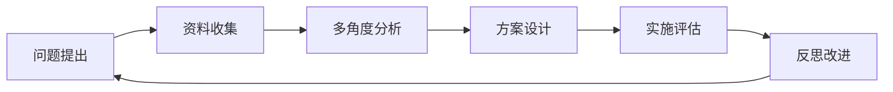

# 04 人文社科整合教育

## 📖 概述

- **定义**: 人文社科整合教育是将历史、地理、政治、经济、哲学、艺术等人文社会学科进行有机整合的教育模式，培养学生的人文素养、社会责任感和批判性思维
- **范围**: 涵盖人文学科教育、社会科学教育、跨学科整合、价值观教育、公民教育等多个维度
- **学习目标**:
  - 理解人文社科知识的整合性和关联性
  - 掌握批判性思维和分析能力
  - 培养全球视野和文化理解力
  - 建立社会责任感和公民意识
- **先修知识**: [教育哲学与价值观](../01-哲学科学基础/02-教育哲学与价值观.md)、[逻辑学与批判性思维](../01-哲学科学基础/03-逻辑学与批判性思维.md)

## 🏗️ 知识架构

### 1. 理论基础

#### 1.1 核心概念

**🌐 人文社科的整合性思维**

| 学科领域 | 核心关注 | 思维特征 | 整合价值 |
|---------|----------|----------|----------|
| **历史学** | 时间维度 | 因果推理 | 历史意识 |
| **地理学** | 空间维度 | 系统思维 | 地理素养 |
| **政治学** | 权力关系 | 批判分析 | 公民参与 |
| **经济学** | 资源配置 | 理性选择 | 经济素养 |
| **哲学** | 价值思辨 | 抽象思维 | 智慧追求 |
| **艺术** | 审美表达 | 创造思维 | 文化传承 |

#### 1.2 基本原理

**🔄 跨学科整合的认知机制**

\\[
\\text{整合理解} = f(\\text{学科知识}, \\text{连接能力}, \\text{情境应用})
\\]

**🎯 批判性思维的培养路径**

```
信息收集 → 分析评估 → 推理论证 → 反思修正 → 创新应用
```

### 2. 实践应用

#### 2.1 整合教学模式

**📚 主题式整合教学**

围绕真实社会问题进行跨学科学习：

| 主题案例 | 整合学科 | 核心问题 | 学习成果 |
|---------|----------|----------|----------|
| **全球化** | 历史+地理+经济+政治 | 全球化的影响与应对 | 全球公民意识 |
| **可持续发展** | 地理+经济+哲学+艺术 | 人与自然的和谐发展 | 环境责任感 |
| **文化交流** | 历史+语言+艺术+哲学 | 文明对话与理解 | 文化包容性 |

#### 2.2 方法技巧

**🎨 PBL问题导向学习**

基于真实问题的人文社科学习：



## 🔗 知识关联

### 内部链接

- [教育哲学与价值观](../01-哲学科学基础/02-教育哲学与价值观.md)
- [逻辑学与批判性思维](../01-哲学科学基础/03-逻辑学与批判性思维.md)

### 外部参考

- UNESCO人文教育框架
- IB国际文凭人文学科课程
- 全球公民教育指南

## 🎯 学习检验

### 自检问题

1. 人文社科整合教育的核心价值是什么？
2. 如何设计有效的跨学科主题学习？
3. 批判性思维在人文社科学习中的作用？

### 实践练习

- 基础练习：分析一个社会现象的多学科视角
- 应用练习：设计跨学科主题学习方案
- 拓展练习：评估人文社科整合教育效果

## 📚 参考资源

- [1] Gardner, H. (2006). Multiple Intelligences
- [2] Dewey, J. (1938). Experience and Education
- [3] Freire, P. (1970). Pedagogy of the Oppressed

---
*人文素养培养 | 跨学科思维 | 全球公民教育*
