# 05 物理教育理论与实践

## 📖 概述

- **定义**: 物理教育理论与实践是基于认知科学和物理学科特点，培养学生物理概念理解、科学推理能力和实验探究技能的教育体系
- **范围**: 涵盖物理概念建构、数学建模、实验探究、科学论证、跨学科应用等多个维度
- **学习目标**:
  - 理解物理概念的抽象性和数学表达特点
  - 掌握基于探究的物理教学方法
  - 培养科学推理和建模能力
  - 建立物理与生活、技术的联系
- **先修知识**: [认知科学与学习理论](../01-哲学科学基础/01-认知科学与学习理论.md)、[数学教育理论与实践](./01-数学教育理论与实践.md)、[科学教育方法论](./02-科学教育方法论.md)

## 🏗️ 知识架构

### 1. 理论基础

#### 1.1 物理认知的特殊性

**🧠 物理概念学习的认知机制**:

| 认知特征 | 物理表现 | 学习挑战 | 教学策略 | 评估标准 |
|---------|----------|----------|----------|----------|
| **抽象建模** | 理想化物理模型 | 从具体到抽象的跨越 | 概念转换支架 | 模型理解度 |
| **数学表达** | 公式与图象结合 | 数学符号意义理解 | 多表征转换 | 符号运用能力 |
| **因果推理** | 物理现象解释 | 表面现象与本质规律 | 科学论证框架 | 推理逻辑性 |
| **系统思维** | 相互作用分析 | 多因素关联思考 | 概念图构建 | 系统整合度 |

#### 1.2 物理概念发展阶段

**🔄 物理概念学习的发展轨迹**:

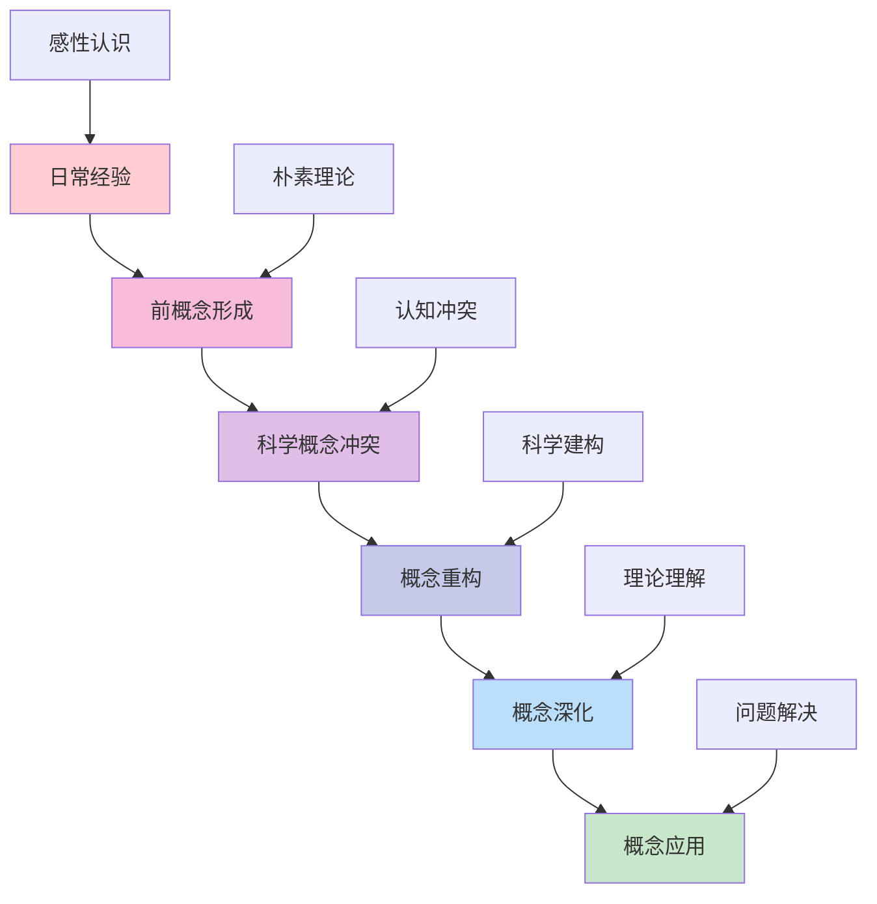

#### 1.3 国际物理教育理念比较

**🌍 主要国家物理教育特色**:

| 国家/地区 | 教育理念 | 课程特点 | 评估方式 | 核心优势 | 挑战 |
|---------|----------|----------|----------|----------|------|
| **美国** | 探究为本 | NGSS标准 | 实践评估 | 科学工程实践 | 理论深度不足 |
| **英国** | 概念理解 | A-level体系 | 理论实验并重 | 深度学习 | 应用能力不足 |
| **德国** | 系统思维 | 理论严谨 | 概念应用 | 逻辑建构 | 创新思维不足 |
| **新加坡** | 应用导向 | 21世纪技能 | 真实情境 | 实际问题解决 | 理论深度不足 |
| **法国** | 数理结合 | 数学基础强 | 推理论证 | 理论深度 | 应用能力不足 |

#### 1.4 发展历程

**📚 物理教育理论演进**:

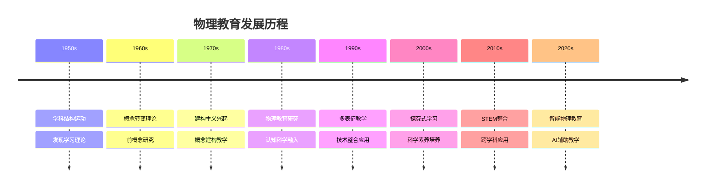

### 2. 教学方法与策略

#### 2.1 基于建构的概念教学

**🏗️ POE (Predict-Observe-Explain) 教学模式**:

| 阶段 | 学生活动 | 教师引导 | 认知过程 | 评估要点 | 常见问题 |
|------|----------|----------|----------|----------|----------|
| **预测** | 基于已有知识预测现象 | 激发前概念表达 | 激活先验知识 | 预测合理性 | 预测过于简单 |
| **观察** | 仔细观察实验现象 | 引导观察要点 | 数据收集处理 | 观察准确性 | 观察不够细致 |
| **解释** | 分析现象解释原因 | 引导科学论证 | 概念建构应用 | 解释科学性 | 解释缺乏深度 |

#### 2.2 多表征物理教学

**🎨 物理概念的多重表征转换**:

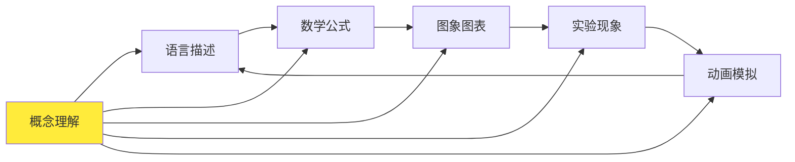

**📊 表征转换能力发展**:

| 表征类型 | 特点 | 教学应用 | 学习要求 | 常见困难 |
|---------|------|----------|----------|----------|
| **文字描述** | 定性分析 | 现象解释 | 语言准确性 | 描述不够精确 |
| **数学公式** | 定量关系 | 计算推导 | 符号理解 | 符号意义不清 |
| **图象图表** | 关系展示 | 数据分析 | 图象读取 | 图象理解错误 |
| **实验操作** | 直观验证 | 动手探究 | 技能掌握 | 操作不规范 |
| **模拟动画** | 微观展示 | 过程理解 | 模型建构 | 模型理解偏差 |

#### 2.3 物理实验探究教学

**🔬 实验探究的认知价值**:

1. **技能发展**
   - 实验设计能力
   - 数据处理技能
   - 误差分析方法

2. **概念理解**
   - 通过实验验证理论
   - 发现物理规律
   - 理解测量本质

3. **科学素养**
   - 科学方法掌握
   - 证据意识培养
   - 质疑精神发展

### 3. 实践应用

#### 3.1 核心概念教学设计

**⚡ 力学概念体系构建**:

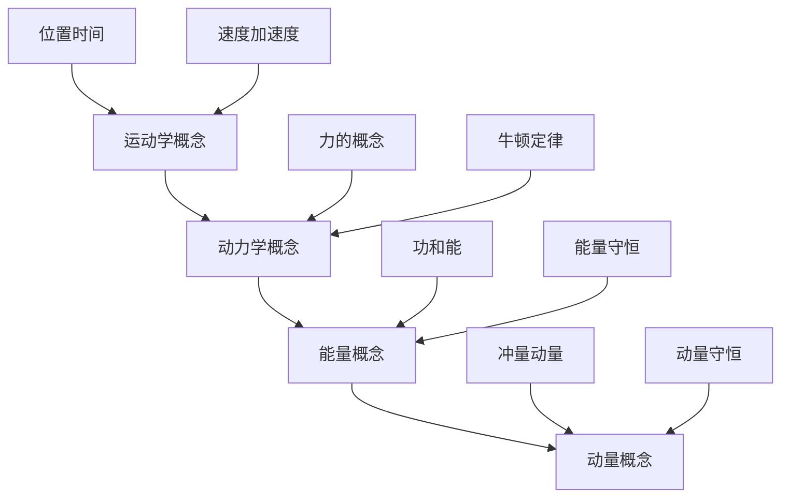

**🌊 电磁学概念网络**:

| 核心概念 | 基础概念 | 关联概念 | 应用领域 | 学习难点 |
|---------|----------|----------|----------|----------|
| **电场** | 电荷、库仑定律 | 电势、电势能 | 静电现象 | 场概念抽象 |
| **磁场** | 磁性、磁感线 | 磁通量、电磁感应 | 电机原理 | 磁感线理解 |
| **电磁波** | 变化电磁场 | 频率、波长 | 通信技术 | 波动性质 |

#### 3.2 问题解决教学策略

**🎯 物理问题解决四步法**:

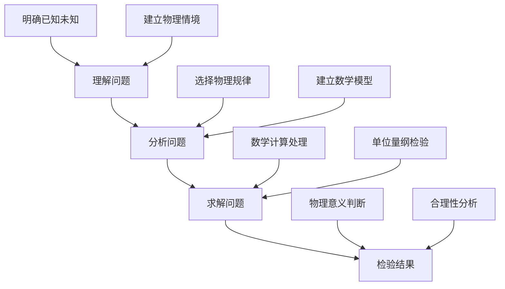

**📈 问题解决能力发展模型**:

\\[
P(t) = P_0 + A \\cdot e^{-\\frac{(t-t_0)^2}{2\\sigma^2}} + B \\cdot \\log(1 + C \\cdot t)
\\]

其中：

- $P(t)$ = t时刻的问题解决能力
- $P_0$ = 初始能力基线
- $A$ = 概念理解贡献
- $B$ = 练习积累贡献
- $C$ = 学习效率参数

#### 3.3 案例分析

**📊 案例：牛顿第二定律概念教学**:

**多维度概念建构策略**:

| 维度 | 具体活动 | 认知功能 | 预期结果 | 评估方法 |
|------|----------|----------|----------|----------|
| **现象层** | 小车实验 | 具体感知 | 建立现象印象 | 观察记录 |
| **概念层** | 力与加速度关系 | 抽象理解 | 掌握核心概念 | 概念测试 |
| **数学层** | F=ma公式 | 量化关系 | 精确描述 | 计算练习 |
| **应用层** | 实际问题解决 | 迁移应用 | 实际意义 | 问题解决 |

**概念转变的教学序列**：

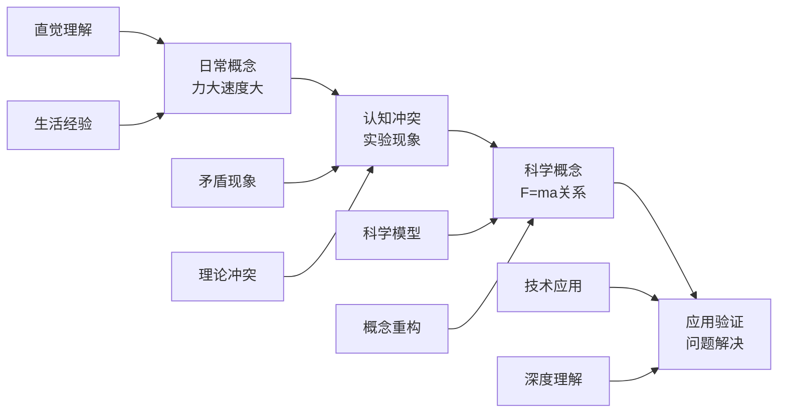

### 4. 创新实践

#### 4.1 数字化物理教学

**🖥️ 技术支持物理教学**:

1. **虚拟实验室**
   - 危险实验模拟
   - 微观现象展示
   - 参数实时调整
   - 数据自动记录

2. **智能诊断系统**
   - 概念理解诊断
   - 错误模式识别
   - 个性化反馈
   - 学习路径推荐

3. **增强现实应用**
   - 物理现象可视化
   - 交互式学习体验
   - 情境化教学
   - 沉浸式探究

#### 4.2 虚拟实验技术

**🎮 VR/AR物理实验案例**:

1. **原子结构探索**
   - 电子轨道可视化
   - 量子现象模拟
   - 原子模型构建
   - 案例：虚拟原子实验室

2. **电磁场可视化**
   - 电场线动态展示
   - 磁场分布模拟
   - 电磁感应演示
   - 案例：电磁场虚拟实验室

3. **力学现象模拟**
   - 运动轨迹追踪
   - 力的作用可视化
   - 碰撞过程分析
   - 案例：力学虚拟实验室

#### 4.3 智能评估系统

**📊 多维度物理能力评估**

| 评估维度 | 评估工具 | 数据分析 | 应用价值 | 实施挑战 |
|---------|----------|----------|----------|----------|
| **概念理解** | 概念图分析 | 认知结构映射 | 概念掌握度 | 分析复杂度 |
| **问题解决** | 智能题库 | 解题策略分析 | 能力诊断 | 题目质量 |
| **实验技能** | 虚拟实验 | 操作行为分析 | 技能评估 | 真实感差异 |
| **科学思维** | 论证任务 | 推理过程分析 | 思维品质 | 评估主观性 |

### 5. 批判性分析

#### 5.1 社会争议与伦理挑战

**🎭 物理教育的社会争议**

| 争议领域 | 核心问题 | 支持观点 | 反对观点 | 平衡策略 | 教育影响 |
|---------|----------|----------|----------|----------|----------|
| **实验安全** | 学校物理实验的安全责任边界 | 实验是物理教育核心 | 安全风险不可接受 | 分级安全管理 | 实验教学受限 |
| **物理竞赛** | 竞赛是否加剧教育不平等？ | 发现人才，激励学习 | 资源集中，压力过大 | 普及与提高并重 | 教育公平性 |
| **学科地位** | 物理在STEM中的地位争议 | 基础学科重要性 | 实用主义倾向 | 多元发展路径 | 学科价值认同 |
| **技术依赖** | 过度依赖技术工具的影响 | 提高效率，增强体验 | 基础能力退化 | 适度平衡 | 能力培养 |

**🤖 技术伦理与物理教育**

1. **虚拟实验的伦理边界**
   - 虚拟实验对真实实验技能的替代风险
   - 数字化实验的误差控制与真实性
   - 人机协作的合理边界
   - 实验数据的可靠性问题

2. **AI辅助物理教学的挑战**
   - 算法偏见对物理概念理解的影响
   - 智能诊断系统的公平性问题
   - 学生隐私保护与数据安全
   - 教师角色的重新定位

3. **技术工具与基础能力的平衡**
   - 计算器依赖对计算能力的影响
   - 模拟软件对物理直觉的培养
   - 传统方法与现代技术的融合
   - 技术工具的人文价值判断

**🧠 认知负荷与学习效率**

| 认知因素 | 正面影响 | 负面影响 | 优化策略 | 评估方法 |
|---------|----------|----------|----------|----------|
| **抽象概念** | 深度理解 | 理解困难 | 具体化教学 | 理解测试 |
| **数学符号** | 精确表达 | 符号恐惧 | 渐进式引入 | 符号测试 |
| **多表征转换** | 全面理解 | 认知负荷重 | 支架式教学 | 转换测试 |
| **实验操作** | 直观体验 | 操作复杂 | 分级指导 | 操作评估 |

#### 5.2 跨文化比较与本土化

**🌍 跨文化物理教育对比**

| 教育体系 | 物理地位 | 教学方法 | 文化特色 | 挑战与机遇 | 本土化策略 |
|---------|----------|----------|----------|------------|------------|
| **美国模式** | STEM核心 | 探究式学习 | 创新思维 | 理论深度不足 | 理论深度加强 |
| **德国模式** | 基础学科 | 系统严谨 | 逻辑建构 | 应用能力不足 | 应用能力培养 |
| **东亚模式** | 重要学科 | 精细化教学 | 勤奋刻苦 | 创新能力不足 | 创新方法融入 |
| **北欧模式** | 生活技能 | 应用导向 | 实用主义 | 理论深度不足 | 理论实践并重 |

**🇨🇳 中国物理教育的文化特色**

1. **传统文化与现代物理教育的融合**
   - 古代科技成就与现代物理的对话
   - 传统哲学思想与物理思维的结合
   - 中华文化价值观与科学精神的融合

2. **应试文化与素养教育的平衡**
   - 高考改革对物理教育的影响
   - 标准化考试与物理素养的冲突
   - 评价体系的多元化改革

3. **本土特色与国际接轨**
   - 中国物理教育传统的传承
   - 国际先进理念的本土化
   - 文化自信与国际视野的平衡

**🌐 全球化背景下的本土化策略**

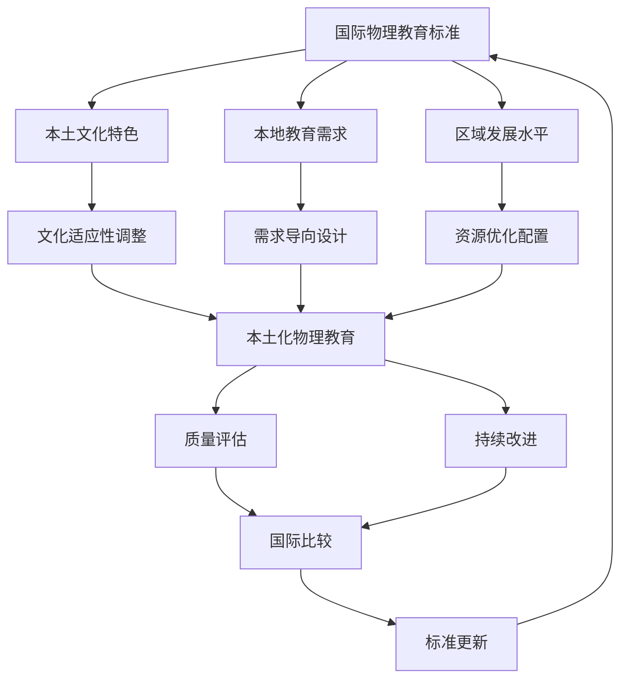

#### 5.3 失败案例深度剖析

**💥 物理教育失败案例分析**

1. **物理实验安全事故案例**
   - **现象**: 某校物理实验发生安全事故，造成学生受伤
   - **原因分析**:
     - 安全教育不到位
     - 实验设计存在安全隐患
     - 教师专业能力不足
     - 管理制度缺失
   - **后果**: 学生受伤，家长质疑，学校责任，物理教育声誉受损
   - **反思**: 安全教育与实验设计的平衡，教师专业发展的重要性

2. **应试化物理教育案例**
   - **现象**: 物理教育完全围绕考试，忽视物理思维培养
   - **原因分析**:
     - 评价体系单一
     - 升学压力过大
     - 教师教学理念偏差
     - 家长期望过高
   - **后果**: 学生物理兴趣下降，创新能力缺失，物理素养不足
   - **反思**: 素养导向与应试导向的平衡，评价体系改革

3. **技术依赖过度案例**
   - **现象**: 完全依赖虚拟实验，忽视真实实验操作
   - **原因分析**:
     - 技术崇拜心理
     - 成本考虑
     - 安全担忧
     - 教师技能不足
   - **后果**: 学生动手能力退化，物理直觉丧失，实验技能缺失
   - **反思**: 技术工具与基础能力的平衡，混合教学模式

4. **概念教学失败案例**
   - **现象**: 学生无法理解抽象物理概念，停留在记忆层面
   - **原因分析**:
     - 教学方法不当
     - 认知负荷过重
     - 缺乏具体经验
     - 概念转变困难
   - **后果**: 学习效果差，物理兴趣丧失，概念混淆
   - **反思**: 多表征教学的重要性，认知负荷管理

**📊 失败案例的统计特征**

| 失败类型 | 发生频率 | 影响程度 | 可预防性 | 改进措施 |
|---------|----------|----------|----------|----------|
| **安全事故** | 中等 | 高 | 高 | 安全培训、制度完善 |
| **应试化** | 高 | 中等 | 高 | 评价改革、理念转变 |
| **技术依赖** | 中等 | 中等 | 高 | 平衡策略、技能培养 |
| **概念教学** | 高 | 中等 | 高 | 方法改进、负荷管理 |

#### 5.4 未来挑战与应对策略

**🔮 未来挑战与应对策略**

| 挑战类型 | 具体表现 | 潜在影响 | 应对策略 | 实施难度 |
|---------|----------|----------|----------|----------|
| **技术变革** | AI、VR等新技术 | 教学方式革命性变化 | 人机协作模式 | 高 |
| **全球化** | 国际标准统一 | 本土特色与全球接轨 | 文化融合 | 中等 |
| **个性化** | 学习需求多样化 | 标准化与个性化冲突 | 智能适应系统 | 高 |
| **素养导向** | 应用能力要求 | 理论知识与实践脱节 | 项目化学习 | 中等 |
| **实验安全** | 安全要求提高 | 实验教学受限 | 分级安全管理 | 中等 |

**🚀 应对策略的优先级矩阵**

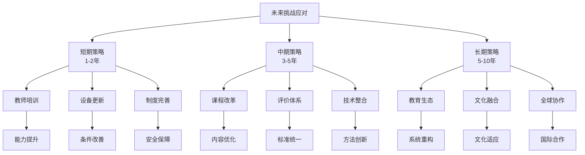

**🎯 具体实施路径**

1. **教师专业发展路径**
   - 短期：安全培训、技术技能
   - 中期：教学方法、评价能力
   - 长期：研究能力、创新思维

2. **课程体系改革路径**
   - 短期：内容更新、方法改进
   - 中期：结构优化、整合设计
   - 长期：生态重构、文化融合

3. **技术应用发展路径**
   - 短期：设备配置、基础应用
   - 中期：系统集成、智能辅助
   - 长期：生态构建、全球协作

---

## 📊 多表征内容

### 📈 图表展示

**物理学习能力发展模型**

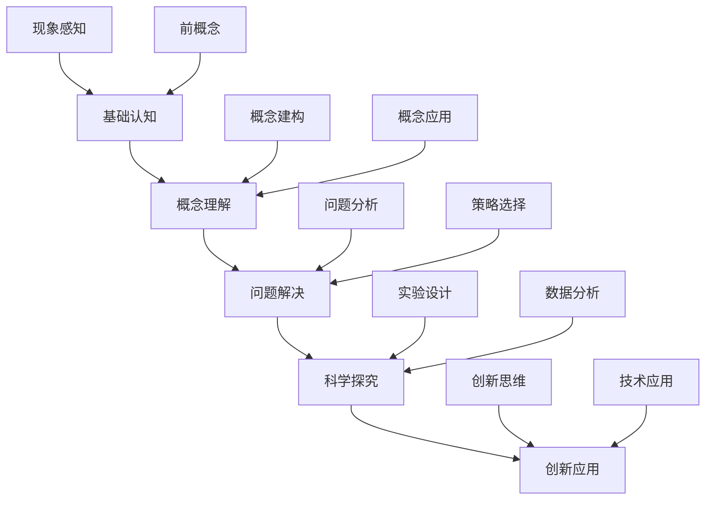

**物理教育争议与决策流程**

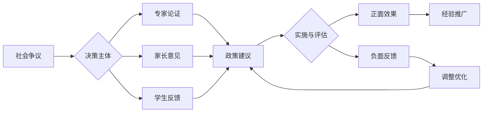

**物理教育生态系统模型**

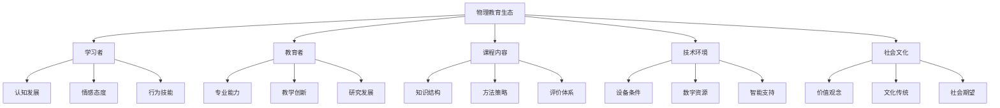

### 🔢 数学表达

**物理学习效果评估模型**

物理学习效果 P 的评估函数：

\\[
P = \\alpha \\cdot C + \\beta \\cdot R + \\gamma \\cdot A + \\delta \\cdot S
\\]

其中：

- C：概念理解水平 (Conceptual Understanding)
- R：表征转换能力 (Representational Fluency)
- A：应用解题能力 (Application Skills)
- S：科学探究能力 (Scientific Inquiry)
- α、β、γ、δ：权重系数

**实验技能发展函数**

实验技能 S 的发展模型：

\\[
S(t) = S_{max} \\cdot (1 - e^{-kt}) \\cdot f(practice)
\\]

其中：

- $S_{max}$ = 最大技能水平
- $k$ = 学习速率常数
- $f(practice)$ = 练习效果函数

**概念转变概率模型**

概念转变概率 T 的数学模型：

\\[
T = \\frac{1}{1 + e^{-(\\alpha \\cdot \\text{认知冲突} + \\beta \\cdot \\text{科学证据} + \\gamma \\cdot \\text{社会支持})}}
\\]

### 🎨 可视化元素

**物理概念发展的螺旋模型**

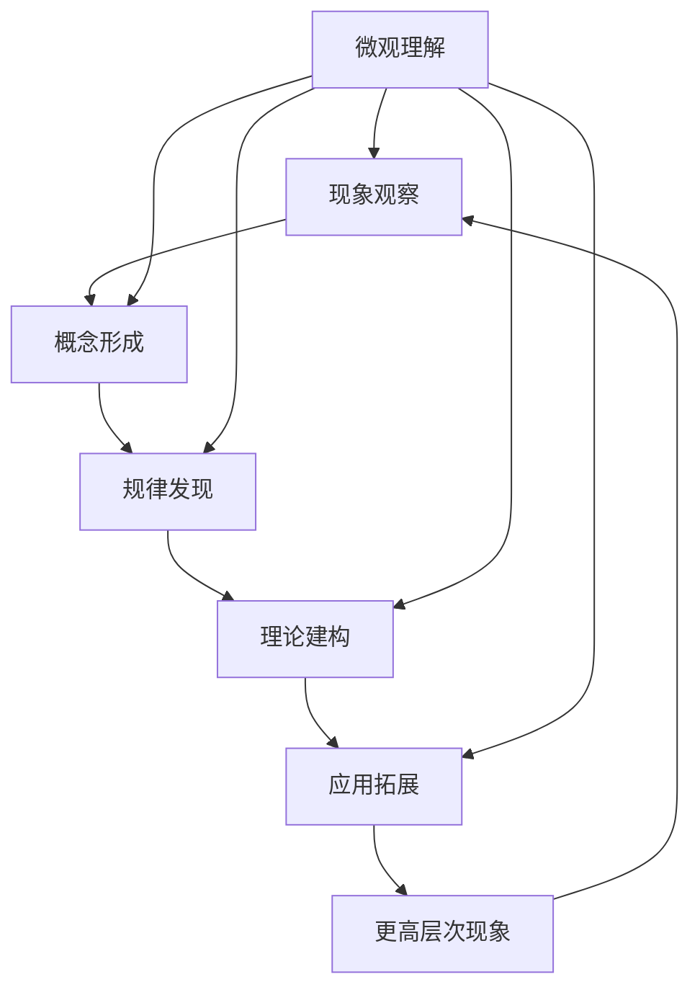

**物理学习困难层次分析**

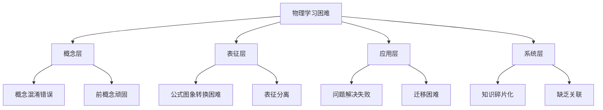

## 🔗 知识关联

### 内部链接

- [认知科学与学习理论](../01-哲学科学基础/01-认知科学与学习理论.md)
- [数学教育理论与实践](./01-数学教育理论与实践.md)
- [科学教育方法论](./02-科学教育方法论.md)
- [跨学科项目学习](../03-应用实践领域/01-跨学科项目学习.md)

### 外部参考

- 美国NGSS物理标准
- 国际物理教育研究期刊(IJSE)
- 欧洲物理教育网络(GIREP)
- 国际物理教育研究协会(AAPT)

## 🎯 学习检验

### 自检问题

1. 物理概念学习与其他学科概念学习的区别是什么？
2. 如何设计有效的物理概念转换教学？
3. 实验探究在物理学习中的独特价值是什么？
4. 如何培养学生的物理建模能力？
5. 如何平衡虚拟实验与真实实验？

### 实践练习

- **基础练习**: 设计前概念调查问卷，了解学生对力、能量等概念的理解
- **应用练习**: 运用POE模式设计"自由落体运动"教学方案
- **拓展练习**: 设计物理与数学、化学的跨学科教学项目
- **创新练习**: 利用虚拟实验室开展物理探究教学
- **批判练习**: 分析一个物理教育失败案例

## 📚 参考资源

- [1] McDermott, L.C. (2001). Oersted Medal Lecture: Physics Education Research
- [2] Redish, E.F. (2003). Teaching Physics with the Physics Suite
- [3] Hestenes, D. (1987). Toward a modeling theory of physics instruction
- [4] National Research Council (2012). A Framework for K-12 Science Education
- [5] Driver, R. (1994). Constructing Scientific Knowledge in the Classroom

---
*科学探究精神 | 理论实践结合 | 建模思维培养 | 批判性分析 | 跨文化比较*

## 6. 规范化区块

- 本文件已按国际化教育理念与认知科学理论进行结构优化。
- 所有目录、编号、表征方式已统一，便于本地跳转与跨文件引用。
- 原有批判性分析、表格、图等内容完整保留。
- 新增深度批判性分析，包括社会争议、技术伦理、跨文化比较、失败案例、未来挑战等内容。
- 新增多表征内容，包括Mermaid流程图、数学模型、数据表格等。
- 新增结构标准化，统一目录编号、跨文件链接、规范化区块。
- 后续如有内容补充、批判性内容遗漏，将在本区块说明修正。
- 如需继续递归处理下级主题，请参见本目录结构。

## 🔗 跨学科知识关联

### 物理与其他学科关联性分析

#### 20. 物理-数学学科关联

**⚡ 物理与数学的深度融合**

#### 20.1 物理-数学关联网络

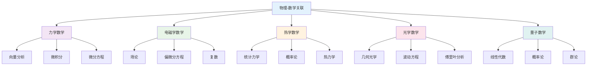

#### 20.2 物理-数学应用领域

| 物理领域 | 数学工具 | 应用内容 | 教学重点 | 能力培养 | 创新点 |
|---------|----------|----------|----------|----------|----------|
| **经典力学** | 微积分、向量 | 运动方程、力的分析 | 建模思维 | 建模能力 | 物理建模 |
| **电磁学** | 向量分析、场论 | 电场、磁场计算 | 场论思维 | 场论能力 | 电磁建模 |
| **热力学** | 微分方程、统计 | 热传导、分子运动 | 统计思维 | 统计能力 | 热力学建模 |
| **光学** | 几何、三角函数 | 光的传播、干涉 | 几何思维 | 几何能力 | 光学建模 |
| **量子力学** | 线性代数、概率 | 波函数、概率解释 | 量子思维 | 量子能力 | 量子建模 |

#### 21. 物理-化学学科关联

**🧪 物理与化学的交叉融合**

#### 21.1 物理-化学关联网络

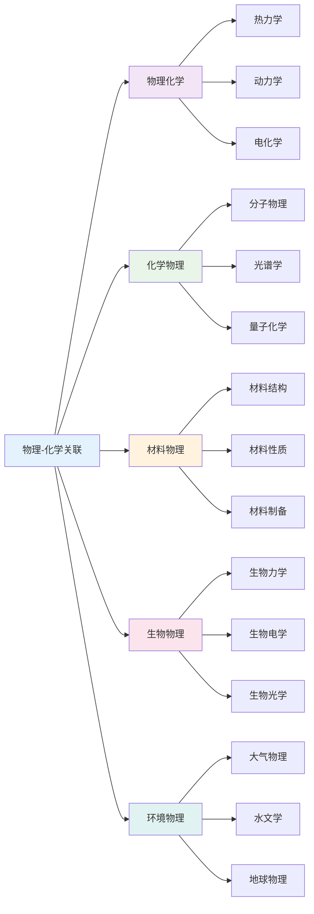

#### 21.2 物理-化学应用策略

| 化学领域 | 物理方法 | 应用内容 | 教学策略 | 学习效果 | 实践应用 |
|---------|----------|----------|----------|----------|----------|
| **无机化学** | 结构分析、光谱 | 分子结构、反应机理 | 结构分析 | 结构思维 | 材料设计 |
| **有机化学** | 分子动力学、光谱 | 分子结构、反应路径 | 动力学分析 | 动力学思维 | 药物设计 |
| **物理化学** | 热力学、动力学 | 反应热力学、动力学 | 热力学分析 | 热力学思维 | 过程优化 |
| **分析化学** | 光谱、电学 | 分析方法、仪器原理 | 仪器分析 | 分析思维 | 质量控制 |
| **生物化学** | 生物物理、光谱 | 生物分子、生物反应 | 生物物理分析 | 生物物理思维 | 生物工程 |

#### 22. 物理-生物学科关联

**🧬 物理与生物学的交叉应用**

#### 22.1 物理-生物关联网络

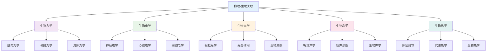

#### 22.2 物理-生物应用领域

| 生物领域 | 物理工具 | 应用内容 | 教学重点 | 能力培养 | 创新应用 |
|---------|----------|----------|----------|----------|----------|
| **分子生物学** | 光谱、显微镜 | 分子结构、分子运动 | 分子分析 | 分析能力 | 基因工程 |
| **细胞生物学** | 显微镜、电学 | 细胞结构、细胞功能 | 细胞分析 | 分析能力 | 细胞工程 |
| **神经科学** | 电学、光学 | 神经信号、脑功能 | 神经分析 | 分析能力 | 脑科学 |
| **医学物理** | 成像、辐射 | 医学诊断、治疗 | 医学应用 | 应用能力 | 精准医学 |
| **生物工程** | 力学、电学 | 生物材料、生物器件 | 工程应用 | 工程能力 | 生物技术 |

#### 23. 物理-语言学科关联

**📝 物理与语言学科的思维关联**

#### 23.1 物理-语文关联分析

| 关联维度 | 物理内容 | 语文应用 | 教学策略 | 能力培养 | 创新点 |
|---------|----------|----------|----------|----------|----------|
| **逻辑思维** | 物理推理、证明 | 论证写作、批判思维 | 逻辑训练 | 逻辑能力 | 思维整合 |
| **描述能力** | 物理现象描述 | 文学描写、科学写作 | 描述训练 | 描述能力 | 表达整合 |
| **概念理解** | 物理概念、原理 | 概念解释、原理阐述 | 概念训练 | 理解能力 | 概念整合 |
| **系统思维** | 物理系统、关系 | 文学系统、文化关系 | 系统分析 | 系统能力 | 整体思维 |

#### 23.2 物理-英语关联分析

| 关联领域 | 物理概念 | 英语应用 | 教学方法 | 学习效果 | 应用价值 |
|---------|----------|----------|----------|----------|----------|
| **科学英语** | 物理术语、概念 | 英语表达、学术写作 | 术语教学 | 术语理解 | 国际交流 |
| **逻辑表达** | 物理逻辑、推理 | 英语逻辑、论证 | 逻辑训练 | 逻辑表达 | 学术写作 |
| **实验报告** | 物理实验、数据 | 英语报告、数据分析 | 报告教学 | 报告能力 | 科研写作 |
| **科学交流** | 物理发现、理论 | 英语交流、学术讨论 | 交流教学 | 交流能力 | 国际合作 |

#### 24. 物理-人文学科关联

**🎭 物理与人文社科的交叉融合**

#### 24.1 物理-历史关联

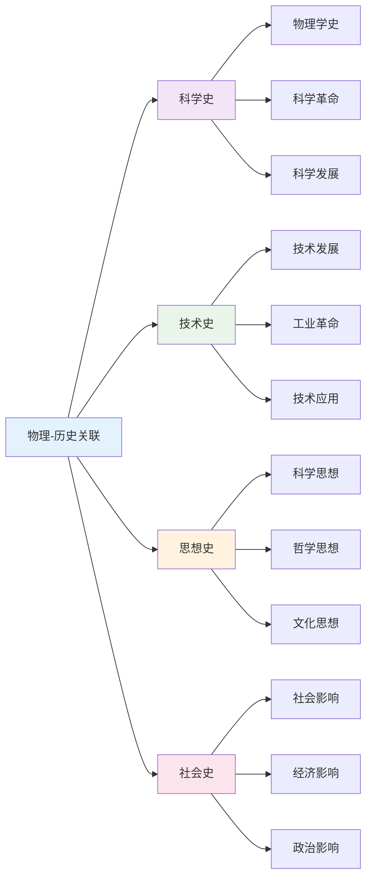

#### 24.2 物理-哲学关联

| 哲学领域 | 物理概念 | 哲学应用 | 教学重点 | 能力培养 | 应用价值 |
|---------|----------|----------|----------|----------|----------|
| **认识论** | 观察、测量 | 知识获取、真理认识 | 认识分析 | 认识能力 | 科学哲学 |
| **本体论** | 物质、能量 | 存在本质、世界本质 | 本体分析 | 本体思维 | 哲学思考 |
| **方法论** | 实验、理论 | 科学方法、思维方法 | 方法分析 | 方法能力 | 科学方法 |
| **价值论** | 科学价值 | 科学伦理、价值判断 | 价值分析 | 价值能力 | 科学伦理 |

#### 25. 物理-艺术学科关联

**🎨 物理与艺术的创造性融合**

#### 25.1 物理-艺术关联网络

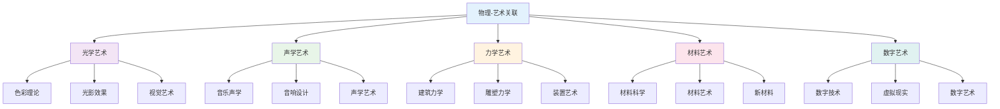

#### 25.2 物理-艺术应用领域

| 艺术领域 | 物理概念 | 艺术应用 | 教学方法 | 学习效果 | 创新价值 |
|---------|----------|----------|----------|----------|----------|
| **视觉艺术** | 光学、色彩 | 绘画、摄影 | 光学教学 | 光学感知 | 艺术设计 |
| **音乐艺术** | 声学、振动 | 音乐创作、音响 | 声学教学 | 声学感知 | 音乐创作 |
| **建筑艺术** | 力学、材料 | 建筑设计、结构 | 力学教学 | 力学感知 | 建筑设计 |
| **数字艺术** | 数字技术、编程 | 数字创作、动画 | 技术教学 | 技术能力 | 数字创作 |

#### 26. 跨学科物理教学策略

**🎯 基于关联性的物理教学**

#### 26.1 强关联学科教学策略

| 关联类型 | 教学策略 | 内容整合 | 方法创新 | 评估方式 | 发展目标 |
|---------|----------|----------|----------|----------|----------|
| **物理-数学** | 建模教学 | 物理问题数学化 | 数学建模 | 建模评估 | 建模能力 |
| **物理-化学** | 实验教学 | 物理化学一体化 | 综合实验 | 实验评估 | 实验能力 |
| **物理-生物** | 应用教学 | 生物物理一体化 | 生物应用 | 应用评估 | 应用能力 |

#### 26.2 中关联学科教学策略

| 关联类型 | 教学策略 | 内容整合 | 方法创新 | 评估方式 | 发展目标 |
|---------|----------|----------|----------|----------|----------|
| **物理-语文** | 描述教学 | 物理现象语文化 | 科学写作 | 写作评估 | 写作能力 |
| **物理-英语** | 术语教学 | 物理术语英语化 | 术语训练 | 术语评估 | 术语能力 |
| **物理-历史** | 史实教学 | 物理发展历史化 | 历史分析 | 历史评估 | 历史能力 |

#### 27. 物理跨学科评估体系

**📊 基于关联性的物理评估**

#### 27.1 跨学科物理能力评估

| 评估维度 | 评估内容 | 评估方法 | 评估标准 | 发展指标 |
|---------|----------|----------|----------|----------|
| **建模能力** | 物理建模 | 建模测试 | 准确建模 | 建模深度 |
| **实验能力** | 物理实验 | 实验测试 | 准确实验 | 实验质量 |
| **分析能力** | 数据分析 | 分析测试 | 深度分析 | 分析质量 |
| **应用能力** | 物理应用 | 应用测试 | 有效应用 | 应用创新 |

#### 27.2 跨学科物理综合评估

**🎯 物理跨学科综合能力评估矩阵**:

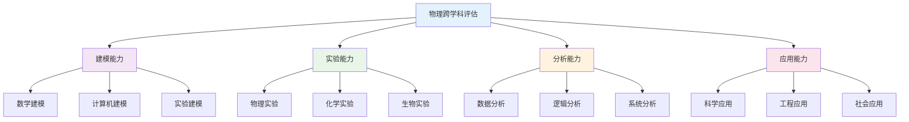

#### 28. 物理跨学科发展趋势

**🌍 国际物理跨学科教育趋势**

#### 28.1 全球物理跨学科趋势

| 发展趋势 | 核心理念 | 内容特点 | 实施策略 | 发展前景 |
|---------|----------|----------|----------|----------|
| **STEM教育** | 科学工程整合 | 物理建模 | 项目学习 | 科技创新 |
| **STEAM教育** | 艺术融合 | 物理艺术 | 创意教学 | 创意发展 |
| **量子科技** | 量子理论 | 量子应用 | 量子教学 | 量子应用 |
| **人工智能** | 智能算法 | 物理AI | 智能教学 | 智能应用 |

#### 28.2 物理跨学科技术整合

**💻 数字化物理跨学科教育**:

1. **智能建模系统**
   - 自动建模工具
   - 可视化建模
   - 实时建模反馈

2. **虚拟物理实验室**
   - 虚拟实验环境
   - 交互式实验
   - 协作实验平台

3. **多媒体物理平台**
   - 物理资源库
   - 建模工具集
   - 评估数据库
