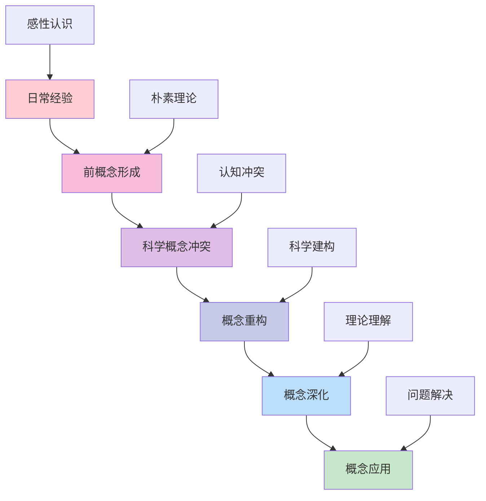
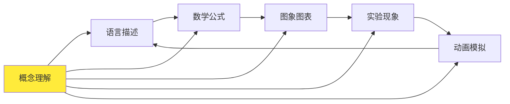
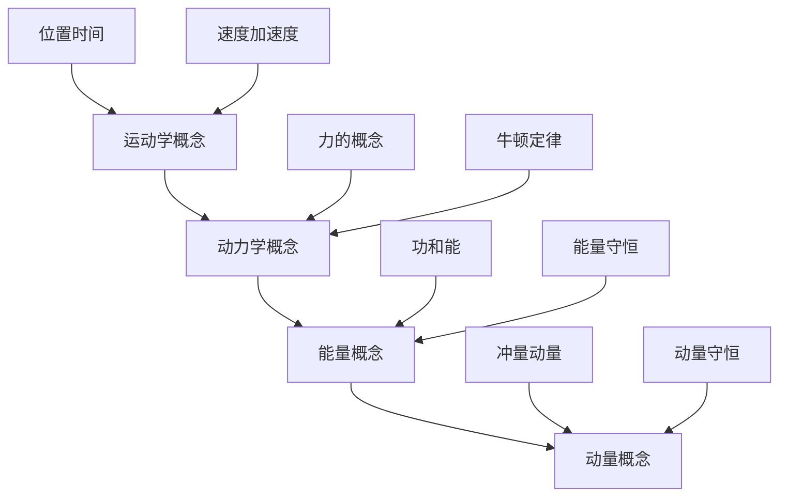
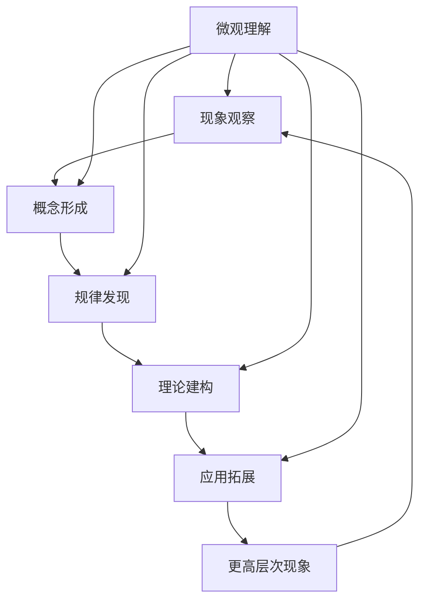

# 05 物理教育理论与实践

## 📖 概述

- **定义**: 物理教育理论与实践是基于认知科学和物理学科特点，培养学生物理概念理解、科学推理能力和实验探究技能的教育体系
- **范围**: 涵盖物理概念建构、数学建模、实验探究、科学论证、跨学科应用等多个维度
- **学习目标**:
  - 理解物理概念的抽象性和数学表达特点
  - 掌握基于探究的物理教学方法
  - 培养科学推理和建模能力
  - 建立物理与生活、技术的联系
- **先修知识**: [认知科学与学习理论](../01-哲学科学基础/01-认知科学与学习理论.md)、[数学教育理论与实践](./01-数学教育理论与实践.md)、[科学教育方法论](./02-科学教育方法论.md)

## 🏗️ 知识架构

### 1. 理论基础

#### 1.1 物理认知的特殊性

**🧠 物理概念学习的认知机制**

| 认知特征 | 物理表现 | 学习挑战 | 教学策略 |
|---------|----------|----------|----------|
| **抽象建模** | 理想化物理模型 | 从具体到抽象的跨越 | 概念转换支架 |
| **数学表达** | 公式与图象结合 | 数学符号意义理解 | 多表征转换 |
| **因果推理** | 物理现象解释 | 表面现象与本质规律 | 科学论证框架 |
| **系统思维** | 相互作用分析 | 多因素关联思考 | 概念图构建 |

#### 1.2 物理概念发展阶段

**🔄 物理概念学习的发展轨迹**



#### 1.3 国际物理教育理念比较

**🌍 主要国家物理教育特色**

| 国家/地区 | 教育理念 | 课程特点 | 评估方式 | 核心优势 |
|---------|----------|----------|----------|----------|
| **美国** | 探究为本 | NGSS标准 | 实践评估 | 科学工程实践 |
| **英国** | 概念理解 | A-level体系 | 理论实验并重 | 深度学习 |
| **德国** | 系统思维 | 理论严谨 | 概念应用 | 逻辑建构 |
| **新加坡** | 应用导向 | 21世纪技能 | 真实情境 | 实际问题解决 |
| **法国** | 数理结合 | 数学基础强 | 推理论证 | 理论深度 |

### 2. 教学方法与策略

#### 2.1 基于建构的概念教学

**🏗️ POE (Predict-Observe-Explain) 教学模式**

| 阶段 | 学生活动 | 教师引导 | 认知过程 | 评估要点 |
|------|----------|----------|----------|----------|
| **预测** | 基于已有知识预测现象 | 激发前概念表达 | 激活先验知识 | 预测合理性 |
| **观察** | 仔细观察实验现象 | 引导观察要点 | 数据收集处理 | 观察准确性 |
| **解释** | 分析现象解释原因 | 引导科学论证 | 概念建构应用 | 解释科学性 |

#### 2.2 多表征物理教学

**🎨 物理概念的多重表征转换**



**📊 表征转换能力发展**

| 表征类型 | 特点 | 教学应用 | 学习要求 |
|---------|------|----------|----------|
| **文字描述** | 定性分析 | 现象解释 | 语言准确性 |
| **数学公式** | 定量关系 | 计算推导 | 符号理解 |
| **图象图表** | 关系展示 | 数据分析 | 图象读取 |
| **实验操作** | 直观验证 | 动手探究 | 技能掌握 |
| **模拟动画** | 微观展示 | 过程理解 | 模型建构 |

#### 2.3 物理实验探究教学

**🔬 实验探究的认知价值**

1. **技能发展**
   - 实验设计能力
   - 数据处理技能
   - 误差分析方法

2. **概念理解**
   - 通过实验验证理论
   - 发现物理规律
   - 理解测量本质

3. **科学素养**
   - 科学方法掌握
   - 证据意识培养
   - 质疑精神发展

### 3. 实践应用

#### 3.1 核心概念教学设计

**⚡ 力学概念体系构建**



**🌊 电磁学概念网络**

| 核心概念 | 基础概念 | 关联概念 | 应用领域 |
|---------|----------|----------|----------|
| **电场** | 电荷、库仑定律 | 电势、电势能 | 静电现象 |
| **磁场** | 磁性、磁感线 | 磁通量、电磁感应 | 电机原理 |
| **电磁波** | 变化电磁场 | 频率、波长 | 通信技术 |

#### 3.2 问题解决教学策略

**🎯 物理问题解决四步法**

```
1. 理解问题 → 明确已知未知、建立物理情境
2. 分析问题 → 选择物理规律、建立数学模型  
3. 求解问题 → 数学计算处理、单位量纲检验
4. 检验结果 → 物理意义判断、合理性分析
```

**📈 问题解决能力发展模型**

\\[
P(t) = P_0 + A \\cdot e^{-\\frac{(t-t_0)^2}{2\\sigma^2}} + B \\cdot \\log(1 + C \\cdot t)
\\]

其中：

- $P(t)$ = t时刻的问题解决能力
- $P_0$ = 初始能力基线
- $A$ = 概念理解贡献
- $B$ = 练习积累贡献
- $C$ = 学习效率参数

## 🔗 知识关联

### 内部链接

- [数学教育理论与实践](./01-数学教育理论与实践.md) - 数学工具应用
- [科学教育方法论](./02-科学教育方法论.md) - 科学探究方法
- [跨学科项目学习](../03-应用实践领域/01-跨学科项目学习.md) - STEAM整合

### 外部参考

- 美国NGSS物理标准
- 国际物理教育研究期刊(IJSE)
- 欧洲物理教育网络(GIREP)

## 🎯 学习检验

### 自检问题

1. 物理概念学习与其他学科概念学习的区别是什么？
2. 如何设计有效的物理概念转换教学？
3. 实验探究在物理学习中的独特价值是什么？
4. 如何培养学生的物理建模能力？

### 实践练习

#### 基础练习

- **概念诊断**: 设计前概念调查问卷，了解学生对力、能量等概念的理解
- **表征转换**: 选择一个物理概念，设计多表征教学活动
- **实验设计**: 为牛顿第二定律设计探究性实验

#### 应用练习  

- **教学设计**: 运用POE模式设计"自由落体运动"教学方案
- **问题分析**: 分析学生在电路概念学习中的常见困难及解决策略
- **评估工具**: 设计物理建模能力的评估量表

#### 拓展练习

- **跨学科整合**: 设计物理与数学、化学的跨学科教学项目
- **技术应用**: 利用虚拟实验室开展物理探究教学
- **国际比较**: 比较中美英三国高中物理课程的异同

## 📊 多表征内容

### 📈 图表展示

**物理学习困难层次分析**

| 困难层次 | 具体表现 | 认知原因 | 教学对策 |
|---------|----------|----------|----------|
| **概念层** | 概念混淆错误 | 前概念顽固 | 概念转换教学 |
| **表征层** | 公式图象转换困难 | 表征分离 | 多表征整合 |
| **应用层** | 问题解决失败 | 迁移困难 | 变式练习 |
| **系统层** | 知识碎片化 | 缺乏关联 | 概念图构建 |

### 🔢 数学表达

**物理学习效果评估模型**

设学生的物理理解度为 $U$，包含四个维度：

\\[
U = w_1 \\cdot C + w_2 \\cdot R + w_3 \\cdot A + w_4 \\cdot S
\\]

其中：

- $C$ = 概念理解水平 (Conceptual Understanding)
- $R$ = 表征转换能力 (Representational Fluency)  
- $A$ = 应用解题能力 (Application Skills)
- $S$ = 系统整合思维 (Systems Thinking)
- $w_i$ = 权重系数，$\\sum w_i = 1$

**实验技能发展函数**：

\\[
S(t) = S_{max} \\cdot (1 - e^{-kt}) \\cdot f(practice)
\\]

其中 $k$ 为学习速率常数，$f(practice)$ 为练习效果函数。

### 🎨 可视化元素

**物理概念发展的螺旋模型**



## 📚 参考资源

### 核心文献

- [1] McDermott, L.C. (2001). Oersted Medal Lecture: Physics Education Research
- [2] Redish, E.F. (2003). Teaching Physics with the Physics Suite
- [3] Hestenes, D. (1987). Toward a modeling theory of physics instruction

### 国际标准

- Next Generation Science Standards (NGSS) - 美国
- A-level Physics Specification - 英国
- International Baccalaureate Physics - 国际文凭

### 专业期刊

- Physics Education Research (PER)
- American Journal of Physics
- The Physics Teacher

---
*科学探究精神 | 理论实践结合 | 建模思维培养*
