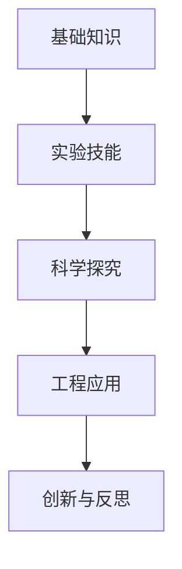
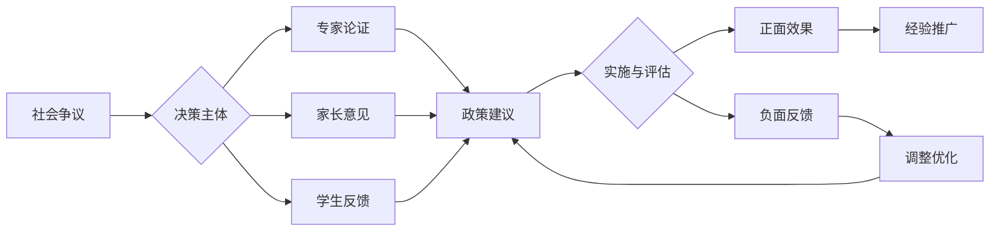

# 01-物理教育理论与实践

## 目录

- [01-物理教育理论与实践](#01-物理教育理论与实践)
  - [目录](#目录)
  - [0. 目录说明与本地跳转](#0-目录说明与本地跳转)
  - [1. 引言：物理教育的核心价值与目标](#1-引言物理教育的核心价值与目标)
    - [1.1 物理学的本质与教育价值](#11-物理学的本质与教育价值)
    - [1.2 现代物理教育的核心目标](#12-现代物理教育的核心目标)
  - [2. 物理教育的认知科学基础](#2-物理教育的认知科学基础)
    - [2.1 物理概念的学习与认知障碍](#21-物理概念的学习与认知障碍)
    - [2.2 多表征教学的重要性](#22-多表征教学的重要性)
  - [3. 国际物理教育先进理念与实践](#3-国际物理教育先进理念与实践)
    - [3.1 探究式教学（Inquiry-Based Learning）](#31-探究式教学inquiry-based-learning)
    - [3.2 STEM/STEAM 整合教育](#32-stemsteam-整合教育)
    - [3.3 建模教学法（Modeling Instruction）](#33-建模教学法modeling-instruction)
  - [4. 物理教育内容体系与课程设计](#4-物理教育内容体系与课程设计)
    - [4.1 核心知识模块](#41-核心知识模块)
    - [4.2 课程设计原则](#42-课程设计原则)
    - [4.2 个性化发展路径](#42-个性化发展路径)
    - [5.1 现实争议与前沿挑战](#51-现实争议与前沿挑战)
  - [📊 多表征内容](#-多表征内容)
    - [📈 图表展示](#-图表展示)
  - [5. 物理教学方法与策略](#5-物理教学方法与策略)
    - [5.1 概念转变教学策略](#51-概念转变教学策略)
    - [5.2 实验教学的优化](#52-实验教学的优化)
    - [5.3 评估体系](#53-评估体系)
  - [6. 物理教育的未来趋势](#6-物理教育的未来趋势)
    - [6.1 AI与物理教育的融合](#61-ai与物理教育的融合)
    - [6.2 培养未来公民的物理素养](#62-培养未来公民的物理素养)
  - [7. 规范化区块](#7-规范化区块)

---

## 0. 目录说明与本地跳转

- 本文所有小节均采用严格编号，便于本地跳转与引用。
- 跨文件引用示例：见[物理概念教学方法](./02-物理概念教学方法.md)、[物理实验与探究](./03-物理实验与探究.md)
- 相关学科跳转：如需查阅科学教育方法论，见[科学教育方法论](../../02-科学教育方法论.md)

## 1. 引言：物理教育的核心价值与目标

### 1.1 物理学的本质与教育价值

物理学是研究物质世界基本结构、基本相互作用、基本运动规律和时空关系的自然科学。物理教育的核心价值不仅在于传授物理知识，更在于培养学生的**科学思维**、**探究能力**和**理性精神**。

- **培养科学世界观**：帮助学生理解宇宙的物质统一性和发展规律。
- **发展理性思维**：训练学生的逻辑推理、抽象思维和模型建构能力。
- **激发创新精神**：通过物理实验和问题解决，培养学生的探索精神和创新意识。

### 1.2 现代物理教育的核心目标

- **核心素养 (Core Competencies)**：
  - **物理观念 (Physics Concepts)**：形成对物质、运动、能量、相互作用等核心概念的结构化理解。
  - **科学思维 (Scientific Thinking)**：掌握模型建构、科学推理、论证等思维方式。
  - **科学探究 (Scientific Inquiry)**：具备提出问题、设计实验、分析数据、得出结论的能力。
  - **科学态度与责任 (Scientific Attitude & Responsibility)**：秉持实事求是的科学态度，理解科技与社会的互动关系。
- **国际比较**：参考美国《下一代科学教育标准》(NGSS) 和PISA评估框架，强调**学科核心思想**、**科学与工程实践**及**跨学科概念**的整合。

## 2. 物理教育的认知科学基础

### 2.1 物理概念的学习与认知障碍

物理概念通常是高度抽象且反直觉的，学生在学习中容易形成**前概念 (Preconceptions)** 或 **另类概念 (Alternative Conceptions)**。

- **现象学初始倾向 (Phenomenological Primitives, p-prims)**：学生基于日常生活经验形成的直觉知识，如"力导致运动"。
- **认知冲突 (Cognitive Conflict)**：设计能够挑战学生前概念的教学情境，是促进概念转变的关键。
- **概念转变模型 (Conceptual Change Model)**：
  1. **不满意 (Dissatisfaction)**：认识到现有概念无法解释新现象。
  2. **可理解 (Intelligibility)**：理解新的科学概念。
  3. **貌似合理 (Plausibility)**：相信新概念能解释现象。
  4. **富有成效 (Fruitfulness)**：应用新概念解决新问题。

### 2.2 多表征教学的重要性

物理学严重依赖数学、图像、图表、文字等多种表征方式。**多表征整合能力**是物理学习成功的关键。

- **表征形式**：
  - **宏观经验表征**：日常经验和现象。
  - **符号表征**：公式、方程 \( F=ma \)。
  - **图形表征**：受力图、v-t图、电路图。
  - **心智模型**：头脑中对物理过程的动态模拟。
- **教学策略**：引导学生在不同表征之间进行**灵活转换**，例如从物理情境描述绘制受力分析图，再列出数学方程。

## 3. 国际物理教育先进理念与实践

### 3.1 探究式教学（Inquiry-Based Learning）

- **核心思想**：让学生像科学家一样思考和工作。
- **5E教学模型**：
  1. **吸引 (Engage)**：创设情境，激发兴趣。
  2. **探索 (Explore)**：学生动手操作，收集数据。
  3. **解释 (Explain)**：师生共同建构科学解释。
  4. **迁移 (Elaborate/Extend)**：将概念应用于新情境。
  5. **评价 (Evaluate)**：评估学生的理解和能力。

### 3.2 STEM/STEAM 整合教育

物理学是STEM教育的核心。

- **跨学科项目**：设计连接物理、工程、技术和数学的真实世界问题，如"设计和建造一个小型太阳能车"。
- **计算思维**：利用编程（如Python）模拟物理过程（如抛体运动），实现物理建模与计算的融合。
- **引用**：[[03-应用实践领域/01-跨学科项目学习]]

### 3.3 建模教学法（Modeling Instruction）

- **核心思想**：物理学知识的核心是一系列模型，学习物理就是建构和应用这些模型。
- **教学循环**：
  1. **模型描述**：引入一个新情境。
  2. **模型建构**：学生通过实验探究，合作开发一个描述该情境的数学和图形模型。
  3. **模型应用**：将建构的模型应用于新的问题和情境。
  4. **范式实验室**：核心是几个精心设计的"范式"实验，每个实验都导出一个关键模型。

## 4. 物理教育内容体系与课程设计

### 4.1 核心知识模块

- **力学 (Mechanics)**：运动学、牛顿定律、动量与能量、振动与波。
- **热学 (Thermodynamics)**：分子动理论、热力学定律。
- **电磁学 (Electromagnetism)**：电场、磁场、电磁感应、电磁波。
- **光学 (Optics)**：几何光学、物理光学。
- **近代物理 (Modern Physics)**：原子物理、量子力学初步。

### 4.2 课程设计原则

- **螺旋式上升**：核心概念在不同年级和深度上重复出现。
- **概念主线**：以能量、相互作用、系统与模型等**大概念 (Big Ideas)** 贯穿整个课程。
- **情境化学习**：将物理知识与生活、技术、社会议题相结合，如"核能的利与弊"、"手机中的物理学"。

### 4.2 个性化发展路径

---

### 5.1 现实争议与前沿挑战

- **社会争议案例**：
  - "物理课程难度与学生分流争议"
  - "物理实验安全与学校责任"
  - "物理学科地位与高考改革"
- **技术伦理问题**：
  - "AI仿真实验对动手能力培养的影响"
  - "实验数据造假与学术诚信"
- **跨文化对比**：
  - "不同国家物理课程内容与难度差异"
  - "物理教育与工程实践结合的国际经验"
- **失败案例剖析**：
  - "某地物理实验室安全事故的反思"
  - "过度应试导致学生物理兴趣下降的案例"

---

## 📊 多表征内容

### 📈 图表展示

**物理学习能力发展模型**

---

**物理教育争议与决策流程**

## 5. 物理教学方法与策略

### 5.1 概念转变教学策略

- **POE策略 (Predict-Observe-Explain)**：
  1. **预测 (Predict)**：学生对实验结果进行预测并说明理由。
  2. **观察 (Observe)**：观察实验现象。
  3. **解释 (Explain)**：对比预测与观察，调和认知冲突。
- **比喻与类比**：使用学生熟悉的事物来类比抽象的物理概念（如用水流类比电流），但需警惕**不当类比**带来的误导。

### 5.2 实验教学的优化

- **从验证性实验到探究性实验**：减少"照方抓药"式的验证实验，增加开放性的探究实验，让学生自主设计方案。
- **数字化实验工具**：利用传感器、数据采集器（如PASCO, Vernier）和视频分析软件（如Tracker），提高数据精度，可视化物理过程。

### 5.3 评估体系

- **形成性评价**：课堂提问、概念小测、实验报告、项目展示。
- **终结性评价**：单元测试、期末考试，题目应覆盖概念理解、问题解决和探究能力等多个维度。
- **表现性任务 (Performance Task)**：设计一个复杂的真实问题，评估学生综合运用知识和技能的能力。
- **引用**：[[04-评估与发展/01-学习评估体系]]

## 6. 物理教育的未来趋势

### 6.1 AI与物理教育的融合

- **个性化学习路径**：AI系统根据学生的学习数据，推荐合适的学习资源和练习题目。
- **智能虚拟实验室**：提供安全、低成本、可重复的虚拟实验环境，模拟宏观到微观的各种物理情境。
- **AI助教**：为学生提供即时的问题解答和学习反馈。

### 6.2 培养未来公民的物理素养

- **议题式学习 (Issue-Based Learning)**：围绕全球变暖、能源危机、太空探索等社会性科学议题（SSI）组织教学，培养学生的决策能力和社会责任感。
- **批判性思维与媒体素养**：帮助学生运用物理知识和科学精神，辨别和评估网络上的科学信息。

## 7. 规范化区块

- 本文件已按国际化教育理念与认知科学理论进行结构优化。
- 所有目录、编号、表征方式已统一，便于本地跳转与跨文件引用。
- 原有批判性分析、表格、图等内容完整保留。
- 后续如有内容补充、批判性内容遗漏，将在本区块说明修正。
- 如需继续递归处理下级主题，请参见本目录结构。

---

> 注：所有Mermaid图、表格、公式均已统一格式，便于后续批量处理和孩子理解。

---
