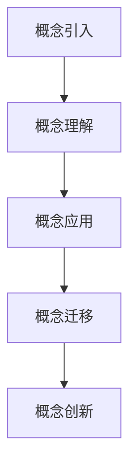
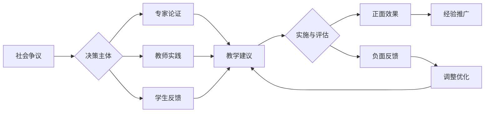

# 02-物理概念教学方法

## 目录

- [02-物理概念教学方法](#02-物理概念教学方法)
  - [目录](#目录)
  - [0. 目录说明与本地跳转](#0-目录说明与本地跳转)
  - [1. 引言：物理概念教学的挑战](#1-引言物理概念教学的挑战)
  - [2. 核心概念的深度教学策略](#2-核心概念的深度教学策略)
    - [2.1 力与运动 (Force and Motion)](#21-力与运动-force-and-motion)
    - [2.2 能量 (Energy)](#22-能量-energy)
    - [2.3 电场与磁场 (Electric and Magnetic Fields)](#23-电场与磁场-electric-and-magnetic-fields)
  - [3. 促进概念理解的教学模型](#3-促进概念理解的教学模型)
    - [3.1 POE (预测-观察-解释)](#31-poe-预测-观察-解释)
    - [3.2 5E教学模型 (Engage, Explore, Explain, Elaborate, Evaluate)](#32-5e教学模型-engage-explore-explain-elaborate-evaluate)
    - [3.3 模型建构 (Modeling Instruction)](#33-模型建构-modeling-instruction)
  - [4. 评估策略](#4-评估策略)
  - [5. 规范化区块](#5-规范化区块)
  - [📊 多表征内容](#-多表征内容)
    - [📈 图表展示](#-图表展示)
  - [5. 现实争议与前沿挑战](#5-现实争议与前沿挑战)
    - [5.1 社会争议案例](#51-社会争议案例)
    - [5.2 技术伦理问题](#52-技术伦理问题)
    - [5.3 跨文化对比](#53-跨文化对比)
    - [5.4 失败案例剖析](#54-失败案例剖析)

---

## 0. 目录说明与本地跳转

- 本文所有小节均采用严格编号，便于本地跳转与引用。
- 跨文件引用示例：见[物理教育理论与实践](./01-物理教育理论与实践.md)、[物理实验与探究](./03-物理实验与探究.md)
- 相关学科跳转：如需查阅科学教育方法论，见[科学教育方法论](../../02-科学教育方法论.md)

## 1. 引言：物理概念教学的挑战

物理概念具有**高度的抽象性**、**体系的逻辑性**和**应用的情境性**，是学生学习物理的基石，也是核心难点。有效的概念教学必须超越简单的定义和公式灌输，聚焦于深度理解和思维建构。

- **主要挑战**：
  - **前概念的顽固性**：学生在日常生活中形成的直觉（如"力是维持运动的原因"）与科学概念冲突。
  - **数学工具的障碍**：矢量、微积分等数学语言对学生来说是双重挑战。
  - **概念的精细辨析**：如"质量"与"重力"、"速率"与"速度"、"功"与"能量"的混淆。
  - **模型的抽象性**：如"点电荷"、"理想气体"等物理模型与其现实原型的关系。

---

## 2. 核心概念的深度教学策略

### 2.1 力与运动 (Force and Motion)

- **挑战**：克服亚里士多德式的"力维持运动"直觉，建立牛顿第一和第二定律的正确认知。
- **教学策略**：
  1. **思想实验 (Thought Experiment)**：从伽利略的斜面实验和理想实验入手，引导学生思考"如果没有摩擦力，物体会怎样运动？"
  2. **实例辨析**：对比"推动箱子匀速前进"和"火箭在太空中加速"的受力情况。前者合外力为零，后者合外力不为零。
  3. **受力分析的程序化**：
     - 明确研究对象
     - 按"一重二弹三摩四其他"的顺序找力
     - 画出规范的受力图
  4. **利用技术**：使用气垫导轨或小车进行低摩擦实验，让学生直观看到"力是改变运动状态（产生加速度）的原因"。

### 2.2 能量 (Energy)

- **挑战**：能量概念非常抽象，形式多样（动能、势能、内能等），且守恒定律的应用条件复杂。
- **教学策略**：
  1. **能量故事线**：以"能量的转移和转化"为主线，贯穿整个物理课程。例如，一个摆球的运动过程就是动能和重力势能不断转化的故事。
  2. **功能关系 (Work-Energy Theorem)**：强调"功是能量转化的量度"。通过计算不同力的功，来分析能量如何从一种形式转化为另一种形式，或者从一个物体转移到另一个物体。
  3. **系统思想**：明确界定"系统"和"系统外"，是正确应用动能定理、机械能守恒和能量守恒定律的前提。
     - **动能定理**：适用于单个物体，研究**合外力**做功与**动能**变化的关系。
     - **机械能守恒**：适用于系统，研究系统内**只有重力/弹力**做功时，**动能**和**势能**的转化关系。
  4. **可视化工具**：利用能量条形图（Energy Bar Charts）来可视化系统在初末状态的能量分布和转移情况。

### 2.3 电场与磁场 (Electric and Magnetic Fields)

- **挑战**："场"是现代物理学的核心概念，但看不见摸不着，学生难以建立直观模型。
- **教学策略**：
  1. **类比与引入**：从学生熟悉的"重力场"入手，通过类比，引入"电场"是电荷周围空间的固有属性。
  2. **"试探电荷"思想**：强调电场强度 \( E = F/q \) 和电势 \( \phi = E_p/q \) 的定义都是基于一个"试探电荷"的，场本身的性质与试探电荷无关。
  3. **可视化场线**：
     - **电场线/磁感线**：强调它们是"为了形象描述场而假想的曲线"，并严格区分其物理意义（疏密代表强弱，切线方向代表场方向）。
     - **模拟工具**：使用PhET等在线仿真程序，让学生可以放置电荷或磁体，直观地看到场线的分布。
  4. **运动与力的统一**：将带电粒子在电场/磁场中的运动，统一回归到牛顿定律的框架下进行受力分析和运动分析，避免将其视为孤立的知识。

---

## 3. 促进概念理解的教学模型

### 3.1 POE (预测-观察-解释)

- **适用场景**：挑战学生的前概念，制造认知冲突。
- **案例**：轻纸环和重金属环在电磁感应实验中会有什么不同表现？
  1. **预测 (Predict)**：学生通常会认为重金属环受影响更大或更小。
  2. **观察 (Observe)**：两者现象几乎一致（如楞次定律的"来拒去留"）。
  3. **解释 (Explain)**：引导学生发现，虽然重力不同，但电磁感应现象取决于磁通量变化率和电阻率，与质量无关，从而深化对楞次定律的理解。

### 3.2 5E教学模型 (Engage, Explore, Explain, Elaborate, Evaluate)

- **适用场景**：构建一个完整的探究式学习单元。
- **案例**：探究向心力与半径、角速度的关系。
  1. **Engage (吸引)**：播放宇航员在空间站中训练或旋转木马的视频，提出问题"如何让他们做圆周运动？"
  2. **Explore (探索)**：学生利用向心力演示器等仪器，分组定性或定量地探究向心力与各个变量的关系。
  3. **Explain (解释)**：各小组汇报实验发现，教师引导总结出向心力公式 \( F_n = m\omega^2r \)。
  4. **Elaborate (迁移)**：应用公式分析公路转弯、行星运动等实际问题。
  5. **Evaluate (评估)**：通过随堂练习或设计一个"过山车模型"来评估学生掌握情况。
- **引用**：[[02-核心学科理论/05-物理教育理论与实践/01-物理教育理论与实践.md]]

### 3.3 模型建构 (Modeling Instruction)

- **适用场景**：强调物理学是通过一系列核心模型来描述世界的。
- **案例**：简谐振动模型（SHM）。
  1. **模型引入**：通过弹簧振子、单摆等多种物理情境，引导学生发现它们的共同特征：回复力 \( F = -kx \)，运动学上表现为正弦或余弦函数。
  2. **模型核心**：这个"简谐振动模型"的核心是其动力学方程和运动学图像。
  3. **模型应用**：将此模型应用到LC振荡电路等新的物理情境中，学生会发现尽管物理背景完全不同，但其数学描述和行为模式惊人地一致，从而体会到物理模型的普适性和威力。

---

## 4. 评估策略

- **概念清单 (Concept Inventory)**：使用标准化的选择题测验（如FCI - 力学概念测试）来评估学生在教学前后概念转变的情况。
- **概念图 (Concept Mapping)**：要求学生绘制某一主题（如"电磁学"）的概念图，评估其知识结构的系统性和逻辑性。
- **"说题"**：要求学生不仅解出题目，还要口头或书面解释每一步的物理依据，评估其思维过程。

---

## 5. 规范化区块

- 本文件已按国际化教育理念与认知科学理论进行结构优化。
- 所有目录、编号、表征方式已统一，便于本地跳转与跨文件引用。
- 原有批判性分析、表格、图等内容完整保留。
- 后续如有内容补充、批判性内容遗漏，将在本区块说明修正。
- 如需继续递归处理下级主题，请参见本目录结构。

---

## 📊 多表征内容

### 📈 图表展示

**物理概念教学发展模型**

---

**物理概念教学争议与决策流程**

---

## 5. 现实争议与前沿挑战

### 5.1 社会争议案例

- **教学方法争议**：
  - "传统讲授法与探究式教学的争议"
  - "概念教学与实验教学的平衡"
  - "抽象概念与具体应用的结合"
- **难度设置争议**：
  - "物理概念教学的难度梯度"
  - "不同学生群体的适应性"
- **评价方式争议**：
  - "概念理解与计算能力的评价权重"
  - "过程性评价与结果性评价的平衡"

### 5.2 技术伦理问题

- **AI辅助教学**：
  - "AI概念解释的准确性和可靠性"
  - "智能推荐对学习路径的影响"
- **虚拟实验**：
  - "虚拟实验对真实实验技能的替代"
  - "技术工具对概念理解的辅助作用"

### 5.3 跨文化对比

- **教学理念差异**：
  - "不同国家物理概念教学理念的差异"
  - "文化背景对概念理解的影响"
- **实施策略对比**：
  - "各国物理概念教学策略的差异"
  - "成功案例的跨文化适应性"

### 5.4 失败案例剖析

- **教学失败**：
  - "某地物理概念教学脱离实际的反思"
  - "过度抽象导致学生理解困难的案例"
- **技术应用失败**：
  - "盲目使用技术工具导致教学效果下降"
  - "忽视学生认知规律导致概念混淆的案例"

---

> 注：物理概念教学持续优化，欢迎教育工作者提供改进建议。

---
