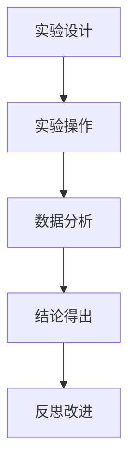
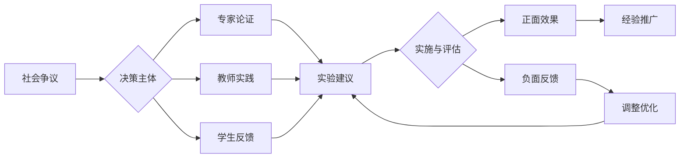

# 03-物理实验与探究

## 目录

- [03-物理实验与探究](#03-物理实验与探究)
  - [目录](#目录)
  - [0. 目录说明与本地跳转](#0-目录说明与本地跳转)
  - [1. 引言：物理实验在教育中的核心地位](#1-引言物理实验在教育中的核心地位)
  - [2. 科学探究的核心要素](#2-科学探究的核心要素)
  - [3. 探究性实验的设计与实施](#3-探究性实验的设计与实施)
    - [3.1 实验设计的层次](#31-实验设计的层次)
    - [3.2 案例：将"验证动能定理"改造为探究性实验](#32-案例将验证动能定理改造为探究性实验)
  - [4. 现代技术在物理实验中的应用](#4-现代技术在物理实验中的应用)
    - [4.1 数字化信息系统 (Data-logging System)](#41-数字化信息系统-data-logging-system)
    - [4.2 视频分析技术 (Video Analysis)](#42-视频分析技术-video-analysis)
    - [4.3 仿真与虚拟实验室 (Simulation)](#43-仿真与虚拟实验室-simulation)
  - [5. 实验数据处理与误差分析](#5-实验数据处理与误差分析)
    - [5.1 数据处理方法](#51-数据处理方法)
    - [5.2 误差分析](#52-误差分析)
  - [📊 多表征内容](#-多表征内容)
    - [📈 图表展示](#-图表展示)
  - [5. 现实争议与前沿挑战](#5-现实争议与前沿挑战)
    - [5.1 社会争议案例](#51-社会争议案例)
    - [5.2 技术伦理问题](#52-技术伦理问题)
    - [5.3 跨文化对比](#53-跨文化对比)
    - [5.4 失败案例剖析](#54-失败案例剖析)

---

## 0. 目录说明与本地跳转

- 本文所有小节均采用严格编号，便于本地跳转与引用。
- 跨文件引用示例：见[物理教育理论与实践](./01-物理教育理论与实践.md)、[物理概念教学方法](./02-物理概念教学方法.md)
- 相关学科跳转：如需查阅科学教育方法论，见[科学教育方法论](../../02-科学教育方法论.md)

---

## 1. 引言：物理实验在教育中的核心地位

物理学是一门以实验为基础的科学。物理实验不仅是验证理论、探索未知的手段，更是培养学生**科学探究能力**、**实证精神**和**操作技能**的核心环节。

- **实验的多重目的**：
  - **验证性实验**：验证已知的物理定律，加深理解。
  - **测量性实验**：测量物理常量（如重力加速度g），训练数据处理能力。
  - **探究性实验**：探索变量之间的关系，体验科学发现的过程。
  - **设计性实验**：综合运用知识，设计解决方案，培养工程思维。

- **从"做实验"到"搞探究"的转变**：
  传统实验教学常沦为"按方抓药"的验证流程，学生的思维参与度低。现代物理教育强调将实验升级为**科学探究 (Scientific Inquiry)**，核心在于**学生的主体性**和**思维的开放性**。

---

## 2. 科学探究的核心要素

依据美国《下一代科学教育标准》(NGSS)，科学探究包含以下八个关键实践：

1. **提出问题 (Asking Questions)**：从观察中发现问题，并将其定义为可探究的科学问题。
2. **发展和使用模型 (Developing and Using Models)**：建立物理模型来预测和解释现象。
3. **规划和开展调查 (Planning and Carrying Out Investigations)**：设计实验方案，包括确定变量、选择仪器、规划步骤。
4. **分析和解释数据 (Analyzing and Interpreting Data)**：使用图表、统计等方法处理数据，揭示规律。
5. **使用数学和计算思维 (Using Mathematics and Computational Thinking)**：用数学工具描述物理关系，用计算模拟物理过程。
6. **建构解释 (Constructing Explanations)**：基于证据和逻辑，对现象做出科学解释。
7. **基于证据进行论证 (Engaging in Argument from Evidence)**：展示、批判和完善自己和他人的论证过程。
8. **获取、评估和交流信息 (Obtaining, Evaluating, and Communicating Information)**：查阅资料，评估信息可靠性，并以清晰的方式（报告、海报等）呈现研究成果。

---

## 3. 探究性实验的设计与实施

### 3.1 实验设计的层次

可以根据学生的探究水平，设计不同开放程度的实验：

| 探究层次 | 问题 | 方案与步骤 | 结论 | 示例 |
| :--- | :---: | :---: | :---: | :--- |
| **0. 验证性** | 已知 | 已知 | 已知 | "验证牛顿第二定律" |
| **1. 结构化探究** | 已知 | 已知 | 未知 | "测量本地的重力加速度" |
| **2. 指导性探究** | 已知 | 未知 | 未知 | "请设计实验探究影响单摆周期的因素" |
| **3. 开放性探究** | 未知 | 未知 | 未知 | "研究我们校园某个下坡的摩擦力情况" |

教学中应逐步引导学生从低层次探究走向高层次探究。

### 3.2 案例：将"验证动能定理"改造为探究性实验

- **传统做法**：
  1. 提供小车、砝码、打点计时器、刻度尺、天平。
  2. 告知学生按照课本步骤操作。
  3. 计算合外力做的功 \( W \) 和动能变化 \( \Delta E_k \)。
  4. 比较两者是否在误差范围内相等。

- **探究性改造 (指导性探究)**：
  1. **提出问题**："力对物体做的功，和物体能量的变化之间，究竟存在什么样的定量关系？"
  2. **规划方案 (学生讨论)**：
     - 如何测量"功"？（需要测量力F和位移x）
     - 如何测量"能量变化"？（选择用动能，需要测量质量m和速度v）
     - 如何获得可靠的速度？（打点计时器纸带分析/光电门/视频分析）
     - 如何平衡摩擦力？（垫高木板）
     - 如何处理数据才能直观地看出关系？（可以画 \(W\) - \(v^2\) 图像，看是否为线性关系）
  3. **开展调查**：学生分组，采用自己设计的方案进行实验。
  4. **分析与解释**：各组展示自己的数据和图表，讨论误差来源，共同构建"合外力的功等于动能变化"的结论。

---

## 4. 现代技术在物理实验中的应用

### 4.1 数字化信息系统 (Data-logging System)

- **组成**：传感器 (Sensor) + 数据采集器 (Interface) + 分析软件 (Software)。
- **常见传感器**：力、运动、温度、电压、磁场传感器等。
- **优势**：
  - **高频采样**：可以捕捉快速变化的物理过程（如碰撞）。
  - **实时成像**：将数据实时绘制成图像，学生可以立刻看到变量关系。
  - **减少测量负担**：让学生从繁琐的读数和记录中解放出来，更专注于现象分析和规律探究。

### 4.2 视频分析技术 (Video Analysis)

- **工具**：高速摄像机 + 视频分析软件（如免费的 Tracker）。
- **应用**：
  - **二维运动分析**：精确追踪抛体运动、圆周运动等轨迹，并自动生成位移、速度、加速度随时间变化的图像。
  - **碰撞和动量**：通过分析碰撞前后物体的运动，精确验证动量守恒定律。
  - **真实世界物理**：分析体育运动（如投篮）、交通事故等真实情境，连接课堂与生活。

### 4.3 仿真与虚拟实验室 (Simulation)

- **平台**：PhET, Algodoo 等。
- **优势**：
  - **理想化情境**：可以轻松实现"无摩擦表面"、"理想点电荷"等，帮助学生聚焦核心概念。
  - **微观世界可视化**：模拟气体分子运动、原子结构、量子现象等无法直接观察的过程。
  - **安全与成本**：安全地进行核反应、高压电路等危险或昂贵的实验。
  - **"What if"探索**：学生可以自由改变参数，进行传统实验无法完成的探索。

---

## 5. 实验数据处理与误差分析

### 5.1 数据处理方法

- **列表法**：清晰呈现原始数据和计算数据。
- **图像法**：最直观的展示变量关系的方法。强调坐标轴的标度、单位，以及如何通过线性拟合求斜率和截距的物理意义。
  - **化曲为直**：对于非线性关系（如 \( T \propto \sqrt{L} \)），通过变换坐标轴（画 \( T^2-L \) 图像）将其线性化，是数据处理的核心技巧。
- **不确定度与有效数字**：
  - 介绍不确定度的基本概念，理解所有测量都有误差。
  - 强调在数据记录和计算过程中遵守有效数字规则的重要性。

### 5.2 误差分析

- **系统误差**：来源于仪器本身或实验方法（如刻度尺未校准、忽略了空气阻力）。只能通过改进实验来减小。
- **偶然误差**：来源于各种偶然因素（如读数估计、环境波动）。可以通过多次测量求平均值来减小。
- **教学重点**：误差分析不应是实验报告中为"凑结论"而找的借口，而应是**评估实验方案可靠性**和**提出改进方向**的重要环节。

---

## 📊 多表征内容

### 📈 图表展示

**物理实验探究发展模型**

---

**物理实验争议与决策流程**

---

## 5. 现实争议与前沿挑战

### 5.1 社会争议案例

- **实验方式争议**：
  - "传统实验与虚拟实验的争议"
  - "验证性实验与探究性实验的平衡"
  - "实验安全与实验效果的权衡"
- **资源分配争议**：
  - "实验设备投入与教学效果的匹配"
  - "实验时间与理论教学时间的分配"
- **评价方式争议**：
  - "实验操作与实验报告的评分权重"
  - "过程性评价与结果性评价的平衡"

### 5.2 技术伦理问题

- **虚拟实验**：
  - "虚拟实验对真实实验技能的替代"
  - "虚拟实验数据的真实性和可靠性"
- **AI辅助实验**：
  - "AI实验指导的准确性和安全性"
  - "智能分析对实验结论的影响"

### 5.3 跨文化对比

- **实验理念差异**：
  - "不同国家物理实验教学理念的差异"
  - "文化背景对实验设计的影响"
- **实施策略对比**：
  - "各国物理实验教学策略的差异"
  - "成功案例的跨文化适应性"

### 5.4 失败案例剖析

- **实验失败**：
  - "某地物理实验安全事故的反思"
  - "实验设计脱离学生认知水平的案例"
- **技术应用失败**：
  - "过度依赖虚拟实验导致动手能力下降"
  - "技术故障导致实验教学中断的案例"

---

> 注：物理实验教学持续优化，欢迎教育工作者提供改进建议。

---
