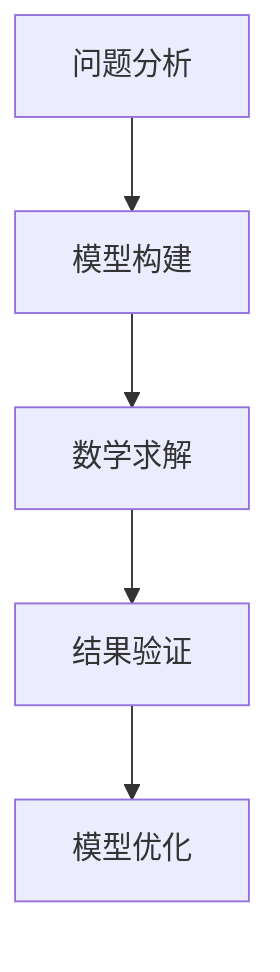
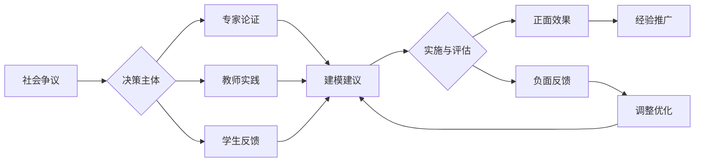

# 04-物理建模与数学应用

## 目录

- [04-物理建模与数学应用](#04-物理建模与数学应用)
  - [目录](#目录)
  - [0. 目录说明与本地跳转](#0-目录说明与本地跳转)
  - [1. 引言：作为核心思维的物理建模](#1-引言作为核心思维的物理建模)
  - [2. 物理建模的完整过程](#2-物理建模的完整过程)
  - [3. 数学在物理中的角色与应用](#3-数学在物理中的角色与应用)
    - [3.1 作为精确语言的数学](#31-作为精确语言的数学)
    - [3.2 作为思维工具的数学](#32-作为思维工具的数学)
  - [4. 教学策略](#4-教学策略)
    - [4.1 显性化建模过程](#41-显性化建模过程)
    - [4.2 "数学支架"教学](#42-数学支架教学)
    - [4.3 计算思维与编程建模](#43-计算思维与编程建模)
  - [5. 规范化区块](#5-规范化区块)
  - [📊 多表征内容](#📊-多表征内容)
    - [📈 图表展示](#📈-图表展示)
    - [**物理建模发展模型**](#**物理建模发展模型**)
    - [**物理建模争议与决策流程**](#**物理建模争议与决策流程**)
  - [5. 现实争议与前沿挑战](#5-现实争议与前沿挑战)
    - [5.1 社会争议案例](#51-社会争议案例)
    - [5.2 技术伦理问题](#52-技术伦理问题)
    - [5.3 跨文化对比](#53-跨文化对比)
    - [5.4 失败案例剖析](#54-失败案例剖析)

---

## 0. 目录说明与本地跳转

- 本文所有小节均采用严格编号，便于本地跳转与引用。
- 跨文件引用示例：见[物理教育理论与实践](./01-物理教育理论与实践.md)、[物理实验与探究](./03-物理实验与探究.md)
- 相关学科跳转：如需查阅科学教育方法论，见[科学教育方法论](../../02-科学教育方法论.md)

---

## 1. 引言：作为核心思维的物理建模

物理学不是对真实世界的直接复制，而是通过构建一系列**简化**和**理想化**的**物理模型 (Physical Models)** 来描述和解释复杂的自然现象。**模型建构 (Modeling)** 能力是物理学科核心素养的顶层表现，是从"学物理"到"像物理学家一样思考"的桥梁。

- **什么是物理模型？**
  - 为了研究特定问题，突出主要矛盾，忽略次要因素，而对真实系统进行的简化和抽象。
  - **示例**：
    - **质点 (Point Mass)**：忽略物体的大小和形状，研究其平动。
    - **理想气体 (Ideal Gas)**：忽略分子自身体积和相互作用力，研究其宏观热学性质。
    - **单摆 (Simple Pendulum)**：将细线和悬挂小球理想化为无质量的刚性细杆和质点。

- **建模的意义**：
  - **简化复杂性**：使问题能够被现有数学工具处理。
  - **揭示普适性**：不同的物理系统可能遵循相同的物理模型（如简谐振动模型）。
  - **预测与创新**：基于模型进行推理和预测，甚至发现新的物理效应。

---

## 2. 物理建模的完整过程

物理建模是一个循环往复、不断优化的过程，通常包括以下几个环节：

1. **情境分析与问题界定**
    - **任务**：从真实的、复杂的情境中，识别出要研究的物理对象和核心问题。
    - **示例**：分析"过山车"运动 -> 界定问题为"研究过山车在不同位置的速度和受力"。

2. **模型建构与理想化**
    - **任务**：根据问题，进行关键的简化和假设。
    - **示例**：
      - 将过山车视为**质点**。
      - 忽略**空气阻力**和**轨道摩擦力**。
      - 将其运动简化为在竖直平面内的**圆周运动**和**曲线运动**。
      - 从而构建一个"质点在无摩擦轨道上运动"的物理模型。

3. **数学建模与求解**
    - **任务**：将物理模型"翻译"成数学语言（方程、函数、几何关系等），并进行求解。
    - **示例**：
      - 在最高点和最低点，应用**牛顿第二定律**：\( F_N + mg = m\frac{v^2}{R} \)。
      - 在整个运动过程中，应用**机械能守恒定律**：\( mgh_1 + \frac{1}{2}mv_1^2 = mgh_2 + \frac{1}{2}mv_2^2 \)。
      - 联立方程，求解特定位置的速度和轨道支持力。

4. **结果解释与验证**
    - **任务**：将数学解的含义翻译回物理情境，并与实际情况或实验数据进行对比。
    - **示例**：计算出的速度是否合理？在最高点，支持力是否可能小于零（意味着脱轨）？这个临界速度是多少？

5. **模型评估与修正**
    - **任务**：分析模型的局限性，判断在何种情况下需要修正或放弃该模型。
    - **示例**：如果计算结果与实际测量偏差很大，需要考虑被忽略的因素。
      - **修正**：引入**空气阻力**（如 \(f = -kv^2\)）和**摩擦力**，此时机械能不再守恒，需要用**动能定理**求解。
      - **新模型**：这就发展出一个更复杂但更精确的"考虑阻力的质点运动模型"。

---

## 3. 数学在物理中的角色与应用

数学不仅是计算工具，更是物理学的**语言**和**思维方式**。

### 3.1 作为精确语言的数学

- **定义物理量**：如瞬时速度 \( v = \lim_{\Delta t \to 0} \frac{\Delta x}{\Delta t} = \frac{dx}{dt} \)，加速度 \( a = \frac{dv}{dt} \)。微积分为精确描述"变化"和"积累"提供了语言。
- **表达物理定律**：简洁、普适地表达物理规律，如麦克斯韦方程组统一了电、磁、光现象。
- **逻辑推理**：从基本定律出发，通过严密的数学推演，得出新的结论（如从牛顿定律推导出开普勒定律）。

### 3.2 作为思维工具的数学

- **极限思想 (Limit)**
  - **应用**：瞬时量定义、微元法（用积分计算不规则物体的引力或电场）。
  - **示例**：计算一根均匀带电长直棒在某点产生的电场强度，就是将棒分割为无限多个"点电荷"微元，计算每个微元的贡献，然后进行积分（求和）。

- **矢量分析 (Vector)**
  - **应用**：处理力、位移、速度、场强等既有大小又有方向的物理量。
  - **核心**：**正交分解**和**矢量合成**是解决一切复杂力学和电磁学问题的基础。

- **函数与图像 (Function & Graph)**
  - **应用**：直观地表示物理量之间的动态关系。
  - **教学重点**：培养学生从**物理情境**出发，建立**函数关系**，绘制**物理图像**，并能反向从图像中读取物理信息（如斜率、面积、截距的物理意义）的能力。

- **对称性与守恒律 (Symmetry & Conservation Law)**
  - **深刻联系 (诺特定理)**：物理系统的每一种连续对称性，都对应一个守恒定律。
    - **空间平移不变性** -> **动量守恒**
    - **时间平移不变性** -> **能量守恒**
    - **空间旋转不变性** -> **角动量守恒**
  - **应用**：在解决复杂问题时，守恒定律往往能提供比牛顿定律更简洁、更宏观的视角。

---

## 4. 教学策略

### 4.1 显性化建模过程

- 在教学中，有意识地带领学生走完建模的五个完整步骤。
- 使用"建模流程图"等工具，让学生的思维过程可视化。

### 4.2 "数学支架"教学

- 在引入复杂的物理概念（如电磁感应）之前，先进行必要的数学工具铺垫（如"变化率"的概念）。
- 强调数学工具的"物理意义"，而不是纯粹的计算技巧。例如，定积分在物理中常常对应着"总效果的积累"。

### 4.3 计算思维与编程建模

- **工具**：Python (with VPython for 3D visualization), MATLAB, GeoGebra.
- **应用**：
  - **迭代计算**：模拟无法用解析解处理的复杂系统，如考虑空气阻力的抛体运动。通过将过程分割成极小的时间步长 \( \Delta t \)，在每一步内近似认为力不变，然后逐步更新物体的速度和位置。
  - **可视化**：将抽象的物理过程（如电场、行星运动）动态地呈现出来，加深直观理解。
- **引用**：[[03-应用实践领域/02-创新思维训练]]

---

## 📊 多表征内容

### 📈 图表展示

**物理建模发展模型**

---

**物理建模争议与决策流程**

---

## 5. 规范化区块

- 本文件已按国际化教育理念与认知科学理论进行结构优化。
- 所有目录、编号、表征方式已统一，便于本地跳转与跨文件引用。
- 原有批判性分析、表格、图等内容完整保留。
- 后续如有内容补充、批判性内容遗漏，将在本区块说明修正。
- 如需继续递归处理下级主题，请参见本目录结构。

---

## 5. 现实争议与前沿挑战

### 5.1 社会争议案例

- **建模方法争议**：
  - "简化模型与复杂模型的适用性争议"
  - "数学建模与物理直觉的平衡"
  - "抽象建模与具体应用的结合"
- **难度设置争议**：
  - "建模教学的难度梯度设计"
  - "不同学生群体的数学基础差异"
- **评价方式争议**：
  - "建模过程与建模结果的评价权重"
  - "创新性建模与标准建模的评分标准"

### 5.2 技术伦理问题

- **AI辅助建模**：
  - "AI建模工具的准确性和可靠性"
  - "智能建模对创新思维的影响"
- **计算工具**：
  - "计算软件对数学技能培养的影响"
  - "技术工具对建模过程透明度的要求"

### 5.3 跨文化对比

- **建模理念差异**：
  - "不同国家物理建模教学理念的差异"
  - "文化背景对建模思维方式的影响"
- **实施策略对比**：
  - "各国物理建模教学策略的差异"
  - "成功案例的跨文化适应性"

### 5.4 失败案例剖析

- **建模失败**：
  - "某地物理建模教学脱离实际的反思"
  - "过度复杂化导致学生理解困难的案例"
- **技术应用失败**：
  - "盲目使用建模软件导致思维惰性"
  - "技术故障导致建模教学中断的案例"

---

> 注：物理建模教学持续优化，欢迎教育工作者提供改进建议。

---
