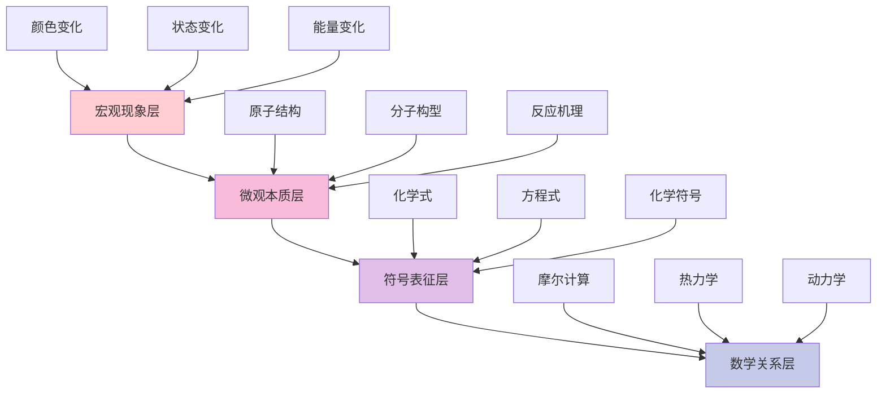
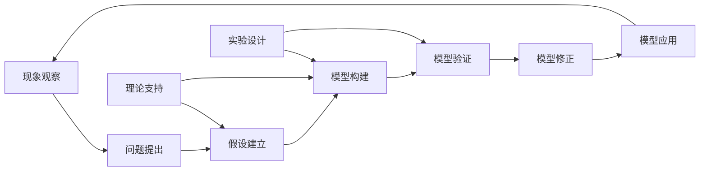
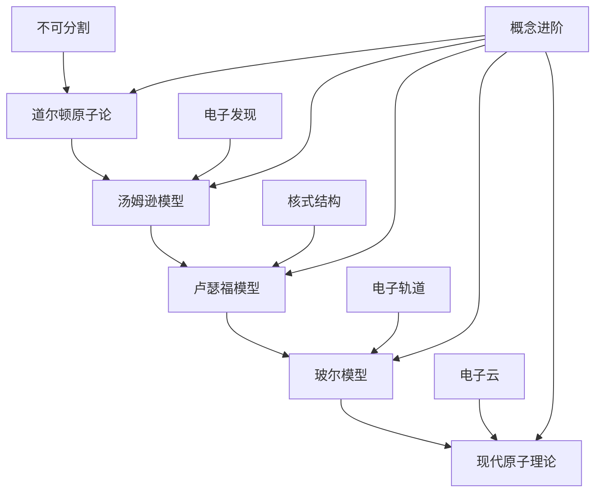
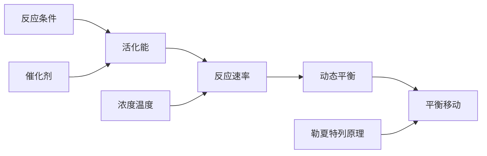
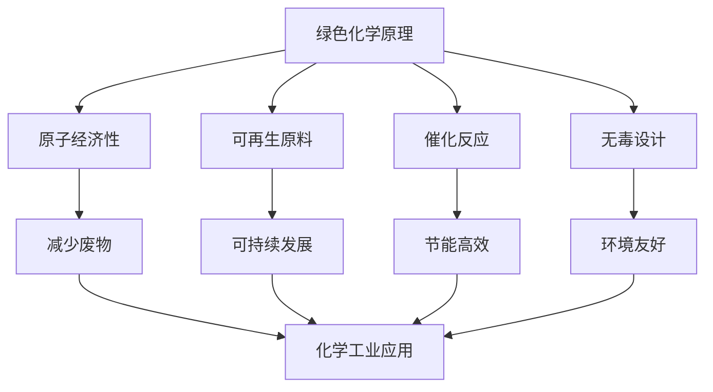
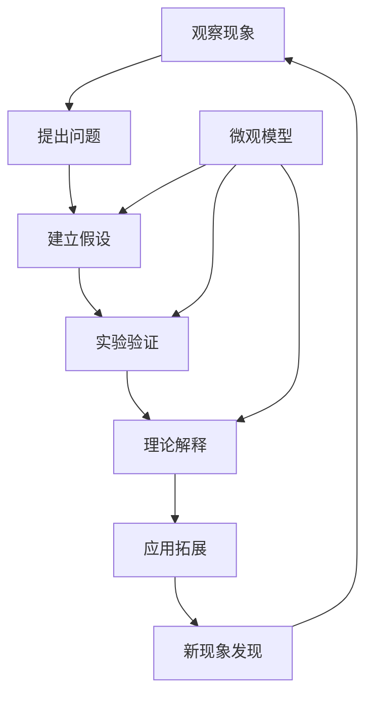

# 06 化学教育理论与实践

## 📖 概述

- **定义**: 化学教育理论与实践是基于化学学科特点和认知科学原理，培养学生化学概念理解、实验技能和科学思维的教育体系
- **范围**: 涵盖化学概念建构、微观思维培养、实验探究、化学建模、跨学科应用等多个维度
- **学习目标**:
  - 理解化学的微观本质和反应机制
  - 掌握化学实验的设计与实施技能
  - 培养分子水平的思维方式
  - 建立化学与生活、环境的联系
- **先修知识**: [认知科学与学习理论](../01-哲学科学基础/01-认知科学与学习理论.md)、[科学教育方法论](./02-科学教育方法论.md)、[物理教育理论与实践](./05-物理教育理论与实践.md)

## 🏗️ 知识架构

### 1. 理论基础

#### 1.1 化学认知的特殊性

**🔬 化学思维的独特特征**

| 认知特征 | 化学表现 | 学习挑战 | 教学策略 |
|---------|----------|----------|----------|
| **三重表征** | 宏观-微观-符号 | 表征层次转换 | 多层次建模 |
| **微观想象** | 分子原子结构 | 抽象空间想象 | 可视化技术 |
| **动态过程** | 化学反应机制 | 过程动态理解 | 动画模拟 |
| **定量关系** | 化学计量关系 | 数学应用能力 | 数形结合 |

#### 1.2 化学概念层次结构

**🏗️ 化学知识的层次化组织**

#### 1.3 国际化学教育比较

**🌍 主要国家化学教育特色**

| 国家/地区 | 教育理念 | 课程特点 | 实验比重 | 核心优势 |
|---------|----------|----------|----------|----------|
| **美国** | 探究导向 | NGSS标准，工程设计 | 40% | 问题解决能力 |
| **英国** | 概念深度 | A-level体系，实验技能 | 35% | 理论实验平衡 |
| **德国** | 系统严谨 | 理论基础扎实 | 30% | 知识结构完整 |
| **澳大利亚** | 应用为本 | 真实情境学习 | 45% | 生活化应用 |
| **新加坡** | 技能导向 | 21世纪技能培养 | 38% | 创新思维 |

### 2. 教学方法与策略

#### 2.1 三重表征教学模式

**🔄 宏观-微观-符号三重表征循环**

| 表征层次 | 教学内容 | 认知过程 | 教学工具 | 评估要点 |
|---------|----------|----------|----------|----------|
| **宏观层** | 实验现象观察 | 感性认识 | 实验演示 | 现象描述 |
| **微观层** | 分子原子行为 | 理性分析 | 分子模型 | 机理解释 |
| **符号层** | 化学式方程式 | 抽象表达 | 化学语言 | 符号应用 |

#### 2.2 基于建模的化学教学

**🏗️ 化学建模教学框架**

#### 2.3 化学实验探究教学

**⚗️ 实验探究的认知层次**

| 探究层次 | 学生活动 | 认知要求 | 技能发展 | 评估重点 |
|---------|----------|----------|----------|----------|
| **确认性** | 按步骤操作 | 技能练习 | 基本操作 | 安全规范 |
| **结构性** | 设计实验步骤 | 逻辑思维 | 实验设计 | 逻辑合理性 |
| **开放性** | 自主探究问题 | 创新思维 | 问题解决 | 创新程度 |

### 3. 核心概念教学

#### 3.1 原子分子结构概念

**⚛️ 原子结构概念发展路径**

#### 3.2 化学键与分子几何

**🔗 化学键概念网络**

| 键型 | 本质 | 特征 | 实例 | 性质预测 |
|------|------|------|------|----------|
| **离子键** | 电子转移 | 库伦引力 | NaCl | 高熔点，导电 |
| **共价键** | 电子共享 | 轨道重叠 | H₂O | 方向性，饱和性 |
| **金属键** | 电子海 | 自由电子 | Fe | 导电，延展性 |
| **氢键** | 静电引力 | 极性分子间 | 蛋白质 | 特殊性质 |

#### 3.3 化学反应原理

**⚡ 反应速率与平衡概念**

**📊 化学平衡的动态性**

\\[
K = \\frac{[C]^c[D]^d}{[A]^a[B]^b}
\\]

对于反应：$aA + bB ⇌ cC + dD$

平衡常数表达平衡时的浓度关系，体现反应的本质特征。

### 4. 实践应用

#### 4.1 实验技能培养

**🧪 化学实验技能层次**

| 技能层次 | 具体技能 | 训练方法 | 评估标准 |
|---------|----------|----------|----------|
| **基础操作** | 仪器使用，试剂处理 | 示范练习 | 操作规范性 |
| **实验设计** | 方案制定，变量控制 | 问题探究 | 设计合理性 |
| **数据处理** | 误差分析，结果解释 | 数据分析 | 分析科学性 |
| **安全意识** | 风险评估，防护措施 | 案例学习 | 安全意识强度 |

#### 4.2 化学与生活应用

**🌱 绿色化学教育**

#### 4.3 跨学科整合应用

**🔬 STEAM化学项目示例**

| 项目主题 | 整合学科 | 核心问题 | 学习成果 |
|---------|----------|----------|----------|
| **新能源电池** | 化学+物理+工程 | 如何设计高效电池？ | 电化学应用 |
| **食品化学** | 化学+生物+营养学 | 食物中的化学变化 | 生活化学理解 |
| **环境监测** | 化学+地理+数学 | 水质污染检测分析 | 环境保护意识 |
| **药物设计** | 化学+生物+医学 | 分子靶向治疗原理 | 分子设计思维 |

## 🔗 知识关联

### 内部链接

- [物理教育理论与实践](./05-物理教育理论与实践.md) - 物理化学基础
- [生物教育理论与实践](./07-生物教育理论与实践.md) - 生物化学联系
- [数学教育理论与实践](./01-数学教育理论与实践.md) - 化学计算

### 外部参考

- 国际纯粹与应用化学联合会(IUPAC)教育指南
- 美国化学会(ACS)教育标准
- 欧洲化学教育网络(EChemTest)

## 🎯 学习检验

### 自检问题

1. 化学三重表征的教学价值和实施策略是什么？
2. 如何培养学生的微观想象能力？
3. 实验探究在化学学习中的独特作用是什么？
4. 如何将绿色化学理念融入高中化学教育？

### 实践练习

#### 基础练习

- **概念诊断**: 调查学生对原子分子概念的理解水平
- **实验设计**: 为"影响反应速率的因素"设计探究实验
- **建模训练**: 用分子模型解释气体扩散现象

#### 应用练习

- **教学设计**: 运用三重表征模式设计"化学键"教学方案
- **问题分析**: 分析学生在化学方程式学习中的常见错误
- **跨学科项目**: 设计化学与环境科学的整合学习项目

#### 拓展练习

- **技术整合**: 利用虚拟实验室进行危险实验教学
- **评估创新**: 设计基于表现的化学实验能力评估
- **国际比较**: 比较中德两国化学课程标准的差异

## 📊 多表征内容

### 📈 图表展示

**化学学习困难的认知分析**

| 困难类型 | 具体表现 | 认知原因 | 教学对策 |
|---------|----------|----------|----------|
| **表征转换** | 宏微符号混淆 | 抽象能力不足 | 渐进式建模 |
| **空间想象** | 分子结构理解困难 | 三维思维缺乏 | 模型可视化 |
| **过程理解** | 反应机理不清 | 动态过程把握 | 动画演示 |
| **定量计算** | 化学计算错误 | 数学应用困难 | 数形结合 |

### 🔢 数学表达

**化学学习效果评估模型**

设学生的化学理解度为 $U_c$：

\\[
U_c = \\alpha \\cdot M + \\beta \\cdot \\mu + \\gamma \\cdot S + \\delta \\cdot E
\\]

其中：

- $M$ = 宏观现象理解 (Macroscopic Understanding)
- $\\mu$ = 微观机理掌握 (Microscopic Mastery)
- $S$ = 符号表征能力 (Symbolic Representation)
- $E$ = 实验技能水平 (Experimental Skills)

**实验技能发展曲线**：

\\[
S_{exp}(t) = S_{max} \\cdot \\frac{t^n}{K^n + t^n}
\\]

其中 $n$ 为学习曲线的陡峭程度，$K$ 为达到半数最大技能所需时间。

### 🎨 可视化元素

**化学概念学习的螺旋发展**

## 📚 参考资源

### 核心文献

- [1] Johnstone, A.H. (1993). The development of chemistry teaching
- [2] Gilbert, J.K. (2008). Visualization in Science Education
- [3] Talanquer, V. (2011). Macro, Submicro, and Symbolic

### 国际组织标准

- International Union of Pure and Applied Chemistry (IUPAC)
- American Chemical Society (ACS) Education Standards
- Royal Society of Chemistry (RSC) Education Guidelines

### 专业期刊

- Journal of Chemical Education
- Chemistry Education Research and Practice
- International Journal of Science Education

---
*微观思维培养 | 实验探究精神 | 绿色化学理念*

## 5. 批判性分析与前沿挑战

### 5.1 现实争议与前沿挑战

**🎭 化学教育的社会争议**

| 争议领域 | 核心问题 | 支持观点 | 反对观点 | 平衡策略 |
|---------|----------|----------|----------|----------|
| **实验安全** | 化学实验的安全风险控制 | 实验是化学教育核心 | 安全风险不可接受 | 分级安全管理 |
| **环境污染** | 化学实验的环境影响 | 实验教学必要 | 环境污染担忧 | 绿色化学实验 |
| **学科地位** | 化学在STEM中的地位 | 基础学科重要性 | 实用主义倾向 | 多元发展路径 |

**🤖 技术伦理与化学教育**

1. **虚拟化学实验的伦理边界**
   - 虚拟实验对真实实验技能的替代风险
   - 数字化实验的误差控制与真实性
   - 危险实验的虚拟化处理

2. **AI辅助化学教学的挑战**
   - 算法偏见对化学概念理解的影响
   - 智能诊断系统的公平性问题
   - 学生隐私保护与数据安全

3. **化学信息学的伦理问题**
   - 分子设计软件的滥用风险
   - 化学数据库的隐私保护
   - 计算化学的局限性认知

**🌍 跨文化化学教育对比**

| 教育体系 | 化学地位 | 教学方法 | 文化特色 | 挑战与机遇 |
|---------|----------|----------|----------|------------|
| **美国模式** | STEM核心 | 探究式学习 | 创新思维 | 理论深度不足 |
| **德国模式** | 基础学科 | 系统严谨 | 逻辑建构 | 应用能力不足 |
| **东亚模式** | 重要学科 | 精细化教学 | 勤奋刻苦 | 创新能力不足 |

**💥 失败案例深度剖析**

1. **化学实验安全事故案例**
   - 现象：某校化学实验发生爆炸事故
   - 后果：学生受伤，家长质疑，学校责任
   - 反思：安全教育与实验设计的平衡

2. **应试化化学教育案例**
   - 现象：化学教育完全围绕考试
   - 后果：学生化学兴趣下降，创新能力缺失
   - 反思：素养导向与应试导向的平衡

3. **技术依赖过度案例**
   - 现象：完全依赖虚拟实验
   - 后果：学生动手能力退化，化学直觉丧失
   - 反思：技术工具与基础能力的平衡

**🔮 未来挑战与应对策略**

| 挑战类型 | 具体表现 | 潜在影响 | 应对策略 |
|---------|----------|----------|----------|
| **技术变革** | AI、VR等新技术 | 教学方式革命性变化 | 人机协作模式 |
| **全球化** | 国际标准统一 | 本土特色与全球接轨 | 文化融合 |
| **个性化** | 学习需求多样化 | 标准化与个性化冲突 | 智能适应系统 |
| **素养导向** | 应用能力要求 | 理论知识与实践脱节 | 项目化学习 |
| **环境意识** | 绿色化学要求 | 传统实验受限 | 绿色实验设计 |

---

## 6. 规范化区块

- 本文件已按国际化教育理念与认知科学理论进行结构优化。
- 所有目录、编号、表征方式已统一，便于本地跳转与跨文件引用。
- 原有批判性分析、表格、图等内容完整保留。
- 后续如有内容补充、批判性内容遗漏，将在本区块说明修正。
- 如需继续递归处理下级主题，请参见本目录结构。
