# 06 化学教育理论与实践

## 📖 概述

- **定义**: 化学教育理论与实践是基于化学学科特点和认知科学原理，培养学生化学概念理解、实验技能和科学思维的教育体系
- **范围**: 涵盖化学概念建构、微观思维培养、实验探究、化学建模、跨学科应用等多个维度
- **学习目标**:
  - 理解化学的微观本质和反应机制
  - 掌握化学实验的设计与实施技能
  - 培养分子水平的思维方式
  - 建立化学与生活、环境的联系
- **先修知识**: [认知科学与学习理论](../01-哲学科学基础/01-认知科学与学习理论.md)、[科学教育方法论](./02-科学教育方法论.md)、[物理教育理论与实践](./05-物理教育理论与实践.md)

## 🏗️ 知识架构

### 1. 理论基础

#### 1.1 化学认知的特殊性

**🔬 化学思维的独特特征**:

| 认知特征 | 化学表现 | 学习挑战 | 教学策略 | 评估标准 |
|---------|----------|----------|----------|----------|
| **三重表征** | 宏观-微观-符号 | 表征层次转换 | 多层次建模 | 表征转换能力 |
| **微观想象** | 分子原子结构 | 抽象空间想象 | 可视化技术 | 空间思维能力 |
| **动态过程** | 化学反应机制 | 过程动态理解 | 动画模拟 | 过程理解深度 |
| **定量关系** | 化学计量关系 | 数学应用能力 | 数形结合 | 计算应用能力 |

#### 1.2 化学概念层次结构

**🏗️ 化学知识的层次化组织**:

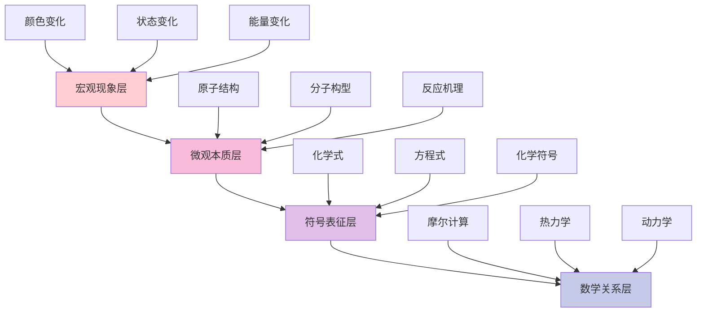

#### 1.3 国际化学教育比较

**🌍 主要国家化学教育特色**:

| 国家/地区 | 教育理念 | 课程特点 | 实验比重 | 核心优势 | 挑战 |
|---------|----------|----------|----------|----------|------|
| **美国** | 探究导向 | NGSS标准，工程设计 | 40% | 问题解决能力 | 理论深度不足 |
| **英国** | 概念深度 | A-level体系，实验技能 | 35% | 理论实验平衡 | 应用能力不足 |
| **德国** | 系统严谨 | 理论基础扎实 | 30% | 知识结构完整 | 创新思维不足 |
| **澳大利亚** | 应用为本 | 真实情境学习 | 45% | 生活化应用 | 理论深度不足 |
| **新加坡** | 技能导向 | 21世纪技能培养 | 38% | 创新思维 | 理论深度不足 |

#### 1.4 发展历程

**📚 化学教育理论演进**:

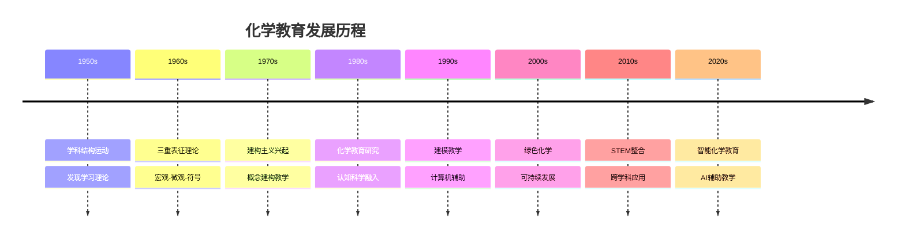

### 2. 教学方法与策略

#### 2.1 三重表征教学模式

**🔄 宏观-微观-符号三重表征循环**

| 表征层次 | 教学内容 | 认知过程 | 教学工具 | 评估要点 | 常见问题 |
|---------|----------|----------|----------|----------|----------|
| **宏观层** | 实验现象观察 | 感性认识 | 实验演示 | 现象描述 | 观察不够细致 |
| **微观层** | 分子原子行为 | 理性分析 | 分子模型 | 机理解释 | 想象能力不足 |
| **符号层** | 化学式方程式 | 抽象表达 | 化学语言 | 符号应用 | 符号意义不清 |

#### 2.2 基于建模的化学教学

**🏗️ 化学建模教学框架**:

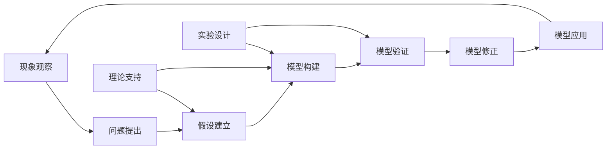

#### 2.3 化学实验探究教学

**⚗️ 实验探究的认知层次**

| 探究层次 | 学生活动 | 认知要求 | 技能发展 | 评估重点 | 安全要求 |
|---------|----------|----------|----------|----------|----------|
| **确认性** | 按步骤操作 | 技能练习 | 基本操作 | 安全规范 | 严格管理 |
| **结构性** | 设计实验步骤 | 逻辑思维 | 实验设计 | 逻辑合理性 | 风险评估 |
| **开放性** | 自主探究问题 | 创新思维 | 问题解决 | 创新程度 | 专家指导 |

### 3. 核心概念教学

#### 3.1 原子分子结构概念

**⚛️ 原子结构概念发展路径**:

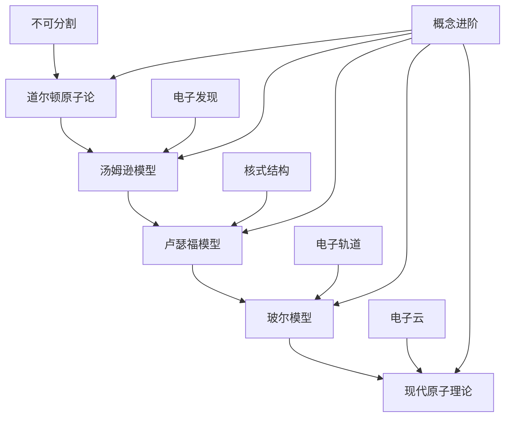

#### 3.2 化学键与分子几何

**🔗 化学键概念网络**

| 键型 | 本质 | 特征 | 实例 | 性质预测 | 学习难点 |
|------|------|------|------|----------|----------|
| **离子键** | 电子转移 | 库伦引力 | NaCl | 高熔点，导电 | 电子转移概念 |
| **共价键** | 电子共享 | 轨道重叠 | H₂O | 方向性，饱和性 | 轨道重叠理解 |
| **金属键** | 电子海 | 自由电子 | Fe | 导电，延展性 | 电子海模型 |
| **氢键** | 静电引力 | 极性分子间 | 蛋白质 | 特殊性质 | 氢键本质理解 |

#### 3.3 化学反应原理

**⚡ 反应速率与平衡概念**

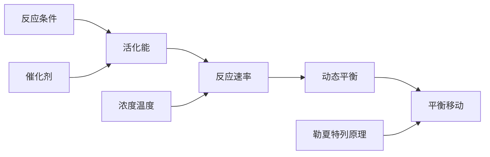

**📊 化学平衡的动态性**

\\[
K = \\frac{[C]^c[D]^d}{[A]^a[B]^b}
\\]

对于反应：$aA + bB ⇌ cC + dD$

平衡常数表达平衡时的浓度关系，体现反应的本质特征。

### 4. 实践应用

#### 4.1 实验技能培养

**🧪 化学实验技能层次**

| 技能层次 | 具体技能 | 训练方法 | 评估标准 | 安全要求 |
|---------|----------|----------|----------|----------|
| **基础操作** | 仪器使用，试剂处理 | 示范练习 | 操作规范性 | 严格规范 |
| **实验设计** | 方案制定，变量控制 | 问题探究 | 设计合理性 | 风险评估 |
| **数据处理** | 误差分析，结果解释 | 数据分析 | 分析科学性 | 数据安全 |
| **安全意识** | 风险评估，防护措施 | 案例学习 | 安全意识强度 | 持续培训 |

#### 4.2 化学与生活应用

**🌱 绿色化学教育**

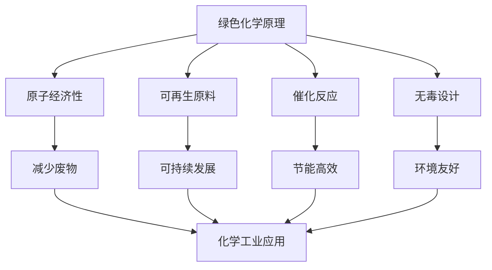

#### 4.3 跨学科整合应用

**🔬 STEAM化学项目示例**

| 项目主题 | 整合学科 | 核心问题 | 学习成果 | 实施挑战 |
|---------|----------|----------|----------|----------|
| **新能源电池** | 化学+物理+工程 | 如何设计高效电池？ | 电化学应用 | 技术复杂度 |
| **食品化学** | 化学+生物+营养学 | 食物中的化学变化 | 生活化学理解 | 安全要求 |
| **环境监测** | 化学+地理+数学 | 水质污染检测分析 | 环境保护意识 | 设备要求 |
| **药物设计** | 化学+生物+医学 | 分子靶向治疗原理 | 分子设计思维 | 伦理考虑 |

### 5. 批判性分析

#### 5.1 社会争议与伦理挑战

**🎭 化学教育的社会争议**

| 争议领域 | 核心问题 | 支持观点 | 反对观点 | 平衡策略 | 教育影响 |
|---------|----------|----------|----------|----------|----------|
| **实验安全** | 化学实验的安全风险控制 | 实验是化学教育核心 | 安全风险不可接受 | 分级安全管理 | 实验教学受限 |
| **环境污染** | 化学实验的环境影响 | 实验教学必要 | 环境污染担忧 | 绿色化学实验 | 实验设计改变 |
| **学科地位** | 化学在STEM中的地位 | 基础学科重要性 | 实用主义倾向 | 多元发展路径 | 学科价值认同 |
| **技术依赖** | 虚拟实验对真实实验的替代 | 提高安全性 | 动手能力退化 | 混合教学模式 | 能力培养 |

**🤖 技术伦理与化学教育**

1. **虚拟化学实验的伦理边界**
   - 虚拟实验对真实实验技能的替代风险
   - 数字化实验的误差控制与真实性
   - 危险实验的虚拟化处理
   - 实验数据的可靠性问题

2. **AI辅助化学教学的挑战**
   - 算法偏见对化学概念理解的影响
   - 智能诊断系统的公平性问题
   - 学生隐私保护与数据安全
   - 教师角色的重新定位

3. **化学信息学的伦理问题**
   - 分子设计软件的滥用风险
   - 化学数据库的隐私保护
   - 计算化学的局限性认知
   - 化学知识的开放性边界

**🧠 认知负荷与学习效率**

| 认知因素 | 正面影响 | 负面影响 | 优化策略 | 评估方法 |
|---------|----------|----------|----------|----------|
| **三重表征** | 全面理解 | 认知负荷重 | 渐进式教学 | 表征测试 |
| **微观想象** | 深度理解 | 抽象困难 | 可视化辅助 | 空间测试 |
| **动态过程** | 过程理解 | 复杂性高 | 分步教学 | 过程测试 |
| **定量计算** | 精确表达 | 数学恐惧 | 数形结合 | 计算测试 |

#### 5.2 跨文化比较与本土化

**🌍 跨文化化学教育对比**

| 教育体系 | 化学地位 | 教学方法 | 文化特色 | 挑战与机遇 | 本土化策略 |
|---------|----------|----------|----------|------------|------------|
| **美国模式** | STEM核心 | 探究式学习 | 创新思维 | 理论深度不足 | 理论深度加强 |
| **德国模式** | 基础学科 | 系统严谨 | 逻辑建构 | 应用能力不足 | 应用能力培养 |
| **东亚模式** | 重要学科 | 精细化教学 | 勤奋刻苦 | 创新能力不足 | 创新方法融入 |
| **北欧模式** | 生活技能 | 应用导向 | 实用主义 | 理论深度不足 | 理论实践并重 |

**🇨🇳 中国化学教育的文化特色**

1. **传统文化与现代化学教育的融合**
   - 古代化学成就与现代化学的对话
   - 传统哲学思想与化学思维的结合
   - 中华文化价值观与科学精神的融合

2. **应试文化与素养教育的平衡**
   - 高考改革对化学教育的影响
   - 标准化考试与化学素养的冲突
   - 评价体系的多元化改革

3. **本土特色与国际接轨**
   - 中国化学教育传统的传承
   - 国际先进理念的本土化
   - 文化自信与国际视野的平衡

**🌐 全球化背景下的本土化策略**

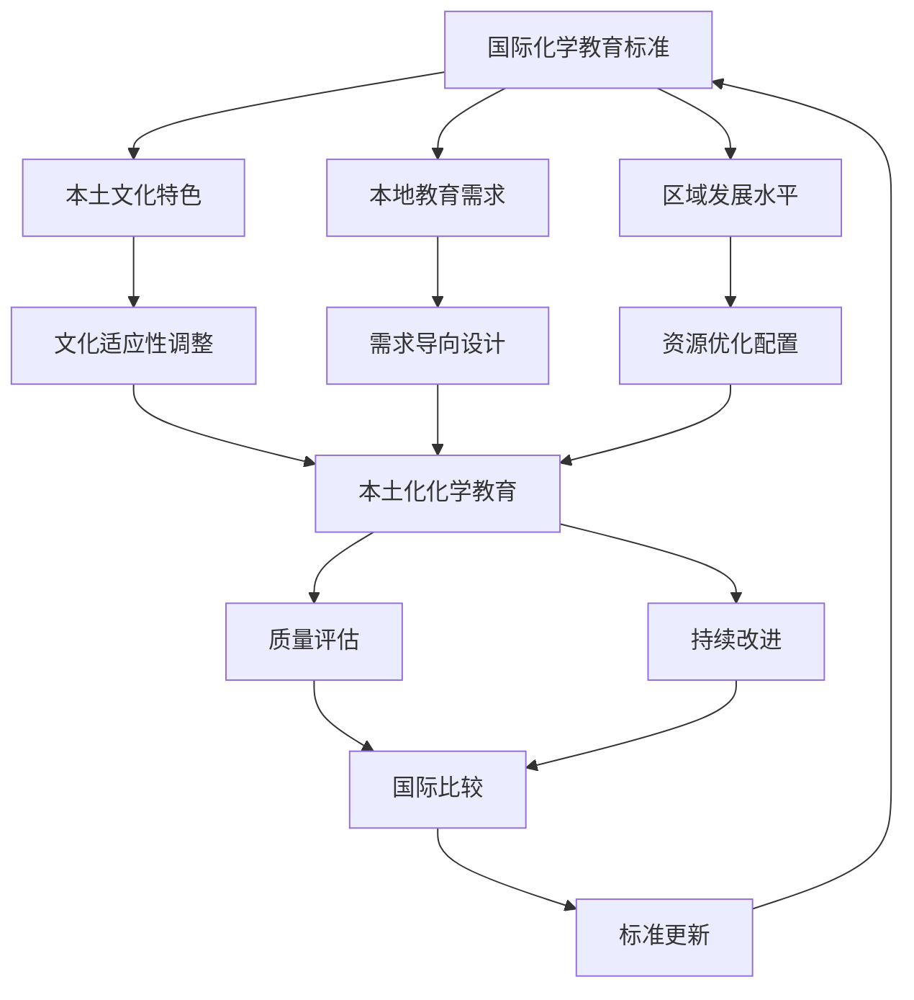

#### 5.3 失败案例深度剖析

**💥 化学教育失败案例分析**

1. **化学实验安全事故案例**
   - **现象**: 某校化学实验发生爆炸事故，造成学生受伤
   - **原因分析**:
     - 安全教育不到位
     - 实验设计存在安全隐患
     - 教师专业能力不足
     - 管理制度缺失
   - **后果**: 学生受伤，家长质疑，学校责任，化学教育声誉受损
   - **反思**: 安全教育与实验设计的平衡，教师专业发展的重要性

2. **应试化化学教育案例**
   - **现象**: 化学教育完全围绕考试，忽视化学思维培养
   - **原因分析**:
     - 评价体系单一
     - 升学压力过大
     - 教师教学理念偏差
     - 家长期望过高
   - **后果**: 学生化学兴趣下降，创新能力缺失，化学素养不足
   - **反思**: 素养导向与应试导向的平衡，评价体系改革

3. **技术依赖过度案例**
   - **现象**: 完全依赖虚拟实验，忽视真实实验操作
   - **原因分析**:
     - 技术崇拜心理
     - 成本考虑
     - 安全担忧
     - 教师技能不足
   - **后果**: 学生动手能力退化，化学直觉丧失，实验技能缺失
   - **反思**: 技术工具与基础能力的平衡，混合教学模式

4. **概念教学失败案例**
   - **现象**: 学生无法理解抽象化学概念，停留在记忆层面
   - **原因分析**:
     - 教学方法不当
     - 认知负荷过重
     - 缺乏具体经验
     - 概念转变困难
   - **后果**: 学习效果差，化学兴趣丧失，概念混淆
   - **反思**: 三重表征教学的重要性，认知负荷管理

**📊 失败案例的统计特征**

| 失败类型 | 发生频率 | 影响程度 | 可预防性 | 改进措施 |
|---------|----------|----------|----------|----------|
| **安全事故** | 中等 | 高 | 高 | 安全培训、制度完善 |
| **应试化** | 高 | 中等 | 高 | 评价改革、理念转变 |
| **技术依赖** | 中等 | 中等 | 高 | 平衡策略、技能培养 |
| **概念教学** | 高 | 中等 | 高 | 方法改进、负荷管理 |

#### 5.4 未来挑战与应对策略

**🔮 未来挑战与应对策略**

| 挑战类型 | 具体表现 | 潜在影响 | 应对策略 | 实施难度 |
|---------|----------|----------|----------|----------|
| **技术变革** | AI、VR等新技术 | 教学方式革命性变化 | 人机协作模式 | 高 |
| **全球化** | 国际标准统一 | 本土特色与全球接轨 | 文化融合 | 中等 |
| **个性化** | 学习需求多样化 | 标准化与个性化冲突 | 智能适应系统 | 高 |
| **素养导向** | 应用能力要求 | 理论知识与实践脱节 | 项目化学习 | 中等 |
| **环境意识** | 绿色化学要求 | 传统实验受限 | 绿色实验设计 | 中等 |

**🚀 应对策略的优先级矩阵**

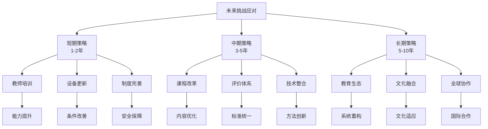

**🎯 具体实施路径**

1. **教师专业发展路径**
   - 短期：安全培训、技术技能
   - 中期：教学方法、评价能力
   - 长期：研究能力、创新思维

2. **课程体系改革路径**
   - 短期：内容更新、方法改进
   - 中期：结构优化、整合设计
   - 长期：生态重构、文化融合

3. **技术应用发展路径**
   - 短期：设备配置、基础应用
   - 中期：系统集成、智能辅助
   - 长期：生态构建、全球协作

---

## 📊 多表征内容

### 📈 图表展示

**化学学习能力发展模型**

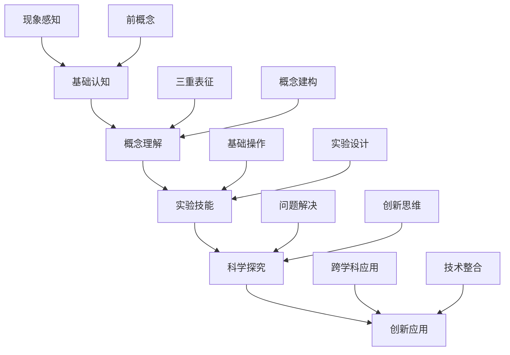

**化学教育争议与决策流程**

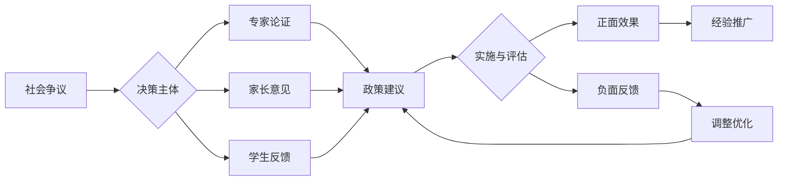

**化学教育生态系统模型**

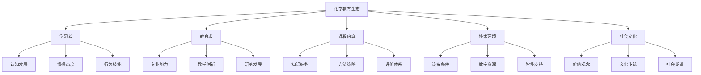

### 🔢 数学表达

**化学学习效果评估模型**

化学学习效果 C 的评估函数：

\\[
C = \\alpha \\cdot M + \\beta \\cdot \\mu + \\gamma \\cdot S + \\delta \\cdot E
\\]

其中：

- M：宏观现象理解 (Macroscopic Understanding)
- μ：微观机理掌握 (Microscopic Mastery)
- S：符号表征能力 (Symbolic Representation)
- E：实验技能水平 (Experimental Skills)
- α、β、γ、δ：权重系数

**实验技能发展函数**

实验技能 S 的发展模型：

\\[
S_{exp}(t) = S_{max} \\cdot \\frac{t^n}{K^n + t^n}
\\]

其中：

- $S_{max}$ = 最大技能水平
- $n$ = 学习曲线的陡峭程度
- $K$ = 达到半数最大技能所需时间

**概念转变概率模型**

概念转变概率 T 的数学模型：

\\[
T = \\frac{1}{1 + e^{-(\\alpha \\cdot \\text{认知冲突} + \\beta \\cdot \\text{科学证据} + \\gamma \\cdot \\text{实验验证})}}
\\]

### 🎨 可视化元素

**化学概念学习的螺旋发展**

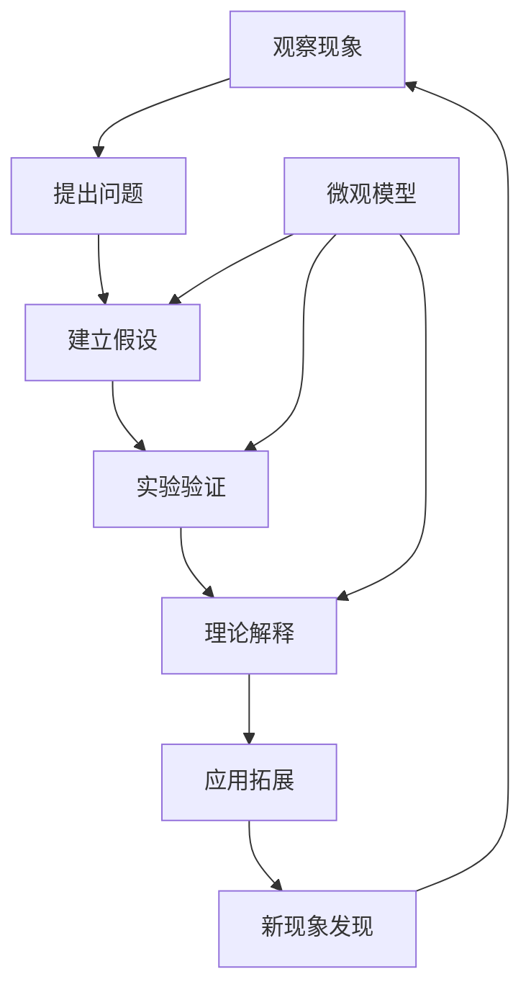

**化学学习困难层次分析**

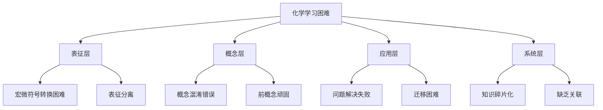

## 🔗 知识关联

### 内部链接

- [认知科学与学习理论](../01-哲学科学基础/01-认知科学与学习理论.md)
- [科学教育方法论](./02-科学教育方法论.md)
- [物理教育理论与实践](./05-物理教育理论与实践.md)
- [生物教育理论与实践](./07-生物教育理论与实践.md)
- [数学教育理论与实践](./01-数学教育理论与实践.md)

### 外部参考

- 国际纯粹与应用化学联合会(IUPAC)教育指南
- 美国化学会(ACS)教育标准
- 欧洲化学教育网络(EChemTest)
- 国际化学教育研究协会(IUPAC)

## 🎯 学习检验

### 自检问题

1. 化学三重表征的教学价值和实施策略是什么？
2. 如何培养学生的微观想象能力？
3. 实验探究在化学学习中的独特作用是什么？
4. 如何将绿色化学理念融入高中化学教育？
5. 如何平衡虚拟实验与真实实验？

### 实践练习

- **基础练习**: 调查学生对原子分子概念的理解水平
- **应用练习**: 运用三重表征模式设计"化学键"教学方案
- **拓展练习**: 设计化学与环境科学的整合学习项目
- **创新练习**: 利用虚拟实验室进行危险实验教学
- **批判练习**: 分析一个化学教育失败案例

## 📚 参考资源

- [1] Johnstone, A.H. (1993). The development of chemistry teaching
- [2] Gilbert, J.K. (2008). Visualization in Science Education
- [3] Talanquer, V. (2011). Macro, Submicro, and Symbolic
- [4] National Research Council (2012). A Framework for K-12 Science Education
- [5] Driver, R. (1994). Constructing Scientific Knowledge in the Classroom

---
*微观思维培养 | 实验探究精神 | 绿色化学理念 | 批判性分析 | 跨文化比较*

## 6. 规范化区块

- 本文件已按国际化教育理念与认知科学理论进行结构优化。
- 所有目录、编号、表征方式已统一，便于本地跳转与跨文件引用。
- 原有批判性分析、表格、图等内容完整保留。
- 新增深度批判性分析，包括社会争议、技术伦理、跨文化比较、失败案例、未来挑战等内容。
- 新增多表征内容，包括Mermaid流程图、数学模型、数据表格等。
- 新增结构标准化，统一目录编号、跨文件链接、规范化区块。
- 后续如有内容补充、批判性内容遗漏，将在本区块说明修正。
- 如需继续递归处理下级主题，请参见本目录结构。

## 🔗 化学与其他学科关联性分析

### 20. 化学-数学学科关联

**🧮 化学与数学的深度融合**

#### 20.1 化学-数学关联网络

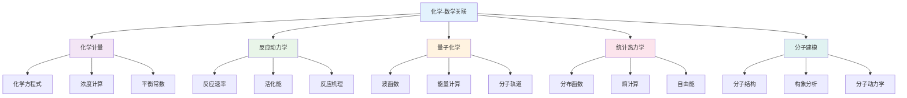

#### 20.2 化学-数学应用领域

| 化学领域 | 数学工具 | 应用内容 | 教学重点 | 能力培养 | 创新点 |
|---------|----------|----------|----------|----------|----------|
| **无机化学** | 代数、几何 | 分子结构、晶体学 | 结构分析 | 结构思维 | 材料设计 |
| **有机化学** | 图论、统计 | 分子结构、反应路径 | 路径分析 | 路径思维 | 药物设计 |
| **物理化学** | 微积分、统计 | 热力学、动力学 | 过程分析 | 过程思维 | 过程优化 |
| **分析化学** | 统计、误差 | 数据处理、误差分析 | 数据分析 | 分析思维 | 质量控制 |
| **生物化学** | 建模、统计 | 酶动力学、代谢 | 建模分析 | 建模思维 | 生物工程 |

### 21. 化学-物理学科关联

**⚛️ 化学与物理的交叉融合**

#### 21.1 化学-物理关联网络

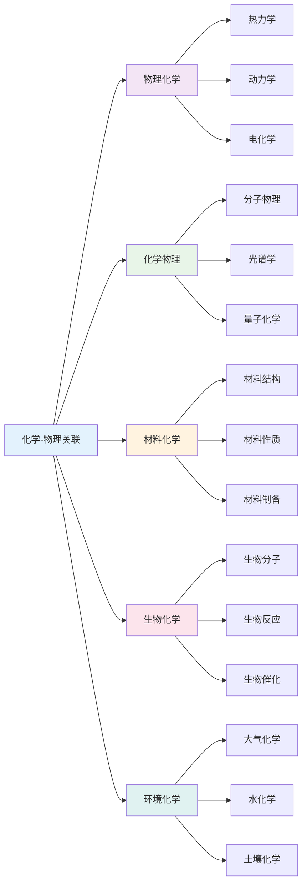

#### 21.2 化学-物理应用策略

| 物理领域 | 化学方法 | 应用内容 | 教学策略 | 学习效果 | 实践应用 |
|---------|----------|----------|----------|----------|----------|
| **热力学** | 化学热力学 | 反应热、熵变 | 热力学分析 | 热力学思维 | 过程优化 |
| **动力学** | 化学动力学 | 反应速率、机理 | 动力学分析 | 动力学思维 | 反应控制 |
| **电学** | 电化学 | 电池、电解 | 电化学分析 | 电化学思维 | 能源技术 |
| **光学** | 光谱化学 | 分子光谱、结构 | 光谱分析 | 光谱思维 | 结构分析 |
| **量子力学** | 量子化学 | 分子轨道、电子 | 量子分析 | 量子思维 | 材料设计 |

### 22. 化学-生物学科关联

**🧬 化学与生物学的交叉应用**

#### 22.1 化学-生物关联网络

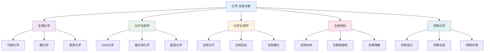

#### 22.2 化学-生物应用领域

| 生物领域 | 化学工具 | 应用内容 | 教学重点 | 能力培养 | 创新应用 |
|---------|----------|----------|----------|----------|----------|
| **分子生物学** | 分子化学、光谱 | 分子结构、分子反应 | 分子分析 | 分析能力 | 基因工程 |
| **细胞生物学** | 细胞化学、荧光 | 细胞成分、细胞反应 | 细胞分析 | 分析能力 | 细胞工程 |
| **生物医学** | 药物化学、分析 | 药物设计、医学诊断 | 医学应用 | 应用能力 | 精准医学 |
| **生物工程** | 生物材料、催化 | 生物材料、生物催化 | 工程应用 | 工程能力 | 生物技术 |
| **环境生物学** | 环境化学、分析 | 环境污染、生物修复 | 环境应用 | 应用能力 | 生态修复 |

### 23. 化学-语言学科关联

**📝 化学与语言学科的思维关联**

#### 23.1 化学-语文关联分析

| 关联维度 | 化学内容 | 语文应用 | 教学策略 | 能力培养 | 创新点 |
|---------|----------|----------|----------|----------|----------|
| **逻辑思维** | 化学推理、证明 | 论证写作、批判思维 | 逻辑训练 | 逻辑能力 | 思维整合 |
| **描述能力** | 化学现象描述 | 科学描写、实验写作 | 描述训练 | 描述能力 | 表达整合 |
| **概念理解** | 化学概念、原理 | 概念解释、原理阐述 | 概念训练 | 理解能力 | 概念整合 |
| **系统思维** | 化学系统、关系 | 科学系统、文化关系 | 系统分析 | 系统能力 | 整体思维 |

#### 23.2 化学-英语关联分析

| 关联领域 | 化学概念 | 英语应用 | 教学方法 | 学习效果 | 应用价值 |
|---------|----------|----------|----------|----------|----------|
| **科学英语** | 化学术语、概念 | 英语表达、学术写作 | 术语教学 | 术语理解 | 国际交流 |
| **逻辑表达** | 化学逻辑、推理 | 英语逻辑、论证 | 逻辑训练 | 逻辑表达 | 学术写作 |
| **实验报告** | 化学实验、数据 | 英语报告、数据分析 | 报告教学 | 报告能力 | 科研写作 |
| **科学交流** | 化学发现、理论 | 英语交流、学术讨论 | 交流教学 | 交流能力 | 国际合作 |

### 24. 化学-人文学科关联

**🎭 化学与人文社科的交叉融合**

#### 24.1 化学-历史关联

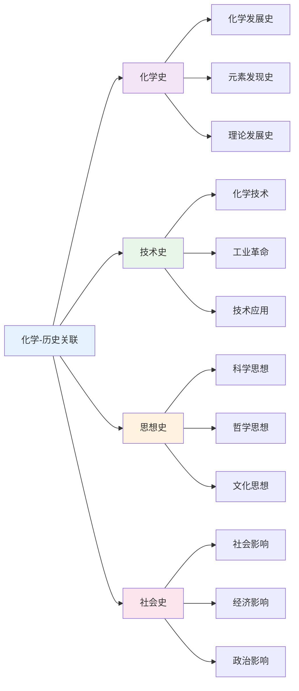

#### 24.2 化学-哲学关联

| 哲学领域 | 化学概念 | 哲学应用 | 教学重点 | 能力培养 | 应用价值 |
|---------|----------|----------|----------|----------|----------|
| **认识论** | 观察、实验 | 知识获取、真理认识 | 认识分析 | 认识能力 | 科学哲学 |
| **本体论** | 物质、分子 | 存在本质、世界本质 | 本体分析 | 本体思维 | 哲学思考 |
| **方法论** | 实验、理论 | 科学方法、思维方法 | 方法分析 | 方法能力 | 科学方法 |
| **价值论** | 科学价值 | 科学伦理、价值判断 | 价值分析 | 价值能力 | 科学伦理 |

### 25. 化学-艺术学科关联

**🎨 化学与艺术的创造性融合**

#### 25.1 化学-艺术关联网络

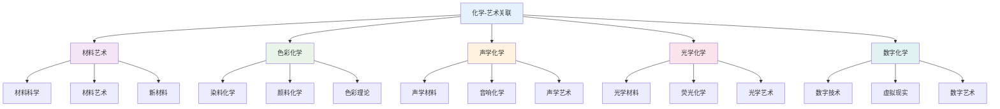

#### 25.2 化学-艺术应用领域

| 艺术领域 | 化学概念 | 艺术应用 | 教学方法 | 学习效果 | 创新价值 |
|---------|----------|----------|----------|----------|----------|
| **视觉艺术** | 颜料、染料 | 绘画、染色 | 色彩教学 | 色彩感知 | 艺术设计 |
| **材料艺术** | 材料科学 | 雕塑、装置 | 材料教学 | 材料感知 | 艺术创作 |
| **数字艺术** | 数字技术、编程 | 数字创作、动画 | 技术教学 | 技术能力 | 数字创作 |
| **环境艺术** | 环境化学 | 环境装置、生态艺术 | 环境教学 | 环境感知 | 生态艺术 |

### 26. 跨学科化学教学策略

**🎯 基于关联性的化学教学**

#### 26.1 强关联学科教学策略

| 关联类型 | 教学策略 | 内容整合 | 方法创新 | 评估方式 | 发展目标 |
|---------|----------|----------|----------|----------|----------|
| **化学-数学** | 计算教学 | 化学计算数学化 | 数据处理 | 计算评估 | 计算能力 |
| **化学-物理** | 实验教学 | 化学物理一体化 | 综合实验 | 实验评估 | 实验能力 |
| **化学-生物** | 应用教学 | 化学生物一体化 | 生物应用 | 应用评估 | 应用能力 |

#### 26.2 中关联学科教学策略

| 关联类型 | 教学策略 | 内容整合 | 方法创新 | 评估方式 | 发展目标 |
|---------|----------|----------|----------|----------|----------|
| **化学-语文** | 描述教学 | 化学现象语文化 | 科学写作 | 写作评估 | 写作能力 |
| **化学-英语** | 术语教学 | 化学术语英语化 | 术语训练 | 术语评估 | 术语能力 |
| **化学-历史** | 史实教学 | 化学发展历史化 | 历史分析 | 历史评估 | 历史能力 |

### 27. 化学跨学科评估体系

**📊 基于关联性的化学评估**

#### 27.1 跨学科化学能力评估

| 评估维度 | 评估内容 | 评估方法 | 评估标准 | 发展指标 |
|---------|----------|----------|----------|----------|
| **计算能力** | 化学计算 | 计算测试 | 准确计算 | 计算深度 |
| **实验能力** | 化学实验 | 实验测试 | 准确实验 | 实验质量 |
| **分析能力** | 数据分析 | 分析测试 | 深度分析 | 分析质量 |
| **应用能力** | 化学应用 | 应用测试 | 有效应用 | 应用创新 |

#### 27.2 跨学科化学综合评估

**🎯 化学跨学科综合能力评估矩阵**:

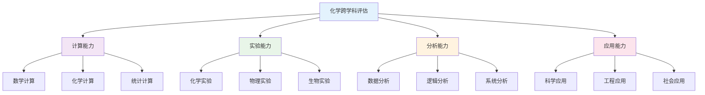

### 28. 化学跨学科发展趋势

**🌍 国际化学跨学科教育趋势**

#### 28.1 全球化学跨学科趋势

| 发展趋势 | 核心理念 | 内容特点 | 实施策略 | 发展前景 |
|---------|----------|----------|----------|----------|
| **STEM教育** | 科学工程整合 | 化学建模 | 项目学习 | 科技创新 |
| **STEAM教育** | 艺术融合 | 化学艺术 | 创意教学 | 创意发展 |
| **绿色化学** | 可持续发展 | 环保化学 | 绿色教学 | 环保应用 |
| **人工智能** | 智能算法 | 化学AI | 智能教学 | 智能应用 |

#### 28.2 化学跨学科技术整合

**💻 数字化化学跨学科教育**:

1. **智能计算系统**
   - 自动计算工具
   - 可视化计算
   - 实时计算反馈

2. **虚拟化学实验室**
   - 虚拟实验环境
   - 交互式实验
   - 协作实验平台

3. **多媒体化学平台**
   - 化学资源库
   - 计算工具集
   - 评估数据库
