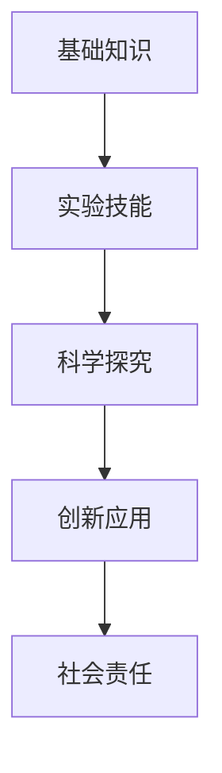
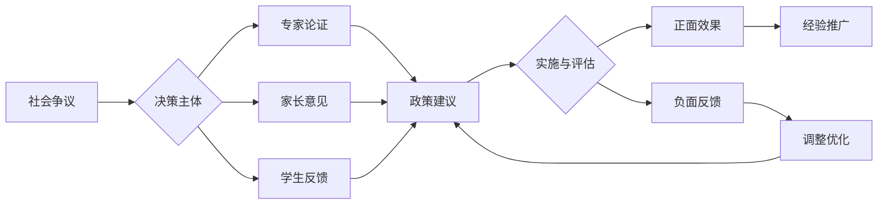

# 01-化学教育理论与实践

## 目录

- [01-化学教育理论与实践](#01-化学教育理论与实践)
  - [目录](#目录)
  - [0. 目录说明与本地跳转](#0-目录说明与本地跳转)
  - [1. 引言：化学教育的核心价值与目标](#1-引言化学教育的核心价值与目标)
    - [1.1 化学的本质与教育价值](#11-化学的本质与教育价值)
    - [1.2 现代化学教育的核心目标](#12-现代化学教育的核心目标)
  - [2. 化学教育的认知科学基础](#2-化学教育的认知科学基础)
    - [2.1 化学概念学习的认知障碍](#21-化学概念学习的认知障碍)
    - [2.2 概念转变与模型建构](#22-概念转变与模型建构)
  - [3. 国际化学教育先进理念与实践](#3-国际化学教育先进理念与实践)
    - [3.1 POGIL (过程导向的引导式探究学习)](#31-pogil-过程导向的引导式探究学习)
    - [3.2 STS教育 (科学-技术-社会)](#32-sts教育-科学-技术-社会)
    - [3.3 绿色化学 (Green Chemistry)](#33-绿色化学-green-chemistry)
  - [4. 化学教育内容体系与课程设计](#4-化学教育内容体系与课程设计)
    - [4.1 核心知识模块](#41-核心知识模块)
    - [4.2 课程设计原则](#42-课程设计原则)
    - [4.2 个性化发展路径](#42-个性化发展路径)
    - [5.1 现实争议与前沿挑战](#51-现实争议与前沿挑战)
  - [📊 多表征内容](#-多表征内容)
    - [📈 图表展示](#-图表展示)

---

## 0. 目录说明与本地跳转

- 本文所有小节均采用严格编号，便于本地跳转与引用。
- 跨文件引用示例：见[化学概念与反应机制](./02-化学概念与反应机制.md)、[化学实验与安全](./03-化学实验与安全.md)
- 相关学科跳转：如需查阅科学教育方法论，见[科学教育方法论](../../02-科学教育方法论.md)

## 1. 引言：化学教育的核心价值与目标

### 1.1 化学的本质与教育价值

化学是一门在**原子和分子水平**上研究物质的组成、结构、性质、变化及其应用的基础自然科学。它连接着微观世界与宏观现象，是材料、生命、环境、能源等领域的核心。

- **培养科学探究能力**：化学实验提供了丰富的探究情境，培养学生观察、假设、验证和创新的能力。
- **建立物质观念**：帮助学生从微观视角理解宏观世界，形成"元素观"、"微粒观"、"变化观"和"守恒观"。
- **提升生活素养**：理解食品安全、环境保护、药物合成等社会议题背后的化学原理，做出明智决策。

### 1.2 现代化学教育的核心目标

- **核心素养 (Core Competencies)**：
  - **宏观辨识与微观探析**：建立宏观现象与微观粒子运动之间的联系。
  - **变化观念与平衡思想**：理解化学反应的本质是物质转化，并能用动态平衡的观点分析可逆过程。
  - **证据推理与模型认知**：能基于实验证据进行推理，并理解化学模型（如原子结构模型、分子模型）的意义和局限性。
  - **科学探究与创新意识**：具备设计和实施化学实验、解决实际化学问题的能力。
  - **科学精神与社会责任**：认识化学与社会的双向影响，关注绿色化学和可持续发展。
- **国际比较**：NGSS标准强调将**化学核心概念**与**科学实践**相结合，例如，通过"设计一种新型电池"的项目来整合电化学、材料学和工程设计。

## 2. 化学教育的认知科学基础

### 2.1 化学概念学习的认知障碍

化学学习涉及三个层次的思维转换，对学生认知要求很高，这也是产生学习困难的主要原因。

- **约翰斯顿三角 (Johnstone's Triangle)**：
  1. **宏观层面 (Macroscopic)**：可观察到的现象，如颜色变化、沉淀生成。
  2. **微观层面 (Sub-microscopic)**：用原子、分子、离子等微观粒子解释宏观现象。
  3. **符号层面 (Symbolic)**：用化学式、方程式、结构式等符号系统表示微观过程。
- **认知挑战**：学生需要在三个层面之间自如切换。例如，看到"蓝色硫酸铜溶液中插入锌片后，锌片表面附着红色固体，溶液颜色变浅"，需要能联想到微观上 \( \text{Zn} \) 原子失去电子变成 \( \text{Zn}^{2+} \)，\( \text{Cu}^{2+} \) 离子得到电子变成 \( \text{Cu} \) 原子，并能用符号 \( \text{Zn} + \text{CuSO}_4 = \text{ZnSO}_4 + \text{Cu} \) 来表示。
- **常见迷思概念 (Misconceptions)**：
  - 物质融化时，分子"熔化"或"分解"。
  - 化学方程式中，系数代表物质的质量。
  - 反应物"用完"了，反应就停止了（对化学平衡缺乏理解）。

### 2.2 概念转变与模型建构

- **教学策略**：
  - **强化三层联系**：在教学中，有意识地引导学生在"宏观-微观-符号"之间建立联系。例如，使用分子模型、动画模拟来可视化微观过程。
  - **利用认知冲突**：设计能够暴露学生迷思概念的实验或问题，引导其自我修正。
  - **历史演进法**：按照原子结构理论（道尔顿-汤姆逊-卢瑟福-波尔）的发展历史进行教学，让学生体会科学模型是如何基于新证据而不断演进和完善的。

## 3. 国际化学教育先进理念与实践

### 3.1 POGIL (过程导向的引导式探究学习)

- **核心思想 (Process-Oriented Guided Inquiry Learning)**：在精心设计的学习材料引导下，学生以小组为单位，通过分析数据和问题，自行建构知识。
- **教学模式**：
  1. **模型观察**：提供数据、图表或信息。
  2. **概念发明**：引导学生从中发现规律，形成概念。
  3. **应用**：将新概念用于解决问题。
- **特点**：教师是引导者而非讲授者，强调协作学习和高阶思维能力的培养。

### 3.2 STS教育 (科学-技术-社会)

- **核心思想**：将化学知识与技术应用和社会议题相结合，提高学习的相关性和趣味性。
- **教学案例**：
  - **议题**："如何应对白色污染？"
  - **化学知识**：高分子化合物的结构与性质、可降解塑料的原理。
  - **技术**：塑料的合成、回收和降解技术。
  - **社会**：环境保护政策、个人生活方式的选择。

### 3.3 绿色化学 (Green Chemistry)

- **核心思想**：从源头上减少或消除有害物质的使用和产生。这不仅是科研前沿，也应成为化学教育的核心价值观。
- **十二原则融入教学**：
  - **原子经济性**：在讲解化学计量时，引入原子利用率的概念，评估反应的"绿色"程度。
  - **使用可再生原料**：介绍生物质能源、生物基材料等。
  - **设计安全的化学品**：讨论药物设计中如何平衡疗效与毒副作用。

## 4. 化学教育内容体系与课程设计

### 4.1 核心知识模块

- **化学基本概念**：物质的量、化学计量、溶液浓度。
- **物质结构**：原子结构、元素周期律、化学键、分子结构。
- **化学反应**：氧化还原反应、离子反应、化学反应速率、化学平衡、电化学。
- **无机化学**：常见元素（如Na, Al, Fe, C, Si, N, S, Cl）及其化合物。
- **有机化学**：烷烃、烯烃、炔烃、苯、醇、醛、羧酸、酯类。
- **化学与生活**：化学与材料、健康、环境。

### 4.2 课程设计原则

- **大概念引领**：以"结构决定性质"、"变化与守恒"、"能量转化"等化学大概念为线索组织教学单元。
- **实验与理论结合**：每个理论单元都应配备核心实验，实现"做中学"和"学中做"。
- **螺旋式上升**：如"氧化还原"概念，在必修阶段初步建立，在选修阶段结合电化学和元素知识不断深化。

### 4.2 个性化发展路径

---

### 5.1 现实争议与前沿挑战

- **社会争议案例**：
  - "化学实验安全事故频发的社会关注"
  - "化学课程难度与学生心理健康"
  - "化学与环境污染的争议"
- **技术伦理问题**：
  - "危险化学品管理与学生实验权利"
  - "化学实验数据造假与学术诚信"
- **跨文化对比**：
  - "不同国家化学实验课程的安全标准"
  - "绿色化学理念的全球推广"
- **失败案例剖析**：
  - "某地化学实验室爆炸事故的反思"
  - "过度应试导致学生实验兴趣丧失的案例"

---

## 📊 多表征内容

### 📈 图表展示

**化学学习能力发展模型**:

---

**化学教育争议与决策流程**:

---

> 注：所有Mermaid图、表格、公式均已统一格式，便于后续批量处理和孩子理解。

---
