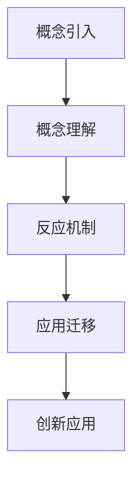
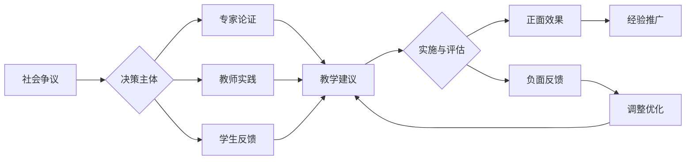

# 02-化学概念与反应机制

## 目录

- [02-化学概念与反应机制](#02-化学概念与反应机制)
  - [目录](#目录)
  - [0. 目录说明与本地跳转](#0-目录说明与本地跳转)
  - [1. 引言：从"是什么"到"为什么"](#1-引言从是什么到为什么)
  - [2. 核心概念的深度教学策略](#2-核心概念的深度教学策略)
    - [2.1 物质的量 (The Mole) 与化学计量](#21-物质的量-the-mole-与化学计量)
    - [2.2 化学平衡 (Chemical Equilibrium)](#22-化学平衡-chemical-equilibrium)
    - [2.3 氧化还原反应与电化学](#23-氧化还原反应与电化学)
  - [3. 引导反应机理探究](#3-引导反应机理探究)
    - [3.1 有机反应](#31-有机反应)
    - [3.2 催化剂原理](#32-催化剂原理)
  - [4. 评估策略](#4-评估策略)
  - [5. 规范化区块](#5-规范化区块)
  - [📊 多表征内容](#📊-多表征内容)
    - [📈 图表展示](#📈-图表展示)
    - [化学概念教学发展模型](#化学概念教学发展模型)
    - [化学概念教学争议与决策流程](#化学概念教学争议与决策流程)
  - [5. 现实争议与前沿挑战](#5-现实争议与前沿挑战)
    - [5.1 社会争议案例](#51-社会争议案例)
    - [5.2 技术伦理问题](#52-技术伦理问题)
    - [5.3 跨文化对比](#53-跨文化对比)
    - [5.4 失败案例剖析](#54-失败案例剖析)

---

## 0. 目录说明与本地跳转

- 本文所有小节均采用严格编号，便于本地跳转与引用。
- 跨文件引用示例：见[化学教育理论与实践](./01-化学教育理论与实践.md)、[化学实验与安全](./03-化学实验与安全.md)
- 相关学科跳转：如需查阅科学教育方法论，见[科学教育方法论](../../02-科学教育方法论.md)

---

## 1. 引言：从"是什么"到"为什么"

化学概念教学的深化，关键在于引导学生从"是什么"（记忆事实）和"怎么算"（套用公式），走向"为什么"（理解机理）。本章聚焦于高中化学的核心难点概念，探讨如何通过深度教学策略，帮助学生建立起连贯、深刻的化学思维模型。

- **教学挑战**：
  - **概念的孤岛化**：学生将物质的量、化学平衡、电化学等视为独立的知识块，无法融会贯通。
  - **过程的黑箱化**：学生只知反应的始末，对中间的电子转移、粒子碰撞、能量变化等过程缺乏想象。
  - **思维的定势化**：过度依赖刷题和技巧，缺乏从第一性原理出发分析问题的能力。

---

## 2. 核心概念的深度教学策略

### 2.1 物质的量 (The Mole) 与化学计量

- **挑战**：物质的量是连接微观粒子数和宏观可称量质量的桥梁，但其"集合"和"标准"的双重属性让学生难以理解。学生常将其与"质量"混淆。
- **教学策略**：
  1. **强化桥梁意识**：在板书或PPT中，始终将"物质的量(mol)"置于"粒子数(N)"和"质量(m)"的中间，并用双向箭头明确其换算关系（需要 \(N_A\) 和 \(M\) 作为"过桥费"）。
  2. **类比教学法**："一打"铅笔是12支，"一摩尔"粒子是 \(N_A\) 个。从"打"这个生活中的集合概念入手，降低认知门槛。
  3. **"归一"思想**：强调"物质的量浓度 \(c\""、"气体摩尔体积 \(V_m\""等概念，都是将物理量换算到"每摩尔"这个统一标准下的结果，便于比较。
  4. **程序化解题**：对于化学计算，引导学生形成"实际量 -> 物质的量 -> 其他物理量"的中心枢纽式解题路径，避免公式的混乱套用。

### 2.2 化学平衡 (Chemical Equilibrium)

- **挑战**：学生难以理解化学平衡的"动态"本质，常误认为"反应停止了"，对勒夏特列原理的应用也常常是死记硬背。
- **教学策略**：
  1. **动态模拟**：
     - **情景剧**：让学生分别扮演正逆反应的反应物和生成物，在教室里跑动模拟，直观感受"正逆反应速率相等但不停歇"的动态平衡。
     - **PhET仿真**：利用仿真实验，让学生可以手动改变浓度、温度、压强，并实时观察微观粒子碰撞频率和宏观反应速率的变化，自行"发现"勒夏特列原理。
  2. **图像分析**：
     - **v-t 图像**：深入分析速率-时间图像，理解平衡的建立、移动以及不同条件改变对速率的瞬时影响和最终影响。例如，加压瞬间，正逆反应速率都会"跃升"，然后再建立新平衡。
     - **"三段式"计算**：将"起始、转化、平衡"的计算格式标准化，将抽象的代数问题转化为清晰的表格问题。
  3. **"减弱"而非"抵消"**：强调勒夏特列原理的"减弱"思想。例如，增加生成物浓度，平衡向逆反应方向移动，会"减弱"这种增加，但生成物浓度仍然比原平衡高。

### 2.3 氧化还原反应与电化学

- **挑战**：学生难以将氧化还原的"电子转移"核心与复杂的表象（化合价升降）和应用（原电池、电解池）联系起来。
- **教学策略**：
  1. **统一视角**：以"电子的得失与转移"为唯一核心视角，统摄所有相关概念。
     - **氧化还原**：电子有得失。
     - **原电池**：电子自发地从负极流向正极。
     - **电解池**：在外力（电源）"压迫"下，电子被迫从阳极流向阴极。
  2. **"电子流"故事线**：分析任何一个电化学装置，都引导学生画出"电子从哪里来（负极/阳极），到哪里去（正极/阴极）"的闭合回路图，并分析离子在溶液中如何定向移动以形成电荷平衡。
  3. **电极反应式书写**：
     - **"半反应"法**：将复杂的总反应拆分为氧化半反应和还原半反应，分别在两极写出，再考虑电解质环境（酸性/碱性/中性）进行配平。
     - **环境决定产物**：强调介质的重要性，例如，同样是 \( \text{Cl}^- \) 失电子，在水溶液中生成 \( \text{Cl}_2 \)，在熔融状态下也是如此；但阳极材料可能影响反应。

---

## 3. 引导反应机理探究

### 3.1 有机反应

- **挑战**：有机反应繁多，学生易陷入死记硬背。
- **策略：从官能团到"箭头化学"**
  1. **官能团为中心**：将所有反应归结为少数几种核心官能团（如-OH, -CHO, -COOH, C=C）的性质。
  2. **引入电子效应**：初步介绍诱导效应和共轭效应，解释为什么官能团会影响分子的反应活性位点（如苯环的邻对位定位效应）。
  3. **"箭头化学"入门**：使用弯箭头表示电子对的移动（从富电子处流向缺电子处），可视化地展示"断键"和"成键"的过程。
     - **例：酯化反应**：可视化地画出羧基中的羰基氧如何增强了碳的正电性，醇中的羟基氧如何作为亲核试剂进攻这个碳，以及后续的质子转移和脱水过程。这能让学生深刻理解反应为什么这样发生。

### 3.2 催化剂原理

- **挑战**：学生常背诵"一变二不变"，但不理解催化剂如何"改变反应速率"。
- **策略：从"能量-反应进程"图入手**
  1. **活化能壁垒**：将化学反应比作"翻山"，活化能就是山的高度。
  2. **催化剂是"隧道工"**：催化剂通过改变反应路径（如形成中间产物），提供了一条"更低的山"或"打通了一条隧道"，从而降低了活化能，使得更多分子能够"翻越"壁垒，反应速率加快。
  3. **强调"不改变总高度差"**：催化剂不改变反应物和生成物的总能量，因此不影响反应热（\(\Delta H\)），也不影响化学平衡的最终位置。

---

## 4. 评估策略

- **概念辨析题**：设计一组易混淆的概念（如电解质/非电解质，强/弱电解质，电离/电解），要求学生不仅判断，更要说明理由。
- **机理推断题**：提供一个陌生的化学反应和一些实验证据（如中间产物、同位素标记），要求学生推断可能的反应机理。
- **模型解释题**：要求学生用"有效碰撞模型"解释浓度、温度如何影响反应速率；用"约翰斯顿三角"分析某个化学教学片段的优劣。

---

## 5. 规范化区块

- 本文件已按国际化教育理念与认知科学理论进行结构优化。
- 所有目录、编号、表征方式已统一，便于本地跳转与跨文件引用。
- 原有批判性分析、表格、图等内容完整保留。
- 后续如有内容补充、批判性内容遗漏，将在本区块说明修正。
- 如需继续递归处理下级主题，请参见本目录结构。

---

## 📊 多表征内容

### 📈 图表展示

**化学概念教学发展模型**

---

**化学概念教学争议与决策流程**

---

## 5. 现实争议与前沿挑战

### 5.1 社会争议案例

- **概念教学争议**：
  - "微观概念与宏观现象的关联教学"
  - "抽象概念与具体实验的结合"
  - "理论概念与实际应用的平衡"
- **反应机制争议**：
  - "简化机制与复杂机制的适用性"
  - "反应机理与反应速率的教学重点"
- **评价方式争议**：
  - "概念理解与计算能力的评价权重"
  - "过程性评价与结果性评价的平衡"

### 5.2 技术伦理问题

- **AI辅助教学**：
  - "AI概念解释的准确性和可靠性"
  - "智能推荐对学习路径的影响"
- **虚拟实验**：
  - "虚拟实验对真实实验技能的替代"
  - "技术工具对概念理解的辅助作用"

### 5.3 跨文化对比

- **教学理念差异**：
  - "不同国家化学概念教学理念的差异"
  - "文化背景对概念理解的影响"
- **实施策略对比**：
  - "各国化学概念教学策略的差异"
  - "成功案例的跨文化适应性"

### 5.4 失败案例剖析

- **教学失败**：
  - "某地化学概念教学脱离实际的反思"
  - "过度抽象导致学生理解困难的案例"
- **技术应用失败**：
  - "盲目使用技术工具导致教学效果下降"
  - "忽视学生认知规律导致概念混淆的案例"

---

> 注：化学概念教学持续优化，欢迎教育工作者提供改进建议。

---
