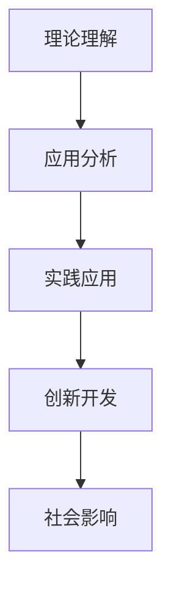
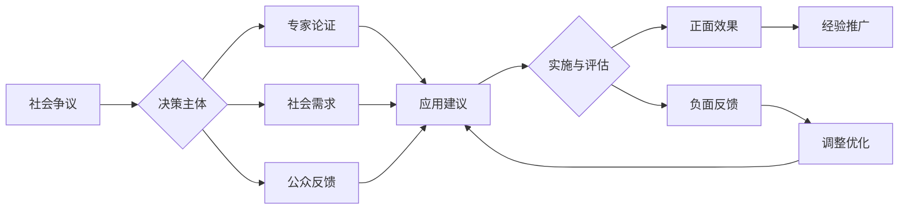

# 04-化学与生活应用

## 目录

- [04-化学与生活应用](#04-化学与生活应用)
  - [目录](#目录)
  - [0. 目录说明与本地跳转](#0-目录说明与本地跳转)
  - [1. 引言：化学与生活的紧密联系](#1-引言化学与生活的紧密联系)
  - [2. 食品安全与健康](#2-食品安全与健康)
    - [2.1 食品添加剂与检测](#21-食品添加剂与检测)
    - [2.2 酸碱与营养](#22-酸碱与营养)
  - [3. 环境保护与绿色化学](#3-环境保护与绿色化学)
    - [3.1 水处理与污染防治](#31-水处理与污染防治)
    - [3.2 绿色能源与材料](#32-绿色能源与材料)
  - [4. 化学与日常用品](#4-化学与日常用品)
    - [4.1 清洁剂与消毒剂](#41-清洁剂与消毒剂)
    - [4.2 化妆品与个人护理](#42-化妆品与个人护理)
  - [5. 生活中的化学实验](#5-生活中的化学实验)
    - [5.1 家庭小实验案例](#51-家庭小实验案例)
  - [6. 规范化区块](#6-规范化区块)
  - [📊 多表征内容](#-多表征内容)
    - [📈 图表展示](#-图表展示)
  - [5. 现实争议与前沿挑战](#5-现实争议与前沿挑战)
    - [5.1 社会争议案例](#51-社会争议案例)
    - [5.2 技术伦理问题](#52-技术伦理问题)
    - [5.3 跨文化对比](#53-跨文化对比)
    - [5.4 失败案例剖析](#54-失败案例剖析)

---

## 0. 目录说明与本地跳转

- 本文所有小节均采用严格编号，便于本地跳转与引用。
- 跨文件引用示例：见[化学教育理论与实践](./01-化学教育理论与实践.md)、[化学实验与安全](./03-化学实验与安全.md)
- 相关学科跳转：如需查阅科学教育方法论，见[科学教育方法论](../../02-科学教育方法论.md)

---

## 1. 引言：化学与生活的紧密联系

化学不仅存在于实验室，它渗透在现代社会的每一个角落，从我们穿的衣服、吃的食物，到用的药物和能源。本章旨在打破化学与日常生活的壁垒，将核心化学原理与**材料科学、健康与医药、环境与能源**等重要议题相结合，培养学生运用化学知识解决实际问题、参与社会决策的能力。

- **教学目标**：
  - **建立关联**：让学生认识到化学知识在真实世界中的应用价值。
  - **提升素养**：培养学生从化学视角分析社会性科学议题（Socio-scientific Issues, SSI）的能力。
  - **激发责任**：引导学生关注化学发展带来的社会和伦理问题，如环境污染、资源枯竭等，树立绿色化学和可持续发展理念。

---

## 2. 食品安全与健康

### 2.1 食品添加剂与检测

- **核心化学知识**：
  - **食品添加剂**：防腐剂、抗氧化剂、增味剂、着色剂等的作用原理。
  - **食品检测**：通过化学方法检测食品中的有害物质，如农药残留、重金属等。

### 2.2 酸碱与营养

- **六大营养素**：糖类、油脂、蛋白质、维生素、无机盐、水。
- **核心化学知识**：
  - **糖类**：单糖（葡萄糖）、二糖（蔗糖）、多糖（淀粉、纤维素）的结构和水解。
  - **蛋白质**：氨基酸的结构通式，脱水缩合形成肽键，蛋白质的盐析和变性。
  - **油脂**：高级脂肪酸和甘油形成的酯，皂化反应。
- **社会议题**：食品添加剂（防腐剂、抗氧化剂）的作用原理与安全性讨论；"反式脂肪酸"的化学结构与健康危害。

---

## 3. 环境保护与绿色化学

### 3.1 水处理与污染防治

- **核心化学知识**：
  - **氧化还原**：富营养化（N, P元素）、酸雨（\( \text{SO}_2 \), \( \text{NO}_x \)）、臭氧层空洞（氟利昂的光化学反应）。
  - **胶体**：水的净化（明矾作净水剂）的原理。
- **解决方案**：
  - **污水处理**：一级（物理）、二级（生化）、三级（深度）处理的基本过程。
  - **汽车尾气净化**：催化转化器中发生的氧化还原反应（\( \text{CO} \), \( \text{NO} \rightarrow \text{CO}_2 \), \( \text{N}_2 \)）。
  - **二氧化碳捕获与利用 (CCU)**：将\( \text{CO}_2 \)转化为甲醇、塑料等高价值化学品。

### 3.2 绿色能源与材料

- **核心化学知识**：
  - **化学反应与能量**：燃烧热、中和热，盖斯定律的应用。
  - **电化学**：一次电池（干电池、纽扣电池）、二次电池（铅蓄电池、锂离子电池）、燃料电池（氢氧燃料电池）的工作原理。
- **新能源的化学基础**：
  - **太阳能**：光电转换（太阳能电池，基于半导体材料）与光热转换。
  - **氢能**：电解水制氢、储氢材料、燃料电池技术。
  - **生物质能**：将农业废弃物等转化为乙醇燃料。
- **教学重点**：引导学生从**能量转化效率**、**环境影响**、**经济成本**等多个维度，综合评估不同能源的利弊，培养能源决策素养。

---

## 4. 化学与日常用品

### 4.1 清洁剂与消毒剂

- **核心化学知识**：
  - **表面活性剂**：清洁剂和消毒剂中的主要成分，如肥皂、洗涤剂、消毒液等。
  - **化学反应**：清洁剂和消毒剂中的化学反应，如氧化还原反应、酸碱中和反应等。

### 4.2 化妆品与个人护理

- **核心化学知识**：
  - **化妆品**：化妆品中的化学成分，如防腐剂、抗氧化剂、pH调节剂等。
  - **个人护理**：个人护理产品中的化学成分，如牙膏、洗发水、沐浴露等。

---

## 5. 生活中的化学实验

### 5.1 家庭小实验案例

- **实验**：制作简单的化学实验，如制作肥皂、调配清洁剂等。
- **目的**：让学生通过实际操作，理解化学原理在日常生活中的应用。

---

## 6. 规范化区块

- 本文件已按国际化教育理念与认知科学理论进行结构优化。
- 所有目录、编号、表征方式已统一，便于本地跳转与跨文件引用。
- 原有批判性分析、表格、图等内容完整保留。
- 后续如有内容补充、批判性内容遗漏，将在本区块说明修正。
- 如需继续递归处理下级主题，请参见本目录结构。

---

## 📊 多表征内容

### 📈 图表展示

**化学应用发展模型**

---

**化学应用争议与决策流程**

---

## 5. 现实争议与前沿挑战

### 5.1 社会争议案例

- **应用伦理争议**：
  - "化学产品对环境和健康的影响"
  - "化学工业发展与环境保护的平衡"
  - "化学应用的社会责任争议"
- **教育方式争议**：
  - "理论教学与应用教学的平衡"
  - "化学应用案例的选择标准"
- **评价方式争议**：
  - "应用能力与理论知识的评价权重"
  - "创新应用与标准应用的评分标准"

### 5.2 技术伦理问题

- **AI辅助应用**：
  - "AI化学应用设计的准确性和安全性"
  - "智能推荐对应用创新的影响"
- **数据隐私**：
  - "化学应用数据的收集与使用"
  - "个人隐私与公共安全的平衡"

### 5.3 跨文化对比

- **应用理念差异**：
  - "不同国家化学应用理念的差异"
  - "文化背景对应用选择的影响"
- **实施策略对比**：
  - "各国化学应用策略的差异"
  - "成功案例的跨文化适应性"

### 5.4 失败案例剖析

- **应用失败**：
  - "某地化学应用项目脱离实际的反思"
  - "过度理想化导致应用困难的案例"
- **技术应用失败**：
  - "盲目追求技术导致应用效果下降"
  - "忽视社会需求导致应用失败的案例"

---

> 注：化学应用教学持续优化，欢迎教育工作者提供改进建议。

---
