## 🔗 跨学科知识关联

### 生物与数学的定量分析

**📊 数学在生物学中的应用**

生物学从定性描述向定量分析发展，数学工具发挥着重要作用：

| 数学方法 | 生物应用 | 认知要求 | 典型例子 | 教学建议 |
|---------|----------|----------|----------|----------|
| **统计方法** | 遗传数据分析 | 统计思维 | 孟德尔遗传定律 | 概率模型构建 |
| **指数函数** | 种群增长模型 | 指数增长 | 细菌繁殖 | 增长曲线分析 |
| **对数函数** | 生物量测定 | 对数关系 | 吸光度测定 | 标准曲线法 |
| **几何图形** | 生物形态分析 | 空间思维 | 细胞形态 | 显微图像分析 |
| **概率论** | 遗传概率计算 | 概率思维 | 基因型预测 | 遗传棋盘法 |

### 生物与物理的能量统一

**⚡ 生命系统的物理基础**

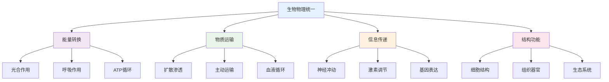

### 生物与化学的分子基础

**🔬 生命现象的化学本质**

| 化学概念 | 生物体现 | 统一理解 | 教学应用 | 认知难点 |
|---------|----------|----------|----------|----------|
| **有机化学** | 生物大分子 | 碳骨架结构 | 分子模型构建 | 空间结构理解 |
| **酶催化** | 生物催化剂 | 降低活化能 | 酶活性实验 | 催化机理理解 |
| **氧化还原** | 呼吸链反应 | 电子传递 | 呼吸作用实验 | 电子转移过程 |
| **酸碱平衡** | 体液pH调节 | 缓冲系统 | 酸碱度测定 | 缓冲原理理解 |

### 生物与英语的国际化发展

**🌍 生物英语的专业价值**

| 英语应用 | 生物价值 | 能力要求 | 学习方式 | 评估方法 |
|---------|----------|----------|----------|----------|
| **专业词汇** | 生物概念理解 | 术语记忆 | 词根词缀法 | 词汇测试 |
| **文献阅读** | 前沿知识获取 | 阅读理解 | 期刊文献阅读 | 理解测试 |
| **实验记录** | 规范表达能力 | 科学写作 | 双语实验报告 | 写作评估 |
| **国际交流** | 科学思想交流 | 口语表达 | 学术会议参与 | 交流评估 |

## 📚 生物教材内容与知识体系

### 20. 国际生物教材体系分析

**🌍 主要国家生物教材特色**

| 国家/地区 | 教材体系 | 核心特色 | 知识组织 | 教学方法 | 评估方式 |
|---------|----------|----------|----------|----------|----------|
| **美国** | NGSS标准 | 科学工程实践 | 概念整合 | 探究式学习 | 表现性评估 |
| **英国** | A-level体系 | 深度理论理解 | 模块化设计 | 实验导向 | 理论实验并重 |
| **德国** | Bildungsstandards | 系统严谨 | 逻辑递进 | 理论实践结合 | 概念应用 |
| **新加坡** | 21世纪技能 | 应用导向 | 情境化设计 | 问题解决 | 真实情境 |
| **日本** | Course of Study | 基础扎实 | 循序渐进 | 发现学习 | 综合评估 |

### 21. 生物知识图谱构建

**🔗 高中生物知识网络结构**

```mermaid
graph TD
    A[高中生物知识体系] --> B[分子与细胞]
    A --> C[遗传与进化]
    A --> D[稳态与调节]
    A --> E[生物与环境]
    A --> F[生物技术]
    A --> G[生物实验]
    
    B --> B1[细胞结构]
    B --> B2[细胞代谢]
    B --> B3[细胞分裂]
    B --> B4[细胞分化]
    B --> B5[细胞凋亡]
    
    C --> C1[遗传规律]
    C --> C2[基因表达]
    C --> C3[基因突变]
    C --> C4[生物进化]
    C --> C5[人类遗传]
    
    D --> D1[神经调节]
    D --> D2[体液调节]
    D --> D3[免疫调节]
    D --> D4[植物激素]
    D --> D5[生态系统]
    
    E --> E1[种群生态]
    E --> E2[群落生态]
    E --> E3[生态系统]
    E --> E4[环境保护]
    E --> E5[可持续发展]
    
    F --> F1[基因工程]
    F --> F2[细胞工程]
    F --> F3[发酵工程]
    F --> F4[生物制药]
    F --> F5[生物安全]
    
    G --> G1[实验设计]
    G --> G2[实验操作]
    G --> G3[数据处理]
    G --> G4[安全规范]
    G --> G5[创新实验]
    
    style A fill:#e3f2fd
    style B fill:#f3e5f5
    style C fill:#e8f5e8
    style D fill:#fff3e0
    style E fill:#fce4ec
    style F fill:#e0f2f1
    style G fill:#f1f8e9
```

### 22. 生物概念关联网络

**🔗 核心生物概念关联分析**

#### 22.1 细胞概念关联网络

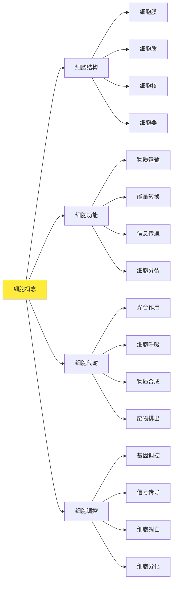

#### 22.2 遗传概念关联网络

| 遗传领域 | 核心概念 | 基础概念 | 关联概念 | 应用领域 | 认知难点 |
|---------|----------|----------|----------|----------|----------|
| **分子遗传** | 基因表达 | DNA复制、转录翻译 | 基因调控、表观遗传 | 基因治疗 | 分子机制理解 |
| **细胞遗传** | 染色体 | 细胞分裂、减数分裂 | 基因重组、突变 | 遗传病 | 染色体行为 |
| **群体遗传** | 基因频率 | 自然选择、遗传漂变 | 进化机制、适应 | 生物进化 | 群体变化 |
| **人类遗传** | 遗传病 | 单基因病、多基因病 | 基因诊断、治疗 | 医学应用 | 遗传模式 |

### 23. 生物知识发展路径

**📈 生物概念发展轨迹**

#### 23.1 生物概念发展路径

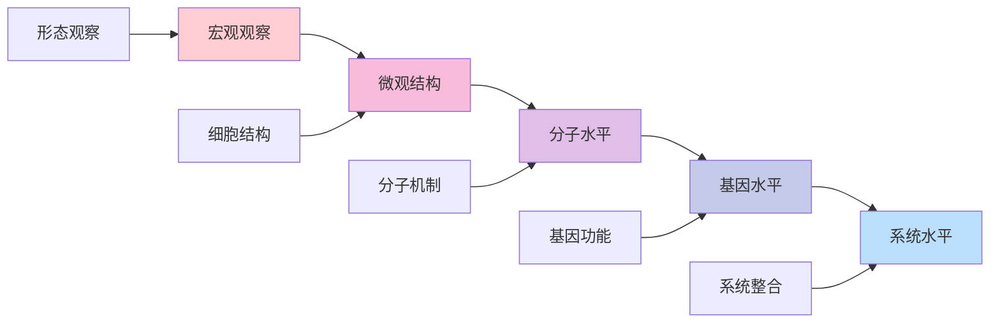

#### 23.2 生物思维发展

| 发展阶段 | 认知特征 | 思维表现 | 教学重点 | 评估标准 |
|---------|----------|----------|----------|----------|
| **观察描述** | 现象观察 | 现象描述 | 观察训练 | 观察准确性 |
| **结构分析** | 结构思维 | 结构分析 | 结构教学 | 结构理解度 |
| **功能理解** | 功能思维 | 功能分析 | 功能教学 | 功能掌握度 |
| **机制探究** | 机制思维 | 机制分析 | 机制教学 | 机制深度 |
| **系统整合** | 系统思维 | 系统分析 | 系统教学 | 系统能力 |

### 24. 国际化生物教学内容

**🌍 国际生物课程标准对比**

#### 24.1 美国NGSS生物标准

**📊 核心内容领域**:

| 内容领域 | 核心概念 | 科学实践 | 跨学科概念 | 评估标准 |
|---------|----------|----------|----------|----------|
| **结构与功能** | 生物结构 | 建模分析 | 系统模型 | 建模能力 |
| **物质能量** | 能量流动 | 实验设计 | 能量守恒 | 实验技能 |
| **信息处理** | 遗传信息 | 数据分析 | 信息传递 | 分析能力 |
| **生态系统** | 生态平衡 | 系统思维 | 稳定性 | 系统能力 |

#### 24.2 英国A-level生物特色

**🎯 英国生物教学方法**:

1. **实验探究方法**
   - 实验设计
   - 数据分析
   - 误差处理
   - 实验报告

2. **理论建模方法**
   - 概念建模
   - 数学建模
   - 计算机建模
   - 模型验证

3. **问题解决方法**
   - 问题分析
   - 策略选择
   - 方案执行
   - 结果评估

### 25. 生物知识关联深度分析

**🔗 跨领域知识关联**

#### 25.1 生物与化学的关联

| 生物概念 | 化学原理 | 关联深度 | 教学策略 | 学习效果 |
|---------|----------|----------|----------|----------|
| **生物分子** | 有机化学 | 深度关联 | 分子结构 | 理解深化 |
| **酶催化** | 催化原理 | 直接应用 | 实验结合 | 应用能力 |
| **代谢途径** | 反应机理 | 方法迁移 | 路径分析 | 思维培养 |
| **基因表达** | 分子机制 | 概念统一 | 多表征 | 综合能力 |

#### 25.2 生物与物理的关联

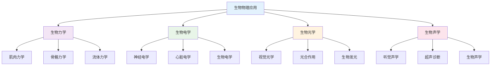

### 26. 生物实验教学体系

**🔬 基于知识图谱的实验教学**

#### 26.1 实验技能发展

| 实验技能 | 技能内容 | 发展要求 | 评估方法 | 应用领域 |
|---------|----------|----------|----------|----------|
| **实验设计** | 方案制定 | 科学性 | 设计评估 | 科学研究 |
| **仪器操作** | 设备使用 | 准确性 | 操作测试 | 实验研究 |
| **数据处理** | 数据分析 | 规范性 | 报告评估 | 数据分析 |
| **安全规范** | 安全操作 | 严谨性 | 安全测试 | 实验室安全 |

#### 26.2 实验教学创新

**🎯 现代生物实验教学**:

1. **虚拟实验环境**
   - 计算机模拟
   - 虚拟实验室
   - 远程实验

2. **智能实验系统**
   - 自动数据采集
   - 实时数据分析
   - 智能实验指导

3. **创新实验设计**
   - 探究性实验
   - 设计性实验
   - 综合性实验

### 27. 生物学习评估体系

**📊 基于知识图谱的评估框架**

#### 27.1 概念理解评估

| 评估维度 | 评估内容 | 评估方法 | 评估标准 | 发展指标 |
|---------|----------|----------|----------|----------|
| **概念准确性** | 定义理解 | 概念测试 | 准确表述 | 概念清晰度 |
| **概念关联性** | 知识网络 | 关联分析 | 网络完整性 | 关联深度 |
| **概念应用性** | 问题解决 | 应用测试 | 应用准确性 | 应用能力 |
| **概念创新性** | 创新思维 | 开放问题 | 创新程度 | 创新能力 |

#### 27.2 实验技能评估

**🎯 生物实验技能评估矩阵**:

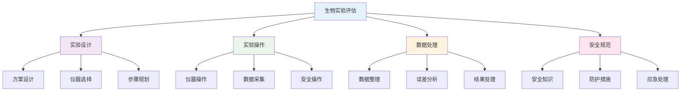

### 28. 生物教育国际化发展

**🌍 国际生物教育趋势**

#### 28.1 全球生物教育标准

| 标准体系 | 核心理念 | 内容特点 | 评估方式 | 发展趋势 |
|---------|----------|----------|----------|----------|
| **IB生物** | 国际视野 | 多元文化 | 综合评估 | 全球胜任力 |
| **AP生物** | 大学预备 | 深度内容 | 标准化测试 | 学术准备 |
| **A-level生物** | 深度理解 | 理论实验并重 | 过程评估 | 科学素养 |
| **NGSS生物** | 科学实践 | 真实情境 | 表现性评估 | 应用导向 |

#### 28.2 生物教育技术整合

**💻 数字化生物教育**:

1. **智能学习系统**
   - 个性化学习路径
   - 自适应评估
   - 实时反馈

2. **虚拟实验环境**
   - 生物模拟软件
   - 虚拟实验室
   - 远程实验

3. **协作学习平台**
   - 在线讨论
   - 项目协作
   - 资源共享

## 🔗 生物与其他学科关联性分析

### 20. 生物-数学学科关联

**🧮 生物与数学的深度融合**

#### 20.1 生物-数学关联网络

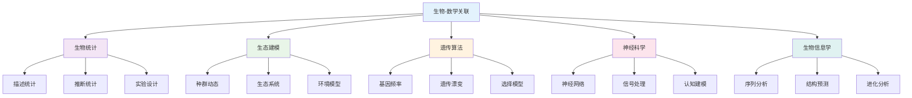

#### 20.2 生物-数学应用领域

| 生物领域 | 数学工具 | 应用内容 | 教学重点 | 能力培养 | 创新点 |
|---------|----------|----------|----------|----------|----------|
| **分子生物学** | 概率、统计 | 基因表达、蛋白质结构 | 数据分析 | 分析能力 | 基因工程 |
| **生态学** | 微分方程、统计 | 种群动态、生态系统 | 系统建模 | 建模能力 | 生态保护 |
| **神经科学** | 线性代数、统计 | 神经网络、认知过程 | 网络分析 | 网络思维 | 人工智能 |
| **生物信息学** | 算法、统计 | 序列分析、结构预测 | 算法设计 | 算法能力 | 精准医学 |
| **进化生物学** | 概率、统计 | 进化过程、遗传漂变 | 过程建模 | 建模能力 | 进化研究 |

### 21. 生物-物理学科关联

**⚛️ 生物与物理的交叉融合**

#### 21.1 生物-物理关联网络

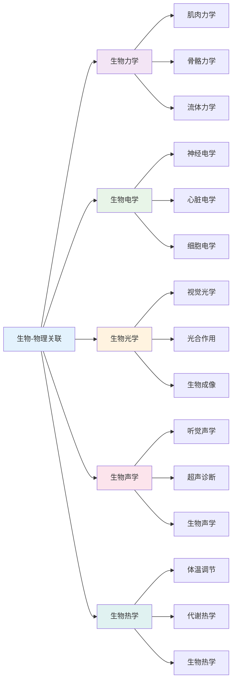

#### 21.2 生物-物理应用策略

| 物理领域 | 生物方法 | 应用内容 | 教学策略 | 学习效果 | 实践应用 |
|---------|----------|----------|----------|----------|----------|
| **力学** | 生物力学 | 运动分析、结构设计 | 力学分析 | 力学思维 | 医学应用 |
| **电学** | 生物电学 | 神经信号、心脏电学 | 电学分析 | 电学思维 | 医学诊断 |
| **光学** | 生物光学 | 视觉、光合作用 | 光学分析 | 光学思维 | 生物成像 |
| **声学** | 生物声学 | 听觉、超声诊断 | 声学分析 | 声学思维 | 医学诊断 |
| **热学** | 生物热学 | 体温调节、代谢 | 热学分析 | 热学思维 | 医学应用 |

### 22. 生物-化学学科关联

**🧪 生物与化学的交叉应用**

#### 22.1 生物-化学关联网络

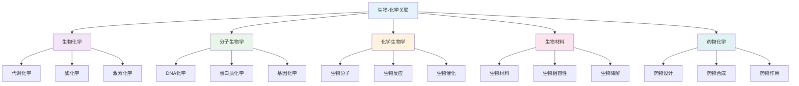

#### 22.2 生物-化学应用领域

| 化学领域 | 生物工具 | 应用内容 | 教学重点 | 能力培养 | 创新应用 |
|---------|----------|----------|----------|----------|----------|
| **分子化学** | 分子生物学、光谱 | 分子结构、分子反应 | 分子分析 | 分析能力 | 基因工程 |
| **细胞化学** | 细胞生物学、荧光 | 细胞成分、细胞反应 | 细胞分析 | 分析能力 | 细胞工程 |
| **生物医学** | 药物化学、分析 | 药物设计、医学诊断 | 医学应用 | 应用能力 | 精准医学 |
| **生物工程** | 生物材料、催化 | 生物材料、生物催化 | 工程应用 | 工程能力 | 生物技术 |
| **环境生物学** | 环境化学、分析 | 环境污染、生物修复 | 环境应用 | 应用能力 | 生态修复 |

### 23. 生物-语言学科关联

**📝 生物与语言学科的思维关联**

#### 23.1 生物-语文关联分析

| 关联维度 | 生物内容 | 语文应用 | 教学策略 | 能力培养 | 创新点 |
|---------|----------|----------|----------|----------|----------|
| **逻辑思维** | 生物推理、证明 | 论证写作、批判思维 | 逻辑训练 | 逻辑能力 | 思维整合 |
| **描述能力** | 生物现象描述 | 科学描写、观察写作 | 描述训练 | 描述能力 | 表达整合 |
| **概念理解** | 生物概念、原理 | 概念解释、原理阐述 | 概念训练 | 理解能力 | 概念整合 |
| **系统思维** | 生物系统、关系 | 生态系统、文化关系 | 系统分析 | 系统能力 | 整体思维 |

#### 23.2 生物-英语关联分析

| 关联领域 | 生物概念 | 英语应用 | 教学方法 | 学习效果 | 应用价值 |
|---------|----------|----------|----------|----------|----------|
| **科学英语** | 生物术语、概念 | 英语表达、学术写作 | 术语教学 | 术语理解 | 国际交流 |
| **逻辑表达** | 生物逻辑、推理 | 英语逻辑、论证 | 逻辑训练 | 逻辑表达 | 学术写作 |
| **实验报告** | 生物实验、数据 | 英语报告、数据分析 | 报告教学 | 报告能力 | 科研写作 |
| **科学交流** | 生物发现、理论 | 英语交流、学术讨论 | 交流教学 | 交流能力 | 国际合作 |

### 24. 生物-人文学科关联

**🎭 生物与人文社科的交叉融合**

#### 24.1 生物-历史关联

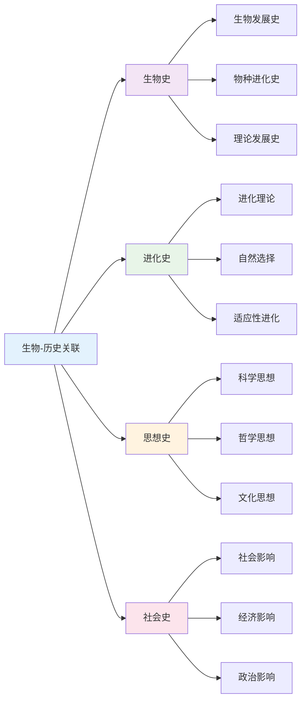

#### 24.2 生物-哲学关联

| 哲学领域 | 生物概念 | 哲学应用 | 教学重点 | 能力培养 | 应用价值 |
|---------|----------|----------|----------|----------|----------|
| **认识论** | 观察、实验 | 知识获取、真理认识 | 认识分析 | 认识能力 | 科学哲学 |
| **本体论** | 生命、进化 | 存在本质、世界本质 | 本体分析 | 本体思维 | 哲学思考 |
| **方法论** | 实验、理论 | 科学方法、思维方法 | 方法分析 | 方法能力 | 科学方法 |
| **价值论** | 生命价值 | 生命伦理、价值判断 | 价值分析 | 价值能力 | 生命伦理 |

### 25. 生物-艺术学科关联

**🎨 生物与艺术的创造性融合**

#### 25.1 生物-艺术关联网络

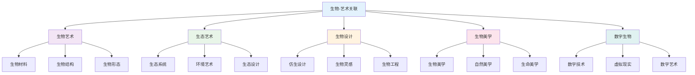

#### 25.2 生物-艺术应用领域

| 艺术领域 | 生物概念 | 艺术应用 | 教学方法 | 学习效果 | 创新价值 |
|---------|----------|----------|----------|----------|----------|
| **视觉艺术** | 生物形态、结构 | 绘画、雕塑 | 形态教学 | 形态感知 | 艺术设计 |
| **生态艺术** | 生态系统、环境 | 环境装置、生态艺术 | 生态教学 | 生态感知 | 生态艺术 |
| **仿生设计** | 生物结构、功能 | 建筑设计、产品设计 | 设计教学 | 设计能力 | 创新设计 |
| **数字艺术** | 数字技术、编程 | 数字创作、动画 | 技术教学 | 技术能力 | 数字创作 |

### 26. 跨学科生物教学策略

**🎯 基于关联性的生物教学**

#### 26.1 强关联学科教学策略

| 关联类型 | 教学策略 | 内容整合 | 方法创新 | 评估方式 | 发展目标 |
|---------|----------|----------|----------|----------|----------|
| **生物-数学** | 统计教学 | 生物数据数学化 | 统计分析 | 统计评估 | 统计能力 |
| **生物-物理** | 应用教学 | 生物物理一体化 | 物理应用 | 应用评估 | 应用能力 |
| **生物-化学** | 实验教学 | 生物化学一体化 | 综合实验 | 实验评估 | 实验能力 |

#### 26.2 中关联学科教学策略

| 关联类型 | 教学策略 | 内容整合 | 方法创新 | 评估方式 | 发展目标 |
|---------|----------|----------|----------|----------|----------|
| **生物-语文** | 描述教学 | 生物现象语文化 | 科学写作 | 写作评估 | 写作能力 |
| **生物-英语** | 术语教学 | 生物术语英语化 | 术语训练 | 术语评估 | 术语能力 |
| **生物-历史** | 史实教学 | 生物发展历史化 | 历史分析 | 历史评估 | 历史能力 |

### 27. 生物跨学科评估体系

**📊 基于关联性的生物评估**

#### 27.1 跨学科生物能力评估

| 评估维度 | 评估内容 | 评估方法 | 评估标准 | 发展指标 |
|---------|----------|----------|----------|----------|
| **观察能力** | 生物观察 | 观察测试 | 准确观察 | 观察深度 |
| **实验能力** | 生物实验 | 实验测试 | 准确实验 | 实验质量 |
| **分析能力** | 数据分析 | 分析测试 | 深度分析 | 分析质量 |
| **应用能力** | 生物应用 | 应用测试 | 有效应用 | 应用创新 |

#### 27.2 跨学科生物综合评估

**🎯 生物跨学科综合能力评估矩阵**:

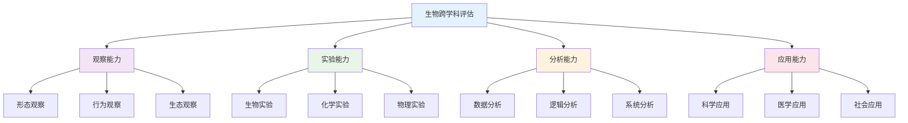

### 28. 生物跨学科发展趋势

**🌍 国际生物跨学科教育趋势**

#### 28.1 全球生物跨学科趋势

| 发展趋势 | 核心理念 | 内容特点 | 实施策略 | 发展前景 |
|---------|----------|----------|----------|----------|
| **STEM教育** | 科学工程整合 | 生物建模 | 项目学习 | 科技创新 |
| **STEAM教育** | 艺术融合 | 生物艺术 | 创意教学 | 创意发展 |
| **合成生物学** | 工程生物学 | 生物设计 | 设计教学 | 生物工程 |
| **人工智能** | 智能算法 | 生物AI | 智能教学 | 智能应用 |

#### 28.2 生物跨学科技术整合

**💻 数字化生物跨学科教育**:

1. **智能观察系统**
   - 自动观察工具
   - 可视化观察
   - 实时观察反馈

2. **虚拟生物实验室**
   - 虚拟实验环境
   - 交互式实验
   - 协作实验平台

3. **多媒体生物平台**
   - 生物资源库
   - 观察工具集
   - 评估数据库
