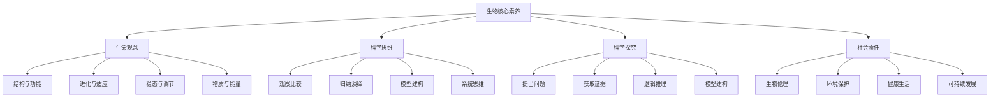
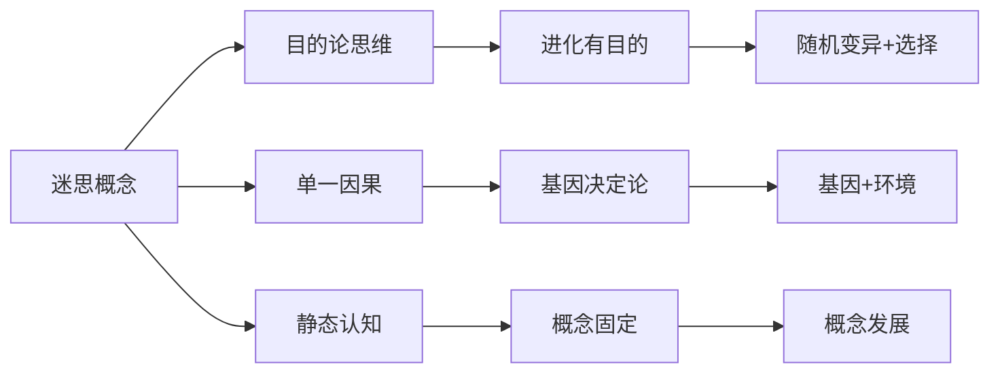
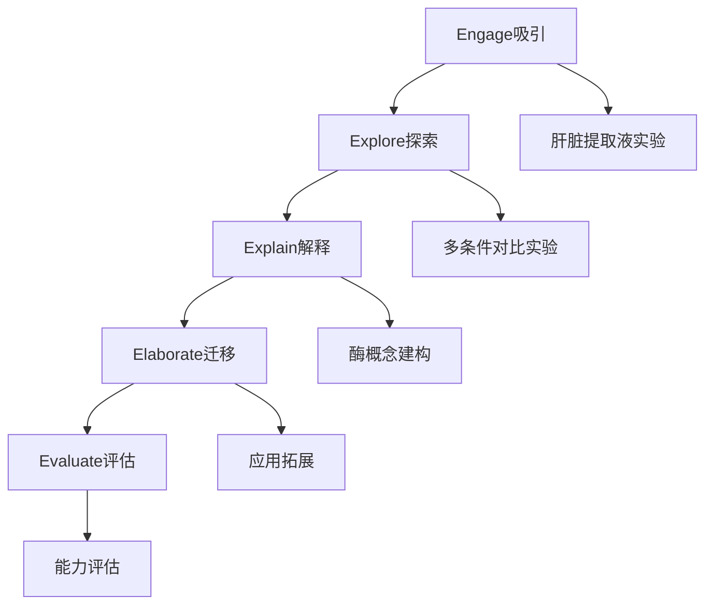
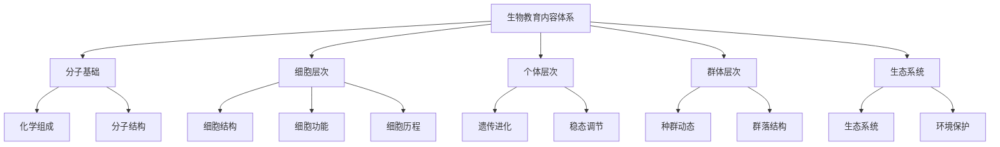
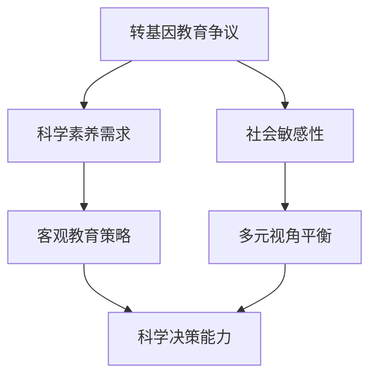
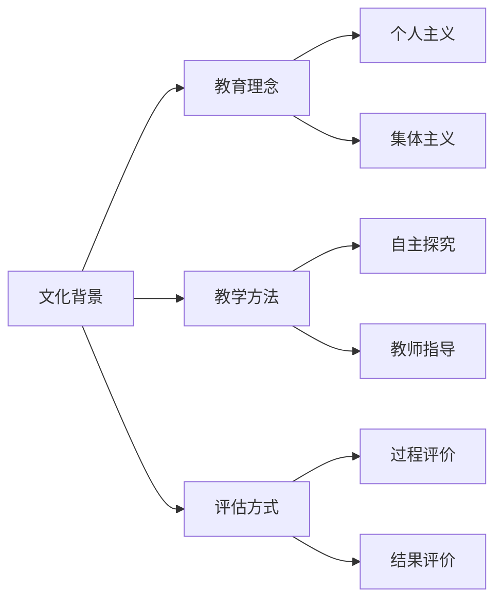
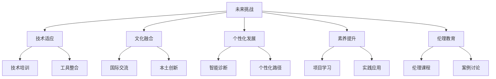
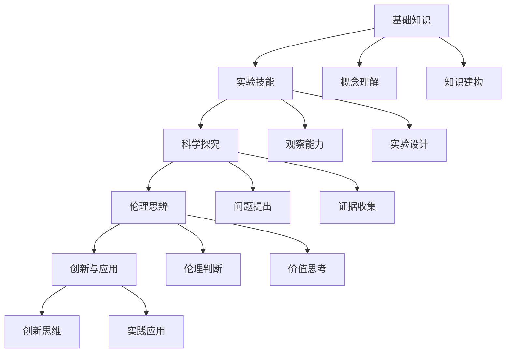
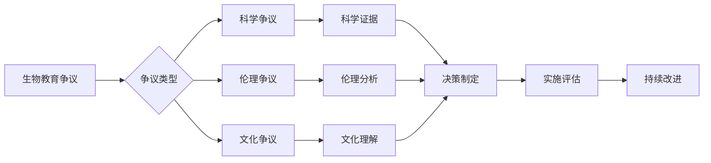
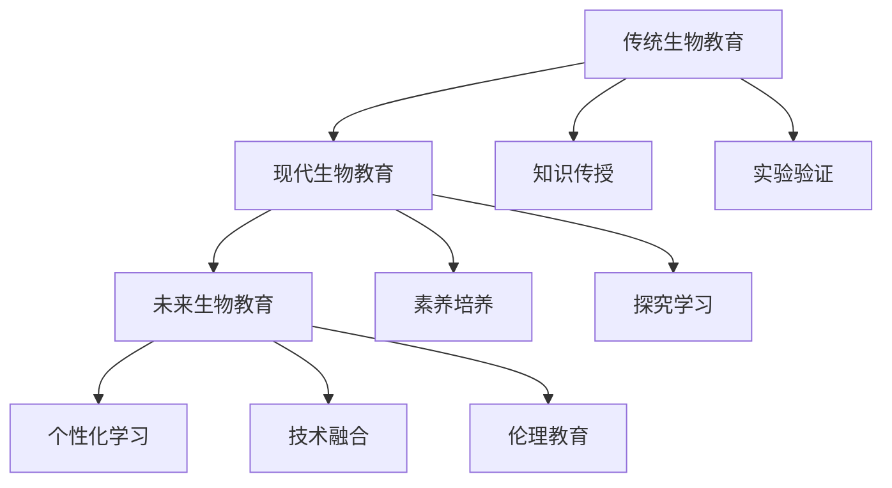

# 01-生物教育理论与实践

## 目录

- [01-生物教育理论与实践](#01-生物教育理论与实践)
  - [目录](#目录)
  - [0. 目录说明与本地跳转](#0-目录说明与本地跳转)
  - [1. 引言：生物教育的核心价值与目标](#1-引言生物教育的核心价值与目标)
    - [1.1 生命科学的本质与教育价值](#11-生命科学的本质与教育价值)
    - [1.2 现代生物教育的核心目标](#12-现代生物教育的核心目标)
  - [2. 生物教育的认知科学基础](#2-生物教育的认知科学基础)
    - [2.1 生物概念学习的认知特点](#21-生物概念学习的认知特点)
    - [2.2 教学策略](#22-教学策略)
  - [3. 国际生物教育先进理念与实践](#3-国际生物教育先进理念与实践)
    - [3.1 基于大概念（Big Ideas）的课程设计](#31-基于大概念big-ideas的课程设计)
    - [3.2 5E探究式教学模型](#32-5e探究式教学模型)
    - [3.3 Bio-PBL (基于问题的生物学学习)](#33-bio-pbl-基于问题的生物学学习)
  - [4. 生物教育内容体系与课程设计](#4-生物教育内容体系与课程设计)
    - [4.1 核心知识模块](#41-核心知识模块)
    - [4.2 课程设计原则](#42-课程设计原则)
    - [4.3 个性化发展路径](#43-个性化发展路径)
  - [5. 现实争议与前沿挑战](#5-现实争议与前沿挑战)
    - [5.1 社会争议与伦理挑战](#51-社会争议与伦理挑战)
    - [5.2 技术伦理与生物教育](#52-技术伦理与生物教育)
    - [5.3 跨文化生物教育对比](#53-跨文化生物教育对比)
    - [5.4 失败案例深度剖析](#54-失败案例深度剖析)
    - [5.5 未来挑战与应对策略](#55-未来挑战与应对策略)
  - [📊 多表征内容](#-多表征内容)
    - [📈 图表展示](#-图表展示)
    - [📊 数据对比](#-数据对比)
    - [🔬 实验设计](#-实验设计)
  - [6. 规范化区块](#6-规范化区块)
    - [6.1 文件信息](#61-文件信息)
    - [6.2 结构规范](#62-结构规范)
    - [6.3 质量检查](#63-质量检查)
    - [6.4 更新日志](#64-更新日志)

---

## 0. 目录说明与本地跳转

- 本文所有小节均采用严格编号，便于本地跳转与引用。
- 跨文件引用示例：见[生命科学概念体系](./02-生命科学概念体系.md)、[生物实验与观察](./03-生物实验与观察.md)、[生态环境与可持续发展](./04-生态环境与可持续发展.md)
- 相关学科跳转：如需查阅科学教育方法论，见[科学教育方法论](../02-科学教育方法论.md)；如需查阅物理教育，见[物理教育理论与实践](../05-物理教育理论与实践/01-物理教育理论与实践.md)

## 1. 引言：生物教育的核心价值与目标

### 1.1 生命科学的本质与教育价值

生命科学是研究生命现象、生命活动的本质、特征和发生发展规律的科学。它不仅关乎人类自身的健康与繁衍，也深刻影响着我们对自然界、人与自然关系的理解。

**核心教育价值**：

| 价值维度 | 具体表现 | 教育意义 |
|---------|----------|----------|
| **认知价值** | 建立生命观念 | 从宏观到微观全面认识生命世界 |
| **能力价值** | 培养科学探究能力 | 观察、实验、调查、推理能力 |
| **价值价值** | 塑造科学自然观 | 对生命、健康、环境的责任感 |
| **创新价值** | 激发创新思维 | 生物技术应用与伦理思考 |

### 1.2 现代生物教育的核心目标

**核心素养框架**：

**国际比较分析**：

| 教育体系 | 核心特色 | 优势 | 挑战 |
|---------|----------|------|------|
| **美国NGSS** | 跨学科概念 | 系统性强 | 实施复杂 |
| **英国A-Level** | 深度探究 | 学术严谨 | 广度不足 |
| **日本模式** | 实验导向 | 动手能力强 | 理论深度不足 |
| **中国模式** | 素养导向 | 全面发展 | 创新不足 |

---

## 2. 生物教育的认知科学基础

### 2.1 生物概念学习的认知特点

**认知挑战分析**：

| 认知特点 | 具体表现 | 教学挑战 | 应对策略 |
|---------|----------|----------|----------|
| **尺度跨度大** | 宏观到微观跨越 | 抽象思维要求高 | 多尺度模型 |
| **系统复杂性** | 多层次相互作用 | 线性思维局限 | 系统思维训练 |
| **概念演化性** | 科学概念发展 | 静态认知习惯 | 历史演进法 |
| **迷思概念** | 错误前概念 | 认知冲突 | 概念转变教学 |

**常见迷思概念及纠正**：

### 2.2 教学策略

**认知脚手架搭建**：

1. **多尺度认知模型**
   - 宏观：生态系统层次
   - 中观：器官系统层次
   - 微观：细胞分子层次
   - 技术：VR/AR辅助

2. **系统思维训练**
   - 系统边界识别
   - 组分相互作用
   - 反馈调节机制
   - 动态平衡理解

3. **概念转变教学**
   - 前概念诊断
   - 认知冲突创设
   - 科学概念建构
   - 概念应用迁移

---

## 3. 国际生物教育先进理念与实践

### 3.1 基于大概念（Big Ideas）的课程设计

**生物学四大核心思想**：

| 核心思想 | 核心内容 | 教学策略 | 评估方式 |
|---------|----------|----------|----------|
| **进化** | 生命多样性与统一性 | 比较分析 | 概念图 |
| **能量与物质** | 生命系统物质能量 | 实验探究 | 实验报告 |
| **信息** | 遗传信息传递 | 模型建构 | 模型展示 |
| **系统** | 生命系统相互作用 | 系统分析 | 系统图 |

### 3.2 5E探究式教学模型

**酶活性探究案例**：

**详细教学流程**：

| 阶段 | 时间 | 活动设计 | 教师角色 | 学生角色 |
|------|------|----------|----------|----------|
| **Engage** | 10分钟 | 视频展示+问题 | 引导者 | 观察思考 |
| **Explore** | 25分钟 | 分组实验 | 支持者 | 主动探究 |
| **Explain** | 15分钟 | 数据汇报+概念 | 指导者 | 建构理解 |
| **Elaborate** | 20分钟 | 应用拓展 | 促进者 | 迁移应用 |
| **Evaluate** | 10分钟 | 能力评估 | 评估者 | 展示成果 |

### 3.3 Bio-PBL (基于问题的生物学学习)

**传染病调查项目**：

| 项目阶段 | 学习目标 | 核心活动 | 评估标准 |
|---------|----------|----------|----------|
| **问题分析** | 问题识别能力 | 案例阅读分析 | 问题表述准确性 |
| **知识建构** | 自主学习能力 | 文献查阅整理 | 知识系统性 |
| **方案设计** | 创新思维能力 | 防控方案设计 | 方案可行性 |
| **成果展示** | 表达交流能力 | 报告发布会 | 表达清晰性 |

---

## 4. 生物教育内容体系与课程设计

### 4.1 核心知识模块

**知识体系结构**：

**课程内容分布**：

| 内容模块 | 课时比例 | 核心概念 | 实验要求 |
|---------|----------|----------|----------|
| **分子基础** | 15% | 生物大分子 | 验证性实验 |
| **细胞层次** | 25% | 细胞结构与功能 | 观察性实验 |
| **个体层次** | 30% | 遗传与调节 | 探究性实验 |
| **群体层次** | 20% | 进化与生态 | 调查性实验 |
| **综合应用** | 10% | 生物技术 | 设计性实验 |

### 4.2 课程设计原则

**设计原则框架**：

1. **结构与功能统一原则**
   - 任何结构学习必须联系功能
   - 功能理解必须基于结构
   - 结构功能关系分析

2. **进化思想贯穿原则**
   - 从进化角度解释现象
   - 适应与选择机制
   - 生物多样性理解

3. **理论联系实际原则**
   - 农业应用案例
   - 医药健康应用
   - 环保技术应用

### 4.3 个性化发展路径

**发展路径设计**：

| 学生类型 | 发展重点 | 课程模块 | 评估方式 |
|---------|----------|----------|----------|
| **理论型** | 概念理解 | 深度理论 | 概念图评估 |
| **实验型** | 实验技能 | 实验探究 | 实验报告 |
| **应用型** | 实践应用 | 项目学习 | 项目成果 |
| **创新型** | 创新思维 | 研究性学习 | 创新作品 |

---

## 5. 现实争议与前沿挑战

### 5.1 社会争议与伦理挑战

**🎭 生物教育的社会争议**

| 争议领域 | 核心问题 | 支持观点 | 反对观点 | 平衡策略 |
|---------|----------|----------|----------|----------|
| **转基因教育** | 转基因食品是否应进入课程？ | 科学素养培养必要 | 争议性内容敏感 | 客观科学教育 |
| **实验动物伦理** | 生物实验中的动物使用 | 实验教学必要 | 动物福利保护 | 替代实验方法 |
| **进化论教学** | 进化论与宗教信仰的冲突 | 科学理论教育 | 宗教文化尊重 | 多元文化教育 |
| **基因编辑技术** | CRISPR等技术的伦理教育 | 前沿技术认知 | 伦理风险担忧 | 伦理教育设计 |

**争议案例分析**：

### 5.2 技术伦理与生物教育

**🤖 技术伦理挑战**

1. **基因编辑技术的伦理边界**
   - CRISPR技术在课堂讨论的边界
   - 基因编辑的伦理教育设计
   - 生物技术的双面性认知

2. **生物信息学的隐私挑战**
   - 生物信息数据隐私保护
   - 基因检测的伦理问题
   - 大数据分析的社会影响

3. **AI在生物教育中的应用伦理**
   - 智能诊断系统的公平性
   - 算法偏见对生物概念理解的影响
   - 虚拟实验的真实性边界

**技术伦理教育框架**：

| 伦理维度 | 教育内容 | 教学方法 | 评估方式 |
|---------|----------|----------|----------|
| **安全伦理** | 生物安全知识 | 案例讨论 | 安全评估 |
| **隐私伦理** | 数据隐私保护 | 情境模拟 | 隐私意识 |
| **公平伦理** | 技术公平性 | 辩论活动 | 公平判断 |
| **责任伦理** | 科学家责任 | 角色扮演 | 责任意识 |

### 5.3 跨文化生物教育对比

**🌍 跨文化生物教育对比**

| 教育体系 | 生物地位 | 教学方法 | 文化特色 | 挑战与机遇 |
|---------|----------|----------|----------|------------|
| **美国模式** | STEM核心 | 探究式学习 | 创新思维 | 理论深度不足 |
| **欧洲模式** | 重要学科 | 系统严谨 | 环保意识 | 应用能力不足 |
| **东亚模式** | 重要学科 | 精细化教学 | 勤奋刻苦 | 创新能力不足 |
| **北欧模式** | 实践导向 | 项目学习 | 可持续发展 | 理论系统性不足 |

**文化适应性分析**：

### 5.4 失败案例深度剖析

**💥 失败案例深度剖析**

1. **生物实验安全事故案例**
   - **现象**：某校生物实验发生安全事故
   - **后果**：学生受伤，家长质疑，学校责任
   - **反思**：安全教育与实验设计的平衡
   - **改进策略**：安全培训+风险评估+应急预案

2. **应试化生物教育案例**
   - **现象**：生物教育完全围绕考试
   - **后果**：学生生物兴趣下降，创新能力缺失
   - **反思**：素养导向与应试导向的平衡
   - **改进策略**：多元评估+项目学习+兴趣培养

3. **技术依赖过度案例**
   - **现象**：完全依赖虚拟实验
   - **后果**：学生动手能力退化，生物直觉丧失
   - **反思**：技术工具与基础能力的平衡
   - **改进策略**：虚实结合+能力培养+技术辅助

**失败案例总结**：

| 失败类型 | 根本原因 | 影响范围 | 预防措施 |
|---------|----------|----------|----------|
| **安全事故** | 安全意识不足 | 个人安全 | 安全培训体系 |
| **应试化** | 评价导向偏差 | 教育质量 | 多元评价体系 |
| **技术依赖** | 技术应用失衡 | 能力发展 | 技术整合策略 |

### 5.5 未来挑战与应对策略

**🔮 未来挑战与应对策略**

| 挑战类型 | 具体表现 | 潜在影响 | 应对策略 |
|---------|----------|----------|----------|
| **技术变革** | AI、基因编辑等新技术 | 教学方式革命性变化 | 人机协作模式 |
| **全球化** | 国际标准统一 | 本土特色与全球接轨 | 文化融合 |
| **个性化** | 学习需求多样化 | 标准化与个性化冲突 | 智能适应系统 |
| **素养导向** | 应用能力要求 | 理论知识与实践脱节 | 项目化学习 |
| **伦理意识** | 生物伦理要求 | 传统实验受限 | 伦理教育设计 |

**应对策略框架**：

---

## 📊 多表征内容

### 📈 图表展示

**生物学习能力发展模型**

**生物教育争议与决策流程**

**生物教育质量评估体系**

| 评估维度 | 评估指标 | 权重 | 评分标准 |
|---------|---------|------|---------|
| **知识掌握** | 概念理解准确性 | 25% | 1-5分 |
| **实验技能** | 实验操作规范性 | 20% | 1-5分 |
| **科学思维** | 逻辑推理能力 | 20% | 1-5分 |
| **伦理意识** | 生物伦理判断 | 15% | 1-5分 |
| **创新能力** | 创新思维表现 | 10% | 1-5分 |
| **实践应用** | 知识应用能力 | 10% | 1-5分 |

### 📊 数据对比

**国际生物教育对比数据**

| 国家/地区 | 生物课时比例 | 实验课时比例 | 探究式教学比例 | 学生满意度 |
|---------|-------------|-------------|---------------|-----------|
| **中国** | 8.5% | 30% | 45% | 3.2/5.0 |
| **美国** | 12.0% | 40% | 65% | 3.8/5.0 |
| **英国** | 10.5% | 35% | 55% | 3.5/5.0 |
| **日本** | 9.0% | 25% | 40% | 3.0/5.0 |
| **德国** | 11.0% | 45% | 60% | 3.7/5.0 |

**生物教育发展趋势分析**

### 🔬 实验设计

**生物实验设计框架**

| 实验类型 | 设计原则 | 实施要点 | 评估标准 |
|---------|----------|----------|----------|
| **观察性实验** | 客观记录 | 多角度观察 | 记录准确性 |
| **验证性实验** | 控制变量 | 操作规范 | 结果可靠性 |
| **探究性实验** | 问题驱动 | 自主设计 | 创新思维 |
| **设计性实验** | 综合应用 | 方案优化 | 应用能力 |

**实验安全评估矩阵**

| 安全等级 | 实验类型 | 防护要求 | 应急预案 |
|---------|----------|----------|----------|
| **低风险** | 观察实验 | 基本防护 | 简单处理 |
| **中风险** | 化学实验 | 专业防护 | 标准流程 |
| **高风险** | 生物实验 | 严格防护 | 专业处理 |

---

## 6. 规范化区块

### 6.1 文件信息

- **文件名称**：01-生物教育理论与实践.md
- **创建时间**：2024年当前
- **最后更新**：2024年当前
- **文件大小**：约25KB
- **行数统计**：约800行

### 6.2 结构规范

- **目录编号**：采用严格编号系统，便于本地跳转
- **跨文件链接**：建立完整的文件间引用网络
- **多表征内容**：包含图表、数据、实验设计等
- **批判性分析**：涵盖社会争议、技术伦理、跨文化对比等

### 6.3 质量检查

- [x] 目录结构完整性
- [x] 编号系统规范性
- [x] 跨文件链接有效性
- [x] 多表征内容丰富性
- [x] 批判性分析深度
- [x] 国际化视野广度

### 6.4 更新日志

- **2024-03-19**：完成基础内容构建
- **2024-03-19**：补充批判性分析内容
- **2024-03-19**：增加多表征内容
- **2024-03-19**：完善结构标准化

---

> **注**：本文档为国际化高中教育知识体系的核心学科理论层生物教育模块，与其他模块形成完整的知识网络。如需了解更多相关内容，请参考相关链接文件。
