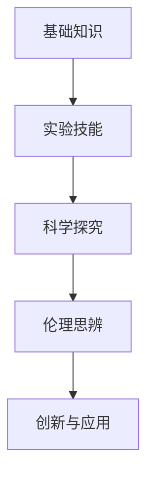
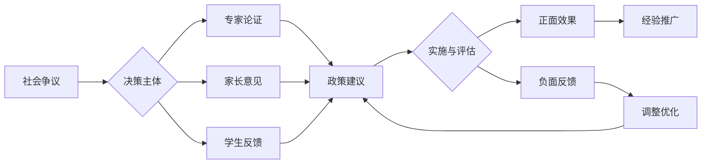

# 01-生物教育理论与实践

## 目录

- [01-生物教育理论与实践](#01-生物教育理论与实践)
  - [目录](#目录)
  - [0. 目录说明与本地跳转](#0-目录说明与本地跳转)
  - [1. 引言：生物教育的核心价值与目标](#1-引言生物教育的核心价值与目标)
    - [1.1 生命科学的本质与教育价值](#11-生命科学的本质与教育价值)
    - [1.2 现代生物教育的核心目标](#12-现代生物教育的核心目标)
  - [2. 生物教育的认知科学基础](#2-生物教育的认知科学基础)
    - [2.1 生物概念学习的认知特点](#21-生物概念学习的认知特点)
    - [2.2 教学策略](#22-教学策略)
  - [3. 国际生物教育先进理念与实践](#3-国际生物教育先进理念与实践)
    - [3.1 基于大概念（Big Ideas）的课程设计](#31-基于大概念big-ideas的课程设计)
    - [3.2 5E探究式教学模型](#32-5e探究式教学模型)
    - [3.3 Bio-PBL (基于问题的生物学学习)](#33-bio-pbl-基于问题的生物学学习)
  - [4. 生物教育内容体系与课程设计](#4-生物教育内容体系与课程设计)
    - [4.1 核心知识模块](#41-核心知识模块)
    - [4.2 课程设计原则](#42-课程设计原则)
    - [4.2 个性化发展路径](#42-个性化发展路径)
  - [5. 生物教学方法与策略](#5-生物教学方法与策略)
    - [5.1 观察与实验](#51-观察与实验)
    - [5.2 模型建构](#52-模型建构)
    - [5.3 评估体系](#53-评估体系)
    - [5.1 现实争议与前沿挑战](#51-现实争议与前沿挑战)
  - [6. 规范化区块](#6-规范化区块)

---

## 0. 目录说明与本地跳转

- 本文所有小节均采用严格编号，便于本地跳转与引用。
- 跨文件引用示例：见[生命科学概念体系](./02-生命科学概念体系.md)、[生物实验与观察](./03-生物实验与观察.md)
- 相关学科跳转：如需查阅科学教育方法论，见[科学教育方法论](../../02-科学教育方法论.md)

## 1. 引言：生物教育的核心价值与目标

### 1.1 生命科学的本质与教育价值

生命科学是研究生命现象、生命活动的本质、特征和发生发展规律的科学。它不仅关乎人类自身的健康与繁衍，也深刻影响着我们对自然界、人与自然关系的理解。

- **建立生命观念**：引导学生从宏观（生态系统）到微观（分子层面）全面、系统地认识生命世界，理解生命的统一性和多样性。
- **培养科学探究能力**：生物学提供了丰富的观察、实验和调查情境，是培养学生提出问题、获取证据、逻辑推理和模型建构能力的绝佳载体。
- **塑造价值认同**：通过学习进化、生态和遗传等知识，帮助学生建立科学的自然观、生命观，并形成对生命、健康和环境的责任感。

### 1.2 现代生物教育的核心目标

- **核心素养 (Core Competencies)**：
  - **生命观念 (Life Concepts)**：形成关于结构与功能、进化与适应、稳态与调节、物质与能量等核心概念的结构化网络。
  - **科学思维 (Scientific Thinking)**：掌握观察、比较、归纳、演绎等方法，特别是模型建构和系统思维。
  - **科学探究 (Scientific Inquiry)**：具备设计和实施生物学调查和实验的能力，能够基于证据得出结论。
  - **社会责任 (Social Responsibility)**：理解生物技术发展带来的伦理问题（如基因编辑），关注生物多样性保护和可持续发展。
- **国际比较**：美国NGSS标准强调"跨学科概念"（如系统与模型、能量与物质）和"科学与工程实践"在生物教学中的贯穿。例如，将生态系统教学与"设计一个可持续的校园微型生态瓶"的工程实践相结合。

## 2. 生物教育的认知科学基础

### 2.1 生物概念学习的认知特点

- **尺度跨度大**：从宏观的生物圈到微观的DNA分子，空间和时间尺度跨越极大，对学生的抽象思维和空间想象力要求高。
- **系统的复杂性**：生命系统是典型的复杂系统，具有层次性、开放性和动态平衡的特点。学生习惯于线性的、单一因果的思维方式，难以理解复杂的相互作用（如生态网、基因调控网络）。
- **概念的演化性**：生物学概念（如"基因"）的内涵随着科学发展在不断深化和变化，教学中需展现其动态性。
- **常见迷思概念 (Misconceptions)**：
  - "进化是为了变得更高级、更完美"（目的论思想）。
  - "植物只进行光合作用，不进行呼吸作用"。
  - "特征是由单个基因一对一决定的"（遗传决定论）。

### 2.2 教学策略

- **搭建尺度阶梯**：利用模型、视频、VR/AR等技术，帮助学生在"宏观-组织器官-细胞-分子"等不同层次之间建立联系，搭建认知脚手架。
- **强化系统思维**：
  - **引入系统模型**：教学中明确系统的"边界、组分、相互作用"，如将一个池塘视为一个生态系统进行分析。
  - **关注反馈调节**：以负反馈（如血糖调节）和正反馈为例，让学生理解生命系统的自我调节机制。
- **历史演进法**：通过介绍孟德尔的豌豆实验、摩尔根的果蝇实验、DNA双螺旋结构的发现等科学史，让学生理解核心概念的形成过程和科学探究的本质。

## 3. 国际生物教育先进理念与实践

### 3.1 基于大概念（Big Ideas）的课程设计

- **核心思想**：用少数几个贯穿性的"大概念"来统率碎片化的知识点，构建有意义的知识网络。
- **生物学的四大核心思想**：
  1. **进化 (Evolution)**：进化过程驱动了生命的多样性和统一性。
  2. **能量与物质 (Energy and Matter)**：生命系统需要利用物质和能量来生长、繁殖和维持自身结构。
  3. **信息 (Information)**：遗传信息提供了生命的连续性，信息的传递与响应是生命活动的基础。
  4. **系统 (Systems)**：生命系统在各个层次上相互作用，其整体功能大于各部分功能之和。

### 3.2 5E探究式教学模型

- **应用案例**：探究酶的高效性
  1. **Engage (吸引)**：展示一个视频：将少量肝脏提取液加入过氧化氢溶液中，产生大量气泡。提出问题："肝脏里有什么神奇的物质？"
  2. **Explore (探索)**：学生分组，设计并进行实验，比较过氧化氢在自然分解、加热、加入无机催化剂（$ \text{FeCl}_3 $）和加入肝脏研磨液等不同条件下的分解速率。
  3. **Explain (解释)**：各组汇报数据，共同得出结论：肝脏中的过氧化氢酶具有催化作用，且效率远高于无机催化剂。教师引出"酶"和"高效性"的概念。
  4. **Elaborate (迁移)**：讨论其他酶的例子（如唾液淀粉酶），以及温度、pH对酶活性的影响。
  5. **Evaluate (评估)**：设计一个实验，探究"'加酶'洗衣粉在不同水温下的洗衣效果"，评估学生的应用能力。

### 3.3 Bio-PBL (基于问题的生物学学习)

- **核心思想**：以一个真实的、复杂的、开放性的问题为起点，驱动学生进行自主学习和合作探究。
- **案例**："某地爆发一种未知传染病，请你们作为CDC的调查小组，查明病原体类型、传播途径，并提出初步的防控建议。"
- **学习过程**：学生需要自主学习病毒/细菌的结构、繁殖方式、免疫学、流行病学等知识，并进行小组协作，最终以报告或发布会的形式呈现成果。

## 4. 生物教育内容体系与课程设计

### 4.1 核心知识模块

- **生命的分子基础**：组成生命的化学元素与化合物（水、无机盐、糖、脂质、蛋白质、核酸）。
- **细胞**：细胞的结构与功能、细胞的生命历程（增殖、分化、衰老、凋亡）、细胞的能量供应与利用（光合作用、呼吸作用）。
- **遗传与进化**：遗传的分子基础（DNA复制、转录、翻译）、遗传的基本规律、生物的变异、生物进化理论。
- **稳态与调节**：植物的激素调节、动物生命活动的调节（神经调节、体液调节）、免疫。
- **生态系统**：种群与群落、生态系统的结构与功能、生态系统的稳定性。

### 4.2 课程设计原则

- **结构与功能统一**：任何生物结构的学习，都必须与其功能紧密联系。
- **进化思想贯穿始终**：无论是讲解细胞器、器官还是生物行为，都应从进化适应的角度加以解释。
- **理论联系实际**：将生物学知识与农业、医药、环保、健康等领域紧密结合。

### 4.2 个性化发展路径

---

##### 5.1 现实争议与前沿挑战

- **社会争议案例**：
  - "转基因食品是否应进入中小学课程？"
  - "生物实验动物伦理争议"
  - "生命起源与进化论教学的社会分歧"
- **技术伦理问题**：
  - "基因编辑技术在课堂讨论的边界"
  - "生物信息数据隐私保护"
- **跨文化对比**：
  - "不同国家对进化论与宗教的课程安排"
  - "生物多样性保护的全球视角"
- **失败案例剖析**：
  - "某地生物实验安全事故的反思"
  - "过度理论化导致学生实验兴趣下降的案例"

---

## 📊 多表征内容

### 📈 图表展示

**生物学习能力发展模型**

---

**生物教育争议与决策流程**

## 6. 规范化区块

- 本文件已按国际化教育理念与认知科学理论进行结构优化。
- 所有目录、编号、表征方式已统一，便于本地跳转与跨文件引用。
- 原有批判性分析、表格、图等内容完整保留。
- 后续如有内容补充、批判性内容遗漏，将在本区块说明修正。
- 如需继续递归处理下级主题，请参见本目录结构。

---

> 注：所有Mermaid图、表格、公式均已统一格式，便于后续批量处理和孩子理解。

---
