## 🔗 跨学科知识关联

### 语文与数学的逻辑关联

**🧮 语文思维对数学学习的促进**

语言思维和数学思维在逻辑层面存在深层关联：

| 思维能力 | 语文体现 | 数学体现 | 相互促进 | 教学策略 |
|---------|----------|----------|----------|----------|
| **逻辑推理** | 论证结构分析 | 数学证明 | 逻辑严密性 | 对比分析法 |
| **抽象思维** | 概念理解表达 | 数学概念 | 抽象能力迁移 | 概念图法 |
| **归纳演绎** | 文本主题归纳 | 数学归纳 | 推理方法训练 | 推理练习法 |
| **批判思维** | 文本批判阅读 | 数学问题 | 批判性分析 | 多角度思考 |

### 语文与英语的语言关联

**🌐 母语对英语学习的支撑作用**

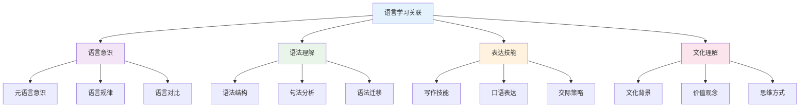

### 语文与理科的表达关联

**🔬 语文作为科学表达的基础**

| 语文技能 | 理科应用 | 表达要求 | 实际例子 | 培养策略 |
|---------|----------|----------|----------|----------|
| **说明文写作** | 科学概念解释 | 准确清晰 | 实验原理说明 | 科学写作训练 |
| **议论文写作** | 科学论证表达 | 逻辑严密 | 科学观点论证 | 论证结构分析 |
| **记叙文写作** | 实验过程记录 | 条理清楚 | 实验报告撰写 | 过程描述练习 |
| **应用文写作** | 科学报告撰写 | 格式规范 | 研究报告 | 应用文写作 |

### 跨学科阅读能力培养

**📚 语文阅读的跨学科价值**

| 阅读类型 | 学科应用 | 阅读策略 | 思维要求 | 评估标准 |
|---------|----------|----------|----------|----------|
| **科普阅读** | 科学知识获取 | 信息提取 | 理解分析 | 理解准确度 |
| **学术阅读** | 专业文献理解 | 深度分析 | 批判思维 | 分析深度 |
| **新闻阅读** | 时事科学了解 | 快速浏览 | 信息筛选 | 信息获取 |
| **文学阅读** | 人文素养培养 | 情感体验 | 审美思维 | 审美能力 |

## 📚 语文教材内容与知识体系

### 20. 国际语文教材体系分析

**🌍 主要国家语文教材特色**

| 国家/地区 | 教材体系 | 核心特色 | 知识组织 | 教学方法 | 评估方式 |
|---------|----------|----------|----------|----------|----------|
| **中国** | 课程标准 | 文化传承+思维培养 | 主题单元 | 读写结合 | 综合评估 |
| **美国** | Common Core ELA | 批判性思维+表达 | 技能导向 | 项目学习 | 表现性评估 |
| **英国** | National Curriculum | 文学鉴赏+创意写作 | 经典文本 | 讨论分析 | 过程评估 |
| **新加坡** | 21世纪技能 | 双语能力+文化理解 | 情境化设计 | 交际教学 | 真实情境 |
| **日本** | Course of Study | 传统文化+现代表达 | 循序渐进 | 体验学习 | 综合评估 |

### 21. 语文知识图谱构建

**🔗 高中语文知识网络结构**

```mermaid
graph TD
    A[高中语文知识体系] --> B[语言知识]
    A --> C[文学知识]
    A --> D[文化知识]
    A --> E[写作知识]
    A --> F[思维知识]
    A --> G[语文实践]
    
    B --> B1[语音知识]
    B --> B2[词汇知识]
    B --> B3[语法知识]
    B --> B4[修辞知识]
    B --> B5[语用知识]
    
    C --> C1[古代文学]
    C --> C2[现代文学]
    C --> C3[外国文学]
    C --> C4[文学理论]
    C --> C5[文学批评]
    
    D --> D1[传统文化]
    D --> D2[现代文化]
    D --> D3[跨文化]
    D --> D4[文化传承]
    D --> D5[文化创新]
    
    E --> E1[记叙文写作]
    E --> E2[议论文写作]
    E --> E3[说明文写作]
    E --> E4[应用文写作]
    E --> E5[创意写作]
    
    F --> F1[逻辑思维]
    F --> F2[批判思维]
    F --> F3[创新思维]
    F --> F4[系统思维]
    F --> F5[辩证思维]
    
    G --> G1[阅读理解]
    G --> G2[口语交际]
    G --> G3[写作表达]
    G --> G4[文化体验]
    G --> G5[综合实践]
    
    style A fill:#e3f2fd
    style B fill:#f3e5f5
    style C fill:#e8f5e8
    style D fill:#fff3e0
    style E fill:#fce4ec
    style F fill:#e0f2f1
    style G fill:#f1f8e9
```

### 22. 语文概念关联网络

**🔗 核心语文概念关联分析**

#### 22.1 文学概念关联网络

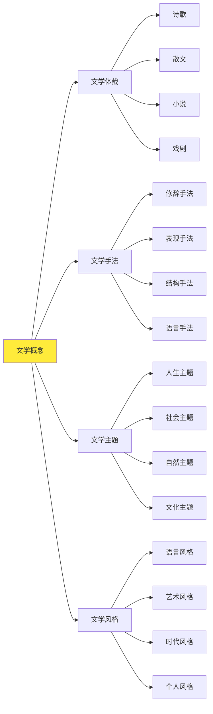

#### 22.2 写作概念关联网络

| 写作领域 | 核心概念 | 基础概念 | 关联概念 | 应用领域 | 认知难点 |
|---------|----------|----------|----------|----------|----------|
| **记叙文** | 叙事结构 | 时间顺序、空间顺序 | 人物描写、环境描写 | 文学创作 | 情节设计 |
| **议论文** | 论证结构 | 论点、论据、论证 | 逻辑推理、辩证分析 | 学术写作 | 逻辑严密性 |
| **说明文** | 说明方法 | 定义、分类、举例 | 语言准确、条理清晰 | 科普写作 | 科学表达 |
| **应用文** | 格式规范 | 标题、正文、落款 | 语言得体、目的明确 | 实用写作 | 格式要求 |

### 23. 语文知识发展路径

**📈 语文概念发展轨迹**

#### 23.1 语文能力发展路径

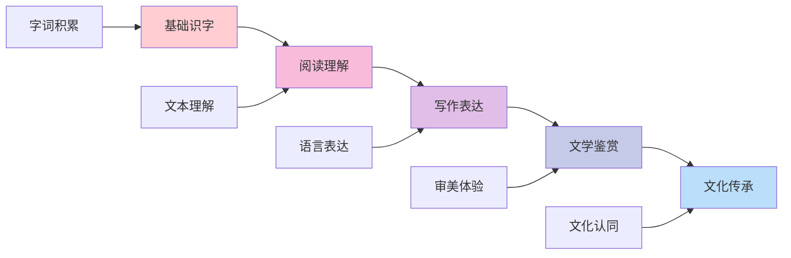

#### 23.2 语文思维发展

| 发展阶段 | 认知特征 | 思维表现 | 教学重点 | 评估标准 |
|---------|----------|----------|----------|----------|
| **感知理解** | 文本感知 | 字面理解 | 基础训练 | 理解准确性 |
| **分析思考** | 逻辑分析 | 结构分析 | 分析教学 | 分析深度 |
| **评价判断** | 价值判断 | 审美评价 | 评价教学 | 评价合理性 |
| **创造应用** | 创新思维 | 创意表达 | 创造教学 | 创新能力 |
| **文化传承** | 文化认同 | 文化传承 | 文化教学 | 文化素养 |

### 24. 国际化语文教学内容

**🌍 国际语文课程标准对比**

#### 24.1 美国Common Core ELA标准

**📊 核心内容领域**:

| 内容领域 | 核心概念 | 技能要求 | 应用能力 | 评估标准 |
|---------|----------|----------|----------|----------|
| **阅读** | 文本理解 | 批判性阅读 | 深度理解 | 理解能力 |
| **写作** | 表达技能 | 论证写作 | 有效表达 | 表达能力 |
| **听说** | 交际技能 | 口语表达 | 有效交际 | 交际能力 |
| **语言** | 语言知识 | 语言运用 | 准确表达 | 语言能力 |

#### 24.2 英国National Curriculum特色

**🎯 英国语文教学方法**:

1. **经典文本教学**
   - 莎士比亚戏剧
   - 英国文学经典
   - 现代文学作品
   - 文学批评方法

2. **创意写作方法**
   - 想象性写作
   - 描述性写作
   - 论证性写作
   - 诗歌创作

3. **讨论分析方法**
   - 小组讨论
   - 文本分析
   - 观点辩论
   - 批判性思考

### 25. 语文知识关联深度分析

**🔗 跨领域知识关联**

#### 25.1 语文与历史的关联

| 语文概念 | 历史背景 | 关联深度 | 教学策略 | 学习效果 |
|---------|----------|----------|----------|----------|
| **古代文学** | 历史背景 | 深度关联 | 历史情境 | 理解深化 |
| **现代文学** | 社会背景 | 直接应用 | 社会分析 | 应用能力 |
| **文化传承** | 文化历史 | 方法迁移 | 文化探究 | 思维培养 |
| **文学思潮** | 思想史 | 概念统一 | 多表征 | 综合能力 |

#### 25.2 语文与哲学的关联

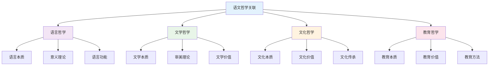

### 26. 语文实践教学体系

**📖 基于知识图谱的实践教学**

#### 26.1 阅读技能发展

| 阅读技能 | 技能内容 | 发展要求 | 评估方法 | 应用领域 |
|---------|----------|----------|----------|----------|
| **字面理解** | 文本信息 | 准确性 | 理解测试 | 基础阅读 |
| **推断理解** | 隐含信息 | 逻辑性 | 推断测试 | 深度阅读 |
| **评价理解** | 价值判断 | 合理性 | 评价测试 | 批判阅读 |
| **创造理解** | 创新思维 | 创新性 | 创造测试 | 创新阅读 |

#### 26.2 写作教学创新

**🎯 现代语文写作教学**:

1. **数字化写作环境**
   - 网络写作平台
   - 协作写作工具
   - 智能写作助手

2. **多媒体写作教学**
   - 图文结合
   - 音视频创作
   - 数字故事

3. **创新写作设计**
   - 创意写作
   - 实验写作
   - 跨媒体写作

### 27. 语文学习评估体系

**📊 基于知识图谱的评估框架**

#### 27.1 能力评估

| 评估维度 | 评估内容 | 评估方法 | 评估标准 | 发展指标 |
|---------|----------|----------|----------|----------|
| **语言能力** | 语言运用 | 语言测试 | 准确表达 | 语言清晰度 |
| **文学能力** | 文学理解 | 文学测试 | 深度理解 | 文学素养 |
| **文化能力** | 文化理解 | 文化测试 | 文化认同 | 文化素养 |
| **思维能力** | 思维品质 | 思维测试 | 思维深度 | 思维能力 |

#### 27.2 综合能力评估

**🎯 语文综合能力评估矩阵**:

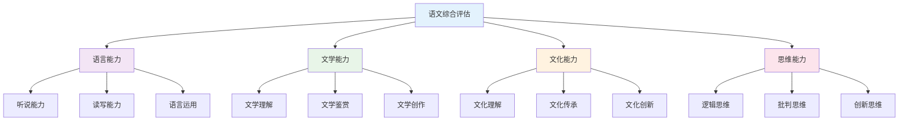

### 28. 语文教育国际化发展

**🌍 国际语文教育趋势**

#### 28.1 全球语文教育标准

| 标准体系 | 核心理念 | 内容特点 | 评估方式 | 发展趋势 |
|---------|----------|----------|----------|----------|
| **中国语文** | 文化传承 | 传统文化 | 综合评估 | 文化自信 |
| **美国ELA** | 批判思维 | 实用技能 | 表现性评估 | 应用导向 |
| **英国English** | 文学素养 | 经典文本 | 过程评估 | 深度理解 |
| **新加坡华文** | 双语能力 | 文化理解 | 真实情境 | 国际视野 |

#### 28.2 语文教育技术整合

**💻 数字化语文教育**:

1. **智能学习系统**
   - 个性化阅读路径
   - 自适应写作指导
   - 实时语言反馈

2. **虚拟学习环境**
   - 文学情境模拟
   - 文化体验平台
   - 协作学习空间

3. **多媒体教学平台**
   - 数字图书馆
   - 在线写作工具
   - 文化资源库

## 🔗 语文与其他学科关联性分析

### 20. 语文-数学学科关联

**📝 语文与数学的思维关联**

#### 20.1 语文-数学关联网络

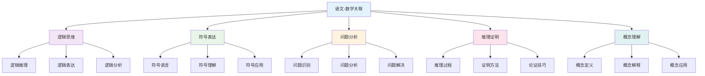

#### 20.2 语文-数学应用领域

| 数学领域 | 语文工具 | 应用内容 | 教学重点 | 能力培养 | 创新点 |
|---------|----------|----------|----------|----------|----------|
| **逻辑推理** | 逻辑表达、论证 | 数学证明、推理过程 | 逻辑训练 | 逻辑能力 | 思维整合 |
| **概念理解** | 概念解释、定义 | 数学概念、定理理解 | 概念教学 | 理解能力 | 概念整合 |
| **问题解决** | 问题分析、表达 | 数学问题、应用题 | 问题教学 | 分析能力 | 问题整合 |
| **符号理解** | 符号解释、表达 | 数学符号、公式理解 | 符号教学 | 符号能力 | 符号整合 |

### 21. 语文-科学学科关联

**🔬 语文与科学学科的交叉融合**

#### 21.1 语文-科学关联网络

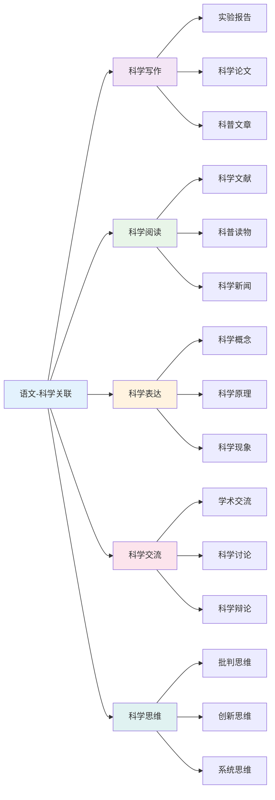

#### 21.2 语文-科学应用策略

| 科学领域 | 语文方法 | 应用内容 | 教学策略 | 学习效果 | 实践应用 |
|---------|----------|----------|----------|----------|----------|
| **物理科学** | 科学写作、表达 | 物理概念、原理表达 | 科学写作 | 写作能力 | 科学传播 |
| **化学科学** | 实验报告、描述 | 化学现象、实验描述 | 实验写作 | 描述能力 | 实验记录 |
| **生物科学** | 观察记录、分析 | 生物现象、观察记录 | 观察写作 | 观察能力 | 生物研究 |
| **地球科学** | 地理描述、分析 | 地理现象、环境描述 | 地理写作 | 分析能力 | 环境研究 |

### 22. 语文-英语学科关联

**🌍 语文与英语的跨文化关联**

#### 22.1 语文-英语关联网络

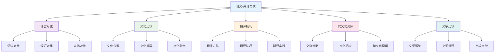

#### 22.2 语文-英语应用领域

| 英语领域 | 语文工具 | 应用内容 | 教学重点 | 能力培养 | 创新应用 |
|---------|----------|----------|----------|----------|----------|
| **语言学习** | 语言对比、分析 | 语法对比、词汇对比 | 对比教学 | 对比能力 | 语言学习 |
| **文化理解** | 文化分析、比较 | 文化背景、文化差异 | 文化教学 | 文化能力 | 跨文化交际 |
| **翻译实践** | 翻译技巧、方法 | 翻译方法、翻译实践 | 翻译教学 | 翻译能力 | 翻译应用 |
| **文学研究** | 文学理论、批评 | 文学比较、文学批评 | 文学教学 | 文学能力 | 文学研究 |

### 23. 语文-人文学科关联

**🎭 语文与人文社科的深度融合**

#### 23.1 语文-历史关联分析

| 关联维度 | 语文内容 | 历史应用 | 教学策略 | 能力培养 | 创新点 |
|---------|----------|----------|----------|----------|----------|
| **史料解读** | 文本分析、理解 | 历史文献、史料解读 | 史料教学 | 解读能力 | 历史整合 |
| **历史叙述** | 叙述技巧、表达 | 历史事件、人物叙述 | 叙述教学 | 叙述能力 | 叙述整合 |
| **历史评价** | 评价方法、标准 | 历史人物、事件评价 | 评价教学 | 评价能力 | 评价整合 |
| **文化传承** | 文化理解、表达 | 历史文化、传统传承 | 文化教学 | 文化能力 | 文化整合 |

#### 23.2 语文-哲学关联分析

| 关联领域 | 语文概念 | 哲学应用 | 教学方法 | 学习效果 | 应用价值 |
|---------|----------|----------|----------|----------|----------|
| **思维训练** | 逻辑思维、批判思维 | 哲学思维、辩证思维 | 思维教学 | 思维能力 | 哲学思考 |
| **概念分析** | 概念理解、表达 | 哲学概念、理论分析 | 概念教学 | 分析能力 | 理论分析 |
| **价值判断** | 价值理解、表达 | 价值观念、伦理判断 | 价值教学 | 判断能力 | 价值思考 |
| **文化理解** | 文化理解、表达 | 文化哲学、文化理解 | 文化教学 | 理解能力 | 文化思考 |

### 24. 语文-艺术学科关联

**🎨 语文与艺术的创造性融合**

#### 24.1 语文-艺术关联网络

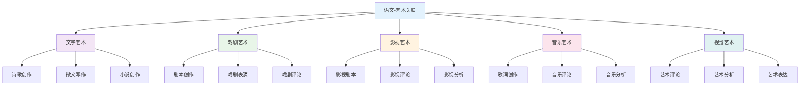

#### 24.2 语文-艺术应用领域

| 艺术领域 | 语文概念 | 艺术应用 | 教学方法 | 学习效果 | 创新价值 |
|---------|----------|----------|----------|----------|----------|
| **文学艺术** | 文学创作、批评 | 诗歌、散文、小说 | 创作教学 | 创作能力 | 文学创作 |
| **戏剧艺术** | 剧本创作、表演 | 戏剧、话剧、戏曲 | 戏剧教学 | 表演能力 | 戏剧创作 |
| **影视艺术** | 影视剧本、评论 | 电影、电视剧、纪录片 | 影视教学 | 影视能力 | 影视创作 |
| **音乐艺术** | 歌词创作、评论 | 歌曲、音乐、歌词 | 音乐教学 | 音乐能力 | 音乐创作 |

### 25. 跨学科语文教学策略

**🎯 基于关联性的语文教学**

#### 25.1 强关联学科教学策略

| 关联类型 | 教学策略 | 内容整合 | 方法创新 | 评估方式 | 发展目标 |
|---------|----------|----------|----------|----------|----------|
| **语文-英语** | 对比教学 | 语言文化对比 | 对比分析 | 对比评估 | 对比能力 |
| **语文-历史** | 史料教学 | 历史文献解读 | 史料分析 | 史料评估 | 史料能力 |
| **语文-哲学** | 思维教学 | 哲学思维训练 | 思维训练 | 思维评估 | 思维能力 |

#### 25.2 中关联学科教学策略

| 关联类型 | 教学策略 | 内容整合 | 方法创新 | 评估方式 | 发展目标 |
|---------|----------|----------|----------|----------|----------|
| **语文-数学** | 逻辑教学 | 逻辑思维训练 | 逻辑训练 | 逻辑评估 | 逻辑能力 |
| **语文-科学** | 科学教学 | 科学写作训练 | 科学写作 | 写作评估 | 写作能力 |
| **语文-艺术** | 艺术教学 | 艺术表达训练 | 艺术表达 | 表达评估 | 表达能力 |

### 26. 语文跨学科评估体系

**📊 基于关联性的语文评估**

#### 26.1 跨学科语文能力评估

| 评估维度 | 评估内容 | 评估方法 | 评估标准 | 发展指标 |
|---------|----------|----------|----------|----------|
| **理解能力** | 文本理解 | 理解测试 | 准确理解 | 理解深度 |
| **表达能力** | 语言表达 | 表达测试 | 准确表达 | 表达质量 |
| **分析能力** | 文本分析 | 分析测试 | 深度分析 | 分析质量 |
| **应用能力** | 语言应用 | 应用测试 | 有效应用 | 应用创新 |

#### 26.2 跨学科语文综合评估

**🎯 语文跨学科综合能力评估矩阵**:

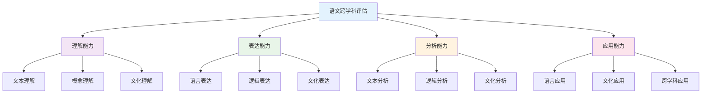

### 27. 语文跨学科发展趋势

**🌍 国际语文跨学科教育趋势**

#### 27.1 全球语文跨学科趋势

| 发展趋势 | 核心理念 | 内容特点 | 实施策略 | 发展前景 |
|---------|----------|----------|----------|----------|
| **跨文化教育** | 文化理解 | 多元文化 | 文化教学 | 全球视野 |
| **数字人文** | 数字技术 | 数字文学 | 技术教学 | 数字应用 |
| **创意写作** | 创意表达 | 创意写作 | 创意教学 | 创意发展 |
| **媒体素养** | 媒体理解 | 媒体分析 | 媒体教学 | 媒体应用 |

#### 27.2 语文跨学科技术整合

**💻 数字化语文跨学科教育**:

1. **智能写作系统**
   - 自动写作工具
   - 可视化写作
   - 实时写作反馈

2. **虚拟语文实验室**
   - 虚拟写作环境
   - 交互式写作
   - 协作写作平台

3. **多媒体语文平台**
   - 语文资源库
   - 写作工具集
   - 评估数据库
