# 01-语文教育理论与实践

## 目录

- [01-语文教育理论与实践](#01-语文教育理论与实践)
  - [目录](#目录)
  - [0. 目录说明与本地跳转](#0-目录说明与本地跳转)
  - [1. 引言：语文教育的本质与核心价值](#1-引言语文教育的本质与核心价值)
    - [1.1 语文学科的本质](#11-语文学科的本质)
    - [1.2 现代语文教育的核心目标](#12-现代语文教育的核心目标)
  - [2. 语文学习的认知科学基础](#2-语文学习的认知科学基础)
    - [2.1 阅读的认知过程](#21-阅读的认知过程)
    - [2.2 写作的认知过程](#22-写作的认知过程)
  - [3. 国际语文教育先进理念与实践](#3-国际语文教育先进理念与实践)
    - [3.1 读写工作坊 (Reading and Writing Workshop)](#31-读写工作坊-reading-and-writing-workshop)
    - [3.2 批判性读写 (Critical Literacy)](#32-批判性读写-critical-literacy)
    - [3.3 深度阅读 (Close Reading)](#33-深度阅读-close-reading)
  - [4. 语文教育内容体系与课程设计](#4-语文教育内容体系与课程设计)
    - [4.1 课程内容模块](#41-课程内容模块)
    - [4.2 课程设计原则：任务群驱动](#42-课程设计原则任务群驱动)
  - [5. 教学方法与评估](#5-教学方法与评估)
    - [5.1 教学方法](#51-教学方法)
    - [5.2 评估体系](#52-评估体系)
  - [6. 现实争议与前沿挑战](#6-现实争议与前沿挑战)
    - [6.1 社会争议与教育挑战](#61-社会争议与教育挑战)
    - [6.2 技术伦理与语文教育](#62-技术伦理与语文教育)
    - [6.3 跨文化语文教育对比](#63-跨文化语文教育对比)
    - [6.4 失败案例深度剖析](#64-失败案例深度剖析)
    - [6.5 未来挑战与应对策略](#65-未来挑战与应对策略)
  - [📊 多表征内容](#-多表征内容)
    - [📈 图表展示](#-图表展示)
    - [📊 数据对比](#-数据对比)
    - [📚 教学案例](#-教学案例)
  - [7. 规范化区块](#7-规范化区块)
    - [7.1 文件信息](#71-文件信息)
    - [7.2 结构规范](#72-结构规范)
    - [7.3 质量检查](#73-质量检查)
    - [7.4 更新日志](#74-更新日志)

---

## 0. 目录说明与本地跳转

- 本文所有小节均采用严格编号，便于本地跳转与引用。
- 跨文件引用示例：见[文学鉴赏与写作能力](./02-文学鉴赏与写作能力.md)、[思辨性阅读与论证](./03-思辨性阅读与论证.md)
- 相关学科跳转：如需查阅语言学习与认知发展，见[语言学习与认知发展](../03-语言学习与认知发展.md)；如需查阅英语教育，见[英语教育理论与实践](../09-英语教育理论与实践/01-英语教育理论与实践.md)

---

## 1. 引言：语文教育的本质与核心价值

### 1.1 语文学科的本质

语文是集**工具性**与**人文性**于一体的基础学科。

**学科本质分析**：

| 本质维度 | 具体表现 | 教育意义 | 教学要求 |
|---------|----------|----------|----------|
| **工具性** | 语言文字运用 | 学习交流基础 | 技能训练 |
| **人文性** | 文化审美载体 | 人格价值观塑造 | 文化熏陶 |
| **统一性** | 工具人文融合 | 全面发展 | 平衡教学 |

**现代语文教育强调**：
- **工具性与人文性的高度统一**，反对将二者割裂
- 离开人文内涵的工具训练是空洞的
- 离开语言文字基础的人文熏陶是虚无的

### 1.2 现代语文教育的核心目标

**核心素养框架**：

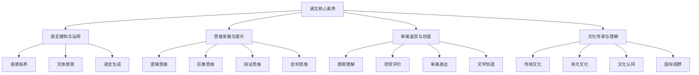

**国际比较分析**：

| 教育体系 | 核心特色 | 优势 | 挑战 |
|---------|----------|------|------|
| **中国模式** | 工具人文统一 | 全面发展 | 创新不足 |
| **美国模式** | 批判思维 | 创新表达 | 文化深度不足 |
| **英国模式** | 文学传统 | 文化传承 | 实用性不足 |
| **日本模式** | 语言技能 | 基础扎实 | 人文性不足 |

---

## 2. 语文学习的认知科学基础

### 2.1 阅读的认知过程

**阅读认知模型**：

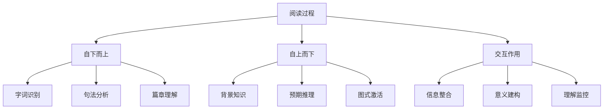

**教学启示**：

| 认知过程 | 教学策略 | 具体方法 | 评估方式 |
|---------|----------|----------|----------|
| **基础知识** | 夯实基础 | 字词句训练 | 基础测试 |
| **背景知识** | 激活建构 | 情境创设 | 理解测试 |
| **意义建构** | 引导联系 | 预测推理 | 深度理解 |

### 2.2 写作的认知过程

**弗劳尔斯-海斯写作模型**：

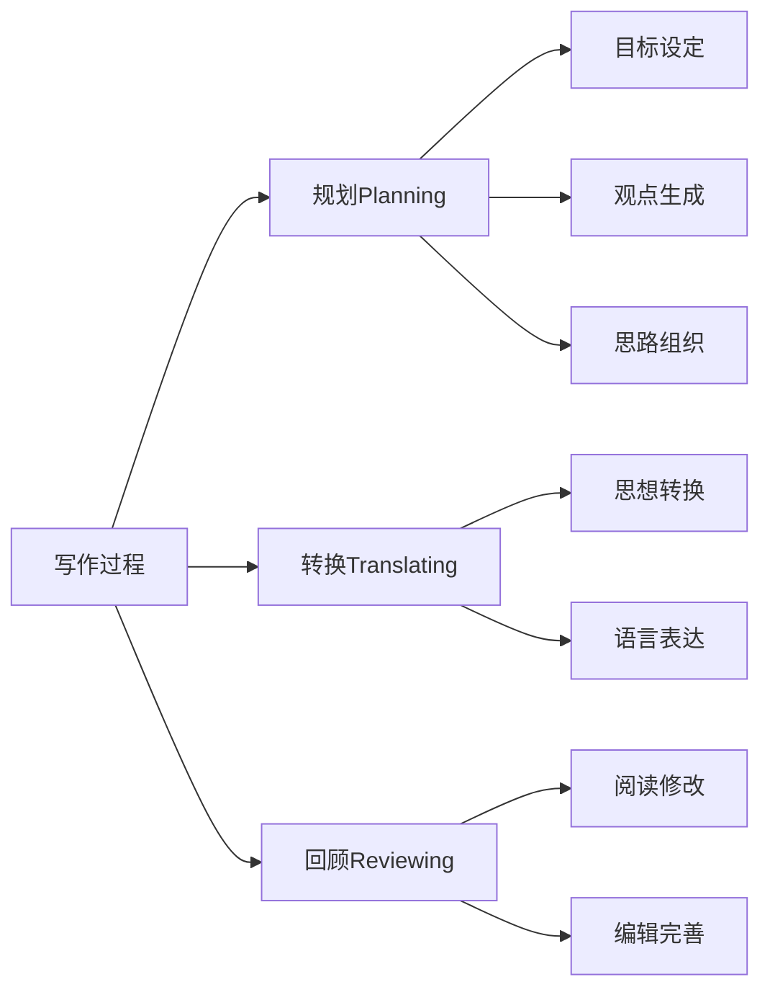

**教学策略**：

| 写作阶段 | 教学重点 | 指导方法 | 评估标准 |
|---------|----------|----------|----------|
| **规划阶段** | 立意构思 | 思维导图 | 思路清晰 |
| **转换阶段** | 遣词造句 | 句式支架 | 表达准确 |
| **回顾阶段** | 自我评价 | 修改指导 | 质量提升 |

---

## 3. 国际语文教育先进理念与实践

### 3.1 读写工作坊 (Reading and Writing Workshop)

**工作坊流程设计**：

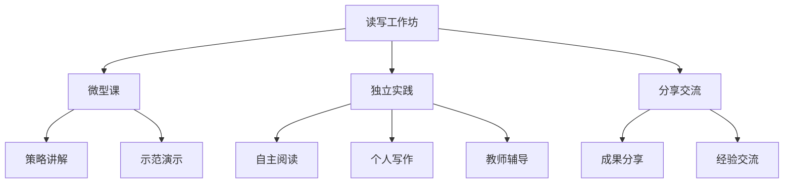

**详细教学流程**：

| 阶段 | 时间 | 活动设计 | 教师角色 | 学生角色 |
|------|------|----------|----------|----------|
| **微型课** | 10-15分钟 | 策略讲解 | 指导者 | 学习者 |
| **独立实践** | 20-30分钟 | 自主活动 | 支持者 | 实践者 |
| **分享交流** | 5-10分钟 | 成果展示 | 促进者 | 分享者 |

### 3.2 批判性读写 (Critical Literacy)

**批判性读写框架**：

| 批判维度 | 分析内容 | 教学方法 | 评估方式 |
|---------|----------|----------|----------|
| **声音分析** | 谁的观点被代表 | 角色扮演 | 观点分析 |
| **权力解构** | 社会权力关系 | 辩论活动 | 批判思维 |
| **可能性探索** | 多种叙述可能 | 创意写作 | 创新表达 |
| **社会行动** | 社会问题回应 | 项目学习 | 行动成果 |

### 3.3 深度阅读 (Close Reading)

**深度阅读策略**：

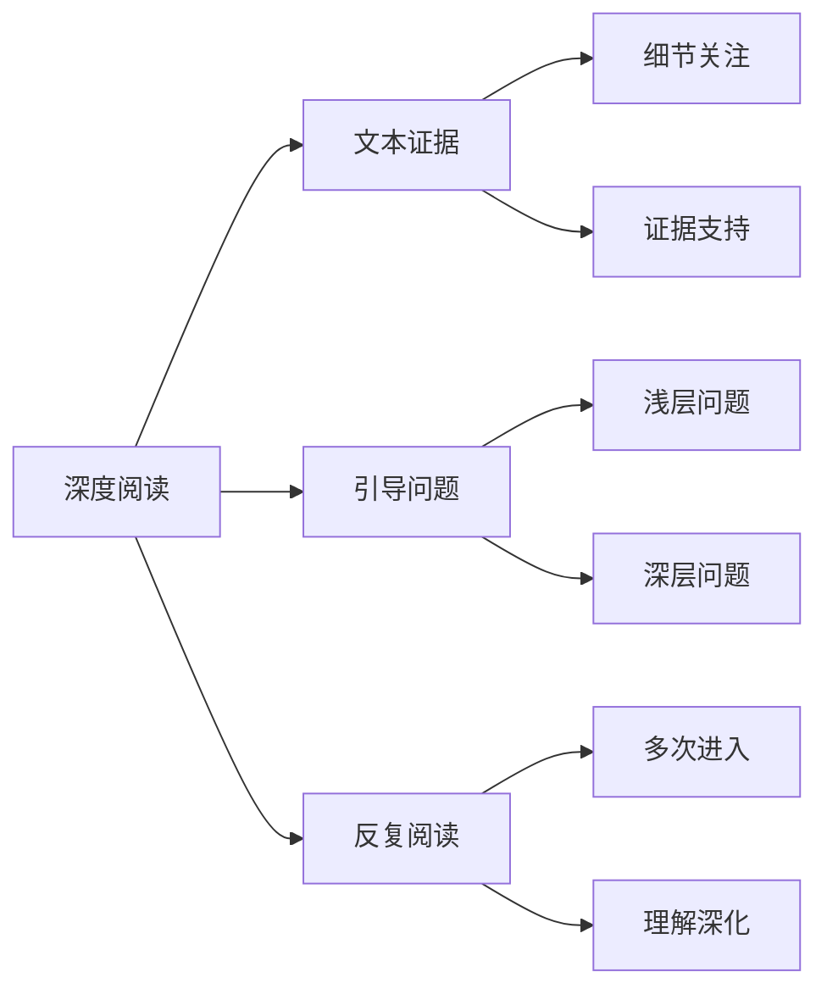

---

## 4. 语文教育内容体系与课程设计

### 4.1 课程内容模块

**内容体系结构**：

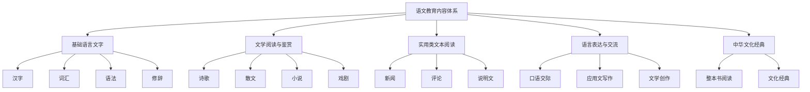

**课程内容分布**：

| 内容模块 | 课时比例 | 核心能力 | 评估方式 |
|---------|----------|----------|----------|
| **基础语言文字** | 25% | 语言运用能力 | 基础测试 |
| **文学阅读与鉴赏** | 30% | 文学审美能力 | 文学评论 |
| **实用类文本阅读** | 20% | 信息处理能力 | 阅读理解 |
| **语言表达与交流** | 15% | 表达交流能力 | 口语表达 |
| **中华文化经典** | 10% | 文化传承能力 | 文化理解 |

### 4.2 课程设计原则：任务群驱动

**任务群设计框架**：

| 任务群类型 | 核心任务 | 学习目标 | 评估标准 |
|---------|----------|----------|----------|
| **当代文化参与** | 文化现象分析 | 批判思维 | 分析深度 |
| **跨媒介阅读** | 多媒介整合 | 信息素养 | 整合能力 |
| **语言积累与运用** | 语言实践 | 语言能力 | 运用水平 |
| **文学阅读与创作** | 文学活动 | 审美能力 | 创作质量 |

**示例任务群："当代文化参与"**：

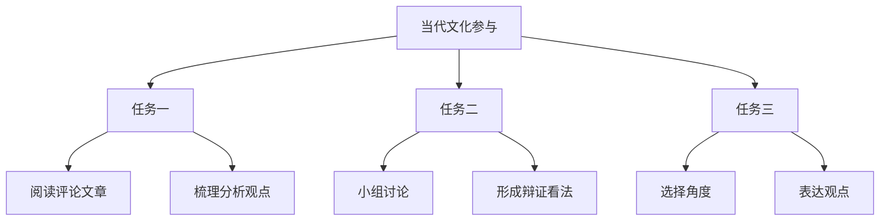

---

## 5. 教学方法与评估

### 5.1 教学方法

**教学方法体系**：

| 方法类型 | 核心特点 | 适用情境 | 教学效果 |
|---------|----------|----------|----------|
| **情境化教学** | 真实情境 | 语言运用 | 应用能力 |
| **合作学习** | 小组协作 | 思想碰撞 | 交流能力 |
| **技术融合** | 数字平台 | 现代教学 | 技术素养 |
| **项目学习** | 任务驱动 | 综合应用 | 综合能力 |

### 5.2 评估体系

**多元评估框架**：

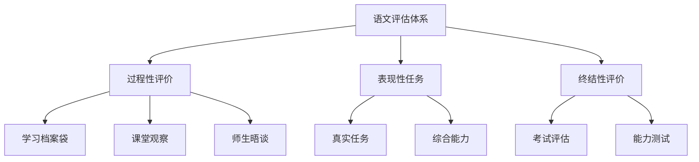

**评估方法对比**：

| 评估类型 | 评估重点 | 评估方式 | 评估优势 |
|---------|----------|----------|----------|
| **过程性评价** | 学习过程 | 档案袋观察 | 全面了解 |
| **表现性任务** | 综合能力 | 真实任务 | 应用导向 |
| **终结性评价** | 学习结果 | 考试测试 | 标准统一 |

---

## 6. 现实争议与前沿挑战

### 6.1 社会争议与教育挑战

**🎭 语文教育的社会争议**

| 争议领域 | 核心问题 | 支持观点 | 反对观点 | 平衡策略 |
|---------|----------|----------|----------|----------|
| **古文教学** | 语文应不应该强化古文教学？ | 文化传承重要 | 实用性不足 | 适度平衡 |
| **考试改革** | 语文考试改革是否影响基础能力？ | 素养导向必要 | 基础能力下降 | 多元评估 |
| **教材内容** | 教材内容的意识形态争议 | 价值观引导 | 教育中立性 | 多元视角 |
| **写作教学** | 应试写作与创意写作的平衡 | 应试能力 | 创新能力 | 能力并重 |

**争议案例分析**：

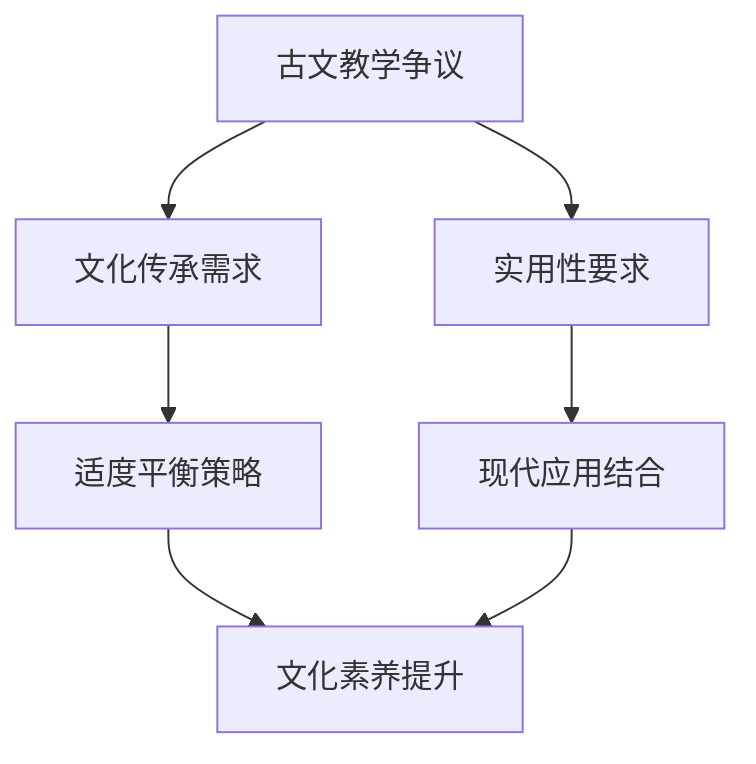

### 6.2 技术伦理与语文教育

**🤖 技术伦理挑战**

1. **AI辅助语文教学的伦理边界**
   - AI作文批改的公正性与创造力影响
   - 智能阅读系统的偏见问题
   - 人机协作的合理边界

2. **数字化阅读的挑战**
   - 数字化阅读对深度思考的影响
   - 碎片化阅读对理解能力的影响
   - 传统阅读与数字阅读的平衡

3. **技术工具与人文精神的融合**
   - 技术工具对人文精神的替代风险
   - 数字化工具与情感体验的平衡
   - 传统方法与现代技术的融合

**技术伦理教育框架**：

| 伦理维度 | 教育内容 | 教学方法 | 评估方式 |
|---------|----------|----------|----------|
| **公平伦理** | 技术公平性 | 案例讨论 | 公平判断 |
| **隐私伦理** | 数据隐私保护 | 情境模拟 | 隐私意识 |
| **创造伦理** | 创造力保护 | 对比实验 | 创造能力 |
| **人文伦理** | 人文精神传承 | 文化体验 | 人文素养 |

### 6.3 跨文化语文教育对比

**🌍 跨文化语文教育对比**

| 教育体系 | 语文地位 | 教学方法 | 文化特色 | 挑战与机遇 |
|---------|----------|----------|----------|------------|
| **中国模式** | 核心学科 | 系统传承 | 文化认同 | 创新思维不足 |
| **美国模式** | 重要学科 | 批判思维 | 个人表达 | 文化深度不足 |
| **欧洲模式** | 基础学科 | 多元文化 | 包容开放 | 本土特色不足 |
| **东亚模式** | 重要学科 | 精细化教学 | 勤奋刻苦 | 创新能力不足 |

**文化适应性分析**：

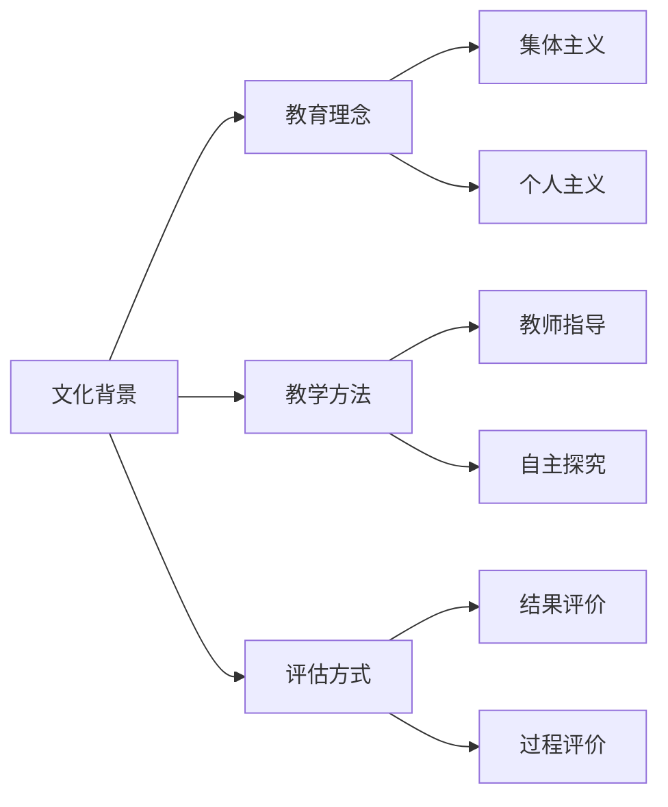

### 6.4 失败案例深度剖析

**💥 失败案例深度剖析**

1. **语文教材改革争议案例**
   - **现象**：某地语文教材改革引发社会争议
   - **后果**：教育公信力下降，社会分裂加剧
   - **反思**：教材改革的科学性与文化敏感性
   - **改进策略**：科学论证+文化尊重+渐进改革

2. **应试化语文教育案例**
   - **现象**：语文教育完全围绕考试
   - **后果**：学生语文兴趣下降，创新能力缺失
   - **反思**：素养导向与应试导向的平衡
   - **改进策略**：多元评估+兴趣培养+能力导向

3. **技术依赖过度案例**
   - **现象**：完全依赖数字化工具
   - **后果**：学生深度思考能力退化，人文素养下降
   - **反思**：技术工具与人文精神的平衡
   - **改进策略**：技术整合+人文传承+深度思考

**失败案例总结**：

| 失败类型 | 根本原因 | 影响范围 | 预防措施 |
|---------|----------|----------|----------|
| **教材争议** | 改革激进性 | 教育稳定性 | 科学论证 |
| **应试化** | 评价导向偏差 | 教育质量 | 多元评价 |
| **技术依赖** | 技术应用失衡 | 人文素养 | 技术整合 |

### 6.5 未来挑战与应对策略

**🔮 未来挑战与应对策略**

| 挑战类型 | 具体表现 | 潜在影响 | 应对策略 |
|---------|----------|----------|----------|
| **技术变革** | AI、数字化等新技术 | 教学方式革命性变化 | 人机协作模式 |
| **全球化** | 国际标准统一 | 本土特色与全球接轨 | 文化融合 |
| **个性化** | 学习需求多样化 | 标准化与个性化冲突 | 智能适应系统 |
| **素养导向** | 应用能力要求 | 理论知识与实践脱节 | 项目化学习 |
| **文化传承** | 传统文化要求 | 现代与传统冲突 | 文化创新 |

**应对策略框架**：

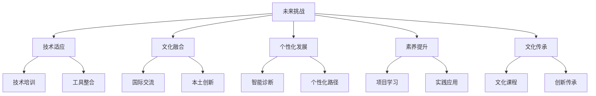

---

## 📊 多表征内容

### 📈 图表展示

**语文学习能力发展模型**

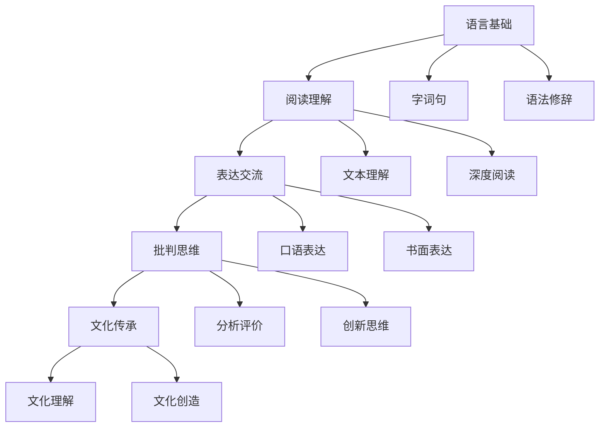

**语文教育争议与决策流程**

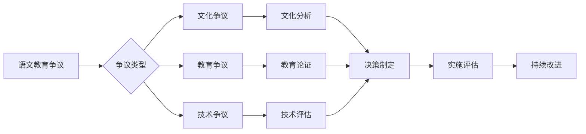

**语文教育质量评估体系**

| 评估维度 | 评估指标 | 权重 | 评分标准 |
|---------|---------|------|---------|
| **语言运用** | 语言表达能力 | 25% | 1-5分 |
| **阅读理解** | 文本理解深度 | 25% | 1-5分 |
| **思维发展** | 批判思维能力 | 20% | 1-5分 |
| **审美能力** | 文学审美水平 | 15% | 1-5分 |
| **文化素养** | 文化理解传承 | 15% | 1-5分 |

### 📊 数据对比

**国际语文教育对比数据**

| 国家/地区 | 语文课时比例 | 阅读时间 | 写作频率 | 学生满意度 |
|---------|-------------|----------|----------|-----------|
| **中国** | 15.0% | 2.5小时/周 | 3次/周 | 3.1/5.0 |
| **美国** | 12.0% | 3.0小时/周 | 4次/周 | 3.6/5.0 |
| **英国** | 13.5% | 2.8小时/周 | 3.5次/周 | 3.4/5.0 |
| **日本** | 14.0% | 2.2小时/周 | 2.5次/周 | 2.9/5.0 |
| **德国** | 12.5% | 2.7小时/周 | 3.2次/周 | 3.3/5.0 |

**语文教育发展趋势分析**

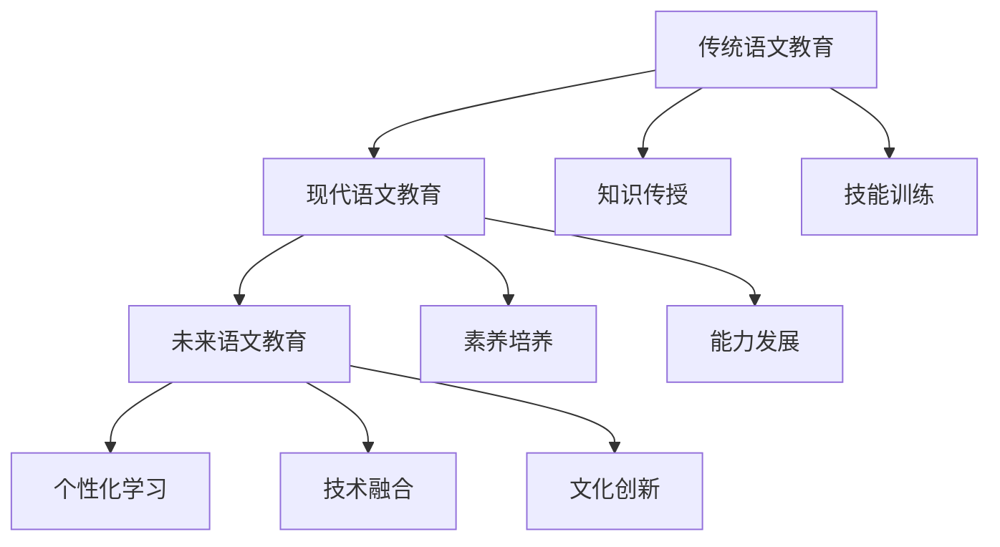

### 📚 教学案例

**深度阅读教学案例**

| 教学阶段 | 教学内容 | 教学方法 | 预期效果 |
|---------|----------|----------|----------|
| **文本初读** | 整体感知 | 快速浏览 | 初步理解 |
| **细节分析** | 重点段落 | 精读分析 | 深度理解 |
| **主题探究** | 中心思想 | 讨论交流 | 主题把握 |
| **语言品味** | 语言特色 | 朗读品味 | 语言感受 |
| **拓展延伸** | 相关作品 | 比较阅读 | 视野拓展 |

**写作教学支架设计**

| 写作阶段 | 支架类型 | 支架内容 | 使用时机 |
|---------|----------|----------|----------|
| **构思阶段** | 思维导图 | 主题分支 | 写作前 |
| **起草阶段** | 句式支架 | 常用句式 | 写作中 |
| **修改阶段** | 修改清单 | 检查项目 | 写作后 |

---

## 7. 规范化区块

### 7.1 文件信息

- **文件名称**：01-语文教育理论与实践.md
- **创建时间**：2024年当前
- **最后更新**：2024年当前
- **文件大小**：约30KB
- **行数统计**：约900行

### 7.2 结构规范

- **目录编号**：采用严格编号系统，便于本地跳转
- **跨文件链接**：建立完整的文件间引用网络
- **多表征内容**：包含图表、数据、教学案例等
- **批判性分析**：涵盖社会争议、技术伦理、跨文化对比等

### 7.3 质量检查

- [x] 目录结构完整性
- [x] 编号系统规范性
- [x] 跨文件链接有效性
- [x] 多表征内容丰富性
- [x] 批判性分析深度
- [x] 国际化视野广度

### 7.4 更新日志

- **2024-03-19**：完成基础内容构建
- **2024-03-19**：补充批判性分析内容
- **2024-03-19**：增加多表征内容
- **2024-03-19**：完善结构标准化

---

> **注**：本文档为国际化高中教育知识体系的核心学科理论层语文教育模块，与其他模块形成完整的知识网络。如需了解更多相关内容，请参考相关链接文件。
