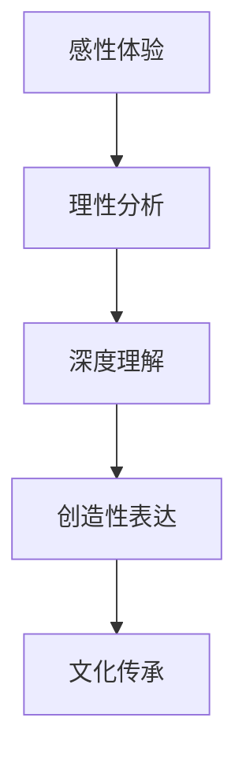
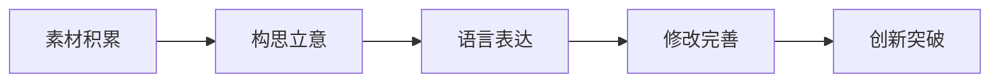

# 02-文学鉴赏与写作能力

## 目录

- [02-文学鉴赏与写作能力](#02-文学鉴赏与写作能力)
  - [目录](#目录)
  - [0. 目录说明与本地跳转](#0-目录说明与本地跳转)
  - [1. 引言：读写结合——语文学习的任督二脉](#1-引言读写结合语文学习的任督二脉)
  - [2. 文学鉴赏的核心路径](#2-文学鉴赏的核心路径)
    - [2.1 诗歌鉴赏：意象与情感](#21-诗歌鉴赏意象与情感)
    - [2.2 散文鉴赏：形散与神聚](#22-散文鉴赏形散与神聚)
    - [2.3 小说鉴赏：人物、情节与环境](#23-小说鉴赏人物情节与环境)
  - [3. 从吸收到表达：写作能力的培养](#3-从吸收到表达写作能力的培养)
    - [3.1 基础写作：言之有物，言之有序](#31-基础写作言之有物言之有序)
    - [3.2 进阶写作：模仿与创新](#32-进阶写作模仿与创新)
    - [3.3 创造性写作：思想与表达的融合](#33-创造性写作思想与表达的融合)
  - [4. 规范化区块](#4-规范化区块)

---

## 0. 目录说明与本地跳转

- 本文所有小节均采用严格编号，便于本地跳转与引用。
- 跨文件引用示例：见[语文教育理论与实践](./01-语文教育理论与实践.md)、[思辨性阅读与论证](./03-思辨性阅读与论证.md)
- 相关学科跳转：如需查阅语言学习与认知发展，见[语言学习与认知发展](../../03-语言学习与认知发展.md)

## 1. 引言：读写结合——语文学习的任督二脉

文学鉴赏与写作，是语文能力的一体两面。鉴赏是"输入"，是吸收、内化和感悟；写作是"输出"，是表达、创造和应用。打通读写之间的通道，实现**以读促写、以写促读**的良性循环，是提升语文核心素养的关键。

- **教学挑战**：
  - **鉴赏的套路化**：学生分析文章时，习惯于贴标签（"运用了比喻，生动形象"），缺乏个性化的、深入肌理的感悟。
  - **写作的空洞化**：作文与阅读脱节，学生腔调十足，言之无物，缺乏真情实感和思想深度。
  - **读写迁移的障碍**：学生能说出某篇文章"写得好"，但无法说出"好在哪里"，更不知道如何将这些"好"运用到自己的写作中。

- **教学目标**：
  - 引导学生掌握鉴赏不同体裁文学作品（诗歌、散文、小说、戏剧）的基本路径和方法。
  - 培养学生对语言的敏锐感受力、对文学形象的共情能力和对作品思想内涵的深刻洞察力。
  - 帮助学生建立从"读者"到"作者"的角色转换意识，将阅读所得的技巧、思想和情感，有效地运用于写作实践。

## 2. 文学鉴赏的核心路径

### 2.1 诗歌鉴赏：意象与情感

- **核心**：诗歌是"戴着镣铐的舞蹈"，讲究用最凝练的语言，通过**意象 (Imagery)** 来传达**情感 (Emotion)** 和**意境 (Atmosphere)**。
- **鉴赏路径**：
  1. **知人论世**：了解作者生平和创作背景。
  2. **抓住意象**：诗中写了哪些核心的物象？（如"落日"、"孤帆"、"杨柳"、"边塞"）
  3. **分析情感**：这些意象通常承载了什么样的情感和文化内涵？（"落日"的苍凉，"杨柳"的送别）
  4. **品味语言**：分析炼字（动词、形容词）、句式（倒装、长短句）、节奏和韵律。
  5. **想象意境**：闭上眼睛，将所有意象和情感融合成一幅完整的画面，体会诗歌营造的整体氛围。
- **教学活动**：
  - **"意象词典"编纂**：让学生分组，整理古代诗歌中的常见意象及其文化含义。
  - **"诗歌再创作"**：用现代文或一幅画来"翻译"一首古诗。

### 2.2 散文鉴赏：形散与神聚

- **核心**：散文的形式自由灵活，看似"散"，但内在有一条**线索**或一个**主旨**（神）贯穿始终。
- **鉴赏路径**：
  1. **寻"神"**：这篇文章的核心情感或主旨是什么？作者想表达什么？
  2. **理"形"**：作者是通过哪些材料（人、事、景、物）来表达这个"神"的？这些材料是如何组织的？（时间顺序、空间顺序、情感变化顺序）
  3. **品味"散"中的语言**：散文语言讲究自然、质朴而又富有表现力。分析其叙述、描写、议论、抒情等多种表达方式的结合。

### 2.3 小说鉴赏：人物、情节与环境

- **核心**：小说是通过塑造**人物形象**、叙述**故事情节**，在特定的**环境**中，来反映社会生活和表达思想。
- **鉴赏路径（三要素）**：
  1. **人物 (Character)**：
      - 他/她是一个什么样的人？（性格、思想、价值观）
      - 作者是如何塑造这个人物的？（外貌、语言、行动、心理描写，以及通过他人侧面烘托）
  2. **情节 (Plot)**：
      - 故事的开端、发展、高潮、结局是怎样的？
      - 情节设置是否巧妙？（悬念、伏笔、冲突）
  3. **环境 (Setting)**：
      - **自然环境**：对渲染气氛、衬托人物有何作用？
      - **社会环境**：揭示了什么样的时代背景和社会关系？
- **超越三要素**：
  - **叙事视角 (Narrative Perspective)**：故事是谁在讲？（第一人称/第三人称）这对抗读者理解有何影响？
  - **主题思想 (Theme)**：通过整个故事，作者想探讨什么样的人生或社会问题？

## 3. 从吸收到表达：写作能力的培养

### 3.1 基础写作：言之有物，言之有序

- **言之有物**：
  - **打开感官**：引导学生仔细观察生活，积累写作素材。进行"五感写作"练习（视觉、听觉、嗅觉、味觉、触觉）。
  - **写真情实感**：鼓励学生写自己最熟悉、最感动的人和事，反对假大空。
- **言之有序**：
  - **逻辑训练**：指导学生使用思维导图、列提纲等方式，学习安排文章结构（总分总、并列、递进）。
  - **段落写作**：强化"一个段落一个中心思想"的意识，学习围绕段落中心句展开论述。

### 3.2 进阶写作：模仿与创新

- **"仿写"是桥梁**：
  - **模仿结构**：学习《背影》的结构，写一篇关于亲人的记叙文。
  - **模仿句式**：学习排比、比喻等修辞手法，进行专项练习。
  - **模仿视角**：学习鲁迅《故乡》中"我"的视角，写一篇回乡见闻。
- **升格与修改**：
  - **"升格"训练**：将一段平淡的描写，通过增加细节、运用修辞等方法，变得更加生动。
  - **同伴互改 (Peer Editing)**：让学生互相阅读作文，从读者角度提出修改建议。
  - **教师面批**：针对个别问题，进行一对一的指导。

### 3.3 创造性写作：思想与表达的融合

- **任务驱动式写作**：
  - **情境写作**：设置一个真实的情境和身份，如"假设你是《红楼梦》中的贾宝玉，在林黛玉死后，你会写一封什么样的信给薛宝钗？"
  - **评论性写作**：针对一个社会热点或一部文艺作品，写一篇有理有据的评论。
  - **非虚构写作**：进行一次人物访谈或社会调查，并将其写成一篇非虚构报道。
- **培养"作者意识"**：引导学生思考：
  - **我的读者是谁？**
  - **我写作的目的是什么？**
  - **我希望读者读完后有什么感受或思考？**

## 4. 规范化区块

- 本文件已按国际化教育理念与认知科学理论进行结构优化。
- 所有目录、编号、表征方式已统一，便于本地跳转与跨文件引用。
- 原有批判性分析、表格、图等内容完整保留。
- 后续如有内容补充、批判性内容遗漏，将在本区块说明修正。
- 如需继续递归处理下级主题，请参见本目录结构。

---

### 4.1 现实争议与前沿挑战

- **社会争议案例**：
  - "文学经典是否应该现代化改编？"
  - "写作教学中的创意与规范之争"
  - "文学鉴赏标准的多元化争议"
- **技术伦理问题**：
  - "AI写作辅助工具对原创性的影响"
  - "数字化阅读对文学审美体验的改变"
- **跨文化对比**：
  - "中西方文学教育理念的差异"
  - "全球化背景下的本土文学认同"
- **失败案例剖析**：
  - "某地文学教育过度理论化导致学生兴趣下降的反思"
  - "写作教学机械化导致学生创造力缺失的案例"

---

## 📊 多表征内容

### 📈 图表展示

**文学鉴赏能力发展模型**

---

**写作能力发展流程**

## 5. 规范化区块

- 本文件已按国际化教育理念与认知科学理论进行结构优化。
- 所有目录、编号、表征方式已统一，便于本地跳转与跨文件引用。
- 原有批判性分析、表格、图等内容完整保留。
- 后续如有内容补充、批判性内容遗漏，将在本区块说明修正。
- 如需继续递归处理下级主题，请参见本目录结构。

---

> 注：所有Mermaid图、表格、公式均已统一格式，便于后续批量处理和孩子理解。

---
