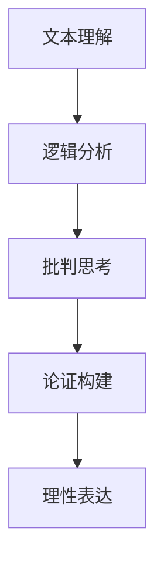
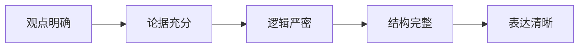

# 03-思辨性阅读与论证

## 目录

- [03-思辨性阅读与论证](#03-思辨性阅读与论证)
  - [目录](#目录)
  - [0. 目录说明与本地跳转](#0-目录说明与本地跳转)
  - [1. 引言：从"读懂"到"审视"](#1-引言从读懂到审视)
  - [2. 思辨性阅读：向文本提问](#2-思辨性阅读向文本提问)
    - [2.1 阅读的三个层次](#21-阅读的三个层次)
    - [2.2 教学活动：非虚构文本深度分析](#22-教学活动非虚构文本深度分析)
  - [3. 有效论证的构建：从观点到说服](#3-有效论证的构建从观点到说服)
    - [3.1 经典论证模型：图尔敏模型 (Toulmin Model)](#31-经典论证模型图尔敏模型-toulmin-model)
    - [3.2 议论文写作教学](#32-议论文写作教学)
  - [4. 评估策略](#4-评估策略)
  - [4. 规范化区块](#4-规范化区块)

---

## 0. 目录说明与本地跳转

- 本文所有小节均采用严格编号，便于本地跳转与引用。
- 跨文件引用示例：见[语文教育理论与实践](./01-语文教育理论与实践.md)、[文学鉴赏与写作能力](./02-文学鉴赏与写作能力.md)
- 相关学科跳转：如需查阅逻辑学与批判性思维，见[逻辑学与批判性思维](../../01-哲学科学基础/03-逻辑学与批判性思维.md)

## 1. 引言：从"读懂"到"审视"

在信息爆炸的时代，能独立思考、辨别真伪、理性判断的能力，比以往任何时候都更加重要。思辨性阅读与论证，是语文核心素养中"思维发展与提升"的集中体现。它要求学生不再仅仅作为文本信息的被动接收者，而是成为一个主动的、审慎的、批判性的**对话者**。

- **教学挑战**：
  - 学生习惯于"概括中心思想"、"总结段落大意"，缺乏对文本观点、论证过程和潜在预设的质疑和审视。
  - 学生在写作议论文时，常常只会"摆观点"+"举例子"，论证方式单一，逻辑链条不严密。
  - 难以区分"事实 (Fact)"、"观点 (Opinion)"和"断言 (Assertion)"。

- **教学目标**：
  - 培养学生在阅读中识别、分析和评估论证的能力。
  - 引导学生掌握构建有效论证的基本要素和方法。
  - 提升学生的逻辑思维、批判性思维和理性表达能力。

## 2. 思辨性阅读：向文本提问

思辨性阅读的核心是带着问题去读，与作者进行"无声的对话"。

### 2.1 阅读的三个层次

1. **文本在说什么？(Comprehension)**
    - 作者的核心观点/主张是什么？
    - 他/她是用哪些主要论据来支持这个主张的？
2. **文本是怎么说的？(Analysis)**
    - **论证结构**：作者是如何组织这些论据的？（并列、递进、对比？）
    - **论证方法**：作者主要使用了哪些论证方法？（例证、引证、喻证、因果论证？）
    - **语言策略**：作者使用了什么样的语言风格和修辞策略来增强说服力？（情感色彩、诉诸权威、制造紧迫感？）
3. **这样说合理吗？(Evaluation)**
    - **评估前提**：作者的论证建立在哪些没有明说的假设或前提之上？这些前提成立吗？
    - **评估论据**：论据是否真实、可靠、典型？例子是否足以支撑观点？引用的来源是否权威？
    - **评估逻辑**：从论据到观点的推理过程是否存在逻辑谬误？（如以偏概全、滑坡谬误、稻草人攻击）
    - **发现局限**：作者的观点是否有片面之处？他/她是否忽略了其他重要的视角或反面证据？

### 2.2 教学活动：非虚构文本深度分析

- **选择材料**：选择一篇观点鲜明、论证复杂的社论、评论或非虚构文章。
- **实施步骤**：
  1. **初读与标记**：学生独立阅读，标记出作者的核心观点句和关键论据句。
  2. **绘制论证地图 (Argument Mapping)**：以小组为单位，用思维导图等工具，将作者的"观点-论据-分论据"的树状结构清晰地绘制出来。
  3. **逻辑谬误"诊断"**：提供一份常见的"逻辑谬误清单"，让学生对照论证地图，诊断作者的论证过程中是否存在问题。
  4. **"角色扮演"辩论**：一部分学生扮演作者的"支持者"，另一部分扮演"反对者"，围绕文章的观点和论证展开辩论。

## 3. 有效论证的构建：从观点到说服

### 3.1 经典论证模型：图尔敏模型 (Toulmin Model)

图尔敏模型提供了一个比"观点+例子"更严谨、更完整的论证框架。

- **六大要素**：
  1. **主张/断言 (Claim)**：你希望读者接受的核心观点。
  2. **根据/资料 (Grounds/Data)**：你用来支持主张的事实、数据、例子。
  3. **理据/保证 (Warrant)**：连接"根据"和"主张"的桥梁，通常是一个普遍性原则或法则。**这是论证的核心，也是最容易被忽略的部分**。
  4. **支持/支撑 (Backing)**：为"理据"本身提供支持的证据。
  5. **限定/情态 (Qualifier)**：表明主张强弱的词语（如"可能"、"在大多数情况下"、"毫无疑问"）。
  6. **反驳/例外 (Rebuttal)**：预想到并回应读者可能提出的反驳或质疑。

- **案例分析**：
  - **主张**：我们学校应该推迟早上到校时间。
  - **根据**：大量研究表明，青少年需要更多的睡眠。
  - **理据 (Warrant)**：充足的睡眠有助于提高学习效率和身心健康。**（如果没有这条潜在的共识，从"需要睡眠"是推不出"应该推迟到校"的）**
  - **支撑**：本校上学期的调查显示，超过70%的学生睡眠不足8小时。
  - **限定**：**在大多数情况下**，推迟到校时间能改善学生的精神状态。
  - **反驳**：有人可能会说，推迟到校会影响下午的课外活动时间。然而，我们可以通过优化午休和课程安排来解决这个问题。

### 3.2 议论文写作教学

- **强化"理据"意识**：在学生写完"观点+例子"后，追问一个问题："为什么这个例子能证明你的观点？"——迫使他们说出背后的"理据"。
- **"反方"思维训练**：要求学生在写完自己的论点后，必须写出一个"反驳"段落，设想别人会如何质疑自己，并对此进行回应。这能极大地增强论证的严密性和说服力。
- **从"单一因果"到"复杂归因"**：引导学生在分析社会问题时，避免简单地归结于单一原因，而是从个人、家庭、社会、文化等多个层面进行分析，体现思维的复杂性。

## 4. 评估策略

- **评估标准**：建立清晰的议论文评估标准（Rubric），维度应包括：观点的清晰度、论据的质量、论证的逻辑性、结构的完整性、对反方观点的考虑等。
- **任务设计**：
  - **比较阅读**：提供两篇针对同一议题但观点相反的文章，要求学生分析和评估两者的论证质量，并说明自己更认同哪一方及其理由。
  - **"法庭辩论"模拟**：将一个复杂的议题（如"是否应该对网络游戏征收重税"）作为辩题，让学生分组扮演控辩双方，进行资料搜集、立论和辩论。
- **引用**：[[01-哲学科学基础/03-逻辑学与批判性思维]]

---

### 4.1 现实争议与前沿挑战

- **社会争议案例**：
  - "思辨性阅读是否应该涉及政治敏感话题？"
  - "论证教学中的逻辑与情感平衡问题"
  - "批判性思维培养的边界争议"
- **技术伦理问题**：
  - "AI生成内容对思辨能力的挑战"
  - "社交媒体对论证质量的影响"
- **跨文化对比**：
  - "中西方论证文化的差异"
  - "全球化背景下的多元价值观冲突"
- **失败案例剖析**：
  - "某地思辨教育过度形式化导致学生思维僵化的反思"
  - "论证教学脱离实际导致学生应用能力不足的案例"

---

## 📊 多表征内容

### 📈 图表展示

**思辨性阅读能力发展模型**

---

**论证质量评估流程**

## 5. 规范化区块

- 本文件已按国际化教育理念与认知科学理论进行结构优化。
- 所有目录、编号、表征方式已统一，便于本地跳转与跨文件引用。
- 原有批判性分析、表格、图等内容完整保留。
- 后续如有内容补充、批判性内容遗漏，将在本区块说明修正。
- 如需继续递归处理下级主题，请参见本目录结构。

---

> 注：所有Mermaid图、表格、公式均已统一格式，便于后续批量处理和孩子理解。

---
