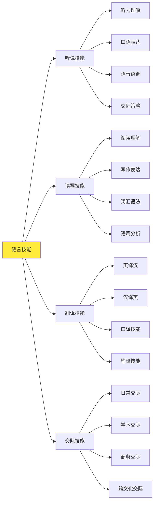
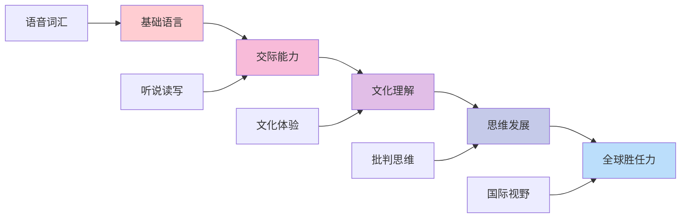
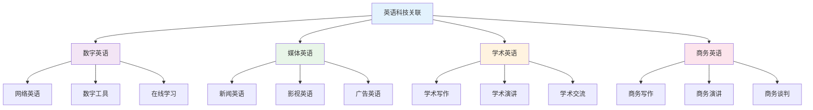
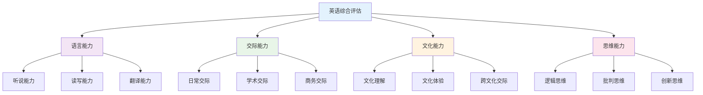
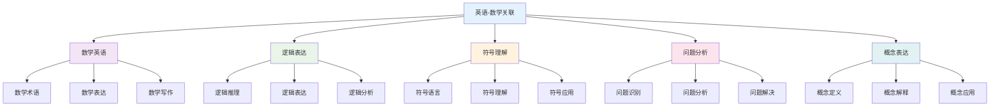
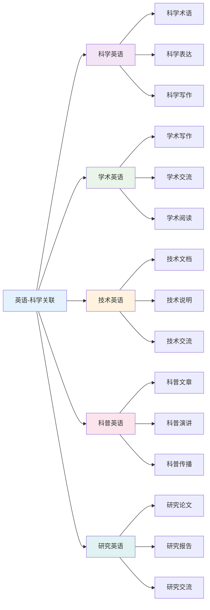
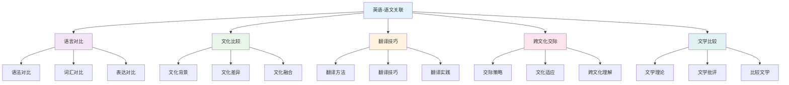
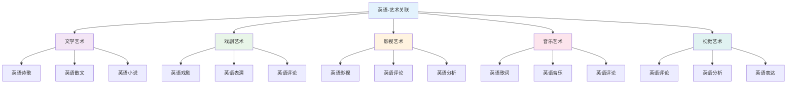
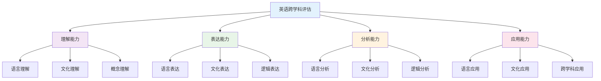

## 📚 英语教材内容与知识体系

### 20. 国际英语教材体系分析

**🌍 主要国家英语教材特色**

| 国家/地区 | 教材体系 | 核心特色 | 知识组织 | 教学方法 | 评估方式 |
|---------|----------|----------|----------|----------|----------|
| **美国** | Common Core ELA | 批判性思维+表达 | 技能导向 | 项目学习 | 表现性评估 |
| **英国** | National Curriculum | 文学鉴赏+创意写作 | 经典文本 | 讨论分析 | 过程评估 |
| **加拿大** | Provincial Curriculum | 多元文化+交际能力 | 主题单元 | 交际教学 | 真实情境 |
| **澳大利亚** | Australian Curriculum | 跨文化+全球视野 | 情境化设计 | 体验学习 | 综合评估 |
| **新加坡** | 21世纪技能 | 双语能力+国际视野 | 技能整合 | 任务教学 | 能力评估 |

### 21. 英语知识图谱构建

**🔗 高中英语知识网络结构**

```mermaid
graph TD
    A[高中英语知识体系] --> B[语言知识]
    A --> C[文学知识]
    A --> D[文化知识]
    A --> E[交际知识]
    A --> F[思维知识]
    A --> G[英语实践]
    
    B --> B1[语音知识]
    B --> B2[词汇知识]
    B --> B3[语法知识]
    B --> B4[语篇知识]
    B --> B5[语用知识]
    
    C --> C1[英美文学]
    C --> C2[世界文学]
    C --> C3[现代文学]
    C --> C4[文学理论]
    C --> C5[文学批评]
    
    D --> D1[英美文化]
    D --> D2[世界文化]
    D --> D3[跨文化]
    D --> D4[文化理解]
    D --> D5[文化交际]
    
    E --> E1[口语交际]
    E --> E2[书面交际]
    E --> E3[媒体交际]
    E --> E4[学术交际]
    E --> E5[商务交际]
    
    F --> F1[逻辑思维]
    F --> F2[批判思维]
    F --> F3[创新思维]
    F --> F4[系统思维]
    F --> F5[跨文化思维]
    
    G --> G1[听说技能]
    G --> G2[读写技能]
    G --> G3[翻译技能]
    G --> G4[文化体验]
    G --> G5[综合实践]
    
    style A fill:#e3f2fd
    style B fill:#f3e5f5
    style C fill:#e8f5e8
    style D fill:#fff3e0
    style E fill:#fce4ec
    style F fill:#e0f2f1
    style G fill:#f1f8e9
```

### 22. 英语概念关联网络

**🔗 核心英语概念关联分析**

#### 22.1 语言技能关联网络

#### 22.2 文化概念关联网络

| 文化领域 | 核心概念 | 基础概念 | 关联概念 | 应用领域 | 认知难点 |
|---------|----------|----------|----------|----------|----------|
| **英美文化** | 文化传统 | 历史背景、社会制度 | 价值观念、生活方式 | 文化理解 | 文化差异 |
| **世界文化** | 文化多样性 | 地理环境、民族特色 | 文化认同、文化冲突 | 跨文化交际 | 文化敏感 |
| **现代文化** | 文化变迁 | 科技发展、社会变革 | 文化融合、文化创新 | 现代交际 | 文化适应 |
| **学术文化** | 学术规范 | 学术诚信、学术表达 | 学术思维、学术交流 | 学术研究 | 学术英语 |

### 23. 英语知识发展路径

**📈 英语概念发展轨迹**

#### 23.1 英语能力发展路径

#### 23.2 英语思维发展

| 发展阶段 | 认知特征 | 思维表现 | 教学重点 | 评估标准 |
|---------|----------|----------|----------|----------|
| **语言感知** | 语音识别 | 基础理解 | 语言训练 | 理解准确性 |
| **交际应用** | 语言运用 | 有效交际 | 交际教学 | 交际效果 |
| **文化理解** | 文化认知 | 文化理解 | 文化教学 | 文化素养 |
| **批判思维** | 思维分析 | 批判思考 | 思维教学 | 思维深度 |
| **全球视野** | 国际认知 | 全球思维 | 国际教学 | 国际胜任力 |

### 24. 国际化英语教学内容

**🌍 国际英语课程标准对比**

#### 24.1 美国Common Core ELA标准

**📊 核心内容领域**:

| 内容领域 | 核心概念 | 技能要求 | 应用能力 | 评估标准 |
|---------|----------|----------|----------|----------|
| **阅读** | 文本理解 | 批判性阅读 | 深度理解 | 理解能力 |
| **写作** | 表达技能 | 论证写作 | 有效表达 | 表达能力 |
| **听说** | 交际技能 | 口语表达 | 有效交际 | 交际能力 |
| **语言** | 语言知识 | 语言运用 | 准确表达 | 语言能力 |

#### 24.2 英国National Curriculum特色

**🎯 英国英语教学方法**:

1. **经典文学教学**
   - 莎士比亚戏剧
   - 英国文学经典
   - 现代文学作品
   - 文学批评方法

2. **创意写作方法**
   - 想象性写作
   - 描述性写作
   - 论证性写作
   - 诗歌创作

3. **讨论分析方法**
   - 小组讨论
   - 文本分析
   - 观点辩论
   - 批判性思考

### 25. 英语知识关联深度分析

**🔗 跨领域知识关联**

#### 25.1 英语与文化的关联

| 英语概念 | 文化背景 | 关联深度 | 教学策略 | 学习效果 |
|---------|----------|----------|----------|----------|
| **语言表达** | 文化语境 | 深度关联 | 文化情境 | 理解深化 |
| **文学理解** | 文化背景 | 直接应用 | 文化分析 | 应用能力 |
| **交际技能** | 文化规范 | 方法迁移 | 文化探究 | 思维培养 |
| **思维方式** | 文化思维 | 概念统一 | 多表征 | 综合能力 |

#### 25.2 英语与科技的关联

### 26. 英语实践教学体系

**📖 基于知识图谱的实践教学**

#### 26.1 交际技能发展

| 交际技能 | 技能内容 | 发展要求 | 评估方法 | 应用领域 |
|---------|----------|----------|----------|----------|
| **日常交际** | 生活对话 | 流利性 | 对话测试 | 日常生活 |
| **学术交际** | 学术讨论 | 准确性 | 讨论测试 | 学术研究 |
| **商务交际** | 商务沟通 | 专业性 | 商务测试 | 商务活动 |
| **跨文化交际** | 文化理解 | 敏感性 | 文化测试 | 国际交流 |

#### 26.2 英语教学创新

**🎯 现代英语教学方法**:

1. **数字化英语环境**
   - 在线学习平台
   - 虚拟现实技术
   - 人工智能辅助

2. **多媒体英语教学**
   - 影视英语
   - 音乐英语
   - 游戏英语

3. **创新英语设计**
   - 项目学习
   - 任务教学
   - 情境教学

### 27. 英语学习评估体系

**📊 基于知识图谱的评估框架**

#### 27.1 能力评估

| 评估维度 | 评估内容 | 评估方法 | 评估标准 | 发展指标 |
|---------|----------|----------|----------|----------|
| **语言能力** | 语言运用 | 语言测试 | 准确表达 | 语言清晰度 |
| **交际能力** | 交际效果 | 交际测试 | 有效交际 | 交际能力 |
| **文化能力** | 文化理解 | 文化测试 | 文化认同 | 文化素养 |
| **思维能力** | 思维品质 | 思维测试 | 思维深度 | 思维能力 |

#### 27.2 综合能力评估

**🎯 英语综合能力评估矩阵**:

### 28. 英语教育国际化发展

**🌍 国际英语教育趋势**

#### 28.1 全球英语教育标准

| 标准体系 | 核心理念 | 内容特点 | 评估方式 | 发展趋势 |
|---------|----------|----------|----------|----------|
| **中国英语** | 交际能力 | 实用技能 | 综合评估 | 应用导向 |
| **美国ELA** | 批判思维 | 文学素养 | 表现性评估 | 深度理解 |
| **英国English** | 文学传统 | 经典文本 | 过程评估 | 文化传承 |
| **国际英语** | 全球视野 | 跨文化 | 真实情境 | 国际胜任力 |

#### 28.2 英语教育技术整合

**💻 数字化英语教育**:

1. **智能学习系统**
   - 个性化学习路径
   - 自适应语言指导
   - 实时语音反馈

2. **虚拟学习环境**
   - 英语情境模拟
   - 文化体验平台
   - 协作学习空间

3. **多媒体教学平台**
   - 数字图书馆
   - 在线学习工具
   - 文化资源库

## 🔗 英语与其他学科关联性分析

### 20. 英语-数学学科关联

**🌍 英语与数学的国际化关联**

#### 20.1 英语-数学关联网络

#### 20.2 英语-数学应用领域

| 数学领域 | 英语工具 | 应用内容 | 教学重点 | 能力培养 | 创新点 |
|---------|----------|----------|----------|----------|----------|
| **数学术语** | 英语表达、理解 | 数学概念、术语表达 | 术语教学 | 术语能力 | 国际化整合 |
| **逻辑表达** | 英语逻辑、论证 | 数学证明、推理表达 | 逻辑训练 | 逻辑能力 | 思维整合 |
| **问题分析** | 英语分析、表达 | 数学问题、应用题 | 分析教学 | 分析能力 | 问题整合 |
| **概念理解** | 英语理解、表达 | 数学概念、定理理解 | 概念教学 | 理解能力 | 概念整合 |

### 21. 英语-科学学科关联

**🔬 英语与科学学科的国际化融合**

#### 21.1 英语-科学关联网络

#### 21.2 英语-科学应用策略

| 科学领域 | 英语方法 | 应用内容 | 教学策略 | 学习效果 | 实践应用 |
|---------|----------|----------|----------|----------|----------|
| **物理科学** | 科学英语、表达 | 物理概念、原理表达 | 科学英语 | 英语能力 | 国际交流 |
| **化学科学** | 实验英语、描述 | 化学现象、实验描述 | 实验英语 | 描述能力 | 实验记录 |
| **生物科学** | 生物英语、观察 | 生物现象、观察记录 | 生物英语 | 观察能力 | 生物研究 |
| **地球科学** | 地理英语、分析 | 地理现象、环境描述 | 地理英语 | 分析能力 | 环境研究 |

### 22. 英语-语文学科关联

**🌍 英语与语文的跨文化关联**

#### 22.1 英语-语文关联网络

#### 22.2 英语-语文应用领域

| 语文领域 | 英语工具 | 应用内容 | 教学重点 | 能力培养 | 创新应用 |
|---------|----------|----------|----------|----------|----------|
| **语言学习** | 语言对比、分析 | 语法对比、词汇对比 | 对比教学 | 对比能力 | 语言学习 |
| **文化理解** | 文化分析、比较 | 文化背景、文化差异 | 文化教学 | 文化能力 | 跨文化交际 |
| **翻译实践** | 翻译技巧、方法 | 翻译方法、翻译实践 | 翻译教学 | 翻译能力 | 翻译应用 |
| **文学研究** | 文学理论、批评 | 文学比较、文学批评 | 文学教学 | 文学能力 | 文学研究 |

### 23. 英语-人文学科关联

**🎭 英语与人文社科的国际化融合**

#### 23.1 英语-历史关联分析

| 关联维度 | 英语内容 | 历史应用 | 教学策略 | 能力培养 | 创新点 |
|---------|----------|----------|----------|----------|----------|
| **史料解读** | 英语史料、文献 | 历史文献、史料解读 | 史料教学 | 解读能力 | 历史整合 |
| **历史叙述** | 英语叙述、表达 | 历史事件、人物叙述 | 叙述教学 | 叙述能力 | 叙述整合 |
| **历史评价** | 英语评价、标准 | 历史人物、事件评价 | 评价教学 | 评价能力 | 评价整合 |
| **文化传承** | 英语文化、表达 | 历史文化、传统传承 | 文化教学 | 文化能力 | 文化整合 |

#### 23.2 英语-哲学关联分析

| 关联领域 | 英语概念 | 哲学应用 | 教学方法 | 学习效果 | 应用价值 |
|---------|----------|----------|----------|----------|----------|
| **思维训练** | 英语思维、批判思维 | 哲学思维、辩证思维 | 思维教学 | 思维能力 | 哲学思考 |
| **概念分析** | 英语概念、表达 | 哲学概念、理论分析 | 概念教学 | 分析能力 | 理论分析 |
| **价值判断** | 英语价值、表达 | 价值观念、伦理判断 | 价值教学 | 判断能力 | 价值思考 |
| **文化理解** | 英语文化、表达 | 文化哲学、文化理解 | 文化教学 | 理解能力 | 文化思考 |

### 24. 英语-艺术学科关联

**🎨 英语与艺术的国际化融合**

#### 24.1 英语-艺术关联网络

#### 24.2 英语-艺术应用领域

| 艺术领域 | 英语概念 | 艺术应用 | 教学方法 | 学习效果 | 创新价值 |
|---------|----------|----------|----------|----------|----------|
| **文学艺术** | 英语创作、批评 | 英语诗歌、散文、小说 | 创作教学 | 创作能力 | 文学创作 |
| **戏剧艺术** | 英语戏剧、表演 | 英语戏剧、话剧、音乐剧 | 戏剧教学 | 表演能力 | 戏剧创作 |
| **影视艺术** | 英语影视、评论 | 英语电影、电视剧、纪录片 | 影视教学 | 影视能力 | 影视创作 |
| **音乐艺术** | 英语音乐、歌词 | 英语歌曲、音乐、歌词 | 音乐教学 | 音乐能力 | 音乐创作 |

### 25. 跨学科英语教学策略

**🎯 基于关联性的英语教学**

#### 25.1 强关联学科教学策略

| 关联类型 | 教学策略 | 内容整合 | 方法创新 | 评估方式 | 发展目标 |
|---------|----------|----------|----------|----------|----------|
| **英语-语文** | 对比教学 | 语言文化对比 | 对比分析 | 对比评估 | 对比能力 |
| **英语-科学** | 科学教学 | 科学英语训练 | 科学英语 | 科学评估 | 科学能力 |
| **英语-历史** | 历史教学 | 历史英语训练 | 历史英语 | 历史评估 | 历史能力 |

#### 25.2 中关联学科教学策略

| 关联类型 | 教学策略 | 内容整合 | 方法创新 | 评估方式 | 发展目标 |
|---------|----------|----------|----------|----------|----------|
| **英语-数学** | 数学教学 | 数学英语训练 | 数学英语 | 数学评估 | 数学能力 |
| **英语-艺术** | 艺术教学 | 艺术英语训练 | 艺术英语 | 艺术评估 | 艺术能力 |
| **英语-哲学** | 哲学教学 | 哲学英语训练 | 哲学英语 | 哲学评估 | 哲学能力 |

### 26. 英语跨学科评估体系

**📊 基于关联性的英语评估**

#### 26.1 跨学科英语能力评估

| 评估维度 | 评估内容 | 评估方法 | 评估标准 | 发展指标 |
|---------|----------|----------|----------|----------|
| **理解能力** | 英语理解 | 理解测试 | 准确理解 | 理解深度 |
| **表达能力** | 英语表达 | 表达测试 | 准确表达 | 表达质量 |
| **分析能力** | 英语分析 | 分析测试 | 深度分析 | 分析质量 |
| **应用能力** | 英语应用 | 应用测试 | 有效应用 | 应用创新 |

#### 26.2 跨学科英语综合评估

**🎯 英语跨学科综合能力评估矩阵**:

### 27. 英语跨学科发展趋势

**🌍 国际英语跨学科教育趋势**

#### 27.1 全球英语跨学科趋势

| 发展趋势 | 核心理念 | 内容特点 | 实施策略 | 发展前景 |
|---------|----------|----------|----------|----------|
| **跨文化教育** | 文化理解 | 多元文化 | 文化教学 | 全球视野 |
| **数字英语** | 数字技术 | 数字英语 | 技术教学 | 数字应用 |
| **创意英语** | 创意表达 | 创意英语 | 创意教学 | 创意发展 |
| **媒体英语** | 媒体理解 | 媒体分析 | 媒体教学 | 媒体应用 |

#### 27.2 英语跨学科技术整合

**💻 数字化英语跨学科教育**:

1. **智能英语系统**
   - 自动翻译工具
   - 可视化英语
   - 实时英语反馈

2. **虚拟英语实验室**
   - 虚拟英语环境
   - 交互式英语
   - 协作英语平台

3. **多媒体英语平台**
   - 英语资源库
   - 英语工具集
   - 评估数据库
