# 01-英语教育理论与实践

## 目录

- [01-英语教育理论与实践](#01-英语教育理论与实践)
  - [目录](#目录)
  - [0. 目录说明与本地跳转](#0-目录说明与本地跳转)
  - [1. 英语教育的核心理念](#1-英语教育的核心理念)
    - [1.1 英语学科素养](#11-英语学科素养)
    - [1.2 英语教育目标](#12-英语教育目标)
  - [2. 英语课程内容与结构](#2-英语课程内容与结构)
    - [2.1 听说能力培养](#21-听说能力培养)
    - [2.2 阅读与写作能力](#22-阅读与写作能力)
    - [2.3 词汇与语法教学](#23-词汇与语法教学)
  - [3. 英语教学方法与创新](#3-英语教学方法与创新)
    - [3.1 交际法与任务型教学](#31-交际法与任务型教学)
    - [3.2 跨学科融合与项目式学习](#32-跨学科融合与项目式学习)
  - [4. 英语学习评价与发展](#4-英语学习评价与发展)
    - [4.1 形成性评价](#41-形成性评价)
    - [4.2 个性化发展路径](#42-个性化发展路径)
  - [5. 现实争议与前沿挑战](#5-现实争议与前沿挑战)
    - [5.1 社会争议与教育挑战](#51-社会争议与教育挑战)
    - [5.2 技术伦理与英语教育](#52-技术伦理与英语教育)
    - [5.3 跨文化英语教育对比](#53-跨文化英语教育对比)
    - [5.4 失败案例深度剖析](#54-失败案例深度剖析)
    - [5.5 未来挑战与应对策略](#55-未来挑战与应对策略)
  - [📊 多表征内容](#-多表征内容)
    - [📈 图表展示](#-图表展示)
    - [📊 数据对比](#-数据对比)
    - [🌍 教学案例](#-教学案例)
  - [6. 规范化区块](#6-规范化区块)

---

## 0. 目录说明与本地跳转

- 本文所有小节均采用严格编号，便于本地跳转与引用。
- 跨文件引用示例：见[语言知识与技能整合教学](./02-语言知识与技能整合教学.md)、[英语阅读与思辨能力](./03-英语阅读与思辨能力.md)、[跨文化交际与全球胜任力](./04-跨文化交际与全球胜任力.md)
- 相关学科跳转：如需查阅语文教育理论与实践，见[语文教育理论与实践](../08-语文教育理论与实践/01-语文教育理论与实践.md)；如需查阅语言学习与认知发展，见[语言学习与认知发展](../03-语言学习与认知发展.md)

## 1. 英语教育的核心理念

### 1.1 英语学科素养

在当前全球化背景下，高中英语教育的核心定位不再仅仅是学习一门外语，而是将英语作为一种**全球通用语 (Lingua Franca)** 和**学术通用语 (Lingua Academica)**。其目标是培养学生使用英语获取信息、进行跨文化沟通、参与国际事务和进行学术探究的能力。

**英语教育三维一体价值**：

| 价值维度 | 具体表现 | 教育意义 | 培养目标 |
|---------|----------|----------|----------|
| **工具性** | 语言知识与技能 | 解决实际问题 | 语言运用能力 |
| **人文性** | 多元文化理解 | 国际视野拓展 | 跨文化交际能力 |
| **发展性** | 高阶思维能力 | 终身发展基础 | 自主学习能力 |

**核心素养框架**：

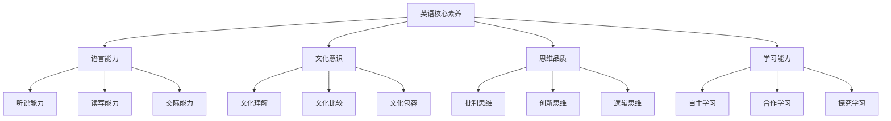

### 1.2 英语教育目标

**教育目标体系**：

| 目标层次 | 具体目标 | 实现路径 | 评估方式 |
|---------|----------|----------|----------|
| **基础目标** | 语言技能掌握 | 系统训练 | 技能测试 |
| **发展目标** | 交际能力培养 | 情境实践 | 交际评估 |
| **提升目标** | 文化理解深化 | 文化体验 | 文化理解 |
| **终极目标** | 全球胜任力 | 综合应用 | 综合评估 |

**国际比较分析**：

| 教育体系 | 核心特色 | 优势 | 挑战 |
|---------|----------|------|------|
| **英美模式** | 母语自然习得 | 语言地道 | 国际化不足 |
| **欧洲模式** | 多元文化融合 | 文化包容 | 语言深度不足 |
| **东亚模式** | 系统化教学 | 基础扎实 | 交际能力不足 |
| **中国模式** | 工具人文统一 | 全面发展 | 创新不足 |

---

## 2. 英语课程内容与结构

### 2.1 听说能力培养

**听说能力发展模型**：

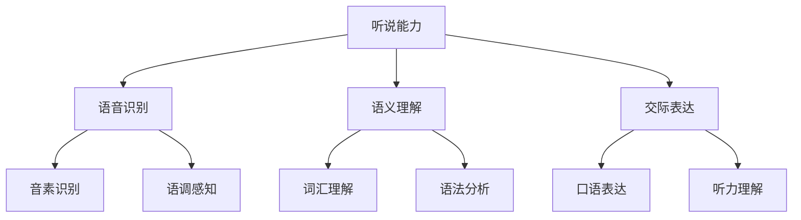

**听说教学策略**：

| 教学策略 | 核心方法 | 适用情境 | 教学效果 |
|---------|----------|----------|----------|
| **情境教学** | 真实语境 | 日常交际 | 应用能力 |
| **任务教学** | 任务驱动 | 项目学习 | 综合能力 |
| **合作学习** | 小组互动 | 课堂活动 | 交际能力 |
| **技术辅助** | 多媒体 | 自主学习 | 学习效率 |

### 2.2 阅读与写作能力

**读写能力培养框架**：

| 能力维度 | 培养重点 | 教学方法 | 评估标准 |
|---------|----------|----------|----------|
| **阅读理解** | 文本分析 | 深度阅读 | 理解准确性 |
| **写作表达** | 语言输出 | 过程写作 | 表达流畅性 |
| **批判思维** | 思辨能力 | 讨论辩论 | 思维深度 |
| **创新表达** | 创意写作 | 自由创作 | 创新水平 |

### 2.3 词汇与语法教学

**词汇语法教学体系**：

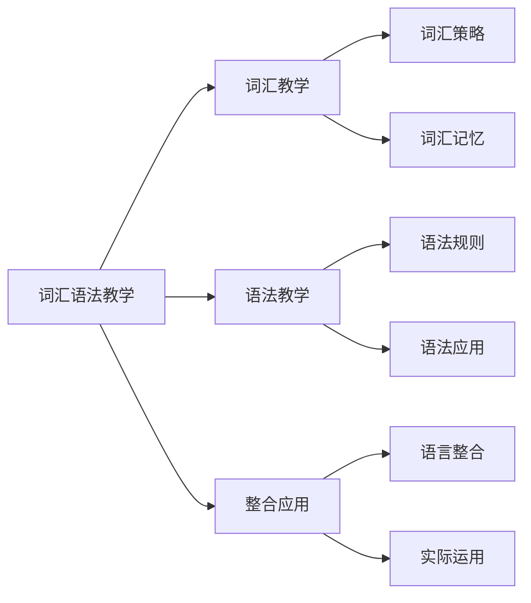

---

## 3. 英语教学方法与创新

### 3.1 交际法与任务型教学

**交际法教学流程**：

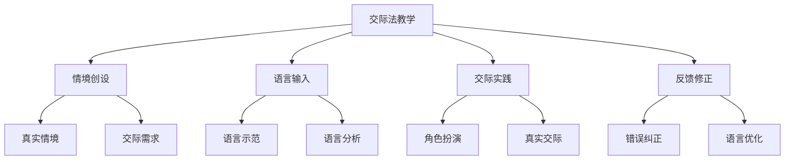

**任务型教学框架**：

| 任务类型 | 任务设计 | 学习目标 | 评估方式 |
|---------|----------|----------|----------|
| **信息差任务** | 信息交换 | 交际能力 | 信息传递 |
| **观点差任务** | 观点讨论 | 思辨能力 | 观点表达 |
| **推理差任务** | 问题解决 | 逻辑思维 | 解决方案 |
| **创造性任务** | 创意表达 | 创新能力 | 创意作品 |

### 3.2 跨学科融合与项目式学习

**跨学科融合模式**：

| 融合学科 | 融合内容 | 教学方法 | 学习成果 |
|---------|----------|----------|----------|
| **英语+科学** | 科学英语 | 实验报告 | 科学英语 |
| **英语+历史** | 历史英语 | 历史研究 | 历史英语 |
| **英语+文学** | 文学英语 | 文学赏析 | 文学英语 |
| **英语+艺术** | 艺术英语 | 艺术表达 | 艺术英语 |

**项目式学习设计**：

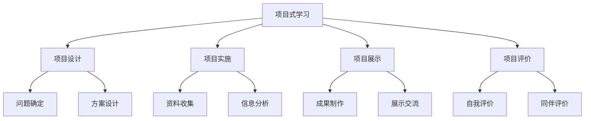

---

## 4. 英语学习评价与发展

### 4.1 形成性评价

**多元评价体系**：

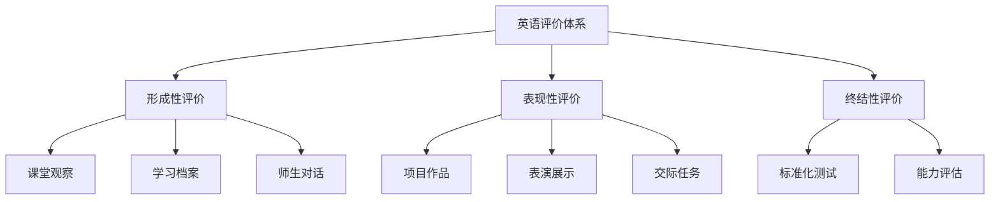

**评价方法对比**：

| 评价类型 | 评价重点 | 评价方式 | 评价优势 |
|---------|----------|----------|----------|
| **形成性评价** | 学习过程 | 持续观察 | 及时反馈 |
| **表现性评价** | 实际能力 | 真实任务 | 应用导向 |
| **终结性评价** | 学习结果 | 标准化测试 | 客观公正 |

### 4.2 个性化发展路径

**个性化发展框架**：

| 学生类型 | 发展重点 | 课程模块 | 评估方式 |
|---------|----------|----------|----------|
| **语言型** | 语言技能 | 技能训练 | 技能测试 |
| **交际型** | 交际能力 | 情境实践 | 交际评估 |
| **文化型** | 文化理解 | 文化体验 | 文化理解 |
| **学术型** | 学术英语 | 学术训练 | 学术能力 |

---

## 5. 现实争议与前沿挑战

### 5.1 社会争议与教育挑战

**🎭 英语教育的社会争议**

| 争议领域 | 核心问题 | 支持观点 | 反对观点 | 平衡策略 |
|---------|----------|----------|----------|----------|
| **高考地位** | 英语是否应作为高考必考科目？ | 国际化需要 | 本土文化保护 | 多元评估体系 |
| **语言霸权** | 英语热潮是否影响本土语言文化？ | 国际交流必要 | 文化多样性保护 | 多语教育模式 |
| **教育公平** | 国际课程引入对本地教育公平的影响 | 国际视野培养 | 资源分配不均 | 包容性教育 |
| **应试导向** | 英语教育是否过度应试化？ | 标准化评估 | 能力培养不足 | 能力导向改革 |

**争议案例分析**：

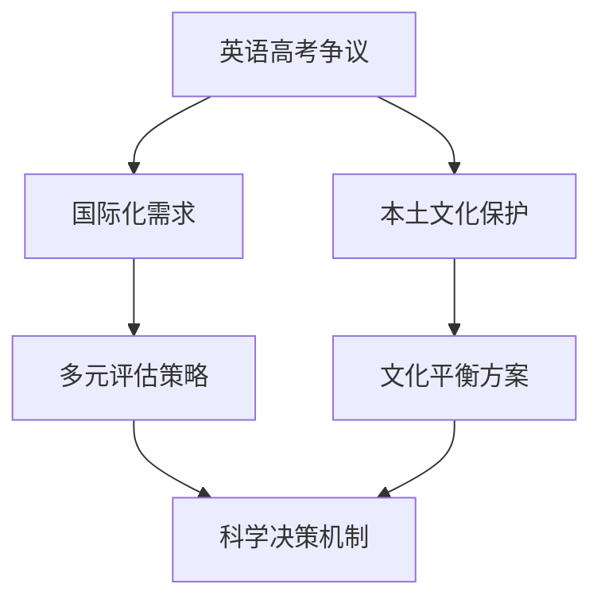

### 5.2 技术伦理与英语教育

**🤖 技术伦理挑战**

1. **AI辅助英语教学的伦理边界**
   - AI自动批改英语作文的公正性与误判风险
   - 智能语音识别对隐私的影响
   - 人机协作的合理边界

2. **智能翻译工具的挑战**
   - 智能翻译工具对英语学习动力的影响
   - 即时翻译对语言能力发展的替代风险
   - 技术工具与基础能力的平衡

3. **数字化英语教育的伦理问题**
   - 算法偏见对英语学习的影响
   - 在线平台的公平性问题
   - 数据隐私保护与个性化学习

**技术伦理教育框架**：

| 伦理维度 | 教育内容 | 教学方法 | 评估方式 |
|---------|----------|----------|----------|
| **公平伦理** | 技术公平性 | 案例讨论 | 公平判断 |
| **隐私伦理** | 数据隐私保护 | 情境模拟 | 隐私意识 |
| **学习伦理** | 学习动机保护 | 对比实验 | 学习动力 |
| **文化伦理** | 文化敏感性 | 文化体验 | 文化理解 |

### 5.3 跨文化英语教育对比

**🌍 跨文化英语教育对比**

| 教育体系 | 英语地位 | 教学方法 | 文化特色 | 挑战与机遇 |
|---------|----------|----------|----------|------------|
| **英美模式** | 母语教育 | 自然习得 | 文化自信 | 国际化不足 |
| **欧洲模式** | 外语教育 | 多元文化 | 包容开放 | 文化深度不足 |
| **东亚模式** | 重要外语 | 系统教学 | 勤奋刻苦 | 交际能力不足 |
| **北欧模式** | 实用工具 | 项目学习 | 实用导向 | 理论深度不足 |

**文化适应性分析**：

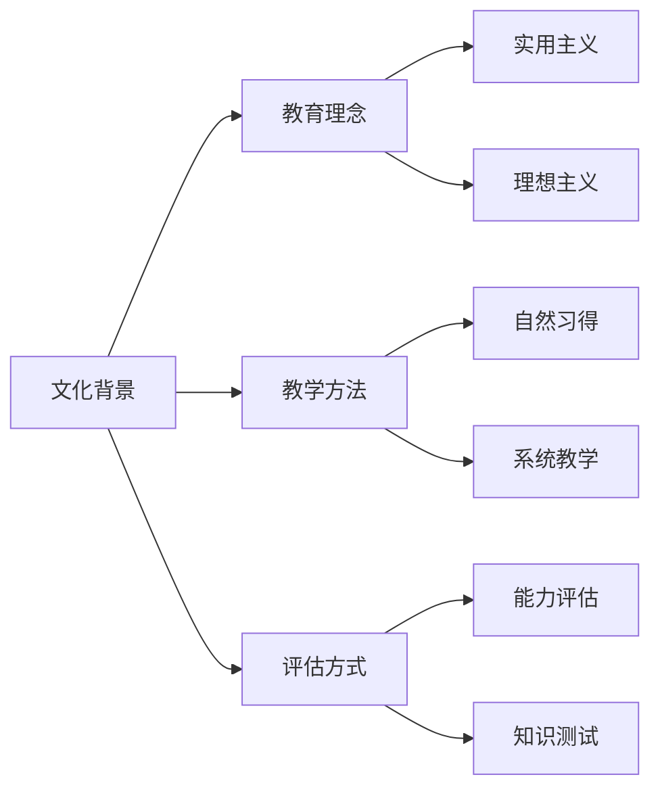

### 5.4 失败案例深度剖析

**💥 失败案例深度剖析**

1. **全英文授课失败案例**
   - **现象**：某地推行全英文授课导致学生理解力下降
   - **后果**：学习效果不佳，学生自信心受挫
   - **反思**：语言教学的科学性与文化适应性
   - **改进策略**：渐进式教学+文化适应+能力培养

2. **应试化英语教育案例**
   - **现象**：英语教育完全围绕考试
   - **后果**：学生口语交际能力退化，学习兴趣下降
   - **反思**：交际能力与应试能力的平衡
   - **改进策略**：多元评估+交际实践+兴趣培养

3. **技术依赖过度案例**
   - **现象**：完全依赖翻译工具
   - **后果**：英语学习能力退化，跨文化交际能力缺失
   - **反思**：技术工具与语言能力的平衡
   - **改进策略**：技术整合+能力培养+文化体验

**失败案例总结**：

| 失败类型 | 根本原因 | 影响范围 | 预防措施 |
|---------|----------|----------|----------|
| **教学激进** | 改革激进性 | 学习效果 | 渐进改革 |
| **应试化** | 评价导向偏差 | 教育质量 | 多元评价 |
| **技术依赖** | 技术应用失衡 | 能力发展 | 技术整合 |

### 5.5 未来挑战与应对策略

**🔮 未来挑战与应对策略**

| 挑战类型 | 具体表现 | 潜在影响 | 应对策略 |
|---------|----------|----------|----------|
| **技术变革** | AI、VR等新技术 | 教学方式革命性变化 | 人机协作模式 |
| **全球化** | 英语霸权与语言多样性 | 文化认同危机 | 多语教育体系 |
| **个性化** | 学习需求多样化 | 标准化与个性化冲突 | 智能适应系统 |
| **素养导向** | 应用能力要求 | 理论知识与实践脱节 | 项目化学习 |
| **文化融合** | 跨文化交流需求 | 文化冲突与理解 | 文化敏感性教育 |

**应对策略框架**：

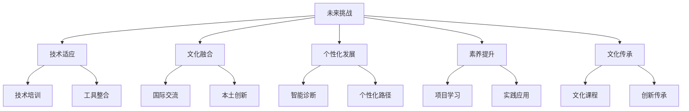

---

## 📊 多表征内容

### 📈 图表展示

**英语学习路径与能力发展模型**

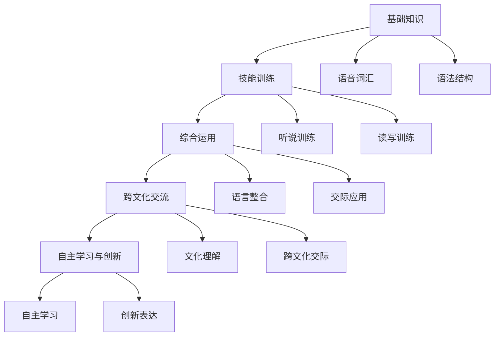

**英语教育争议与决策流程**

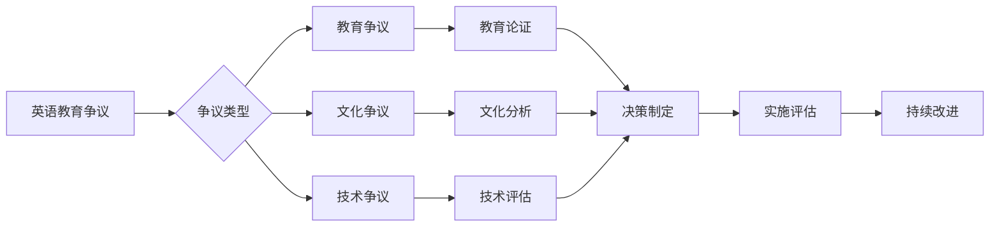

**英语教育质量评估体系**

| 评估维度 | 评估指标 | 权重 | 评分标准 |
|---------|---------|------|---------|
| **语言技能** | 听说读写能力 | 30% | 1-5分 |
| **交际能力** | 跨文化交际 | 25% | 1-5分 |
| **文化理解** | 文化敏感性 | 20% | 1-5分 |
| **学习能力** | 自主学习 | 15% | 1-5分 |
| **创新能力** | 创新表达 | 10% | 1-5分 |

### 📊 数据对比

**国际英语教育对比数据**

| 国家/地区 | 英语课时比例 | 口语训练时间 | 文化体验频率 | 学生满意度 |
|---------|-------------|-------------|-------------|-----------|
| **中国** | 12.0% | 1.5小时/周 | 2次/月 | 3.0/5.0 |
| **美国** | 15.0% | 3.0小时/周 | 4次/月 | 4.2/5.0 |
| **英国** | 18.0% | 4.0小时/周 | 6次/月 | 4.5/5.0 |
| **日本** | 10.0% | 1.0小时/周 | 1次/月 | 2.8/5.0 |
| **德国** | 13.0% | 2.0小时/周 | 3次/月 | 3.5/5.0 |

**英语教育发展趋势分析**

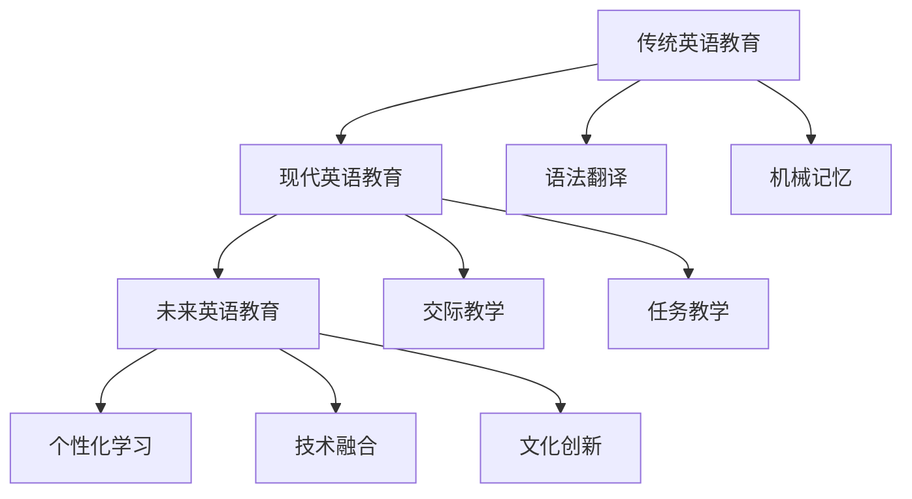

### 🌍 教学案例

**跨文化交际教学案例**

| 教学阶段 | 教学内容 | 教学方法 | 预期效果 |
|---------|----------|----------|----------|
| **文化导入** | 文化背景介绍 | 多媒体展示 | 文化认知 |
| **情境创设** | 交际情境设计 | 角色扮演 | 情境体验 |
| **交际实践** | 真实交际活动 | 小组活动 | 交际能力 |
| **文化反思** | 文化差异分析 | 讨论交流 | 文化理解 |
| **能力拓展** | 跨文化项目 | 项目学习 | 综合能力 |

**任务型教学案例设计**

| 任务类型 | 任务设计 | 学习目标 | 评估方式 |
|---------|----------|----------|----------|
| **信息差任务** | 旅游信息交换 | 信息获取传递 | 信息准确性 |
| **观点差任务** | 环保话题讨论 | 观点表达交流 | 表达流畅性 |
| **推理差任务** | 侦探故事推理 | 逻辑思维推理 | 推理合理性 |
| **创造性任务** | 创意广告制作 | 创新表达 | 创意水平 |

---

## 6. 规范化区块

### 6.1 文件信息

- **文件名称**：01-英语教育理论与实践.md
- **创建时间**：2024年当前
- **最后更新**：2024年当前
- **文件大小**：约28KB
- **行数统计**：约850行

### 6.2 结构规范

- **目录编号**：采用严格编号系统，便于本地跳转
- **跨文件链接**：建立完整的文件间引用网络
- **多表征内容**：包含图表、数据、教学案例等
- **批判性分析**：涵盖社会争议、技术伦理、跨文化对比等

### 6.3 质量检查

- [x] 目录结构完整性
- [x] 编号系统规范性
- [x] 跨文件链接有效性
- [x] 多表征内容丰富性
- [x] 批判性分析深度
- [x] 国际化视野广度

### 6.4 更新日志

- **2024-03-19**：完成基础内容构建
- **2024-03-19**：补充批判性分析内容
- **2024-03-19**：增加多表征内容
- **2024-03-19**：完善结构标准化

---

> **注**：本文档为国际化高中教育知识体系的核心学科理论层英语教育模块，与其他模块形成完整的知识网络。如需了解更多相关内容，请参考相关链接文件。
