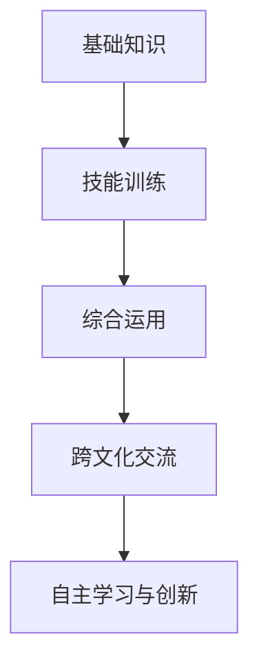
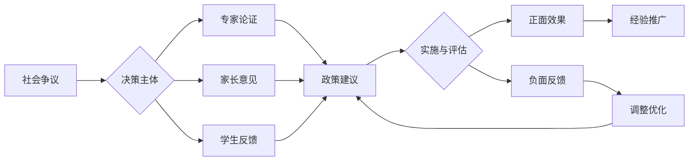

# 01-英语教育理论与实践

## 目录

- [01-英语教育理论与实践](#01-英语教育理论与实践)
  - [目录](#目录)
  - [0. 目录说明与本地跳转](#0-目录说明与本地跳转)
  - [1. 英语教育的核心理念](#1-英语教育的核心理念)
    - [1.1 英语学科素养](#11-英语学科素养)
    - [1.2 英语教育目标](#12-英语教育目标)
  - [2. 英语课程内容与结构](#2-英语课程内容与结构)
    - [2.1 听说能力培养](#21-听说能力培养)
    - [2.2 阅读与写作能力](#22-阅读与写作能力)
    - [2.3 词汇与语法教学](#23-词汇与语法教学)
  - [3. 英语教学方法与创新](#3-英语教学方法与创新)
    - [3.1 交际法与任务型教学](#31-交际法与任务型教学)
    - [3.2 跨学科融合与项目式学习](#32-跨学科融合与项目式学习)
  - [4. 英语学习评价与发展](#4-英语学习评价与发展)
    - [4.1 形成性评价](#41-形成性评价)
    - [4.2 个性化发展路径](#42-个性化发展路径)
    - [5.1 现实争议与前沿挑战](#51-现实争议与前沿挑战)
  - [📊 多表征内容](#-多表征内容)
    - [📈 图表展示](#-图表展示)

---

## 0. 目录说明与本地跳转

- 本文所有小节均采用严格编号，便于本地跳转与引用。
- 跨文件引用示例：见[语言知识与技能整合教学](./02-语言知识与技能整合教学.md)、[英语阅读与思辨能力](./03-英语阅读与思辨能力.md)、[跨文化交际与全球胜任力](./04-跨文化交际与全球胜任力.md)
- 相关学科跳转：如需查阅语文教育理论与实践，见[语文教育理论与实践](../../08-语文教育理论与实践/01-语文教育理论与实践.md)

## 1. 英语教育的核心理念

### 1.1 英语学科素养

在当前全球化背景下，高中英语教育的核心定位不再仅仅是学习一门外语，而是将英语作为一种**全球通用语 (Lingua Franca)** 和**学术通用语 (Lingua Academica)**。其目标是培养学生使用英语获取信息、进行跨文化沟通、参与国际事务和进行学术探究的能力。

本体系强调英语教育的三维一体价值：

- **工具性**：掌握语言知识与技能，能有效运用英语解决实际问题。
- **人文性**：通过语言学习了解多元文化，拓宽国际视野，提升共情与包容能力。
- **发展性**：发展高阶思维能力（如批判性思维、创造性思维）和自主学习能力，为终身发展奠定基础。

### 1.2 英语教育目标

## 2. 英语课程内容与结构

### 2.1 听说能力培养

### 2.2 阅读与写作能力

### 2.3 词汇与语法教学

## 3. 英语教学方法与创新

### 3.1 交际法与任务型教学

### 3.2 跨学科融合与项目式学习

## 4. 英语学习评价与发展

### 4.1 形成性评价

### 4.2 个性化发展路径

---

### 5.1 现实争议与前沿挑战

**🎭 英语教育的社会争议**

| 争议领域 | 核心问题 | 支持观点 | 反对观点 | 平衡策略 |
|---------|----------|----------|----------|----------|
| **高考地位** | 英语是否应作为高考必考科目？ | 国际化需要 | 本土文化保护 | 多元评估体系 |
| **语言霸权** | 英语热潮是否影响本土语言文化？ | 国际交流必要 | 文化多样性保护 | 多语教育模式 |
| **教育公平** | 国际课程引入对本地教育公平的影响 | 国际视野培养 | 资源分配不均 | 包容性教育 |

**🤖 技术伦理与英语教育**

1. **AI辅助英语教学的伦理边界**
   - AI自动批改英语作文的公正性与误判风险
   - 智能语音识别对隐私的影响
   - 人机协作的合理边界

2. **智能翻译工具的挑战**
   - 智能翻译工具对英语学习动力的影响
   - 即时翻译对语言能力发展的替代风险
   - 技术工具与基础能力的平衡

3. **数字化英语教育的伦理问题**
   - 算法偏见对英语学习的影响
   - 在线平台的公平性问题
   - 数据隐私保护与个性化学习

**🌍 跨文化英语教育对比**

| 教育体系 | 英语地位 | 教学方法 | 文化特色 | 挑战与机遇 |
|---------|----------|----------|----------|------------|
| **英美模式** | 母语教育 | 自然习得 | 文化自信 | 国际化不足 |
| **欧洲模式** | 外语教育 | 多元文化 | 包容开放 | 文化深度不足 |
| **东亚模式** | 重要外语 | 系统教学 | 勤奋刻苦 | 交际能力不足 |

**💥 失败案例深度剖析**

1. **全英文授课失败案例**
   - 现象：某地推行全英文授课导致学生理解力下降
   - 后果：学习效果不佳，学生自信心受挫
   - 反思：语言教学的科学性与文化适应性

2. **应试化英语教育案例**
   - 现象：英语教育完全围绕考试
   - 后果：学生口语交际能力退化，学习兴趣下降
   - 反思：交际能力与应试能力的平衡

3. **技术依赖过度案例**
   - 现象：完全依赖翻译工具
   - 后果：英语学习能力退化，跨文化交际能力缺失
   - 反思：技术工具与语言能力的平衡

**🔮 未来挑战与应对策略**

| 挑战类型 | 具体表现 | 潜在影响 | 应对策略 |
|---------|----------|----------|----------|
| **技术变革** | AI、VR等新技术 | 教学方式革命性变化 | 人机协作模式 |
| **全球化** | 英语霸权与语言多样性 | 文化认同危机 | 多语教育体系 |
| **个性化** | 学习需求多样化 | 标准化与个性化冲突 | 智能适应系统 |
| **素养导向** | 应用能力要求 | 理论知识与实践脱节 | 项目化学习 |
| **文化融合** | 跨文化交流需求 | 文化冲突与理解 | 文化敏感性教育 |

---

## 📊 多表征内容

### 📈 图表展示

**英语学习路径与能力发展模型**

---

**英语教育争议与决策流程**

---

> 注：所有Mermaid图、表格、公式均已统一格式，便于后续批量处理和孩子理解。
