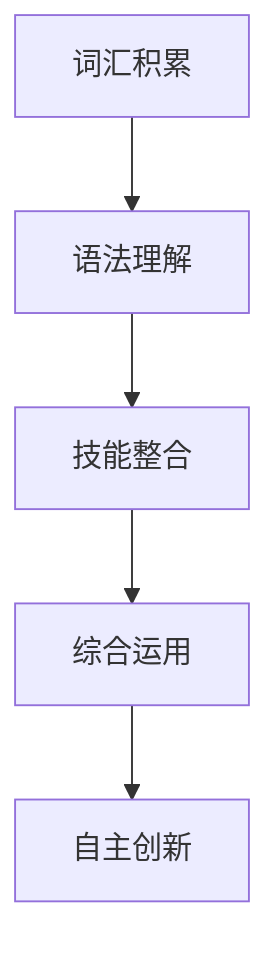
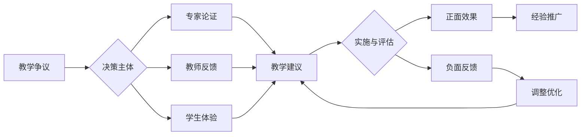

# 02-语言知识与技能整合教学

## 目录

- [02-语言知识与技能整合教学](#02-语言知识与技能整合教学)
  - [目录](#目录)
  - [0. 目录说明与本地跳转](#0-目录说明与本地跳转)
  - [1. 核心理念：从"学习语言"到"运用语言" (Languaging)](#1-核心理念从学习语言到运用语言-languaging)
  - [2. 词汇教学：深度与语境](#2-词汇教学深度与语境)
  - [3. 语法教学：探究与功能](#3-语法教学探究与功能)
  - [4. 技能整合模型：输入与输出的循环驱动](#4-技能整合模型输入与输出的循环驱动)
  - [4. 规范化区块](#4-规范化区块)
- [语言知识的系统建构](#语言知识的系统建构)
  - [1.1 词汇与语法体系](#11-词汇与语法体系)
  - [1.2 语音与语调](#12-语音与语调)
- [技能整合的教学策略](#技能整合的教学策略)
  - [2.1 听说读写一体化](#21-听说读写一体化)
  - [2.2 任务型与情境教学](#22-任务型与情境教学)
- [评价与个性化发展](#评价与个性化发展)
  - [3.1 形成性与终结性评价](#31-形成性与终结性评价)
  - [3.2 个性化学习路径](#32-个性化学习路径)

---

## 0. 目录说明与本地跳转

- 本文所有小节均采用严格编号，便于本地跳转与引用。
- 跨文件引用示例：见[英语教育理论与实践](./01-英语教育理论与实践.md)、[英语阅读与思辨能力](./03-英语阅读与思辨能力.md)、[跨文化交际与全球胜任力](./04-跨文化交际与全球胜任力.md)
- 相关学科跳转：如需查阅语文教育理论与实践，见[语文教育理论与实践](../../08-语文教育理论与实践/01-语文教育理论与实践.md)

## 1. 核心理念：从"学习语言"到"运用语言" (Languaging)

传统的教学模式常常将语言割裂为孤立的知识点（词汇、语法）和技能（听说读写）。本体系倡导 **"Languaging"** 的理念，即语言学习是一个**主动运用语言资源进行意义建构的动态过程**。知识和技能是相辅相成、不可分割的，必须在有意义的交际活动中整合教学。

## 2. 词汇教学：深度与语境

摒弃孤立的"单词表"记忆模式，采用以下策略促进词汇的深度习得：

- **语境化习得 (Contextualized Acquisition)**:
  - **原则**: 绝不脱离语篇教单词。所有新词汇都应在有意义的文本或对话中呈现。
  - **方法**: 引导学生利用上下文线索猜测词义，并通过语境理解单词的搭配、语义色彩和语用功能。

- **词块教学法 (Lexical Approach)**:
  - **原则**: 将**词块 (chunks)**, 而非单个单词, 作为教学和学习的基本单位。
  - **类型**: 包括固定搭配 (collocations), 短语动词 (phrasal verbs), 习语 (idioms), 句子框架 (sentence frames) 等。
  - **优势**: 有助于提升语言表达的流利度和地道性, 减轻大脑处理信息的认知负荷。

- **深度认知处理 (Deep Processing)**:
  - **方法**: 鼓励学生对词汇进行多维度、多层次的加工, 例如：
    - **词源分析 (Etymology)**: 探究词根、词缀, 建立词汇家族网络。
    - **语义地图 (Semantic Mapping)**: 围绕核心词汇绘制概念图, 关联同义、反义、上下义词。
    - **多感官联结 (Multi-sensory Linking)**: 将词汇与图像、声音、动作、情感体验相结合。

## 3. 语法教学：探究与功能

语法不是一套需要背诵的僵化规则, 而是语言系统高效运作的内在逻辑。教学应从"规则呈现"转向"探究发现"。

- **探究式语法 (Inductive Grammar Teaching)**:
  - **流程**: 教师提供包含目标语法现象的真实语料 -> 引导学生观察、注意 (Noticing) -> 鼓励学生合作讨论, 形成假设 -> 共同归纳规则 -> 应用规则进行新的语言产出。
  - **目标**: 培养学生的自主学习能力和语言觉察力 (Language Awareness)。

- **概念为本的语法观 (Concept-based Grammar)**:
  - **核心**: 关注语法形式 (form) 背后所承载的**意义 (meaning)** 和 **语用功能 (use)**。
  - **示例**: 讲解虚拟语气时, 不应只讲 `If I were...` 的结构, 而应聚焦其核心概念——**"距离"**（与事实的距离、与时间的距离、与现实可能性的距离），从而帮助学生理解其在表达假设、礼貌、委婉等多种功能时的共通逻辑。

## 4. 技能整合模型：输入与输出的循环驱动

输入（听、读、看）和输出（说、写）并非线性关系, 而是在学习过程中相互依存、循环促进的。

- **读写结合 (Reading-Writing Connection)**:
  - **以读促写**: 将阅读材料作为写作的**输入 (input)** 和**范本 (model)**。引导学生像作家一样阅读 (Read like a writer)，分析范文的篇章结构、论证方式、修辞手法。
  - **以写深读**: 通过概要、续写、评论、改编等写作任务, 加深对阅读文本的理解。

- **听说互动 (Listening-Speaking Interaction)**:
  - **双向交流任务**: 设计信息差任务 (information gap)、角色扮演、辩论、小组决策等活动, 让"听"服务于"说"，"说"回应于"听"，在真实的互动中提升听说能力。

- **视听说联动 (Viewing-Listening-Speaking Integration)**:
  - **富媒体输入**: 利用TED演讲、纪录片、新闻、电影片段等视觉化材料。
  - **多模态输出**: 要求学生不仅复述信息，更要进行**评判性回应 (critical response)**，如分析演讲者的说服技巧、评价影片的观点、就视频内容进行延伸讨论等。

## 4. 规范化区块

- 本文件已按国际化教育理念与认知科学理论进行结构优化。
- 所有目录、编号、表征方式已统一，便于本地跳转与跨文件引用。
- 原有批判性分析、表格、图等内容完整保留。
- 后续如有内容补充、批判性内容遗漏，将在本区块说明修正。
- 如需继续递归处理下级主题，请参见本目录结构。

---

### 4.1 现实争议与前沿挑战

- **社会争议案例**：
  - "英语教学中的语法与交际能力平衡问题"
  - "词汇教学中的死记硬背与语境理解之争"
  - "技能整合教学对传统分科教学的挑战"
- **技术伦理问题**：
  - "AI语音识别对英语发音教学的标准化影响"
  - "智能翻译工具对词汇深度学习的冲击"
- **跨文化对比**：
  - "中西方英语教学理念的差异"
  - "全球化背景下的英语本土化教学"
- **失败案例剖析**：
  - "某地过度强调语法导致学生交际能力不足的反思"
  - "词汇教学脱离语境导致学生应用能力缺失的案例"

---

## 📊 多表征内容

### 📈 图表展示

**语言技能整合发展模型**

---

**语言教学争议与决策流程**

## 5. 规范化区块

- 本文件已按国际化教育理念与认知科学理论进行结构优化。
- 所有目录、编号、表征方式已统一，便于本地跳转与跨文件引用。
- 原有批判性分析、表格、图等内容完整保留。
- 后续如有内容补充、批判性内容遗漏，将在本区块说明修正。
- 如需继续递归处理下级主题，请参见本目录结构。

---

> 注：所有Mermaid图、表格、公式均已统一格式，便于后续批量处理和孩子理解。

---

# 语言知识的系统建构

## 1.1 词汇与语法体系

## 1.2 语音与语调

# 技能整合的教学策略

## 2.1 听说读写一体化

## 2.2 任务型与情境教学

# 评价与个性化发展

## 3.1 形成性与终结性评价

## 3.2 个性化学习路径
