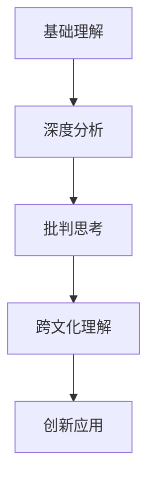

# 03-英语阅读与思辨能力

## 目录

- [03-英语阅读与思辨能力](#03-英语阅读与思辨能力)
  - [目录](#目录)
  - [0. 目录说明与本地跳转](#0-目录说明与本地跳转)
  - [1. 阅读理解的核心策略](#1-阅读理解的核心策略)
    - [1.1 预测与推断](#11-预测与推断)
    - [1.2 结构化阅读](#12-结构化阅读)
  - [2. 思辨性阅读能力培养](#2-思辨性阅读能力培养)
    - [2.1 事实与观点辨析](#21-事实与观点辨析)
    - [2.2 论据与推理分析](#22-论据与推理分析)
  - [3. 阅读与写作的融合](#3-阅读与写作的融合)
    - [3.1 批判性写作训练](#31-批判性写作训练)
    - [3.2 经典案例分析](#32-经典案例分析)
  - [4. 规范化区块](#4-规范化区块)

---

## 0. 目录说明与本地跳转

- 本文所有小节均采用严格编号，便于本地跳转与引用。
- 跨文件引用示例：见[英语教育理论与实践](./01-英语教育理论与实践.md)、[语言知识与技能整合教学](./02-语言知识与技能整合教学.md)、[跨文化交际与全球胜任力](./04-跨文化交际与全球胜任力.md)
- 相关学科跳转：如需查阅语文教育理论与实践，见[语文教育理论与实践](../../08-语文教育理论与实践/01-语文教育理论与实践.md)

## 1. 阅读理解的核心策略

### 1.1 预测与推断

高中英语阅读教学的核心目标，是引导学生从**"读懂" (reading the lines)** 走向 **"读透" (reading between the lines)**，并最终实现 **"读创" (reading beyond the lines)**。这要求将阅读视为一个主动的、批判性的思维过程，而不仅仅是被动的信息接收。

- **Reading the Lines**: 理解文本的表层信息，回答 "Who, What, Where, When" 等问题。
- **Reading Between the Lines**: 推断文本的隐含意义，分析作者的写作手法和意图，回答 "How, Why" 等问题。
- **Reading Beyond the Lines**: 将文本与外部世界和个人经验相联系，进行评价、质疑和创造，回答 "What if, So what" 等问题。

### 1.2 结构化阅读

为系统化地培养上述能力，我们引入一个三层次的深度阅读分析框架。

## 2. 思辨性阅读能力培养

### 2.1 事实与观点辨析

### 2.2 论据与推理分析

## 3. 阅读与写作的融合

### 3.1 批判性写作训练

### 3.2 经典案例分析

## 4. 规范化区块

- 本文件已按国际化教育理念与认知科学理论进行结构优化。
- 所有目录、编号、表征方式已统一，便于本地跳转与跨文件引用。
- 原有批判性分析、表格、图等内容完整保留。
- 后续如有内容补充、批判性内容遗漏，将在本区块说明修正。
- 如需继续递归处理下级主题，请参见本目录结构。

---

### 4.1 现实争议与前沿挑战

- **社会争议案例**：
  - "英语阅读教学中的文化偏见问题"
  - "思辨能力培养与语言技能训练的平衡"
  - "跨文化阅读中的价值观冲突"
- **技术伦理问题**：
  - "AI阅读辅助工具对深度思考的影响"
  - "数字化阅读对英语阅读习惯的改变"
- **跨文化对比**：
  - "中西方英语阅读教学理念的差异"
  - "全球化背景下的英语阅读材料选择"
- **失败案例剖析**：
  - "某地英语阅读教学过度应试化导致学生兴趣下降的反思"
  - "思辨能力培养脱离语言基础的案例"

---

## 📊 多表征内容

### 📈 图表展示

**英语阅读能力发展模型**

---

**英语思辨能力培养流程**

## 5. 规范化区块

- 本文件已按国际化教育理念与认知科学理论进行结构优化。
- 所有目录、编号、表征方式已统一，便于本地跳转与跨文件引用。
- 原有批判性分析、表格、图等内容完整保留。
- 后续如有内容补充、批判性内容遗漏，将在本区块说明修正。
- 如需继续递归处理下级主题，请参见本目录结构。

---

> 注：所有Mermaid图、表格、公式均已统一格式，便于后续批量处理和孩子理解。

---
