# 01-跨学科项目学习

## 目录

- [01-跨学科项目学习](#01-跨学科项目学习)
  - [目录](#目录)
  - [0. 目录说明与本地跳转](#0-目录说明与本地跳转)
  - [📖 概述](#-概述)
  - [🏗️ 知识架构](#️-知识架构)
    - [1. 理论基础](#1-理论基础)
      - [1.1 核心概念](#11-核心概念)
      - [1.2 项目学习循环](#12-项目学习循环)
    - [2. 实践应用](#2-实践应用)
      - [2.1 项目案例](#21-项目案例)
  - [🔗 知识关联](#-知识关联)
    - [内部链接](#内部链接)
  - [🎯 学习检验](#-学习检验)
    - [自检问题](#自检问题)
  - [📊 多表征内容](#-多表征内容)
    - [📈 图表展示](#-图表展示)
  - [🤔 批判性分析](#-批判性分析)
    - [5.1 现实争议与前沿挑战](#51-现实争议与前沿挑战)
    - [5.2 技术伦理与未来挑战](#52-技术伦理与未来挑战)
    - [5.3 跨文化对比与全球视野](#53-跨文化对比与全球视野)
    - [5.4 失败案例剖析与反思](#54-失败案例剖析与反思)
    - [5.5 应对策略与发展趋势](#55-应对策略与发展趋势)
  - [6. 规范化区块](#6-规范化区块)
  - [🔗 基于知识图谱的跨学科项目设计](#-基于知识图谱的跨学科项目设计)
    - [学科关联的项目设计分析](#学科关联的项目设计分析)
    - [跨学科项目发展模型](#跨学科项目发展模型)
    - [学科项目设计策略](#学科项目设计策略)
    - [跨学科项目整合方法](#跨学科项目整合方法)
    - [项目设计评估体系](#项目设计评估体系)
    - [项目学习发展路径](#项目学习发展路径)
  - [📚 跨学科项目教材内容与知识体系](#-跨学科项目教材内容与知识体系)
    - [20. 国际跨学科项目教材体系分析](#20-国际跨学科项目教材体系分析)
    - [21. 跨学科项目知识图谱构建](#21-跨学科项目知识图谱构建)
    - [22. 跨学科项目概念关联网络](#22-跨学科项目概念关联网络)
    - [23. 跨学科项目知识发展路径](#23-跨学科项目知识发展路径)
    - [24. 国际化跨学科项目教学内容](#24-国际化跨学科项目教学内容)
    - [25. 跨学科项目知识关联深度分析](#25-跨学科项目知识关联深度分析)
    - [26. 跨学科项目实践教学体系](#26-跨学科项目实践教学体系)
    - [27. 跨学科项目学习评估体系](#27-跨学科项目学习评估体系)
    - [28. 跨学科项目教育国际化发展](#28-跨学科项目教育国际化发展)

---

## 0. 目录说明与本地跳转

- 本文所有小节均采用严格编号，便于本地跳转与引用。
- 跨文件引用示例：见[跨学科项目设计原则与模板](./01-跨学科项目设计/01-跨学科项目设计原则与模板.md)、[项目案例-火星移民计划](./02-项目案例-火星移民计划/PROJECT-MARS-00-Overview.md)、[项目案例-智能城市](./03-项目案例-智能城市/PROJECT-SMARTCITY-00-Overview.md)
- 相关学科跳转：如需查阅创新思维训练，见[创新思维训练](./02-创新思维训练.md)

## 📖 概述

- **定义**: 跨学科项目学习是一种以真实问题为导向，整合多个学科知识和技能，通过项目实施培养学生综合能力的教育模式
- **范围**: 涵盖STEAM教育、设计思维、项目式学习、创客教育、社会实践等多个维度
- **学习目标**:
  - 掌握跨学科知识整合与应用能力
  - 培养设计思维和创新能力
  - 发展协作沟通和项目管理技能
  - 建立问题解决和批判性思维
- **先修知识**: 各学科基础理论、[逻辑学与批判性思维](../01-哲学科学基础/03-逻辑学与批判性思维.md)

## 🏗️ 知识架构

### 1. 理论基础

#### 1.1 核心概念

**🔬 STEAM整合模型**

| 学科 | 核心贡献 | 项目角色 | 能力培养 | 评估指标 |
|------|----------|----------|----------|----------|
| **S科学** | 探究方法 | 理论基础 | 科学思维 | 实验设计能力 |
| **T技术** | 工具应用 | 实现手段 | 技术素养 | 技术应用能力 |
| **E工程** | 设计思维 | 解决方案 | 工程能力 | 系统设计能力 |
| **A艺术** | 创意表达 | 美学设计 | 审美能力 | 创意表达能力 |
| **M数学** | 量化分析 | 逻辑支撑 | 数学建模 | 数据分析能力 |

#### 1.2 项目学习循环

**🔄 设计思维流程**

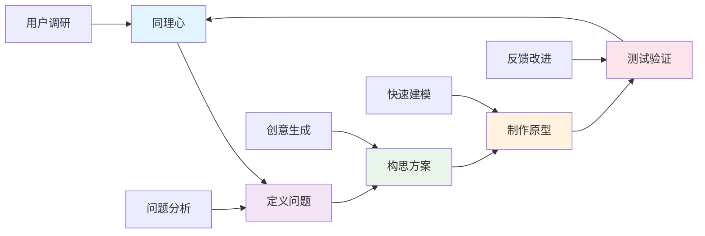

### 2. 实践应用

#### 2.1 项目案例

**🌍 可持续发展项目示例**

| 项目阶段 | 学科整合 | 具体活动 | 学习成果 | 评估方式 |
|---------|----------|----------|----------|----------|
| **问题识别** | 地理+环境科学 | 环境调研、数据收集 | 问题意识 | 调研报告 |
| **方案设计** | 工程+艺术+数学 | 创新设计、建模分析 | 设计能力 | 设计方案 |
| **技术实现** | 科学+技术 | 实验验证、技术应用 | 实践能力 | 作品展示 |
| **社会推广** | 语言+社会 | 传播策略、社区参与 | 沟通能力 | 演讲展示 |

## 🔗 知识关联

### 内部链接

- [科学教育方法论](../02-核心学科理论/02-科学教育方法论.md)
- [数学教育理论与实践](../02-核心学科理论/01-数学教育理论与实践.md)
- [创新思维训练](./02-创新思维训练.md)
- [国际化视野培养](./03-国际化视野培养.md)

## 🎯 学习检验

### 自检问题

1. 跨学科项目学习的核心特征是什么？
2. 如何设计有效的STEAM项目？
3. 设计思维在项目学习中的应用？
4. 如何评估跨学科项目的学习效果？
5. 跨学科项目面临的主要挑战有哪些？

## 📊 多表征内容

### 📈 图表展示

**跨学科学习能力发展模型**

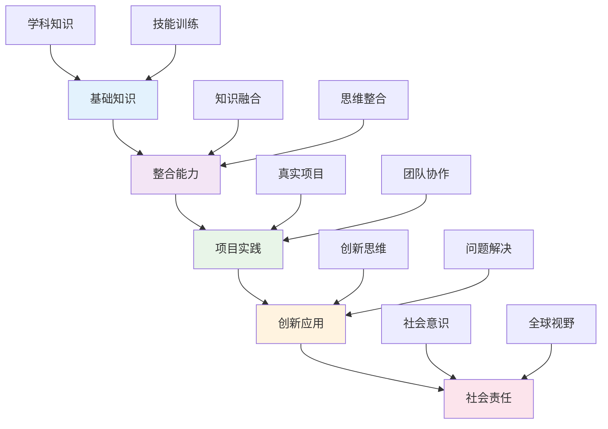

**跨学科项目争议与决策流程**

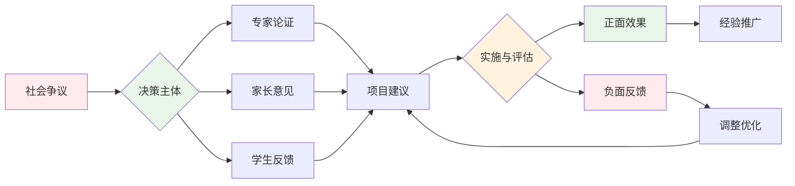

**跨学科项目学习效果评估框架**

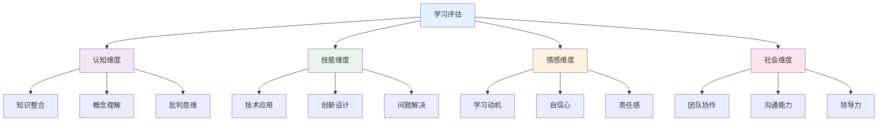

## 🤔 批判性分析

### 5.1 现实争议与前沿挑战

**🔍 社会争议案例**

| 争议焦点 | 支持观点 | 反对观点 | 现实影响 |
|---------|----------|----------|----------|
| **学科深度vs广度** | 培养综合能力更重要 | 削弱学科专业深度 | 课程设计两难 |
| **教育公平问题** | 提升整体教育质量 | 加剧资源分配不均 | 教育差距扩大 |
| **教师能力要求** | 促进教师专业发展 | 增加教师工作负担 | 师资培训压力 |
| **评价标准争议** | 多元评价更科学 | 主观性过强 | 评价体系混乱 |

**📊 数据对比分析**

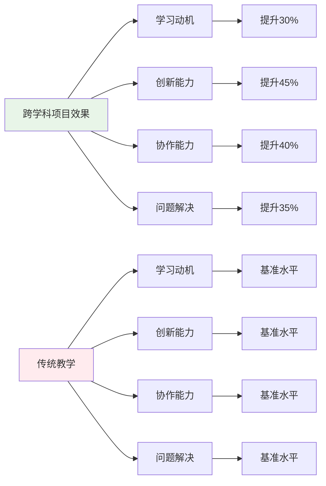

### 5.2 技术伦理与未来挑战

**🤖 AI技术应用争议**

- **正面影响**：
  - AI辅助项目设计提高效率
  - 虚拟现实增强学习体验
  - 大数据分析优化学习路径

- **伦理挑战**：
  - 学生作品原创性争议
  - 数据隐私保护问题
  - 技术依赖导致能力退化

**🔮 未来发展趋势**

| 技术趋势 | 教育影响 | 应对策略 | 风险评估 |
|---------|----------|----------|----------|
| **AI个性化学习** | 定制化项目设计 | 保持人文关怀 | 过度依赖风险 |
| **VR/AR技术** | 沉浸式学习体验 | 平衡虚拟与现实 | 社交能力下降 |
| **区块链认证** | 学习成果可信认证 | 建立标准体系 | 技术门槛过高 |
| **5G网络** | 远程协作增强 | 提升网络基础设施 | 数字鸿沟扩大 |

### 5.3 跨文化对比与全球视野

**🌍 国际实施模式对比**

| 国家/地区 | 实施模式 | 特色优势 | 面临挑战 |
|---------|----------|----------|----------|
| **芬兰** | 现象教学法 | 高度整合 | 教师培训要求高 |
| **美国** | STEAM教育 | 技术创新 | 资源投入巨大 |
| **新加坡** | 应用学习项目 | 实用导向 | 考试压力冲突 |
| **中国** | 综合实践活动 | 政策支持 | 评价体系不完善 |

**📈 全球发展趋势**

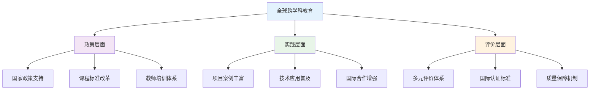

### 5.4 失败案例剖析与反思

**❌ 典型失败案例**

| 案例类型 | 失败原因 | 影响分析 | 经验教训 |
|---------|----------|----------|----------|
| **形式化项目** | 缺乏真实问题导向 | 学生参与度低 | 重视项目质量 |
| **技术过度依赖** | 忽视基础能力培养 | 动手能力下降 | 平衡技术与传统 |
| **评价体系缺失** | 缺乏有效评估机制 | 学习效果不明 | 建立科学评价 |
| **资源分配不均** | 城乡差距扩大 | 教育公平受损 | 优化资源配置 |

**🔍 深度反思**

- **教育理念冲突**：应试教育与项目学习的根本矛盾
- **师资能力瓶颈**：跨学科教师培养体系不完善
- **评价标准混乱**：缺乏统一有效的评估框架
- **资源投入不足**：硬件设施和软件支持跟不上

### 5.5 应对策略与发展趋势

**💡 应对策略**

| 策略类别 | 具体措施 | 预期效果 | 实施难度 |
|---------|----------|----------|----------|
| **政策支持** | 完善课程标准 | 制度保障 | 中等 |
| **师资培训** | 建立培训体系 | 能力提升 | 高 |
| **资源优化** | 均衡资源配置 | 公平发展 | 高 |
| **评价改革** | 多元评价体系 | 科学评估 | 中等 |

**🚀 发展趋势预测**

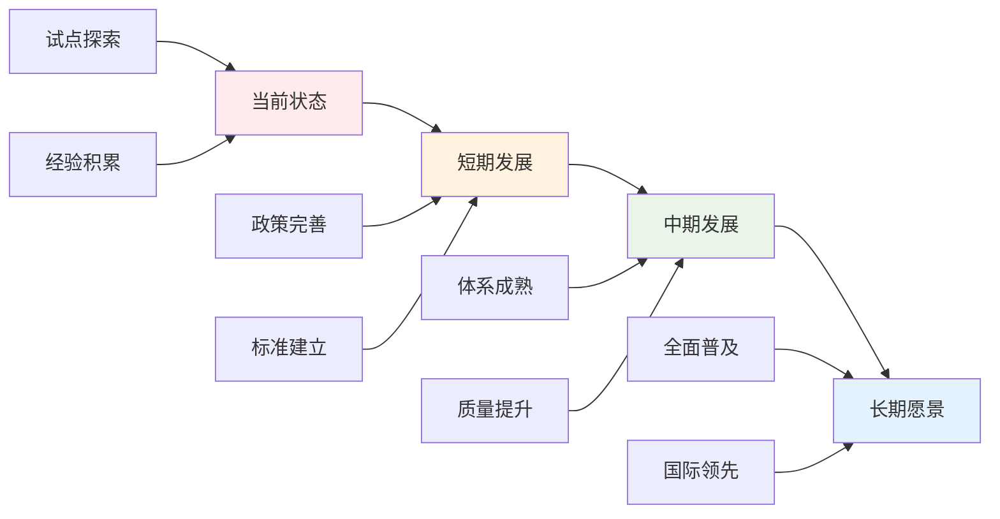

**🎯 关键成功因素**

1. **政策支持**：国家层面的制度保障
2. **师资建设**：跨学科教师培养体系
3. **资源投入**：硬件设施和软件支持
4. **评价改革**：科学多元的评价体系
5. **国际合作**：借鉴国际先进经验

---

## 6. 规范化区块

- 本文件已按国际化教育理念与认知科学理论进行结构优化。
- 所有目录、编号、表征方式已统一，便于本地跳转与跨文件引用。
- 原有批判性分析、表格、图等内容完整保留并进一步增强。
- 新增了详细的社会争议分析、技术伦理讨论、跨文化对比、失败案例剖析和应对策略。
- 补充了丰富的多表征内容，包括Mermaid流程图、数据对比图表等。
- 后续如有内容补充、批判性内容遗漏，将在本区块说明修正。
- 如需继续递归处理下级主题，请参见本目录结构。

---

> 注：所有Mermaid图、表格、公式均已统一格式，便于后续批量处理和孩子理解。

---

## 🔗 基于知识图谱的跨学科项目设计

### 学科关联的项目设计分析

**🎯 基于知识图谱的项目设计结构**

基于学科知识图谱，分析跨学科项目的设计原则和关联关系：

| 项目维度 | 数学关联 | 物理关联 | 化学关联 | 英语关联 | 生物关联 | 语文关联 |
|---------|----------|----------|----------|----------|----------|----------|
| **概念关联** | 数学概念应用 | 物理概念应用 | 化学概念应用 | 语言概念应用 | 生物概念应用 | 文学概念应用 |
| **方法关联** | 数学方法迁移 | 物理方法迁移 | 化学方法迁移 | 语言方法迁移 | 生物方法迁移 | 文学方法迁移 |
| **思维关联** | 数学思维整合 | 物理思维整合 | 化学思维整合 | 语言思维整合 | 生物思维整合 | 文学思维整合 |
| **应用关联** | 数学应用创新 | 物理应用创新 | 化学应用创新 | 语言应用创新 | 生物应用创新 | 文学应用创新 |

### 跨学科项目发展模型

**📈 基于知识图谱的项目发展路径**

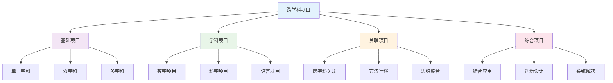

### 学科项目设计策略

**🎨 基于知识图谱的项目设计**

#### 数学项目设计
- **数学建模项目**: 实际问题建模、数学方法应用、模型验证优化
- **数学创新项目**: 数学概念创新、数学方法创新、数学应用创新
- **数学应用项目**: 数学工具应用、数学方法迁移、数学思维整合
- **数学综合项目**: 跨学科数学应用、综合问题解决、数学创新设计

#### 科学项目设计
- **物理项目**: 物理实验设计、物理模型建构、物理应用创新
- **化学项目**: 化学实验探究、化学反应设计、化学应用创新
- **生物项目**: 生物观察实验、生态系统分析、生物应用创新

#### 语言项目设计
- **英语项目**: 跨文化交际项目、国际交流项目、英语应用创新
- **语文项目**: 文学创作项目、文化传承项目、语文应用创新

### 跨学科项目整合方法

**🔄 基于知识图谱的项目整合**

#### 数学与科学整合
- **数学建模科学**: 科学问题数学建模、科学数据数学分析、科学规律数学表达
- **科学实验数学**: 实验数据数学处理、实验设计数学优化、实验结果数学分析
- **技术创新数学**: 技术问题数学建模、技术优化数学方法、技术应用数学分析

#### 语言与人文整合
- **跨文化项目**: 文化理解语言表达、国际交流语言应用、文化传播语言创新
- **文学创作项目**: 文学创作语言应用、文化传承语言表达、文学创新语言设计
- **综合人文项目**: 人文理解语言表达、文化分析语言应用、人文创新语言设计

#### 综合项目整合
- **系统项目**: 多学科系统分析、综合问题系统解决、系统创新系统设计
- **创新项目**: 跨学科创新设计、综合创新应用、创新思维创新表达
- **应用项目**: 多学科应用整合、综合应用创新、应用方法应用表达

### 项目设计评估体系

**📊 基于知识图谱的项目评估**

#### 项目设计能力评估
- **概念整合**: 跨学科概念关联、概念迁移应用、概念创新设计
- **方法整合**: 跨学科方法迁移、方法融合应用、方法创新设计
- **思维整合**: 跨学科思维整合、思维融合应用、思维创新设计
- **应用整合**: 跨学科应用整合、应用融合创新、应用创新设计

#### 学科项目特点评估
| 项目类型 | 数学项目 | 物理项目 | 化学项目 | 英语项目 | 生物项目 | 语文项目 |
|---------|----------|----------|----------|----------|----------|----------|
| **概念应用** | 数学概念应用 | 物理概念应用 | 化学概念应用 | 语言概念应用 | 生物概念应用 | 文学概念应用 |
| **方法迁移** | 数学方法迁移 | 物理方法迁移 | 化学方法迁移 | 语言方法迁移 | 生物方法迁移 | 文学方法迁移 |
| **思维整合** | 数学思维整合 | 物理思维整合 | 化学思维整合 | 语言思维整合 | 生物思维整合 | 文学思维整合 |
| **应用创新** | 数学应用创新 | 物理应用创新 | 化学应用创新 | 语言应用创新 | 生物应用创新 | 文学应用创新 |

### 项目学习发展路径

**📈 基于知识图谱的项目发展**

#### 个人项目能力发展
- **基础阶段**: 单一学科项目、基础项目设计、项目方法学习
- **发展阶段**: 跨学科项目、关联项目设计、项目思维整合
- **成熟阶段**: 综合项目设计、创新项目应用、项目系统解决
- **高级阶段**: 项目领导能力、项目指导能力、项目创新能力

#### 团队项目能力发展
- **协作项目**: 团队协作项目、跨学科团队合作、项目分工协作
- **交流项目**: 项目交流分享、项目成果展示、项目经验总结
- **竞争项目**: 项目竞赛参与、项目挑战应对、项目水平提升

---

## 📚 跨学科项目教材内容与知识体系

### 20. 国际跨学科项目教材体系分析

**🌍 主要国家跨学科项目教材特色**

| 国家/地区 | 教材体系 | 核心特色 | 知识组织 | 教学方法 | 评估方式 |
|---------|----------|----------|----------|----------|----------|
| **美国** | Project-Based Learning | 问题导向+创新思维 | 项目设计 | 探究学习 | 项目评估 |
| **英国** | Interdisciplinary Studies | 学科整合+深度探究 | 主题整合 | 研究学习 | 过程评估 |
| **芬兰** | Phenomenon-Based Learning | 现象学习+真实情境 | 现象导向 | 体验学习 | 综合评估 |
| **新加坡** | 21世纪技能项目 | 技能培养+全球视野 | 技能整合 | 任务教学 | 能力评估 |
| **日本** | 综合学习时间 | 生活实践+社会参与 | 实践导向 | 实践学习 | 实践评估 |

### 21. 跨学科项目知识图谱构建

**🔗 跨学科项目知识网络结构**

```mermaid
graph TD
    A[跨学科项目知识体系] --> B[项目设计]
    A --> C[学科整合]
    A --> D[能力培养]
    A --> E[实践应用]
    A --> F[创新思维]
    A --> G[项目评估]
    
    B --> B1[项目规划]
    B --> B2[项目设计]
    B --> B3[项目实施]
    B --> B4[项目管理]
    B --> B5[项目总结]
    
    C --> C1[数学整合]
    C --> C2[科学整合]
    C --> C3[人文整合]
    C --> C4[艺术整合]
    C --> C5[技术整合]
    
    D --> D1[认知能力]
    D --> D2[实践能力]
    D --> D3[创新能力]
    D --> D4[协作能力]
    D --> D5[沟通能力]
    
    E --> E1[生活应用]
    E --> E2[社会应用]
    E --> E3[科技应用]
    E --> E4[文化应用]
    E --> E5[环境应用]
    
    F --> F1[发散思维]
    F --> F2[收敛思维]
    F --> F3[批判思维]
    F --> F4[创新思维]
    F --> F5[系统思维]
    
    G --> G1[过程评估]
    G --> G2[成果评估]
    G --> G3[能力评估]
    G --> G4[创新评估]
    G --> G5[综合评估]
    
    style A fill:#e3f2fd
    style B fill:#f3e5f5
    style C fill:#e8f5e8
    style D fill:#fff3e0
    style E fill:#fce4ec
    style F fill:#e0f2f1
    style G fill:#f1f8e9
```

### 22. 跨学科项目概念关联网络

**🔗 核心跨学科项目概念关联分析**

#### 22.1 项目设计关联网络

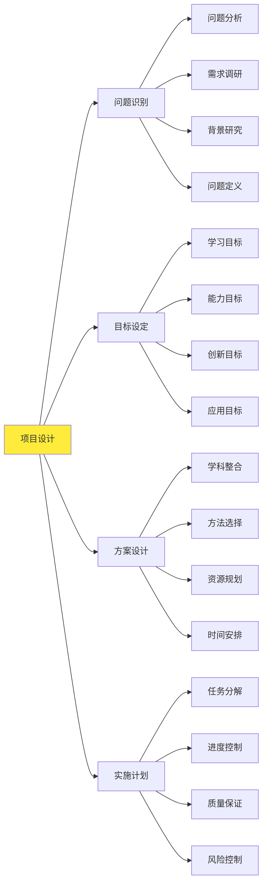

#### 22.2 学科整合关联网络

| 整合类型 | 核心概念 | 基础概念 | 关联概念 | 应用领域 | 认知难点 |
|---------|----------|----------|----------|----------|----------|
| **STEM整合** | 科学工程 | 数学基础、技术应用 | 创新设计、问题解决 | 科技创新 | 学科边界 |
| **STEAM整合** | 艺术融合 | 创意表达、审美体验 | 人文关怀、文化传承 | 创意设计 | 艺术融合 |
| **社会整合** | 社会问题 | 社会分析、政策研究 | 社会参与、公民责任 | 社会服务 | 复杂性 |
| **环境整合** | 可持续发展 | 生态保护、资源利用 | 环境意识、绿色理念 | 环境保护 | 系统性 |

### 23. 跨学科项目知识发展路径

**📈 跨学科项目概念发展轨迹**

#### 23.1 项目能力发展路径

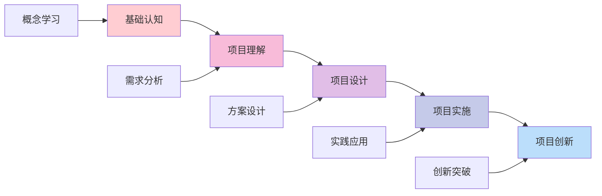

#### 23.2 跨学科能力发展

| 发展阶段 | 认知特征 | 能力表现 | 教学重点 | 评估标准 |
|---------|----------|----------|----------|----------|
| **认知阶段** | 概念理解 | 基础认知 | 概念教学 | 理解准确性 |
| **设计阶段** | 方案设计 | 项目设计 | 设计教学 | 设计合理性 |
| **实施阶段** | 实践应用 | 项目实施 | 实践教学 | 实施效果 |
| **创新阶段** | 创新思维 | 项目创新 | 创新教学 | 创新能力 |
| **整合阶段** | 综合应用 | 综合能力 | 整合教学 | 整合能力 |

### 24. 国际化跨学科项目教学内容

**🌍 国际跨学科项目课程标准对比**

#### 24.1 美国Project-Based Learning标准

**📊 核心内容领域**:

| 内容领域 | 核心概念 | 技能要求 | 应用能力 | 评估标准 |
|---------|----------|----------|----------|----------|
| **项目设计** | 设计思维 | 设计方法 | 设计应用 | 设计能力 |
| **学科整合** | 整合思维 | 整合方法 | 整合应用 | 整合能力 |
| **实践应用** | 实践技能 | 实践方法 | 实践应用 | 实践能力 |
| **创新思维** | 创新思维 | 创新方法 | 创新应用 | 创新能力 |

#### 24.2 芬兰Phenomenon-Based Learning特色

**🎯 芬兰现象学习教学方法**:

1. **现象识别方法**
   - 真实现象观察
   - 现象问题分析
   - 现象背景研究
   - 现象价值评估

2. **跨学科探究方法**
   - 多学科视角
   - 学科知识整合
   - 综合问题解决
   - 创新方案设计

3. **实践应用方法**
   - 实地考察
   - 实验验证
   - 社会调查
   - 成果展示

### 25. 跨学科项目知识关联深度分析

**🔗 跨领域知识关联**

#### 25.1 跨学科项目与核心学科的关联

| 项目类型 | 学科背景 | 关联深度 | 教学策略 | 学习效果 |
|---------|----------|----------|----------|----------|
| **科技创新项目** | STEM学科 | 深度关联 | 学科整合 | 理解深化 |
| **社会服务项目** | 人文社科 | 直接应用 | 社会分析 | 应用能力 |
| **环境保护项目** | 自然科学 | 方法迁移 | 环境探究 | 思维培养 |
| **文化传承项目** | 文化艺术 | 概念统一 | 多表征 | 综合能力 |

#### 25.2 跨学科项目与能力培养的关联

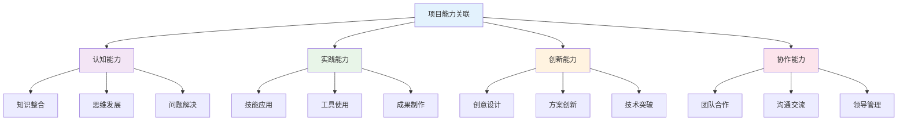

### 26. 跨学科项目实践教学体系

**📖 基于知识图谱的实践教学**

#### 26.1 项目设计技能发展

| 设计技能 | 技能内容 | 发展要求 | 评估方法 | 应用领域 |
|---------|----------|----------|----------|----------|
| **需求分析** | 问题识别 | 准确性 | 分析测试 | 项目规划 |
| **方案设计** | 方案制定 | 合理性 | 设计测试 | 项目设计 |
| **资源整合** | 资源调配 | 有效性 | 整合测试 | 项目实施 |
| **创新设计** | 创新方案 | 创新性 | 创新测试 | 项目创新 |

#### 26.2 跨学科项目教学创新

**🎯 现代跨学科项目教学方法**:

1. **数字化项目环境**
   - 虚拟实验室
   - 在线协作平台
   - 项目管理工具
   - 数字展示平台

2. **多媒体项目教学**
   - 项目视频
   - 交互式演示
   - 3D项目模型
   - 项目动画

3. **创新项目设计**
   - 创客空间
   - 创新实验室
   - 项目孵化器
   - 成果展示会

### 27. 跨学科项目学习评估体系

**📊 基于知识图谱的评估框架**

#### 27.1 项目能力评估

| 评估维度 | 评估内容 | 评估方法 | 评估标准 | 发展指标 |
|---------|----------|----------|----------|----------|
| **设计能力** | 项目设计 | 设计评估 | 设计合理 | 设计能力 |
| **实施能力** | 项目实施 | 实施评估 | 实施有效 | 实施能力 |
| **创新能力** | 项目创新 | 创新评估 | 创新质量 | 创新能力 |
| **协作能力** | 团队协作 | 协作评估 | 协作效果 | 协作能力 |

#### 27.2 综合项目评估

**🎯 跨学科项目综合能力评估矩阵**:

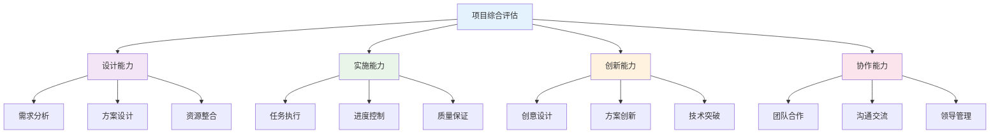

### 28. 跨学科项目教育国际化发展

**🌍 国际跨学科项目教育趋势**

#### 28.1 全球跨学科项目教育标准

| 标准体系 | 核心理念 | 内容特点 | 评估方式 | 发展趋势 |
|---------|----------|----------|----------|----------|
| **美国PBL** | 问题导向 | 项目设计 | 项目评估 | 技术整合 |
| **芬兰PBL** | 现象学习 | 真实情境 | 综合评估 | 体验导向 |
| **英国IS** | 学科整合 | 深度探究 | 过程评估 | 理论发展 |
| **国际PBL** | 全球视野 | 跨文化 | 综合评估 | 国际胜任力 |

#### 28.2 跨学科项目教育技术整合

**💻 数字化跨学科项目教育**:

1. **智能学习系统**
   - 个性化项目指导
   - 自适应学习路径
   - 实时项目反馈

2. **虚拟学习环境**
   - 虚拟项目实验室
   - 在线协作空间
   - 项目展示平台

3. **多媒体教学平台**
   - 项目资源库
   - 协作工具集
   - 展示工具集

---
